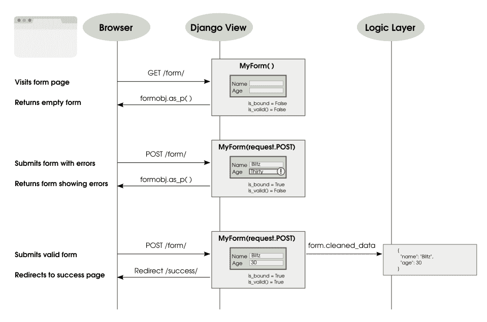
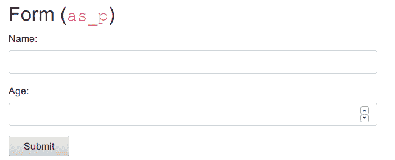
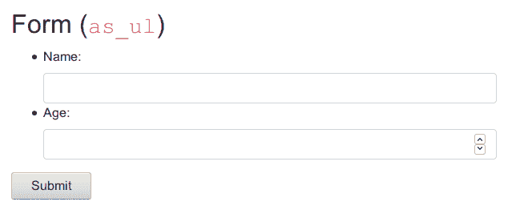
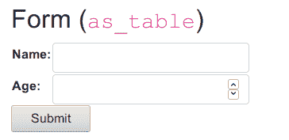

# 七、表单

在本章中，我们将讨论以下主题：

*   表单工作流
*   不可信输入
*   基于类视图的表单处理
*   使用 CRUD 视图

让我们把 Django 表单放在一边，总体上讨论 web 表单。表单不仅仅是长而无聊的页面，上面有几个你必须填写的字段。形式无处不在。我们每天都使用它们。从谷歌的搜索框到 Facebook 的 Like 按钮，表单为一切提供了动力。

Django 在处理诸如验证或表示之类的表单时，对大部分繁重的工作进行了抽象。它还实现了各种安全最佳实践。然而，表格也是造成混淆的常见原因，因为它们可能位于几个州中的一个州。让我们更仔细地检查一下。

# 表单如何工作

表单可能很难理解，因为与表单交互需要一个以上的请求-响应周期。在最简单的场景中，您需要呈现一个空表单，然后用户正确填写并提交该表单。相反，他们可能输入一些无效数据，在这种情况下，需要重新提交表单，直到整个表单有效。

从这个场景中，我们可以看到一个表单可以是几个状态之一，在它们之间变化：

*   **空表单（未填充表单）**：此表单在 Django 中称为未绑定表单
*   **填表**：此表在 Django 中称为绑定表
*   **提交表单有错误**：此表单称为绑定表单，但不是有效表单
*   **提交无误表单**：此表单称为绑定有效表单

用户永远不会看到处于*已提交表单状态的表单没有错误*状态。他们不必这么做。通常，提交一个有效的表单会让用户进入一个成功页面。

# Django 格式

Django 的表单类实例包含每个字段的状态，并通过将它们汇总到一个级别来包含表单本身的状态。表单有两个重要的状态属性，如下所示：

*   `is_bound`：如果返回 false，则为未绑定表单，即具有空或默认字段值的新表单。如果返回 true，则窗体被绑定，即至少有一个字段已使用用户输入设置。
*   `is_valid()`：如果返回 true，则绑定表单中的每个字段都有有效数据。如果为 false，则至少有一个字段中存在无效数据，或者表单未绑定。

例如，假设您需要一个接受用户名和年龄的简单表单。`forms`类可以定义如下（参见`formschapter/forms.py`中的代码）：

```py
from django import forms 

class PersonDetailsForm(forms.Form): 
    name = forms.CharField(max_length=100) 
    age = forms.IntegerField() 
```

此类可以以绑定或未绑定的方式启动，如以下代码所示：

```py
>>> f = PersonDetailsForm()
>>> print(f.as_p())
<p><label for="id_name">Name:</label> <input type="text" name="name" maxlength="100" required id="id_name" /></p>
<p><label for="id_age">Age:</label> <input type="number" name="age" required id="id_age" /></p>

>>> f.is_bound
False

>>> g = PersonDetailsForm({"name": "Blitz", "age": "30"})
>>> print(g.as_p())
<p><label for="id_name">Name:</label> <input type="text" name="name" value="Blitz" maxlength="100" required id="id_name" /></p>
<p><label for="id_age">Age:</label> <input type="number" name="age" value="30" required id="id_age" /></p>

>>> g.is_bound
True 
```

注意 HTML 表示是如何更改的，以包括带有绑定数据的`value`属性。

只有在构造函数中创建`form`对象时，才能绑定表单。用户输入如何在一个包含每个表单字段值的类似字典的对象中结束？

要了解这一点，您需要了解用户如何与表单交互。在下图中，用户打开一个人的详细信息表单，首先错误地填写表单，然后提交表单，然后使用有效信息重新提交表单：



典型的提交和处理表单

如上图所示，当用户提交表单时，view callable 获取`request.POST`（一个`QueryDict`实例）内的所有表单数据。表单使用这个类似于字典的对象进行初始化，以这种方式引用，因为它的行为类似于字典，并且具有一些额外的功能。

可以定义表单，以便以两种不同的方式发送表单数据：`GET`或`POST`。使用`METHOD="GET"`定义的表单发送 URL 本身编码的表单数据。例如，当您提交谷歌搜索时，您的 URL 将有您的表单输入，也就是说，搜索字符串明显嵌入在 URL 中，例如`?q=Cat+Pictures`。`GET`方法用于幂等形式，它不会对世界状态产生任何持久的变化（或者更迂腐一些，多次处理该形式与处理一次具有相同的效果）。对于大多数情况，这意味着它仅用于检索数据。

然而，绝大多数表单都是用`METHOD="POST"`定义的。在本例中，表单数据随 HTTP 请求主体一起发送，用户看不到。它们用于任何涉及副作用的事情，例如创建或更新数据。

根据您定义的表单类型，当用户提交表单时，视图将在`request.GET`或`request.POST`中接收表单数据。如前所述，它们中的任何一个都类似于字典，因此您可以将其传递给`form`类构造函数以获得绑定的`form`对象。

缺口

史蒂夫蜷缩在他的三座大沙发上，鼾声重重。在过去的几个星期里，他在办公室呆了 12 个多小时，今晚也不例外。他放在地毯上的手机发出嘟嘟声。起初，他说了一些语无伦次的话，仍在沉睡中。然后，它一次又一次地发出嘟嘟声，越来越紧迫。

听到第五声嘟嘟声，史蒂夫惊醒了。他疯狂地在沙发上到处找，最后在地板上找到了他的手机。屏幕上显示了一个色彩鲜艳的条形图。每个酒吧似乎都触顶，只有一个例外。他拿出笔记本电脑，登录到 SuperBook 服务器。现场已关闭，没有任何日志显示有任何异常活动。然而，外部服务看起来并没有那么好。
另一端的电话似乎永远响个不停，直到一个刺耳的声音回答：*“你好，史蒂夫？”*。
半小时后，雅各布能够将问题归零到一个反应迟钝的超级英雄验证服务。*“这不是在索伦身上运行吗？”*史蒂夫问。有一个短暂的犹豫。*“恐怕是这样，*雅各布回答。

史蒂夫的胃部有一种下沉的感觉。大型机应用软件 Sauron 是他们抵御网络攻击和其他可能攻击的第一道防线。他通知任务控制小组的时间是凌晨三点。雅各布一直和他聊天。他正在运行所有可用的诊断工具。没有任何安全漏洞的迹象。

史蒂夫试图让他冷静下来。他向他保证，这可能是暂时的超负荷，他应该休息一下。然而，他知道雅各布不会停止，直到他发现什么是错的。他也知道，索伦并不是一个典型的临时超载者。他感到筋疲力尽，又溜回去睡觉了。

第二天早上，当史蒂夫拿着一个百吉饼急忙赶到他的办公楼时，他听到一声震耳欲聋的吼声。他转过身来，抬起头，看到一艘巨大的宇宙飞船在他身上隐约出现。他本能地躲到树篱后面。在树篱的另一边，他能听到几个重金属物体在地上叮当作响。就在那时，他的手机响了。是雅各布。有什么东西离他越来越近了。史蒂夫抬头一看，他看到一个近 10 英尺高的机器人，橙色和黑色相间，正朝着他指着一个看起来像武器的东西。他的电话还在响。他冲向空旷的地方，几乎没有错过周围飞溅的子弹。他接了电话。

“嘿，史蒂夫，猜猜看，我发现了到底发生了什么。”“我非常想知道，”史蒂夫打趣道。

“记得我们用 UserHoller 的表单小部件收集客户反馈吗？显然，他们的数据没有那么干净。我指的是一些严重的漏洞。嘿，有很多背景噪音。那是电视吗？”

史蒂夫朝一个写着“安全集合点”的大标志俯冲过去。

“别理它，告诉我发生了什么，”他尖叫道。

“好的。所以，当我们的管理员打开反馈页面时，他的笔记本电脑一定被感染了。蠕虫可以到达他可以访问的其他系统，特别是索伦。我必须说史蒂夫，这是一次非常有针对性的攻击。一个非常了解我们安全系统的人设计了这个。我感觉有什么可怕的东西正朝我们走来。”

穿过草坪，一个机器人捡起一辆 SUV 朝史蒂夫扔去。史蒂夫举起手，闭上眼睛。旋转的金属块在他上方几英尺的地方冻结了。

“重要的电话？”Hexa 放下汽车时问道。

“是的，请带我离开这里，”史蒂夫恳求道。

# 为什么数据需要清理？

最后，您需要从表单中获取清理后的数据。这是否意味着用户输入的值不干净？是的，有两个原因。

首先，任何来自外部世界的东西最初都不应该被信任。恶意用户可以通过表单进行各种攻击，从而破坏网站的安全性。因此，在使用任何表单数据之前，都必须对其进行清理。

最佳实践

永远不要相信用户的输入。

其次，`request.POST`和`request.GET`中的字段值只是字符串。即使表单字段可以定义为整数（比如年龄）或日期（比如生日），浏览器也会将它们作为字符串发送到视图中。您总是希望在使用之前将它们转换为适当的 Python 类型。`form`类在清洁时自动为您进行此转换。

让我们看看这一点：

```py
>>> fill = {"name": "Blitz", "age": "30"} 

>>> g = PersonDetailsForm(fill) 

>>> g.is_valid() 
 True 

>>> g.cleaned_data 
 {'age': 30, 'name': 'Blitz'} 

>>> type(g.cleaned_data["age"]) 
 int 
```

`age`值作为字符串（可能是从`request.POST`传递到`form`类）。验证后，清理后的数据包含整数形式的年龄。这正是你所期望的。表单试图抽象掉字符串被传递的事实，并为您提供可以使用的干净 Python 对象。

始终使用表单中的`cleaned_data`，而不是用户提供的原始数据。

# 展示表格

Django 表单还可以帮助您创建表单的 HTML 表示。它们支持三种不同的表示：`as_p`（作为段落标记）、`as_ul`（作为无序列表项）和`as_table`（作为表，这并不奇怪）。

下表总结了每个表示的模板代码、生成的 HTML 代码和浏览器呈现：

| 样板 | 密码 | 浏览器中的输出 |
| `{{ form.as_p }}` | 

```py
<p><label   for="id_name">Name:</label> <input type="text" name="name"   maxlength="100" required id="id_name" /></p>   
<p><label   for="id_age">Age:</label> <input type="number" name="age"   required id="id_age" /></p>   
```

 |  |
| `{{ form.as_ul }}` | 

```py
<li><label   for="id_name">Name:</label> <input type="text" name="name"   maxlength="100" required id="id_name" /></li>   
<li><label   for="id_age">Age:</label> <input type="number" name="age"   required id="id_age" /></li>   
```

 |  |
| `{{ form.as_table }}` | 

```py
<tr><th><label   for="id_name">Name:</label></th><td><input type="text"   name="name" maxlength="100" required id="id_name" /></td></tr>   
<tr><th><label   for="id_age">Age:</label></th><td><input type="number"   name="age" required id="id_age" /></td></tr>   
```

 |  |

请注意，HTML 表示只提供了`form`字段。这使得在一个 HTML 表单中包含多个 Django 表单变得更容易。但是，这也意味着模板设计器要为每个表单编写相当多的样板文件，如以下代码所示：

```py
<form method="post"> 
   
  <table>{{ form.as_table }}</table> 
  <input type="submit" value="Submit" /> 
</form> 
```

要使 HTML 表示完整，您需要添加周围的`form`标记、一个`csrf_token`、`table`或`ul`标记以及提交按钮。

# 该变脆了

在模板中为每个表单编写这么多样板文件会让人感到厌烦。[django crispy forms](http://django-crispy-forms.readthedocs.io/)包使表单模板代码更加清晰（即简洁）。它将所有的表示和布局移动到 Django 表单本身中。通过这种方式，您可以编写更多的 Python 代码和更少的 HTML。

下表显示，`crispy form`模板标记生成更完整的表单，并且外观更符合引导样式：

| `Template` | `Code` | `Output in Browser` |
| `` | 

```py
<form method="post">   
<input type='hidden'   name='csrfmiddlewaretoken' value='...' />   
<div id="div_id_name"   class="form-group">   
<label for="id_name"   class="control-label  requiredField">   
Name<span   class="asteriskField">*</span></label>   
<div class="controls   ">   
<input   class="textinput textInput form-control form-control" id="id_name" maxlength="100"   name="name" type="text" /> </div></div> ...   
```

（为简洁起见，HTML 被截断） |  |

那么，怎样才能得到更脆的表单呢？您需要安装`django-crispy-forms`软件包并将其添加到您的`INSTALLED_APPS`。如果您使用 Bootstrap 4，则需要在设置中提及：

```py
CRISPY_TEMPLATE_PACK = "bootstrap4" 
```

表单初始化需要提到一个`FormHelper `类型的`helper`属性。`formschapter/forms.py`中的以下代码旨在最小化并使用默认布局：

```py
from crispy_forms.helper import FormHelper 
from crispy_forms.layout import Submit 

class PersonDetailsForm(forms.Form): 
    name = forms.CharField(max_length=100) 
    age = forms.IntegerField() 

    def __init__(self, *args, **kwargs): 
        super().__init__(*args, **kwargs) 
        self.helper = FormHelper(self) 
        self.helper.layout.append(Submit('submit', 'Submit')) 
```

有关更多详细信息，请阅读`django-crispy-forms`包[文档](http://django-crispy-forms.readthedocs.io/)。

# 理解 CSRF

您一定注意到表单模板中有一个名为**跨站点请求伪造**（**CSRF**）的令牌。它有什么作用？它是一种针对表单的 CSRF 攻击的安全机制。

它的工作原理是注入服务器生成的随机字符串，称为 CSRF 令牌，这是用户会话所特有的。每次提交表单时，它必须有一个包含此令牌的隐藏字段。此令牌确保表单是由原始站点为用户生成的，并证明它不是由具有类似字段的攻击者创建的假表单。

对于使用`GET`方法的表单，不建议使用 CSRF 令牌，因为`GET`操作不应更改服务器状态。此外，通过`GET`提交的表单将在 URL 中公开 CSRF 令牌。由于 URL 有更高的被记录或嗅探的风险，因此最好在使用`POST`方法的表单中使用 CSRF。

# 基于类视图的表单处理

我们基本上可以通过对`View`类本身进行子类化来处理表单：

```py
class ClassBasedFormView(generic.View): 
    template_name = 'form.html' 

    def get(self, request): 
        form = PersonDetailsForm() 
        return render(request, self.template_name, {'form': form}) 

    def post(self, request): 
        form = PersonDetailsForm(request.POST) 
        if form.is_valid(): 
            # Success! We can use form.cleaned_data now 
            return redirect('success') 
        else: 
            # Invalid form! Reshow the form with error highlighted 
            return render(request, self.template_name, 
                          {'form': form}) 
```

将此代码与我们前面看到的序列图进行比较。这三种情况已分别处理。

每个表单都需要遵循**post**/**重定向**/**get**（**PRG**模式。如果发现提交的表单有效，则必须发出重定向。这样可以防止重复的表单提交。

然而，这不是一个非常枯燥的代码。`form`类名和`template_name`属性已经重复。使用基于类的通用视图（如`FormView`可以减少表单处理的冗余。以下代码将提供与前一代码相同的功能，并且代码行数更少：

```py
from django.urls import reverse_lazy 

class GenericFormView(generic.FormView): 
    template_name = 'form.html' 
    form_class = PersonDetailsForm 
    success_url = reverse_lazy("success") 
```

在这种情况下我们需要使用`reverse_lazy`，因为导入`View`文件时没有加载 URL 模式。

# 形成模式

让我们看看在使用窗体时使用的一些常见模式。

# 模式-动态表单生成

**问题**：动态添加表单字段或更改已声明的表单字段。

**解决方案**：表单初始化时增加或更改字段。

# 问题详情

表单通常以声明式样式定义，表单字段列为`class`字段。然而，有时我们事先不知道这些字段的数量或类型。这要求动态生成表单。此模式有时称为动态表单或运行时表单生成。

想象一个机场航班的旅客值机系统，该系统允许将经济舱机票升级到头等舱。如果还有头等舱的座位，那么它应该向用户显示一个附加选项，询问他们是否愿意升级到头等舱。但是，无法声明此可选字段，因为它不会显示给所有用户。这种动态形式可以通过这种模式来处理。

# 解决方案详细信息

每个表单实例都有一个名为`fields`的属性，这是一个包含所有`form`字段的字典。这可以在运行时修改。可以在表单初始化期间添加或更改字段。

例如，如果只有在表单初始化时名为`"upgrade"`的关键字参数为 true 时，我们才需要在用户详细信息表单中添加复选框，那么我们可以如下实现：

```py
class PersonDetailsForm(forms.Form): 
    name = forms.CharField(max_length=100) 
    age = forms.IntegerField() 

    def __init__(self, *args, **kwargs): 
        upgrade = kwargs.pop("upgrade", False) 
        super().__init__(*args, **kwargs) 

        # Show first class option? 
        if upgrade: 
            self.fields["first_class"] = forms.BooleanField( 
                label="Fly First Class?") 
```

现在，我们只需要传递`PersonDetailsForm(upgrade=True)`关键字参数，以显示一个额外的布尔输入字段（复选框）。

在调用`super`之前，必须删除或弹出新引入的关键字参数，以避免`unexpected keyword`错误。

如果在本例中使用`FormView`类，则需要通过重写`View`类的`get_form_kwargs`方法来传递关键字参数，如下代码所示：

```py
class PersonDetailsEdit(generic.FormView): 
    ... 

    def get_form_kwargs(self): 
        kwargs = super().get_form_kwargs() 
        kwargs["upgrade"] = True 
        return kwargs 
```

此模式可用于在运行时更改字段的任何`attribute`，例如其小部件或帮助文本。它也适用于模型表单。

在许多情况下，使用 Django 表单集可以解决对动态表单的需求。当表单需要在页面中重复时，可以使用它们。表单集的一个典型用例是在设计类似于数据网格的视图以逐行添加元素时。这样，您就不需要创建具有任意行数的动态表单；您只需要为该行创建一个表单，并使用`formset_factory`函数创建多行。

# 模式-基于用户的表单

**问题**：表单需要根据登录用户进行定制。

**解决方案**：将登录用户的特征作为关键字参数传递给表单的初始值设定项。

# 问题详情

表单可以根据用户以不同的方式呈现。某些用户可能不需要填写所有字段，而某些其他用户可能需要添加其他信息。在某些情况下，您可能需要对用户的资格进行一些检查，例如验证他们是否是组的成员，以确定表单的构造方式。

# 解决方案详细信息

正如您一定注意到的，您可以使用动态表单生成模式中给出的解决方案来解决这个问题。您只需要将`request.user`或其任何特征作为关键字参数传递给表单。我建议后者尽量减少视图和表单之间的耦合。

与前面的示例一样，我们需要向用户显示一个附加的复选框。但是，仅当用户是`"VIP"`组的成员时，才会显示此信息。

让我们看一下如何将派生的视图传递给窗体：

```py
class GenericFormView(generic.FormView): 
    template_name = 'cbv-form.html' 
    form_class = PersonDetailsForm 
    success_url = reverse_lazy("home") 

    def get_form_kwargs(self): 
        kwargs = super().get_form_kwargs() 
        # Check if the logged-in user is a member of "VIP" group 
        kwargs["vip"] = self.request.user.groups.filter(
            name="VIP").exists() 
        return kwargs 
```

在这里，我们重新定义了`FormView`在实例化表单以返回关键字参数之前调用的`get_form_kwargs`方法。这是检查用户是否属于`VIP`组并传递适当的关键字参数的理想点。

与前面一样，表单可以检查是否存在`vip`关键字参数（就像我们对`upgrade`所做的那样），并显示一个复选框以升级到第一类。

# 模式–每个视图有多个表单操作

**问题**：在一个视图或页面中处理多个表单动作。

**解决方案**：表单可以使用单独的视图来处理表单提交，或者单个视图可以根据提交按钮的名称识别表单。

# 问题详情

Django 使将多个表单与同一个操作相结合变得相对简单，就像一个提交按钮。但是，大多数 web 页面需要在同一页面上显示多个操作。例如，您可能希望用户使用同一页面上显示的两种不同表单订阅或取消订阅新闻稿。

然而，Django 的`FormView`设计为每个视图场景只处理一个表单。许多其他基于类的泛型视图也同意这一假设。

# 解决方案详细信息

处理多个表单有两种方法：使用单独的视图和使用单个视图。让我们来看看第一种方法。

# 单独的视图用于单独的操作

这是一种相当简单的方法，每个表单都指定不同的视图作为其操作。例如，以订阅和取消订阅表单为例。可以有两个单独的视图类来处理各自表单中的`POST`方法。

# 相同的视图用于单独的操作

也许您发现不需要拆分视图来处理表单，或者您发现在公共视图中处理逻辑上相关的表单更优雅。无论哪种方式，我们都可以绕过基于类的通用视图的限制来处理多个表单。

当对多个表单使用同一视图类时，挑战在于确定哪个表单发出了`POST`操作。在这里，我们利用了`Submit`按钮的名称和值也被提交的事实。如果`Submit`按钮在表单中的名称是唯一的，则可以在处理时识别表单。

在这里，我们使用 crispy forms 定义了一个`SubscribeForm`，这样我们也可以命名 Submit 按钮：

```py
class SubscribeForm(forms.Form): 
    email = forms.EmailField() 

    def __init__(self, *args, **kwargs): 
        super().__init__(*args, **kwargs) 
        self.helper = FormHelper(self) 
        self.helper.layout.append(Submit('subscribe_butn', 'Subscribe')) 
```

`UnSubscribeForm`类的定义方式完全相同（因此省略），只是它的`Submit`按钮名为`unsubscribe_butn`。

因为`FormView`是为单个表单设计的，所以我们将使用一个更简单的基于类的视图，比如`TemplateView`作为视图的基础。让我们来看一下视图定义和 OLE T2AY 方法：

```py
from .forms import SubscribeForm, UnSubscribeForm 

class NewsletterView(generic.TemplateView): 
    subcribe_form_class = SubscribeForm 
    unsubcribe_form_class = UnSubscribeForm 
    template_name = "newsletter.html" 

    def get(self, request, *args, **kwargs): 
        kwargs.setdefault("subscribe_form", self.subcribe_form_class()) 
        kwargs.setdefault("unsubscribe_form", self.unsubcribe_form_class()) 
        return super().get(request, *args, **kwargs) 
```

这两个表单作为关键字参数插入，从而进入模板上下文。在`setdefault`字典方法的帮助下，我们只在两种形式都不存在的情况下创建它们的未绑定实例。我们很快就会明白原因。

接下来，我们将看一看`POST`方法，该方法处理来自任何一种形式的提交：

```py
    def post(self, request, *args, **kwargs): 
        form_args = { 
            'data': self.request.POST, 
            'files': self.request.FILES, 
        } 
        if "subscribe_butn" in request.POST: 
            form = self.subcribe_form_class(**form_args) 
            if not form.is_valid(): 
                return self.get(request, 
                                   subscribe_form=form) 
            return redirect("success_form1") 
        elif "unsubscribe_butn" in request.POST: 
            form = self.unsubcribe_form_class(**form_args) 
            if not form.is_valid(): 
                return self.get(request, 
                                   unsubscribe_form=form) 
            return redirect("success_form2") 
        return super().get(request) 
```

首先，表单关键字参数，如`data`和`files`填充在`form_args`字典中。接下来，在`request.POST`中检查是否存在第一个表单的订阅按钮。如果找到按钮的名称，则实例化第一个表单。

如果表单验证失败，则返回由`GET`方法创建的带有第一个表单实例的响应。同样，我们会查找第二个表单的“取消订阅”按钮，以检查第二个表单是否已提交。

同一视图中同一表单的实例可以使用表单前缀以相同的方式实现。您可以使用前缀参数（如`SubscribeForm(prefix="offers")`）实例化表单。这样的实例将使用给定的参数作为其所有表单字段的前缀，有效地像表单名称空间一样工作。通常，可以使用前缀在同一页面中嵌入多个表单。

# 模式–积垢视图

**问题**：为模型的 CRUD 接口编写样板文件变得重复。

**解决方案**：使用基于类的通用编辑视图。

# 问题详情

在传统的 web 应用中，大部分时间都花在为数据库编写 CRUD 接口上。例如，Twitter 本质上涉及到创建和阅读彼此的 tweet。在这里，tweet 将是被操作和存储的数据库对象。

从头开始编写这样的接口可能会变得单调乏味。如果可以从模型类本身自动创建 CRUD 接口，则可以轻松管理此模式。

# 解决方案详细信息

Django 使用一组四个基于类的通用视图简化了创建 CRUD 视图的过程。它们可以映射到相应的操作，如下所示：

*   `CreateView`：此视图显示一个空白表单，用于创建新的模型实例
*   `DetailView`：此视图通过从数据库读取来显示对象的详细信息
*   `UpdateView`：此视图允许您通过预填充表单更新对象的详细信息
*   `DeleteView`：此视图显示一个确认页面，并在批准时从数据库中删除该对象

让我们来看一个简单的例子。我们有一个模型，其中包含每个使用我们网站的人感兴趣的事件的重要日期。我们需要构建简单的 CRUD 接口，以便任何人都可以查看和修改这些日期。让我们来看看在 OutT1 中定义的 AutoT0.模型如下：

```py
class ImportantDate(models.Model): 
    date = models.DateField() 
    desc = models.CharField(max_length=100) 

    def get_absolute_url(self): 
        return reverse('impdate_detail', args=[str(self.pk)]) 
```

`get_absolute_url()`方法用于`CreateView`和`UpdateView`类在成功创建或更新对象后重定向。它已被路由到对象的`DetailView`。

CRUD 视图本身非常简单，可以自我解释，如`formschapter/views.py`中的以下代码所示：

```py
class ImpDateDetail(generic.DetailView): 
    model = models.ImportantDate 

class ImpDateCreate(generic.CreateView): 
    model = models.ImportantDate 
    form_class = ImportantDateForm 

class ImpDateUpdate(generic.UpdateView): 
    model = models.ImportantDate 
    form_class = ImportantDateForm 

class ImpDateDelete(generic.DeleteView): 
    model = models.ImportantDate 
    success_url = reverse_lazy("formschapter:impdate_list") 
```

在这些通用视图中，模型类是唯一需要提及的必需成员。然而，在`DeleteView`的情况下，也需要提及`success_url`功能。这是因为删除后，`get_absolute_url`不能再用于查找重定向用户的位置。

定义`form_class`属性不是强制性的。如果省略，将创建与指定模型对应的`ModelForm`方法。但是，我们希望创建自己的模型表单，以利用 crispy 表单，如`formschapter/forms.py`中的以下代码所示：

```py
from django import forms 
from . import models 
from crispy_forms.helper import FormHelper 
from crispy_forms.layout import Submit

class ImportantDateForm(forms.ModelForm): 
    class Meta: 
        model = models.ImportantDate 
        fields = ["date", "desc"] 

    def __init__(self, *args, **kwargs): 
        super().__init__(*args, **kwargs)
```

```py
        self.helper = FormHelper(self) 
        self.helper.layout.append(Submit('save', 'Save')) 
```

多亏了 crispy 表单，我们在模板中只需要很少的 HTML 标记就可以构建这些 CRUD 表单。

明确提及`ModelForm`方法的字段是最佳实践。将字段设置为`'__all__'`可能很方便，但可能会无意中暴露敏感数据，尤其是在向模型添加新字段后。

默认情况下，模板路径基于视图类和模型名称。为了简洁起见，我们在这里省略了模板源代码。请参考 SuperBook 项目中`formschapter`应用中的`templates`目录。我们对`CreateView`和`UpdateView`使用相同的形式。

最后，我们来看看`formschapter/urls.py`，这里所有的东西都连接在一起：

```py
    path('impdates/<int:pk>/', 
         views.ImpDateDetail.as_view(), 
         name="impdate_detail"), 

    path('impdates/create/', 
         views.ImpDateCreate.as_view(), 
         name="impdate_create"), 

    path('impdates/<int:pk>/edit/', 
         views.ImpDateUpdate.as_view(), 
         name="impdate_update"), 

    path('impdates/<int:pk>/delete/', 
         views.ImpDateDelete.as_view(), 
         name="impdate_delete"), 

    path('impdates/', 
         views.ImpDateList.as_view(), 
         name="impdate_list"), 

```

Django 通用视图是开始为您的模型创建 CRUD 视图的好方法。只需几行代码，就可以为您创建经过良好测试的模型表单和视图，而不是自己完成枯燥的任务。

# 总结

在本章中，我们了解了 web 表单是如何工作的，以及它们是如何使用 Django 中的表单类进行抽象的。我们还研究了在使用表单时用于节省时间的各种技术和模式。

在下一章中，我们将介绍一种使用遗留 Django 代码库的系统方法，以及如何增强它以满足不断变化的客户需求。