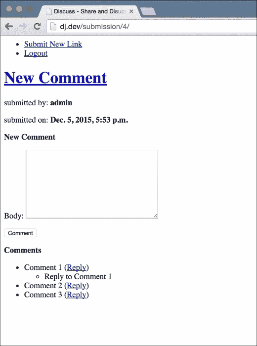
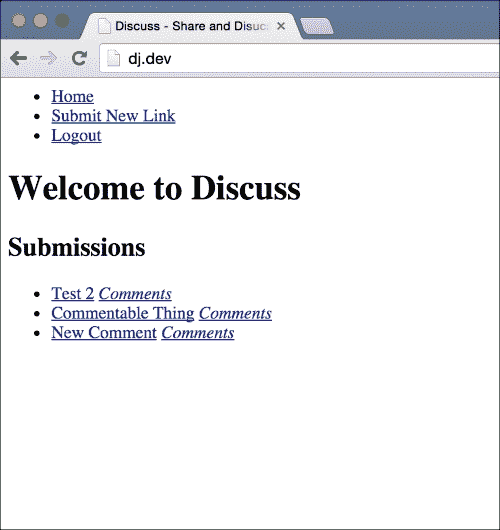
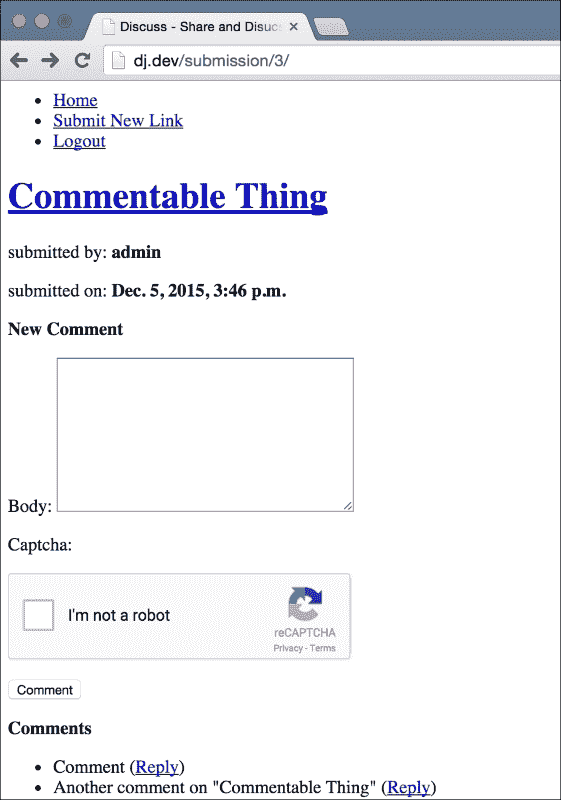

# 二、讨论——HackerNews 的克隆

在本章中，我们将创建一个类似于 Hacker News 或 Reddit 的 web 应用程序，用户可以在其中共享和讨论指向 web 内容的链接。我们将调用应用程序*讨论*。为了让事情保持简单，我们将模仿黑客新闻的简约外观，它是纯文本的，并且有一个非常简单的界面。另一方面，Reddit 在视觉上更加丰富，并且有很多我们不会添加到我们网站的额外功能。

以下是我们将在本章中介绍的内容的概要：

*   允许用户提交自己的内容
*   允许用户对其他用户提交的内容进行投票
*   基于简单算法对用户提交的内容进行排名
*   防止垃圾邮件发送者使用 CAPTCHA 滥用我们的网站

# 章节代码包

如果您已经开发了一些 Django 应用程序，您可能会知道，对于大多数应用程序，启动时执行的许多代码和配置都是相同的。您以同样的方式设置数据库，可能会更改**数据库**（**DB**）名称和用户/通行证对，设置您的媒体、静态 URL 和根路径，然后使用内置`auth contrib`应用程序和提供的视图添加用户身份验证，只创建足够好的最小模板，以便一开始就完成工作。

在每一章的开头，带你浏览基本设置，对你阅读和我写作来说都是非常无聊的。相反，我提供了我称之为**的代码包**。这些是包含已经设置好的 Django 应用程序的`zip`文件，这样我们就可以直接跳转到代码的有趣部分，而不必一次又一次地经历繁琐的设置过程。

别担心，我不会跳过任何我们还没有看过的 Django 新特性。每个代码包都包含前面章节中已经向您解释过的代码。例如，本章的代码包包含一个 Django 应用程序，该应用程序已经设置了用户注册、登录和注销视图、模板和 URL。这是我们在上一章中已经详细介绍过的内容。

要使用这些代码包，您需要下载它们，在项目根文件夹中解压缩它们，并为它们创建一个虚拟环境。然后，需要运行以下命令才能在新的虚拟环境中安装 Django：

```py
> pip install django
> python manage.py migrate

```

完成所有这些步骤后，就可以开始处理应用程序中有趣的部分了。在接下来的所有章节中，我已经为您提供了代码包的链接，并且我假设您已经为它提取并设置了一个虚拟环境。

### 提示

如果您不确定如何使用代码包，则每个 ZIP 文件中都有`Readme.txt`。您应该阅读本文，了解如何开始使用代码包。

# 要求

对于任何复杂的应用程序，在开始编写代码之前，最好先了解需要处理的功能。让我们看看我们想在本章中创建什么。

我们希望有一个基于 Django 的链接共享和讨论网站，比如 Hacker News。该网站应该有用户帐户，允许用户共享链接，有一个页面，这些链接按一定的顺序列出，并允许用户对这些链接进行投票和评论。

此外，我们希望有防范垃圾邮件发送者和恶意用户的措施，如果不加检查，他们会降低我们网站的内容质量。

以下是我们希望应用程序提供的特性列表：

*   用户注册和身份验证（已在代码包中提供）
*   用户提交的链接
*   对其他用户提交的链接进行投票
*   评论提交的内容并回复其他用户的评论
*   一种算法，按照一些定义的顺序对提交的链接进行排序，这取决于许多因素，包括该链接的投票数、评论数和提交时间
*   一种禁止垃圾邮件发送者创建脚本的方法，该脚本可以自动向我们的站点发送大量的提交内容

# 出发

如果您已经按照本章开头给出的说明进行了操作，那么现在您应该已经准备好测试应用程序了。让我们看看它现在是什么样子。通过从应用程序文件夹在终端中运行以下命令来启动应用程序。在运行此命令之前，您需要确保您的虚拟环境已激活：

```py
> python manage.py runserver

```

在浏览器中打开`http://127.0.0.1:8000`，您会看到以下基本页面：


如您所见，我们有**登录**和**创建新账户**的链接。您应该继续创建一个新帐户。使用此帐户登录，您将看到两个链接被替换为一个**注销**链接。这是我们将继续使用的基本应用程序设置。您应该确保此时您能够使用该应用程序，因为所有进一步的开发都将在此基础上进行。

# 链接提交

让我们看看我们希望与链接提交相关的功能。这只是我们在本章开头看到的功能列表的一部分：

*   用户提交的链接
*   对其他用户提交的链接进行投票
*   评论提交的内容并回复其他用户的评论

让我们考虑一下实现这一点需要什么模型。首先，我们需要一个模型来保存关于单个提交的信息，例如标题、URL、提交链接的人以及提交时间。接下来，我们需要一种跟踪用户提交的投票的方法。这可以通过从提交模型到`User`模型的`ManyToMany`字段来实现。这样，每当用户投票赞成提交时，我们只需将其添加到相关对象集中，并在他们决定收回投票时将其删除。

评论作为一项功能与链接提交是分开的，因为它可以作为一个单独的模型来实现，该模型通过`ForeignKey`链接到提交模型。我们将在下一节中查看评论。现在，我们将重点关注链接提交。

首先，让我们在项目中为链接提交相关功能创建一个新的应用程序。在 CLI 中运行以下命令：

```py
> python manage.py startapp links

```

然后，将我们新创建的应用程序添加到`INSTALLED_APPS`设置变量中。现在我们准备好编写代码了。

让我们从模型开始。这是`Link model`的代码。此代码应位于`links/models.py`中：

```py
from django.contrib.auth.models import User
from django.db import models

class Link(models.Model):
    title = models.CharField(max_length=100)
    url = models.URLField()

    submitted_by = models.ForeignKey(User)
    upvotes = models.ManyToManyField(User, related_name='votes')

    submitted_on = models.DateTimeField(auto_now_add=True, editable=False)
```

注意，我们必须为`upvotes`字段设置`related_name`。如果我们没有这样做，那么当我们试图运行应用程序时，Django 就会出错。Django 会抱怨与`Link`模型中的`User`模型有两种关系，都试图创建一种名为`link`的反向关系。为了解决这个问题，我们通过`upvotes`字段明确地命名了从`User`模型到`Link`模型的反向关系。`User`模型现在应该有一个名为`votes`的属性，可以用来获取用户投票的提交列表。

保存此代码后，需要进行并运行迁移，以便 Django 为新模型创建数据库表。为此，请键入以下命令：

```py
> python manage.py makemigrations
> python manage.py migrate

```

接下来，让我们研究一下模板和视图。我们将为视图定制上一章中看到的通用`CreateView`。将此代码放入`links/views.py`：

```py
from django.contrib.auth.decorators import login_required
from django.core.urlresolvers import reverse
from django.http.response import HttpResponseRedirect
from django.utils.decorators import method_decorator
from django.views.generic import CreateView

from links.models import Link

class NewSubmissionView(CreateView):
    model = Link
    fields = (
        'title', 'url'
    )

    template_name = 'new_submission.html'

    @method_decorator(login_required)
    def dispatch(self, *args, **kwargs):
        return super(NewSubmissionView, self).dispatch(*args, **kwargs)

    def form_valid(self, form):
        new_link = form.save(commit=False)
        new_link.submitted_by = self.request.user
        new_link.save()

        self.object = new_link
        return HttpResponseRedirect(self.get_success_url())

    def get_success_url(self):
        return reverse('home')
```

这对于我们在上一章中已经创建的`CreateView`子类来说应该很熟悉。然而，仔细看看！这一次，我们不定义自定义表单类。相反，我们只是指向模型-`Link`在本例中，`CreateView`自动为我们创建了一个模型表单。这就是内置 Django 通用视图的强大功能。它们为您提供了多种选择以获得所需，具体取决于您需要进行的定制程度。

我们定义了`model`和`fields`属性。`model`属性是不言自明的。`fields`属性在这里的含义与它在`ModelForm`子类中的含义相同。它告诉 Django 哪些字段需要进行编辑。在我们的`link`模型中，标题和提交 URL 是我们希望用户控制的唯一两个字段，因此我们将它们放在字段列表中。

这里要看的另一件重要的事情是`form_valid`函数。请注意，它没有任何对`super`的调用。与之前的代码不同，我们总是为重写的方法调用父类方法，我们在这里不做这样的事情。这是因为`CreateView`的`form_valid`调用表单的`save()`方法。这将尝试保存新链接对象，而不给我们设置其`submitted_by`字段的机会。由于`submitted_by`字段是必填字段，不能为`null`，因此不会保存该对象，我们将不得不处理数据库异常。

因此，我们选择不调用父类上的`form_valid`方法，而是自己编写代码。为此，我需要知道基本方法的作用。所以我在[查阅了文档 https://docs.djangoproject.com/en/1.9/ref/class-based-views/mixins-editing/#django.views.generic.edit.ModelFormMixin.form_valid](https://docs.djangoproject.com/en/1.9/ref/class-based-views/mixins-editing/#django.views.generic.edit.ModelFormMixin.form_valid) ：

> *“保存表单实例，为视图设置当前对象，并重定向以获取 _success_url（）。”*

如果你看一下我们的`form_valid`函数代码，你会发现我们做了完全相同的事情。如果您曾经遇到过类似的情况，Django 文档是解决问题的最佳资源。它有一些我在使用过的任何开源项目中遇到过的最好的文档。

最后，我们需要链接提交功能的模板和 URL 配置。在`links`目录中创建一个名为`templates`的新文件夹，并将此代码保存在名为`new_submission.html`的文件中：

```py



    <h1>New Submission</h1>
    <form action="" method="post">
        {{ form.as_p }}
        <input type="submit" value="Submit" />
    </form>

```

在`discuss/urls.py`中，导入新视图：

```py
from links.views import NewSubmissionView
```

为此视图创建新的 URL 配置：

```py
url(r'^new-submission/$', NewSubmissionView.as_view(), name='new-submission'),
```

就这样。所有的代码，我们需要得到一个基本的链接提交过程编写。然而，为了能够测试它，我们需要给用户一些访问这个新视图的方法。我们`base.html`模板中的导航栏似乎是放置链接的好地方。更改项目根目录中`templates`目录中`base.html`中`nav`HTML 标记的代码，以匹配以下代码：

```py
<nav>
    <ul>
        
        <li><a href="">Submit New Link</a></li>
        <li><a href="">Logout</a></li>
        
        <li><a href="">Login</a></li>
        <li><a href="">Create New Account</a></li>
        
    </ul>
</nav>
```

要测试它，请运行开发服务器并打开主页。您将在顶部的导航菜单中看到一个**提交新链接**选项。点击它，你会看到一个类似于下面的页面。填写数据并单击提交。如果您填写的数据没有任何错误，则应将您重定向到主页。


虽然这样做有效，但这并不是最好的用户体验。将用户重定向到主页而不给他们任何关于他们的链接是否已提交的反馈是不好的。让我们下一步来解决这个问题。我们将为提交创建一个详细信息页面，如果用户成功提交了一个新链接，我们将把他们带到详细信息页面。

让我们从风景开始。我们将使用 Django 提供的`DetailView`通用视图。在您的`links/views.py`文件中，导入`DetailView`：

```py
from django.views.generic import DetailView

```

为我们的提交详细视图对其进行子分类：

```py
class SubmissionDetailView(DetailView):
    model = Link
    template_name = 'submission_detail.html'
```

在`links/templates`目录中创建`submission_detail.html`模板，并输入以下 Django 模板代码：

```py



    <h1><a href="{{ object.url }}" target="_blank">{{ object.title }}</a></h1>
    <p>submitted by: <b>{{ object.submitted_by.username }}</b></p>
    <p>submitted on: <b>{{ object.submitted_on }}</b></p>

```

在`discuss/urls.py`中配置此视图的 URL，首先导入：

```py
from links.views import SubmissionDetailView
```

然后，将其 URL 模式添加到`urlpatterns`列表中：

```py
url(r'^submission/(?P<pk>\d+)/$', SubmissionDetailView.as_view(), name='submission-detail'),
```

最后，我们需要编辑`NewSubmissionView``get_success_url`方法，以便在成功创建新提交时将用户重定向到我们的新详细视图：

```py
def get_success_url(self):
    return reverse('submission-detail', kwargs={'pk': self.object.pk})
```

就这样。现在，当您创建新提交时，您应该看到新提交的以下详细信息页面：


现在链接提交完成了，让我们看看如何实现评论功能。

# 评论

我们希望我们的登录用户能够对提交的内容发表评论。我们也希望用户回复其他用户的评论。为了实现这一点，我们的`comment`模型需要能够跟踪提交的内容，还需要有一个指向其父评论的链接（如果是为了回复其他用户的评论而提交的）。

如果你曾经使用过互联网上的论坛，我们的评论部分的工作方式应该是熟悉的。我对所有这些论坛一直有一个抱怨，那就是它们允许这种评论层次永远延续下去。然后，您会得到 10 级深入的评论，这些评论会延伸到屏幕之外：

```py
Comment 1
    Comment 2
        Comment 3
            Comment 4
                Comment 5
                    Comment 6
                        Comment 7
                            Comment 8
                                Comment 9
                                    Comment 10
```

虽然有很多方法可以解决这个问题，但最简单的方法可能是将嵌套的回复剪切到某个级别之外。在我们的情况下，`Comment 2`不能回复任何评论。相反，他们必须全部回复`Comment 1`或家长提交的内容。这将使实现更容易，我们将在后面看到。

从我们到目前为止的讨论中，我们知道我们的评论模型需要提交模型的外键，也需要提交模型本身的外键，以便引用父评论。这种自引用，或者 Django 文档所称的递归关系，是我在 Django 中创建 web 应用的五年（甚至更多年）中使用过的东西。这不是经常需要的东西，但有时它会产生优雅的解决方案，就像你在这里看到的那样。

为了简单起见，我们将首先实现对链接提交的评论，然后添加代码来处理回复评论。让我们从模型开始。在`links/models.py`中添加以下内容：

```py
class Comment(models.Model):
    body = models.TextField()

    commented_on = models.ForeignKey(Link)
    in_reply_to = models.ForeignKey('self', null=True)

    commented_by = models.ForeignKey(User)
    created_on = models.DateTimeField(auto_now_add=True, editable=False)
```

这里的`in_reply_to`字段是递归外键，允许我们创建注释和回复的层次结构。如您所见，创建递归外键是通过指定模型名`self`而不是通常使用普通外键时所使用的模型名来实现的。

创建并运行迁移以将此模型添加到我们的数据库：

```py
> python manage.py makemigrations
> python manage.py migrate

```

接下来，让我们考虑一下视图和模板。由于我们目前只在提交上实现评论，因此创建新评论的表单也可以在提交详细信息页面上看到是有意义的。让我们先创建表单。创建一个新的`links/forms.py`文件并添加以下代码：

```py
from django import forms

from links.models import Comment

class CommentModelForm(forms.ModelForm):
    link_pk = forms.IntegerField(widget=forms.HiddenInput)

    class Meta:
        model = Comment
        fields = ('body',)
```

我们将为`Comment`模型创建一个简单的模型表单，并添加一个额外的字段，用于跟踪注释需要关联的链接。要使表单可用于我们的提交详细信息模板，请通过在文件顶部添加以下内容在`links/views.py`中导入表单：

```py
from links.forms import CommentModelForm
```

我们还将添加代码，以便在详细信息页面上显示提交的评论。所以我们需要在视图文件中导入`Comment`模型。在导入表单的行之后，添加另一行导入模型的代码：

```py
from links.models import Comment
```

为了能够显示与提交相关联的注释和创建新提交的表单，我们需要在提交详细信息页面的模板上下文中提供这两项内容。为此，在`SubmissionDetailView`中添加`get_context_data`方法：

```py
def get_context_data(self, **kwargs):
    ctx = super(SubmissionDetailView, self).get_context_data(**kwargs)

    submission_comments = Comment.objects.filter(commented_on=self.object)
    ctx['comments'] = submission_comments

    ctx['comment_form'] = CommentModelForm(initial={'link_pk': self.object.pk})

    return ctx
```

稍后我们将查看传递给`CommentModelForm`的初始属性。我们还需要创建一个提交新评论表单的视图。以下是您需要将其添加到`links/views.py`的代码：

```py
class NewCommentView(CreateView):
    form_class = CommentModelForm
    http_method_names = ('post',)
    template_name = 'comment.html'

    @method_decorator(login_required)
    def dispatch(self, *args, **kwargs):
        return super(NewCommentView, self).dispatch(*args, **kwargs)

    def form_valid(self, form):
        parent_link = Link.objects.get(pk=form.cleaned_data['link_pk'])

        new_comment = form.save(commit=False)
        new_comment.commented_on = parent_link
        new_comment.commented_by = self.request.user

        new_comment.save()

        return HttpResponseRedirect(reverse('submission-detail', kwargs={'pk': parent_link.pk}))

    def get_initial(self):
        initial_data = super(NewCommentView, self).get_initial()
        initial_data['link_pk'] = self.request.GET['link_pk']

    def get_context_data(self, **kwargs):
        ctx = super(NewCommentView, self).get_context_data(**kwargs)
        ctx['submission'] = Link.objects.get(pk=self.request.GET['link_pk'])

        return ctx
```

即使我们在提交详细信息页面上显示表单，但如果用户在提交表单时输入了错误的数据，例如按下提交按钮时没有正文，我们需要一个模板，该模板可以再次显示表单以及错误。在`links/templates`中创建`comment.html`模板：

```py



    <h1>New Comment</h1>
    <p>
        <b>You are commenting on</b>
        <a href">{{ submission.title }}</a>
    </p>

    <form action="" method="post">
        {{ form.as_p }}
        <input type="submit" value="Post Comment" />
    </form>

```

您应该已经知道`CreateView`子类的大部分代码是做什么的。一个新的东西是`get_inital` 方法。稍后我们将详细介绍它。现在，让我们启动并运行评论功能。

让我们将新视图添加到`discuss/urls.py`。首先，导入视图：

```py
from links.views import NewCommentView
```

然后，将其添加到 URL 模式：

```py
url(r'new-comment/$', NewCommentView.as_view(), name='new-comment'),
```

最后，将`links/templates/submission_detail.html`更改为：

```py



    <h1><a href="{{ object.url }}" target="_blank">{{ object.title }}</a></h1>
    <p>submitted by: <b>{{ object.submitted_by.username }}</b></p>
    <p>submitted on: <b>{{ object.submitted_on }}</b></p>

    <p>
        <b>New Comment</b>
        <form action="?link_pk={{ object.pk }}" method="post">
            {{ comment_form.as_p }}
            <input type="submit" value="Comment" />
        </form>
    </p>

    <p>
        <b>Comments</b>
        <ul>
            
            <li>{{ comment.body }}</li>
            
        </ul>
    </p>

```

如果您注意到我们模板中的表单操作 URL，您将看到我们已经向其添加了`link_pk`GET 参数。如果您回头参考您为`NewCommentView`编写的代码，您将看到我们在`get_context_data`和`get_inital`函数中使用此参数值来获取用户正在评论的`Link`对象。

### 提示

我一直在描述`get_initial`方法的作用，直到下一节我们开始为评论添加回复。

让我们看看到现在为止我们都做了些什么。使用`runserver`命令启动应用程序，在浏览器中打开主页，然后登录。由于我们还没有任何方法访问旧的提交，我们需要创建一个新的提交。这样做，您将看到新的详细信息页面。它应该类似于以下屏幕截图：


添加一条注释，它应该出现在同一页上。以下是添加了一些注释的屏幕截图：


如果您将正文留空并按下**注释**按钮，您应该会看到您之前创建的注释模板，并显示一条错误消息：


随着对提交的基本评论生效，让我们看看如何实现回复评论。正如我们已经看到的，我们的评论模型有一个字段，表明它是为了回应另一条评论而创建的。因此，为了将一条评论存储为对另一条评论的回复，我们所要做的就是正确设置`in_reply_to`字段。让我们首先修改`Comment`模型的模型表单，以接受`link_pk`和`parent_comment_pk`之外的内容，并指出哪个（如果有的话）评论是回复的新评论。将此字段添加到`link_pk`字段后面的`CommentModelForm`：

```py
parent_comment_pk = forms.IntegerField(widget=forms.HiddenInput, required=False)
```

现在，我们需要一个地方显示一个表单给用户发布他的回复。我们可以在提交详细信息页面上为每个评论显示一个表单，但是如果提交的评论超过几个，页面就会变得非常混乱。在现实世界的项目中，当用户单击评论旁边的回复链接并提交时，我们可能会使用 JavaScript 动态生成表单。然而，现在我们更关注 Django 后端，因此我们将提出另一种不涉及大量前端工作的方法。

第三种方式，我们将在这里使用，是在每条评论旁边有一个小链接，将用户带到一个单独的页面，在那里他们可以记录他们的回复。这是该页面的视图。把这个放在`links/views.py`里：

```py
class NewCommentReplyView(CreateView):
    form_class = CommentModelForm
    template_name = 'comment_reply.html'

    @method_decorator(login_required)
    def dispatch(self, *args, **kwargs):
        return super(NewCommentReplyView, self).dispatch(*args, **kwargs)

    def get_context_data(self, **kwargs):
        ctx = super(NewCommentReplyView, self).get_context_data(**kwargs)
        ctx['parent_comment'] = Comment.objects.get(pk=self.request.GET['parent_comment_pk'])

        return ctx

    def get_initial(self):
        initial_data = super(NewCommentReplyView, self).get_initial()

        link_pk = self.request.GET['link_pk']
        initial_data['link_pk'] = link_pk

        parent_comment_pk = self.request.GET['parent_comment_pk']
        initial_data['parent_comment_pk'] = parent_comment_pk

        return initial_data

    def form_valid(self, form):
        parent_link = Link.objects.get(pk=form.cleaned_data['link_pk'])
        parent_comment = Comment.objects.get(pk=form.cleaned_data['parent_comment_pk'])

        new_comment = form.save(commit=False)
        new_comment.commented_on = parent_link
        new_comment.in_reply_to = parent_comment
        new_comment.commented_by = self.request.user

        new_comment.save()

        return HttpResponseRedirect(reverse('submission-detail', kwargs={'pk': parent_link.pk}))
```

到目前为止，已经多次使用，您应该对`CreateView`感到满意。这里唯一新的部分是`get_initial`方法，我们之前在`NewCommentView`中也使用了该方法。在 Django 中，每个表单都可以有一些初始数据。这是当表单**未绑定**时显示的数据。形式的边界是一个重要的概念。我花了一段时间才明白，但这很简单。在 Django 中，表单基本上有两个函数。它可以显示在网页的 HTML 代码中，也可以验证某些数据。

如果在初始化 form 类的实例时传入一些数据以供验证，则会绑定窗体。假设您有一个名为`SomeForm`的`form`类，它有两个字段，name 和 city。假设您在没有任何数据的情况下初始化窗体的对象：

```py
form = SomeForm()
```

您已创建窗体的未绑定实例。表单没有与之关联的任何数据，因此无法验证任何内容。但是，它仍然可以通过在模板中调用`{{ form.as_p }}`显示在网页上（前提是它通过上下文传递给模板）。它将呈现为具有两个空字段的形式：`name`和`city`。

现在，假设您在初始化表单时传入一些数据：

```py
form = SomeForm({'name': 'Jibran', 'city': 'Dubai'})
```

这将创建表单的绑定实例。您可以在此表单对象上调用`is_valid()`，它将验证传递的数据。您还可以像以前一样，在 HTML 模板中呈现表单。但是，这一次，它将使用两个字段呈现表单，这两个字段都具有您在此处传递的值。如果由于某种原因，您传递的值未验证（例如，如果您将 city 字段的值保留为空），则表单将在包含无效数据的字段旁边显示相应的错误消息。

这是有界形式和无界形式的概念。现在让我们看看表单中的初始数据是用来做什么的。初始化实例时，可以通过在 initial 关键字参数中传递初始数据来将初始数据传递给表单：

```py
form = SomeForm(initial={'name': 'Jibran'})
```

表单仍然是未绑定的，因为您没有传入数据属性（这是构造函数的第一个非关键字参数），但是如果您现在呈现它，名称字段将具有值`'Jibran'`，而城市字段仍然为空。

当我第一次了解到初始数据时，我面临的困惑是为什么需要它。我可以只传递与数据参数相同的数据字典，表单仍然只接收一个字段的值。问题是，当您使用某些数据初始化表单时，它会自动尝试验证该数据。假设“城市”字段是必填字段，如果随后尝试在网页中呈现表单，它将在“城市”字段旁边显示一个错误，表示这是必填字段。initial data 参数允许您为表单字段提供值，而无需触发对该数据的验证。

在我们的例子中，`CreateView`调用`get_initial`方法获取字典，将其用作表单的初始数据。我们使用提交 ID 和父注释 ID（我们将在 URL 参数中传递）来创建`link_pk`和`parent_comment_pk`表单字段的初始值。这样，当我们的表单呈现在 HTML 网页上时，它将已经具有这两个字段的值。查看`form_valid`方法，然后我们从表单的`cleaned_data`属性中提取这两个值，并使用它获取提交和父注释，以将回复与之关联。

`get_context_data`方法只是将父注释对象添加到上下文中。我们在模板中使用它来告诉用户他们回复的是哪条评论。我们来看一下模板，您需要在`links/templates/comment_reply.html`中创建模板：

```py



    <h1>Reply to comment</h1>
    <p>
        <b>You are replying to:</b>
        <i>{{ parent_comment.body }}</i>
    </p>

    <form action="" method="post">
        {{ form.as_p }}
        <input type="submit" value="Submit Reply" />
    </form>

```

这里没什么特别的。注意我们如何使用在视图的`get_context_data`方法中传递的`parent_comment`对象。良好的 UI 实践是确保始终向用户提供有关他们将要采取的行动的相关信息。

在`discuss/urls.py`中导入我们的新视图：

```py
from links.views import NewCommentReplyView
```

将此模式添加到 URL 模式列表：

```py
url(r'new-comment-reply/$', NewCommentReplyView.as_view(), name='new-comment-reply'),
```

最后，我们需要给用户一个链接才能访问此页面。正如我们之前所讨论的，我们将在提交详细信息页面的每条评论旁边放置一个名为**回复**的链接。为此，请注意`links/templates/submission_detail.html`中的以下行：

```py
<li>{{ comment.body }}</li>
```

将其更改为以下内容：

```py
<li>{{ comment.body }} (<a href="?link_pk={{ object.pk }}&parent_comment_pk={{ comment.pk }}">Reply</a>)</li>
```

请注意，在创建 URL 时，我们如何使用 GET 参数传入提交 ID 和父注释 ID。我们在提交页面上也使用了评论表单。这是创建 Django 应用程序时经常使用的常用技术。这些 URL 参数与我们在 comment reply 视图中用于填充表单初始数据和访问父 comment 对象的 URL 参数相同。

让我们试试看。点击提交详情页面上的一条评论上的**回复**。如果已关闭旧的提交详细信息页面，则可以创建新提交并向其中添加一些注释。点击`Reply`链接，您将看到一个新页面，其中包含一个评论正文表单。在此处输入一些文本，然后单击`Submit`按钮。记住你输入的文本。我们将在接下来的几个步骤中寻找这一点。在我的测试中，我输入了对评论 1 的**回复。让我们看看提交详细信息页面在新回复评论中的外观：**


似乎起作用了。但是，如果您仔细观察，您会注意到我们所做的回复（在我的案例中，**回复评论 1**文本）显示在评论列表的末尾。它应该显示在**注释 1**之后，并且最好向右缩进一点，以指示层次结构。让我们来解决这个问题。首先，在`links/views.py`文件中`SubmissionDetailView`的`get_context_data`方法中，注意这一行：

```py
submission_comments = Comment.objects.filter(commented_on=self.object)
```

将其更改为以下内容：

```py
submission_comments = Comment.objects.filter(commented_on=self.object, in_reply_to__isnull=True)
```

我们在这里所做的是只包含没有父注释的注释。为此，我们只获取将`in_reply_to`字段设置为`NULL`的注释。如果保存此更改并刷新提交详细信息页面，您将注意到您的回复注释将消失。让我们把它带回来。修改`link/templates/submission_detail.html` 并更改显示注释的段落（注释列表上带有`for`循环的段落），以匹配以下内容：

```py
<p>
    <b>Comments</b>
    <ul>
        
        <li>
            {{ comment.body }} (<a href="?link_pk={{ object.pk }}&parent_comment_pk={{ comment.pk }}">Reply</a>)
            
            <ul>
                
                <li>{{ reply.body }}</li>
                
            </ul>
            
        </li>
        
    </ul>
</p>
```

新的部分位于`if`标签之间。首先，我们使用外键自身创建的反向关系来查看此注释是否有任何其他注释指向它。我们知道，唯一指向该评论的评论是对该评论的回复。如果有，我们将创建一个新列表，并打印每个回复的正文。因为我们已经决定只允许回复第一级评论，所以我们不会创建任何链接让用户回复回复。保存这些更改后，现在让我们看看提交详细信息页面的外观：



更像是这样！我们现在有一个完整的链接提交和评论系统。令人惊叹的现在让我们转到其他功能。

# 投票

我们需要允许用户对提交的内容进行投票。为了简单起见，我们只允许`upvotes`。用户可以表示他们喜欢提交。没有办法表示不赞成。这使得代码和 UI 保持简单。我们还希望确保一个用户只能`upvote`提交一次，如果他们改变主意或错误地对提交进行了投票，他们可以删除其`upvotes`。

如果你再看一看`Link`模型，你会发现我们已经有了一个`upvotes`字段，这是一个**机器对机器**（**M2M**）和`User`模型。这是我们需要允许并跟踪用户`upvotes`的唯一数据库条目。为了对提交进行投票，用户将单击提交旁边的链接。到目前为止，我们还没有一个页面列出所有提交的内容。现在创建一个，这样我们就可以访问和上传各种提交的内容，这是一个好主意。我们不能每次想要测试某些东西时都不断创建新的提交。

首先，在`links/views.py`中创建此视图。记住先从`django.views.generic`导入`TemplateView`：

```py
class HomeView(TemplateView):
    template_name = 'home.html'

    def get_context_data(self, **kwargs):
        ctx = super(HomeView, self).get_context_data(**kwargs)
        ctx['submissions'] = Link.objects.all()

        return ctx
```

接下来，将`template/home.html`处的模板更改为：

```py



    <h1>Welcome to Discuss</h1>
    <h2>Submissions</h2>
    <ul>
        
        <li>
            <a href="{{ submission.url }}" target="_blank">{{ submission.title }}</a>
            <i><a href="">Comments</a></i>
        </li>
        
    </ul>

```

在`discuss/urls.py`顶部导入我们新的`HomeView`，并注意`discuss/urls.py`中的主页 URL 配置：

```py
url(r'^$', TemplateView.as_view(template_name='home.html'), name='home'),
```

将前面的代码更改为：

```py
url(r'^$', HomeView.as_view(), name='home'),
```

最后，让我们在导航栏中为用户提供一个指向主页的便捷链接。在`base.html`模板中（在项目根目录的`templates`目录中），如果条件为：

```py
<li><a href="">Home</a></li>
```

就这样。这段代码没有什么新内容。这很容易理解，你现在应该对这里发生的事情有一个清晰的概念。让我们看看最终结果。如果您现在通过浏览浏览器中的`http://127.0.0.1:8000`打开我们应用程序的主页，您应该会看到类似于以下屏幕截图的内容。当然，您的页面将与此不同，因为您将添加自己的测试内容：



您将看到提交的列表。如果你点击任何一个，你会打开一个新的标签页，上面有该提交的链接。您还可以在每个提交的内容旁边看到一个**注释**链接。单击此按钮将进入提交详细信息页面。

让我们谈谈如何实现 upvoting 功能。我们在`Link`模型中创建的 M2M`upvotes`字段应该会给您一个提示。无论何时用户`upvotes`提交，我们都会将其添加到此关系中。由于 M2M 关系确保如果我们多次添加同一对象，它不会创建新记录，因此我们可以轻松确保一个用户只能对提交进行一次投票。

让我们创建一个视图，将登录用户添加到提交列表中，然后将他们带回主页。我们还将在主页上为每个提交添加一个链接，允许用户使用此新视图向上投票提交。

在`links/views.py`中，从`django.views.generic`导入`View`通用视图类，然后创建此视图：

```py
class UpvoteSubmissionView(View):
    def get(self, request, link_pk, **kwargs):
        link = Link.objects.get(pk=link_pk)
        link.upvotes.add(request.user)

        return HttpResponseRedirect(reverse('home'))
```

接下来，在`discuss/urls.py`中导入这个新视图，并将其添加到 URL 模式中：

```py
url(r'^upvote/(?P<link_pk>\d+)/$', UpvoteSubmissionView.as_view(), name='upvote-submission'),
```

在`templates/home.html`中，在提交标题链接上方添加**投票**链接：

```py
<a href="">Upvote</a>
```

打开主页，您将看到每个提交标题旁边的**Upvote**链接。点击链接会让你回到主页。它应该类似于以下屏幕截图：


如果你上传一个链接，它会立即将你带回主页，而不会显示你的上传被记录。解决方法很简单。将刚刚添加到主页模板的 Upvote 链接 HTML 行更改为以下内容：

```py

  Upvoted

  <a href="">Upvote</a>

```

如果你再次打开主页，你会看到一个简单的**向上投票**文本，旁边是你已经向上投票的投稿，而不是你以前看到的链接。我们还应该允许用户从提交中删除他的 upvote。首先，在`links/views.py`中为此创建一个新视图：

```py
class RemoveUpvoteFromSubmissionView(View):
    def get(self, request, link_pk, **kwargs):
        link = Link.objects.get(pk=link_pk)
        link.upvotes.remove(request.user)

        return HttpResponseRedirect(reverse('home'))
```

这与我们创建用于记录新的向上投票的视图几乎相同。唯一的区别是，这里我们使用相关管理器的 remove 方法。接下来，我们需要将其添加到位于`discuss/urls.py`的 URL 文件中。在此处导入新视图并添加以下 URL 配置：

```py
url(r'^upvote/(?P<link_pk>\d+)/remove/$', RemoveUpvoteFromSubmissionView.as_view(), name='remove-upvote'),
```

最后，让我们将之前添加到主页的**upvote**标签更改为删除 upvote 的链接。在`templates/home.html`文件中，注意以下几行：

```py

  Upvoted

```

将其更改为以下内容：

```py

  <a href="">Remove Upvote</a>
      
```

就这样！现在，当您访问主页时，您将看到**删除向上投票**链接，其中包含您已经向上投票的所有提交内容。单击该链接，您将被重定向回主页，并删除您的 upvote。您应该再次看到该提交的**Upvote**链接，因为您可以再次对其进行 Upvote。

# 排名提交

我们列表上的下一个功能是使用智能算法对提交的内容进行排序。让我们看看我们的特征描述需要什么：

### 提示

一种算法，用于按照一些定义的顺序对提交的链接进行排序，这取决于许多因素，包括该链接的投票数、评论数和提交时间

我们的数据库里有所有这些信息。我们需要创建一个算法，该算法将使用所有这些信息来给每个提交一个排名。然后，我们将使用此排名对提交进行排序，并按排序顺序显示它们。为了保持简单，让我们使用以下算法：

```py
rank = number of votes + number of comments – number of days since submission
```

似乎很简单，除了提交计算后的天数。然而，Python 标准库中的`datetime`模块让我们轻而易举地了解了这一点。在 Python 中，如果减去两个`datetime`对象，则得到一个`timedelta`对象。此对象表示两个 `datetime`对象之间的时间差。它有一个名为`days`的属性，从名称可以明显看出，它包含两个日期之间的天数。我们将从提交的`submitted_on`字段中减去`datetime.datetime.now()`中得到的日期，并使用生成的`timedelta`对象的`days`属性。

让我们将此算法插入主视图，以便我们的提交按其级别列出。更改 `links/views.py`中的`HomeView`以匹配以下代码：

```py
class HomeView(TemplateView):
    template_name = 'home.html'

    def get_context_data(self, **kwargs):
        ctx = super(HomeView, self).get_context_data(**kwargs)

        now = timezone.now()
        submissions = Link.objects.all()
        for submission in submissions:
            num_votes = submission.upvotes.count()
            num_comments = submission.comment_set.count()

            date_diff = now - submission.submitted_on
            number_of_days_since_submission = date_diff.days

            submission.rank = num_votes + num_comments - number_of_days_since_submission

        sorted_submissions = sorted(submissions, key=lambda x: x.rank, reverse=True)
        ctx['submissions'] = sorted_submissions

        return ctx
```

您还需要使用以下工具从 Django 实用程序导入`timezone`模块：

```py
from django.utils import timezone
```

这是必要的，因为 Django 使用了一种称为`timezone`感知`datetimes`的东西。有关的更多详细信息，请阅读[上关于`timezone`意识的 Django 文档 https://docs.djangoproject.com/en/stable/topics/i18n/timezones/#naive-和感知日期时间对象](https://docs.djangoproject.com/en/stable/topics/i18n/timezones/#naive-and-aware-datetime-objects)。

这个新代码看起来可能有点复杂，但相信我，它非常简单。让我们一次看一行。我们要做的第一件事是使用`timezone.now()`函数获取当前日期时间。接下来，我们得到所有我们想要在主页上显示的提交，并开始循环它们。

在循环中，我们首先使用您以前在 Django`querysets`上看到的`count()`方法计算提交的投票数和评论数。这里唯一不同的是，我们在`RelatedManager`对象返回的查询集上使用它来表示多对多的 upvotes 字段，并与 comments 模型相反。

如前所述，我们然后使用 Python 日期算法计算提交到我们站点的天数。最后，我们计算并分配提交给对象的排名。

循环结束后，我们的每个`Link`对象都有一个 rank 属性，该属性保存它的最终排名。然后，我们使用 Python 内置的`sorted`函数对该列表进行排序。当您使用列表时（在 Python 和 Django 中非常常见），排序函数是您将多次使用的函数。您应该通过阅读[上的文档来熟悉其语法和功能 https://docs.python.org/3/library/functions.html#sorted](https://docs.python.org/3/library/functions.html#sorted) 。相信我，花时间慢慢地阅读此文档并完全理解它是非常值得的。我使用`sorted`内置功能的次数超出了我的记忆。这是必不可少的。

最后，我们将排序后的提交列表分配给`submissions`上下文变量。因为我们已经在主页模板中使用了这个变量，所以我们不需要更改`HomeView`之外的任何内容。如果现在打开主页，您将看到提交的排序顺序已更改，现在反映了我们的新算法。

这是反映 Django 使用的模型-视图-模板体系结构提供的模块化好处的好地方。正如您所看到的，我们添加了一个非常重要的功能，但是我们从来没有改变过主页的 URL 或模板。由于这些都是单独的模块，我们只更改了视图代码，其他所有内容仍然使用我们新的和改进的排序顺序。

# 垃圾邮件防护

我们希望在应用程序中具有的最后一个功能是垃圾邮件保护。我们希望用户能够在我们的网站上发布内容，但我们希望防止垃圾邮件发送者滥用。你可能知道，垃圾邮件是指恶意互联网用户向网站发布不适当或不相关的内容。通常，垃圾邮件发送者使用专门为允许用户提交内容的目标网站创建的脚本，例如我们的 web 应用程序。虽然我们无法轻易阻止垃圾邮件发送者手动将垃圾邮件内容提交到我们的网站，但我们可以确保他们不能够使用脚本，只需单击鼠标即可生成大量垃圾邮件。通常，如果垃圾邮件发送者不能在网站上使用他们的脚本，他们会转向更容易的目标。

我希望您从该功能中学到的重要概念不是如何实现垃圾邮件保护。这是您需要根据自己项目的需求来决定的。我将在这里展示的是如何使用其他开发人员创建的开源 Django 应用程序向您自己的 Django 项目添加特性。这是一个你应该熟悉的重要概念。大多数情况下，如果您在开发 web 应用程序时正在寻找解决问题的方法，那么搜索 Internet 会发现许多由其他程序员开发的开源应用程序，以解决相同的问题。您可以让应用程序通过提供新类型的表单字段（例如，使用 JavaScript 日历的日历表单字段）等功能来解决所有大小的问题大型应用程序提供完整的 Django 论坛，您可以轻松地与 Django 网站集成，并为用户提供易于使用和美观的论坛。

我们将使用谷歌的`ReCaptcha`服务为我们提供阻止垃圾邮件发送者的机制。您可以在[了解更多关于该服务的信息 https://www.google.com/recaptcha](https://www.google.com/recaptcha) 。您还需要在此处注册帐户并创建 API 密钥。它将要求一个标签，我将其设置为**讨论 Django 蓝图**，以及一个域，我将其设置为`127.0.0.1`。`owners`字段中应该有您的电子邮件地址。提交此表单后，您将看到一个屏幕，显示您的公钥和私钥。保持此页面打开，因为我们稍后将使用这些值。

接下来，我们需要找到一个 Django 应用程序，它允许我们使用 ReCaptcha 服务。通过谷歌搜索，我找到了和[https://github.com/praekelt/django-recaptcha](https://github.com/praekelt/django-recaptcha) 。这似乎是一个维护良好且简单的问题解决方案。为了使用它，我们首先必须在虚拟环境中安装它。在命令行中，确保虚拟环境处于活动状态。然后，使用以下`pip`命令安装此软件包：

```py
> pip install django-recaptcha

```

这将安装软件包。接下来，将`captcha` 添加到您的`discuss/settings.py`文件中的`INSTALLED_A`PPS 列表中。另外，将`RECAPTCHA_PUBLIC_KEY`和`RECAPTCHA_PRIVATE_KEY` 变量添加到设置文件中。将它们的值设置为我之前要求您保持打开状态的 Google ReCaptcha API 密钥页面上给出的相应密钥。**站点密钥**为公钥，**秘钥**为私钥。最后，在`settings.py`文件中，设置以下变量：

```py
NOCAPTCHA = True
```

安装程序已准备就绪。我们准备在表格中使用`ReCaptcha`。为了演示，我只将其添加到您可以在提交详细信息页面上看到的评论表单中。打开`links/forms.py`并将此导入添加到顶部：

```py
from captcha.fields import ReCaptchaField
```

然后，将此字段添加到`CommentModelForm`：

```py
captcha = ReCaptchaField()
```

就这样！您已成功将 Google`ReCaptcha`添加到您的网站！让我们试试看。打开任何提交的详细信息页面，现在，在我们之前用于评论的 body 字段的正下方，您将看到 Google`ReCaptcha`框：



现在，如果您提交表单时没有选中**我不是机器人复选框**，您将被带到评论表单页面，并显示一条错误消息，说明 captcha 字段是必需的。在选择此框之前，您将无法提交评论。

将`ReCaptcha`添加到我们的站点有两个好处。首先，请注意，对于我们来说，使用另一个程序员提供的开放源代码添加一个相对复杂的特性是多么容易。其次，请注意，由于 Django 提供的模块化以及模板和代码之间的分离，我们需要做的就是将`ReCaptcha`小部件添加到表单中。我们甚至不需要更改视图代码或模板。一切都成功了。

# 总结

这是一个非常有趣的章节。您了解了更多关于 Django 提供的内置通用视图的信息，并详细了解了`ModelForms`以及我们如何定制它们。我们发现了 Django 遵循的模块化 MVC 模式和第三方开源 Django 应用程序的一些好处，以及如何将它们包含在我们的项目中。

您还学到了很多关于如何将数据传递到表单（即使它们被放置在单独的页面上）的知识，以及如何创建一个显示在两个页面上的表单（注释表单），同时确保数据在这两个页面之间同步。

总之，我们最终创建的应用程序既有趣又完整。