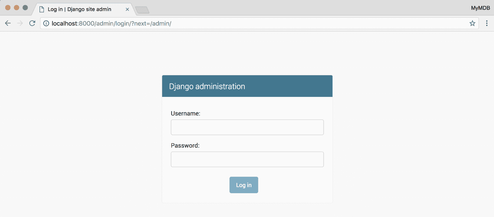
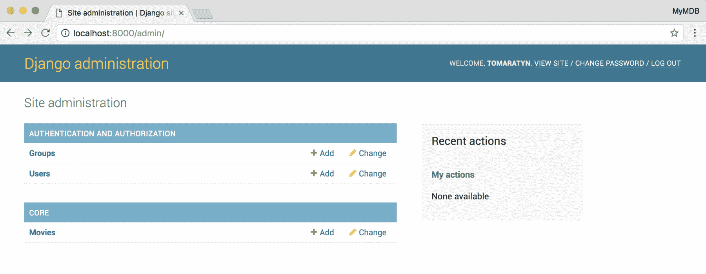
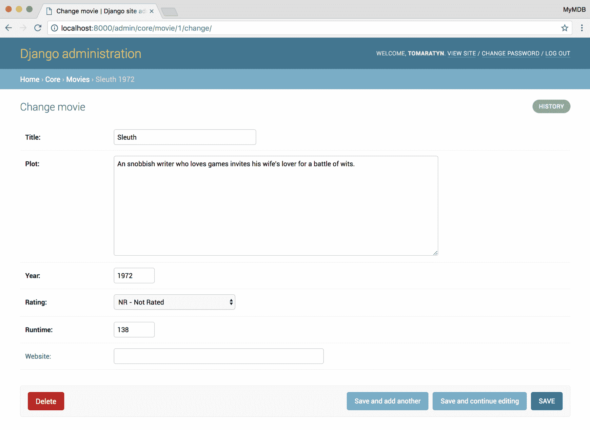
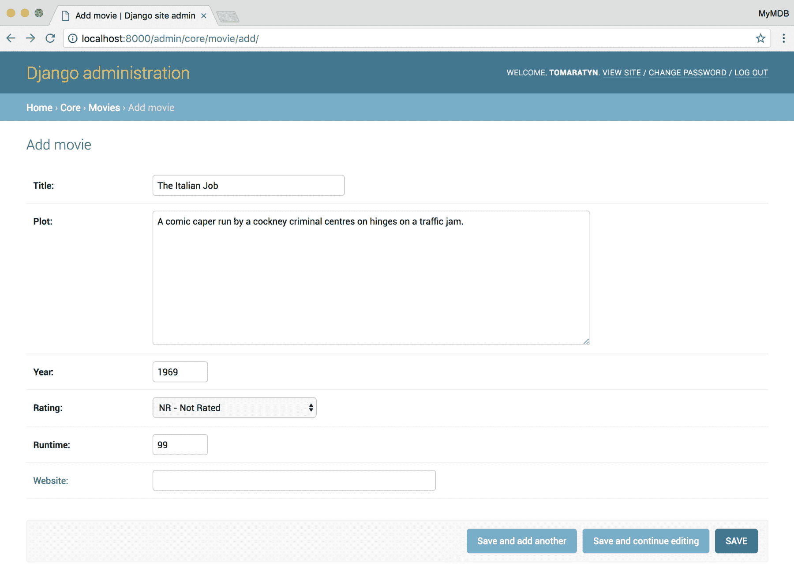
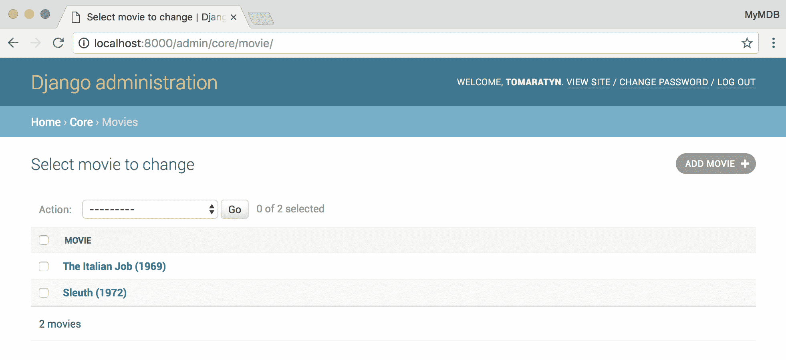

# 一、启动 MyMDB

我们将构建的第一个项目是一个基本的**互联网电影数据库**（**IMDB**克隆，名为**我的电影数据库（MyMDB）**，用 Django 2.0 编写，我们将使用 Docker 进行部署。我们的 IMDB 克隆将有以下两种类型的用户：用户和管理员。用户将能够对电影进行评级，添加电影中的图像，并查看电影和演员。管理员将能够添加电影、演员、作家和导演。

在本章中，我们将做以下事情：

*   创建我们新的 Django 项目 MyMDB，一个 IMDB 克隆
*   制作一个 Django 应用程序并创建我们的第一个模型、视图和模板
*   了解并使用模型中的各种字段，并在模型之间建立关系

本项目的代码可在[在线获取 https://github.com/tomaratyn/MyMDB](https://github.com/tomaratyn/MyMDB)

最后，我们将能够将电影、人物和角色添加到我们的项目中，并允许用户在易于自定义的 HTML 模板中查看它们。

# 正在启动我的电影数据库（MyMDB）

首先，让我们为我们的项目创建一个目录：

```py
$ mkdir MyMDB
$ cd MyMDB
```

我们未来的所有命令和路径都将与此项目目录相关。

# 启动项目

Django 项目由多个 Django 应用程序组成。Django 应用程序可以来自许多不同的地方：

*   Django 本身（例如，`django.contrib.admin`，管理后端应用程序）
*   已安装的 Python 包（例如，`django-rest-framework`，一个用于从 Django 模型创建 RESTAPI 的框架）
*   作为项目的一部分编写（我们将编写的代码）

通常，项目混合使用前面三个选项。

# 安装 Django

我们将使用 Python 首选的包管理器`pip`安装 Django，并跟踪我们在`requirements.dev.txt`文件中安装的包：

```py
django<2.1
psycopg2<2.8
```

现在，让我们安装软件包：

```py
$ pip install -r requirements.dev.txt
```

# 创建项目

安装了 Django 后，我们可以使用`django-admin`命令行工具生成项目：

```py
$ django-admin startproject config
$ tree config/
config/
├── config
│   ├── __init__.py
│   ├── settings.py
│   ├── urls.py
│   └── wsgi.py
└── manage.py
```

`settings.py`文件的父文件名为`config`，因为我们将项目命名为`config`而不是`mymdb`。然而，让顶级目录继续被称为`config`是令人困惑的，所以让我们将其重命名为`django`（一个项目可能会包含许多不同类型的代码；再次，调用 Django 代码的父目录`django`可以清楚地表明这一点）：

```py
$ mv config django 
$ tree .
.
├── django
│   ├── config
│   │   ├── __init__.py
│   │   ├── settings.py
│   │   ├── urls.py
│   │   └── wsgi.py
│   └── manage.py
└── requirements.dev.txt

2 directories, 6 files
```

让我们仔细看看这些文件：

*   `settings.py`：这是 Django 默认存储应用程序所有配置的地方。在没有`DJANGO_SETTINGS`环境变量的情况下，Django 默认在这里查找设置。
*   `urls.py`：这是整个项目的根`URLConf`。您的 web 应用程序收到的每个请求都将被路由到与此文件（或文件`urls.py`引用）中的路径匹配的第一个视图。
*   `wsgi.py`：**Web 服务器网关接口**（**WSGI**）是 Python 与 Web 服务器之间的接口。您不会经常接触这个文件，但这是您的 web 服务器和 Python 代码知道如何相互通信的方式。我们将在[第 5 章](05.html)中参考*使用 Docker*部署。
*   `manage.py`：非代码变更的指挥中心。无论是创建数据库迁移、运行测试还是启动开发服务器，我们都会经常使用此文件。

请注意，`django`目录不是 Python 模块。那里没有`__init__.py`文件，应该没有*文件。如果您添加一个，很多事情都会失败，因为我们希望添加的 Django 应用程序是顶级 Python 模块。*

# 配置数据库设置

默认情况下，Django 创建的项目将使用 SQLite，但在生产环境中不可用，因此我们将遵循在开发过程中使用与生产环境中相同的数据库的最佳实践。

让我们打开`django/config/settings.py`并更新它以使用我们的 Postgres 服务器。在`settings.py`中找到以`DATABASES`开头的行。默认情况下，它将如下所示：

```py
DATABASES = {
  'default': {
 'ENGINE': 'django.db.backends.sqlite3',
     'NAME': os.path.join(BASE_DIR, 'db.sqlite3'),  }
}
```

要使用 Postgres，请将前面的代码更改为以下代码：

```py
DATABASES = {
    'default': {
 'ENGINE': 'django.db.backends.postgresql',
        'NAME': 'mymdb',
        'USER': 'mymdb',
        'PASSWORD': 'development',
        'HOST': '127.0.0.1',
        'PORT': '5432',    }
}
```

如果您以前连接过数据库，那么大多数情况看起来都很熟悉，但让我们回顾一下：

*   `DATABASES = {`：该常量是数据库连接信息字典，Django 需要。您可以有多个到不同数据库的连接，但大多数情况下，您只需要一个名为`default`的条目。
*   `'default': {`：这是默认的数据库连接配置。您应该始终有一套`default`连接设置。除非您另外指定（在本书中，我们不会指定），否则这就是您将使用的连接。
*   `'ENGINE': 'django.db.backends.postgresql '`：这告诉 Django 使用 Postgres 后端。这又使用了 Python 的 Postgres 库`psycopg2`。
*   `'NAME': 'mymdb',`：要连接到的数据库的名称。
*   `‘USER': 'mymdb',`：您连接的用户名。
*   `‘PASSWORD': 'development',`：您的数据库用户的密码。
*   `‘HOST': '127.0.0.1’,`：要连接的数据库服务器的地址。
*   `‘PORT': '5432',`：您要连接的端口。

# 核心应用程序

Django 应用遵循**模型视图模板**（**MVT**模式；在此模式中，我们将注意以下事项：

*   **模型**负责保存和检索数据库中的数据
*   **视图**负责处理 HTTP 请求，启动模型上的操作，并返回 HTTP 响应
*   **模板**负责响应体的外观

Django 项目中可以有多少应用程序没有限制。理想情况下，每个应用程序都应该像任何其他 Python 模块一样具有范围严格且自包含的功能，但在项目开始时，很难知道复杂性将在哪里。这就是为什么我觉得从一个`core`应用开始很有用。然后，当我注意到围绕特定主题的复杂性集群时（比如说，在我们的项目中，如果我们在那里获得牵引力，参与者可能会变得出人意料的复杂），然后我们可以将其重构为自己的范围严格的应用程序。其他时候，很明显，一个站点有自包含的组件（例如，一个管理后端），并且很容易从多个应用程序开始。

# 制作核心应用程序

要创建一个新的 Django 应用程序，我们首先需要使用`manage.py`创建该应用程序，然后将其添加到`INSTALLED_APPS`列表中：

```py
$ cd django
$ python manage.py startapp core
$ ls
config      core        manage.py
$tree core
core
├─  472; __init__.py
├── admin.py
├── apps.py
├── migrations
│   └── __init__.py
├── models.py
├── tests.py
└── views.py

1 directory, 7 files
```

让我们仔细研究一下核心的内容：

*   `core/__init__.py`：核心不仅仅是一个目录，也是一个 Python 模块。
*   `admin.py`：我们将在这里向内置管理后端注册我们的模型。我们将在*电影管理*部分描述这一点。
*   `apps.py`：大多数情况下，你都会对此置之不理。在这里，您可以放置注册应用程序时需要运行的任何代码，如果您正在制作可重用的 Django 应用程序（例如，要上载到 PyPi 的包），这将非常有用。
*   `migrations`：这是一个带有数据库迁移的 Python 模块。数据库迁移描述如何将数据库从一个已知状态迁移到另一个已知状态。使用 Django，如果您添加了一个模型，您可以使用`manage.py`生成并运行迁移，您可以在本章后面的*迁移数据库*部分中看到。
*   `models.py`：这是针对车型的。
*   `tests.py`：这是测试用的。
*   `views.py`：这是视图。

# 安装我们的应用程序

既然我们的核心应用程序已经存在，让我们将其添加到`settings.py`文件中的已安装应用程序列表中，让 Django 意识到这一点。你的`settings.py`应该有这样一条线：

```py
INSTALLED_APPS = [
    'django.contrib.admin',
    'django.contrib.auth',
    'django.contrib.contenttypes',
    'django.contrib.sessions',
    'django.contrib.messages',
    'django.contrib.staticfiles',
]
```

`INSTALLED_APPS`是指向 Django 应用程序的 Python 模块的 Python 路径列表。我们已经安装了用于解决常见问题的应用程序，例如管理静态文件、会话和身份验证，并且由于 Django 的电池原理，安装了一个管理后端。

让我们将我们的`core`应用程序添加到列表的顶部：

```py
INSTALLED_APPS = [
    'core',
    'django.contrib.admin',
    'django.contrib.auth',
    'django.contrib.contenttypes',
    'django.contrib.sessions',
    'django.contrib.messages',
    'django.contrib.staticfiles',
]
```

# 添加我们的第一个模型-电影

现在我们可以添加第一个模型，即电影。

Django 模型是从`Model`派生的类，它有一个或多个`Fields`。在数据库术语中，`Model`类对应于数据库表，`Field`类对应于列，`Model`的实例对应于行。使用类似 Django 的 ORM，让我们利用 Python 和 Django 来编写表达类，而不是 DB 一次用 Python 一次又一次地用 SQL 编写模型。

我们编辑`django/core/models.py`增加`Movie`模型：

```py
from django.db import models

class Movie(models.Model):
    NOT_RATED = 0
    RATED_G = 1
    RATED_PG = 2
    RATED_R = 3
    RATINGS = (
        (NOT_RATED, 'NR - Not Rated'),
        (RATED_G,
         'G - General Audiences'),
        (RATED_PG,
         'PG - Parental Guidance '
         'Suggested'),
        (RATED_R, 'R - Restricted'),
    )

    title = models.CharField(
        max_length=140)
    plot = models.TextField()
    year = models.PositiveIntegerField()
    rating = models.IntegerField(
        choices=RATINGS,
        default=NOT_RATED)
    runtime = \
        models.PositiveIntegerField()
    website = models.URLField(
        blank=True)

    def __str__(self):
        return '{} ({})'.format(
            self.title, self.year)
```

`Movie`派生自`models.Model`，它是所有 Django 模型的基类。接下来，有一系列描述评级的常数；当我们看`rating`字段时，我们会看一看，但首先让我们看一下其他字段：

*   `title = models.CharField(max_length=140)`：这将成为一个长度为 140 的`varchar`列。数据库通常需要`varchar`列的最大大小，Django 也一样。
*   `plot = models.TextField()`：这将成为我们数据库中的`text`列，没有最大长度要求。这使得它更适合于可以有一段（甚至几页）文本的字段。
*   `year = models.PositiveIntegerField()`：这将成为一个`integer`列，Django 将在保存前验证该值，以确保保存时该值为`0`或更高。
*   `rating = models.IntegerField(choices=RATINGS, default=NOT_RATED)`：这是一个更复杂的领域。Django 会知道这将是一个`integer`专栏。可选参数`choices`（可用于所有`Fields`，而不仅仅是`IntegerField`）采用值/显示对的 iterable（列表或元组）。该对中的第一个元素是可以存储在数据库中的有效值，第二个元素是该值的人性化版本。Django 还将向我们的模型添加一个名为`get_rating_display()`的实例方法，该方法将为存储在我们的模型中的值返回匹配的第二个元素。任何与`choices`中的某个值不匹配的内容都将被`ValidationError`保存。如果在创建模型时未提供默认值，`default`参数将提供一个默认值。
*   `runtime = models.PositiveIntegerField()`：与`year`字段相同。
*   `website = models.URLField(blank=True)`：大多数数据库没有原生 URL 列类型，但数据驱动的 web 应用程序通常需要存储它们。`URLField`默认为`varchar(200)`字段（可通过提供`max_length`参数进行设置）。`URLField`还附带验证，检查其值是否为有效的 web（`http`/`https`/`ftp`/`ftps`）URL。`admin`应用程序使用`blank`参数来确定是否需要一个值（它不会影响数据库）。

我们的模型还有一个`__str__(self)`方法，这是帮助 Django 将模型转换为字符串的最佳实践。Django 在管理 UI 和我们自己的调试中实现了这一点。

Django 的 ORM 自动添加了一个自动递增的`id`列，因此我们不必在所有模型上重复这一点。这是 Django 的**不要重复自己****（干式）**哲学的一个简单例子。接下来我们将看更多的例子。

# 迁移数据库

现在我们有了一个模型，我们需要在数据库中创建一个与之匹配的表。我们将使用 Django 为我们生成一个迁移，然后运行迁移为我们的电影模型创建一个表。

虽然 Django 可以为我们的 Django 应用程序创建和运行迁移，但它不会为我们的 Django 项目创建数据库和数据库用户。要创建数据库和用户，我们必须使用管理员帐户连接到服务器。连接后，我们可以通过执行以下 SQL 创建数据库和用户：

```py
CREATE DATABASE mymdb;
CREATE USER mymdb;
GRANT ALL ON DATABASE mymdb to "mymdb";
ALTER USER mymdb PASSWORD 'development';
ALTER USER mymdb CREATEDB;
```

上面的 SQL 语句将为我们的 Django 项目创建数据库和用户。`GRANT`语句确保我们的 mymdb 用户可以访问数据库。然后，我们在`mymdb`用户上设置一个密码（确保它与您的`settings.py`文件中的密码相同）。最后，我们授予`mymdb`用户创建新数据库的权限，Django 将在运行测试时使用该权限创建测试数据库。

要为我们的应用程序生成迁移，我们需要告诉`manage.py`文件执行以下操作：

```py
$ cd django
$ python manage.py makemigrations core
Migrations for 'core':
  core/migrations/0001_initial.py
    - Create model Movie
```

`migration`是 Django 应用程序中的一个 Python 文件，它描述了如何将数据库更改为所需状态。Django 迁移不绑定到特定的数据库系统（相同的迁移将在受支持的数据库之间工作，除非*我们*添加特定于数据库的代码）。Django 生成使用 Django 的 migrations API 的迁移文件，我们在本书中不会讨论这个 API，但是知道它的存在是很有用的。

记住，有迁移的是*应用程序*而不是*项目*（因为有迁移模型的是*应用程序*。

接下来，我们告诉`manage.py`迁移我们的应用程序：

```py
$ python manage.py migrate core 
Operations to perform:
  Apply all migrations: core
Running migrations:
  Applying core.0001_initial... OK
```

现在，我们的表存在于数据库中：

```py
$ python manage.py dbshell
psql (9.6.1, server 9.6.3)
Type "help" for help.

mymdb=> \dt
             List of relations
 Schema |       Name        | Type  | Owner 
--------+-------------------+-------+-------
 public | core_movie        | table | mymdb
 public | django_migrations | table | mymdb
(2 rows)

mymdb=> \q
```

我们可以看到我们的数据库有两个表。Django 模型表的默认命名方案为`<app_name>_<model_name>`。我们可以从`core`应用程序中看出`core_movie`是`Movie`型号的表格。`django_migrations`供 Django 内部使用，用于跟踪已应用的迁移。直接更改`django_migrations`表而不是使用`manage.py`是一个坏主意，这将导致在尝试应用或回滚迁移时出现问题。

迁移命令也可以在不指定应用程序的情况下运行，在这种情况下，它将在所有应用程序上运行。让我们在没有应用程序的情况下运行`migrate`命令：

```py
$ python manage.py migrate 
Operations to perform:
  Apply all migrations: admin, auth, contenttypes, core, sessions
Running migrations:
  Applying contenttypes.0001_initial... OK
  Applying auth.0001_initial... OK
  Applying admin.0001_initial... OK
  Applying admin.0002_logentry_remove_auto_add... OK
  Applying contenttypes.0002_remove_content_type_name... OK
  Applying auth.0002_alter_permission_name_max_length... OK
  Applying auth.0003_alter_user_email_max_length... OK
  Applying auth.0004_alter_user_username_opts... OK
  Applying auth.0005_alter_user_last_login_null... OK
  Applying auth.0006_require_contenttypes_0002... OK
  Applying auth.0007_alter_validators_add_error_messages... OK
  Applying auth.0008_alter_user_username_max_length... OK
  Applying sessions.0001_initial... OK
```

这将创建表来跟踪用户、会话、权限和管理后端。

# 创作我们的第一部电影

与 Python 一样，Django 提供了一个交互式 REPL 来进行尝试。Django shell 完全连接到数据库，因此我们可以从 shell 中创建、查询、更新和删除模型：

```py
$ cd django
$ python manage.py shell
Python 3.4.6 (default, Aug  4 2017, 15:21:32) 
[GCC 4.2.1 Compatible Apple LLVM 8.1.0 (clang-802.0.42)] on darwin
Type "help", "copyright", "credits" or "license" for more information.
(InteractiveConsole)
>>> from core.models import Movie
>>> sleuth = Movie.objects.create(
... title='Sleuth',
... plot='An snobbish writer who loves games'
... ' invites his wife\'s lover for a battle of wits.',
... year=1972,
... runtime=138,
... )
>>> sleuth.id
1
>>> sleuth.get_rating_display()
'NR - Not Rated'
```

在前面的 Django shell 会话中，请注意，`Movie`有许多属性是我们没有创建的：

*   `objects`是模型的默认管理器。管理器是查询模型表的接口。它还提供了创建和保存实例的`create()`方法。每个模型必须至少有一个管理器，Django 提供了一个默认管理器。创建自定义管理器通常是明智的；我们将在后面的*添加人物和模型关系*部分看到这一点。
*   `id`是该实例行的主键。如前一步所述，Django 会自动创建它。
*   `get_rating_display()`是 Django 添加的方法，因为`rating`字段被赋予了一个`choices`元组。我们不必在`create()`调用中为`rating`提供值，因为`rating`字段有`default`值（`0`。`get_rating_display()`方法查找该值并返回相应的显示值。Django 将为每个带有`choices`参数的`Field`属性生成一个类似这样的方法。

接下来，让我们创建一个使用 Django 管理应用程序管理电影的后端。

# 创建电影管理员

由于能够快速生成后端 UI，用户可以在项目的其余部分仍处于开发阶段时开始构建项目的内容。这是一个很好的特性，可以帮助并行化进程，避免重复和枯燥的任务（读取/更新视图共享许多功能）。提供这种开箱即用的功能是 Django 电池哲学的另一个例子。

要使 Django 的管理应用程序与我们的模型配合使用，我们将执行以下步骤：

1.  注册我们的模型
2.  创建可以访问后端的超级用户
3.  运行开发服务器
4.  在浏览器中访问后端

让我们通过编辑`django/core/admin.py`向管理员注册我们的`Movie`模型，如下所示：

```py
from django.contrib import admin

from core.models import Movie

admin.site.register(Movie)
```

现在我们的模型已经注册了！

现在让我们创建一个可以使用`manage.py`访问后端的用户：

```py
$ cd django
$ python manage.py createsuperuser 
Username (leave blank to use 'tomaratyn'): 
Email address: tom@aratyn.nam
Password: 
Password (again): 
Superuser created successfully.
```

Django 附带的**开发服务器**可以为我们的应用提供服务，但不适合生产：

```py
$ python manage.py runserver
Performing system checks...

System check identified no issues (0 silenced).
September 12, 2017 - 20:31:54
Django version 1.11.5, using settings 'config.settings'
Starting development server at http://127.0.0.1:8000/
Quit the server with CONTROL-C.
```

此外，通过导航到`http://localhost:8000/`在浏览器中打开：


要访问管理后端，请转到`http://localhost:8000/admin`：



使用凭据登录后，我们必须管理用户和电影：



单击电影将显示电影列表：


请注意，链接的标题是我们的`Movie.__str__`方法的结果。单击它将为您提供编辑电影的 UI：



在主管理屏幕和电影列表屏幕上，您有添加新电影的链接。让我们添加一部新电影：



现在，我们的电影列表显示了两部电影：



现在我们有了一种让我们的团队用电影填充数据库的方法，让我们开始为我们的用户处理视图。

# 创建电影列表视图

当 Django 收到请求时，它使用请求的路径和项目的`URLConf`将请求与视图匹配，视图返回 HTTP 响应。Django 的视图可以是函数（通常称为**基于函数的视图**（**FBV**），也可以是类（通常称为**基于类的视图**（**CBV**）。CBVs 的优点是 Django 提供了一套丰富的通用视图，您可以对这些视图进行子类化，从而轻松（几乎以声明方式）编写视图以完成常见任务。

让我们写一个视图来列出我们拥有的电影。打开`django/core/views.py`并将其更改为以下内容：

```py
from django.views.generic import ListView

from core.models import Movie

class MovieList(ListView):
    model = Movie
```

`ListView`至少需要一个`model`属性。它将查询该模型的所有行，将其传递给模板，并在响应中返回呈现的模板。它还提供了许多钩子，我们可以使用它们来替换默认行为，这些钩子都有完整的文档记录。

`ListView`如何知道如何查询`Movie`中的所有对象？为此，我们需要讨论 manager 和`QuerySet`类。每个模型都有一个默认管理器。Manager 类主要用于通过提供返回`QuerySet`的方法（如`all()`）来查询对象。`QuerySet`类是 Django 对数据库查询的表示。`QuerySet`有许多方法，包括`filter()`（例如`SELECT`语句中的`WHERE`子句）来限制结果。`QuerySet`类的一个很好的特性是它很懒；在我们尝试从`QuerySet`中获取模型之前，不会对其进行评估。另一个很好的特性是，`filter()`等方法采用*查找表达式*，这些表达式可以是字段名，也可以跨越关系模型。我们将在整个项目中都这样做。

所有管理器类都有一个`all()`方法，该方法应该返回一个未过滤的`Queryset`，相当于写入`SELECT * FROM core_movie;`

那么，`ListView`如何知道它必须查询`Movie`中的所有对象呢？`ListView`检查它是否有`model`属性，如果有，则知道`Model`类有一个默认的带有`all()`方法的管理器，并调用该方法。`ListView`还为我们提供了一个放置模板的约定，如下所示：`<app_name>/<model_name>_list.html`。

# 添加我们的第一个模板-movie_list.html

Django 附带了自己的模板语言，称为**Django 模板语言**。Django 还可以使用其他模板语言（例如 Jinja2），但大多数 Django 项目发现使用 Django 模板语言是高效和方便的。

在我们的`settings.py`文件中生成的默认配置中，Django 模板语言被配置为使用`APP_DIRS`，这意味着每个 Django 应用程序都可以有一个`templates`目录，将对该目录进行搜索以找到模板。这可用于覆盖其他应用程序使用的模板，而无需修改第三方应用程序本身。

让我们在`django/core/templates/core/movie_list.html`中制作第一个模板：

```py
<!DOCTYPE html>
<html>
  <body>
    <ul>
      
        <li>{{ movie }}</li>
      
        <li>
          No movies yet.
        </li>
      
    </ul>
    <p>
      Using https? 
      {{ request.is_secure|yesno }}
    </p>
  </body>
</html>
```

Django 模板是标准 HTML（或您希望使用的任何文本格式），带有变量（例如，在我们的示例中为`object_list`）和标记（例如，在我们的示例中为`for`）。变量将通过被`{{ }}`包围的方式计算为字符串。过滤器可用于在打印前帮助格式化或修改变量（例如，`yesno`。我们还可以创建自定义标记和过滤器。

Django 文档（[中提供了过滤器和标签的完整列表 https://docs.djangoproject.com/en/2.0/ref/templates/builtins/](https://docs.djangoproject.com/en/2.0/ref/templates/builtins/) ）。

Django 模板语言在`settings.py`的`TEMPLATES`变量中配置。`DjangoTemplates`后端可能需要大量`OPTIONS`。在 d*开发*中，添加`'string_if_invalid': 'INVALID_VALUE',`可能会有所帮助。每当 Django 无法将模板中的变量与变量或标记匹配时，它都会打印出`INVALID_VALUE`，这样更容易发现拼写错误。请记住，您不应在*生产*中使用此设置。Django 的文档（[中提供了完整的选项列表 https://docs.djangoproject.com/en/dev/topics/templates/#django.template.backends.django.DjangoTemplates](https://docs.djangoproject.com/en/dev/topics/templates/#django.template.backends.django.DjangoTemplates) 。

最后一步是将我们的观点连接到`URLConf`。

# 使用 URLConf 将请求路由到我们的视图

现在我们有了一个模型、视图和模板，我们需要告诉 Django 哪些请求应该使用 URLConf 路由到我们的`MovieList`视图。每个新项目都有一个由 Django 创建的根 URLConf（在我们的例子中是`django/config/urls.py`文件）。Django 开发人员开发了每个应用程序都有自己的 URLConf 的最佳实践。然后，项目的根 URLConf 将使用`include()`函数包含每个应用程序的 URLConf。

让我们通过使用以下代码创建一个`django/core/urls.py`文件，为`core`应用程序创建一个 URLConf：

```py
from django.urls import path

from . import views

app_name = 'core'
urlpatterns = [
    path('movies',
         views.MovieList.as_view(),
         name='MovieList'),
]
```

最简单的说，URLConf 是一个具有`urlpatterns`属性的模块，该属性是`path`的列表。`path`由一个描述字符串的字符串和一个可调用的字符串组成。CBV 是不可调用的，因此基础`View`类有一个静态`as_view()`方法，*返回*一个可调用的方法。FBV 可以作为回调传入（没有执行它们的`()`操作符）。

每个`path()`都应该命名，这对于我们必须在模板中引用该路径时是一个有用的最佳实践。因为一个 URLConf 可以被另一个 URLConf 包含，所以我们可能不知道视图的完整路径。Django 提供了一个`reverse()`函数和`url`模板标记，用于从名称到视图的完整路径。

`app_name`变量设置此`URLConf`所属的应用程序。这样，我们就可以引用一个名为`path`的应用程序，而不会让 Django 对其他具有相同名称`path`的应用程序感到困惑（例如，`index`是一个非常常见的名称，因此我们可以说`appA:index`和`appB:index`来区分它们）。

最后，让我们通过将`django/config/urls.py`更改为以下内容，将我们的`URLConf`连接到根`URLConf`：

```py
from django.urls import path, include
from django.contrib import admin

import core.urls

urlpatterns = [
    path('admin/', admin.site.urls),
    path('', include(
        core.urls, namespace='core')),
]
```

这个文件看起来很像我们前面的文件`URLConf`，除了我们的`path()`对象没有查看，而是`include()`函数的结果。`include()`函数允许我们在整个`URLConf`前面加上路径前缀，并给它一个自定义名称空间。

名称空间允许我们像`app_name`属性那样区分`path`名称，但不需要修改应用程序（例如，第三方应用程序）。

你可能想知道为什么我们使用`include()`而 Django 管理站点使用`property`？`include()`和`admin.site.urls`都返回类似格式的三元组。然而，与其记住 3 元组的每个部分必须有什么，不如使用`include()`。

# 运行开发服务器

Django 现在知道如何将请求路由到我们的视图，视图知道需要显示的模型和要呈现的模板。我们可以告诉`manage.py`启动我们的开发服务器并查看我们的结果：

```py
$ cd django
$ python manage.py runserver
```

在我们的浏览器中，转至`http://127.0.0.1:8000/movies`：


干得好我们做了第一页！

在本节中，我们创建了第一个模型，为其生成并运行了迁移，并创建了一个视图和模板，以便用户可以浏览它。

现在，让我们为每部电影添加一个页面。

# 个人电影页面

现在我们有了项目布局，我们可以更快地行动了。我们已经在跟踪每部电影的信息。让我们创建一个视图来显示这些信息。

要添加电影详细信息，我们需要执行以下操作：

1.  创建一个`MovieDetail`视图
2.  创建`movie_detail.html`模板
3.  参考我们`URLConf`中的`MovieDetail`视图

# 创建 MovieDetail 视图

就像 Django 为我们提供了一个`ListView`类来完成列出模型的所有常见任务一样，Django 还提供了一个`DetailView`类，我们可以对该类进行子类化，以创建一个显示单个`Model`细节的视图。

让我们在`django/core/views.py`中创建我们的视图：

```py
from django.views.generic import (
    ListView, DetailView,
)
from core.models import Movie

class MovieDetail(DetailView):
    model = Movie

class MovieList(ListView):
    model = Movie
```

`DetailView`要求`path()`对象在`path`字符串中包含`pk`或`slug`，以便`DetailView`可以将该值传递给`QuerySet`以查询特定的模型实例。**slug**是一个简短的 URL 友好标签，通常用于内容密集型网站，因为它对 SEO 友好。

# 创建 movie_detail.html 模板

现在我们有了视图，让我们制作模板。

Django 的模板语言支持模板继承，这意味着您可以编写一个包含网站所有外观的模板，并标记其他模板将覆盖的`block`部分。这使我们能够创建整个网站的外观，而无需编辑每个模板。让我们使用它创建一个具有 MyMDB 品牌和外观的基本模板，然后添加一个从基本模板继承的电影详细信息模板。

基本模板不应绑定到特定的应用程序，因此让我们创建一个通用模板目录：

```py
$ mkdir django/templates
```

Django 还不知道如何检查我们的`templates`目录，因此我们需要更新`settings.py`文件中的配置。找到以`TEMPLATES`开头的行，将配置更改为在`DIRS`列表中列出我们的`templates`目录：

```py
TEMPLATES = [
    {
        'BACKEND': 'django.template.backends.django.DjangoTemplates',
        'DIRS': [
            os.path.join(BASE_DIR, 'templates'),
        ],
        'APP_DIRS': True,
        'OPTIONS': {
            # omittted for brevity
        },
    },
]
```

我们所做的唯一更改是在`DIRS`键下添加了新的`templates`目录。我们避免了使用 Python 的`os.path.join()`函数和已经配置的`BASE_DIR`对`templates`目录的路径进行硬编码。`BASE_DIR`在运行时设置为项目的路径。我们不需要添加`django/core/templates`，因为`APP_DIRS`设置告诉 Django 检查每个应用程序的`templates`目录。

尽管`settings.py`是我们可以使用`os.path.join`和所有 Python 的 Python 文件非常方便，但请注意不要太聪明。`settings.py`需要易于阅读和理解。没有什么比调试你的`settings.py`更糟糕的了。

让我们在`django/templates/base.html`中创建一个基本模板，它有一个主列和侧栏：

```py
<!DOCTYPE html>
<html lang="en" >
<head >
  <meta charset="UTF-8" >
  <meta
    name="viewport"
    content="width=device-width, initial-scale=1, shrink-to-fit=no"
  >
  <link
    href="https://maxcdn.bootstrapcdn.com/bootstrap/4.0.0-beta/css/bootstrap.min.css"
    integrity="sha384-/Y6pD6FV/Vv2HJnA6t+vslU6fwYXjCFtcEpHbNJ0lyAFsXTsjBbfaDjzALeQsN6M"
    rel="stylesheet"
    crossorigin="anonymous"
  >
  <title >
    MyMDB
  </title>
  <style>
    .mymdb-masthead {
      background-color: #EEEEEE;
      margin-bottom: 1em;
    }
  </style>

</head >
<body >
<div class="mymdb-masthead">
  <div class="container">
    <nav class="nav">
      <div class="navbar-brand">MyMDB</div>
      <a
        class="nav-link"
        href=""
      >
        Movies
      </a>
    </nav>
  </div>
</div>

<div class="container">
  <div class="row">
    <div class="col-sm-8 mymdb-main">
     
    </div>
    <div
        class="col-sm-3 offset-sm-1 mymdb-sidebar"
    >
      
    </div>
  </div>
</div>

</body >
</html >
```

大多数 HTML 实际上是引导（HTML/CSS 框架）样板文件，但我们有一些新的 Django 标记：

*   `MyMDB`：这将创建一个其他模板可以替换的块。如果未替换块，则将使用父模板中的内容。
*   `href=""`：`url`标记将为命名的`path`生成 URL 路径。URL 名称应引用为`<app_namespace>:<name>`；在我们的例子中，`core`是核心应用程序的名称空间（根据`django/core/urls.py`，而`MovieList`是`MovieList`视图的 URL 的名称。

这让我们可以在`django/core/templates/core/movie_detail.html`中创建一个简单的模板：

```py



  {{ object.title }} - {{ block.super }}



<h1>{{ object }}</h1>
<p class="lead">
{{ object.plot }}
</p>



<div>
This movie is rated:
  <span class="badge badge-primary">
  {{ object.get_rating_display }}
  </span>
</div>

```

这个模板中的 HTML 要少得多，因为`base.html`已经有了。`MovieDetail.html`所要做的就是为`base.html`定义的块提供值。让我们来看看一些新的标签：

*   ``：如果一个模板想要扩展另一个模板，那么第一行必须是`extends`标记。Django 将寻找基础模板（可以`extend`另一个模板）并首先执行它，然后替换块。扩展另一个模板的内容不能在`block`之外，因为在哪里放置该内容是不明确的。
*   `{{ object.title }} - {{ block.super }}`：我们在`title`模板`block`中引用`block.super`。`block.super`返回基础模板中`title`模板`block`的内容。
*   `{{ object.get_rating_display }}`：Django 模板语言不使用`()`来执行方法，只需按名称引用即可执行方法。

# 将 MovieDetail 添加到 core.url.py

最后，我们将我们的`MovieDetail`视图添加到`core/urls.py`：

```py
from django.urls import path

from . import views

urlpatterns = [
    path('movies',
         views.MovieList.as_view(),
         name='MovieList'),
    path('movie/<int:pk>',
         views.MovieDetail.as_view(),
         name='MovieDetail'),
]
```

`MovieDetail`和`MovieList``path()`调用看起来几乎相同，除了具有命名参数的`MovieDetail`字符串。`path`路由字符串可以包含尖括号，为参数提供名称（例如`<pk>`，甚至定义参数内容必须符合的类型（例如，`<int:pk>`仅匹配解析为`int`的值）。这些命名部分由 Django 捕获并按名称传递给视图。`DetailView`需要一个`pk`（或`slug`参数，并使用它从数据库中获取正确的行。

让我们使用`python manage.py runserver`启动`dev`服务器，看看我们的新模板是什么样子的：


# 对该部分的快速回顾

在本节中，我们创建了一个新视图`MovieDetail`，了解了模板继承，以及如何将参数从 URL 路径传递到视图。

接下来，我们将在`MovieList`视图中添加分页，以防止它每次查询整个数据库。

# 分页并将电影列表链接到电影详细信息

在本节中，我们将更新我们的电影列表，以提供每个电影的链接，并进行分页，以防止将整个数据库转储到一个页面中。

# 更新 MovieList.html 以扩展 base.html

我们最初的`MovieList.html`是一个相当稀少的事件。让我们使用`base.html`模板和它提供的引导 CSS 更新它，让它看起来更漂亮：

```py



All The Movies



<ul>
  
    <li>
      <a href="">
        {{ movie }}
      </a>
    </li>
  
  </ul>

```

我们还看到，`url`标记与命名参数`pk`一起使用，因为`MovieDetail`URL 需要一个`pk`参数。如果没有提供参数，Django 将在渲染时引发`NoReverseMatch`异常，导致`500`错误。

让我们看看它的样子：


# 定单

我们当前观点的另一个问题是，它不是有序的。如果数据库返回无序查询，则分页将无助于导航。此外，不能保证用户每次更改页面时内容都是一致的，因为数据库每次都可能返回不同顺序的结果集。我们需要对查询进行一致的排序。

订购我们的模型也使我们作为开发人员的生活变得更轻松。无论是使用调试器、编写测试还是运行 shell，确保以一致的顺序返回模型都可以简化故障排除。

Django 模型可能有一个称为`Meta`的内部类，它允许我们指定关于模型的信息。让我们添加一个具有`ordering`属性的`Meta`类：

```py
class Movie(models.Model):
   # constants and fields omitted for brevity 

    class Meta:
        ordering = ('-year', 'title')

    def __str__(self):
        return '{} ({})'.format(
            self.title, self.year)
```

`ordering`获取通常为字段名的字符串的列表或元组，可选地以表示降序的`-`字符作为前缀。`('-year', 'title')`相当于 SQL 子句`ORDER BY year DESC, title`。

将`ordering`添加到模型的`Meta`类将意味着从模型的经理处订购`QuerySets`。

# 添加分页

既然我们的电影总是以相同的方式订购，那么让我们添加分页。Django`ListView`已经内置了分页支持，所以我们需要做的就是利用它。**分页**由`GET`参数`page`控制，该参数控制显示哪一页。

让我们在`main`模板`block`的底部添加分页：

```py

 <ul >
    
      <li >
        <a href="" >
          {{ movie }}
        </a >
      </li >
    
  </ul >
  
    <nav >
      <ul class="pagination" >
        <li class="page-item" >
          <a
            href="?page=1"
            class="page-link"
          >
            First
          </a >
        </li >
        
          <li class="page-item" >
            <a
              href="?page={{ page_obj.previous_page_number }}"
              class="page-link"
            >
              {{ page_obj.previous_page_number }}
            </a >
          </li >
        
        <li class="page-item active" >
          <a
            href="?page={{ page_obj.number }}"
            class="page-link"
          >
            {{ page_obj.number }}
          </a >
        </li >
        
          <li class="page-item" >
            <a
              href="?page={{ page_obj.next_page_number }}"
              class="page-link"
            >
              {{ page_obj.next_page_number }}
            </a >
          </li >
        
        <li class="page-item" >
          <a
              href="?page=last"
              class="page-link"
          >
            Last
          </a >
        </li >
      </ul >
    </nav >
  

```

让我们来看看我们的模板的一些要点：

*   `page_obj`属于`Page`类型，了解本页结果信息。我们使用它来检查是否有下一页/上一页使用`has_next()`/`has_previous()`（我们不需要在 Django 模板语言中放置`()`，但`has_next()`是一个方法，而不是一个属性）。我们还使用它来获取`next_page_number()`/`previous_page_number()`。请注意，在检索下一页/上一页编号之前，使用`has_*()`方法检查下一页/上一页编号是否存在非常重要。如果在检索时它们不存在，`Page`抛出一个`EmptyPage`异常。
*   `object_list`继续可用并保持正确的值。即使`page_obj`将此页面的结果封装在`page_obj.object_list`中，`ListView`也能方便地确保我们可以继续使用`object_list`并且我们的模板不会损坏。

我们现在已经开始分页了！

# 404–当东西丢失时

我们现在有两个视图如果在 URL 中给出错误的值就无法运行（错误的`pk`将破坏`MovieDetail`；错误的`page`将破坏`MovieList`；让我们通过处理`404`错误来计划这一点。Django 在根 URLConf 中提供了一个钩子，让我们可以对`404`错误使用自定义视图（也适用于`403`、`400`和`500`-所有这些都遵循相同的名称方案）。在根`urls.py`文件中，添加一个名为`handler404`的变量，其值为自定义视图的字符串 Python 路径。

但是，我们可以继续使用默认的`404`处理程序视图，只编写一个自定义模板。让我们在`django/templates/404.html`中添加一个`404`模板：

```py



Not Found



<h1>Not Found</h1>
<p>Sorry that reel has gone missing.</p>

```

即使其他应用程序抛出`404`错误，也将使用此模板。

目前，如果您有一个未使用的 URL，例如`http://localhost:8000/not-a-real-page`，您将看不到我们的自定义 404 模板，因为 Django 的`DEBUG`设置是`settings.py`中的`True`。要使 404 模板可见，我们需要更改`settings.py`中的`DEBUG`和`ALLOWED_HOSTS`设置：

```py
DEBUG = False

ALLOWED_HOSTS = [
    'localhost',
    '127.0.0.1'
]
```

`ALLOWED_HOSTS`是限制 Django 将响应 HTTP 请求中的`HOST`值的设置。如果`DEBUG`为`False`且`HOST`与`ALLOWED_HOSTS`值不匹配，则 Django 将返回一个`400`错误（您可以按照前面代码中的描述自定义此错误的视图和模板）。这是一个保护我们的安全功能，我们将在安全章节中详细讨论。

现在我们的项目已经配置好，让我们运行 Django 开发服务器：

```py
$ cd django
$ python manage.py runserver
```

运行后，我们可以使用我们的 web 浏览器打开[http://localhost:8000/not-a-real-page](http://localhost:8000/not-a-real-page)。我们的结果应该如下所示：


# 测试我们的视图和模板

既然我们的`MoveList`模板中有一些逻辑，让我们编写一些测试。我们将在[第 8 章](08.html)、*测试*中详细介绍测试。然而，基本原理很简单，并且遵循`TestCase`类的常见 XUnit 模式，这些类持有进行断言的测试方法。

Django 的`TestRunner`要找到测试，它必须位于已安装应用程序的`tests`模块中。现在，这意味着`tests.py`，但最终，您可能希望切换到一个目录 Python 模块（在这种情况下，在测试文件名前面加上`test`，以便`TestRunner`找到它们）。

让我们添加一个执行以下功能的测试：

*   如果有超过 10 部电影，则分页控件应在模板中呈现
*   如果有超过 10 部电影，我们不提供参数 t1，参数，考虑下面的事情：
    *   `page_is_last`上下文变量应为`False`
    *   `page_is_first`上下文变量应为`True`
    *   分页中的第一项应标记为活动

以下是我们的`tests.py`文件：

```py
from django.test import TestCase
from django.test.client import \
    RequestFactory
from django.urls.base import reverse

from core.models import Movie
from core.views import MovieList

class MovieListPaginationTestCase(TestCase):

    ACTIVE_PAGINATION_HTML = """
    <li class="page-item active">
      <a href="{}?page={}" class="page-link">{}</a>
    </li>
    """

    def setUp(self):
        for n in range(15):
            Movie.objects.create(
                title='Title {}'.format(n),
                year=1990 + n,
                runtime=100,
            )

    def testFirstPage(self):
        movie_list_path = reverse('core:MovieList')
        request = RequestFactory().get(path=movie_list_path)
        response = MovieList.as_view()(request)
        self.assertEqual(200, response.status_code)
        self.assertTrue(response.context_data['is_paginated'])
        self.assertInHTML(
            self.ACTIVE_PAGINATION_HTML.format(
                movie_list_path, 1, 1),
            response.rendered_content)
```

让我们来看看一些有趣的观点：

*   `class MovieListPaginationTestCase(TestCase)`：`TestCase`是所有 Django 测试的基类。它内置了许多便利，包括许多方便的断言方法。
*   `def setUp(self)`：与大多数 XUnit 测试框架一样，Django 的`TestCase`类提供了一个`setUp()`钩子，该钩子在每次测试之前运行。如有需要，还可提供`tearDown()`挂钩。数据库在每次测试之间都会被清理，所以我们不必担心删除我们添加的任何模型。
*   `def testFirstPage(self):`：如果一个方法的名称前缀为`test`，那么它就是一个测试。
*   `movie_list_path = reverse('core:MovieList')`：`reverse()`是前面提到的，是 Python 中的`url`Django 模板标记的等价物。它会将名称解析为路径。
*   `request = RequestFactory().get(path=movie_list_path)`：`RequestFactory`是创建虚假 HTTP 请求的便利工厂。`RequestFactory`通过其以动词命名的方便方法（例如，`get()`表示`GET`请求），具有创建`GET`、`POST`和`PUT`请求的方便方法。在我们的例子中，提供的`path`对象并不重要，但是其他视图可能希望检查请求的路径。
*   `self.assertEqual(200, response.status_code)`：这表明两个参数相等。响应的`status_code`用于检查成功或失败（`200`是成功的状态代码，是您在浏览网页时从未看到的代码）。
*   `self.assertTrue(response.context_data['is_paginated'])`：这表明参数的计算结果为`True`。`response`公开呈现模板时使用的上下文。这使得查找 bug 更加容易，因为您可以快速检查渲染中使用的实际值。
*   `self.assertInHTML(`：`assertInHTML`是 Django 提供的众多便捷方法之一，作为其**电池（包括**原理）的一部分。给定有效的 HTML 字符串`needle`和有效的 HTML 字符串`haystack`，它将断言`needle`在`haystack`中。这两个字符串必须是有效的 HTML，因为 Django 将解析它们并检查其中一个是否在另一个内。您不需要担心间距或属性/类的顺序。当您试图确保模板正常工作时，这是一个非常方便的断言。

要运行测试，我们可以使用`manage.py`：

```py
$ cd django
$ python manage.py test 
Creating test database for alias 'default'...
System check identified no issues (0 silenced).
.
----------------------------------------------------------------------
Ran 1 test in 0.035s

OK
Destroying test database for alias 'default'...
```

最后，我们可以确信分页工作正常。

# 添加人员和模型关系

在本节中，我们将向项目中添加模型之间的关系。人们与电影的关系可以创建一个复杂的数据模型。同一个人可以是演员、作家和导演（例如，*使徒*（1997）由罗伯特·杜瓦尔编剧、导演和主演）。即使不考虑团队和生产团队，简化一点，数据模型也将涉及使用`ForiengKey`字段的一对多关系、使用`ManyToManyField`字段的多对多关系，以及使用`ManyToManyField`字段中的`through`类添加关于多对多关系的额外信息的类。

在本节中，我们将逐步执行以下操作：

1.  创建一个`Person`模型
2.  在`Movie`到`Person`之间添加一个`ForeignKey`字段来跟踪导演
3.  从`Movie`到`Person`添加一个`ManyToManyField`来跟踪编剧
4.  添加一个带有`through`类（`Actor`的`ManyToManyField`来跟踪谁在电影中扮演了什么角色
5.  创建迁移
6.  将导演、编剧和演员添加到电影详细信息模板
7.  在列表中添加一个`PersonDetail`视图，显示一个人导演、创作和表演的电影

# 添加具有关系的模型

首先，我们需要一个`Person`类来描述和存储电影中的人物：

```py
class Person(models.Model):
    first_name = models.CharField(
        max_length=140)
    last_name = models.CharField(
        max_length=140)
    born = models.DateField()
    died = models.DateField(null=True,
                            blank=True)

    class Meta:
        ordering = (
            'last_name', 'first_name')

    def __str__(self):
        if self.died:
            return '{}, {} ({}-{})'.format(
                self.last_name,
                self.first_name,
                self.born,
                self.died)
        return '{}, {} ({})'.format(
                self.last_name,
                self.first_name,
                self.born)
```

在`Person`中，我们还看到一个新字段（`DateField`和一个新的字段参数（`null`。

`DateField`用于跟踪基于日期的数据，在数据库中使用适当的列类型（Postgres 中为`date`和 Python 中为`datetime.date`。Django 还提供了一个`DateTimeField`来存储日期和时间。

所有字段都支持`null`参数（默认为`False`，表示该列是否接受`NULL`SQL 值（Python 中以`None`表示）。我们将`died`标记为支持`null`，这样我们就可以记录人是活的还是死的。然后，在`__str__()`方法中，如果有人活着或死了，我们打印出不同的字符串表示。

我们现在有了`Person`模型，它可以与`Movies`有各种关系。

# 不同类型的关系字段

Django 的 ORM 支持映射模型之间关系的字段，包括一对多、多对多以及使用中间模型的多对多。

当两个模型具有一对多关系时，我们使用一个`ForeignKey`字段，该字段将在两个表之间创建一个具有**外键**（**FK**约束的列（假设有数据库支持）。在没有`ForeignKey`字段的模型中，Django 会自动添加`RelatedManager`对象作为实例属性。`RelatedManager`类使查询关系中的对象变得更容易。我们将在下面几节中查看这方面的示例。

当两个模型有多对多关系时，其中一个（但不是两个）可以得到`ManyToManyField()`；Django 将在另一侧为您创建一个`RelatedManager`。如您所知，关系数据库实际上不能在两个表之间具有多对多关系。相反，关系数据库需要一个带外键的*桥接*表来连接每个相关表。假设我们不想添加任何描述关系的属性，Django 将自动为我们创建和管理这个桥接表。

有时，我们需要额外的字段来描述多对多关系（例如，当它开始或结束时）；为此，我们可以提供带有`through`模型的`ManyToManyField`（在 UML/OO 中有时称为关联类）。这个模型将在关系的每一方都有一个`ForeignKey`和我们想要的任何额外字段。

我们将创建其中每一个的示例，并在`Movie`模型中添加导演、作家和演员。

# 董事-外籍钥匙

在我们的模型中，我们会说每部电影可以有一个导演，但每个导演可以导演许多电影。让我们使用`ForiengKey`字段为电影添加导演：

```py
class Movie(models.Model):
   # constants, methods, Meta class and other fields omitted for brevity.
    director = models.ForeignKey(
        to='Person',
        on_delete=models.SET_NULL,
        related_name='directed',
        null=True,
        blank=True)
```

让我们一行看看我们的新领域：

*   `to='Person'`：Django 的所有关系字段都可以引用字符串以及相关模型。此参数是必需的。
*   `on_delete=models.SET_NULL`：Django 需要说明删除引用模型（实例/行）时该怎么做。`SET_NULL`会将被删除的`Person`所指向的所有`Movie`模型实例的`director`字段设置为`NULL`，如果我们想要级联删除，我们会使用`models.CASCADE`对象。
*   `related_name='directed'`：这是一个可选参数，表示另一个模型上`RelatedManager`实例的名称（让我们查询所有`Movie`模型实例 a`Person`指向）。如果没有提供`related_name`，则`Person`将获得一个名为`movie_set`的属性（遵循`<model with FK>_set`模式）。在我们的案例中，`Movie`和`Person`（编剧、导演和演员）之间有多种不同的关系，因此`movie_set`将变得模棱两可，我们必须提供`related_name`。

这也是我们第一次向现有模型添加字段。这样做时，我们必须*添加`null=True`或提供`default`值。如果我们不这样做，那么移民将迫使我们这样做。这一要求之所以存在，是因为 Django 在迁移运行时必须假设表中存在行（即使没有）。当数据库添加新列时，它需要知道应该在现有行中插入什么。在`director`字段的情况下，我们可以接受它有时可能是`NULL`。*

我们现在为`Movie`添加了一个字段，并为`Person`实例添加了一个名为`directed`（属于`RelatedManager`类型）的新属性。`RelatedManager`是一个非常有用的类，类似于模型的默认管理器，但会自动管理两个模型之间的关系。

让我们看一看，To0T0}，并与它的 T1 进行比较。两种方法都将创建一个新的`Movie`，但`person.directed.create()`将确保新的`Movie`将`person`作为其`director`。`RelatedManager`还提供了`add`和`remove`方法，我们可以通过调用`person.directed.add(movie)`在`directed`集合`Person`中添加一个`Movie`。还有一种`remove()`方法的工作原理类似，但从关系中删除了一个模型。

# 作家——曼尼菲尔德

两个模型也可能有多对多的关系，例如，一个人可能写很多电影，一部电影可能由很多人写。接下来，我们将在`Movie`模型中添加一个`writers`字段：

```py
class Movie(models.Model):
   # constants, methods, Meta class and other fields omitted for brevity.
    writers = models.ManyToManyField(
        to='Person',
        related_name='writing_credits',
        blank=True)
```

`ManyToManyField`建立了多对多关系，就像`RelatedManager`一样，允许用户查询和创建模型。我们再次使用`related_name`来避免给`Person`一个`movie_set`属性，而是给它一个`writing_credits`属性，该属性将是`RelatedManager`。

在`ManyToManyField`的情况下，关系的双方都有`RelatedManager`s，因此`person.writing_credits.add(movie)`与写入`movie.writers.add(person)`具有相同的效果。

# 角色–多个领域，通过课程

当我们想要使用中介模型来描述具有多对多关系的其他两个模型之间的关系时，将使用关系字段的最后一个示例。Django 让我们通过创建一个模型来实现这一点，该模型以多对多关系描述两个模型之间的*连接表*。

在本例中，我们将通过`Role`在`Movie`和`Person`之间创建一个多对多关系，该关系将具有`name`属性：

```py
class Movie(models.Model):
   # constants, methods, Meta class and other fields omitted for brevity.
    actors = models.ManyToManyField(
        to='Person',
        through='Role',
        related_name='acting_credits',
        blank=True)

class Role(models.Model):
    movie = models.ForeignKey(Movie, on_delete=models.DO_NOTHING)
    person = models.ForeignKey(Person, on_delete=models.DO_NOTHING)
    name = models.CharField(max_length=140)

    def __str__(self):
        return "{} {} {}".format(self.movie_id, self.person_id, self.name)

    class Meta:
        unique_together = ('movie',
                           'person',
                           'name')
```

这看起来像前面的`ManyToManyField`，除了我们有一个`to`（和前面一样引用`Person`参数）和一个`through`（引用`Role`参数）参数之外。

`Role`模型看起来很像设计*连接表*；它对多对多关系的每一方都有一个`ForeignKey`。它还有一个名为`name`的额外字段来描述角色。

`Role`对它也有一个独特的约束。它要求`movie`、`person`和`billing`都是唯一的；在`Role`的`Meta`类上设置`unique_together`属性将防止重复数据。

`ManyToManyField`的此用户将创建四个新的`RelatedManager`实例：

*   `movie.actors`将成为`Person`的相关经理
*   `person.acting_credits`将成为`Movie`的相关经理
*   `movie.role_set`将成为`Role`的相关经理
*   `person.role_set`将成为`Role`的相关经理

我们可以使用任何管理器查询模型，但由于中间类的原因，只有`role_set`管理器可以创建模型或修改关系。如果您尝试运行`movie.actors.add(person)`，Django 将抛出`IntegrityError`异常，因为无法填充`Role.name`的值。但是，你可以写`movie.role_set.add(person=person, name='Hamlet')`。

# 添加迁移

现在，我们可以为新模型生成迁移：

```py
$ python manage.py makemigrations core
Migrations for 'core':
  core/migrations/0002_auto_20170926_1650.py
    - Create model Person
    - Create model Role
    - Change Meta options on movie
    - Add field movie to role
    - Add field person to role
    - Add field actors to movie
    - Add field director to movie
    - Add field writers to movie
    - Alter unique_together for role (1 constraint(s))
```

然后，我们可以运行迁移，以便应用更改：

```py
$ python manage.py migrate core
Operations to perform:
  Apply all migrations: core
Running migrations:
  Applying core.0002_auto_20170926_1651... OK
```

接下来，让我们将电影页面链接到电影中的人物。

# 创建 PersonView 并更新 MovieList

让我们添加一个`PersonDetail`视图，我们的`movie_detail.html`模板可以链接到该视图。要创建视图，我们将经历四个步骤：

1.  创建管理器以限制数据库查询的数量
2.  创建我们的视图
3.  创建我们的模板
4.  创建引用我们视图的 URL

# 创建自定义管理器–PersonManager

我们的`PersonDetail`视图将列出`Person`正在表演、写作或导演的所有电影。在我们的模板中，我们将打印出每个信用证中的每部电影的名称（以及演员信用证的`Role.name`。为了避免向数据库发送大量查询，我们将为我们的模型创建新的管理器，以返回更智能的`QuerySet`s。

在 Django 中，每当我们通过关系访问属性时，Django 都会查询数据库以获取相关项（在循环遍历每个项`person.role_set.all()`的情况下，每个相关`Role`对应一个）。如果一个`Person`在*N*电影中，这将导致对数据库的*N*查询。我们可以使用`prefetch_related()`方法来避免这种情况（稍后我们将介绍`select_related()`方法）。使用`prefetch_related()`方法，Django 将在一次额外的查询中跨单个关系查询所有相关数据。然而，如果我们最终不使用预取的数据，查询它将浪费时间和内存。

让我们用一个新方法`all_with_prefetch_movies()`创建一个`PersonManager`，并将其作为`Person`的默认管理器：

```py
class PersonManager(models.Manager):
    def all_with_prefetch_movies(self):
        qs = self.get_queryset()
        return qs.prefetch_related(
            'directed',
            'writing_credits',
            'role_set__movie')

class Person(models.Model):
    # fields omitted for brevity

    objects = PersonManager()

    class Meta:
        ordering = (
            'last_name', 'first_name')

    def __str__(self):
        # body omitted for brevity
```

我们的`PersonManager`仍将提供与默认值相同的所有方法，因为`PersonManager`继承自`models.Manager`。我们还定义了一种新的方法，使用`get_queryset()`获取`QuerySet`，并告诉它预取相关模型。`QuerySets`是惰性的，因此在对查询集求值之前（例如，通过迭代、转换为布尔、切片或通过`if`语句求值），不会与数据库进行通信。`DetailView`在使用`get()`PK 获取模型之前不会对查询进行求值。

`prefetch_related()`方法进行一次或多次*查找*，初始查询完成后，自动查询相关模型。当您从`QuerySet`访问与该模型相关的模型时，Django 不必查询它，因为您已经在`QuerySet.`中预取了该模型

*查找*是 Django`QuerySet`在模型中表示字段或`RelatedManager`的方式。通过使用两个下划线分隔“关系”字段（或`RelatedManager`）和“相关模型”字段的名称，查找甚至可以跨越多个关系：

```py
Movie.objects.all().filter(actors__last_name='Freeman', actors__first_name='Morgan')
```

前面的调用将为 Morgan Freeman 参与的所有`Movie`模型实例返回一个`QuerySet`。

在我们的`PersonManager`中，我们告诉 Django 预取`Person`导演、编剧和扮演过的所有电影，以及预取角色本身。无论`Person`的数量有多大，使用`all_with_prefetch_movies()`方法都会产生恒定数量的查询。

# 创建 PersonDetail 视图和模板

现在我们可以在`django/core/views.py`中写一个非常精简的视图：

```py
class PersonDetail(DetailView):
    queryset = Person.objects.all_with_prefetch_movies()
```

这个`DetailView`是不同的，因为我们没有为它提供`model`属性。相反，我们给它一个来自`PersonManager`类的`QuerySet`对象。当`DetailView`使用`QuerySet`和`get()`方法中的`filter()`检索模型实例时，`DetailView`将从模型实例的类名派生模板名称，就像我们在视图上提供了模型类作为属性一样。

现在，让我们在`django/core/templates/core/person_detail.html`中创建我们的模板：

```py



  {{ object.first_name }}
  {{ object.last_name }}




  <h1>{{ object }}</h1>
  <h2>Actor</h2>
  <ul >
    
      <li >
        <a href="" >
          {{ role.movie }}
        </a >:
        {{ role.name }}
      </li >
    
  </ul >
  <h2>Writer</h2>
  <ul >
    
      <li >
        <a href="" >
          {{ movie }}
        </a >
      </li >
    
  </ul >
  <h2>Director</h2>
  <ul >
    
      <li >
        <a href="" >
          {{ movie }}
        </a >
      </li >
    
  </ul >


```

我们的模板不需要做任何特殊的事情来利用我们的预取。

接下来，我们应该给予`MovieDetail`视图与`PersonDetail`视图相同的好处。

# 创建电影管理器

让我们从`django/core/models.py`中的`MovieManager`开始：

```py
class MovieManager(models.Manager):

    def all_with_related_persons(self):
        qs = self.get_queryset()
        qs = qs.select_related(
            'director')
        qs = qs.prefetch_related(
            'writers', 'actors')
        return qs

class Movie(models.Model):
    # constants and fields omitted for brevity
    objects = MovieManager()

    class Meta:
        ordering = ('-year', 'title')

    def __str__(self):
         # method body omitted for brevity
```

`MovieManager`引入了另一种新方法，称为`select_related()`。`select_related()`方法与`prefetch_related()`方法非常相似，但当关系仅导致一个相关模型时（例如，带有`ForeignKey`字段），则使用该方法。`select_related()`方法的工作原理是使用`JOIN`SQL 查询在一个查询中检索两个模型。当关系*可能*导致多个模型（例如，`ManyToManyField`或`RelatedManager`属性的任一侧）时，使用`prefetch_related()`。

现在，我们可以更新我们的`MovieDetail`视图，直接使用查询集而不是模型：

```py
class MovieDetail(DetailView):
    queryset = (
        Movie.objects
            .all_with_related_persons())
```

视图呈现的完全相同，但它不必在每次需要相关的`Person`模型实例时查询数据库，因为它们都是预取的。

# 对该部分的快速回顾

在本节中，我们创建了`Person`模型，并在`Movie`和`Person`模型之间建立了各种关系。我们使用`ForeignKey`字段类创建了一对多关系，使用`ManyToManyField`类创建了多对多关系，并通过向`ManyToManyField`提供`through`模型，使用中介（或关联）类为多对多关系添加额外信息。我们还创建了一个`PersonDetail`视图来显示`Person`模型实例，并使用自定义模型管理器来控制 Django 发送到数据库的查询数量。

# 总结

在本章中，我们创建了 Django 项目并启动了`core`Django 应用程序。我们了解了如何使用 Django 的模型-视图-模板方法来创建易于理解的代码。我们按照 Django 的最佳实践*胖模型、瘦视图、*和*哑模板*，在模型附近创建集中的数据库逻辑，在视图中创建分页，在模板中创建 HTML。

现在我们已经准备好添加用户，他们可以注册和投票他们最喜欢的电影。