# 三、部署无服务器 API

到目前为止，我们在学习无服务器应用和构建无服务器工程的过程中取得了长足的进步。我们已经了解了无服务器的范例实际上是什么，AWS Lambda 函数是如何工作的，了解了 AWS Lambda 的内部结构，并详细了解了几个触发器是如何工作的。我们还做了几个小型项目，尝试使用触发器，并将其部署为端到端的无服务器管道。

在本章中，您将学习如何使用 AWS Lambda 和 AWS API 网关服务构建高效且可扩展的无服务器 API。我们将从理解 API 网关的工作原理开始，而不是直接构建无服务器 API。之后，我们将了解 API 网关和 AWS Lambda 是如何相互集成的。最后，我们将创建和部署一个功能齐全的无服务器 API，作为您学习本章的一部分。

本章涵盖以下主题：

*   API 方法和资源
*   建立集成
*   部署 Lambda 函数以执行 API
*   处理身份验证和用户控制

# API 方法和资源

在本节中，我们将学习 AWS 的 API 服务，即 API 网关，并了解控制台中为创建 API 的用户提供的组件和设置。我们将浏览所有组件，更好地理解 API 网关。创建无服务器 API 的步骤如下：

1.  我们首先打开 API 网关控制台，如下所示：

2.  在 API 网关控制台中，单击 Get Started 按钮开始创建 API。它将带您进入一个 API 创建向导，弹出窗口显示“创建示例 API:

3.  单击“确定”按钮后，将重定向到显示示例 API 的页面，从中可以了解 API 响应的外观：

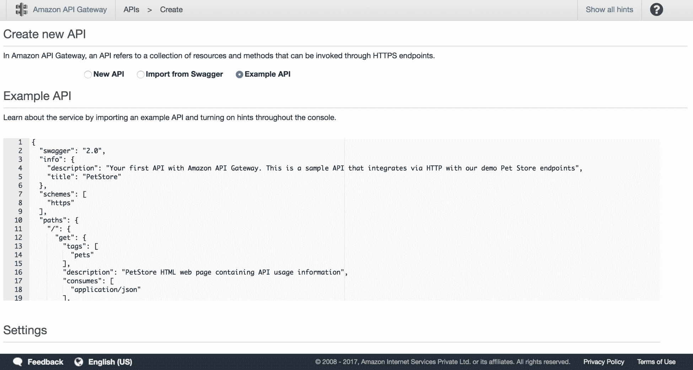

我们在本例中构建的 API 用于宠物商店和在商店内维护宠物。通过浏览 API，您将看到 API 的各个部分是什么样子的。API 如下所示：

4.  单击末尾的导入按钮后，您将被重定向到我们刚刚创建的 PetStore（b7exp0d681）API 页面。包含所有组件的 API 页面如下所示：

5.  此 API 中的资源是“获取”和“发布”资源，您可以在其中添加宠物并查看宠物，这些宠物可以作为列表提供。我们创建的 API 中的资源列表如下：

6.  通过单击第一个 GET 资源，我们可以看到从客户端到端点再返回客户端的详细执行流。资源的执行流如下所示：

7.  现在，如果我们单击 POST 资源，我们将找到 POST 资源的类似模型执行流。它看起来非常类似于 GET 资源，但是，这里 API 端点被称为 URL，因为我们正试图从中检索结果。执行模型如下所示：

在 API 网关中，有一种称为阶段的东西，可以用作 API 的版本控制模型。在实践中，阶段的一些常见名称是**测试**、**开发**和**生产**。“阶段”菜单如下所示：

7.  单击“创建”选项时，它将打开该阶段的创建向导。情况如下：

8.  您可以为“阶段名称”值选择任何名称，并根据已分配的名称和您对此阶段的目的添加“阶段描述”值。在此之前，您需要部署已创建的 API。这可以在操作下拉菜单中选择为部署 API 按钮，如下所示：

9.  在下一个菜单中，您可以选择阶段名称和其他详细信息，然后单击 Deploy 按钮，该按钮将使用该特定阶段部署 API。这可以看出如下几点：

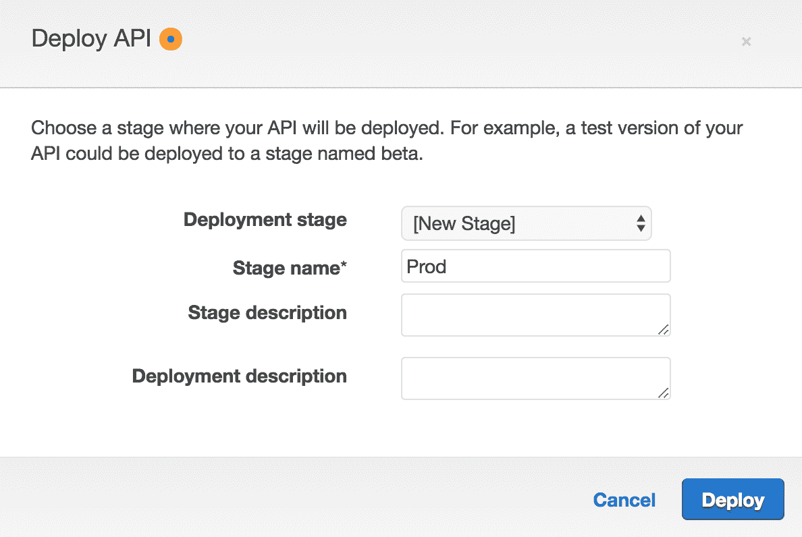

部署阶段如下所示：

# 建立集成

随着我们现在了解了 AWS API 网关服务在基本级别上的工作方式，我们将继续使用这些知识构建一个端到端项目，该项目涉及部署一个完全无服务器的 API。

在本节中，我们将从头开始构建和部署一个完全无服务器的 API 函数，同时学习 AWS Lambda AWS API 网关集成的内部内容和其他实现细节。我们将逐步构建无服务器 API。因此，请按照以下顺序执行步骤。程序如下：

1.  首先，我们将从创建一个新的 API 开始。这可以通过 Lambda 控制台完成，该控制台如下所示：

2.  单击+创建 API 按钮后，将重定向到 API 创建向导，在该向导中，将要求您输入要构建的 API 的名称和说明。目前，我已输入名称为`TestLambdaAPI`。但是，您可以自由添加您想要输入的任何名称和描述。API 创建控制台如下所示：

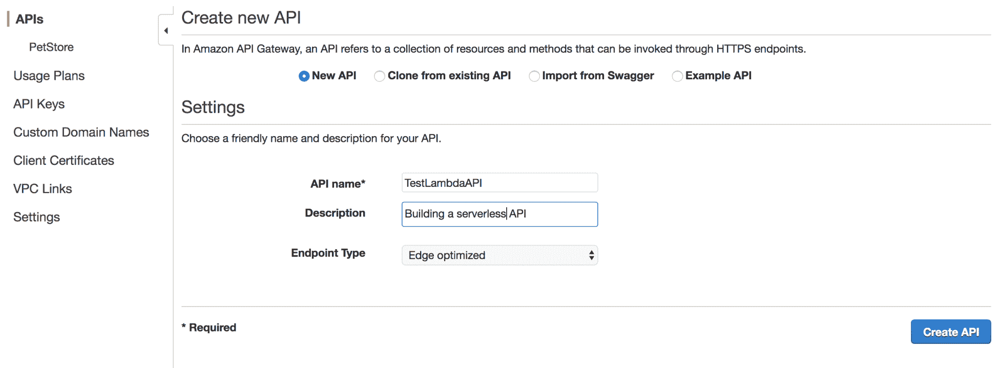

3.  单击“创建 API”按钮后，将重定向到已创建的 API 页面。API 页面看起来与此类似：

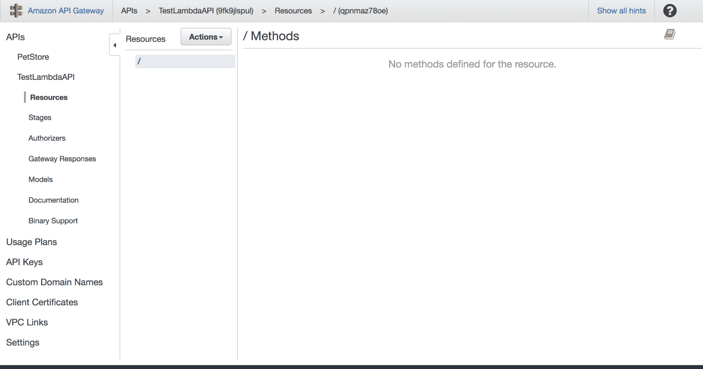

4.  既然我们已经成功地创建了一个 API，现在我们将继续在 API 中创建资源。您可以通过单击“操作”下拉菜单中的“创建资源”选项来执行此操作：

5.  这将打开一个资源创建向导，您可以在其中添加我们打算构建的 API 资源的名称和资源路径。创建资源后，单击“创建资源”按钮以相应地创建 API 资源。为了本教程，我将其命名为`LambdaAPI`。然而，你可以给它取任何你想要的名字。API 创建向导如下所示：

您刚刚创建的资源现在位于 API 控制台中；您可以在参考资料部分看到它：

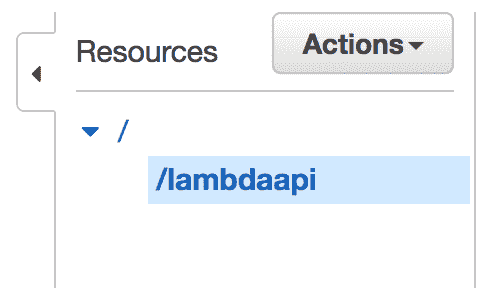

6.  您可以创建资源的版本，甚至只创建资源下的资源。让我们继续创建一个。为此，您需要单击已创建的资源。然后，单击操作菜单下拉菜单中的创建资源选项：

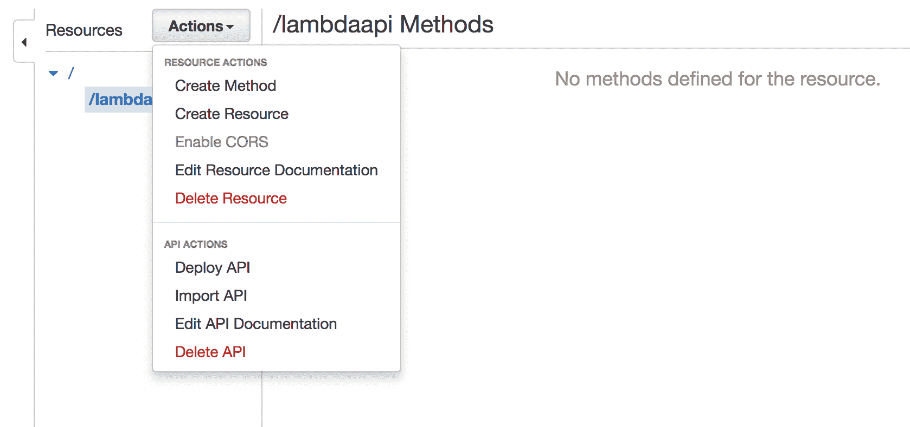

7.  这将在我们已经创建的资源下打开一个类似的资源创建向导。您可以将该资源命名为`version1`或`v1`，这是一种常规的软件实践。我把它命名为`v1`。但是，您可以随意命名：

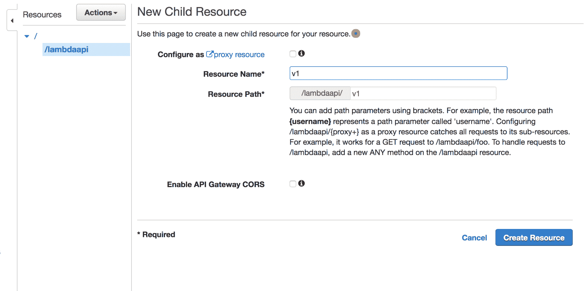

现在，我们在已经存在的资源`/lambdaapi`下有一个名为`v1`的资源。我们可以在参考资料部分看到这一点。因此，我们 API 的资源层次结构如下所示：

8.  我们将创建一个无服务器 API，用于获取和查询宠物商店中的宠物列表。因此，将相应地调整以下步骤。API 应返回宠物的名称。因此，我们将有一个新的宠物资源。我们将在`/v1`资源下为此创建一个资源：

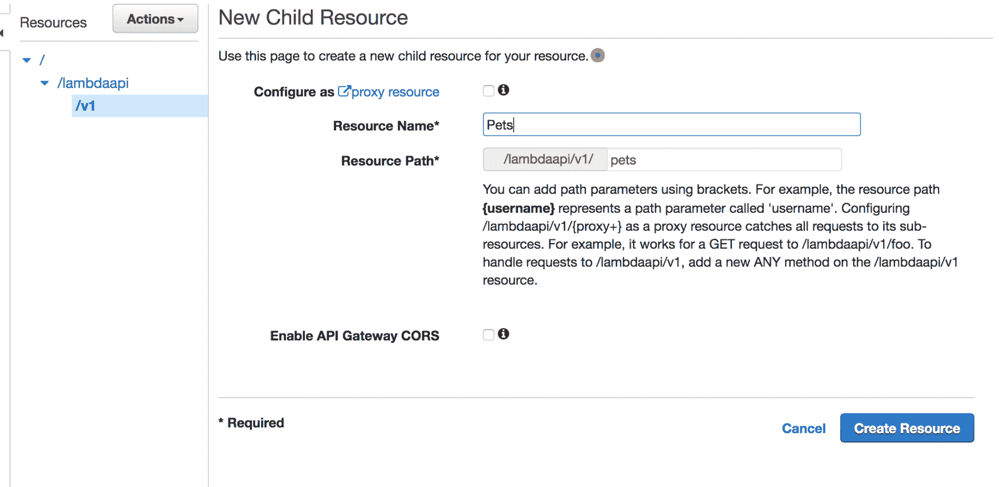

9.  在`/v1`资源下添加`/pets`资源后，我们 API 的结果层次结构如下所示：

10.  现在，我们将添加一个自定义资源，使我们能够查询 API。所谓自定义，我们的意思是，当向此 API 发送请求时，可以向资源添加任何字符串，API 将在通过 Lambda 代码检查和查询该字符串后发回请求。自定义资源可以与普通资源区分开来，因为它们可以用花括号创建。以下屏幕截图将帮助您了解如何创建它们：

11.  点击创建资源按钮后，将为`/pets`创建新的自定义子资源。资源的层次结构如下所示：

12.  API 的整体结构如下所示，如以下屏幕截图右上部分所示：

13.  现在，我们将向这个自定义资源添加方法。因为我们将只查询宠物列表，所以我们只添加 GET 方法。这可以通过单击{type}资源并在顶部面板的下拉操作菜单中单击创建方法来完成：

14.  这将在{type}资源下创建一个小的下拉式菜单，您可以在其中从可用的方法中选择一个方法：

15.  我们需要从可用选项中选择 GET 选项。这将如下所示：

16.  选择 GET 选项并单击它旁边的小勾号按钮后，我们将在{type}资源下创建 GET 方法。层次结构现在如下所示：

# 部署 Lambda 函数以执行 API

在本节中，我们将了解部署 Lambda 函数的步骤：

1.  当您单击 GET 方法时，还可以在 API 控制台的右侧看到该方法的详细信息。详情如下:

2.  在 GET 方法控制台中，单击 Lambda 函数选项。根据您的偏好选择任意一个区域。我已选择 us-east-1 作为区域，如以下屏幕截图所示：

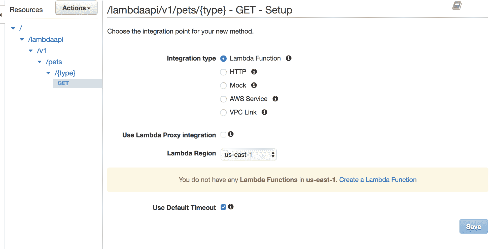

3.  正如所料，它说我们在那个区域没有 Lambda 函数。所以，我们需要继续前进，创造一个。单击“创建 Lambda 函数”链接。这将带您进入我们已经熟悉的 Lambda 创建控制台：

4.  从这里，从蓝图列表中选择关键字：hello world python blueprint：

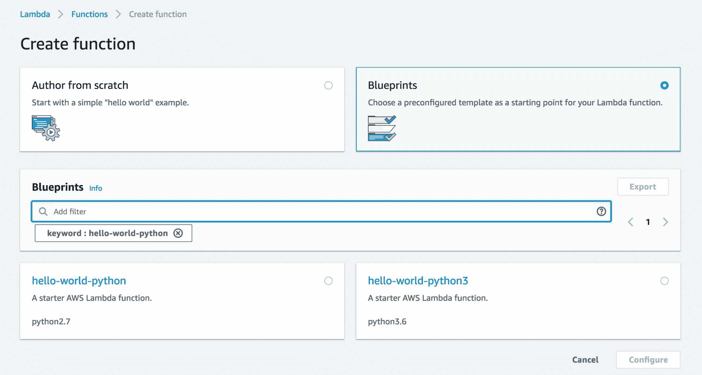

5.  在下一个控制台中，选择 Lambda 函数的基本信息，如前几章所述：

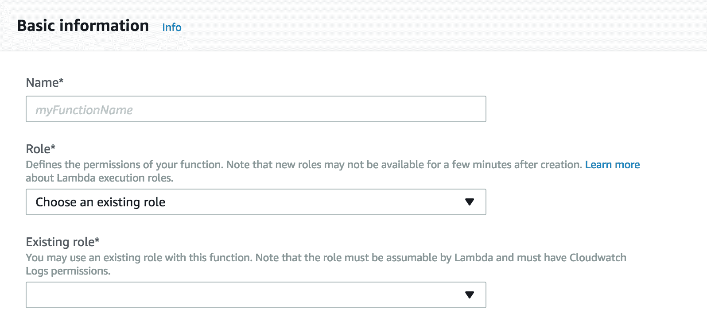

6.  添加相关详细信息后，单击橙色创建功能按钮。这将带您进入刚刚创建的 Lambda 函数页面。可以从此处开始编辑代码：

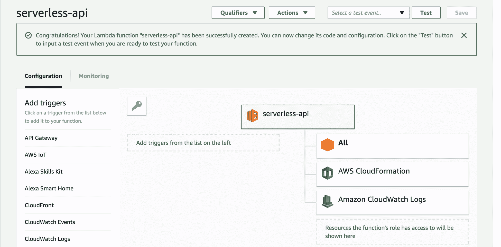

7.  在函数的代码中，使用此代码，而不是蓝图中提供的代码：

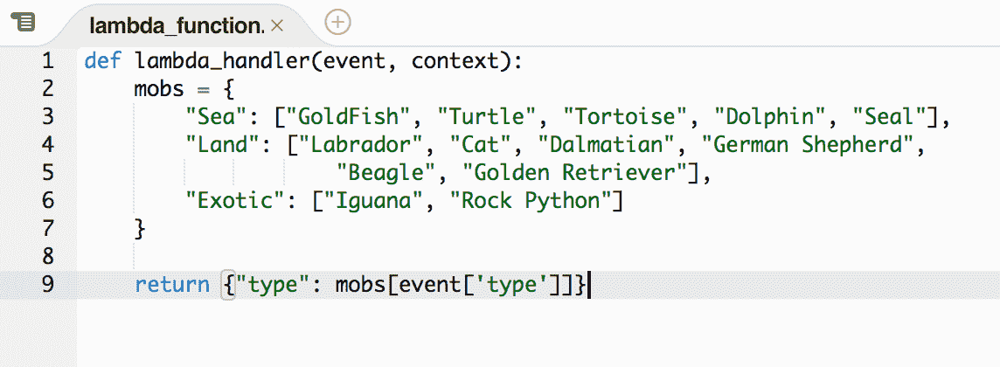

8.  我们现在已经完成了对函数代码的调整。现在，您可以继续并保存该函数：

9.  现在，回到 API 网关控制台，进入 GET 方法页面。在这里，在 us-east-1 区域的 Lambda 函数下，我开始获取刚才创建的 Lambda 函数（无服务器 api）作为一个选项：

10.  单击 Save（保存）时，您将看到一个弹出窗口，要求您确认您正在授予 API Gateway 调用 Lambda 函数的权限，您可以通过单击 OK（确定）进行确认：

11.  单击 OK 后，您将被重定向到 GET 方法的 data flow 页面，如下所示：

# 处理身份验证和用户控制

部署之后，接下来我们将讨论如何处理身份验证和用户控件。步骤如下：

1.  现在我们已经成功地创建了无服务器 API 的框架，现在我们将研究使其成为一个功能完整的 API 所需的细节。我们将从应用映射模板开始。这可以在集成请求菜单中完成。单击 Integration Request（集成请求）链接将带您进入控制台，如下所示：

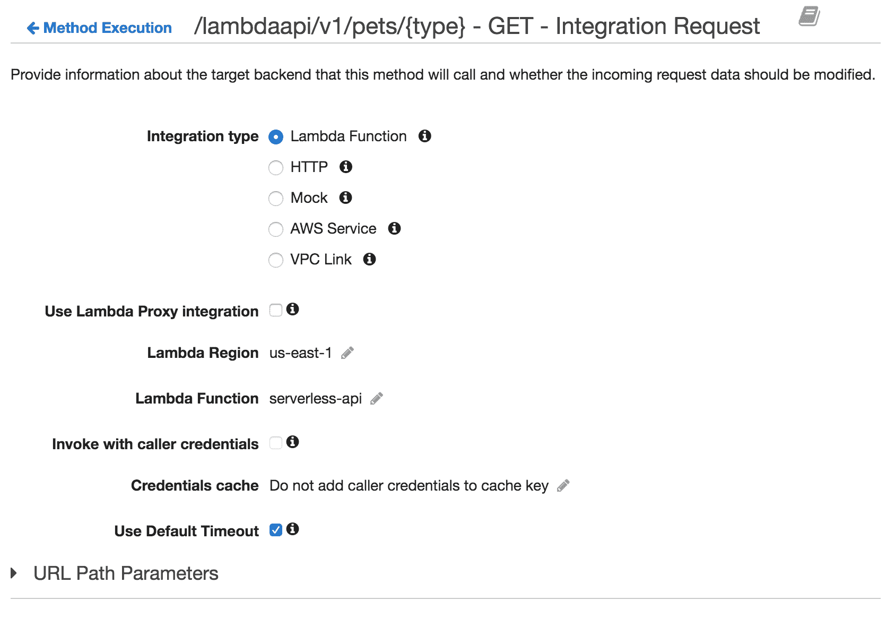

2.  如果在同一控制台中向下滚动一点，您将注意到末尾的 Body Mapping Templates 部分：

3.  单击主体映射模板将展开该特定部分中可用的选项：

4.  选择第二个选项，该选项表示没有定义模板时（推荐）。然后，点击添加映射模板选项并添加`application/json`，然后点击其旁边的灰色小勾号：

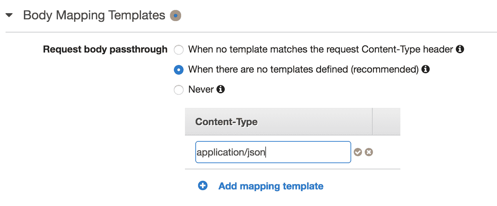

5.  单击旁边的灰色小勾号符号后，主体贴图模板剖面空间将如下所示：

6.  现在，在模板文本框中，添加以下代码并单击文本框下方的保存按钮：

7.  因此，完成所有这些步骤后，生成的 Body Mapping Templates 部分将如下所示：

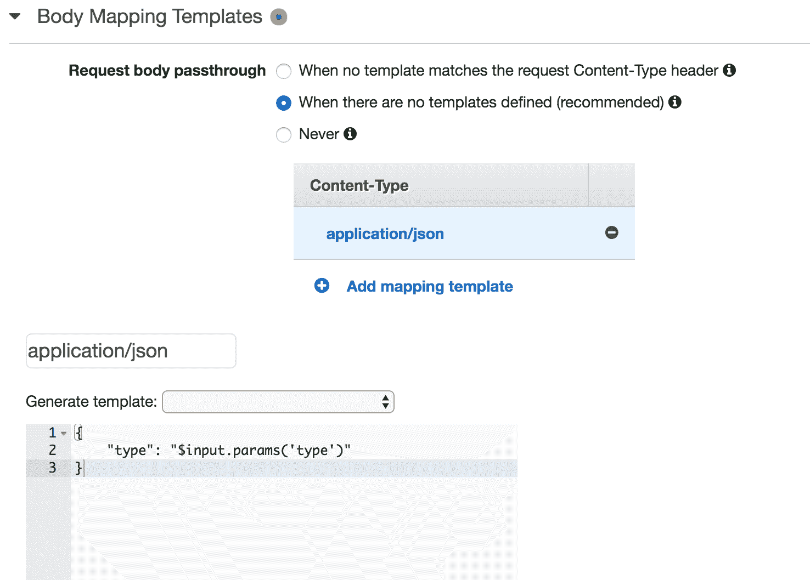

8.  现在，回到“方法执行”页面，我们可以看到左侧的测试选项，下面有一个闪电符号：

9.  单击客户端部分左侧和 thunderbolt 选项上方的 TEST 按钮，将进入一个页面，您可以在其中测试刚刚创建的 API：

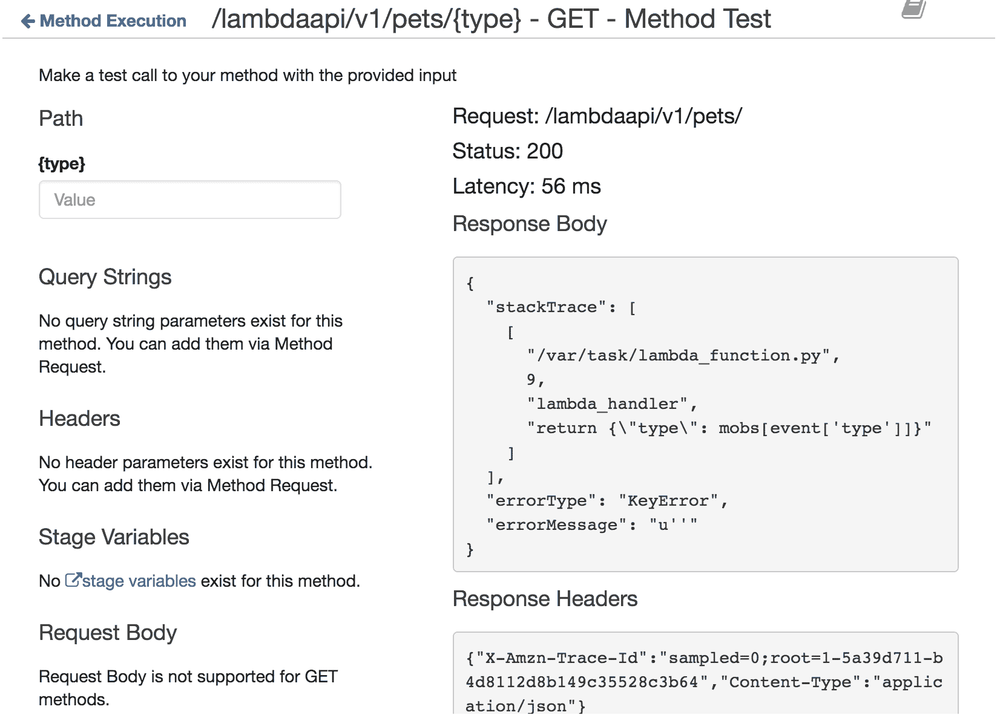

10.  现在，让我们在{type}下面的文本框中键入`Exotic`，然后单击底部的测试按钮。如果一切顺利，我们应该看到在 Lambda 函数的函数代码中输入的所有外来宠物的列表：

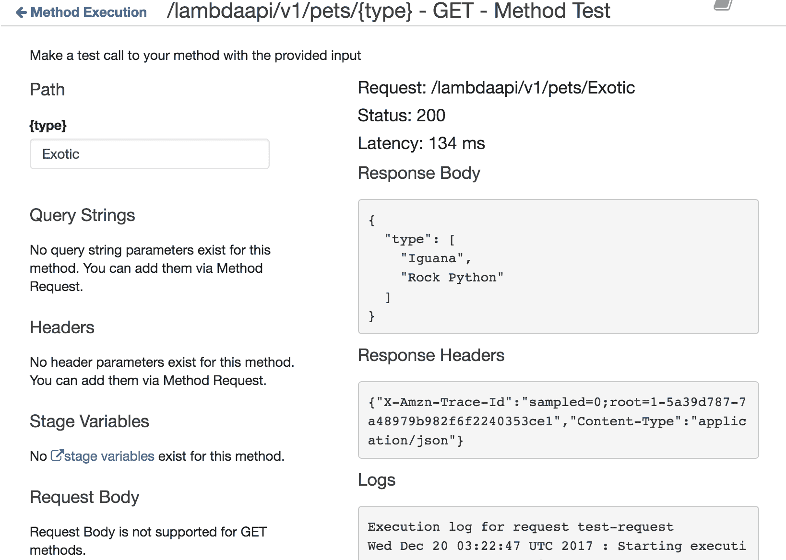

11.  没错，我们确实得到了目录中所有外来宠物的名单。因此，本章到此结束，您已经了解了如何从头构建一个成熟的无服务器 API，包括如何部署它。

12.  此外，如果要添加其他安全设置，如所需的授权和 API 密钥，可以在“方法请求”菜单中进行：

# 总结

在本章中，我们学习了如何从头构建一个完全没有服务器的 API。我们还学习了如何为 API 添加更多资源和方法，以及如何将其成功部署到多个开发阶段，以及如何添加额外的安全设置，例如用于身份验证的授权和 API 密钥。

然后，我们学习了如何将 Lambda 函数与 API 网关的 API 服务相关联，以处理 API 的计算任务。

在下一章中，我们将学习记录和监视无服务器应用。在这一章中，我们将详细了解 AWS 的日志记录和监视服务，如 CloudWatch Metrics、CloudWatch 日志和 CloudWatch 仪表盘，并尝试为我们的无服务器应用设置它们。我们还将学习如何使用一些 AWS 服务创建从 AWS Lambda 到这些监控工具的日志记录和监控管道。