# 四、日志和监控

我们已经了解了无服务器架构的概念，并了解了 AWS 的无服务器服务 AWS Lambda 的基础知识和内部结构。我们还创建了一些示例无服务器项目，以便更好地理解这些概念。在学习过程中，我们还学习了其他几个 AWS 服务的基础知识，如 alarms、SNS、SQS、S3 Bucket 和 CloudWatch。

在本章中，我们将学习如何对我们正在构建的无服务器系统进行日志记录和监视。记录和监控软件代码和系统非常重要，因为它们帮助我们进行遥测和灾难恢复。日志记录是一个过程，我们在其中存储代码或体系结构作为一个整体发出的日志。监视是一个过程，我们在其中密切监视代码或体系结构中的组件和过程的活动、状态和运行状况。

因此，您将学习如何设置和理解 AWS Lambda 的监控套件，该套件与 AWS 的监控服务 CloudWatch 仪表盘紧密集成。我们还将了解 AWS 的日志服务，即 CloudWatch 日志服务。最后，我们还将了解和理解 AWS 的分布式跟踪和监视服务，即 CloudTrail 服务。

本章涵盖以下主题：

*   了解 CloudWatch
*   了解 CloudTrail
*   CloudWatch 中的 Lambda 度量
*   Lambda 在 CloudWatch 中的日志
*   Lambda 中的日志语句

# 了解 CloudWatch

如前所述，CloudWatch 是 AWS 的日志记录和监控服务。我们已经了解了 CloudWatch 警报，它是 CloudWatch 的一个子功能。现在，我们将了解该服务的图形套件。AWS 环境中的几乎每个服务都有一种方法可以将其日志和度量发送到 CloudWatch，以便进行日志记录和监视。根据功能的不同，每个服务可能有几个可以监控的指标。

类似地，AWS Lambda 还具有一些指标，例如调用计数、调用的运行时间等，它将这些指标发送给 CloudWatch。值得注意的是，开发人员还可以向 CloudWatch 发送自定义指标。因此，在以下步骤中，我们将学习与 AWS Lambda 相对应的 AWS CloudWatch 的不同部分和功能：

1.  首先，让我们看看 CloudWatch 控制台是什么样子，并通过在控制台周围导航来感受一下它。浏览至[console.aws.amazon.com/cloudwatch/](https://signin.aws.amazon.com/signin?redirect_uri=https%3A%2F%2Fconsole.aws.amazon.com%2Fcloudwatch%2F%3Fstate%3DhashArgs%2523%26isauthcode%3Dtrue&client_id=arn%3Aaws%3Aiam%3A%3A015428540659%3Auser%2Fcloudwatch&forceMobileApp=0)：


2.  我们可以看到，CloudWatch 控制台中有很多信息。因此，我们现在将尝试一个接一个地理解每个组件。在左侧，我们可以看到一个选项列表，其中包括仪表板、警报、账单等。作为理解 CloudWatch 控制台的一部分，我们将尝试了解它们及其功能。

3.  这里的仪表板是用户可以配置的 CloudWatch 指标面板。例如，用户可能希望在一个地方有一组特定的服务器（EC2）指标，以便能够更好地监控它们。这就是 AWS CloudWatch 仪表板发挥作用的地方。单击左侧的仪表板选项时，可以看到仪表板控制台，如下所示：


4.  让我们通过单击控制台左上方的蓝色“创建仪表板”按钮来创建一个新的仪表板。出现以下框：


5.  这将带您进入下一步，在该步骤中，您将被要求为仪表板选择小部件类型。目前有四种类型的小部件可用。小部件选择屏幕如下所示：


6.  为了学习本教程，我选择了线条样式小部件。您可以选择任何适合您的图形风格和需要执行的监视的小部件。选择小部件样式并单击蓝色的“配置”按钮后，系统将重定向到向导，要求您添加度量，如以下屏幕截图所示：

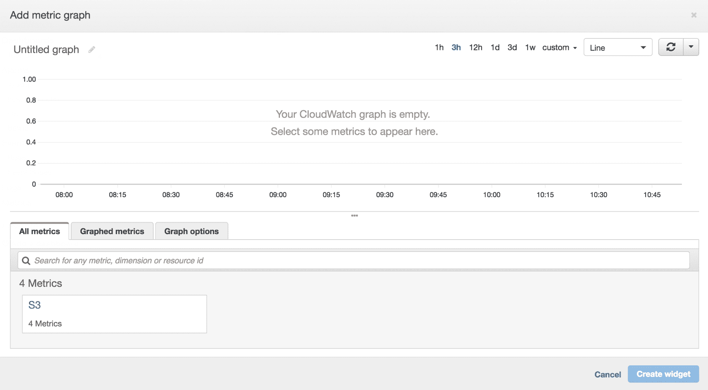

7.  在底部选择一个可用指标，它将被添加到小部件中。选择完指标后，单击页面右下角的蓝色创建小部件按钮，如以下屏幕截图所示：


8.  现在，您可以在“仪表板”部分中看到刚刚创建的仪表板：


9.  我们已经成功学习并创建了 AWS CloudWatch 仪表板。我们现在将继续学习 CloudWatch 事件。在前面的章节中，我们已经了解了 CloudWatch 警报，了解了它们的功能以及如何创建和使用它们。
10.  单击左侧 CloudWatch 菜单中的事件链接。您将被重定向到 CloudWatch 事件页面，如以下屏幕截图所示：

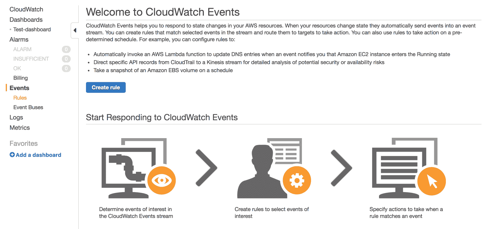

11.  单击蓝色的“创建规则”按钮后，将重定向到事件创建向导，如下所示：

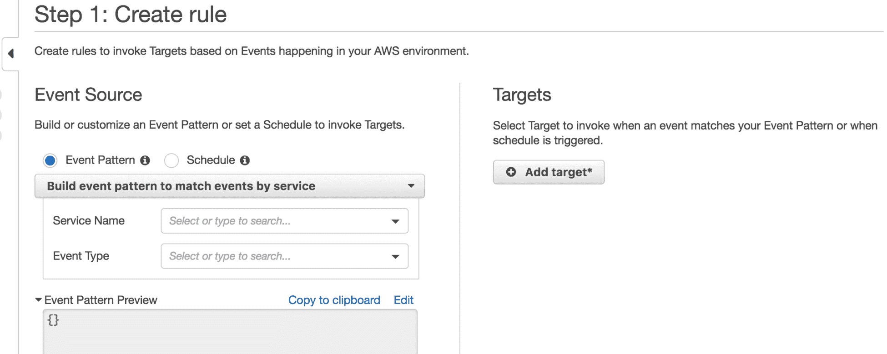

12.  事件可以有两种类型，即事件模式和时间表，每种类型都有不同的目的。在这里，我们将只了解调度类型，因为它对于调度 Lambda 函数非常方便：


13.  速率可以以分钟、小时或天为单位设置，也可以设置为 cron 表达式，以您满意的方式设置。现在，需要选择目标。目标可以是任何有效的 Lambda 函数，如以下下拉菜单所示：


14.  选择功能后，可以单击底部的蓝色配置详细信息。它将带您进入配置规则详细信息页面，如以下屏幕截图所示：


15.  输入要创建的规则的名称和说明后，可以单击底部的蓝色“创建规则”按钮。这将成功创建一个事件，同样的事件将反映在您的 CloudWatch 控制台中：


我们已经成功地为 Lambda 函数添加了一个 cron 事件，这意味着将按照用户在事件设置中指定的时间间隔调用 Lambda

16.  现在，我们将尝试了解 AWS CloudWatch 的日志功能。这是 Lambda 函数存储日志的地方。您可以单击左侧菜单中的 Logs 链接访问 CloudWatch 日志控制台：


17.  在本书的整个过程中，我们可以看到所有 Lambda 函数的完整日志列表。单击日志组时，可以找到有关它的更多详细信息，以及自定义选项。每个日志流都是对与日志关联的 Lambda 函数的调用：


18.  您还可以利用 CloudWatch 提供的其他功能来处理日志数据，这些功能可以在日志组的下拉操作菜单中看到：

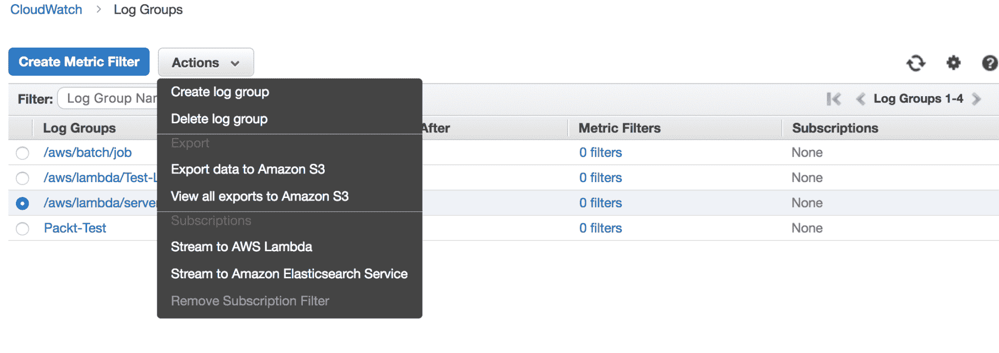

19.  最后，我们将通过探索和学习 CloudWatch 指标来结束本文。通过单击 CloudWatch 控制台左侧的 metrics 选项，可以访问 metrics 控制台：


20.  您可以选择底部菜单中的任何选项来绘制度量。在本教程中，我添加了一个 Lambda 度量，即函数`serverless-api`中的错误数：


# 了解 CloudTrail

CloudTrail 是 AWS 的另一项监控服务，您可以在其中查看 AWS 帐户中发生的所有事件和跟踪。在如何记录和存储事件和轨迹方面，该服务比 CloudWatch 服务更为详细。

因此，我们将通过以下步骤来探索和了解此项服务：

1.  AWS CloudTrail 的仪表板可访问[console.AWS.amazon.com/CloudTrail/](https://signin.aws.amazon.com/signin?redirect_uri=https%3A%2F%2Fconsole.aws.amazon.com%2Fcloudtrail%2Fhome%3Fstate%3DhashArgs%2523%26isauthcode%3Dtrue&client_id=arn%3Aaws%3Aiam%3A%3A015428540659%3Auser%2Fcloudtrail&forceMobileApp=0)：


2.  单击事件历史按钮时，可以在 CloudTrail 菜单的左侧看到 AWS 帐户中的事件列表。事件历史记录页面如下所示：


3.  CloudTrail 的第三个功能是 trails。用户可以为其 AWS 服务（如 Lambda）设置跟踪。可以在 trails 仪表板上找到已设置的轨迹。点击左侧菜单中的 Trails 选项，进入 Trails 控制台，即可访问：


4.  现在，让我们了解如何在 CloudTrail 仪表板中创建跟踪。您可以转到 CloudTrail 的主仪表板并单击蓝色的 Create trail 按钮。这将带您进入轨迹创建向导：


5.  你可以在这里输入你的线索的详细信息。您可以保留“将跟踪应用于所有区域”和“管理事件”选项的默认选项：


6.  现在，转到下一个设置，选择 Lambda 选项，并单击“选项”列表中的“记录所有当前和将来的函数”。这将确保我们的所有 Lambda 功能都使用 CloudTrail 正确记录：

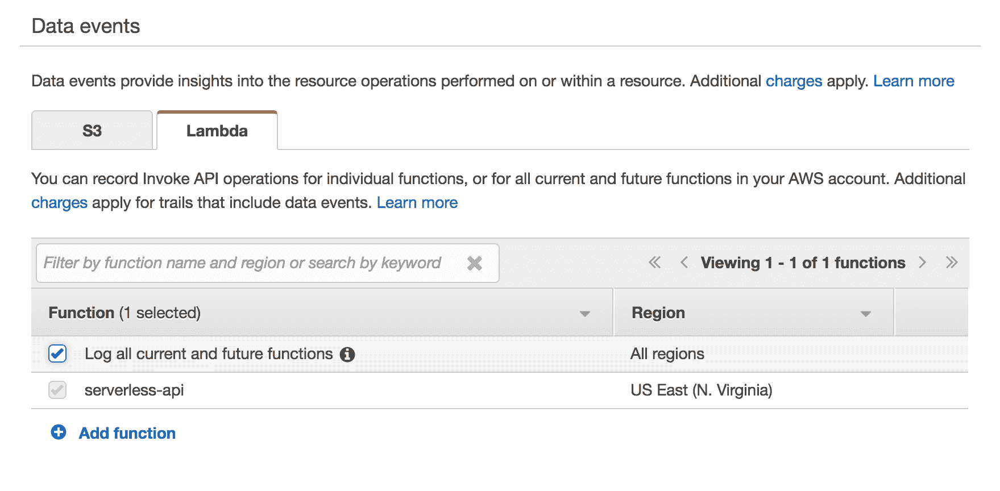

7.  现在，在最终存储位置选项中，选择一个 S3 存储桶来存储 CloudTrail 日志。这可以是一个已经存在的 bucket，也可以要求 CloudTrail 为此创建一个新 bucket。我正在使用现有的桶：


8.  相应地配置所有详细信息和设置后，您可以单击蓝色的创建轨迹按钮来创建轨迹。现在，您可以在 CloudTrail 仪表板中看到刚才创建的轨迹，如以下屏幕截图所示：


9.  现在，当您单击刚刚创建的轨迹时，您可以看到其配置的所有详细信息，如以下屏幕截图所示：


10.  您还可以注意到一个非常有趣的选项，它使您能够配置 CloudWatch 日志和 SNS，以通知您任何特定的活动，例如当 Lambda 函数中出现错误时：


11.  最后，您还可以向跟踪添加标记，就像您可以使用 AWS 的其他服务一样：


12.  此外，让我们了解如何为跟踪配置 CloudWatch 日志。因此，为此，您需要单击标记部分上方 CloudWatch 日志部分中的蓝色配置按钮：


13.  单击“继续”后，将进入创建向导，您需要在其中使用 IAM 角色设置相应地配置权限。在本教程中，我选择了创建新 IAM 角色选项，如以下屏幕截图所示：


14.  配置完 IAM 角色设置后，可以单击底部的蓝色“允许”按钮。经过几秒钟的验证后，将配置 CloudWatch 日志，您可以在此处相同的 CloudWatch 日志部分看到：


# CloudWatch 中的 Lambda 度量

我们已经了解并理解了 CloudWatch 和 CloudTrail 服务在日志记录和监控方面的工作方式，我们将继续尝试并为我们的 Lambda 功能实现它们。在本节中，您将了解 Lambda 拥有的由 CloudWatch 监控的度量类型，以及如何使用所有这些度量创建仪表板。

与本章和本书前面的章节类似，我们将尝试通过以下步骤理解这些概念：

1.  导航到 AWS Lambda 控制台时，您将在可用函数列表中看到已创建的 Lambda 函数：


2.  单击该功能时，您将在顶部看到两个可用选项：配置和监视。导航到监控部分。您将看到一个度量仪表板，其中包含以下内容：
    *   调用
    *   期间
    *   错误
    *   节流
    *   迭代器年龄
    *   DLQ 错误


Invocations and duration


Errors and Throttles


Iterator age and DLQ errors

3.  让我们详细了解其中的每一项。第一个度量是调用度量，它在*x*轴上有时间，在*y*轴上有 Lambda 函数的调用次数。此指标有助于我们了解 Lambda 函数的开票时间和次数：


单击“跳转到日志”时，它会将您带到 Lambda 调用的 CloudWatch 日志控制台，如下所示：


当您单击跳转到度量选项时，它会将您带到该特定度量的 CloudWatch 度量仪表板，该仪表板为您提供了一个相同度量的更为定制和细化的图形，如下所示：


4.  Lambda 监控仪表板中的第二个度量是持续时间度量，它告诉您每次调用 Lambda 函数的持续时间。它还有时间作为*X*轴，持续时间在*Y*轴以毫秒为单位。它还告诉您 Lambda 函数在一段时间内的最大、平均和最小持续时间：


5.  同样，单击跳转到日志按钮将带您进入与上一个度量相同的页面。单击跳转到度量按钮将进入持续时间度量的 CloudWatch 度量页面，如下所示：

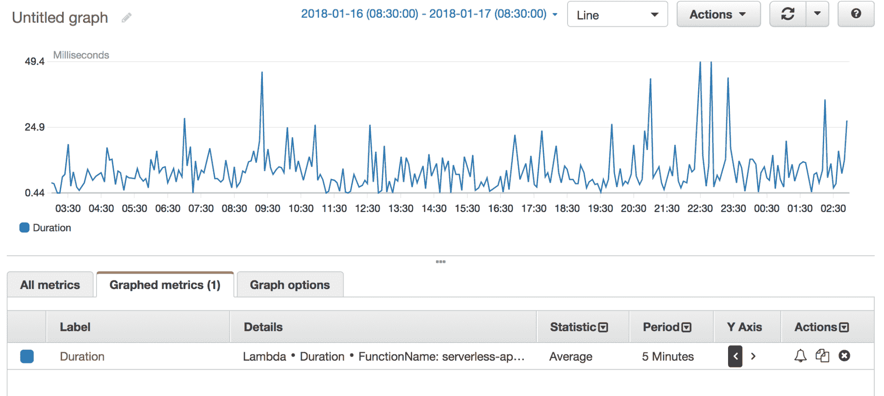

6.  第三个度量是 Errors 度量，它帮助我们在调用 Lambda 函数时注意错误。*Y*轴为错误数，*X*轴为时间线：


7.  单击跳转到指标链接，可以看到相同指标的 CloudWatch 仪表板：

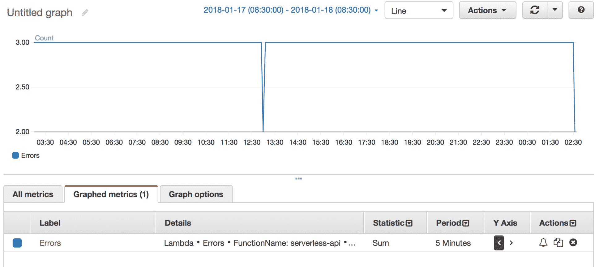

8.  第四个指标是节流。此指标统计 Lambda 函数被限制的次数，这意味着函数的并发执行次数超过了每个区域 1000 次的设置限制。我们不会经常遇到这种度量，因为我们在本书中作为示例构建的 Lambda 函数在并发限制范围内保持良好：

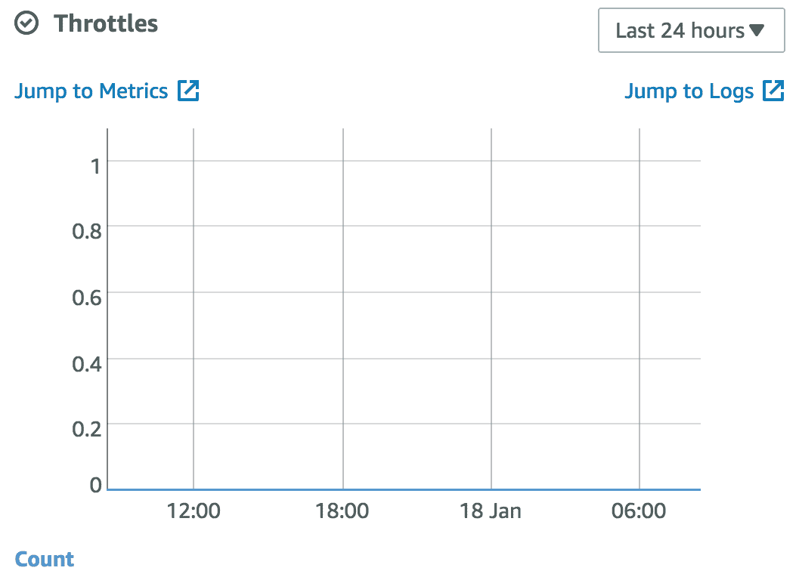

9.  通过单击跳转到度量链接，我们还可以在 CloudWatch 度量仪表板中看到此度量：


10.  第五个指标是迭代器年龄。这仅适用于由 DynamoDB 流或 Kinesis 流触发的功能。它给出函数处理的最后一条记录的时间：


跳转到指标链接可将您带到该指标的 CloudWatch 指标仪表板：


11.  第六个也是最后一个度量是 DLQ 错误度量。这将给出向死信队列发送消息（失败事件有效负载）时发生的错误数。错误通常是由错误的权限配置和超时引起的：


跳转到度量链接将带您进入相同度量的 CloudWatch 度量仪表板：

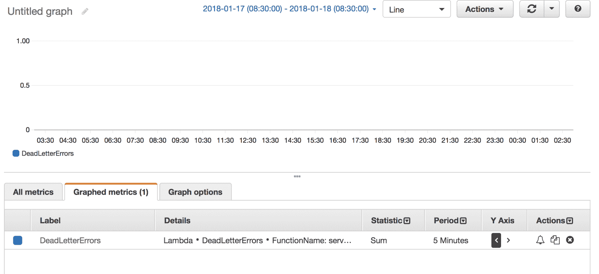

# Lambda 在 CloudWatch 中的日志

到目前为止，我们已经非常详细地了解了 AWS Lambda 的度量标准。现在，我们将继续了解 Lambda 函数的日志。与往常一样，我们将通过以下步骤尝试理解它们：

1.  AWS Lambda 函数的日志存储在 CloudWatch 的日志服务中。您可以通过单击主 CloudWatch 仪表板转到日志仪表板来访问 CloudWatch 日志服务。

2.  当您单击列表中无服务器 api 的日志/aws/lambda/serverless api 时，我们转到无服务器 api 的日志流，如下所示：


3.  这里的每个日志流都是一个 Lambda 调用。因此，无论何时调用 Lambda 函数，它都会在此处创建一个新的日志流。如果调用是 Lambda 重试过程的一部分，那么该特定调用的日志将写入最新的日志流中。单个日志流可以包含多个详细信息。但首先，让我们看看特定的日志流是什么样子的：

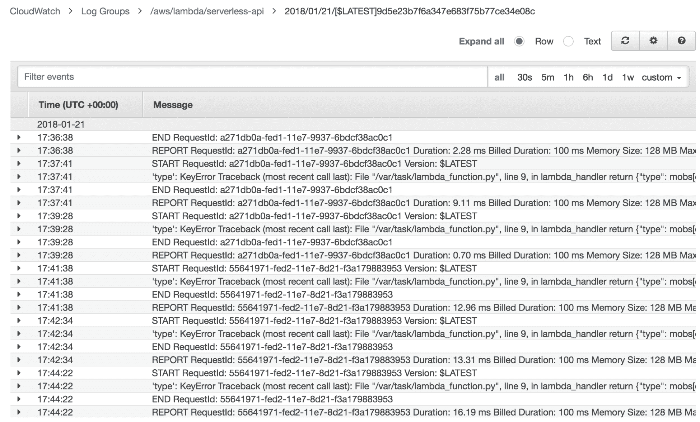

4.  此外，如果仔细观察，可以发现 Lambda 的日志还提供了有关 Lambda 函数调用持续时间、计费持续时间以及函数使用内存的信息。这些指标有助于更好地了解我们的功能性能，并有助于进一步优化和微调：

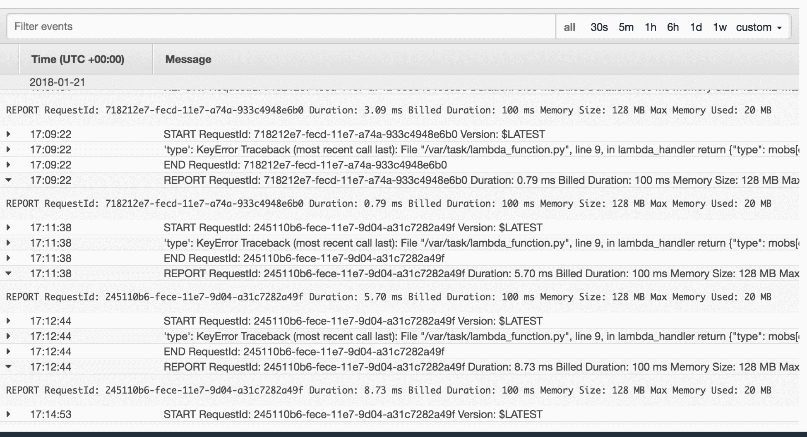

5.  CloudWatch 日志中有几个列供您选择，在前面的屏幕截图中没有显示。以下是可用的选项：

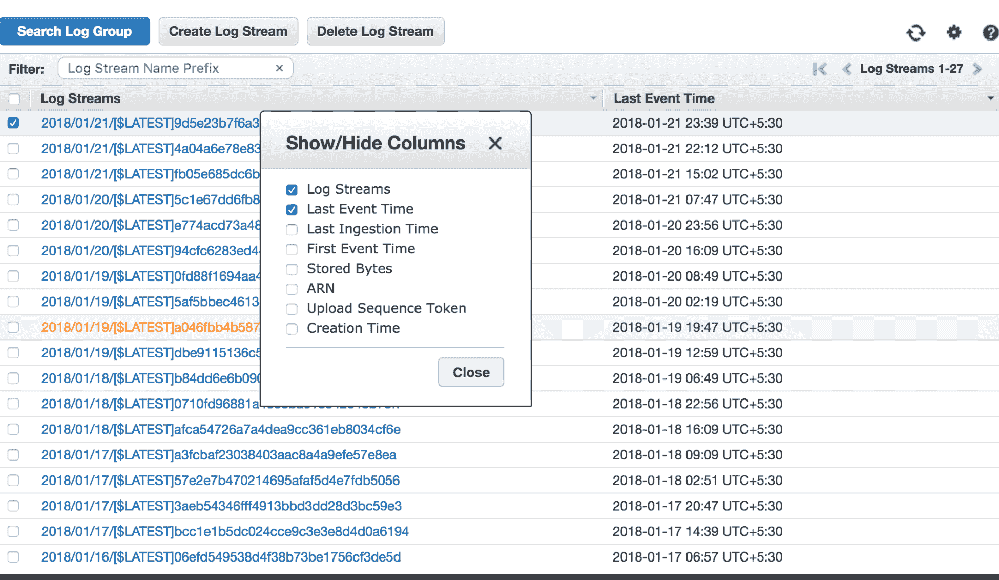

因此，当您选择更多这些选项时，您将在仪表板中看到它们作为列。当您对我们的 Lambda 函数进行更细粒度的调试时，这些工具非常有用：

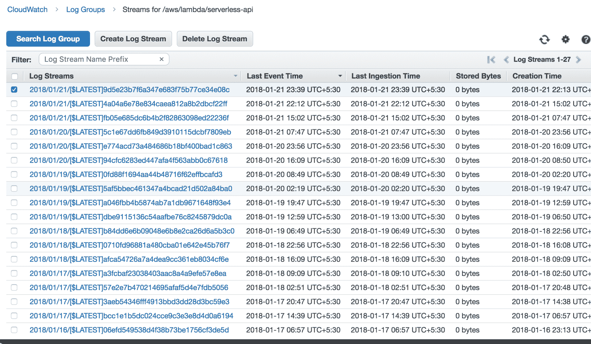

# Lambda 中的日志语句

清楚地记录您的评论和错误始终是一种良好的软件实践。现在，我们将了解如何从 Lambda 函数内部进行日志记录。Lambda 函数中有两种记录日志的方法。现在，我们将通过以下步骤中的示例来学习和理解它们：

1.  第一种方法是使用 Python 的`logging`库。这被广泛用作登录 Python 脚本的标准实践。我们将编辑之前为 serverless API 编写的代码，并在其中添加日志语句。代码如下所示：


前面屏幕截图中的代码如下所示：

```py
import logging
logger = logging.getLogger()
logger.setLevel(logging.INFO)
def lambda_handler(event, context):
 mobs = {
 "Sea": ["GoldFish", "Turtle", "Tortoise", "Dolphin", "Seal"],
 "Land": ["Labrador", "Cat", "Dalmatian", "German Shepherd",
 "Beagle", "Golden Retriever"],
 "Exotic": ["Iguana", "Rock Python"]
 }

 logger.info('got event{}'.format(event))
 logger.error('something went wrong')

 return 'Hello from Lambda!'
 #return {"type": mobs[event['type']]}
```

2.  现在，保存后运行 Lambda 函数时，可以看到绿色的成功执行语句，如下所示：

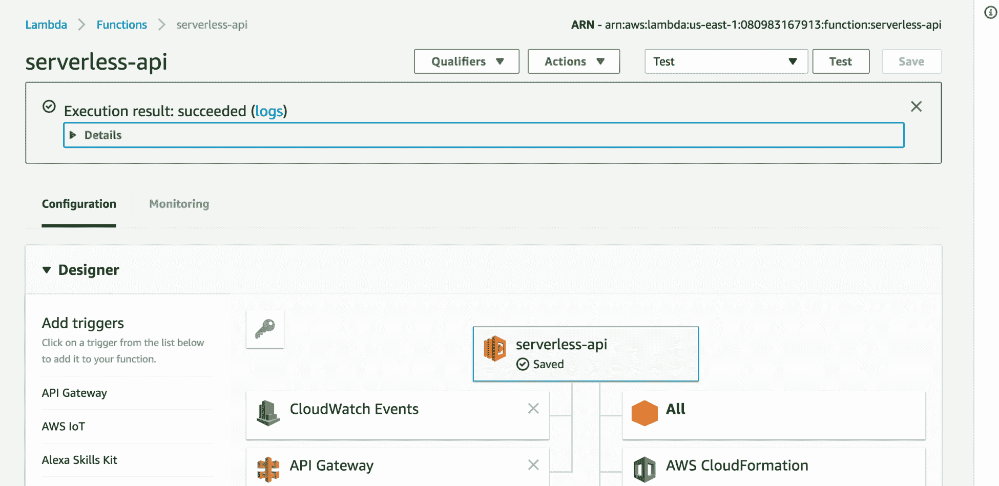

3.  单击“详细信息”选项时，可以清楚地看到正在执行的日志记录语句：


4.  记录语句的下一种方法是简单地使用 Python 中的`print`语句。这是在 Python 脚本中打印日志语句的最常用方法。因此，我们将在函数代码中添加一个`Hello from Lambda`print 语句，看看是否在 Lambda 执行中获得日志：


此 Lambda 函数的代码如下所示：

```py
 def lambda_handler(event, context):
 mobs = {
     "Sea": ["GoldFish", "Turtle", "Tortoise", "Dolphin", "Seal"],
     "Land": ["Labrador", "Cat", "Dalmatian", "German Shepherd",
     "Beagle", "Golden Retriever"],
     "Exotic": ["Iguana", "Rock Python"]
}
print 'Hello from Lambda!'
return 1
#return {"type": mobs[event['type']]}
```

5.  当我们点击 Test 执行代码时，我们会看到一条绿色消息，表示执行成功：


6.  同样，正如我们之前所做的，单击 Details（详细信息）切换将为您提供完整的执行日志：


7.  我们也可以看到`Hello from Lambda`信息。在 Lambda 函数的两个可用日志选项中，最好使用第一个选项，即通过 Python 的日志模块。这是因为该模块提供了更大的灵活性，并帮助您区分信息、错误和调试日志。

# 总结

在本章中，我们了解了 AWS 的监控和日志记录功能。我们还了解了 AWS 环境中可用的监视和日志记录工具。我们还学习了如何监控 Lambda 函数以及如何为 Lambda 函数设置日志记录

我们已经了解了业界遵循的日志记录和监视实践，以及从 Lambda 函数内部用 Python 记录语句的各种方法。

在下一章中，我们将学习如何扩展无服务器体系结构，使之成为分布式体系结构，并能够处理大量工作负载，同时仍保留无服务器设置的优点。