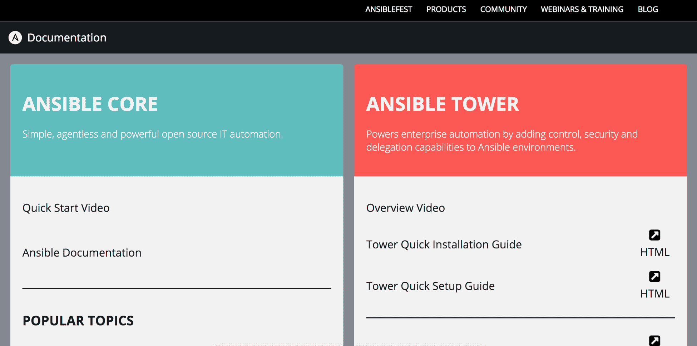
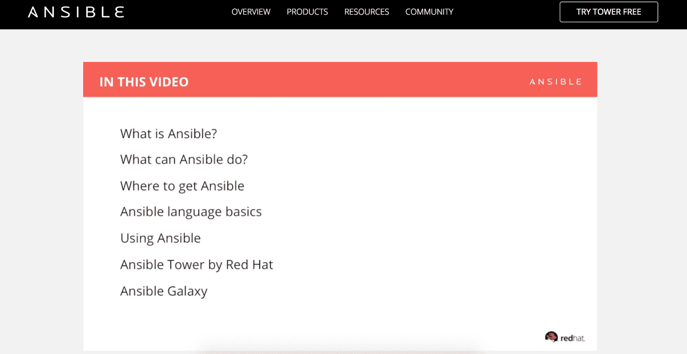
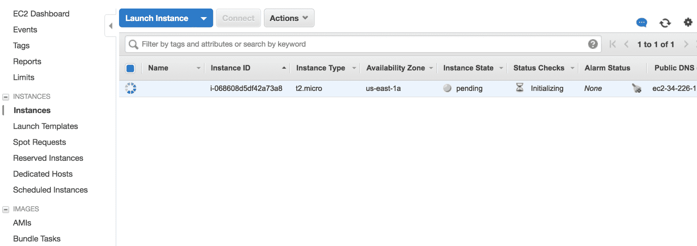
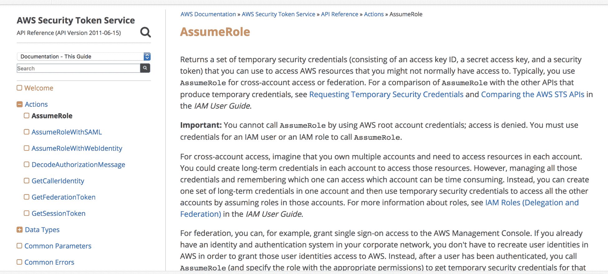
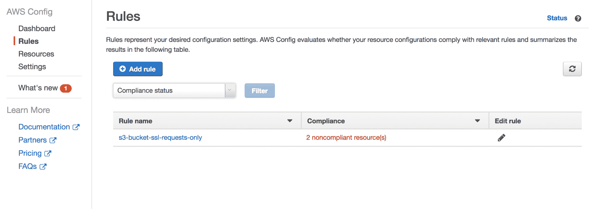

# 五、扩展无服务器架构

到目前为止，我们已经学习了如何构建、监视和记录无服务器功能。在本章中，我们将学习一些概念和工程技术，这些概念和技术将有助于扩展要分发的无服务器应用，并使它们能够以高标准的安全性和吞吐量处理繁重的工作负载。在本章中，我们还将使用一些第三方工具（如 Ansible）来扩展 Lambda 函数。我们将扩展 Lambda 功能，以生成分布式无服务器体系结构，这将涉及生成多个服务器（或 AWS 环境中的实例）。因此，在遵循本章中提到的示例时，您需要记住这一点。

本章假设具备供应工具的工作知识，如**Ansible**、**Chef**等。你可以在他们各自的网站上快速阅读或更新这些知识，在那里他们有快速教程。如果没有，那么您可以安全地跳过本章，继续下一章。

本章由五个部分组成，涵盖了扩展无服务器体系结构的所有基础知识，并将帮助您构建更大、更复杂的无服务器体系结构：

*   第三方编排工具
*   服务器的创建和终止
*   安全最佳做法
*   扩大规模的困难
*   处理困难

# 第三方编排工具

在本节中，我们将学习并精通基础架构资源调配和编排的概念。我们将探索一些工具，即 Chef 和 Ansible。让我们从以下步骤开始：

1.  我们将从介绍厨师开始。您可以访问厨师官网[https://www.chef.io/chef/](https://www.chef.io/chef/) ：


2.  厨师有一套非常好的教程，可以让你的手变脏。这些课程以 10 到 15 分钟的迷你教程的形式组织起来，以便于阅读。前往[https://learn.chef.io/](https://learn.chef.io/) 要访问它们：


3.  有关基础架构资源调配和编排的入门信息，请参阅此处的 Chef 文档：[https://docs.chef.io/](https://docs.chef.io/) 。页面如下所示：


4.  您可以参考文档中的 AWS 驱动程序资源页面，了解如何通过 Chef 与各种 AWS 服务交互，网址为：[https://docs.chef.io/provisioning_aws.html](https://docs.chef.io/provisioning_aws.html) 。页面如下所示：


5.  出于同样的目的，您也可以参考 aws 食谱。此资源具有非常好的文档和 API，用于与多个 AWS 服务交互。本文档的 URL 为[https://supermarket.chef.io/cookbooks/aws](https://supermarket.chef.io/cookbooks/aws) 。页面如下所示：


6.  当您向下滚动时，可直接在烹饪书标题后看到烹饪书的详细说明：


7.  另一个用于调配和编排软件资源的好工具是 Ansible。这有助于软件工程师编写代码，通过*yaml 脚本*自动化基础设施的几个部分。与 Chef 环境类似，这些脚本被称为**cookbooks**。
8.  在接下来的章节中，我们将使用此工具学习如何提供我们的基础设施。Ansible 的文档可在[中找到 http://docs.ansible.com/](http://docs.ansible.com/) ：



9.  产品 ANSIBLE TOWER 超出了本书的范围。我们将学习并与 ANSIBLE CORE 合作，ANSIBLE CORE 是 ANSIBLE 及其母公司红帽的旗舰产品。
10.  Ansible 有一个非常有用的视频，可以帮助您更好地理解和理解该工具。单击文档页面中的“快速入门视频”链接即可访问：



11.  观看视频后，您可以继续从文档本身了解产品。Ansible 的完整文档可访问：[http://docs.ansible.com/ansible/latest/index.html](http://docs.ansible.com/ansible/latest/index.html) ：


12.  EC2 模块是我们将用于配置和编排 AWS EC2 实例的模块。这部分文档对启动和终止 EC2 实例以及添加和安装卷有非常清楚的解释和演示；它还使我们能够将我们的 EC2 实例配置到我们自己特定的**虚拟私有云**（**VPC**）和/或我们自己的**安全组**（**SGs**中。EC2 文档屏幕如下所示：


13.  您可以在 Ansible Core 文档的以下 URL 中找到此信息：[http://docs.ansible.com/ansible/latest/ec2_module.html](http://docs.ansible.com/ansible/latest/ec2_module.html) 。进一步向下滚动时，您可以看到几个示例，说明如何将 Ansible 的 EC2 模块用于与 AWS EC2 实例相关的各种任务。其中一些可以看出如下：


# 服务器的创建和终止

在本章中，我们将学习如何使用一些第三方工具来帮助我们构建所需的体系结构。与本章的所有章节一样，信息将分为以下步骤：

1.  我们将学习的第一个工具是 Ansible。它是一个资源调配和编排工具，有助于自动化基础架构的多个部分。根据您阅读本书的时间，Ansible 项目的主页（[https://www.ansible.com/](https://www.ansible.com/) ）将看起来像这样：


2.  Ansible 的安装过程因操作系统而异。一些常用操作系统的说明如下：

```py
sudo apt-get update
sudo apt-get install software-properties-common
sudo apt-add-repository ppa:ansible/ansible
sudo apt-get update
sudo apt-get install ansible
```

```py
git clone https://github.com/ansible/ansible.git
cd ./ansible
make rpm
sudo rpm -Uvh ./rpm-build/ansible-*.noarch.rpm
```

```py
sudo pip install ansible
```

3.  现在，我们将了解**nohup**的概念。因此，运行`nohup`命令不需要与服务器建立持久的 SSH 连接，因此我们将使用此技术来运行主服务器架构（要了解有关 nohup 的更多信息，请参阅：[https://en.wikipedia.org/wiki/Nohup](https://en.wikipedia.org/wiki/Nohup) ）。

Let's look at its definition on Wikipedia (from the time of writing this book),  **nohup** is a POSIX command to ignore the HUP (hangup) signal. The HUP  signal is, by convention, the way a terminal warns dependent processes of logout.

4.  我们现在将学习如何从 Ansible 配置服务器，将 SSH 配置到其中，在其中运行一个简单的`apt-get update`任务，并终止它们。从中，您将了解如何编写 Ansible 脚本，以及 Ansible 如何处理云资源的供应。以下 Ansible 脚本将帮助您了解如何配置 EC2 实例：

```py
- hosts: localhost
  connection: local
  remote_user: test
  gather_facts: no

  environment:
    AWS_ACCESS_KEY_ID: "{{ aws_id }}"
    AWS_SECRET_ACCESS_KEY: "{{ aws_key }}"

    AWS_DEFAULT_REGION: "{{ aws_region }}"

  tasks: 
- name: Provisioning EC2 instaces 
  ec2: 
    assign_public_ip: no
    aws_access_key: "{{ access_key }}"
    aws_secret_key: "{{ secret_key }}"
    region: "{{ aws_region }}"
    image: "{{ image_instance }}"
    instance_type: "{{ instance_type }}"
    key_name: "{{ ssh_keyname }}"
    state: present
    group_id: "{{ security_group }}"
    vpc_subnet_id: "{{ subnet }}"
    instance_profile_name: "{{ Profile_Name }}"
    wait: true
    instance_tags: 
      Name: "{{ Instance_Name }}" 
    delete_on_termination: yes
    register: ec2 
    ignore_errors: True
```

`{{ }}`括号中的值需要根据您的方便和规格填写。前面的代码将在控制台中创建一个 EC2 实例，并根据`{{ Instance_Name }}`部分给出的规范对其命名。

5.  `ansible.cfg`文件应包括所有详细信息，这些信息给出了关于控制路径的说明、关于转发代理的详细信息，以及 EC2 实例密钥的路径。`ansible.cfg`文件应如下所示：

```py
[ssh_connection]
ssh_args=-o ControlMaster=auto -o ControlPersist=60s -o ControlPath=/tmp/ansible-ssh-%h-%p-%r -o ForwardAgent=yes

[defaults]
private_key_file=/path/to/key/key.pem
```

6.  当您使用`ansible-playbook -vvv < name-of-playbook >.yml`执行此代码时，您可以在 EC2 控制台中看到正在创建的 EC2 实例：



7.  现在，我们将终止刚才通过 Ansible 创建的实例。这也将在 Ansible 脚本中完成，类似于我们配置实例的方式。以下代码执行此操作：

```py
  tasks:
    - name: Terminate instances that were previously launched
      connection: local
      become: false
      ec2:
        state: 'absent'
        instance_ids: '{{ ec2.instance_ids }}'
        region: '{{ aws_region }}'
      register: TerminateWorker
      ignore_errors: True
```

8.  因此，现在您可以看到实例在控制台中被终止。请注意，在执行任务（例如设置和终止实例）之前，代码是相同的，因此您可以从设置任务复制和粘贴：


因此，我们已经成功地学习了如何通过 Ansible 脚本提供和终止 EC2 实例。我们将利用这些知识进行资源调配，同时终止 EC2 实例。

9.  对前面使用的 yaml 脚本中的配置代码进行一个小的更改，我们可以同时配置多个服务器（EC2 实例），只需添加`count`参数。以下代码将在`count`参数旁边提供*jinja 模板*中提到的实例数。在我们的示例中，它是`ninstances`：

```py
- hosts: localhost
  connection: local
  remote_user: test
  gather_facts: no

  environment:
    AWS_ACCESS_KEY_ID: "{{ aws_id }}"
    AWS_SECRET_ACCESS_KEY: "{{ aws_key }}"

    AWS_DEFAULT_REGION: "{{ aws_region }}"

  tasks: 
- name: Provisioning EC2 instaces 
  ec2: 
    assign_public_ip: no
    aws_access_key: "{{ access_key }}"
    aws_secret_key: "{{ secret_key }}"
    region: "{{ aws_region }}"
    image: "{{ image_instance }}"
    instance_type: "{{ instance_type }}"
    key_name: "{{ ssh_keyname }}"
    count: "{{ ninstances }}"
    state: present
    group_id: "{{ security_group }}"
    vpc_subnet_id: "{{ subnet }}"
    instance_profile_name: "{{ Profile_Name }}"
    wait: true
    instance_tags: 
      Name: "{{ Instance_Name }}" 
    delete_on_termination: yes
    register: ec2 
```

10.  现在，我们已经准备好了 Ansible 脚本，现在我们将使用它从 Lambda 函数启动我们的基础设施。为此，我们将利用我们对 nohup 的了解。
11.  在 Lambda 函数中，您只需编写创建服务器的逻辑，然后使用库`paramiko`进行一些基本安装，然后在 nohup 模式下运行 Ansible 脚本，如下所示：

```py
import paramiko
import boto3
import logging

logger = logging.getLogger(__name__)
logger.setLevel(logging.CRITICAL)
region = 'us-east-1'
image = 'ami-<>'
ubuntu_image = 'ami-<>'
keyname = '<>'

def lambda_handler(event, context):
    credentials = {<>}
    k = paramiko.RSAKey.from_private_key_file("<>")
        c = paramiko.SSHClient()
    c.set_missing_host_key_policy(paramiko.AutoAddPolicy())
    logging.critical("Creating Session")
    session = boto3.Session(credentials['AccessKeyId'], 
    credentials['SecretAccessKey'],
    aws_session_token=credentials['SessionToken'], region_name=region)
    logging.critical("Created Session")
    logging.critical("Create Resource")
    ec2 = session.resource('ec2', region_name=region)
    logging.critical("Created Resource")
    logging.critical("Key Verification")

    key = '<>'
    k = paramiko.RSAKey.from_private_key_file(key)
    c = paramiko.SSHClient()
    c.set_missing_host_key_policy(paramiko.AutoAddPolicy())
    logging.critical("Key Verification done")
    # Generate Presigned URL for downloading EC2 key from    an S3 bucket into master
    s3client = session.client('s3')

# Presigned url for downloading pem file of the server from an S3 bucket
    url = s3client.generate_presigned_url('get_object',     Params={'Bucket': '<bucket_name>', 'Key': '<file_name_of_key>'},
ExpiresIn=300)
    command = 'wget ' + '-O <>.pem ' + "'" + url + "'"
    logging.critical("Create Instance")

while True:
    try:
        logging.critical("Trying")
        c.connect(hostname=dns_name, username="ubuntu", pkey=k)
    except:
        logging.critical("Failed")
    continue
        break
    logging.critical("connected")

    if size == 0:
        s3client.upload_file('<>.pem', '<bucket_name>', '<>.pem')
    else:
        pass
    set_key = credentials['AccessKeyId']
    set_secret = credentials['SecretAccessKey']
    set_token = credentials['SessionToken']

# Commands to run inside the SSH session of the server
    commands = [command,
"sudo apt-get -y update",
"sudo apt-add-repository -y ppa:ansible/ansible",
"sudo apt-get -y update",
"sudo apt-get install -y ansible python-pip git awscli",
"sudo pip install boto markupsafe boto3 python-dateutil     futures",
"ssh-keyscan -H github.com >> ~/.ssh/known_hosts",
"git clone <repository where your ansible script is> /home/ubuntu/<>/",
"chmod 400 <>.pem",
"cd <>/<>/; pwd ; nohup ansible-playbook -vvv provision.yml > ansible.out 2> ansible.err < /dev/null &"]

# Running the commands
    for command in commands:
        logging.critical("Executing %s", command)
stdin, stdout, stderr = c.exec_command(command)
    logging.critical(stdout.read())
    logging.critical("Errors : %s", stderr.read())
        c.close()
    return dns_name
```

# 安全最佳做法

确保高级别的安全性一直是微服务的主要问题。在设计安全层时，需要记住软件的多个级别。工程师需要为每个服务定义安全协议，然后还要为每个服务之间的数据交互和传输定义协议。

在构建分布式无服务器系统之前，您必须记住所有这些方面，其中（几乎）每个 Ansible 任务都是一个微服务。在本节中，我们将了解如何构建安全协议，并使用 AWS 的一些内置服务对其进行监控。

我们将逐步了解如何为我们的无服务器架构编写安全协议：

1.  首先，当您使用**Boto**在 AWS Python 脚本中创建会话时，请尝试使用**AWS 安全令牌服务**（**STS**创建特定时间段的临时凭据：


You can look at the documentation of the  STS at:  [https://docs.aws.amazon.com/STS/latest/APIReference/Welcome.html](https://docs.aws.amazon.com/STS/latest/APIReference/Welcome.html).

2.  STS 服务的 AssumeRole API 使程序员能够在其代码中承担 IAM 角色：



You can find its documentation on the following page:  [https://docs.aws.amazon.com/STS/latest/APIReference/API_AssumeRole.html](https://docs.aws.amazon.com/STS/latest/APIReference/API_AssumeRole.html)

3.  可在`boto3`文档中参考 Python 版本：


This documentation can be found here:  [http://boto3.readthedocs.io/en/latest/reference/services/sts.html](http://boto3.readthedocs.io/en/latest/reference/services/sts.html).

4.  向下滚动，您可以在 Python 中找到 AssumeRole API 的用法：


5.  应采取适当的措施，以确保微服务之间和/或微服务与其他 AWS 资源之间的数据交换通过身份验证安全进行。例如，开发人员可以配置 S3 存储桶来限制未加密的上载、下载和不安全的文件传输等操作。bucket 策略可以编写如下，以确保所有这些事情都得到了处理：

```py
{
    "Version": "2012-10-17",
    "Id": "PutObjPolicy",
    "Statement": [
    {
        "Sid": "DenyIncorrectEncryptionHeader",
        "Effect": "Deny",
        "Principal": "*",
        "Action": "s3:PutObject",
        "Resource": "arn:aws:s3:::<bucket_name>/*",
        "Condition": {
            "StringNotEquals": {
                "s3:x-amz-server-side-encryption": "aws:kms"
            }
        }
    },
    {
        "Sid": "DenyUnEncryptedObjectUploads",
        "Effect": "Deny",
        "Principal": "*",
        "Action": "s3:PutObject",
        "Resource": "arn:aws:s3:::<bucket_name2>/*",
        "Condition": {
            "Null": {
                "s3:x-amz-server-side-encryption": "true"
            }
        }
    },
    {
        "Sid": "DenyNonSecureTraffic",
        "Effect": "Deny",
        "Principal": "*",
        "Action": "s3:*",
        "Resource": "arn:aws:s3:::<bucket_name>/*",
        "Condition": {
            "Bool": {
                "aws:SecureTransport": "false"
            }
        }
    },
    {
        "Sid": "DenyNonSecureTraffic",
        "Effect": "Deny",
        "Principal": "*",
        "Action": "s3:*",
        "Resource": "arn:aws:s3:::<bucket_name2>/*",
        "Condition": {
            "Bool": {
                "aws:SecureTransport": "false"
            }
        }
    }
]
}
```

6.  完成 bucket 策略的编写后，可以在 S3 的 bucket policy 部分中更新它：


7.  AWS Config 提供了一个非常有用的界面，用于监控多种安全威胁，并有助于有效避免或捕获它们。AWS 配置的仪表板如下所示：


8.  您可以看到，仪表板显示了 2 个不符合要求的资源，这意味着我的两个 AWS 资源不符合我在配置中设置的规则。让我们看看这些规则：



这意味着我们有两个 AWS S3 存储桶，它们没有通过存储桶策略打开 SSL 请求。单击规则链接后，您可以看到更多详细信息，其中包括存储桶名称，以及记录这些配置更改的时间戳：


# 识别和处理缩放中的困难

扩展分布式无服务器系统有其自身的一系列工程障碍和问题，无服务器系统的概念仍处于非常幼稚的阶段，这意味着这些问题中的大多数尚未解决。但是，这不应该阻止我们努力解决这些障碍。

我们将尝试了解其中一些障碍，并学习如何解决或解决这些障碍，如下所述：

*   这更多的是建筑师的错误，而不是障碍。然而，解决这一问题很重要，因为太多的架构师/软件工程师陷入了高估或低估的陷阱。我们将尝试解决的问题是，在扩展时必须启动的实例的确切数量。在大多数自托管 MapReduce 样式系统中，它是开箱即用的。
*   通过在不同类型的实例上预先对工作负载进行适当的基准测试，并进行相应的扩展，可以解决这个问题。由于我们的基准测试工作，我们已经知道一个*m3.medium*实例可以在 10 分钟内处理 100 个文件。因此，如果我的工作负载有 202 个文件，并且我希望它能在近 10 分钟内完成，那么我希望有两个这样的实例来处理这个问题。即使我们事先不知道工作负载，我们也可以编写一个 Python 脚本，从数据所在的任何地方获取该数字，无论是 SQS 队列指针，还是 S3，或者其他数据库；这个数字可以输入 Ansible 脚本并运行剧本。
*   正如我们已经了解到如何在大型无服务器系统中处理安全性一样，我们将简要介绍这一点。在一个大型分布式无服务器工作负载中，会发生多个复杂的数据移动。使用适当的安全协议并对其进行监控（如前一节中详细提到的），将有助于克服此问题。
*   日志记录是分布式无服务器系统中的一个主要问题，也是一个尚未完全解决的问题。由于系统和容器在工作负载完成后会被销毁，因此日志记录一直是一项非常困难的任务。最流行的方法是分别记录每个 Ansible 任务，最后一个 Ansible 任务是压缩日志并将压缩后的文件发送到数据存储，如 S3 或 Logstash。最后一种方法是最首选的方法，因为它可以更好地捕获执行流，因为整个日志跟踪都在一个文件中。
*   监视类似于日志记录。监控这些系统也是一个尚未解决的问题。由于服务器在工作负载运行后都会被终止，因此我们无法轮询服务器的历史日志，延迟也将是不可容忍的，或者更准确地说，是不可能的。通过在每个任务之后设置一个任务来监视 Ansible 的每个任务，在前一个任务是否成功执行的情况下，向 CloudWatch 发送自定义度量。这将看起来像这样：


*   调试试运行也会变得非常令人沮丧，非常快。这是因为，如果你不够快，整个系统可能在你有机会查看日志之前就被终止了。此外，Ansible 在调试时会发出非常详细的日志，这在生成多个实例时可能会让人不知所措。
*   一些基本的 Unix 黑客可以帮助处理这些问题。最重要的是监视日志文件的尾部，大约 50 行左右。这有助于避免被大量的日志淹没，同时还可以关注 Ansible 笔记本的执行情况。

# 总结

在本章中，我们学习了如何将无服务器架构扩展为大规模分布式无服务器基础架构。我们已经学习了如何利用现有的知识构建和部署 Lambda 基础架构来处理大量工作负载。

我们已经学会了使用 nohup 的概念，将 Lambda 函数用作构建考虑并行计算的主从架构的启动板。我们已经学习了如何利用配置和编排工具（如 Ansible 和 Chef）来生成和编排多个 EC2 实例。

从本章中获得的知识将为构建许多复杂的基础设施打开大门，这些基础设施可以处理数据和请求，无论是规模还是速度。这将允许您操作紧密交织在一起的多个微服务。这还将帮助您构建 MapReduce 样式的系统，并与其他 AWS 服务无缝交互。