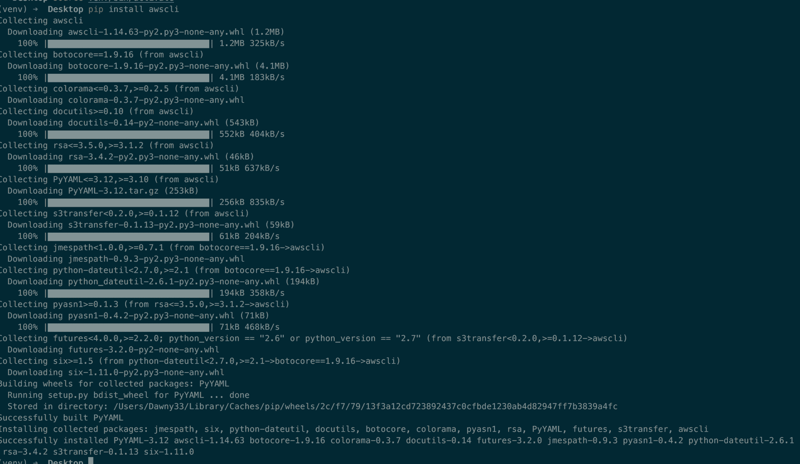
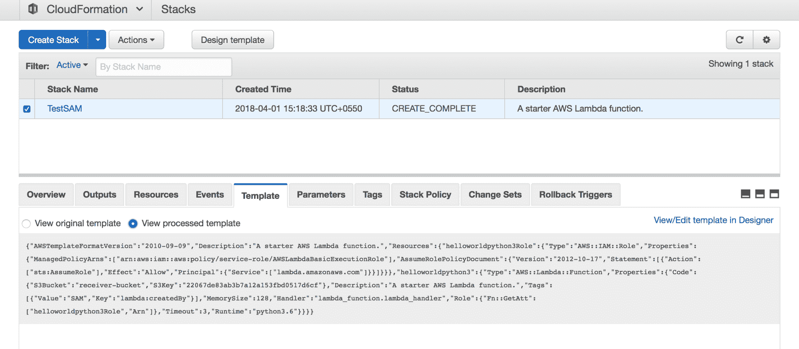
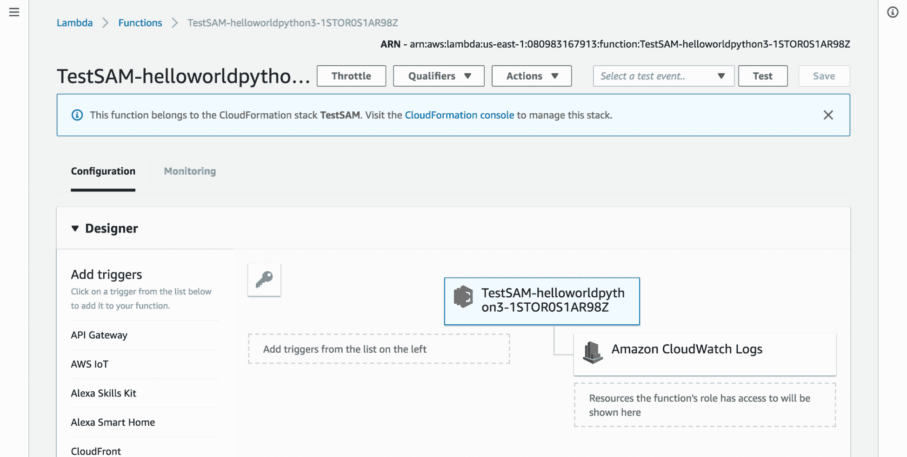
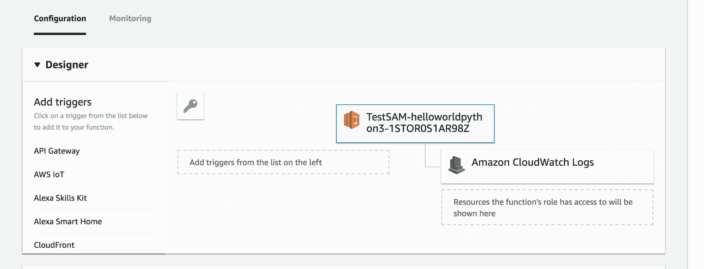
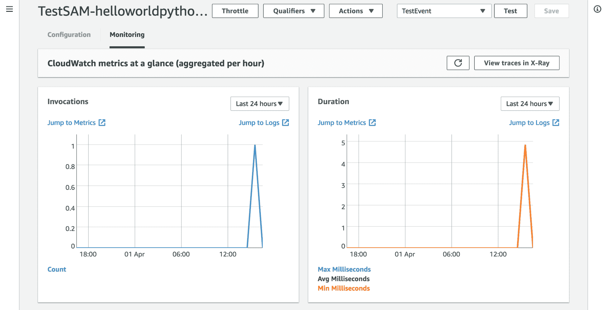
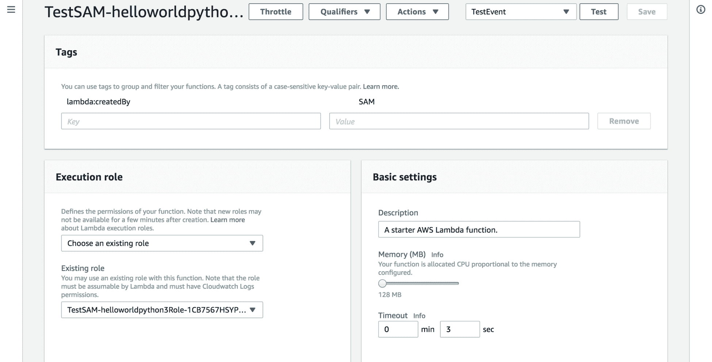
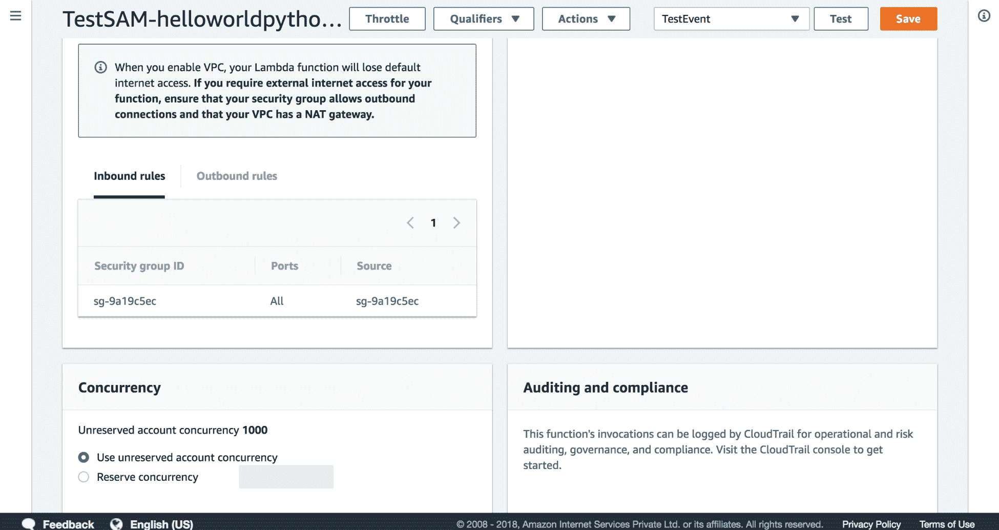

# 使用 SAM 部署 Lambda 函数

到目前为止，我们已经了解了 Lambda 函数以及如何构建它们。我们已经了解到，Lambda 函数有一组确定的触发器，这些触发器将触发函数执行特定任务。任务是作为 Python 模块编写的，脚本就是我们所说的函数。我们还了解了 Lambda 函数的不同设置，包括其核心设置以及其他设置，如安全和网络设置。

创建和部署 Lambda 函数还有另一种选择，即**AWS 无服务器应用模型**（**AWS SAM**。此格式基于代码为的**基础设施概念。这个概念的灵感来自**AWS CloudFormation**，它是一种作为代码的基础设施形式。**

我们将学习 AWS 云信息，并利用这些知识理解和构建 AWS SAM 模型，以创建 Lambda 函数。本章将介绍以下概念：

*   部署 Lambda 函数
*   为无服务器服务使用 CloudFormation
*   与 SAM 一起部署
*   理解 SAM 中的安全性

# 山姆简介

在本节中，我们将了解 SAM，它将帮助我们构建和部署无服务器功能：

1.  如前所述，SAM 将基础设施作为代码编写。这就是 Lambda 函数在 SAM 中的描述：

```py
AWSTemplateFormatVersion: '2010-09-09'
Transform: AWS::Serverless-2016-10-31
Resources:
    < Name of function >:
        Type: AWS::Serverless::Function
        Properties:
            Handler: < index.handler >
            Runtime: < runtime >
            CodeUri: < URI of the bucket >
```

2.  在这段代码中，我们输入详细信息—函数的名称，以及代码包所在的 S3 bucket 的 URI。正如我们在 Lambda 设置中命名索引和处理程序一样，我们也需要在此处输入这些详细信息。`index.handler`是我们的功能代码所在的文件。`Handler`是写入 Lambda 逻辑的函数名。此外，`Runtime`是用户定义的。您可以从 AWS Lambda 支持的所有可用语言中进行选择。本书的范围仅限于 Python 语言，因此我们将使用以下任一可用的 Python 版本：


3.  我们还可以在 Lambda 函数中添加环境变量，如图所示。正如我们添加、更新和/或删除代码一样，这些代码可以非常容易地编辑和配置，这是基础设施作为构建基础设施的代码样式的一个额外优势：

```py
AWSTemplateFormatVersion: '2010-09-09'
Transform: AWS::Serverless-2016-10-31
Resources:
    PutFunction:
        Type: AWS::Serverless::Function
        Properties:
            Handler: index.handler
            Runtime: < runtime >
            Policies: < AWSLambdaDynamoDBExecutionRole >
            CodeUri: < URI of the zipped function package >
            Environment:
                Variables:
                     TABLE_NAME: !Ref Table
DeleteFunction:
    Type: AWS::Serverless::Function
     Properties:
         Handler: index.handler
         Runtime: nodejs6.10
         Policies: AWSLambdaDynamoDBExecutionRole
          CodeUri: s3://bucketName/codepackage.zip
          Environment:
              Variables:
                  TABLE_NAME: !Ref Table
          Events:
              Stream:
                  Type: DynamoDB
                  Properties:
                      Stream: !GetAtt DynamoDBTable.StreamArn
                      BatchSize: 100
                      StartingPosition: TRIM_HORIZON
DynamoDBTable:
    Type: AWS::DynamoDB::Table
    Properties:
        AttributeDefinitions:
            - AttributeName: id
                AttributeType: S
        KeySchema:
             - AttributeName: id
                 KeyType: HASH
        ProvisionedThroughput:
              ReadCapacityUnits: 5
              WriteCapacityUnits: 5
        StreamSpecification:
              StreamViewType: streamview type
```

4.  前面的 SAM 代码调用指向 AWS`DynamoDB`表的两个 Lambda 函数。整个 SAM 代码是一个由两个 Lambda 函数组成的应用程序。您需要输入执行此操作所需的详细信息。`Runtime`需要使用任一可用的 Python 运行时进行更新。处理`DynamoDB`表的相应策略需要在`Policies`部分更新。`CodeUri`部分需要使用代码包的 S3URI 进行更新
5.  需要注意的是，所有 SAM 都应该包含元信息，包括`AWSTemplateFormatVersion`和`Transform`。这将告诉`CloudFormation`您编写的代码是 AWS SAM 代码和无服务器应用程序。这两条线如下：

```py
AWSTemplateFormatVersion: '2010-09-09'
Transform: AWS::Serverless-2016-10-31 
```

6.  如果您的无服务器函数需要访问一个`DynamoDB`表，您可以通过 SAM 函数本身使用`SimpleTable`属性创建一个`DynamoDB`表。这可以通过以下方式完成：

```py
AWSTemplateFormatVersion: '2010-09-09'
Transform: AWS::Serverless-2016-10-31
Resources:
    < TableName >:
        Type: AWS::Serverless::SimpleTable
         Properties:
             PrimaryKey:
                 Name: id
                 Type: String
             ProvisionedThroughput:
                 ReadCapacityUnits: 5
                  WriteCapacityUnits: 5
```

7.  现在，我们将学习如何使用触发器创建 Lambda 函数。由于我们已经在示例中使用了`DynamoDB`，因此在这一步中，我们将使用它作为触发器。这方面的 SAM 代码如下所示：

```py
AWSTemplateFormatVersion: '2010-09-09'
Transform: AWS::Serverless-2016-10-31
Resources:
    < Name of the function >:
        Type: AWS::Serverless::Function
        Properties:
            Handler: index.handler
            Runtime: < runtime >
            Events:
                Stream:
                    Type: DynamoDB
                    Properties:
                        Stream: !GetAtt DynamoDBTable.StreamArn
                        BatchSize: 100
                        StartingPosition: TRIM_HORIZON
< Name of the table >:
    Type: AWS::DynamoDB::Table
    Properties:
         AttributeDefinitions:
            - AttributeName: id
                AttributeType: S
        KeySchema:
            - AttributeName: id
                KeyType: HASH
        ProvisionedThroughput:
             ReadCapacityUnits: 5
             WriteCapacityUnits: 5
```

# 用于无服务器服务的 CloudFormation

在本节中，我们将学习如何使用 CloudFormation 构建和部署 Lambda 函数。我们将做以下工作：

1.  我们将为 Lambda 函数编写一个 CloudFormation 模板，该函数定期 ping 一个网站，如果过程中出现任何故障，就会给出一个错误。这方面的 CloudFormation 模板如下所示：

```py
AWSTemplateFormatVersion: '2010-09-09'
Transform: 'AWS::Serverless-2016-10-31'
Description: 'Performs a periodic check of the given site, erroring out on test failure.'
Resources:
lambdacanary:
    Type: 'AWS::Serverless::Function'
    Properties:
        Handler: lambda_function.lambda_handler
        Runtime: python2.7
        CodeUri: .
        Description: >-
            Performs a periodic check of the given site, 
erroring out on test failure.
    MemorySize: 128
    Timeout: 10
    Events:
        Schedule1:
        Type: Schedule
        Properties:
            Schedule: rate(1 minute)
    Environment:
        Variables:
            site: 'https://www.google.com/'
            expected: Search site.
```

2.  在这个 CloudFormation 片段中有很多语法。我们现在将尝试更详细地理解它：
    1.  在包含 Lambda 函数元细节的前三行中，我们有下面一行- `Transform: 'AWS::Serverless-2016-10-31'` 。此行用于定义用户将通过 CloudFormation 模板使用/访问的资源。由于我们使用的是 Lambda 函数，因此我们将其指定为`Serverless`。
    2.  我们还定义了函数将使用的内存大小。这与我们学习如何在 Lambda 的控制台中查看和更改内存设置类似。
    3.  `Timeout`是 Lambda 函数在将尝试视为失败之前可以继续重试的时间量。

您还可以看到，我们向 Lambda 函数添加了环境变量，这些变量将存储在 Lambda 容器中，并在系统需要时使用

# 与 SAM 一起部署

在本节中，我们将学习如何部署 SAM 应用程序。我们已经了解了 SAM 应用程序和代码的外观，因此我们将学习如何通过 AWS CloudFormation 部署它们：

1.  首先，让我们为部署目的设置本地环境，然后从`pip`开始安装`awscli`：



2.  接下来，您需要使用凭据配置 AWS 环境：


3.  您需要输入以下详细信息以确保成功配置 AWS 环境：
    *   您的 AWS 访问密钥
    *   你的 AWS 密钥
    *   要在其中操作的默认区域
    *   您希望数据采用的默认输出格式

4.  现在，让我们尝试通过 SAM 部署一个简单的`Hello World`Lambda 应用程序。我们将有两个代码文件。一个是 Python 文件，另一个是模板`yaml`文件。

5.  我们将使用 Python 的默认`Hello World`示例，因为我们试图理解 SAM 部署是如何工作的，而不是现在对代码强调太多。Python 脚本如下所示：

```py
import json
print('Loading function')
def lambda_handler(event, context):
    #print("Received event: " + json.dumps(event, indent=2))
    print("value1 = " + event['key1'])
    print("value2 = " + event['key2'])
    print("value3 = " + event['key3'])
    return event['key1'] # Echo back the first key value
    #raise Exception('Something went wrong')
```

6.  我们也将为 SAM 函数使用一个基本模板`yaml`文件，它唯一的任务是定义其元信息并运行前面提到的 Python 脚本。模板`yaml`文件如下所示：

```py
AWSTemplateFormatVersion: '2010-09-09'
Transform: 'AWS::Serverless-2016-10-31'
Description: A starter AWS Lambda function.
Resources:
    helloworldpython3:
        Type: 'AWS::Serverless::Function'
        Properties:
            Handler: lambda_function.lambda_handler
            Runtime: python3.6
            CodeUri: .
            Description: A starter AWS Lambda function.
            MemorySize: 128
            Timeout: 3
```

7.  现在，我们将使用命令行打包刚刚创建的 SAM 模板。包装代码的说明如下所示：

```py
aws cloudformation package --template-file template.yaml --output-template-file output.yaml --s3-bucket receiver-bucket
```

您将获得以下输出：


8.  这将创建一个需要部署的输出`yaml`文件，如前面的跟踪中所述。`output.yaml`文件如下所示：

```py
AWSTemplateFormatVersion: '2010-09-09'
Description: A starter AWS Lambda function.
Resources:
    helloworldpython3:
        Properties:
            CodeUri: s3://receiver-bucket/22067de83ab3b7a12a153fbd0517d6cf
            Description: A starter AWS Lambda function.
            Handler: lambda_function.lambda_handler
            MemorySize: 128
            Runtime: python3.6
            Timeout: 3
        Type: AWS::Serverless::Function
Transform: AWS::Serverless-2016-10-31
```

9.  现在，由于我们已经打包了 SAM 模板，我们现在将部署它。我们将在为部署过程打包时使用跟踪中显示的说明。部署说明如下：

```py
aws cloudformation deploy --template-file /Users/<path>/SAM/output.yaml --stack-name 'TestSAM' --capabilities CAPABILITY_IAM 
```

这将为您提供以下输出：


10.  我们可以转到 CloudFormation 控制台查看刚刚部署的模板。部署的模板将如下所示：


11.  在此处显示的模板选项卡中，我们可以看到原始模板和已处理的模板。通过选择第一个单选按钮可以查看原始模板：


12.  通过选择底部模板选项卡下的第二个单选按钮，可以查看已处理的模板：



13.  如果我们转到 Lambda 控制台，我们将通过 SAM 看到新创建的 Lambda 函数，并给出相应的名称：


14.  单击这些函数将为我们提供有关它的更多信息。它还提到 SAM 模板和创建 SAM 的 CloudFormation 模板：



15.  让我们为 Lambda 函数创建基本测试。单击测试按钮可打开测试创建控制台：


16.  现在，一旦创建了测试，您可以再次单击 Test 按钮。这将使用更新的测试用例运行测试。成功运行的日志如下所示：


17.  现在，让我们仔细检查 Lambda 函数的每个组件。配置显示了 Lambda 函数的触发器和日志记录设置。我们正在登录 AWS 的 CloudWatch 服务：



18.  我们还可以在 Lambda 控制台的监控选项中看到调用度量。我们可以看到一个 Lambda 调用：



19.  您可以在功能代码部分看到代码文件。您可以在交互代码编辑器的左角看到包含`template.yaml`文件和功能代码的文件夹结构：


20.  在下面，您可以看到名为`lambda:createdBy`的预先存在的环境变量，以及我们在模板中提到的超时设置。

# 理解 SAM 中的安全性

到目前为止，我们已经学习了如何使用 SAM 编写、构建、打包和部署 Lambda 函数。现在我们将了解它们内部的安全性工作原理：

1.  您可以滚动到 Lambda 控制台的底部，查看网络和安全设置，其中提到了 VPC 和子网详细信息：



2.  现在，我们将添加网络设置，其中包括安全组和子网 ID：

```py
AWSTemplateFormatVersion: '2010-09-09'
Transform: 'AWS::Serverless-2016-10-31'
Description: A starter AWS Lambda function.
Resources:
    helloworldpython3:
        Type: 'AWS::Serverless::Function'
        Properties:
            Handler: lambda_function.lambda_handler
            Runtime: python3.6
            CodeUri: .
            Description: A starter AWS Lambda function.
            MemorySize: 128
            Timeout: 3
            VpcConfig:
                SecurityGroupIds:
                    - sg-9a19c5ec
                SubnetIds:
                    - subnet-949564de
```

3.  现在，像上一节一样打包和部署新更新的 SAM 模板：


4.  在相应的编辑之后，打包并部署 CloudFormation 模板后，现在您将看到相应的网络和安全设置。网络部分如下所示：


5.  您还可以在网络设置中查看与 VPC 链接的相应安全组的入站规则：



6.  您还可以在控制台中看到已完成的 CloudFormation 模板以及更新的网络和安全设置，这意味着部署已成功：


7.  您还可以在控制台下角的 Templates 选项下看到原始模板：


8.  通过选择控制台底部原始模板选项旁边的查看已处理模板选项，可以找到已处理模板：


# 总结

在本章中，我们学习了如何通过 SAM 将 Lambda 函数作为代码部署为基础架构，这是编写和部署 Lambda 函数的一种新方法。这使得它更容易与其他 IaaS 服务（如 CloudFormation）集成。我们还了解了 AWS CloudFormation 服务，该服务允许并促进基础设施代码化。我们还了解了 SAM 代码中的安全性工作原理，以及如何配置 VPC 和子网设置。

在下一章中，将向您介绍 Microsoft Azure 功能，以及配置和理解该工具的组件。