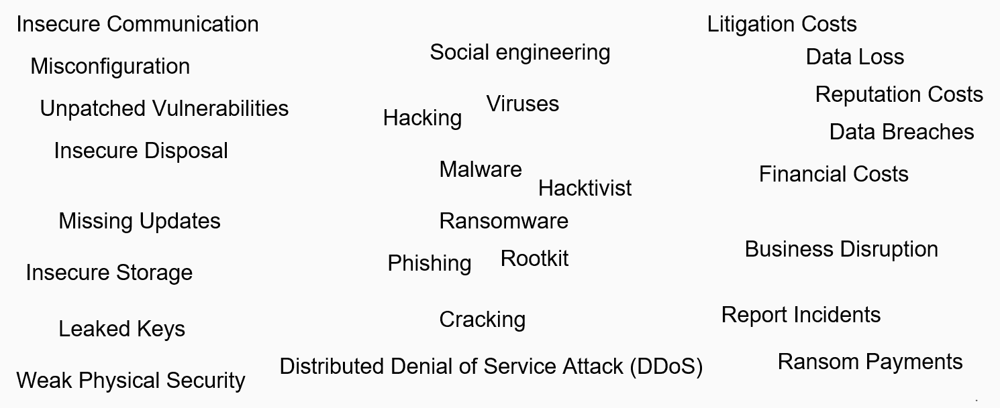
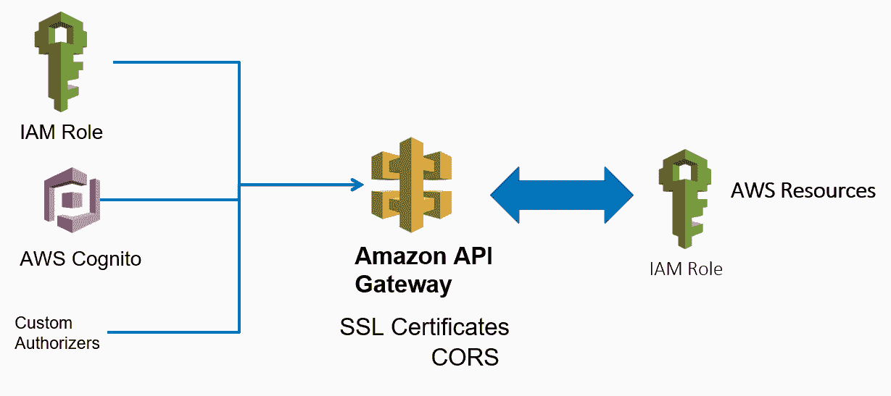
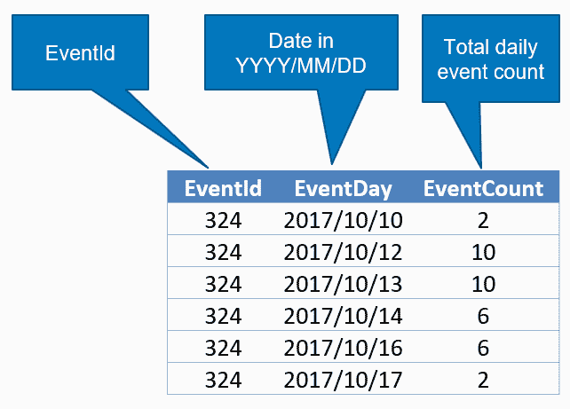
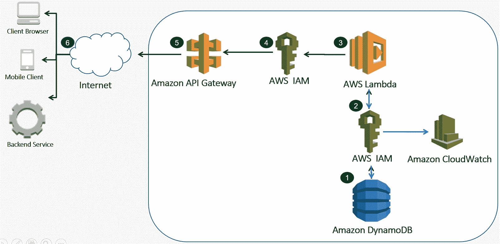
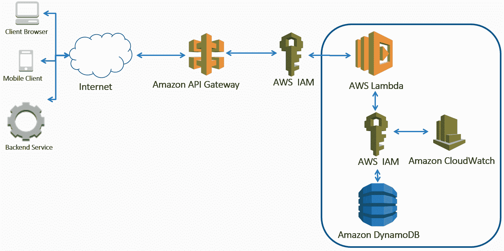
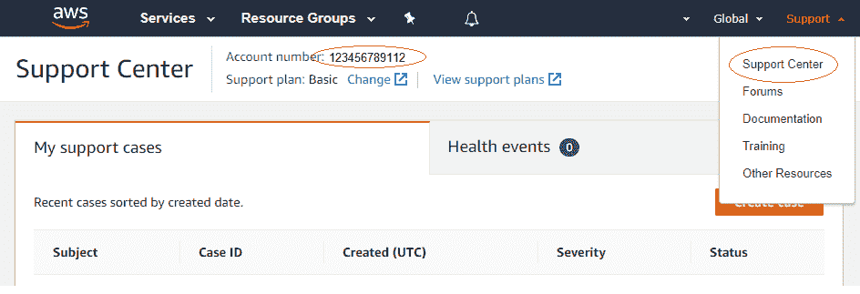
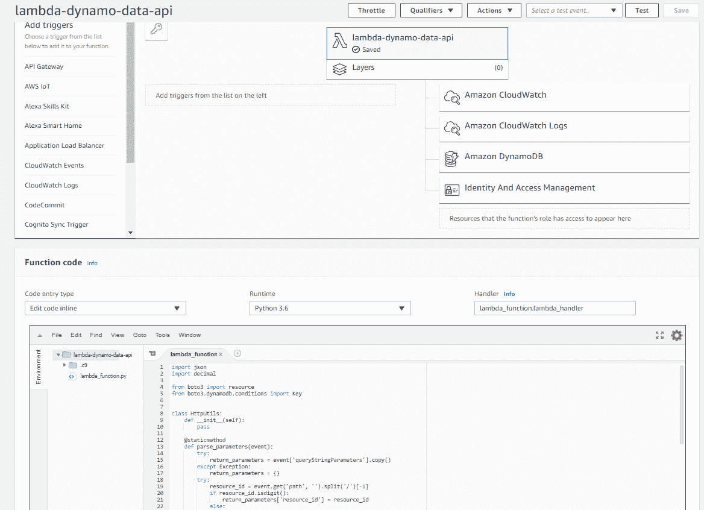
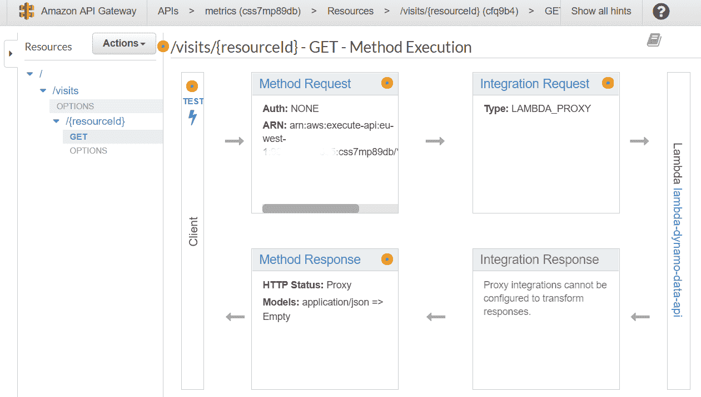

# 创建第一个无服务器数据 API

在本章中，我们将构建一个完整的无服务器微服务，可通过 RESTAPI 访问，并能够查询 NoSQL 数据库。我们将首先讨论并创建**亚马逊网络服务**（**AWS**）安全基础设施，以确保对 AWS 资源的访问受到限制。然后，我们将首先使用管理控制台，然后使用 Python 创建 NoSQL 数据库，并将记录添加到该数据库中，并对其进行查询。然后，我们将介绍 Python 和 API 网关集成中 Lambda 函数中使用的代码。最后，我们将部署它并测试 API 是否正常工作。

本章将介绍以下主题：

*   AWS 中的安全概述
*   保护您的无服务器微服务
*   构建无服务器微服务数据 API
*   在 AWS 管理控制台中设置 Lambda 安全性
*   使用 AWS 创建并写入名为 DynamoDB 的 NoSQL 数据库
*   使用 Python 创建并写入名为 DynamoDB 的 NoSQL 数据库
*   创建 Lambda 查询 DynamoDB
*   设置 API 网关并将其与 Lambda 代理集成
*   连接 API 网关、Lambda 和 DynamoDB
*   清理

# AWS 中的安全概述

我们将首先讨论安全性以及如何在 AWS 中正确设置它。

# 为什么安全很重要？

您最近可能听说过勒索软件、网络攻击或安全漏洞，您不希望您的组织受到这些影响。其中一些情况如下所示：



系统配置不正确、缺少更新或使用不安全的通信都可能导致系统遭到黑客攻击或勒索软件需求。这可能会导致诉讼成本、数据丢失或泄漏，以及组织的财务成本。

确保系统安全的原因有很多，包括：

*   **合规性**：遵守法律、法规和标准，例如，欧盟**通用数据保护条例**（**GDPR**）、**健康信息可移植性和责任法案**（**HIPAA**）和联邦贸易委员会法案。
*   **数据完整性**：如果系统不安全，数据可能被剥离或篡改，这意味着您无法再信任客户数据或财务报告。

*   **个人识别信息（PII）**：消费者和客户都知道您的隐私政策。数据应得到安全保护、匿名化，并在不再需要时删除。

*   **数据可用性**：数据可供授权用户使用，但如果（例如）您的数据中心发生自然灾害，在访问数据方面会发生什么情况？

AWS 中的许多安全性源于配置和正确的体系结构，因此了解以下重要安全相关术语的子集非常重要：

*   **传输中的安全性：**例如，HTTPS SSL 将其视为浏览器上的挂锁
*   **静态安全性：**例如，数据加密，只有拥有密钥的用户才能读取数据存储中的数据
*   **认证**：例如，确认用户或系统是他们想要成为的人的过程
*   **授权：**例如，访问特定资源的权限和控制机制

# 设计原则的安全性

有许多安全标准、原则、认证和指南，可能足以填满几本书。下面是一个我发现很实用的例子，来自[的**开放式 Web 应用程序安全项目**（**OWASP**）https://www.owasp.org](https://www.owasp.org) 。OWASP 安全性的设计原则（[https://www.owasp.org/index.php/Security_by_Design_Principles](https://www.owasp.org/index.php/Security_by_Design_Principles) 适用于任何系统、应用程序或服务，通过设计使其更安全，包括无服务器计算。即使没有需要使用无服务器管理的服务器，您仍然需要确保您的体系结构、集成、配置和代码遵守以下原则：

*   **最小化攻击表面积**：每增加一项功能都是一种风险，请确保其安全，例如，删除任何不再使用的 lambda。
*   **建立安全默认值**：这些默认值针对每个用户、身份和访问管理策略以及无服务器堆栈组件。
*   **最小权限原则**：账户或服务拥有执行其业务流程所需的最小权限，例如，如果一个 Lambda 只需要对一个表进行读取访问，那么它应该没有更多的访问权限。
*   **纵深防御原则**：具有不同的验证层和集中的审核控制。
*   **安全失败**：这确保了如果请求或转换失败，它仍然是安全的。
*   **不要信任服务**：尤其是第三方、外部服务或库，例如感染恶意软件的 JavaScipt 和 Node.js 库。
*   **职责分离**：针对不同的任务使用不同的角色，例如，管理员不应该是用户或系统用户。

*   **通过模糊来避免安全**：这通常是一个坏主意，也是一个薄弱的安全控制。与其依赖于保密的体系结构或源代码，不如依赖于其他因素，如良好的体系结构、限制请求和审计控制。
*   **保持安全简单**：不要过度设计；使用简单的架构和设计模式。
*   **正确修复安全问题**：及时修复问题并添加新测试。

在构建任何无服务器微服务时，请牢记这些原则。

# AWS 身份和访问管理

**身份和访问管理**（**IAM**）是一个中心位置，您可以在其中管理用户的安全凭据，如密码、访问密钥和权限策略，这些凭据控制对 AWS 服务和资源的访问。我们将讨论最相关的 IAM 资源策略、用户、组和角色，但首先，我们将讨论 JSON（[https://www.json.org/](https://www.json.org/) IAM 政策中使用的格式。

# JavaScript 对象表示法

JSON 或 JavaScript 对象表示法是 RESTAPI 和微服务中使用的标准数据格式。它可以被人类阅读，也可以被机器阅读。因此，人类实际上可以理解这些值，机器也可以自动解析数据。数据对象由属性值对和数组数据类型组成。支持的数据类型值包括 number、string、Boolean、array、object 和 null，如下代码所示：

```py
{
  "firstName": "John",
  "lastName": "Smith",
  "age": 27,
  "address": {
    "city": "New York",
    "postalCode": "10021"
  },
  "phoneNumbers": [
    {
      "type": "home",
      "number": "212 555-1234"
    },
    {
      "type": "mobile",
      "number": "123 456-7890"
    }
  ]
}
```

前面的代码是与 John Smith 相关的详细信息示例。您可以看到名字是键，字符串值是 John。这样，就有了两个由冒号分隔的字符串。你可以看到约翰·史密斯 27 岁，他居住的城市是纽约，邮政编码 10021，你可以看到他有两个电话号码。一个是他家的电话号码，另一个是手机号码。JSON 非常具有描述性，可以通过编程轻松解析。

你可以看到它也不一定是平的。它也可以是分层的，并且具有内置于数据中的键。您还可以非常轻松地将新电话号码添加到 JSON 数据并扩展模式，而不会破坏模型，这与其他格式不同，例如**逗号分隔变量**（**CSV**文件）。标准 Python JSON 库本机支持 JSON，但您也可以使用其他库。我喜欢它的地方在于它有到 Python 数据类型的本机映射。

# IAM 政策

**IAM 策略**是定义效果、动作、资源和条件的 JSON 文档，如下代码所示：

```py
{
    "Version": "2012-10-17",
    "Statement": {
        "Effect": "Allow",
        "Action": [  
                "dynamodb:GetItem",
                "dynamodb:Scan",
                "dynamodb:Query"],
        "Resource": "arn:aws:dynamodb:eu-west-
                     1:123456789012:table/Books",
        "Condition": {
            "IpAddress": {
                "aws: SourceIp": "10.70.112.23/16"
            }
        }
    }
}
```

这是一个 JSON 文档的示例，仅当请求来自特定的**无类域间路由**（**CIDR**）、`10.70.112.23/16`（即在**互联网协议地址**（**IP 地址**中）时，才会授予对名为`Books`的 DynamoDB 表的读取权限版本 4 的范围从`10.70.0.0`到`10.70.255.255`。

还有一个可视化编辑器，允许您创建这些文档，也可以通过编辑实际的 JSON 文档本身手动创建。例如，我们在本书前面创建了一个新用户，并使用 AWS 托管策略授予他们管理员权限，但您可以创建自己的用户，如图所示。我的建议是尽可能使用 AWS 管理的策略，除非它是一种访问可以或应该受到更多限制的资源，例如 DynamoDB 表或 S3 bucket。

# IAM 用户

IAM 用户是与 AWS 交互的人员或服务。我们实际上在[第 1 章](1.html)*无服务器微服务架构和模式*中设置了一个新用户。他们可以通过具有多因素身份验证的密码访问 AWS 管理控制台，和/或他们可能拥有使用命令行界面或 AWS**软件开发工具包**（**SDK**进行编程访问的访问密钥。您可以将一个或多个 IAM 策略直接附加到用户，以授予他们对资源或服务的访问权。策略可能与我们刚才向您展示的类似，用于从特定的原始 IP 范围授予对名为`Books`的 DynamoDB 表的读取访问权。

# IAM 组

IAM 组用于在组织组中模拟此安全功能。您可以将其视为 active directory 组。例如，在您的组织中，您将有管理员、开发人员和测试人员。要创建组，可以使用 AWS 管理控制台、SDK 或 CLI。创建组后，可以将其附加到用户，也可以在创建新用户时创建一个组。我倾向于将 IAM 策略附加到组，然后将组分配给用户，因为这样更易于管理和标准化访问。例如，我可以将数据科学组分配给团队的新成员，因为他们知道该组与其他用户相同。同样，如果有人离开，他们的魔法政策也不会被删除！

# IAM 角色

IAM 角色与 IAM 用户类似，因为它们可以附加策略，但任何需要访问所谓受信任实体的人都可以使用它们。通过这种方式，您可以将访问权委托给用户、应用程序或服务，而不必给他们一个新的 AWS 密钥，因为他们通过这个受信任的实体使用临时安全令牌。例如，无需实际共享任何密钥，并且仅使用角色，您可以在 AWS 环境中仅授予第三方对 S3 存储桶的读取权限，而不授予其他任何权限。

# 保护您的无服务器微服务

在本节中，我们将详细讨论安全性。

# Lambda 安全

如前所述，AWS Lambda 是无服务器堆栈中的核心组件，或者是由 AWS 托管服务之间的事件触发的带有自定义代码的集成连接器。Lambda 函数始终具有与之关联的执行 IAM 角色，使用附加到该角色的策略是拒绝或授予其对其他 AWS 资源的访问权的最佳且最安全的方法之一。其美妙之处在于，对于许多 AWS 托管服务（如 S3、DynamoDB 和 Kinesis 流），不需要管理或交换任何密钥或密码。也有一些例外，比如 Amazon**关系数据库服务**（**RDS**），比如 SQL Server，但是 MySQL 或者 PostgreSQL 确实支持 IAM 数据库认证。下图显示了 Lambda 函数的工作原理：


如上图所示，Lambda 函数通常涉及两个 IAM 角色：

*   例如，从 API 网关或 AWS 步骤函数调用 Lambda
*   授予对 AWS 资源的读写访问权，例如，授予对 DynamoDB 表的 Lambda 读访问权

此外，请注意以下事项：

*   **密钥管理服务**（**KMS**）可用于对 DynamoDB 或 RDS 中的静态数据进行加密/解密，也可用于加密密码或密钥，例如，如果您需要它们与第三方 API 或数据库集成。
*   Lambda 默认在安全的**虚拟私有云**（**VPC**中启动。但是，如果有需要访问的资源，例如 ElastiCache 群集或 RDS，您也可以在自己的专用 VPC 中运行它。您也可以这样做来添加另一层安全性。

# API 网关安全

让我们看一下下图：



API 网关可用于创建面向公众的 API，无需身份验证，但有时需要限制访问。以下是控制谁可以调用请求授权 API 的三种不同方法：

*   IAM 角色和策略可用于授予对 API 的访问权限，其中 API 网关透明地验证调用方在请求上的签名。

*   AmazonCognito 用户池控制谁可以访问 API。用户或服务必须首先登录才能访问 API。
*   API 网关自定义授权程序请求（例如）承载令牌，并使用 Lambda 函数检查客户端是否有权调用 API。

在 API 网关中，请注意以下事项：

*   如果您收到来自 API 自身域以外的域的请求，则必须启用**跨源资源共享**（**CORS**）。
*   例如，还支持客户端 SSL 证书，以允许后端系统验证 HTTP 请求是否来自 API 网关而不是其他系统。
*   API 网关可能还需要通过 IAM 角色授予访问权限，例如，如果它需要将记录写入 Kinesis 流或调用 Lambda 函数。
*   使用计划允许您为客户创建 API 密钥，允许您限制和监视使用。例如，这可以允许您为客户创建按使用量付费的 API。

# DynamoDB 安全

现在让我们看下图：


DynamoDB 是 AWS 管理的服务，授权通过 IAM 权限策略进行管理。IAM 策略授予或拒绝对 DynamoDB 的访问权，该策略附加到特定 IAM 用户或角色，然后该用户或角色可以访问它。如果您想在一个 AWS 帐户中担任该角色，我们还可以选择为相同的帐户授予权限，以便他们可以访问不同 AWS 帐户中的 DynamoDB 表。这种情况的好处是不交换密钥。

我建议您在为 DynamoDB 创建这些策略时应用**最小特权原则**，尽可能地将它们锁定，这意味着避免表访问使用通配符，例如使用`"Resource": "*"`。例如，在策略文档中，除非绝对必要，否则应避免授予所有表的读写权限。如果可能，最好明确列出特定的操作、表名和约束。

# 监测和警报

现在考虑下面的图表：


一般来说，监视系统中的任何可疑活动，甚至发现系统中的任何性能问题都很重要。API 网关、DynamoDB 和 Lambda 函数都内置了对特定任务的 CloudWatch 和 X-Ray 的支持。CloudWatch 允许您跟踪度量和监视日志文件，设置特定警报，并自动对 AWS 资源中的更改作出反应。X-Ray 是一种跟踪请求的服务，还可以生成特定的服务映射。这些免费系统的组合使您能够很好地洞察无服务器系统的运行情况，并提供一个开箱即用的视图。CloudTrail 是另一种服务，它允许您监视所有 API 以及任何用户或系统对资源的访问。

# 了解更多

现在，您将对 AWS 中的安全性有更深入的了解，以及为什么它对您的组织很重要。

如果你想了解更多，这里有一些到白皮书和最佳实践指南的链接。我建议阅读以下白皮书：

*   [https://aws.amazon.com/whitepapers/aws-security-best-practices/](https://aws.amazon.com/whitepapers/aws-security-best-practices/)
*   [https://aws.amazon.com/products/security/](https://aws.amazon.com/products/security/)
*   [https://aws.amazon.com/whitepapers/#security](https://aws.amazon.com/whitepapers/#security)
*   [http://docs.aws.amazon.com/IAM/latest/UserGuide/best-practices.html](http://docs.aws.amazon.com/IAM/latest/UserGuide/best-practices.html)

# 构建无服务器微服务数据 API

在本节中，我们将介绍构建无服务器微服务的体系结构和需求。本章的其余部分在 AWS 管理控制台的配置方面都是大量的实践，但也包括 Python 代码。Python 代码遵循基本的设计模式并保持简单，因此您可以理解并轻松地根据自己的用例进行调整。

# 无服务器微服务数据 API 要求

我们希望创建一个微服务，能够为特定事件的总浏览用户数提供网络访问服务。

# 查询字符串

对于传入请求的特定`EventId`，我们希望检索每日 web 访问次数（已由另一个系统收集）作为响应。我们将通过`EventId`和`startDate`进行查询；我们希望检索`startDate`之后的所有 web 访问计数。URL 及其参数如下所示：


在这里，您可以看到我们有`EventId`作为资源`1234`，还有一个`startDate`参数被格式化为`YYYYMMDD`格式。在这种情况下，它是`20180102`。这就是要求。

我们可以在浏览器中输入此请求，也可以通过编程方式输入，我们希望得到的响应来自存储实时数据的 NoSQL 数据库。实际的响应格式将是 JSON 格式，通过 Lambda 函数从数据库返回，呈现给用户或以编程方式查询 API 的其他服务。我们还希望这个 API 能够非常容易地扩展，并且非常经济高效；也就是说，我们不想让一台机器一直运行，例如，因为这会花费金钱，需要维护。我们只想在提出实际要求时付款。

下面是下图：



这是我们感兴趣的时间序列数据的一个例子，其中我们有`EventId`表示事件`324`，我们有`EventDay`格式的日期，即 2017 年 10 月，我们在表的右侧列中有总共`EventCount`的 web 事件。您可以看到，在 2017 年 10 月 10 日，`EventId`和`324`的`EventCount`为`2`，这意味着该活动在该特定日期的总日访问量等于`2`。第二天是`0`，因为第 11<sup>次</sup>没有进入。然后在 12<sup>日</sup>上升到`10`，在 13<sup>日</sup>上升到`10`，然后下降到`6`、`0`、`6`、`2`。请注意，如果表中没有特定日期的数据，则为`0`。

这是我们希望 API 以 JSON 响应的形式提供的数据，因此另一个客户端应用程序可以绘制它，如下图所示：


例如，如果我们在 Excel 中绘制数据，您会看到这样的图表，`EventCount`从`2`开始，10 月 11 日有一个间隙，该特定用户没有访问，然后增加到`10`、`10`、`6`，10 月 15 日有一个间隙，10 月 16 日再次增加到`6`。

# 数据 API 体系结构

现在我们知道了我们想要返回的数据的需求和形状，我们将讨论总体架构。同样，整个堆栈将依赖 JSON 格式在所有服务之间进行数据交换。

下图显示了我们在请求中的内容：


请求流程如下所示：

1.  我们在互联网上有客户端浏览器、移动客户端或后端服务。
2.  这将查询我们的 API 网关，将带有`EventId`和`startDate`的请求作为可选 URL 参数传递。
3.  这将通过 AWS IAM 角色进行身份验证。
4.  然后将启动 Lambda 函数。
5.  Lambda 函数随后将使用角色访问 DynamoDB。
6.  Lambda 将查询 Dynamo 以搜索特定的`EventId`。或者，查询还将包括与`EventDay`相比较的特定`startDate`。如果`EventDay`大于`startDate`，则返回记录。

下图显示了我们在响应中的内容：



响应流程如下所示：

1.  数据将从 DynamoDB 返回，如上图右下角所示
2.  这将通过与 Lambda 功能关联的相同 IAM 角色实现
3.  来自 DynamoDB 的 JSON 记录返回到 Lambda 函数，该函数将其解析为 JSON 响应
4.  这将由 Lambda 函数通过 API 网关角色传递
5.  它被传递回 API 网关
6.  最终，它将返回到客户端浏览器移动客户端，或发出初始请求的后端服务，以便可以绘制图表

我们还配置了 Amazon CloudWatch，通过提供度量和日志的仪表板来监控请求。

# 在 AWS 管理控制台中设置 Lambda 安全性

我们将登录 AWS 管理控制台。我们首先使用管理控制台的原因是让您更好地了解 Lambda 函数如何工作，以及它们如何与其他 AWS 服务（如 API 网关和 DynamoDB）集成。在后面的章节中，我们将向您展示如何使用 AWS CLI 部署 Lambda 函数。如果您是 Lambda 的第一个新手，那么我总是发现，首先在管理控制台中手动创建一个完整的无服务器堆栈非常有用，这样可以更好、更深入地理解整个 AWS 基础设施，而不是使用 magic 命令启动整个 AWS 基础设施！

我们将首先使用 AWS 管理控制台创建 Lambda IAM 角色和策略，以便 Lambda 函数可以访问 DynamoDB，并将任何日志或任何状态写入 CloudWatch。我们之前在[第 1 章](1.html)*无服务器微服务架构和模式*中使用的管理控制台允许您集中控制所有 AWS 服务，创建角色，甚至创建 Lambda 功能。关于无服务器微服务的体系结构，我们首先从下图的右侧部分开始，然后逐步构建其余部分。

下图显示了数据 API Lambda IAM：



创建两个 IAM 策略，然后将它们附加到新的 Lambda IAM 角色。

# 创建 IAM 策略

我们将创建 Lambda 函数以及 IAM 角色和策略。您需要做的第一件事是登录到 AWS 管理控制台。在 IAM 中，我们希望创建实际的策略本身。您可以单击 createpolicies，我们将使用 JSON 编辑器。

# DynamoDB IAM 策略

首先，我们需要一个允许 Lambda 函数从 DynamoDB 读取记录的策略。我们可以通过以下方式实现这一目标：

1.  在[ht](https://console.aws.amazon.com/)[登录 AWS 管理控制台 tps://console.aws.amazon.com/](https://console.aws.amazon.com/) 。
2.  选择安全、身份和合规| IAM，或在“查找服务”下搜索 IAM。
3.  在 IAM 导航窗格中，选择策略。
4.  选择创建策略。
5.  选择 JSON 选项卡。

Rather than using the **JSON** view, you can also use, or switch to, the **Visual Editor** for creating a policy, but I prefer the JSON view, as the code can be source-controlled and deployed programmatically as we'll do later with the AWS CLI.

6.  键入或粘贴以下 JSON 策略文档：

```py
      {
          "Version": "2012-10-17",
          "Statement": [
              {
                 "Effect": "Allow",
                 "Action": [
                     "dynamodb:BatchGetItem",
                     "dynamodb:DescribeTable",
                     "dynamodb:GetItem",
                     "dynamodb:Query",
                     "dynamodb:Scan"
                 ],
                  "Resource": [
                     "arn:aws:dynamodb:<your-region>:<your-aws-
                      accountid>:table/user-visits"                 
                 ]
             }
         ]
     }
```

使用您的 AWS 区域更新`<your-region>`，例如`us-east-1`，并使用您的 AWS 帐户 ID 更新`<your-aws-accountid>`。

如果您不知道您的 AWS 账号，您可以在支持中心窗口中找到它，该窗口可从 AWS 管理控制台顶部的“支持|支持中心”菜单获得，如以下屏幕截图所示：



7.  选择“审阅策略”。
8.  在“审阅策略”页面上，键入`dynamo-readonly-user-visits`作为名称。
9.  选择创建策略。

此 IAM 策略称为 dynamo readonly user Visitions，现在将作为客户管理的筛选器策略提供。

我们谈到了安全性非常重要，确保安全性的一种方法是通过设计原则应用 OWASP 安全性，如前面提到的最小特权原则。在这里，我们通过使用策略锁定表访问来实现这一点。您会注意到，我将它限制为一个特定的名称，`dynamo`表。对于策略名称，它应该尽可能具有描述性和细粒度，以便于维护。在可能的情况下，我倾向于为每个 AWS 资源制定一个策略。我使用了前缀`dynamo-readonly`，因此很明显，您只能从一个名为`user-visits`的特定表中读取数据。

# Lambda IAM 策略

创建一个能够写入日志并将指标推送到 CloudWatch 的策略：

1.  登录 AWS 管理控制台并在[打开 IAM 控制台 https://console.aws.amazon.com/iam/](https://console.aws.amazon.com/iam/) ，如果您尚未登录。
2.  在 IAM 导航窗格中，选择策略。
3.  选择创建策略。
4.  选择 JSON 选项卡。
5.  键入或复制并粘贴以下 JSON 文档：

```py
     {
        "Version": "2012-10-17",
        "Statement": [
          {
            "Effect": "Allow",
            "Action": [
             "logs:CreateLogGroup",
             "logs:CreateLogStream",
             "logs:PutLogEvents",
             "logs:DescribeLogStreams"
          ],
            "Resource": [
              "arn:aws:logs:*:*:*"
         ]
        },
       {
           "Effect": "Allow",
           "Action": [
             "cloudwatch:PutMetricData"
           ],
           "Resource": "*"
         }
      ]
     }
```

此策略的主要思想是允许 Lambda 函数创建 CloudWatch 日志组和流，并将日志事件添加到这些流中，然后对其进行描述。我还添加了另一条语句，它允许您放置度量，如果您想要推送自定义监控器度量，这是必需的。

6.  选择“审阅策略”。
7.  在审阅策略上，键入`lambda-cloud-write`作为名称。
8.  选择创建策略。

# 创建 Lambda IAM 角色

现在我们有了两个 IAM 策略，我们将创建一个新的 Lambda IAM 角色，并将这两个策略附加到该角色：

1.  登录 AWS 管理控制台并在[打开 IAM 控制台 https://console.aws.amazon.com/iam/](https://console.aws.amazon.com/iam/)
2.  在导航窗格中，选择角色
3.  选择创建角色
4.  选择 AWS 服务，然后在该服务下选择 Lambda
5.  选择下一步：权限
6.  在附加权限策略|筛选策略下，键入`dynamo-readonly-user-visits-api`
7.  选中 dynamo 只读用户访问 api 的复选框
8.  在附加权限策略|筛选策略下，键入`lambda-cloud-write`
9.  选中 lambda cloud write 的复选框
10.  选择下一步：标记
11.  选择下一步：回顾
12.  在查看页面上，键入`lambda-dynamo-data-api`作为角色名称
13.  选择创建角色

您已经创建了两个 IAM 策略，并将它们附加到新的 Lambda 执行角色，稍后我们将与 Lambda 函数关联。

# 使用 AWS 创建并写入名为 DynamoDB 的 NoSQL 数据库

我们将研究如何创建 DynamoDB 表、从硬编码值向表中写入数据、从文件中写入数据记录，然后我们将展示查询表的两种不同方式：


# 在 AWS 中创建 DynamoDB

以下步骤显示如何创建 DynamoDB：

1.  您需要先登录 AWS 管理控制台，然后在[打开 AWS DynamoDB 控制台 https://console.aws.amazon.com/dynamodb/](https://console.aws.amazon.com/dynamodb/) 。
2.  选择创建表格，或者在 DynamoDB 导航窗格中，选择表格，然后选择创建表格。
3.  在“创建 DynamoDB 表”窗口中，执行以下步骤：
    1.  在表名下，键入`user-visits`
    2.  在分区键的主键中，键入`EventId`并选择字符串
    3.  选中添加排序键框
    4.  在排序键中，键入`EventDay`并选择数字

分区键和散列键可以互换使用，就像排序键和范围键一样。主键可以是单独的分区键，也可以是同时具有分区键和排序键的复合键。

# 使用 AWS 将数据写入 DynamoDB

执行以下步骤：

1.  登录 AWS 管理控制台，在[打开 DynamoDB 控制台 https://console.aws.amazon.com/dynamodb/](https://console.aws.amazon.com/dynamodb/) 。
2.  在 DynamoDB 导航窗格中，选择表并选择用户访问。
3.  在用户访问窗格中，选择项目*选项卡。
4.  选择创建项目。
5.  在“创建项目”弹出窗口中：
    1.  在 EventId 字符串下，键入`324`
    2.  在 EventDay 编号下，键入`20171001`
    3.  选择+>追加>编号，对于字段，键入`EventCount`，对于编号，键入`3`
    4.  选择“保存”

现在，您将看到在右下窗格的“项目”选项卡中添加了一条新记录，因为扫描也已自动完成。

DynamoDB 是一个托管的 NoSQL 数据库，这意味着每行可以有不同的列，列的名称（称为属性）区分大小写。

# 使用 AWS 查询 DynamoDB

您可以在 DynamoDB 上执行两种类型的搜索；`Scan`和`Query`。`Scan`从表中检索所有记录。`Query`利用主键高效地检索一组记录。两者都允许您选择一致性、分页、筛选器、条件，并选择要返回的属性。一般来说，`Scan`在您想要检索所有数据或跨多个不同主键的数据时非常有用，而`Query`在您拥有主键并想要检索所有或过滤版本的相关记录时应该使用。

# AWS 管理控制台中的 DynamoDB 扫描

执行以下步骤：

1.  登录 AWS 管理控制台，在[打开 DynamoDB 控制台 https://console.aws.amazon.com/dynamodb/](https://console.aws.amazon.com/dynamodb/)

2.  在 DynamoDB 导航窗格中，选择表并选择用户访问
3.  在“用户访问”窗格中，选择“项目*选项卡”
4.  从下拉列表中选择扫描
5.  （可选）选择+添加筛选器以筛选查询结果
6.  选择开始搜索

现在，您应该可以在右下窗格中的一个表中看到结果，其中包含列 EventId、EventDay 和 EventCount。

# AWS 管理控制台中的 DynamoDB 查询

执行以下步骤：

1.  登录 AWS 管理控制台，在[打开 DynamoDB 控制台 https://console.aws.amazon.com/dynamodb/](https://console.aws.amazon.com/dynamodb/)
2.  在 DynamoDB 导航窗格中，选择表并选择用户访问
3.  在用户访问窗格中，选择项目*选项卡
4.  从下拉列表中选择查询
5.  在分区键下，键入`324`
6.  在排序键下，选择`>`并键入`20171001`
7.  选择开始搜索

您将看到没有返回任何结果，因为我们正在查找 EventDay 大于`20171001`的记录，而当前表中没有任何记录。

修改以下内容以查找记录：

1.  在排序键下，选择`>=`并键入`20171001`
2.  选择开始搜索

现在您将看到我们添加的记录是可见的，因为它符合查询搜索条件。

修改以下内容以查找记录：

1.  在排序键下，选择和类型`20170930`和`20171002`
2.  选择开始搜索

这里，我们也使用 between 条件来检索记录。

这种查询灵活性使您能够以极低的延迟检索数据。但是，您会注意到，条件表达式的分区键始终固定为`=`，并且必须提供给所有`Query`操作—这在许多 NoSQL 数据库中很常见。如果您没有或不知道主键，则需要使用`Scan`。

# 使用 AWS 删除 DynamoDB

让我们删除这个表，因为我们将使用 Python 重新创建它。执行以下步骤：

1.  在[登录控制台 https://console.aws.amazon.com/dynamodb/](https://console.aws.amazon.com/dynamodb/)
2.  从左侧 DynamoDB 菜单中选择表格
3.  选择用户访问
4.  选择删除表
5.  选择删除

# 使用 Python 创建并写入名为 DynamoDB 的 NoSQL 数据库

现在我们了解了如何使用 AWS 控制台创建表、添加数据和查询 DynamoDB，接下来我们将了解如何仅使用 Python 代码来实现这一点。

我们建议您使用 Python**集成开发环境**（**IDE**），例如 Eclipse PyDev（[）http://www.pydev.org/download.html](http://www.pydev.org/download.html) 或 PyCharm（[https://www.jetbrains.com/pycharm/](https://www.jetbrains.com/pycharm/) 。您不需要使用 IDE，但我建议您这样做。如果您真的想，您可以使用 VI，例如，在 Linux 上实际编辑您的代码。但是，使用 IDE 可以让您在本地运行调试或设置单元测试并逐步完成，这使得开发更容易、更高效。

首先使用[Boto3 创建表 https://boto3.readthedocs.io/](https://boto3.readthedocs.io/) 在 Python 中。在 PyCharm 或您喜爱的文本编辑器中运行以下部分中的代码。

# 使用 Python 创建 DynamoDB 表

下面是创建表的通用 Python 代码。使用以下代码创建名为`dynamo_table_creation.py`的 Python 脚本：

```py
import boto3

def create_dynamo_table(table_name_value, enable_streams=False,
                        read_capacity=1,
                        write_capacity=1,
                        region='eu-west-1'):
    table_name = table_name_value
    print('creating table: ' + table_name)
    try:
        client = boto3.client(service_name='dynamodb', 
                              region_name=region)
        print(client.create_table(TableName=table_name,
                                  AttributeDefinitions=[{'AttributeName': 'EventId',
                                                         'AttributeType': 'S'},
                                                        {'AttributeName': 'EventDay',
                                                         'AttributeType': 'N'}],
                                  KeySchema=[{'AttributeName': 'EventId',
                                              'KeyType': 'HASH'},
                                             {'AttributeName': 'EventDay',
                                              'KeyType': 'RANGE'},
                                             ],
                                  ProvisionedThroughput={'ReadCapacityUnits': read_capacity,
                                                         'WriteCapacityUnits': write_capacity}))
    except Exception as e:
        print(str(type(e)))
        print(e.__doc__)

def main():
    table_name = 'user-visits'
    create_dynamo_table(table_name, False, 1, 1)

if __name__ == '__main__':
    main()
```

这里，我们不是在 AWS 控制台中创建 DynamoDB 表，而是使用 Python SDK Boto3 创建它。`main()`调用名为`create_dynamo_table()`的方法，该方法获取与我们要创建的表相关联的各种参数，`table_name`是第一个参数。忽略`enable_streams`参数，稍后我们将使用它。另外两个连接到初始读写容量。这些将直接影响成本，以及表大小和检索的数据。这就是为什么我将它们默认设置为`1`。区域参数应该是您的 AWS 区域。

然后我们创建一个`boto3.client()`，它是代表 DynamoDB 的低级客户机。然后，我们使用它来创建一个表，使用`client.create_table()`，传入传入我们`create_dynamo_table()`的参数，以及分区键名`EventId`，其数据类型为`String`，由`S`表示，排序键名为`EventDay`，其数据类型号为`N`。所有其他属性都是可选的和任意的。

You will notice a change in key terminology in DynamoDB between the Management Console and Boto3 descriptions, but they are synonyms: `Partition key (AWS Console) = Hash key (Boto3)` and `Sort key (AWS Console) = Range key (Boto3)`.

两者一起作为复合键称为主键。

# 使用 Python 编写 DynamoDB

下面的代码将三条记录写入 DynamoDB。使用以下 Python 代码创建另一个名为`dynamo_modify_items.py`的文件：

```py
from boto3 import resource

class DynamoRepository:
    def __init__(self, target_dynamo_table, region='eu-west-1'):
        self.dynamodb = resource(service_name='dynamodb', 
                        region_name=region)
        self.target_dynamo_table = target_dynamo_table
        self.table = self.dynamodb.Table(self.target_dynamo_table)

    def update_dynamo_event_counter(self, event_name, 
                event_datetime, event_count=1):
        return self.table.update_item(
            Key={
                'EventId': event_name,
                'EventDay': event_datetime
            },
            ExpressionAttributeValues={":eventCount": event_count},
            UpdateExpression="ADD EventCount :eventCount")

def main():
    table_name = 'user-visits'
    dynamo_repo = DynamoRepository(table_name)
    print(dynamo_repo.update_dynamo_event_counter('324', 20171001))
    print(dynamo_repo.update_dynamo_event_counter('324', 20171001, 2))
    print(dynamo_repo.update_dynamo_event_counter('324', 20171002, 5))

if __name__ == '__main__':
    main()
```

在这里，我们使用 Boto3 的`resource()`，这是一个具有存储库模式的更高级别的服务资源。我们抽象了`DynamoRepository()`类中所有与 DynamoDB 相关的代码，该类用`table_name`实例化为`dynamo_repo`。`self.dynamodb.Table()`基于`table_name`创建表资源。这将在稍后调用`update_dynamo_event_counter()`更新 DynamoDB 记录时使用。

在`self.table.update_item()`中，我首先使用`ExpressionAttributeValues`声明一个名为`eventCount`的变量。我在 DynamoDB 高级*更新表达式*（[中使用了这个 https://docs.aws.amazon.com/amazondynamodb/latest/developerguide/Expressions.UpdateExpressions.html](https://docs.aws.amazon.com/amazondynamodb/latest/developerguide/Expressions.UpdateExpressions.html) ），这是我在 DynamoDB 中最喜欢的功能之一。为什么？因为并非所有 NoSQL 数据库都可以在没有信号量锁和客户端重试的情况下执行类似的操作。它在一个原子语句中执行以下三个操作，同时以最终一致性为代价规避可能的并发冲突：

1.  读取与给定的`EventId=event_name`和`EventDay=event_datetime`匹配的记录
2.  如果不存在，则创建新项目，设置`EventCount=1`
3.  如果它已经存在，则它将`EventCount`增加`event_count`

第一个函数调用`dynamo_repo.update_dynamo_event_counter('324', 20171001)`，将`EventCount`设置为`1`；第二个函数调用`dynamo_repo.update_dynamo_event_counter('324', 20171001, 2)`将`EventCount`增加`2`，因此现在是`3`。第三个函数调用添加一个新记录，因为`EventCount`或主键不同。

# 使用 Python 查询 DynamoDB

现在我们已经创建了一个表并添加了数据，我们只需要编写一些代码来查询它。这将构成稍后在 Lambda 函数中使用的代码的一部分。

使用以下代码创建名为`dynamo_query_table.py`的 Python 脚本：

```py
import decimal
import json

from boto3 import resource
from boto3.dynamodb.conditions import Key

class DecimalEncoder(json.JSONEncoder):
    """Helper class to convert a DynamoDB item to JSON
    """
    def default(self, o):
        if isinstance(o, decimal.Decimal):
            if o % 1 > 0:
                return float(o)
            else:
                return int(o)
        return super(DecimalEncoder, self).default(o)

class DynamoRepository:
    def __init__(self, target_dynamo_table, region='eu-west-1'):
        self.dynamodb = resource(service_name='dynamodb', region_name=region)
        self.dynamo_table = target_dynamo_table
        self.table = self.dynamodb.Table(self.dynamo_table)

    def query_dynamo_record_by_parition(self, parition_key, 
        parition_value):
        try:
            response = self.table.query(
                KeyConditionExpression=
                Key(parition_key).eq(parition_value))
            for record in response.get('Items'):
                print(json.dumps(record, cls=DecimalEncoder))
            return

        except Exception as e:
            print('Exception %s type' % str(type(e)))
            print('Exception message: %s ' % str(e))

    def query_dynamo_record_by_parition_sort_key(self, 
          partition_key, partition_value, sort_key, sort_value):
        try:
            response = self.table.query(
                KeyConditionExpression=Key(partition_key)
                .eq(partition_value)
                & Key(sort_key).gte(sort_value))
            for record in response.get('Items'):
                print(json.dumps(record, cls=DecimalEncoder))
            return

        except Exception as e:
            print('Exception %s type' % str(type(e)))
            print('Exception message: %s ' % str(e))
def main():
    table_name = 'user-visits'
    partition_key = 'EventId'
    partition_value = '324'
    sort_key = 'EventDay'
    sort_value = 20171001

    dynamo_repo = DynamoRepository(table_name)
    print('Reading all data for partition_key:%s' % partition_value)
    dynamo_repo.query_dynamo_record_by_parition(partition_key, 
        partition_value)

    print('Reading all data for partition_key:%s with date > %d' 
           % (partition_value, sort_value))
    dynamo_repo.query_dynamo_record_by_parition_sort_key(partition_key,                                                         
          partition_value, sort_key, sort_value)
if __name__ == '__main__':
    main()
```

正如前面所做的，我创建了`DynamoRepository`类，它抽象了与 DynamoDB 的所有交互，包括表的连接和查询。下面是使用 DynamoDB 的`self.table.query()`查询表的两种方法：

*   `query_dynamo_record_by_parition()`方法，通过`partition_key`查询记录，也称为散列键，在本例中为`EventId`。这里，我们只使用了`query()`中的相等条件，如`KeyConditionExpression=Key(partition_key).eq(parition_value))`所示。

*   `query_dynamo_record_by_parition_sort_key()`方法，通过`partition_key`和`sort_key`查询记录，也称为**范围键**，本例中为`EventDate`。在这里，我们只使用相等条件和大于等于条件作为`query()`中的`KeyConditionExpression=Key(partition_key).eq(partition_value) & Key(sort_key).gte(sort_value))`。这为您提供了按特定日期范围快速筛选的额外灵活性，例如，检索要在仪表板中显示的最近 10 天的事件数据。

然后，我们解析查询返回的记录，并将它们打印到控制台。这个 JSON 将是 Lambda 在下一节中作为响应返回给 API 网关的内容。

# 创建 Lambda 查询 DynamoDB

现在我们已经用一些数据设置了`security`和`user-visits`表，并且知道如何编写代码来查询 DynamoDB 表，我们将编写 Lambda Python 代码。

# 创建 Lambda 函数

现在我们有了附加了两个 IAM 策略的 IAM 角色，创建 Lambda 函数本身。在这里，我们从头开始创建一个函数，因为我们希望浏览完整的细节，以加深您对创建无服务器堆栈所涉及的内容的理解。下图显示了涉及 CloudWatch、DynamoDB、IAM 和 Lambda 的数据 API 体系结构：


执行以下步骤：

1.  登录 AWS 管理控制台，打开 AWS Lambda 控制台[https://console.aws.amazon.com/lambda/](https://console.aws.amazon.com/lambda/) 。
2.  选择创建函数，或者在 AWS Lambda 导航窗格中，选择函数，然后选择创建函数。

3.  在“创建函数”页面上，选择“从头开始编写”，执行以下步骤：
    1.  对于名称，键入`lambda-dynamo-data-api`
    2.  在运行时，选择 Python3.7
    3.  在角色中，选择一个现有角色
    4.  在现有角色中，选择 lambda dynamo 数据 api

4.  在功能代码下，创建了一个名为`lambda_function.py`的新文件。在 lambda_ 函数选项卡下复制并粘贴以下代码，覆盖现有代码：

```py
      import json
      import decimal

      from boto3 import resource
      from boto3.dynamodb.conditions import Key

      class HttpUtils: 
        def init(self):
         pass

      @staticmethod
      def parse_parameters(event):
          try:
              return_parameters = 
              event['queryStringParameters'].copy()
          except Exception:
              return_parameters = {}
          try:
              resource_id = event.get('path', '').split('/')[-1]
              if resource_id.isdigit():
                  return_parameters['resource_id'] = resource_id
              else:
                  return {"parsedParams": None, "err":
                      Exception("resource_id not a number")}
          except Exception as e:
              return {"parsedParams": None, "err": e}  
              # Generally bad idea to expose exceptions
          return {"parsedParams": return_parameters, "err": None}

      @staticmethod
      def respond(err=None, err_code=400, res=None):
          return {
              'statusCode': str(err_code) if err else '200',
              'body': '{"message":%s}' % json.dumps(str(err)) 
                  if err else
              json.dumps(res, cls=DecimalEncoder),
              'headers': {
                  'Content-Type': 'application/json',
                  'Access-Control-Allow-Origin': '*'
              },
          }

      @staticmethod
      def parse_body(event):
          try:
              return {"body": json.loads(event['body']), 
                      "err": None}
          except Exception as e:
              return {"body": None, "err": e}

      class DecimalEncoder(json.JSONEncoder): def default(self, o): 
      if isinstance(o, decimal.Decimal): if o % 1 > 0: 
          return float(o) 
      else: return int(o) return super(DecimalEncoder, 
          self).default(o)

      class DynamoRepository: def init(self, table_name): 
      self.dynamo_client = resource(service_name='dynamodb',
      region_name='eu-west-1') self.table_name = 
          table_name self.db_table =        
      self.dynamo_client.Table(table_name)

      def query_by_partition_and_sort_key(self, 
          partition_key, partition_value,
          sort_key, sort_value):
          response = self.db_table.query(KeyConditionExpression=                                      
                     Key(partition_key).eq(partition_value)
                     & Key(sort_key).gte(sort_value))

          return response.get('Items')

      def query_by_partition_key(self, partition_key, 
          partition_value):
          response = self.db_table.query(KeyConditionExpression=                                   
              Key(partition_key).eq(partition_value))
          return response.get('Items')

      def print_exception(e): try: print('Exception %s type' % 
      str(type(e))) print('Exception message: %s ' 
                          % str(e)) except Exception: pass

      class Controller(): def init(self): pass

      @staticmethod
      def get_dynamodb_records(event):
          try:
              validation_result = HttpUtils.parse_parameters(event)
              if validation_result.get(
              'parsedParams', None) is None:
                  return HttpUtils.respond(
                      err=validation_result['err'], err_code=404)
              resource_id = str(validation_result['parsedParams']
                            ["resource_id"])
              if validation_result['parsedParams']
                  .get("startDate") is None:
                  result = repo.query_by_partition_key(
                           partition_key="EventId", 
                           partition_value=resource_id)
              else:
                  start_date = int(validation_result['parsedParams']
                               ["startDate"])
                  result = repo.query_by_partition_and_sort_key(
                            partition_key="EventId", 
                            partition_value=resource_id,
                            sort_key="EventDay", 
                            sort_value=start_date)
                            return HttpUtils.respond(res=result)

                  except Exception as e:
                  print_exception(e)
              return HttpUtils.respond(err=Exception('Not found'), 
                  err_code=404)

      table_name = 'user-visits' repo = 
                    DynamoRepository(table_name=table_name)

      def lambda_handler(event, context): response = 
      Controller.get_dynamodb_records(event) return response
```

5.  选择保存。

Lambda 函数总是有一个`handler`（[https://docs.aws.amazon.com/lambda/latest/dg/python-programming-model-handler-types.html](https://docs.aws.amazon.com/lambda/latest/dg/python-programming-model-handler-types.html) ，传入主要思想`event`，包含事件源数据。这里，这将是一个 API 网关 GET 请求。另一个参数是`context`（[https://docs.aws.amazon.com/lambda/latest/dg/python-context-object.html](https://docs.aws.amazon.com/lambda/latest/dg/python-context-object.html) ），为您提供诸如记忆或 Lambda 的生存时间等详细信息。

您将从前面的示例中识别出`class DynamoRepository()`，该示例处理连接和查询。新的`HttpUtils`类是一组实用方法，用于解析查询字符串和主体，并返回响应。另一个新的`Controller()`类控制主流。这里，它假设 API 网关请求是一个`GET`方法，因此它调用函数解析请求，查询 DynamoDB，并将响应返回给 API 网关。

异常流是防御性构建的，因此捕获所有异常（通常，最佳实践是只捕获特定的命名异常并引发其余异常），而不是引发异常。这是因为我们希望 API 在出现异常时能够返回 4XX 或 5XX。出于调试目的，我们也将返回异常。在生产环境中，您不会返回异常，只会记录它，因为它可能会暴露代码中的漏洞。作为类比，您可能还记得在浏览器中的安全性较差的 web 应用程序中看到这些 SQL Server 错误，源错误和完整堆栈跟踪以黄色显示在白色背景上。

我建议您在本地开发 Lambda 代码，但 AWS 最近获得了一个名为 Cloud9 的在线 IDE 编辑器，您在该编辑器中粘贴了 Python 代码，如以下屏幕截图所示：



# Lambda 函数的测试

现在我们已经部署了 Lambda 代码，我们可以在 AWS 管理控制台中测试它是否正常工作。执行以下步骤：

1.  登录 AWS 管理控制台，打开 AWS Lambda 控制台[https://console.aws.amazon.com/lambda/](https://console.aws.amazon.com/lambda/) 。
2.  在 AWS Lambda 导航窗格中，选择函数。
3.  选择 lambda dynamo 数据 api。
4.  选择测试。
5.  在配置测试事件中，在事件名称下，键入`requestApiGatewayGetValid`并在 JSON 文档中键入或复制粘贴以下代码，覆盖旧代码：

```py
      {
       "body": "{"test":"body"}",
       "resource": "/{proxy+}",
       "requestContext": {
         "resourceId": "123456",
         "apiId": "1234567890",
         "resourcePath": "/{proxy+}",
         "httpMethod": "GET",
         "requestId": "c6af9ac6-7b61-11e6-9a41-93e8deadbeef",
         "accountId": "123456789012",
         "identity": {
           "apiKey": null,
           "userArn": null,
           "cognitoAuthenticationType": null,
           "caller": null,
           "userAgent": "Custom User Agent String",
           "user": null, "cognitoIdentityPoolId": null,
           "cognitoIdentityId": null,
           "cognitoAuthenticationProvider": null,
           "sourceIp": "127.0.0.1",
           "accountId": null
         },
         "stage": "prod"
       },
       "queryStringParameters": {
         "StartDate": "20171009"
       },
       "headers": {
         "Via": "1.1 08f323deadbeefa7af34e5feb414ce27
                 .cloudfront.net (CloudFront)",
         "Accept-Language": "en-US,en;q=0.8",
         "CloudFront-Is-Desktop-Viewer": "true",
         "CloudFront-Is-SmartTV-Viewer": "false", 
         "CloudFront-Is-Mobile-Viewer": "false",
         "X-Forwarded-For": "127.0.0.1, 127.0.0.2",
         "CloudFront-Viewer-Country": "US", "Accept":        
         "text/html,application/xhtml+xml,application/xml;q=0.9,
              image/webp,*/*;q=0.8",
         "Upgrade-Insecure-Requests": "1",
         "X-Forwarded-Port": "443", "Host": "1234567890
              .execute-api.us-east-1.amazonaws.com",
         "X-Forwarded-Proto": "https",
         "X-Amz-Cf-Id": "cDehVQoZnx43VYQb9j2-nvCh-
              9z396Uhbp027Y2JvkCPNLmGJHqlaA==",
         "CloudFront-Is-Tablet-Viewer": "false",
         "Cache-Control": "max-age=0",
         "User-Agent": "Custom User Agent String",
         "CloudFront-Forwarded-Proto": "https", "Accept-Encoding": 
              "gzip, deflate, sdch"
       },
       "pathParameters": {
         "proxy": "path/to/resource"
       },
       "httpMethod": "GET",
       "stageVariables": {
         "baz": "qux"
       },
       "path": "/path/to/resource/324"
      }
```

6.  以下是 API 网关`GET`请求 JSON 的一些重要部分：
    *   请求使用来自`"httpMethod": "GET"`的`GET`方法
    *   资源或`EventID`为`324`且来自`"path": "/path/to/resource/324"`
    *   查询参数来自`"queryStringParameters": { "StartDate": "20171009"}`
7.  选择创建。
8.  选择“测试”以运行测试。

您应该从执行结果中看到，通过示例 API 网关`GET`请求，测试成功。这包括持续时间、使用的内存和日志输出。展开详细信息以查看将发送到 DynamoDB 的响应。它应该类似于以下代码：

```py
{
  "statusCode": "200",
  "body": "[{"EventCount": 3, "EventDay": 20171001, "EventId": 
          "324"}]",
  "headers": { "Content-Type": "application/json", "Access-Control-
              Allow-Origin": "*"
 }
}
```

如果出现错误，请检查日志输出以了解详细信息，这可能与 IAM 角色/策略、DynamoDB 名称或 Lambda 代码有关。

# 设置 API 网关并将其与 Lambda 代理集成

现在我们知道 Lambda 函数与一些 API 网关测试数据一起工作，并返回一个带有`statusCode`为`200`的头和体，我们只需要添加将调用 Lambda 函数的 API 网关，如下图所示：


执行以下步骤：

1.  登录 AWS 管理控制台，打开 API 网关控制台[https://console.aws.amazon.com/apigateway/](https://console.aws.amazon.com/apigateway/) 。
2.  选择入门，或者在 AmazonAPI 网关导航窗格中，选择 API 并选择 CreateAPI。
3.  在“创建”页面上，执行以下步骤：
    1.  在选择协议中，选择 REST
    2.  在“创建新 API”中，选择“新建 API”
    3.  在“设置”下，键入`metrics`作为 API 名称
    4.  选择`Regional`作为端点类型
    5.  选择创建 API
4.  从操作下拉菜单中选择创建资源。
5.  在“新建子资源”窗口中，执行以下步骤：
    1.  在资源名称中，键入`visits`
    2.  在资源路径中，键入`visits`
    3.  选择启用 API 网关 CORS
    4.  选择创建资源。
6.  选择`/visits`资源，并从操作下拉菜单中选择创建资源。
7.  在新建子资源窗口中，执行以下步骤：

    1.  在资源名称中，键入`{resourceId}`
    2.  在资源路径中，键入`{resourceId}`，替换默认的`-resourceId-`值
    3.  选中启用 API 网关 CORS
    4.  选择创建资源
8.  选择`/Vists/{resourceId}`资源并从操作下拉菜单中选择创建方法。
9.  在下拉列表中选择“获取”，然后选中其右侧的复选标记。
10.  在/vists/{resourceId}-GET-Setup 窗口中选择获取资源方法：
    1.  在集成类型中，选择 Lambda 函数
    2.  选中使用 Lambda 代理集成
    3.  在 Lambda 区域中，从下拉列表中选择您的区域

11.  在“向 Lambda 添加权限”功能中选择“确定”。这将允许 API 网关调用 Lambda 函数。

您现在应该有一个 API 网关 GET-Method 执行，它看起来像下面的屏幕截图：



最后，通过执行以下步骤，在部署之前进行快速测试以确保其正常工作：

1.  在左侧的资源菜单中选择`/visits/{resourceId} - GET`
2.  选择测试
3.  在路径{resourceId}下键入`324`
4.  选择测试

您应该看到状态 200、延迟、日志和 JSON 响应正文，如以下代码所示：

```py
[ 
   {
     "EventCount": 3,
     "EventDay": 20171001,
     "EventId": "324"
   },
   {
     "EventCount": 5,
     "EventDay": 20171002,
     "EventId": "324"
   }
]
```

如果您没有获得`2XX`状态代码，请查看日志，这将帮助您诊断问题。它可能会链接到安全 IAM 角色。

# 连接 API 网关、Lambda 和 DynamoDB

现在我们知道了 API 网关与 Lambda 函数的集成是有效的，我们将部署它并获取 URL。架构如下图所示：


该体系结构的工作原理如下：

1.  登录 AWS 管理控制台，打开 API 网关控制台[https://console.aws.amazon.com/apigateway/](https://console.aws.amazon.com/apigateway/) 。
2.  在 AmazonAPI 网关导航窗格中，选择 API 和度量。
3.  在 metrics 和`/Vists/{resourceId}`下选择 Resources，并从 Actions 下拉菜单中选择 Deploy API。
4.  在部署 API 弹出窗口中，执行以下步骤：

    1.  在部署阶段，选择[新阶段]
    2.  在舞台名称中，键入`prod`
    3.  在阶段说明中，输入`prod`
    4.  选择`Deploy`
5.  应在左侧菜单上自动选择“度量”下的阶段。
6.  在`prod/visits/{resourceId}/GET`下选择 GET 以获取调用 URL。调用 URL 应该如下所示：`https://{restapi_id}.execute-api.{region}.amazonaws.com/prod/visits/{resourceId}`。
7.  打开新的浏览器选项卡并粘贴到调用 URL:`https://{restapi_id}.execute-api.{region}.amazonaws.com/Prod/visits/{resourceId}`：
    *   响应主体为`{"message": "Internal server error"}`
    *   这是因为在查询 DynamoDB 之前，我们在 URL`parse_parameters()`函数中验证了`resource_id`，以确保它是一个数字

8.  打开新的浏览器选项卡并粘贴到调用 URL:`https://{restapi_id}.execute-api.{region}.amazonaws.com/prod/visits/324`。由于我们在内部使用了正确的`resourceId`或`EventId`，您应该在浏览器选项卡中看到以下代码：

```py
      [{
           "EventCount": 3,
           "EventDay": 20171001,
           "EventId": "324"
      },
      {
           "EventCount": 5,
           "EventDay": 20171002,
           "EventId": "324"
      }]
```

9.  打开新的浏览器选项卡并粘贴到调用 URL:`https://{restapi_id}.execute-api.{region}.amazonaws.com/Prod/visits/324?startDate=20171002`。由于我们添加了`startDate=20171002`参数，您应该在浏览器选项卡中看到以下代码：

```py
      [{"EventCount": 5, "EventDay": 20171002, "EventId": "324"}]
```

即使用 Lambda 中的另一个`query_by_partition_and_sort_key()`方法和`startDate`。

我们现在有了一个完全工作的无服务器数据 API，能够在 DynamoDB 上运行不同类型的查询。

# 清理

您需要手动删除资源。我建议您使用 AWS 控制台来执行此操作。执行以下步骤：

1.  正在删除 API 网关：
    1.  在[登录控制台 https://console.aws.amazon.com/apigateway/](https://console.aws.amazon.com/apigateway/)
    2.  在左侧 API 菜单的 metrics 下选择 Resource
    3.  从操作下拉菜单中选择删除 API
    4.  在“确认此操作前输入 API 名称”文本框中键入度量
    5.  选择删除 API
2.  删除 DynamoDB 表：
    1.  在[登录控制台 https://console.aws.amazon.com/dynamodb/](https://console.aws.amazon.com/dynamodb/)
    2.  选择左侧 DynamoDB 菜单上的表格
    3.  选择用户访问
    4.  选择删除表
    5.  选择删除

3.  删除 Lambda 函数：
    1.  在[登录控制台 https://console.aws.amazon.com/lambda/](https://console.aws.amazon.com/lambda/)
    2.  选择左侧 AWS Lambda 菜单上的功能
    3.  选择 lambda dynamo 数据 api
    4.  选择操作菜单下的删除功能
    5.  选择删除
4.  删除 IAM 角色和策略：
    1.  在[登录控制台 https://console.aws.amazon.com/iam/](https://console.aws.amazon.com/iam/)
    2.  在 IAM 导航窗格中选择角色
    3.  选择 lambda dynamo 数据 api
    4.  选择右上角的删除角色
    5.  选择是
    6.  在 IAM 导航窗格中选择策略
    7.  选择在筛选策略下管理的客户
    8.  选择 dynamo readonly 用户访问旁边的单选按钮，然后选择策略操作菜单下的删除
    9.  在弹出窗口中选择删除
    10.  选择 lambda cloud write 旁边的单选按钮，然后选择策略操作菜单下的删除
    11.  在弹出窗口中选择删除

# 总结

在本章中，我们讨论了安全性及其重要性。通过设计原则应用 OWASP 安全性是确保无服务器堆栈安全的良好第一步。然后，我们讨论了 IAM 的角色，并概述了策略，解释了它们是如何确保对 AWS 资源的受限访问的关键文档。然后，我们概述了一些关于保护无服务器微服务的安全概念和原则，特别是关于 Lambda、API 网关和 DynamoDB。

然后，我们用 RESTful 数据 API 构建了一个可扩展的无服务器微服务。我们首先创建一个 DynamoDB 表，然后向其中添加数据，并查询它，首先手动使用 AWS 控制台，然后使用 Python Boto3 SDK。然后，我们构建了一个简单的 Lambda 来解析请求 URL 参数，查询 DynamoDB，并将记录作为响应体的一部分返回。然后，我们研究了如何设置 Lambda 和 API 网关之间的集成。然后，我们通过部署 API 将所有内容连接在一起。我们创建了一个完全工作的 API，它具有高度的可伸缩性，您可以根据自己的用例非常轻松地进行调整，而且非常经济高效。在不到 30 分钟的时间内，您就用 API 创建了一个高度可扩展的无服务器微服务。API 网关和 Lambda 成本是按使用量付费的。对于 DynamoDB，您实际上可以非常轻松地更改读写容量，将其设置为根据负载自动缩放读写容量，甚至通过按需容量模式根据实际使用情况付费，使其完全按照 API 使用情况和存储的数据付费，避免传统的容量规划或过度调配。

我们已经在 AWS 控制台中做了很多工作，但在后面的章节中，我们将使用 AWS CLI 或代码部署管道来完成大部分工作。然而，使用 AWS 控制台应该让您真正了解了在 AWS 中可以做什么，以及 Lambda 如何与 DynamoDB 和 API 网关集成。当我们使用配置、脚本和代码自动化大部分创建和提供时，这个坚实的基础非常有用。在接下来的章节中，我们将添加更多功能、自动化测试和部署管道，并实现微服务模式。

在您的组织中，您将开发大量的源代码，并且不希望像我们在本章中所做的那样手动部署它。您需要首先自动测试代码，以确保其按预期工作，然后以可重复的方式部署堆栈。这是生产中使用的连续集成或连续交付系统所必需的。

在下一章中，我们将讨论如何使用代码和配置部署无服务器微服务，以使流程更具可重复性和可伸缩性。