# 用于无服务器的 Amazon Web 服务

在本章中，我们将学习用于管理无服务器基础设施的 Amazon Web 服务。我们将探索 AWS 工作流以创建无服务器应用程序。我们将了解使用 AWS**CLI**（**命令行界面**创建基本无服务器应用程序的手动过程和自动过程。

本章将介绍的主题包括：

*   从传统服务器过渡到无服务器
*   AWS Lambda 入门
*   AWS Lambda 的工作原理
*   执行 Lambda 函数
*   创建 Lambda 触发器
*   创建无服务器 RESTful API
*   AWS CLI 与 AWS Lambda 的交互

# 技术要求

在继续前进之前，有一些技术先决条件。我们将通过 web 控制台和 AWS CLI 演示 AWS。应考虑以下先决条件：

*   所有的演示都在带有 Ubuntu 16.04 的 Linux 机器上进行了测试。我们共享了本书中使用的每个图书馆的链接。您可以通过特定平台获得有关安装和配置的详细信息。
*   我们正在使用开源库和软件。因此，对于每个库，我们将共享其官方文档链接。有关特定库的详细信息，请参考这些链接。

# 从传统服务器过渡到无服务器

网络托管从一开始就发生了巨大的变化。物理服务器机器在许多 web 应用程序之间共享，在扩展方面这是一个非常大的挑战。事实证明，对于任何个人或公司来说，提供一台完整的服务器来承载其 web 应用程序都是非常昂贵的。

但是，由于**虚拟化**，任何 web 应用程序都不需要物理服务器。虚拟化提供了创建多个虚拟服务器而不是单个物理服务器的能力。

现在，无服务器的新时代使开发人员的生活更加轻松，因为我们可以将我们的辛勤工作集中在开发上，而不是在部署上投入时间和金钱。

亚马逊推出**亚马逊弹性计算云**（**亚马逊 EC2**作为云计算解决方案。AmazonEC2 可以在 AmazonCloud 中创建一系列虚拟服务器或实例，而无需投资硬件。您可以根据您在网络、计算和存储方面的需求进行扩展。

无服务器方法只不过是消除设置托管环境的手动工作量的过程。云服务提供商提供无服务器服务，因此您实际上从未拥有任何服务器。相反，云服务提供商在高可用性基础设施中执行您的代码。

# AWS Lambda 入门

许多云服务提供商为无服务器基础设施引入了不同的服务。Amazon 将 AWS Lambda 作为一种计算服务引入，您只需提供代码，AWS Lambda 就可以在一个高度可扩展的基础设施中自行执行代码。您不必担心手动管理服务。您需要支付代码执行的计算时间，并且在代码未运行时不收取任何费用。

AWS Lambda 根据需要执行代码，以响应事件，例如 S3 存储桶上的数据存储事件、Amazon DynamoDB 事件以及通过 API 网关的 HTTP 请求事件。AWS Lambda 能够通过 AWS CloudWatch 事件基于计划时间事件执行代码。AWS Lambda 支持 Python、Node.js、C#和 Java。

Amazon **Simple Storage Service** (**S3**) is a storage service provided by Amazon. It has a simple web interface to store the data. Amazon S3 has associated services events that can be used by other services.

# AWS Lambda 的工作原理

您需要编写一个函数，由 AWS Lambda 代表您执行。

AWS Lambda 在基于容器的模型上实现，该模型支持运行时环境，并根据 Lambda 函数配置执行代码。调用 Lambda 函数时，它会根据 AWS Lambda 配置启动容器（执行环境），并启用执行代码所需的基本运行时环境。

让我们从一些实际工作开始：

1.  要创建 Lambda 函数，必须具有 AWS 帐户。如果您没有 AWS 帐户，则需要在 AWS 上注册（[https://aws.amazon.com/](https://aws.amazon.com/) ）提供一些基本的联系和支付信息，因为这是亚马逊需要的基本信息。
2.  进入 Lambda 主页（[https://console.aws.amazon.com/lambda/home](https://console.aws.amazon.com/lambda/home) ）。单击“创建函数”按钮。这会将您重定向到**创建功能**页面，这将在下一步中描述。请看以下屏幕截图：

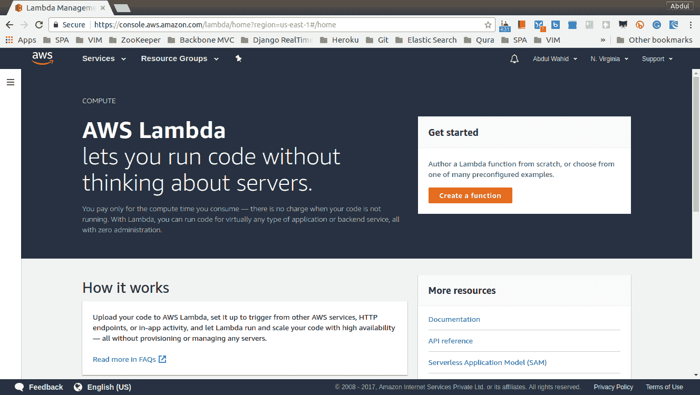

3.  AWS 提供了三种不同的选项来创建 Lambda 函数，例如从头开始编写、蓝图和无服务器应用程序存储库。我们将使用 Blueprint 选项，它有一些内置的 Lambda 函数。我们可以根据我们的要求从搜索栏中选择这些蓝图，您可以在搜索栏中按标签和属性进行筛选，或按关键字进行搜索：

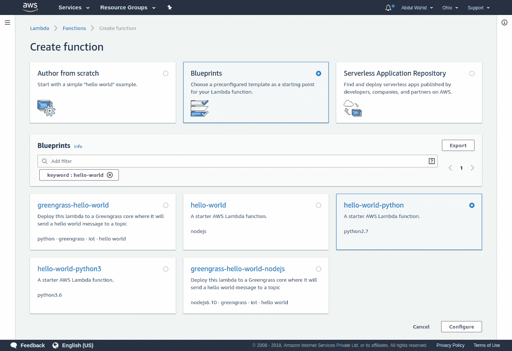

4.  让我们选择一个 hello world python 蓝图。一旦我们选择了蓝图，我们就需要设置关于 Lambda 函数的基本信息。此信息包括 Lambda 函数的名称**和**角色，如以下屏幕截图所示：


5.  在这里，名称将是 Lambda 函数的唯一标识，角色定义 Lambda 函数的权限。

有三个选项可用于创建角色：

*   选择现有角色
*   从模板创建新角色
*   创建自定义角色
    让我们更详细地了解一下：
    *   **选择现有角色**：可以选择之前创建的角色。
    *   **从模板**创建新角色：这里需要定义角色名称。AWS Lambda 提供具有预配置权限的现成内置角色策略模板。这些基于 AWS Lambda 功能所需的其他 AWS 服务相关权限。在任何角色选择中，Lambda 都会自动将日志记录权限添加到 CloudWatch（AWS 日志记录服务），因为这是 Lambda 所需的基本权限。
    *   **创建自定义角色**：AWS 提供额外权限创建自定义角色以访问 AWS Lambda。在这里，您可以根据需求定义角色。

6.  让我们用一些角色创建`HelloWorld`Lambda 函数。在这里，我选择了 S3 对象只读权限策略模板。

7.  下面的屏幕截图描述了新创建的`HelloWorld`Lambda 函数：


HelloWorld Lambda function

Lambda 函数包括三个部分：

*   配置
*   触发
*   监测

让我们看一下有关配置和监视的详细信息。我们将有一个单独的触发器部分

# 配置

Lambda 的执行取决于配置设置。配置 Lambda 功能需要以下详细信息：

*   功能代码
*   环境变量
*   标签
*   执行角色
*   基本设置
*   网络
*   调试和错误处理

# 功能代码

在这里，您需要编写代码。Lambda 函数具有用于编写代码的预定义模式。在编写代码时，您需要理解上下文。Lambda 提供了三种可行性，它们决定了代码的运行时执行：

*   **代码输入类型**：本节提供三个选项来决定代码的输入类型，如内联编辑代码、上传 ZIP 文件和从 Amazon S3 上传文件。
*   **运行时**：本节提供选项来决定代码的运行时编程语言上下文，如 Python、C#、NodeJS 和 Java。
*   **处理程序**：处理程序定义方法/函数的路径，如`<filename>.<method_name>`。例如，如果您想要执行一个名为`handler`的函数，该函数在`main.py`中定义，那么它将是`main.handler`。

让我们回到我们新创建的 hello world 函数`lambda_handler`。

这里，处理程序值定义为`lambda_function.lambda_handler`，其中`lambda_function.py`为文件名，`lambda_handler`为方法名：

```py
def lambda_handler(event, context): 
    print("value1 = " + event['key1']) 
    print("value2 = " + event['key2']) 
```

`Lambda_handler`接受两个位置参数`event`和`context`：

*   `event`：此参数包含事件相关信息。例如，如果我们使用 AmazonS3 bucket 事件配置 Lambda 函数，那么我们将在事件参数中获得 S3 bucket 信息，例如 bucket 名称、区域等。
*   `context`：此参数包含运行时执行代码可能需要的上下文相关信息。

# 环境变量

您可以在键值对中设置环境变量，这可以在代码中使用。

# 标签

可以使用标记对 Lambda 函数进行分组和筛选。您可能有多个具有不同区域的 Lambda 函数，因此标记有助于使 Lambda 函数更易于管理。

# 执行角色

正如我们之前在创建 Lambda 函数时讨论的角色和权限一样，Lambda 提供了编辑您在创建 Lambda 函数时选择的现有角色的功能。

# 基本设置

在基本设置下，您可以配置内存和执行超时。Lambda 支持从 128 MB 到 1536 MB 的内存。超时执行以秒为单位；Lambda 支持的默认超时执行时间为 300 秒。此设置有助于控制 Lambda 函数的代码执行性能和成本。

# 网络

在网络部分，您可以配置 Lambda 功能的网络访问。

AWS 提供**VPC**（**虚拟私有云**服务）创建虚拟网络，允许访问 AWS 服务。您还可以根据需要配置网络。

在接下来的章节中，我们将与 VPC 讨论 Lambda 函数。到目前为止，我们将在网络部分不选择 VPC。

# 调试和错误处理

AWS Lambda 自动重试失败的异步调用。但您也可以配置**DLQ**（**死信队列**），如 SQS 队列或 SNS 主题。要配置 DLQ，Lambda 函数必须具有访问 DLQ 资源的权限。

现在我们已经了解了配置，让我们继续执行 Lambda 函数。

让我们看一下*监控*部分，它描述了与 Lambda 函数相关的活动。它可以用来分析 Lambda 函数执行的性能。

# 监测

AWS CloudWatch 是 AWS 资源的监控服务，管理所有活动日志。它创建度量数据以生成统计数据。CloudWatch 支持对 AWS 资源的实时监控。它还监视与 AWS EC2 或 RDS 数据库实例和其他资源相关的硬件信息。

Lambda 监控部分显示最近 24 小时与 Lambda 功能的活动和性能相关的分析数据。以下屏幕截图显示了有关 hello world Lambda 功能的监控分析信息：

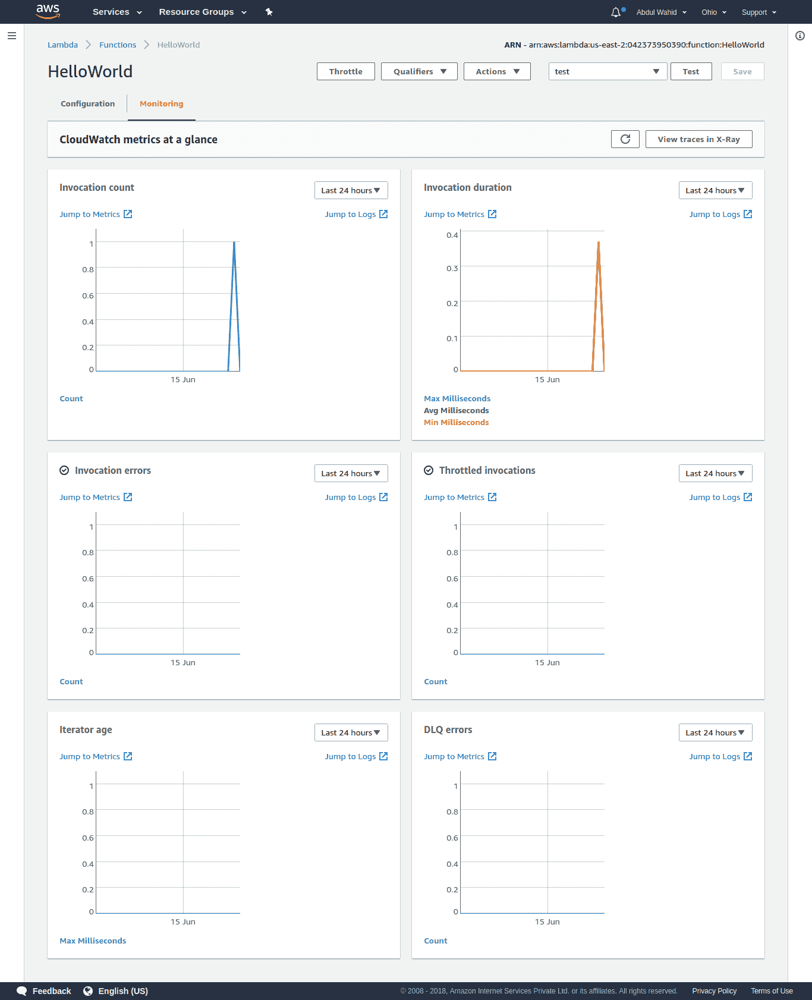

让我们继续下一节，在这里我们将研究 Lambda 函数的执行。

# 执行 Lambda 函数

AWS Lambda 支持多种执行方法。让我们从它自己的 web 控制台界面的基本执行开始。AWS Lambda 提供手动测试函数的功能，您可以在其中定义测试事件上下文。如果您想针对其他一些 Amazon 服务进行测试，那么可以使用内置的事件模板。

以下屏幕截图演示了测试事件的创建：

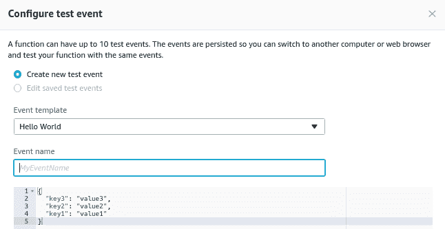

如前面的屏幕截图所示，单个 Lambda 函数最多可以有 10 个测试事件，并且测试事件会被持久化，因此您可以在需要测试 Lambda 函数时重用它们。

我创建了事件名为`HelloWorld`的测试事件，现在我将在将 Lambda 函数转换为 Python 微服务时执行`HelloWorld`函数，如下代码所示：

```py
from __future__ import print_function 
import json 

print('Loading function') 

def lambda_handler(event, context): 
    print("Received event: " + json.dumps(event, indent=2)) 
    print("value1 = " + event['key1']) 
    print("value2 = " + event['key2']) 
    print("value3 = " + event['key3']) 
    return "Hello World" 
```

这里，我们正在打印事件数据，然后返回到`Hello World`字符串：


Lambda 管理关于每个请求执行的一些信息，例如请求 ID 和计费信息。Lambda 价格模型基于请求处理的时间消耗，而请求 ID 是每个请求的唯一标识。

在日志输出中，可以看到所有打印语句的输出。现在，让我们提出一个错误，看看 Lambda 如何响应并返回日志。

我们将用以下代码片段替换当前代码：

```py
from __future__ import print_function 
import json 

print('Loading function') 

def lambda_handler(event, context): 
    print("Received event: " + json.dumps(event, indent=2)) 
    raise Exception('Exception raised manually.') 
```

以下屏幕截图是执行结果的日志片段：

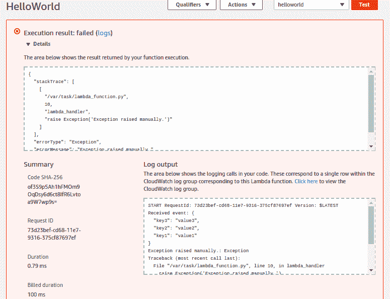

在这里，Lambda 使用完整的堆栈跟踪信息进行响应，并将其记录下来。您可以检查 CloudWatch 日志，因为 CloudWatch 预先配置了 AWS Lambda 执行。

我们从 Lambda 控制台了解了 Lambda 函数的执行，现在是从调度触发器执行 Lambda 函数的时候了。在我们的项目中，我们经常需要一个 cron 作业计划来在特定的时间段执行一些功能。

Lambda 触发器将帮助我们根据事件设置触发器。让我们继续将触发器引入 hello world 函数。

# 创建 Lambda 触发器

可以配置 Lambda 函数以响应事件。AWS 提供了支持大量事件的触发器列表。这些触发器属于其关联的 AWS 服务。

您可以从触发器部分向 Lambda 函数添加触发器。

我将稍微修改 hello world Lambda 函数。这里，我们正在打印请求 ID，它作为一个`aws_request_id`属性在上下文对象中接收。它还打印时间戳：

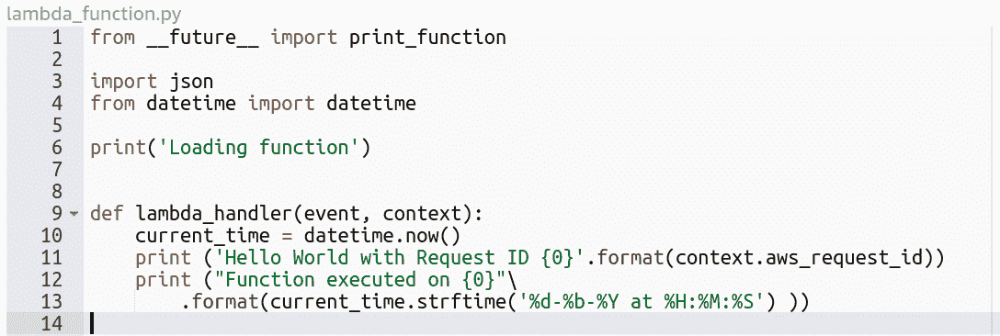

现在，我们将向 Lambda 函数添加一个触发器，它将每分钟执行一次 Lambda 函数。

下面的屏幕截图显示了添加触发器流，您可以使用 Lambda 功能从左侧面板轻松配置任何触发器：

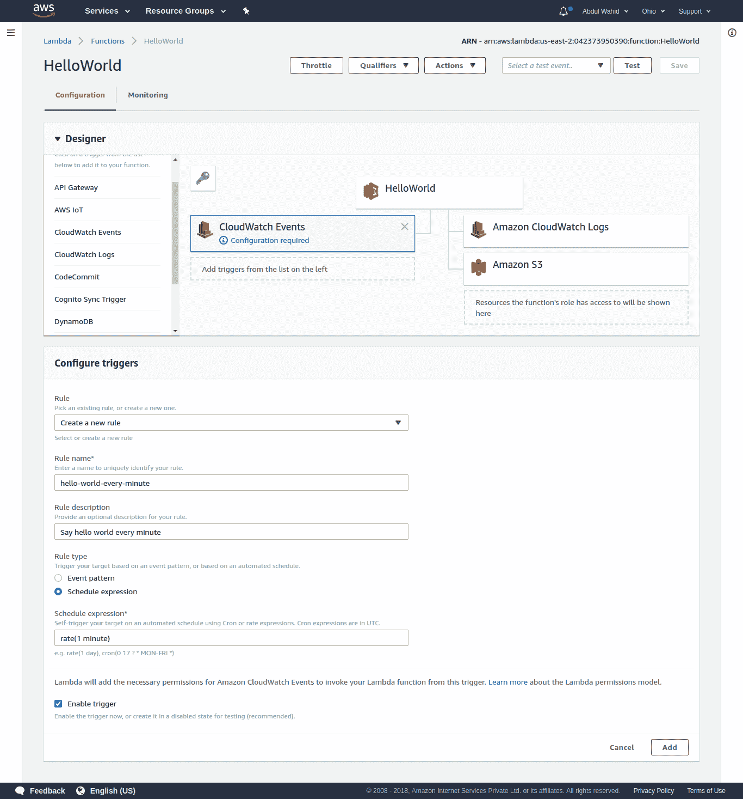

我们将配置 CloudWatch 事件触发器。CloudWatch 事件提供描述 AWS 资源变化的近实时系统事件。

您可以在 AWS 资源中设置操作事件发生时的简单事件规则，还可以根据 cron 或速率表达式安排自动触发的事件。

The cron and rate expression are two different methods to define a schedule expression. The cron expressions have six required fields, such as cron (fields), and the rate expressions have two required fields, such as rate (value unit). These methods help us to define a schedule expression. You can find detailed information at [http://docs.aws.amazon.com/AmazonCloudWatch/latest/events/ScheduledEvents.html.](http://docs.aws.amazon.com/AmazonCloudWatch/latest/events/ScheduledEvents.html)

在这里，我们将安排一个速率表达式，以便每分钟执行 hello world Lambda 函数。我们需要从触发器下拉列表中选择 CloudWatch 事件。

要创建 CloudWatch 事件规则，我们将创建一个新规则。我们需要使用一些必需的信息来设置规则，例如规则名称，它是唯一的标识符。因此，我们将规则命名为`hello-world-every-minute`*，规则类型命名为事件模式或调度表达式。在我们的例子中，它将是一个进度表达式，作为速率（1 分钟），如前面的屏幕截图所示。*

 *一旦我们设置并启用了触发器，计划的事件将按照调度表达式被触发。五分钟后让我们看看 hello world Lambda 日志。

要查看与任何服务相关的日志，您需要执行以下操作：

1.  打开[处的 CloudWatch 控制台 https://console.aws.amazon.com/cloudwatch/](https://console.aws.amazon.com/cloudwatch/)
2.  在导航窗格中，选择日志
3.  选择与`HelloWorld`Lambda 功能相关的日志组

以下屏幕截图描述了 CloudWatch 日志访问：

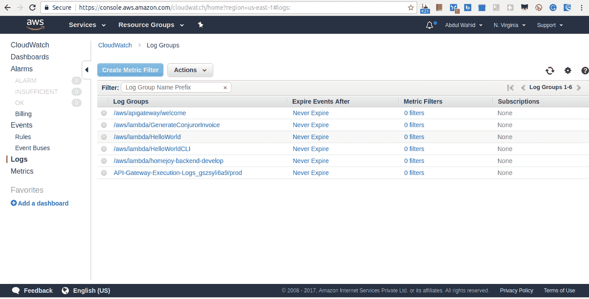

通过选择`HelloWorld`Lambda 函数日志组，您可以看到与`HelloWorld`Lambda 函数相关的日志记录活动。以下屏幕截图显示了`HelloWorld`功能的日志：

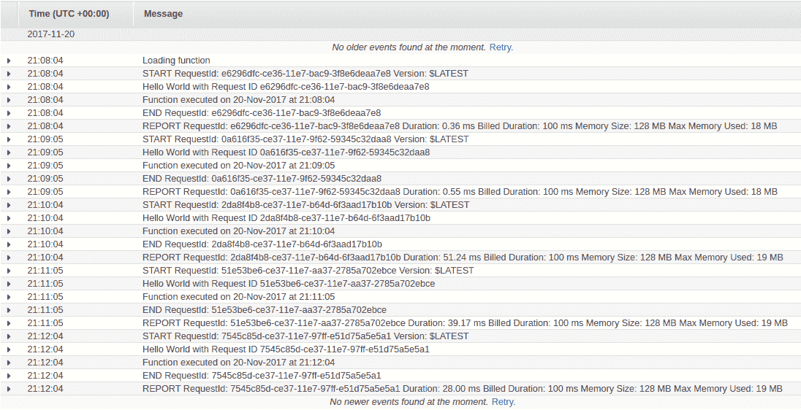

在这里，您可以看到，自启用触发器以来，hello world Lambda 函数每分钟都会执行一次

现在，让我们继续创建一个无服务器 RESTful API。

# 无服务器 RESTful API

让我们了解一下微服务场景，其中我们将部署一个无服务器 hello world 函数，该函数将通过 API 网关响应 HTTP 事件。

AmazonAPI 网关服务使您能够创建、管理和发布 RESTfulAPI，以便以任何规模与 AWS 资源交互。API 网关提供了一个接口，您可以在其中通过 REST 应用程序编程接口公开后端。

为了启用 AWS 无服务器基础设施，API 网关起着重要作用，因为它可以配置为执行 Lambda 函数

现在，我们将配置一个 API 网关服务来执行 Lambda 函数

以下是 hello world 函数：

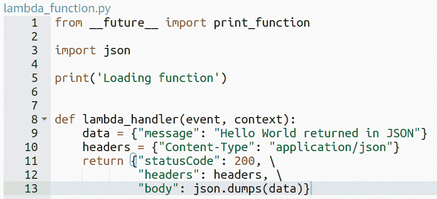

当我们将 AWS Lambda 函数与 API 网关集成时，Lambda 函数必须返回一个字典对象，其中包含所需的键`statusCode`、`headers`和`body`。`body`属性的值必须是 JSON 字符串。因此，我们将 Python 字典转换为 JSON 字符串。

是时候将 API 网关与 Lambda 函数集成了。正如我们在前面关于触发器的讨论中所看到的，我们将在 API 网关中添加一个触发器：

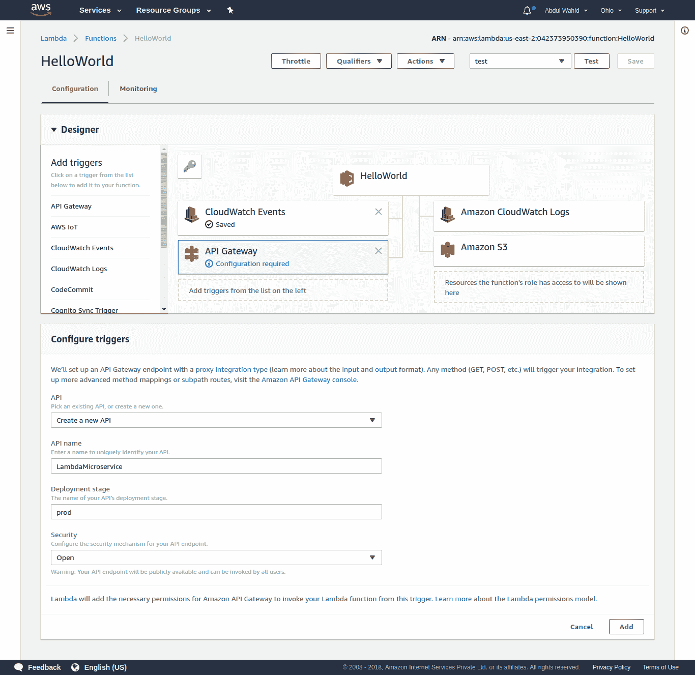

我们将创建一个名为`LambdaMicroservice`的 API 网关服务。API 网关使您能够根据需要创建和维护部署阶段。

如果您想保护您的 API，那么您有两个选择：使用 AWS IAM 并使用 access 密钥打开它，或者保持它为打开状态，使其公开可用。

AWS**IAM**（**身份访问管理**是一项 AWS 云服务，有助于创建安全访问凭据以访问 AWS 云服务。

使用访问密钥功能打开允许您从 API 网关控制台生成密钥。在我们的情况下，我们将只保持安全性开放，因为我们需要公开访问我们的 API：

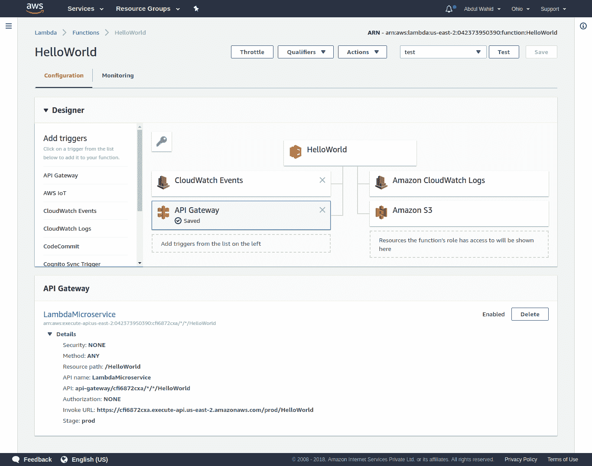

添加并保存更改后，RESTAPI 将在几秒钟内就绪。调用 URL 是我们的 RESTAPI 端点。

让我们使用`curl`命令行工具点击调用 URL，看看会发生什么：

```py
$ curl https://cfi6872cxa.execute-api.us-east-2.amazonaws.com/prod/HelloWorld
{"message": "Hello World returned in JSON"}
```

就这样。我们已经完成了使用 AWS Lambda 和 API 网关创建无服务器 RESTful API 的工作。现在，我们将了解如何使用 AWS CLI 与 AWS 服务交互。

# AWS Lambda 与 AWS CLI 的交互

AWS CLI 是在 AWS SDK for Python 之上使用 Boto 库开发的开源工具，该库提供与 AWS 服务交互的命令。通过最简单的配置，您可以从 CLI 管理任何 AWS 服务。它提供了对 AWS 服务的直接访问，您可以开发 shell 脚本来管理资源。

例如，如果要将文件上载到 S3 存储桶，则只需从 CLI 执行一个命令即可：

```py
$ aws s3 cp index.html s3://bucket-name/ 
```

`aws s3 cp`是一个外壳式命令，执行多部分文件上传操作以完成操作。

它还支持一些 AWS 服务的定制。您可以使用`--help`命令查看`aws-cli`支持的 AWS 服务列表。

# 安装 AWS CLI

`awscli`作为 Python 分发包提供给。您可以使用`pip`命令轻松安装，如下代码所述：

```py
$ pip install awscli --upgrade  
```

以下是先决条件：

*   Python2 版本 2.6.5+或 Python3 版本 3.3+
*   Unix、Linux、macOS 或 Windows

# 配置 AWS CLI

`awscli`直接访问 AWS 服务，但我们需要对其进行配置和认证，才能访问 AWS 服务。

运行`aws configure`命令，使用您的 Amazon 帐户配置 AWS CLI：


您可以从“我的安全凭据”选项中获取 AWS 访问密钥 ID 和 AWS 机密访问密钥，如以下屏幕截图所示：


Let's configure the AWS Lambda function using AWS CLI.

# 使用 AWS CLI 配置 Lambda 功能

让我们使用`awscli utility`命令配置 hello world Lambda 函数和触发器。

AWS CLI 支持所有可用的 AWS 服务。您可以使用`aws help`查看`aws`命令的详细描述，它还将列出所有可用的服务。

我们对 Lambda 感兴趣，因为我们将创建一个具有简单 hello world 上下文的 Lambda 函数：

```py
$ aws lambda help  
```

这将列出 Lambda 服务的完整描述以及管理 AWS Lambda 服务所需的所有可用命令。

# 创建 Lambda 函数

在这里，我们将使用`aws lambda create-function`命令创建一个新的 Lambda 函数。要运行这个命令，我们需要传递必需的和可选的参数。

确保您有一个具有`lambda:CreateFunction`操作权限的角色。

之前，在 AWS Lambda 控制台中，我们选择代码入口点作为内联编辑。现在，我们将使用 ZIP 文件作为部署包。

在创建 Lambda 函数之前，我们应该创建一个 Lambda 函数部署包。

此部署包将是一个 ZIP 文件，由您的代码和任何依赖项组成。

如果项目具有某些依赖项，则必须在项目的根指令中安装这些依赖项。例如：

```py
 $ pip install requests -t <project-dir> OR  
 $ pip install -r requirements.txt  -t <project-dir> 
```

这里，`-t`选项表示目标目录。

在名为`handler.py`的文件中创建一个简单的`lambda_handler`函数，如下图所示：


现在，让我们将一个部署包制作成一个 ZIP 文件，由前面的代码组成：

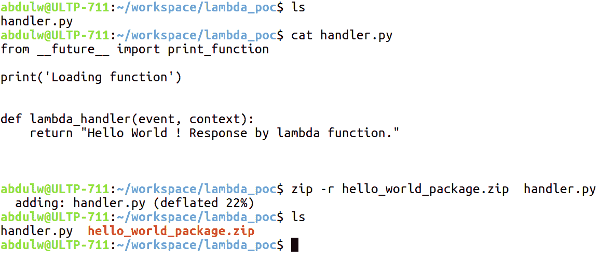

现在，我们准备创建 Lambda 函数。以下屏幕截图描述了命令的执行：


您可以看到，在 AWS Lambda 控制台中，Lambda 函数立即被创建：


让我们讨论一下我们在`aws lambda create-function`命令中使用的必需和可选参数：

*   `--function-name`（必填）：名称不言自明。我们需要传递要创建的 Lambda 函数名。
*   `--role`（必需）：这是一个必需参数，我们需要使用 AWS 角色 ARN 作为值。确保此角色具有创建 Lambda 函数的权限。
*   `--runtime`（必选）：我们需要提到 Lambda 函数执行的运行时环境。如前所述，AWS Lambda 支持 Python、Node.js、C#和 Java。这些是可能的值：
    *   `python2.7`
    *   `python3.6`
    *   `nodejs`
    *   `nodejs4.3`
    *   `nodejs6.10`
    *   `nodejs4.3-edge`
    *   `dotnetcore1.0`
    *   `java8`
*   `--handler`（必选）：这里，我们提到的函数路径将是 AWS Lambda 的执行入口点。在本例中，我们使用了`handler.lambda_function`，其中处理程序是包含`lambda_function`的文件。
*   `--description`：此选项允许您添加一些关于 Lambda 函数的文本描述。
*   `--zip-file`：此选项用于从本地环境/机器上传代码的部署包文件。在这里，您需要添加`fileb://`作为 ZIP 文件路径的前缀。
*   `--code`：此选项帮助您从 AWS S3 bucket 上传部署包文件。

您应该通过模式传递字符串值，如下图所示：

```py
 "S3Bucket=<bucket-name>,S3Key=<file-name>,S3ObjectVersion=<file-version-id>". 
```

您可以通过`help`命令看到许多其他可选参数，例如`aws lambda create-function help`*。*您可以根据需要使用。

现在我们将看到使用命令`$ aws lambda invoke`调用 Lambda 函数。

# 调用函数

Lambda CLI 提供了一个直接调用 Lambda 函数的命令：

```py
$ aws lambda invoke --function-name <value> <outfile> 
```

让我们看看这些参数：

*   `--function-name`（必选）：此参数要求输入 Lambda 函数名
*   `outfile`（必选）：这里，您需要提到一个文件名，Lambda 函数返回的输出或响应将存储在该文件名中

以下是您可以通过`help`命令列出的其他可选参数。

让我们调用最近创建的`HelloWorldCLI`函数：


当我们调用 Lambda 函数时，它立即响应一个状态代码，Lambda 函数通过`lambda invoke`命令返回存储在新创建的`lambda_output.txt`文件中的输出数据。

# 创建事件源映射

这是`aws lambda`命令的子命令，用于为 Lambda 函数创建事件映射。`$ aws lambda create-event-source-mapping`仅支持 Amazon Kinesis 流和 Amazon DynamoDB 流事件映射。在接下来的章节中，我们将讨论使用 Zappa 的 AmazonAPI 网关和 CloudWatch 事件的事件映射。

# 总结

在本章中，我们了解了创建简单 AWS Lambda 并针对其配置一些触发器的手动过程。此外，我们还使用 AWS CLI 查看了 AWS Lambda 配置。实现一个无服务器应用程序真是太神奇了。这些 AWS 服务在创建无服务器基础设施方面起着至关重要的作用，您可以在其中开发应用程序并将其部署为无服务器基础设施。

# 问题

1.  无服务器的好处是什么？
2.  AmazonS3 在无服务器基础设施中扮演什么角色？*