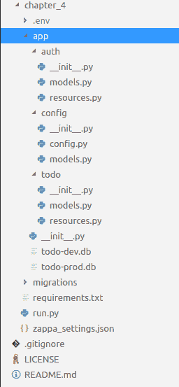
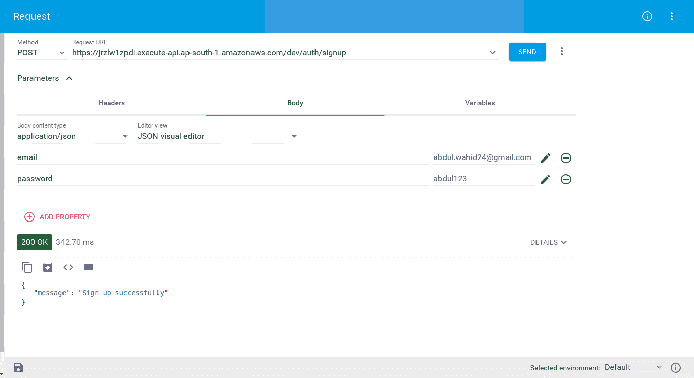
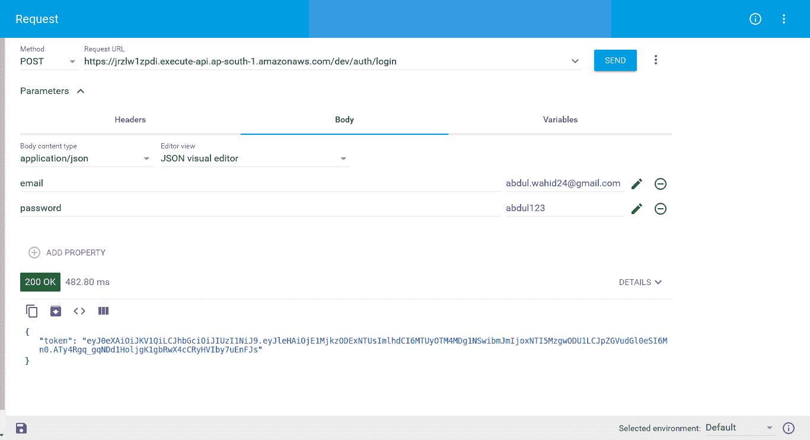
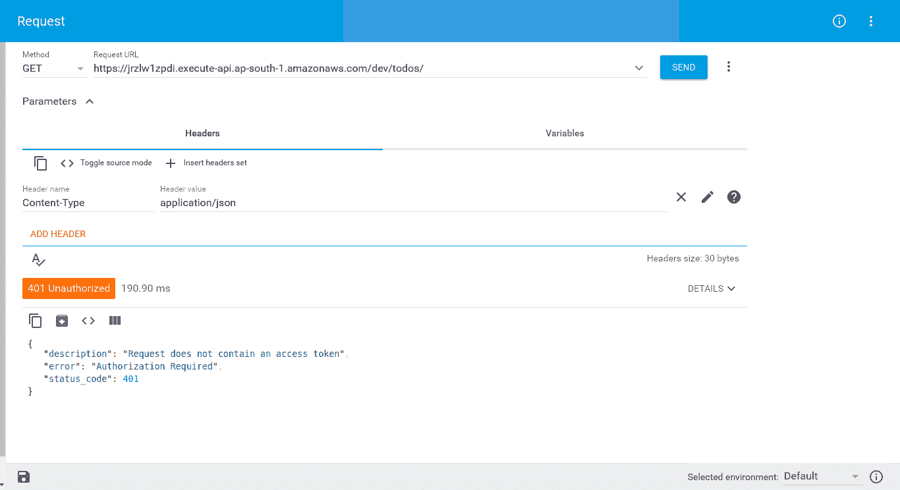
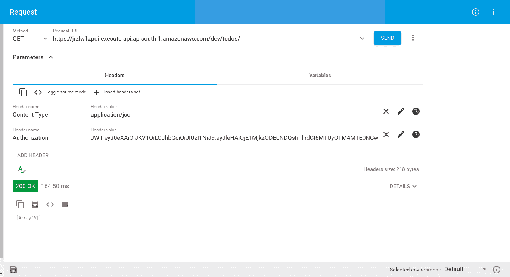
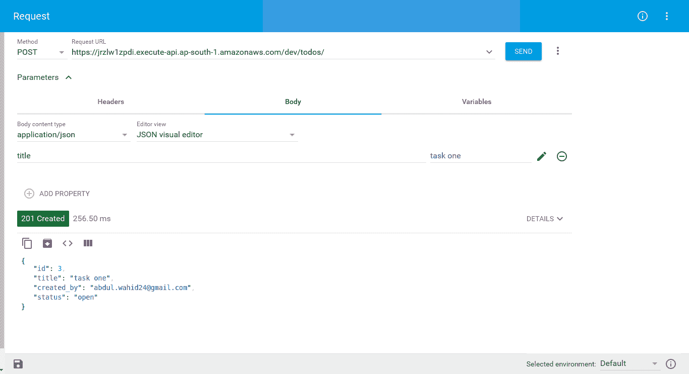
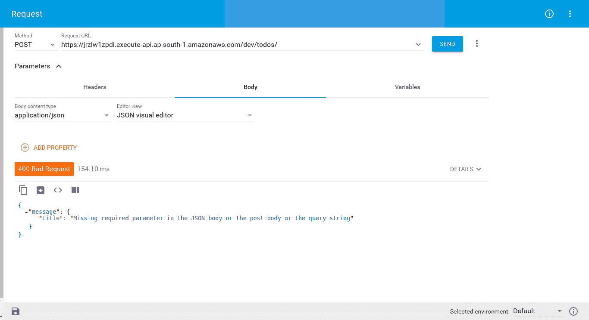
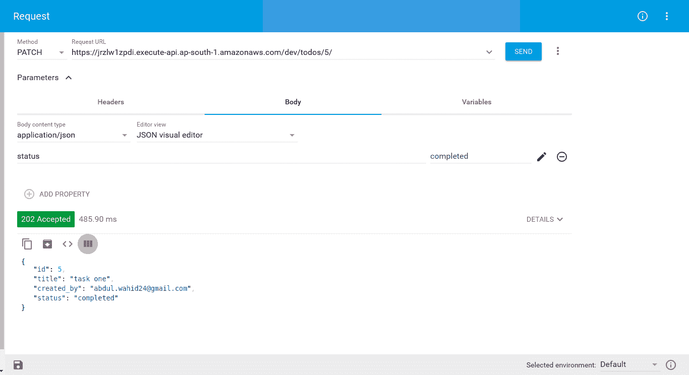
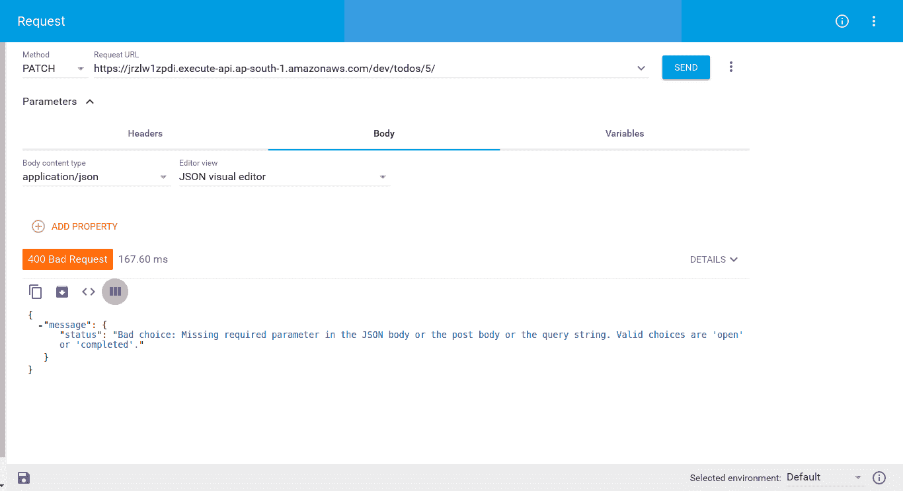
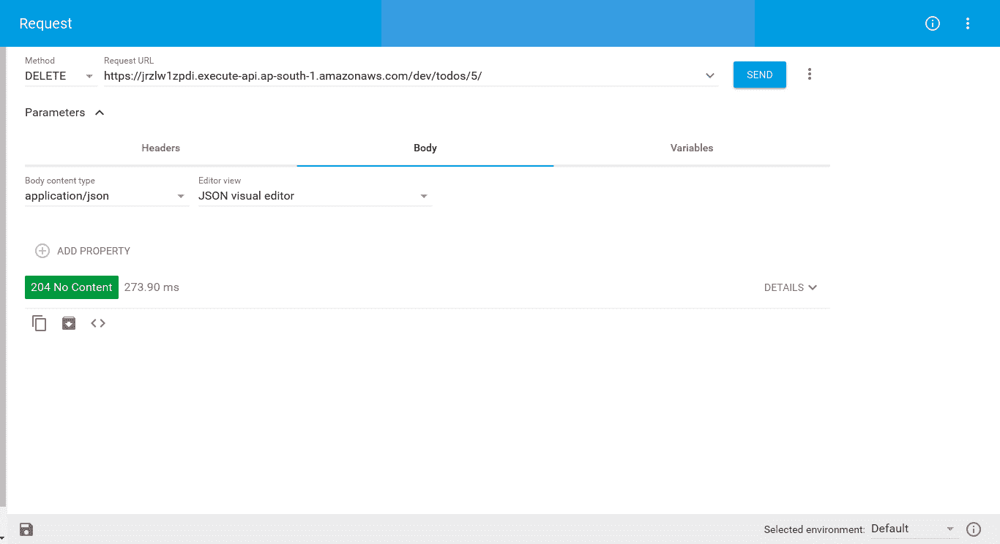

# 四、使用 Zappa 构建基于 Flask 的 RESTAPI

到目前为止，我们已经了解了如何开发基于 Flask 的应用并将其部署到无服务器基础设施上，我们已经创建了一个完整的 web 应用以及一个 HTML 呈现过程，并且我们已经使用各种 Flask 扩展以非常高效的方式构建了应用。

在本章中，我们将开发一个基于 Flask 的 RESTful API。这将涵盖使用 Flask 的 RESTAPI 实现和使用 Zappa 部署它。在[第 1 章](01.html)*Amazon Web Services for Serverless*中，我们看到了手动集成 AWS Lambda 和 API 网关的过程，因此现在我们将使用 Zappa 以自动方式部署 REST API。Zappa 将通过配置代理设置来传递调用 Lambda 函数的请求，从而负责 Flask REST API 与 API 网关的集成

让我们继续我们的旅程，在无服务器架构上开发 RESTAPI。

在本章中，我们将介绍以下主题：

*   安装和配置 Flask
*   设计 restapi
*   整合 Zappa
*   使用 Zappa 构建、测试和部署 RESTAPI

# 技术要求

我们将创建一个基于 Flask 的 REST API，因此在开始实际实现之前，我们有一些先决条件：

*   Ubuntu 16.04 LTS
*   Python 3.6
*   虚拟环境
*   Flask 0.12.2
*   Flask JWT 0.3.2
*   《炼金术》2.3.2
*   第 2.1.1 条
*   Flask 静置 0.3.6
*   Zappa 0.45.1
*   瓶子
*   Flask 加长件

# 安装和配置 Flask

我们将开发一个基于 Flask 的 RESTAPI，它将作为无服务器部署在 AWS Lambda 上。因此，在这里，安装和配置 Flask 将在虚拟环境中进行

我们将创建一个虚拟环境，并使其能够安装所有必需的软件包。这可以使用以下命令完成：

```py
virtualenv .env -p python3.6
source .env/bin/activate
```

现在，我们将在`requirements.txt`**文件中列出所有需要的软件包，我们将立即安装所有的软件包。下面介绍`requirements.txt`文件的内容：**

```py
Flask==0.12.2
Flask-JWT==0.3.2
Flask-SQLAlchemy==2.3.2
Flask-Migrate==2.1.1
flask-restful==0.3.6
zappa==0.45.1

```

现在，我们可以使用以下命令安装所有这些软件包：

```py
$ pip install -r requirements.txt
```

这是将在虚拟环境中安装的所有软件包。现在，让我们在下一节中详细解释这些包。

# Flask 加长件

Flask 有多种扩展，可以增强特定于任何所需功能的能力。在我们的应用中，我们将使用多个扩展，如前一节所述。这些扩展遵循一种通用模式，因此我们可以将它们与 Flask 应用对象集成。

我们将设计一个基于 Flask 的 restapi 应用，通过遵循 restapi 通信标准和验证，它将在 Todo 模型上具有基本的身份验证、授权和 CRUD 操作。

让我们在接下来的部分中了解一下这些扩展的用法。

# Flask JWT

Flask JWT 扩展在 Flask 环境中启用了**JWT**（**JSON Web 令牌**功能的特性。在设计 RESTAPI 时，JWT 令牌在验证和授权 API 访问方面起着重要作用。我们将在下一节中详细介绍 JWT。

# 了解 JWT

**JWT**代表**JSON 网络令牌**。这是一种标准模式，用于实现 RESTAPI 接口的安全性和真实性访问。JWT 令牌是服务器应用发布的数据的编码形式，用于验证客户端访问。客户端需要在 HTTP 请求中添加 JWT 令牌作为授权头

我们将使用 JWT 令牌来验证 RESTAPI 的访问。如果您需要详细了解 JWT 机制，我建议您阅读以下 JWT 文档：[https://jwt.io/introduction/](https://jwt.io/introduction/) 。

# 长颈瓶

Flask RESTful 扩展旨在通过 Flask 框架实现 RESTAPI。此扩展遵循标准 REST API 实现模式，并提供了一种简单的 REST API 实现方法。在实现 restapi 之前，您必须对 restapi 标准有一个基本的了解，所以让我们来看看 restapi 的基础知识。

# 从休息开始

**REST**代表**表征状态转移。**这是一个定义良好的标准，用于实现服务器-客户端通信以持久化数据。REST 遵循**JSON**（**JavaScript 对象表示法**）数据表示格式进行数据交换。

REST 在 HTTP 方法上定义了一些动词来执行 CRUD 操作，例如：

*   `GET`：检索根 URL 中带有后缀 ID 参数的记录和特定记录列表，并返回状态码为 200 的响应
*   `POST`：在服务器上创建记录并返回状态码为 201 的响应
*   `PUT`：更新服务器上的所有记录字段，并返回状态码为 200 的响应
*   `PATCH`：更新服务器上记录集中的特定字段，并返回状态码为 200 的响应
*   `DELETE`：借助 URL 中特定于记录的 ID 删除整个记录集，并返回带有 204 状态码的响应

现在，是时候看一些实际工作了。让我们继续下一节。

# 设计 restapi

我们将设计一个 RESTAPI，用于在 todos 模型上执行 CRUD 操作。我们的应用将有一个基本的身份验证和授权工作流，以确保 RESTAPI 端点的安全。

以下是我们应用的脚手架：



在这里，我们将在`app`模块下有三个单独的包，分别称为`config`、`auth`和`todo`**。我们将在`app`模块的`init`文件中配置并创建 Flask 应用对象。下面是`__init__.py`的代码片段，我们在其中配置了带有扩展的 Flask 应用对象和`config`对象。**

 **文件-`app`/`__init__.py`：

```py
from flask import Flask
from flask_sqlalchemy import SQLAlchemy
from flask_migrate import Migrate
from flask_jwt import JWT, jwt_required, current_identity

from app.config import config

db = SQLAlchemy()
migrate = Migrate()

def create_app(environment):
    app = Flask(__name__)
    app.config.from_object(config[environment])

    db.init_app(app)
    migrate.init_app(app, db=db)

    from .auth.models import User

    def authenticate(email, password):
        data = request.json
        user = User.query.filter_by(email=data['email']).first()
        if user is not None and user.verify_password(data['password']):
            return user

    def identity(payload):
        user_id = payload['identity']
        return User.query.filter_by(id=user_id).first()

    jwt = JWT(app, authenticate, identity)

    from .auth import auth as auth_blueprint
    app.register_blueprint(auth_blueprint, url_prefix='/auth')

    from .todo import todo as todo_blueprint
    app.register_blueprint(todo_blueprint)

    return app
```

我们配置了 Flask 扩展，例如 Flask SQLAlchemy 和 Flask 迁移，这很简单。Flask JWT 集成需要更多的工作，因为我们需要定义`authenticate`**和`identity`**方法，并在初始化 JWT 对象时将它们用作参数。这些方法负责验证用户和识别用户。****

 ****除了扩展集成之外，我们还将创建 auth 和 todo**应用作为 Flask blueprint 对象，并使用`register_blueprint`**方法将它们注册到 Flask 应用对象中。****

 ****让我们详细描述每个包及其用途。

# 配置应用设置

在`config`**包中，我们定义了应用级配置，将根据定义的环境进行隔离。`config.py`文件的内容如下：。**

 **文件-`config/config.py`：

```py
import os
from shutil import copyfile

BASE_DIR = os.path.dirname(os.path.dirname(__file__))

def get_sqlite_uri(db_name):
    src = os.path.join(BASE_DIR, db_name)
    dst = "/tmp/%s" % db_name
    copyfile(src, dst)
    return 'sqlite:///%s' % dst

class Config(object):
    SECRET_KEY = os.environ.get('SECRET_KEY') or os.urandom(24)
    SQLALCHEMY_COMMIT_ON_TEARDOWN = True
    SQLALCHEMY_RECORD_QUERIES = True
    SQLALCHEMY_TRACK_MODIFICATIONS = False

    @staticmethod
    def init_app(app):
        pass

class DevelopmentConfig(Config):
    DEBUG = True
    BUNDLE_ERRORS = True
    SQLALCHEMY_DATABASE_URI = get_sqlite_uri('todo-dev.db')

class ProductionConfig(Config):
    SQLALCHEMY_DATABASE_URI = get_sqlite_uri('todo-prod.db')

config = {
    'dev': DevelopmentConfig,
    'prod': ProductionConfig,
}
```

`config`文件公开了`config`对象，该对象根据您的环境包含不同的配置对象。以类似的方式，您可以根据需要添加更多的环境

The `get_sqlite_uri`method is defined to set the `db` file in the `tmp` directory because AWS Lambda requires the SQLite `.db` file in memory at the time of execution.

我们将总结应用所需的所有配置。因此，我们还定义了一个`BaseModel`，它组合了 SQL Alchemy 模型查询集对象所需的所有重复操作。下面的代码片段是我们的`BaseModel`，它的灵感来自 Django 执行保存、更新和删除操作的标准模式。如果需要，我们可以添加更多通用功能。

文件-`config/models.py`：

```py

from app import db

class BaseModel:
    """
    Base Model with common operations.
    """

    def delete(self):
        db.session.delete(self)
        db.session.commit()

    def save(self):
        db.session.add(self)
        db.session.commit()
        return self
```

在这里，我们结合了`db`会话操作，以执行特定的事务，如保存、更新和删除。这将帮助我们扩展模型类的特性

# 实现身份验证

身份验证是保护 REST API 不受未授权访问的基本功能。因此，为了实现身份验证层，我们将使用 JWT 机制。这里，我们将设计两个 RESTAPI，用于注册用户和登录访问。

为了持久化与用户相关的数据，我们需要定义一个用户模型。以下是`User`模型的代码片段。

文件-`auth/models.py`：

```py
import re
from datetime import datetime

from app.config.models import BaseModel
from sqlalchemy.orm import synonym
from werkzeug.security import generate_password_hash, check_password_hash
from app import db

class User(BaseModel, db.Model):
    __tablename__ = 'user'
    id = db.Column(db.Integer, primary_key=True)
    _email = db.Column('email', db.String(64), unique=True)
    password_hash = db.Column(db.String(128))

    def __init__(self, **kwargs):
        super(User, self).__init__(**kwargs)

    def __repr__(self):
        return '<User {0}>'.format(self.email)

    @property
    def email(self):
        return self._email

    @email.setter
    def email(self, email):
        if not len(email) <= 64 or not bool(re.match(r'^\S+@\S+\.\S+$', email)):
            raise ValueError('{} is not a valid email address'.format(email))
        self._email = email

    email = synonym('_email', descriptor=email)

    @property
    def password(self):
        raise AttributeError('password is not a readable attribute')

    @password.setter
    def password(self, password):
        if not bool(password):
            raise ValueError('no password given')

        hashed_password = generate_password_hash(password)
        if not len(hashed_password) <= 128:
            raise ValueError('not a valid password, hash is too long')
        self.password_hash = hashed_password

    def verify_password(self, password):
        return check_password_hash(self.password_hash, password)

    def to_dict(self):
        return {
            'email': self.email
        }
```

这是一个基本的`User`模型，只有两个字段，分别是`email`和`password`。现在，我们将设计一个注册 API 和一个登录 API。注册 API 将只接受两个参数：电子邮件和密码，并将在数据库中创建用户记录。登录 API 将用于验证用户的凭据，并将返回一个 JWT 令牌，该令牌将与其他 API 一起用作授权头。

让我们创建注册和登录 API。以下是包含 API 实现逻辑内容的资源文件的代码段。

文件-`auth/resources.py`：

```py
from flask import request, jsonify
from flask_restful import Resource, reqparse, abort
from flask_jwt import current_app
from app.auth.models import User

def generate_token(user):
    """ Currently this is workaround
    since the latest version that already has this function
    is not published on PyPI yet and we don't want
    to install the package directly from GitHub.
    See: https://github.com/mattupstate/flask-jwt/blob/9f4f3bc8dce9da5dd8a567dfada0854e0cf656ae/flask_jwt/__init__.py#L145
    """
    jwt = current_app.extensions['jwt']
    token = jwt.jwt_encode_callback(user)
    return token

class SignUpResource(Resource):
    parser = reqparse.RequestParser(bundle_errors=True)
    parser.add_argument('email', type=str, required=True)
    parser.add_argument('password', type=str, required=True)

    def post(self):
        args = self.parser.parse_args()
        if not User.query.filter_by(email=args['email']).scalar():
            User(
                email = args['email'],
                password = args['password']
            ).save()
            return {'message': 'Sign up successfully'}
        abort(400, message='Email already exists.')

class LoginResource(Resource):
    parser = reqparse.RequestParser(bundle_errors=True)
    parser.add_argument('email', type=str, required=True)
    parser.add_argument('password', type=str, required=True)

    def post(self):
        args = self.parser.parse_args()
        user = User.query.filter_by(email=args['email']).first()
        if user is not None and user.verify_password(args['password']):
            token = generate_token(user)
            return jsonify({'token': token.decode("utf-8")})
        abort(400, message='Invalid credentials')
```

Flask RESTful 提供了一个`Resource`类，用于定义 API 资源。它遵循 REST 标准，并提供了创建 API 的简单方法。由于我们将在 HTTP most`request`方法上使用注册 API，我们创建了一个`post`方法。类似地，我们设计了登录 API，在其中验证用户的凭据并返回令牌。

We have to return the custom method to generate the token since, at the time of writing, the Flask-JWT `PyPI` repository doesn't have an updated release, even though this feature has been added to the GitHub repository.

是时候用`Blueprint`对象配置这些资源类了。下面是前面提到的`auth/__init__.py`文件的代码片段。

文件-`auth/__init__.py`：

```py
from flask import Blueprint
from flask_restful import Api
from .resources import SignUpResource, LoginResource

auth = Blueprint('auth', __name__)
auth_api = Api(auth, catch_all_404s=True)

auth_api.add_resource(SignUpResource, '/signup', endpoint='signup')
auth_api.add_resource(LoginResource, '/login', endpoint='login')
```

在这里，我们创建了`Blueprint`对象并对其进行了配置。Flask RESTful 提供了一个`API`类，使用这个类，我们已经注册了注册和登录资源。就是这样。现在，我们可以使用 JSON 数据点击注册和登录 URL 来执行操作。在部署过程之后，我们将对这些 RESTAPI 进行完整的演示。

# 实现 todoapi

让我们开始 TODOAPI 实现。我们需要一个 todo REST API 端点来执行 CRUD 操作。按照 REST 标准，只有一个端点 URL，例如`/todos/<todo_id>/`。此端点将用于将 todo 数据持久化到数据库中。我们需要一个 Todo 模型来持久化数据。下面是 Todo 模型的代码片段。

文件-`todo/models.py`：

```py
from datetime import datetime
from app import db
from app.config.models import BaseModel

class Todo(db.Model, BaseModel):
    __tablename__ = 'todo'
    id = db.Column(db.Integer, primary_key=True)
    title = db.Column(db.String(128))
    is_completed = db.Column(db.Boolean, default=False)
    created_by = db.Column(db.String(64), db.ForeignKey('user.email'))
    user = db.relationship('User', backref=db.backref('todos', lazy=True))

    def __init__(self, title, created_by=None, created_at=None):
        self.title = title
        self.created_by = created_by

    def __repr__(self):
        return '<{0} Todo: {1} by {2}>'.format(
            self.status, self.title, self.created_by or 'None')

    @property
    def status(self):
        return 'completed' if self.is_completed else 'open'

    def completed(self):
        self.is_completed = True
        self.save()

    def reopen(self):
        self.is_completed = False
        self.save()

    def to_dict(self):
        return {
            'id': self.id,
            'title': self.title,
            'created_by': self.created_by,
            'status': self.status,
        }
```

在这里，我们创建了带有一些基本功能的 Todo 模型。现在，我们将在 API 资源中使用它，以便持久化来自 REST 端点的数据。以下是`resources.py`的代码片段，其中包含 todo 的 RESTAPI。

文件-`todo/resources.py`：

```py
from flask import request
from flask_restful import Resource, reqparse
from flask_jwt import current_identity, jwt_required

from .models import Todo

class TodoResource(Resource):

    decorators = [jwt_required()]

    def post(self):
        parser = reqparse.RequestParser(bundle_errors=True)
        parser.add_argument('title', type=str, required=True)

        args = parser.parse_args(strict=True)
        todo = Todo(args['title'], created_by=current_identity.email).save()
        return todo.to_dict(), 201

    def get(self, todo_id=None):
        if todo_id:
            todos = Todo.query.filter_by(id=todo_id, created_by=current_identity.email)
        else:
            todos = Todo.query.filter_by(created_by=current_identity.email)
        return [todo.to_dict() for todo in todos]

    def patch(self, todo_id=None):
        parser = reqparse.RequestParser(bundle_errors=True)
        parser.add_argument(
            'status',
            choices=('open', 'completed'),
            help='Bad choice: {error_msg}. Valid choices are \'open\' or \'completed\'.',
            required=True)

        if not todo_id:
            return {'error': 'method not allowed'}, 405
        args = parser.parse_args(strict=True)
        todo = Todo.query.filter_by(id=todo_id, created_by=current_identity.email).scalar()
        if args['status'] == "open":
            todo.reopen()
        elif args['status'] == 'completed':
            todo.completed()
        else:
            return {'error':'Invalid data!'}, 400
        return todo.to_dict(), 202

    def delete(self, todo_id=None):
        if not todo_id:
            return {'error': 'method not allowed'}, 405
        Todo.query.filter_by(id=int(todo_id), created_by=current_identity.email).delete()
        return {}, 204
```

在这里，我们定义了`TodoResource`类，它将处理`GET`、`POST`、`PUT`和`DELETE`HTTP 请求。根据请求类型，我们正在执行 CRUD 操作。我们还使用`reqparse`**定义了对 HTTP 请求中所需数据的验证**

 **为了确保`TodoResource`的安全，我们在`TodoResource`类的装饰器列表中添加了`jwt_required`方法，该方法将应用于所有相关的方法。现在，`TodoResource`API 将仅在具有有效授权标头的情况下可用，否则它将以未经授权的访问错误进行响应。

我们将在下一节中看到此功能的完整工作。

# 使用 Zappa 构建、测试和部署 RESTAPI

我们已经完成了开发，现在是在 AWS Lambda 中将应用部署为无服务器的时候了。在前一章中，我们已经描述了配置 Zappa 及其相关配置的先决条件，因此这里我假设您已经配置了 Zappa 和 AWS 配置

# 配置 Zappa

一旦配置了 Zappa，就可以为项目初始化 Zappa。您需要运行`zappa init`命令并按照 CLI 问卷使用 Zappa 配置项目。我遵循 Zappa 建议的默认配置设置。`zappa init`命令将生成`zappa_settings.json`文件，我们可以根据需要自由修改此文件。

以下是`zappa_settings.json`文件的代码片段。

文件-`zappa_settings.json`：

```py
{
    "dev": {
        "app_function": "run.app",
        "aws_region": "ap-south-1",
        "profile_name": "default",
        "project_name": "chapter-4",
        "runtime": "python3.6",
        "s3_bucket": "zappa-5xvirta98"
    }
}
```

Zappa 维护这个 JSON 文件以执行部署过程。现在，我们将继续部署应用。

# 使用 Zappa 启动部署

一旦完成了 Zappa 初始化，就可以部署应用了。Zappa 提供了一个`zappa deploy`命令来部署应用。此命令将执行部署过程，其中它将以 ZIP 文件的形式创建部署包，将其推送到 AWS S3 上，并使用 API 网关配置 AWS Lambda。我们在第一章中详细描述了完整的部署过程

一旦我们使用`zappa deploy dev`**命令运行此命令，我们的应用将作为 AWS Lambda 上的无服务器应用托管。如果要重新部署相同的应用，则需要运行`zappa update dev`命令，该命令将更新现有应用。**

 **让我们在下一节中看看如何演示部署的应用。

# 演示部署的应用

Zappa 为部署的应用生成一个随机 URL，并且在每次新部署时，它都会生成 URL。但是，如果您只是更新部署，那么它不会更改 URL。这是我们从 Zappa 部署过程中获得的 URL:[https://jrzlw1zpdi.execute-api.ap-south-1.amazonaws.com/dev/](https://jrzlw1zpdi.execute-api.ap-south-1.amazonaws.com/dev/) 。我们已经编写了带有一些端点的 auth 和 todo API，因此在基本 URL 上看不到任何内容。我们将使用参考资料中定义的 API 端点。

# 注册 API

我们设计了注册 API，端点为`/auth/signup`、**，需要两个参数：`email`和`password`。此端点负责在数据库中创建用户记录。一旦获得成功的响应，我们就可以使用相同的用户凭据来执行登录并访问其他 API。**

 **以下是注册 API 的屏幕截图：



这里，我们使用高级 REST 客户端应用来测试 API。如您所见，我们正在使用注册 API 创建用户记录。注册 API 以 200 状态响应。

# 登录 API

现在，数据库中有一个可用的用户记录，我们可以使用它执行登录操作。登录 API 负责验证用户的凭据并返回 JWT 令牌。此 JWT 令牌将用于授权 todos API。以下是通过 REST 客户端使用的登录 API 的屏幕截图：



在这里，您可以看到登录 API 的执行，因为我们得到了 JWT 令牌，该令牌将用于授权访问 todo API。

# Todo API

现在我们通过登录 API 获得了 JWT 令牌，让我们执行 Todo API。然而，在这里，我们将看到 TODOAPI 上的不同场景。我们的 Todo API 有一个名为`todos/<todo_id>`的端点

# 未经授权的 Todo API

让我们在不提供授权标头的情况下尝试 todo API：



如您所见，我们的应用出现了未经授权的错误。现在，我们将为授权头提供一个 JWT 令牌。

# 带有授权标头的 Todo API

我们将使用登录 API 返回的 JWT 令牌并设置授权头。授权头的值为`JWT <token>`。**现在，让我们用 CRUD 操作执行 API。**

 **`GET`请求如下所示：



在这里，我们得到了数据库中所有可用 todo 记录的列表。我们在设置授权标头时获得了访问权限。

`POST`请求如下所示：



在这里，我们创建了一个新的 todo 记录，并得到了状态代码为`201`的响应。现在，通过基本 URL，我们可以执行`GET`和`POST`请求，但是，为了对特定记录执行`GET`、`PUT`和`DELETE`功能，我们需要在 URL 中提及`todo_id`。

没有有效负载数据的`POST`请求如下所示：



这里，我们得到了验证错误，因为我们没有提供任何有效负载。我们在`flask_restful`库的`reqparse`**模块的帮助下管理此验证。**

 **具有 todo ID 的`GET`请求如下所示：


您可以看到，我们在 URL 中使用了 todo ID 来查看特定的记录集

`PATCH`请求如下所示：



在这里，我们更新了 todo 状态，并将 todo 记录标记为已完成。

包含无效数据的`PATCH`请求如下所示：



在这里，我们得到了验证错误，因为我们使用`reqparse`**模块定义了所需的选择，如下所述：**

```py
parser = reqparse.RequestParser(bundle_errors=True)
        parser.add_argument(
            'status',
            choices=('open', 'completed'),
            help='Bad choice: {error_msg}. Valid choices are \'open\' or \'completed\'.',
            required=True)
```

`DELETE`请求如下所示：



最后，我们用 HTTP`DELETE`请求删除了记录。就这样！我们已经完成了 RESTAPI 实现。

# 总结

在本章中，我们学习了如何创建基于 Flask 的 RESTAPI，并使用一些扩展对其进行了配置。在 Flask JWT 扩展的帮助下，我们实现了安全性。Flask RESTful 扩展提供了设计 REST API 的简单接口。最后，我们将 Zappa 配置为在无服务器环境中部署应用

在下一章中，我们将看到 Django 应用开发是 AWS Lambda 上的无服务器应用。请继续关注。

# 问题

1.  为什么我们需要 JWT 实现？
2.  Zappa 设置文件中的`function_name`参数是什么？**************************