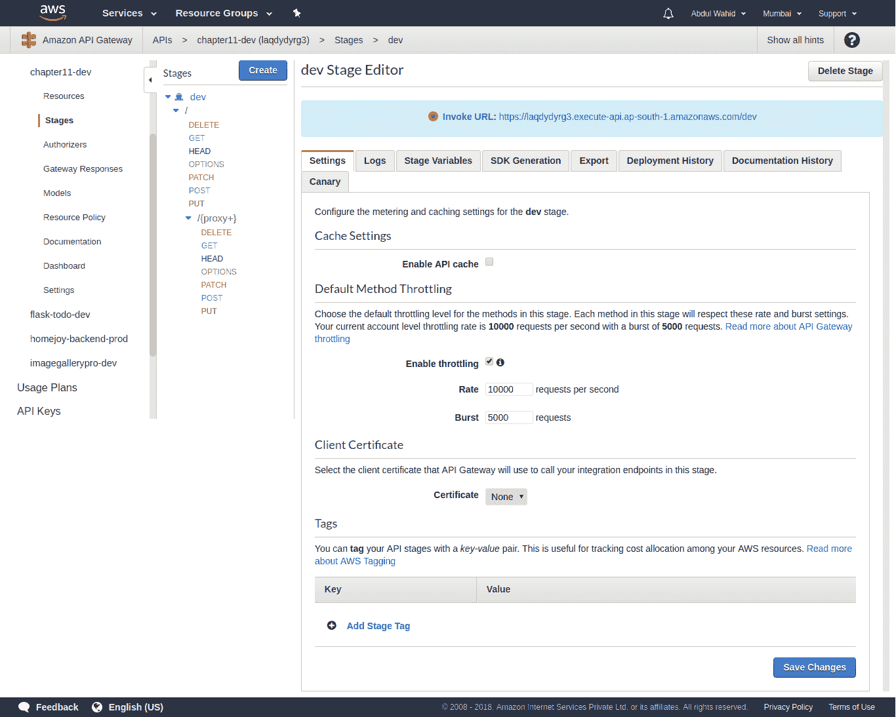
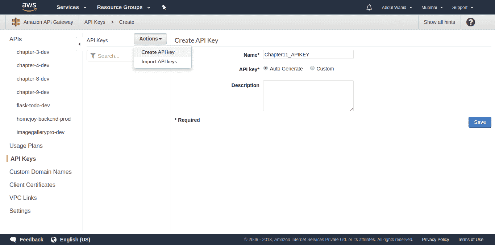
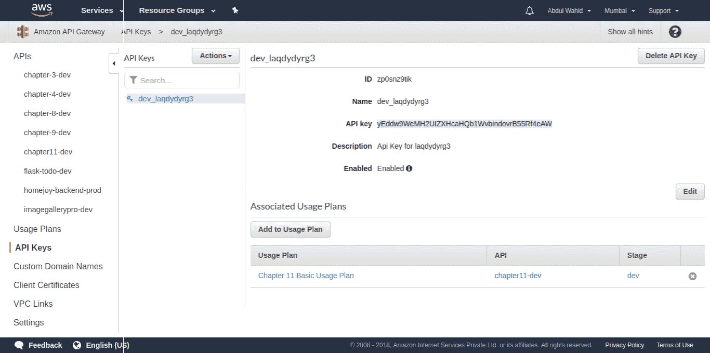
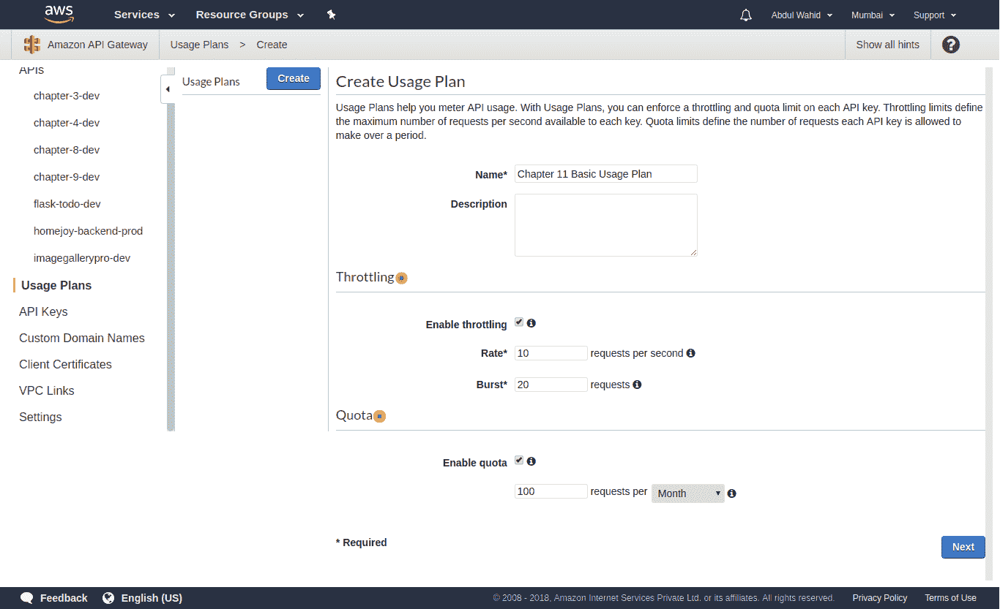
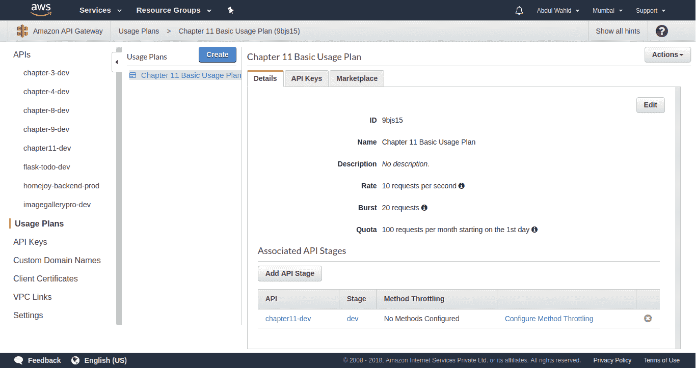
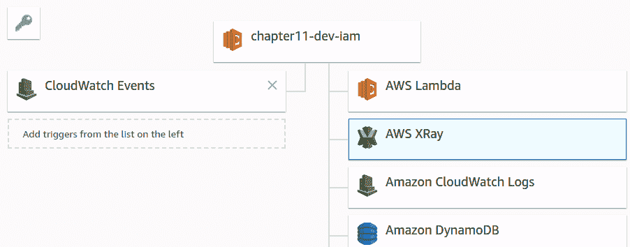
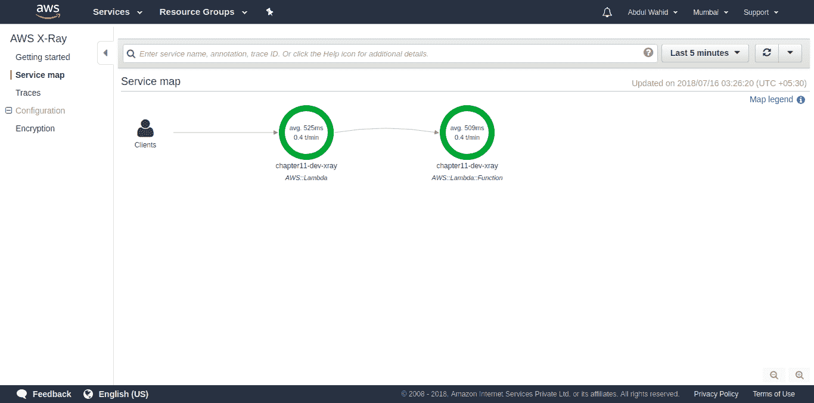
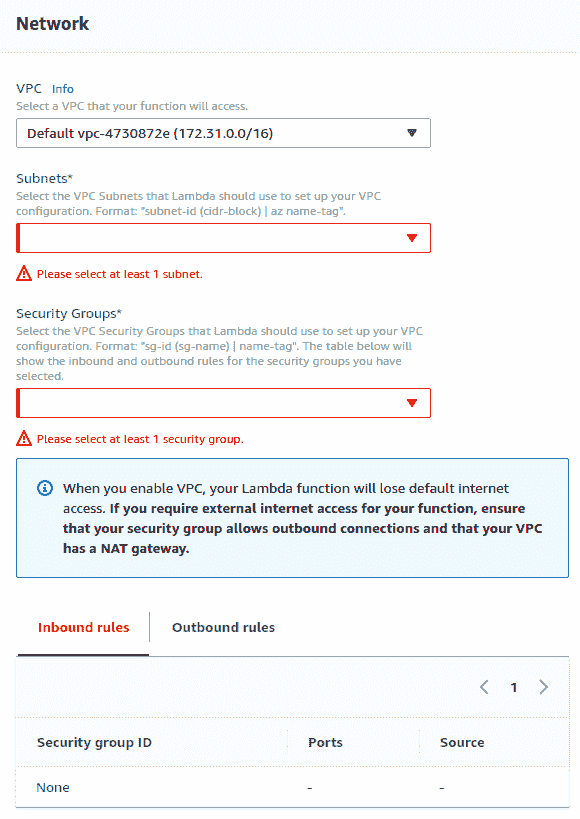
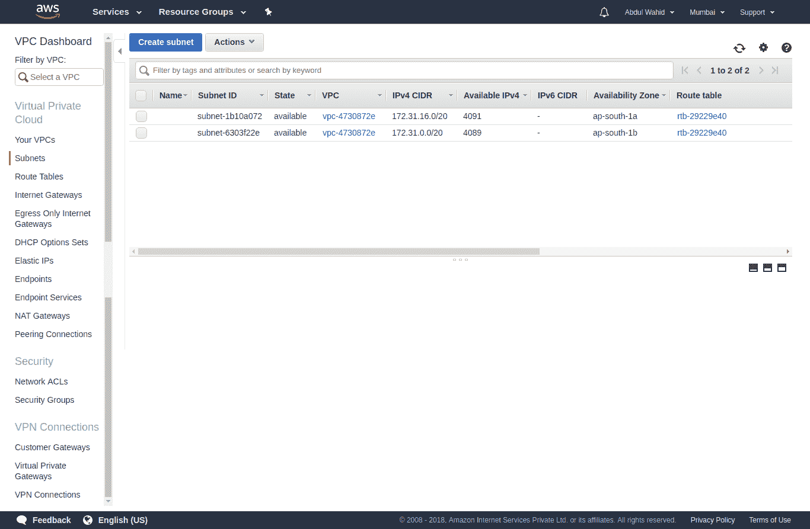

# 使用 Zappa 保护无服务器应用程序

本章，我们将学习如何保护部署在 AWS Lambda 上的基于 Python 的应用程序。在前几章中，我们学习了如何使用 Zappa 开发应用程序并将其部署到无服务器基础设施上。Zappa 还支持多种机制，使您能够为应用程序实现安全层。保护应用程序不受未经授权的访问对于任何 web 应用程序来说都是一个必不可少的过程，但是能够在无服务器的基础设施上保护 web 应用程序会更有趣

因此，我们将开发一个基于 API 的应用程序，并将演示一些防止未经授权访问的机制。让我们继续探讨有关设置开发环境的详细信息。

在本章中，我们将介绍以下主题：

*   实现随机报价 API
*   在 API 网关上启用安全端点
*   使用死信队列跟踪 AWS Lambda 故障
*   利用 AWS X 射线分析 Zappa 的应用
*   使用 AWS VPC 保护您的 Zappa 应用程序

# 技术要求

在本章中，我们将介绍更多 AWS 特性，以便使用 Zappa 增强安全层。在进入本章之前，请确保您已满足以下先决条件：

*   Ubuntu 16.04/macOS/Windows
*   Python 3.6
*   Pipenv 工具
*   AWS 帐户
*   古尼科恩
*   扎帕
*   其他 Python 包

一旦您启用了开发环境，我们就可以继续开发一个简单的基于 Falcon 的 API，用于根据请求生成随机报价。在接下来的章节中，我们将使用不同的机制和方法使用 Zappa 保护这个 API。

# 实现随机报价 API

在本节中，我们将创建一个生成随机报价的 RESTful API。这将包括基于 Falcon 的 API 实现与 Mashape API 集成，就像我们在[第 9 章](09.html)中所做的一样，在 AWS Lambda 上执行*异步任务。这一次，我们不打算集成数据库，因为我们不想保留任何信息。这将是对我们的 API 的一个简单 HTTP`GET`请求，然后我们将使用 Mashape API 返回一个 JSON 响应，其中包含一个随机生成的报价。让我们在下一节中了解先决条件。*

# 先决条件

我希望您已经满足了前面提到的技术要求，并使用 pipenv 工具设置了开发环境。现在，您需要在**Mashape**API 市场（[注册 https://market.mashape.com/](https://market.mashape.com/) ），我们将使用**随机著名引用**API（[https://market.mashape.com/andruxnet/random-famous-quotes](https://market.mashape.com/andruxnet/random-famous-quotes) 。获得使用此 API 的凭据后，我们需要在应用程序中对其进行配置

我们将使用 Zappa 的`remote_env`功能将这些凭证作为环境变量从 AWS S3 文件中共享，因此您需要在 AWS S3 上上传 JSON 文件。

文件-`book-config`/`chapter-11-config.json`：

```py
{
    "Mashape_API_Endpoint" : "https://andruxnet-random-famous-quotes.p.mashape.com/",
    "X_Mashape_Key": "XXXXXXXXXXXXXXXXXXXXXXXXXXXX"
}
```

将此文件上载到 S3 存储器后，您可以使用`zappa_settings.json`文件中的`remove_env`功能。以下是具有`remote_env`配置的`zappa_settings.json`示例：

```py
{
    "dev": {
        ...
        "remote_env": "s3://book-configs/chapter-11-config.json"
        ...
    }
}
```

一旦初始化 Zappa 进行部署，我们将添加此设置。现在，您可以手动将这些凭据设置为环境变量，就像我们在这里所做的那样：

```py
$ export Mashape_API_Endpoint=https://andruxnet-random-famous-quotes.p.mashape.com/
$ export X_Mashape_Key=XXXXXXXXXXXXXXXXXX
```

现在，让我们转到下一节，在这里我们将实现 RESTful API 以生成随机报价数据。

# 开发随机报价 API

既然我们已经讨论了 mashapeapi 配置，那么让我们编写一个代码片段来实现获取随机报价数据的功能。请查看以下代码段：

文件-`mashape.py`：

```py
import os
import requests

def fetch_quote():
    response = requests.get(
        os.environ.get('Mashape_API_Endpoint'),
        headers={
            'X-Mashape-Key': os.environ.get('X_Mashape_Key'),
            'Accept': 'application/json'
        }
    )
    if response.status_code == 200:
        return response.json()[0]
    return response.json() 
```

如您所见，我们编写了一个名为`fetch_quote`的方法，负责从 Mashape API 获取随机报价数据。我们将使用此方法进一步实现。

现在，让我们为我们的用户编写一个资源 API，他们将使用我们的 API 获取随机报价。以下是资源 API 的代码片段。

文件-`resource.py`：

```py
import falcon
from mashape import fetch_quote

class RandomQuoteResource:
    def on_get(self, req, resp):
        """Handles GET requests"""
        try:
            resp.media = fetch_quote()
        except Exception as e:
            raise falcon.HTTPError(falcon.HTTP_500, str(e))

api = falcon.API()
api.add_route('/', RandomQuoteResource())
```

在这里，我们使用 Falcon 框架实现了一个 RESTful API。此 API 映射到根 URL，即`"/"`。我们使用`on_get`方法只接受 HTTP`GET`请求；其他请求将被拒绝访问。一旦用户发起`GET`请求，此 API 将返回随机报价数据。

通过在本地主机上使用`gunicorn`运行此 API，您可以在本地环境中执行此 API：

```py
$ gunicorn resources:api
[2018-07-11 13:59:28 +0530] [3562] [INFO] Starting gunicorn 19.9.0
[2018-07-11 13:59:28 +0530] [3562] [INFO] Listening at: http://127.0.0.1:8000 (3562)
[2018-07-11 13:59:28 +0530] [3562] [INFO] Using worker: sync
[2018-07-11 13:59:28 +0530] [3565] [INFO] Booting worker with pid: 3565
```

一旦您运行了`gunicorn resources:api`命令，那么该 API 将在具有`8000`端口的本地主机上可用。让我们使用`curl`命令执行 API：

```py
$ curl http://localhost:8000
{"quote": "Whenever I climb I am followed by a dog called 'Ego'.", "author": "Friedrich Nietzsche", "category": "Famous"}
```

就这样。我们已经完成了实施。现在，是使用 Zappa 在 AWS Lambda 上部署应用程序的时候了。让我们转到下一节，在那里我们将进一步讨论部署过程。

# 与 Zappa 一起部署

要配置 Zappa，您应该运行`zappa init`命令并遵循自动生成的问卷。我遵循了默认的建议设置，因此下面是自动生成的`zappa_settings.json`文件。

文件-`zappa_settings.json`：

```py
{
    "dev": {
        "app_function": "resources.api",
        "profile_name": "default",
        "project_name": "chapter11",
        "runtime": "python3.6",
        "s3_bucket": "zappa-ss0sm7k4r"
    }
}
```

就这样。现在，借助此配置，您可以执行以下日志片段中提到的部署：

```py
$ zappa deploy dev
Calling deploy for stage dev..
Creating chapter11-dev-ZappaLambdaExecutionRole IAM Role..
Creating zappa-permissions policy on chapter11-dev-ZappaLambdaExecutionRole IAM Role.
Downloading and installing dependencies..
 - sqlite==python36: Using precompiled lambda package
Packaging project as zip.
Uploading chapter11-dev-1531293742.zip (5.6MiB)..
100%|███████████████████████████████████████████████████████████████████████████████████████████████████████████████████████████████████████████████████████████████████████████████████████| 5.92M/5.92M [00:02<00:00, 1.16MB/s]
Scheduling..
Scheduled chapter11-dev-zappa-keep-warm-handler.keep_warm_callback with expression rate(4 minutes)!
Uploading chapter11-dev-template-1531293760.json (1.6KiB)..
100%|███████████████████████████████████████████████████████████████████████████████████████████████████████████████████████████████████████████████████████████████████████████████████████| 1.62K/1.62K [00:00<00:00, 2.32KB/s]
Waiting for stack chapter11-dev to create (this can take a bit)..
100%|█████████████████████████████████████████████████████████████████████████████████████████████████████████████████████████████████████████████████████████████████████████████████████████████| 4/4 [00:09<00:00, 2.67s/res]
Deploying API Gateway..
Scheduling..
Unscheduled chapter11-dev-zappa-keep-warm-handler.keep_warm_callback.
Scheduled chapter11-dev-zappa-keep-warm-handler.keep_warm_callback with expression rate(4 minutes)!
Your updated Zappa deployment is live!: https://u1pao12esc.execute-api.ap-south-1.amazonaws.com/dev

```

在继续之前，让我们针对该应用程序集成一个自定义域。我们在[第 8 章](08.html)、*自定义域和 SSL*中学习了如何使用 ACM 创建 SSL 证书和配置自定义域。因此，我们将使用先前创建的野生 SSL 证书。仅仅从 Zappa 设置创建一个新的自定义域是非常容易的。

我们将在`zappa_settings.json`文件中添加以下设置。

文件-`zappa_settings.json`：

```py
{
    "dev": {
        "app_function": "resources.api",
        "profile_name": "default",
        "project_name": "chapter11",
        "runtime": "python3.6",
        "s3_bucket": "zappa-ss0sm7k4r",
        "remote_env": "s3://book-configs/chapter-11-config.json",
 "domain": "random-quote.abdulwahid.info",
 "certificate_arn":"arn:aws:acm:us-east-1:042373950390:certificate/af0796fa-3a46-49ae-97d8-90a6b5ff6784"
    }
}
```

在这里，我们更新了 Zappa 设置并添加了远程环境。现在，让我们使用`zappa update dev`命令更新部署。以下是`zappa update`命令的日志片段：

```py
$ zappa update dev
Calling update for stage dev..
Downloading and installing dependencies..
 - sqlite==python36: Using precompiled lambda package
Packaging project as zip.
Uploading chapter11-dev-1531294072.zip (5.6MiB)..
100%|███████████████████████████████████████████████████████████████████████████████████████████████████████████████████████████████████████████████████████████████████████████████████████| 5.92M/5.92M [00:02<00:00, 2.19MB/s]
Updating Lambda function code..
Updating Lambda function configuration..
Uploading chapter11-dev-template-1531294078.json (1.6KiB)..
100%|███████████████████████████████████████████████████████████████████████████████████████████████████████████████████████████████████████████████████████████████████████████████████████| 1.62K/1.62K [00:00<00:00, 8.55KB/s]
Deploying API Gateway..
Scheduling..
Unscheduled chapter11-dev-zappa-keep-warm-handler.keep_warm_callback.
Scheduled chapter11-dev-zappa-keep-warm-handler.keep_warm_callback with expression rate(4 minutes)!
Your updated Zappa deployment is live!: https://random-quote.abdulwahid.info (https://u1pao12esc.execute-api.ap-south-1.amazonaws.com/dev)
```

现在，应用程序已在 AWS Lambda 上更新，但我们仍然需要执行域认证任务以使域生效。在`zappa certify`命令的帮助下，我们可以实现这一点。

以下是`zappa certify`命令的日志片段：

```py
$ zappa certify dev
Calling certify for stage dev..
Are you sure you want to certify? [y/n] y
Certifying domain random-quote.abdulwahid.info..
Created a new domain name with supplied certificate. Please note that it can take up to 40 minutes for this domain to be created and propagated through AWS, but it requires no further work on your part.
Certificate updated!
```

如前面的日志所述，我们的应用程序与给定的自定义域（[一起运行 https://random-quote.abdulwahid.info](https://random-quote.abdulwahid.info) ），但创建域并通过 AWS 传播域可能需要 40 分钟，尽管这不需要您进一步的工作。让我们转到下一节，在那里我们将执行已部署的应用程序。

# 执行 API

一旦应用程序处于活动状态，就可以使用 cURL 工具检查 API 的执行情况。以下是 API 执行的日志片段：

```py
$ curl https://random-quote.abdulwahid.info
{"quote": "The significant problems we face cannot be solved at the same level of thinking we were at when we created them.", "author": "Albert Einstein", "category": "Famous"}
```

这就是无服务器的全部。现在，我们需要探索一些基本步骤来保护我们的应用程序免受未经授权的访问。让我们转到以下部分，在这些部分中，我们将讨论并实现一些保护应用程序安全的解决方案。

# 在 API 网关上启用安全端点

保护 API 访问安全是一项基本标准。您可以限制将要使用 API 的客户的访问权限。AmazonAPI 网关支持多种机制来保护、限制和限制 API 的使用。这将有助于根据您的客户群保持 API 的使用。以下是 API 网关支持的三种实现类型：

*   API 密钥
*   IAM 政策
*   API 网关 Lambda 授权程序

让我们更详细地了解每个实现。

# 启用 API 密钥

正如我们在[第 1 章](01.html)、*Amazon Web Services for Serverless、*中所述，关于 Zappa 的部署工作流，Zappa 将 API 网关配置为使用代理传递机制调用 AWS Lambda，这将在 API 网关接口上创建 API。每个 API 支持不同的阶段。在我们的例子中，我们在部署应用程序时创建了一个`dev`阶段。因此，以下屏幕截图显示了 API 网关控制台的状态：



API 网关支持 API 密钥机制，您可以在使用计划中创建 API 密钥。借助此 API 密钥，您可以限制客户的访问。如果客户使用 API 键值设置`x-api-key`头，则任何客户都可以访问 API。API 密钥可以映射到任何 API 或阶段。

以下屏幕截图显示了手动创建 API 密钥的过程：



使用 Zappa 可以消除手动创建 API 密钥的过程。这就是 Zappa 发挥重要作用的地方，因为它只需配置 Zappa 设置，就可以自动化整个过程。

Zappa 为`api_key_required`属性提供一个布尔值。`api_key_required`默认设置为`false`，但如果要生成 API 密钥，则需要将其设置为`true`。一旦将此属性设置为`true`，则需要重新部署应用程序。

The `api_key_required` settings don't work with the `zappa update` command; it only works with the `zappa deploy` command. Therefore, you need to undeploy the application and remove `CNAME` of your deployed custom domain from Route 53 and then remove the Custom domain from the API Gateway console. Once you remove these, then you can deploy the application once again.

以下是来自具有`"api_key_required"`属性的`zappa_settings.json`文件的代码片段。

文件-`zappa_settings.json`：

```py
{
    "dev": {
        "app_function": "resources.api",
        "profile_name": "default",
        "project_name": "chapter11",
        "runtime": "python3.6",
        "s3_bucket": "zappa-ss0sm7k4r",
        "remote_env": "s3://book-configs/chapter-11-config.json",
        "domain": "random-quote.abdulwahid.info",
        "certificate_arn":"arn:aws:acm:us-east-1:042373950390:certificate/af0796fa-3a46-49ae-97d8-90a6b5ff6784",
 "api_key_required": true
    }
}
```

现在，您可以使用`zappa deploy`命令再次执行新部署，如以下日志片段所述：

```py
$ zappa deploy dev
Calling deploy for stage dev..
Downloading and installing dependencies..
 - sqlite==python36: Using precompiled lambda package
Packaging project as zip.
Uploading chapter11-dev-1531334904.zip (5.6MiB)..
100%|████████████████████████████████████████████████████████████████████████████████████████████████████████████████████████████████████████████████████████████████████████████████████████| 5.92M/5.92M [00:12<00:00, 360KB/s]
Scheduling..
Scheduled chapter11-dev-zappa-keep-warm-handler.keep_warm_callback with expression rate(4 minutes)!
Uploading chapter11-dev-template-1531334920.json (1.6KiB)..
100%|███████████████████████████████████████████████████████████████████████████████████████████████████████████████████████████████████████████████████████████████████████████████████████| 1.61K/1.61K [00:00<00:00, 10.4KB/s]
Waiting for stack chapter11-dev to create (this can take a bit)..
100%|█████████████████████████████████████████████████████████████████████████████████████████████████████████████████████████████████████████████████████████████████████████████████████████████| 4/4 [00:09<00:00, 4.69s/res]
Deploying API Gateway..
Created a new x-api-key: zp0snz9tik
Deployment complete!: https://laqdydyrg3.execute-api.ap-south-1.amazonaws.com/dev
```

Note that Zappa will generate the new `x-api-key` and return the API key ID, as mentioned in the preceding log snippet.

完成部署后，您将能够在 API 网关控制台中看到自动生成的 API 密钥，如下所示：



如前一屏幕截图所示，您可以使用 Zappa 设置中的 API 键值将 Zappa 部署的 API 与此键值关联，以便 API 应用程序需要您在`x-api-key`头中具有此值

下一步是通过单击前面屏幕截图中显示的关联使用计划部分中的`Add to Usage Plan`将 API 键与使用计划关联。API 密钥可以与多个使用计划相关联。这些 计划使您能够根据业务模型为客户定义良好的结构使用计划。以下是第 11 章基本使用计划及其基本使用计划的屏幕截图：



正如您在前面的屏幕截图中所看到的，使用计划使您能够为每个 API 键定义节流限制和及时的有界 API 请求配额。定义计划后，您可以将其与任何已部署的 API 及其各自的阶段关联，如以下屏幕截图所述：



我们将第 11 章基本使用计划*`dev`API 与`dev`阶段链接到此计划。这是您为客户建立 API 业务计划并共享 API 密钥以提供授权访问的方式。*

 *现在，让我们使用`zappa_settings.json`文件中前面的 API 密钥屏幕截图中的 API 密钥值和 `"api_key"`属性。以下是更新后的`zappa_settings.json`文件。

文件-`zappa_settings.json`：

```py
{
    "dev": {
        "app_function": "resources.api",
        "profile_name": "default",
        "project_name": "chapter11",
        "runtime": "python3.6",
        "s3_bucket": "zappa-ss0sm7k4r",
        "remote_env": "s3://book-configs/chapter-11-config.json",
        "domain": "random-quote.abdulwahid.info",
        "certificate_arn":"arn:aws:acm:us-east-1:042373950390:certificate/af0796fa-3a46-49ae-97d8-90a6b5ff6784",
        "api_key_required": true,
"api_key":"yEddw9WeMH2UIZXHcaHQb1WvbindovrB55Rf4eAW"
    }
}
```

就这样。让我们使用`zappa update`命令再次更新部署，如下面提到的日志片段所示：

```py
$ zappa update dev
Calling update for stage dev..
Downloading and installing dependencies..
 - sqlite==python36: Using precompiled lambda package
Packaging project as zip.
Uploading chapter11-dev-1531337694.zip (5.6MiB)..
100%|████████████████████████████████████████████████████████████████████████████████████████████████████████████████████████████████████████████████████████| 5.92M/5.92M [00:16<00:00, 261KB/s]
Updating Lambda function code..
Updating Lambda function configuration..
Uploading chapter11-dev-template-1531337713.json (1.6KiB)..
100%|███████████████████████████████████████████████████████████████████████████████████████████████████████████████████████████████████████████████████████| 1.61K/1.61K [00:00<00:00, 8.50KB/s]
Deploying API Gateway..
Scheduling..
Unscheduled chapter11-dev-zappa-keep-warm-handler.keep_warm_callback.
Scheduled chapter11-dev-zappa-keep-warm-handler.keep_warm_callback with expression rate(4 minutes)!
Your updated Zappa deployment is live!: https://random-quote.abdulwahid.info (https://laqdydyrg3.execute-api.ap-south-1.amazonaws.com/dev)
```

我们已经完成了启用 API 密钥身份验证。让我们转到下一节来查看 API 的执行情况。

# 使用 API 密钥头执行 API

我们启用了 API 密钥的身份验证，因此 API 密钥对于`x-api-key`头是必需的。如果一个请求在没有`x-api-key`头的情况下命中 API，那么它将被拒绝访问，并被禁止响应。如果用户在`x-api-key`头中提供了有效的 API 键值，则允许其访问 API 资源。

不带`x-api-key`头的 API 执行如下：

```py
$ curl https://random-quote.abdulwahid.info/
{"message":"Forbidden"}
```

`x-api-key`头的 API 执行如下：

```py
$ curl --header "x-api-key: yEddw9WeMH2UIZXHcaHQb1WvbindovrB55Rf4eAW" https://random-quote.abdulwahid.info/
{"quote": "Problems worthy of attack prove their worth by fighting back.", "author": "Paul Erdos", "category": "Famous"}
```

我们完成了 API 密钥认证集成。让我们转到下一节，在这里我们将探讨使用 IAM 策略进行身份验证的另一个选项。

# IAM 政策

Amazon API 网关支持基于 IAM 的 V4 签名请求身份验证。API 网关要求用户通过对请求签名来验证请求。对请求进行签名是使用加密功能创建数字签名的完整流程。您可以通过以下链接了解有关签名请求过程的更多信息：

[https://docs.aws.amazon.com/apigateway/api-reference/signing-requests/](https://docs.aws.amazon.com/apigateway/api-reference/signing-requests/)

Zappa 通过在 Zappa 的设置中将`"iam_authorization"`属性设置为`true`来启用此功能。该属性默认设置为`false`。因此，您可以显式将其设置为 true，以启用基于 IAM 的身份验证。此功能使您能够基于 IAM 策略访问 API 资源。您可以通过 IAM 策略（[控制此访问 https://docs.aws.amazon.com/apigateway/latest/developerguide/api-gateway-iam-policy-examples.html](https://docs.aws.amazon.com/apigateway/latest/developerguide/api-gateway-iam-policy-examples.html) ）。

出于演示目的，我将为同一应用程序创建不同的阶段和自定义域。下面是 Zappa 设置的一个片段。

文件-`zappa_settings.json`：

```py
{
    "dev": {
        "app_function": "resources.api",
        "profile_name": "default",
        "project_name": "chapter11",
        "runtime": "python3.6",
        "s3_bucket": "zappa-ss0sm7k4r",
        "remote_env": "s3://book-configs/chapter-11-config.json",
        "domain": "random-quote.abdulwahid.info",
        "certificate_arn":"arn:aws:acm:us-east-1:042373950390:certificate/af0796fa-3a46-49ae-97d8-90a6b5ff6784",
        "api_key_required": true,
        "api_key":"yEddw9WeMH2UIZXHcaHQb1WvbindovrB55Rf4eAW"
    },
    "dev_iam": {
 "app_function": "resources.api",
 "profile_name": "default",
 "project_name": "chapter11",
 "runtime": "python3.6",
 "s3_bucket": "zappa-ss0sm7k4r",
 "remote_env": "s3://book-configs/chapter-11-config.json",
 "domain": "random-quote-iam.abdulwahid.info",
 "certificate_arn":"arn:aws:acm:us-east-1:042373950390:certificate/af0796fa-3a46-49ae-97d8-90a6b5ff6784",
 "iam_authorization": true
 }
}
```

在这里，我们用`iam_authentication`创建了一个不同的舞台。此标志将启用基于 IAM 的身份验证。现在，您需要再次执行部署、更新和认证操作，以使此阶段与以下域共存。

一旦激活，则任何未签名的请求将被 403 状态码拒绝访问，如以下`curl`执行的日志片段所述：

```py
$ curl -s -w "\nStatus Code:%{http_code}" https://random-quote-iam.abdulwahid.info
{"message":"Missing Authentication Token"}
Status Code:403
```

现在，您需要签署请求以访问已部署的资源。签署请求需要遵循一些流程，如下所述：[https://docs.aws.amazon.com/apigateway/api-reference/signing-requests/](https://docs.aws.amazon.com/apigateway/api-reference/signing-requests/) 。还有许多第三方库可用于生成签名请求所需的头。我们将使用`requests-aws-sign`（[https://github.com/jmenga/requests-aws-sign](https://github.com/jmenga/requests-aws-sign) ）使用已签名的请求访问 API 资源的库。

以下是对访问 API 资源的请求进行签名的代码片段。

文件-`aws_sign_request_test.py`：

```py
import os
import requests
from requests_aws_sign import AWSV4Sign
from boto3 import session

# You must provide a credentials object as per http://boto3.readthedocs.io/en/latest/guide/configuration.html#configuring-credentials
# This example attempts to get credentials based upon the local environment
# e.g. Environment Variables, assume role profiles, EC2 Instance IAM profiles
session = session.Session(
    aws_access_key_id=os.environ['aws_access_key_id'],
    aws_secret_access_key=os.environ['aws_secret_access_key'])
credentials = session.get_credentials()

# You must provide an AWS region
region = session.region_name or 'ap-south-1'

# You must provide the AWS service. E.g. 'es' for Elasticsearch, 's3' for S3, etc.
service = 'execute-api'

url = "https://random-quote-iam.abdulwahid.info/"
auth=AWSV4Sign(credentials, region, service)
response = requests.get(url, auth=auth)

print (response.content)
```

就这样！现在，您可以看到前面脚本的输出，如以下代码所示：

```py
$ python aws_sign_request_test.py 
b'{"quote": "Many wealthy people are little more than janitors of their possessions.", "author": "Frank Lloyd Wright", "category": "Famous"}'
```

最后，我们通过一个签名请求获得了 API 访问权。通过这种方式，您可以使用 IAM 身份验证保护无服务器 API 应用程序。让我们转到下一节，在这里我们将探索另一种保护无服务器 API 应用程序的方法。

# API 网关 Lambda 授权程序

Amazon API Gateway Lambda authorizer 是一个简单的 AWS Lambda 函数，充当授权者来控制对 API 网关资源的访问。这是因为 Lambda 授权人将负责通过承载令牌表单授权头验证请求，并返回有效的 IAM 策略。您可以基于**JWT**（**JSON Web 令牌**）、OAuth 或 SAML 编写具有不同身份验证策略的自定义 Lambda 授权程序

您可以从 API 网关控制台添加授权人，如 AWS 官方文档（[中所述）https://docs.aws.amazon.com/apigateway/latest/developerguide/apigateway-use-lambda-authorizer.html](https://docs.aws.amazon.com/apigateway/latest/developerguide/apigateway-use-lambda-authorizer.html) ），也可以从名为`api-gateway-authorizer-python`（[的 Lambda 蓝图创建 Lambda 授权人 https://github.com/awslabs/aws-apigateway-lambda-authorizer-blueprints/blob/master/blueprints/python/api-gateway-authorizer-python.py](https://github.com/awslabs/aws-apigateway-lambda-authorizer-blueprints/blob/master/blueprints/python/api-gateway-authorizer-python.py) ），然后将此 Lambda 函数作为授权人与 API 网关控制台中的 API 资源相关联。

一旦配置了授权者，API 网关将在授权标头中期待一个请求以及承载令牌或参数。如果缺少授权标头，它将拒绝请求。如果客户端向 API 资源发送授权标头中包含承载令牌的请求，则 API 网关将从请求标头提取承载令牌和其他参数，并将其作为事件参数提供给 Lambda authorizer 函数。Lambda 授权者使用现有 AWS IAM 策略或 AWS Cognito 用户池验证令牌，然后返回 IAM 策略以授权请求。API 网关通过在预配置的**TTL**（**生存时间**）从 300 秒到 3600 秒（默认为 300 秒）的时间段内缓存带有请求令牌的返回策略来维护子请求的会话。

Zappa 支持一种更简单的方式来配置 Lambda 授权器。您可以在 Zappa 设置中定义 authorizer 属性，如下所示：

```py
{
    "dev" : {
        ...
        "authorizer": {
            "function": "your_module.your_auth_function", 
            "arn": "arn:aws:lambda:<region>:<account_id>:function:<function_name>",
            "result_ttl": 300,
            "token_header": "Authorization", // Optional. Default 'Authorization'. The name of a custom authorization header containing the token that clients submit as part of their requests.
            "validation_expression": "^Bearer \\w+$", // Optional. A validation expression for the incoming token, specify a regular expression.
        }
        ...
    }
}
```

我们可以定义前面的属性。为了定义自定义 Lambda 授权者，每个属性都有自己的特定用法。让我们更详细地了解这些属性：

*   `function`：这将是您自己的本地函数，用于执行令牌验证。Zappa 将自动创建并映射此函数，作为 API 网关中 API 的授权人。
*   `arn`：这将是您现有 Lambda 函数验证令牌的`arn`。如果您选择 blueprint Lambda 授权人功能，`api-gateway-authorizer-python`（[https://github.com/awslabs/aws-apigateway-lambda-authorizer-blueprints/blob/master/blueprints/python/api-gateway-authorizer-python.py](https://github.com/awslabs/aws-apigateway-lambda-authorizer-blueprints/blob/master/blueprints/python/api-gateway-authorizer-python.py) ），然后您可以输入蓝图创建的 Lambda 函数的`arn`。
*   `result_ttl`：可选属性。启用**生存时间**（**TTL**时段）通过 API 网关缓存授权人结果。默认情况下，它设置为 300 秒，您可以将其最大设置为 3600 秒。
*   `token_header`：可选属性。它用于设置自定义授权标头的名称。它包含令牌作为客户端提交的请求的一部分。
*   `validation_expression`：可选属性。用于设置授权头中令牌的验证表达式。默认情况下，它支持`"^Bearer \\w+$"`表达式来验证令牌表达式。

这就是如何为无服务器 API 创建自定义 Lambda 授权程序的方法。这使您能够为 Zappa 部署的所有分布式 API 微服务创建集中身份验证。

现在，让我们进入下一节，在这里我们将探索 AWS 故障的跟踪机制。

# 使用死信队列跟踪 AWS Lambda 故障

**死信队列**（**DLQ**是 Amazon 定义的一种机制，用于跟踪异步执行的 AWS Lambda 函数的故障。AWS Lambda 调用异步模式，并在事件被丢弃之前，在失败的情况下两次使其失效。DLQ 用于将此故障事件处理到 Amazon SQS 队列或 Amazon SNS 主题。

# 手动 DLQ 配置

DLQ 可以通过在 Lambda 函数的`DeadLetterConfig`参数上设置`TargetArn`（即 SQS 队列 ARN 或 SNS 主题 ARN）进行配置，如下所述：

```py
{
    "Code": {
        "ZipFile": blob,
        "S3Bucket": “string”,
        "S3Key": “string”,
        "S3ObjectVersion": “string”
    },
    "Description": "string",
    "FunctionName": "string",
    "Handler": "string",
    "MemorySize": number,
    "Role": "string",
    "Runtime": "string",
    "Timeout": number
    "Publish": bool,
    "DeadLetterConfig": {
 "TargetArn": "string" 
 }
} 
```

# 使用 Zappa 自动化 DLQ 配置

为了自动化此过程，Zappa 通过将 SQS 队列/SNS 主题 ARN 值设置为`dead_letter_arn`*来启用此功能。*我们在[第 9 章](09.html)*AWS Lambda 上异步任务执行*中创建了一个 SNS 主题，名为`UnhandledException`。所以，让我们使用现有的 SNS 主题，它已经与我的电子邮件订阅。DQL 仅在异步 Lambda 函数调用失败并失效时才会触发。然后，DQL 将故障异常作为消息处理到配置的 SNS 主题，我们将在订阅的电子邮件上接收处理后的异常数据。

现在，下面的代码片段用于更新的 Zappa 设置。

文件-`zappa_settings.json`：

```py
{
    "dev": {
        "app_function": "resources.api",
        "profile_name": "default",
        "project_name": "chapter11",
        "runtime": "python3.6",
        "s3_bucket": "zappa-ss0sm7k4r",
        "remote_env": "s3://book-configs/chapter-11-config.json",
        "domain": "random-quote.abdulwahid.info",
        "certificate_arn":"arn:aws:acm:us-east-1:042373950390:certificate/af0796fa-3a46-49ae-97d8-90a6b5ff6784",
        "api_key_required": true,
        "api_key":"yEddw9WeMH2UIZXHcaHQb1WvbindovrB55Rf4eAW",
        "dead_letter_arn": "arn:aws:sns:ap-south-1:042373950390:UnhandledException"
    },
    "dev_iam": {
        "app_function": "resources.api",
        "profile_name": "default",
        "project_name": "chapter11",
        "runtime": "python3.6",
        "s3_bucket": "zappa-ss0sm7k4r",
        "remote_env": "s3://book-configs/chapter-11-config.json",
        "domain": "random-quote-iam.abdulwahid.info",
        "certificate_arn":"arn:aws:acm:us-east-1:042373950390:certificate/af0796fa-3a46-49ae-97d8-90a6b5ff6784",
        "iam_authorization": true
    }
}
```

在这里，我只更新了`dev`阶段的`dead_letter_arn`属性。因此，此功能将可用于`dev`阶段。现在，我们都设置了 DLQ 和我们的`dev`阶段 Lambda 功能。完成此配置后，需要使用`zappa deploy`命令执行部署。就这样！现在，我们的代码中应该有一个异步 Lambda 函数机制，在运行时引发异常。

Please note that for Lambda function-specific changes, you are required to redeploy your function using the `zappa deploy` command. The `zappa update` command will not work here as it is responsible for updating the existing code base, not Lambda configurations.

# 在异步 Lambda 函数中引发异常

为了在异步 Lambda 调用中引发异常，我们需要一种机制来实例化异步 Lambda 函数。让我们编写一个资源 API 并调用一个异步任务，这将引发一个异常。

以下是`resources.py`的更新代码：

```py
import falcon
from zappa.async import task
from mashape import fetch_quote

class RandomQuoteResource:
    def on_get(self, req, resp):
        """Handles GET requests"""
        try:
            resp.media = fetch_quote()
        except Exception as e:
            raise falcon.HTTPError(falcon.HTTP_500, str(e))

@task
def async_task():
    raise ValueError("Async Failure Exception")

class AsyncTaskResource:
    def on_get(self, req, resp):
        """Handles GET requests"""
        try:
            async_task()
            resp.media = 'Called async task'
        except Exception as e:
            raise falcon.HTTPError(falcon.HTTP_500, strsk(e))

api = falcon.API()
api.add_route('/', RandomQuoteResource())
api.add_route('/async-failure', AsyncTaskResource())
```

在这里，我们创建了一个`AsyncTaskResource`作为`"/async-failure"`路由的资源类。此路由是使用`AsyncTaskResource`类中的`on_get`方法通过 HTTP`GET`请求定义的。我们还使用任务装饰器将`async_task`方法创建为异步方法。我们已经在[第 9 章](09.html)*AWS Lambda*上的异步任务执行中看到了使用 Zappa 实现异步任务。任务装饰器将在单独的 Lambda 实例中异步执行该方法。

从`async_task`开始，我们提出`ValueError`例外。这将导致异步 Lambda 执行失败，并在后续失败时引发 DLQ 事件。DLQ 将异常数据处理到我们配置的 SNS 主题 ARN。最后，我们将在电子邮件中获得异常信息。

让我们执行之前创建的 API。以下是`async-failure`API 的日志片段：

```py
$ curl -H "x-api-key: yEddw9WeMH2UIZXHcaHQb1WvbindovrB55Rf4eAW" https://random-quote.abdulwahid.info/async-failure
"Called async task"
```

我们请求了`/async-failure`API，该 API 立即响应并在异步 Lambda 函数中实例化了任务。由于我们在`async_task`方法中显式地引发了一个异常，这将调用 DLQ 并通过发布到 SNS 主题来处理异常信息。以下是从 AWS 通知消息收到的电子邮件通知的屏幕截图：


这样，我们可以跟踪未知故障。此功能将帮助我们提高应用程序的质量并降低故障率。让我们继续下一节，我们将探索使用 AWS X-Ray 分析 Zappa 应用程序。

# 用 AWS X 射线分析 Zappa 的应用

AWS X-Ray 是由 Amazon Web Services 提供的分析服务。它帮助开发人员对应用程序行为和工作流程进行分析。在 X 射线的帮助下，开发人员可以了解应用程序的性能并跟踪根本原因，以改进优化。

AWS X-Ray 可以在任何 compute AWS 服务上启用。启用 X-Ray 后，它将根据应用程序交互开始生成数据段。例如，如果您向应用程序发出 HTTP 请求，那么 X-Ray 将生成有关主机、请求、响应、计算时间和错误的数据。基于这些数据段，X 射线生成服务图

服务图为开发人员提供了一个可视化的模式，以了解应用程序工作流并帮助确定其性能。除了请求和响应数据生成之外，X-Ray 还为您的应用程序与 AWS 资源、微服务、数据库和 HTTP Web API 调用的交互生成记录。

# X 射线手动与 AWS Lambda 集成

AWS Lambda 控制台具有特权，因为它可以使用 AWS X-Ray 配置 Lambda 功能。因此，与 AWS Lambda 的任何相互作用将由 AWS X 射线记录。通过从 Lambda 功能的控制台页面配置该功能，可以在 Lambda 功能上启用 X 射线，如以下屏幕截图所示：



关于 AWS Lambda 控制台工作流，您需要选择 AWS X 射线。然后，您可以从主部分的底部面板配置其相关设置，如以下屏幕截图所示：


选择 X 射线后，默认的执行角色权限将附加到 Lambda 函数。这样，AWS X-Ray 将记录 Lambda 函数 API 执行的跟踪。

# Zappa 配置以启用 AWS X 射线支持

为了配置 Lambda 函数，Zappa 总是在这里避免手动交互。因此，Zappa 提供了一种使用 Lambda 功能配置 AWS X 射线的简单方法。您只需要在 Zappa 设置中将`"xray_tracing"`设置为`true`。这将自动启用 Lambda 功能的 X 射线跟踪支持。

让我们创建现有 API 应用程序的另一个阶段。这个阶段将有一个基本配置，没有身份验证和自定义域，因为我们只想演示 X 射线工作流程。以下是支持 X 射线的新阶段配置。

文件-`zappa_settings.json`：

```py
{
    ...
    "dev_xray": {
        "app_function": "resources.api",
        "profile_name": "default",
        "project_name": "chapter11",
        "runtime": "python3.6",
        "s3_bucket": "zappa-ss0sm7k4r",
        "remote_env": "s3://book-configs/chapter-11-config.json",
        "xray_tracing": true
    }
}
```

如前所述，我们添加了一个名为`"dev_xray"`的新阶段，具有基本配置和 AWS X 射线跟踪支持。现在，让我们使用`zappa deploy`命令部署此阶段。

以下是 Zappa 的`deploy`命令的代码片段：

```py
$ zappa deploy dev_xray
Calling deploy for stage dev_xray..
Creating chapter11-dev-xray-ZappaLambdaExecutionRole IAM Role..
Creating zappa-permissions policy on chapter11-dev-xray-ZappaLambdaExecutionRole IAM Role.
Downloading and installing dependencies..
 - lazy-object-proxy==1.3.1: Using locally cached manylinux wheel
 - sqlite==python36: Using precompiled lambda package
Packaging project as zip.
Uploading chapter11-dev-xray-1531691356.zip (8.2MiB)..
100%|████████████████████████████████████████████████████████████████████████████████████████████████████████████████████████████████████████████████████████| 8.65M/8.65M [00:19<00:00, 460KB/s]
Scheduling..
Scheduled chapter11-dev-xray-zappa-keep-warm-handler.keep_warm_callback with expression rate(4 minutes)!
Uploading chapter11-dev-xray-template-1531691381.json (1.6KiB)..
100%|███████████████████████████████████████████████████████████████████████████████████████████████████████████████████████████████████████████████████████| 1.64K/1.64K [00:00<00:00, 9.68KB/s]
Waiting for stack chapter11-dev-xray to create (this can take a bit)..
100%|█████████████████████████████████████████████████████████████████████████████████████████████████████████████████████████████████████████████████████████████| 4/4 [00:09<00:00, 4.70s/res]
Deploying API Gateway..
Deployment complete!: https://r0wagu3zh3.execute-api.ap-south-1.amazonaws.com/dev_xray
```

就这样！现在，我们的 Random Quote API 已启动并在不同阶段运行。部署应用程序后，Zappa 将生成一个随机 API 网关链接，如前面的日志片段所述。现在，您可以使用 curl 工具点击 API。

以下是 API 执行的日志片段：

```py
$ curl https://r0wagu3zh3.execute-api.ap-south-1.amazonaws.com/dev_xray
{"quote": "A lie gets halfway around the world before the truth has a chance to get its pants on.", "author": "Sir Winston Churchill", "category": "Famous"}
```

我们已经集成了 AWS X-Ray，因此所有应用程序的交互都将被 AWS X-Ray 记录为跟踪段。以下是 AWS X-Ray 服务地图的屏幕截图：



在这里，您可以看到应用程序的跟踪详细信息。这些详细信息根据其控制台上的时间范围提供。AWS X-Ray 支持客户端 SDK 库，这使开发人员能够根据他们的要求保留这些跟踪。AWS X-Ray 的客户端 SDK 有许多使用语言和特定语言框架的实现。您可以通过以下链接阅读有关 AWS X-Ray 及其基于 Python 的 SDK 库的更多信息：

[https://docs.aws.amazon.com/xray/latest/devguide/aws-xray.html](https://docs.aws.amazon.com/xray/latest/devguide/aws-xray.html)

[https://github.com/aws/aws-xray-sdk-python](https://github.com/aws/aws-xray-sdk-python)

让我们进入下一节，我们将探讨 AWS VPC 与 AWS Lambda 功能的集成。

# 使用 AWS VPC 保护您的 Zappa 应用程序

AWS**虚拟私有云**（**VPC**是一种专用于 AWS 资源的独立虚拟网络服务。它类似于您自己的数据中心中的传统网络机制。AWS VPC 使您能够保护您的 AWS 资源不受未经授权的访问。AWS 为每个地区提供默认 VPC。默认 VPC 帮助您配置所有 AWS 资源。

AWS VPC 专用于您的 AWS 帐户，并启用隔离层。您可以使用 AWS VPC 配置您的 AWS 资源。为 AWS 资源启用 VPC 后，可以根据需要指定以下组件，例如 IP 地址范围、子网、安全组、路由表和其他。这些组件用于设置网络策略和策略。

# VPC 的手动配置

AWS Lambda 有权配置专有网络。以下是 AWS Lambda 配置的屏幕截图：



如前面的屏幕截图所示，我们选择了一个默认 VPC。我们需要配置其他必须配置的组件，例如子网和安全组。子网是专有网络中的一系列 IP 地址。对于任何需要 internet 访问的资源，都应该使用公共子网。专用子网用于不需要连接到 internet 的任何资源。

另一方面，安全组定义用于授权任何协议访问的入站和出站规则。

AWS VPC 拥有完整的安全网络层实现。要了解专有网络概念的各个方面，您应该阅读其官方文档[（](https://docs.aws.amazon.com/AmazonVPC/latest/UserGuide/VPC_Introduction.html)[https://docs.aws.amazon.com/AmazonVPC/latest/UserGuide/VPC_Introduction.html](https://docs.aws.amazon.com/AmazonVPC/latest/UserGuide/VPC_Introduction.html) ）。我们将重点关注 Zappa 配置，以实现 VPC 的自动化。让我们进入下一节，在那里我们将使用 VPC 配置 Zappa。

# 使用 Zappa 的 VPC 配置

Zappa 有一种优化的方法，可以通过部署的应用程序自动化 VPC。您只需提供带有子网和安全组 ID 的`vpc_config`属性，如下所述：

```py
        {
    ...
    "    vpc_config    "            :     { 
                "    SubnetIds    "            :     [         "    subnet-12345678    "         ],
                "    SecurityGroupIds    "            :     [         "    sg-12345678    "         ]
    },
    ...
}
```

我在上一节提到了默认 VPC。您可以从 VPC 仪表板页面获取默认子网 ID，如以下屏幕截图所示：



您可以通过从左侧面板中选择安全组来获取安全组 ID，如以下屏幕截图所示：


现在，我们将创建另一个具有 VPC 配置的部署阶段。您需要放置前面屏幕截图中的子网 ID 和安全组 ID，并使用 Zappa 设置对其进行配置，如下面的代码段所示。

文件-`zappa_settings.json`：

```py
{
    ...,
    "dev_vpc": {
        "app_function": "resources.api",
        "profile_name": "default",
        "project_name": "chapter11",
        "runtime": "python3.6",
        "s3_bucket": "zappa-ss0sm7k4r",
        "remote_env": "s3://book-configs/chapter-11-config.json",
        "vpc_config": {
 "SubnetIds": [ "subnet-1b10a072", "subnet-6303f22e" ],
 "SecurityGroupIds": [ "sg-892c4be0" ]
 }
    }
}
```

AWS 专有网络是一个隔离的网络，因此在专有网络内运行的任何服务都不能访问公共互联网。若您需要访问任何资源的公共 internet，则必须至少有两个子网。使用 VPC 仪表板中的以下设置：

*   对于`subnet-a`：
    选择 NAT 网关部分并创建一个 NAT 网关。
    选择互联网网关部分，创建互联网网关。
    从路由表部分，创建一个名为`route-a`的路由，将互联网网关指向`0.0.0.0/0`。
*   对于`subnet-b`：
    使用此子网配置 Lambda 函数。
    在路由表部分，创建一条名为`route-b`的路由，将属于`subnet-a`的 NAT 指向`0.0.0.0/0`。

现在，让我们使用`zappa deploy`命令为`dev_vpc`阶段创建部署。以下是`zappa deploy`命令的日志片段：

```py
$ zappa deploy dev_vpc
Important! A new version of Zappa is available!
Upgrade with: pip install zappa --upgrade
Visit the project page on GitHub to see the latest changes: https://github.com/Miserlou/Zappa
Calling deploy for stage dev_vpc..
Downloading and installing dependencies..
 - lazy-object-proxy==1.3.1: Downloading
100%|███████████████████████████████████████████████████████████████████████████████████████████████████████████████████████████████████████████████████████████████████████████████████████| 56.0K/56.0K [00:00<00:00, 4.88MB/s]
 - sqlite==python36: Using precompiled lambda package
Packaging project as zip.
Uploading chapter11-dev-vpc-1532712120.zip (8.2MiB)..
100%|███████████████████████████████████████████████████████████████████████████████████████████████████████████████████████████████████████████████████████████████████████████████████████| 8.65M/8.65M [00:03<00:00, 2.56MB/s]
Scheduling..
Scheduled chapter11-dev-vpc-zappa-keep-warm-handler.keep_warm_callback with expression rate(4 minutes)!
Uploading chapter11-dev-vpc-template-1532712136.json (1.6KiB)..
100%|███████████████████████████████████████████████████████████████████████████████████████████████████████████████████████████████████████████████████████████████████████████████████████| 1.64K/1.64K [00:00<00:00, 40.8KB/s]
Waiting for stack chapter11-dev-vpc to create (this can take a bit)..
100%|█████████████████████████████████████████████████████████████████████████████████████████████████████████████████████████████████████████████████████████████████████████████████████████████| 4/4 [00:09<00:00, 2.38s/res]
Deploying API Gateway..
Deployment complete!: https://6odti0061c.execute-api.ap-south-1.amazonaws.com/dev_vpc
```

就这样。现在，我们的应用程序已经成功地配置了 AWS VPC。

# 总结

在本章中，我们学习了不同的安全机制，并用一个基于 API 的小应用程序演示了它们的实现。AWS 有一个非常好的安全体系结构，但它涉及手动交互过程，而 Zappa 自动化这些过程并防止手动交互。我们还介绍了跟踪、分析和优化应用程序工作流的通知过程

在下一章中，我们将探讨 Zappa 的开发以及 Docker 集装箱化。请继续关注，以便提高新技能。

# 问题

1.  什么是 API 网关授权器？
2.  什么是 AWS Lambda DQL？
3.  为什么 AWS VPC 很重要？*