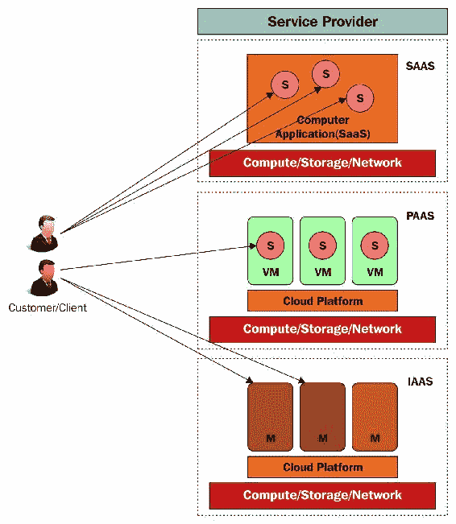
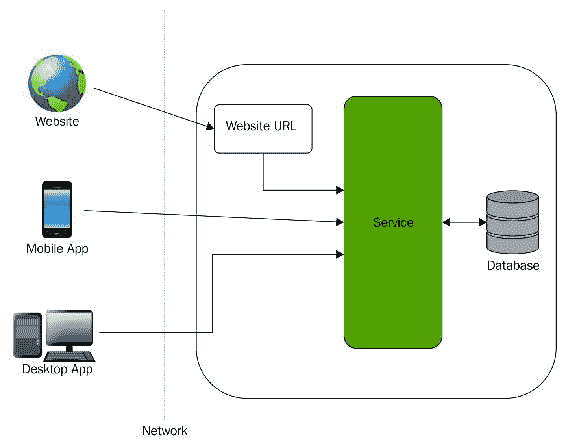
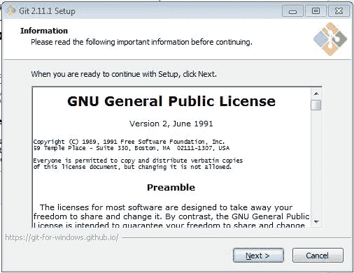
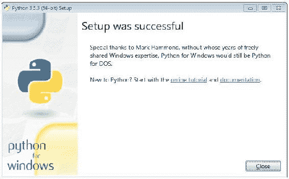
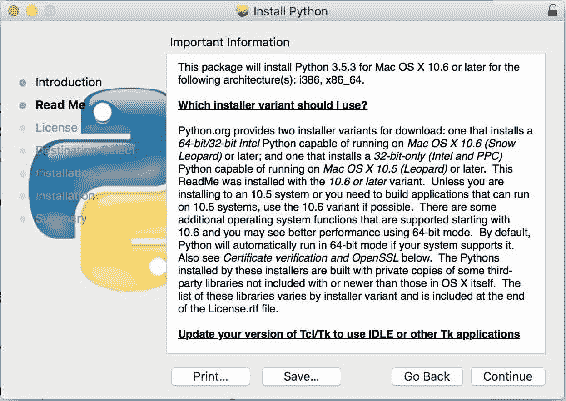
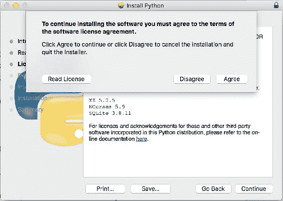
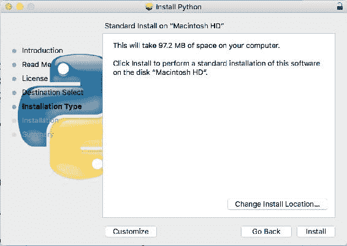

# 介绍云本机架构和微服务

我们走！在开始构建应用程序之前，我们需要找到以下一些问题的答案：

*   什么是云计算？它有什么不同的类型？
*   什么是微服务及其概念？
*   什么是好去的基本要求？

在本章中，我们将重点介绍开发人员或应用程序程序员在开始编写应用程序之前应该理解的不同概念。

让我们首先了解一下系统构建以及它是如何发展的。

很长一段时间以来，我们一直在发现构建框架的更好方法。随着新技术的进步和更好方法的采用，IT 框架对于客户（或客户）来说变得更加可靠和有效，并使工程师感到高兴。

持续交付有助于我们将软件开发周期转移到生产环境中，让我们能够识别软件的不同易出错视角，并坚持让我们将每一次代码签入都视为将其发布到生产环境中的合适候选者。

我们对网络功能的理解促使我们发展更好的方法，让机器与其他机器进行对话。虚拟化平台允许我们自由地安排和调整我们的机器，基础计算机化给我们一种处理这些机器的方法。一些大型、高效的云平台，如亚马逊、Azure 和谷歌，已经接受了小团体拥有其服务全生命周期的观点。诸如**领域驱动设计**（**DDD**）、**连续交付**（**CD**）、随需应变虚拟化、基础设施机器人化、小型自治组和大规模系统等概念是不同的特点，它们有效、高效地将我们的软件投入生产。现在，微服务已经从这个世界崛起。它不是在现实之前发展或描绘的；它作为一种模式上升，或者，例如，从真正的利用率上升。在这本书中，我将从早期的工作中提取一些线索，以帮助说明如何制造、监督和推进微服务。

许多协会发现，通过掌握细粒度的微服务结构，他们可以快速地传递编程，并掌握更多最新的进展。从根本上说，微服务为我们提供了更大的灵活性来应对和解决各种选择，使我们能够对影响我们每个人的不可避免的变化做出快速反应。

# 云计算简介

在我们开始讨论微服务和云原生概念之前，让我们首先了解云计算是什么。

**云计算**是一个广泛的术语，描述了广泛的管理范围。类似地，与创新方面的其他巨大进步一样，许多商家已经抓住了*云*的表达，并将其用于基本定义之外的项目。由于云是行政管理的广泛积累，协会可以选择在何处、何时以及如何利用云计算。

云计算服务可分为以下几类：

*   **SaaS**：这些是成熟的应用程序，随时可以被最终用户掌握
*   **PaaS**：这些工具和服务的集合，对于希望构建应用程序或快速将其直接托管到生产环境而不关心底层硬件的用户/开发人员非常有用
*   **IaaS**：这是为希望建立自己的商业模式并进行定制的客户而设计的

云计算作为一个堆栈，可以解释如下：

*   云计算通常被称为堆栈，它基本上是一系列广泛的服务，其中每个服务都是在一个通用术语下构建在另一个服务之上的，例如**云**
*   云计算模型被视为不同可配置计算资源（如服务器、数据库和存储）的集合，这些资源相互通信，并且可以在最少的监督下进行配置

下图显示了云计算堆栈组件：



让我们详细了解云计算组件及其用例。

# 软件即服务

以下是描述 SaaS 的要点：

*   **软件即服务**（**SaaS**）为用户提供了访问托管在服务提供商场所的软件的能力，服务提供商通过 web 浏览器在互联网上以服务的形式提供该软件。这些服务基于订阅，也称为按需软件。

*   SaaS 产品公司包括 Google Docs productivity suite、Oracle**CRM**（**客户关系管理**）、Microsoft 及其 Office 365 产品以及 Salesforce CRM 和 QuickBooks。

*   SaaS 可以进一步分类为垂直 SaaS，专注于特定行业（如医疗保健和农业）的需求，或水平 SaaS，专注于软件行业（如人力资源和销售）。

*   SaaS 产品基本上适用于那些希望快速掌握易于使用和理解的现有应用程序的组织，即使对于非技术人员也是如此。根据组织的使用情况和预算，企业可以选择支持计划。此外，您可以从全球任何地方以及任何启用 internet 的设备访问这些 SaaS 应用程序。

# 平台即服务

以下是描述 PaaS 的关键点：

*   在 PaaS 产品中，组织/企业不必担心其内部应用程序的硬件和软件基础设施管理

*   PaaS 的最大好处在于开发团队（本地或远程），他们可以在公共框架上高效地构建、测试和部署应用程序，其中底层硬件和软件由 PaaS 服务提供商管理

*   PaaS 服务提供商提供平台，并围绕平台提供不同的服务

*   PaaS 提供商的例子包括 Amazon Web 服务（AWS Elastic Beanstalk）、Microsoft Azure（Azure 网站）、Google App Engine 和 Oracle（大数据云服务）

# 基础设施即服务

以下是描述 IaaS 的关键点：

*   与 SaaS 产品不同，在 IaaS 中，客户可以获得 IT 资源，如运行应用程序的裸机、用于存储的硬盘和用于网络功能的网线，客户可以根据其业务模式进行定制。

*   在 IaaS 产品中，由于客户可以完全访问其基础架构，因此他们可以根据其应用程序需求扩展其 IT 资源。此外，在 IaaS 产品中，客户必须管理应用程序/资源的安全性，并需要构建灾难恢复模型，以防突然出现故障/崩溃。

*   在 IaaS 中，服务是按需提供的，根据使用情况向客户收费。因此，客户有责任对其资源进行成本分析，这将有助于限制他们超出预算。

*   它允许客户/消费者根据应用程序的需求定制其基础架构，然后拆除基础架构并快速高效地重新创建。

*   基于 IaaS 的服务的定价模型基本上是按需付费的，这意味着您可以按需付费。根据您对资源的使用情况和使用期限向您收费。

*   亚马逊网络服务（提供**亚马逊弹性计算云**（**亚马逊 EC2**）和**亚马逊简单存储服务**（**亚马逊 S3**）是此次云服务的第一站；然而，微软 Azure（虚拟机）、Rackspace（虚拟云服务器）和 Oracle（裸机云服务）等公司也为自己赢得了声誉。

# 云本机概念

Cloud native 正在构建团队、文化和技术，以利用自动化和体系结构来管理复杂性和解锁速度。

云本机概念超越了与之相关的技术。我们需要了解公司、团队和人员是如何成功的，以便了解我们的行业走向。

目前，Facebook 和 Netflix 等公司已经投入了大量资源，致力于云本地技术。即使是现在，小型和更灵活的公司已经意识到这些技术的价值。
根据 cloud native 经过验证的实践的反馈，以下是一些优势：

*   **结果导向和团队满意度**：云计算原生方法展示了将大问题分解为小问题的方法，允许每个团队专注于单个部分。

*   **繁重的工作**：自动化减少了导致操作痛苦的重复性人工任务，减少了停机时间。这将使您的系统更高效，并提供更高效的结果。

*   **可靠而高效的应用程序基础架构**：自动化可以更好地控制不同环境中的部署——无论是开发环境、阶段环境还是生产环境——还可以处理意外事件或故障。楼宇自动化不仅有助于正常部署，而且在发生灾难恢复情况时还可以使部署变得轻松。

*   **对应用程序的洞察**：围绕云本机应用程序构建的工具提供了对应用程序的更多洞察，使其易于调试、故障排除和审计。

*   **高效可靠的安全性**：在每一个应用中，主要关注的是它的安全性，并确保它可以通过认证通过所需的通道访问。云本地方法为开发人员提供了不同的方法来确保应用程序的安全性。

*   **经济高效的系统**：管理和部署应用程序的云方法能够有效利用资源，其中还包括应用程序发布，因此，通过减少资源浪费，使系统具有成本效益。

# 云本机-它的含义以及它的重要性？

Cloud native 是一个宽泛的术语，它使用不同的技术，例如基础设施自动化、开发中间件和支持服务，这些基本上是应用程序交付周期的一部分。云本机方法包括频繁发布的无 bug、稳定的软件，并可根据业务需求扩展应用程序。

使用云本地方法，您将能够以系统的方式实现应用程序构建的目标。

云本机方法比传统的面向虚拟化的编排要好得多，后者需要花费大量精力来构建一个适合开发的环境，然后是一个与软件交付过程截然不同的环境。理想的云本机架构应该具有自动化和合成功能，这些功能可以代表您的利益。这些自动化技术还应该能够跨不同平台管理和部署应用程序，并为您提供结果。

您的云本机架构还应该能够识别一些其他操作因素，例如稳定的日志记录、监控应用程序和基础架构，以确保应用程序已启动并运行。

云本机方法确实帮助开发人员使用 Docker 等工具跨不同平台构建应用程序，Docker 是一种轻量级且易于创建和销毁的工具。

# 云本机运行时

容器是使软件在从一个计算环境移动到另一个计算环境时可靠运行的最佳解决方案。这可能是从一台开发人员机器到将环境投入生产的阶段，也可能是从一台物理机器到私有或公共云中的虚拟机。**Kubernetes**已成为集装箱服务的同义词，并在当今日益流行。

随着云本机框架的兴起和围绕它构建的应用程序的增加，容器编排的属性得到了更多的关注和使用。以下是您需要从容器运行时获得的信息：

*   **管理容器状态和高可用性**：确保维护容器的状态（如创建和销毁），特别是在生产中，因为从业务角度来看，它们非常重要，并且应该能够根据业务需要进行扩展
*   **成本分析与实现**：容器可以根据您的业务预算控制资源管理，并在很大程度上降低成本
*   **隔离环境**：在容器内运行的每个进程都应在该容器内保持隔离
*   **集群间负载平衡**：应用程序流量基本上由一个容器集群处理，应该在容器内平均重定向，这将增加应用程序响应并保持高可用性
*   **调试和灾难恢复**：因为我们在这里处理的是生产系统，所以我们需要确保我们有合适的工具来监控应用程序的运行状况，并采取必要的措施来避免停机并提供高可用性

# 云本地架构

云本地架构类似于我们为遗留系统创建的任何应用架构，但是在云本地应用架构中，我们应该考虑一些特性，例如十二因素应用（用于应用程序开发的模式集合）、微服务。（将单一业务系统分解为独立的可部署服务）、自助式敏捷基础设施（自助式平台）、基于 API 的协作（通过 API 在服务之间进行交互）和抗敏捷性（自我实现和增强应用程序）。

首先，让我们讨论一下微服务到底是什么？

微服务是一个更广泛的术语，它将大型应用程序分解为更小的模块，以使它们得到开发，并使它们足够成熟，可以发布。这种方法不仅有助于有效地管理每个模块，而且还可以在较低级别本身识别问题。以下是微服务的一些关键方面：

*   **用户友好界面**：微服务实现了微服务之间的清晰分离。微服务的版本控制实现了对 API 的更多控制，也为这些服务的消费者和生产者提供了更多的自由。
*   **跨平台部署和管理 API**：由于每个微服务都是一个独立的实体，因此可以在不更改其他微服务的情况下更新单个微服务。此外，更容易回滚微服务的更改。这意味着为微服务部署的构件应该在 API 和数据模式方面兼容。这些 API 必须在不同的平台上进行测试，测试结果应该在不同的团队（即运营团队、开发人员等）之间共享，以维护集中控制系统。
*   **应用的灵活性**：开发的微服务应该能够处理请求，并且无论请求的类型如何（可能是错误输入或无效请求），都必须做出响应。此外，您的微服务应该能够处理意外的加载请求并做出适当的响应。所有这些微服务都应该独立测试，也应该集成测试。
*   **微服务的分布**：最好将服务分成小块服务，以便单独跟踪和开发，并组合成一个微服务。这种技术使微服务开发在方式上更加高效和稳定。

下图显示了云本机应用程序的高级体系结构：


理想情况下，应用程序体系结构应该从两个或三个服务开始，尝试用更多的版本扩展它。理解应用程序体系结构是非常重要的，因为它可能需要与系统的不同组件集成，并且当涉及到大型组织时，可能需要一个单独的团队来管理这些组件。微服务中的版本控制非常重要，因为它在指定的开发阶段确定了受支持的方法。

# 微服务是一个新概念吗？

微服务在业界已经有很长一段时间了。这是在大型系统的不同组件之间建立区别的另一种方法。微服务以类似的方式工作，它们充当不同服务之间的链接，并根据请求类型处理特定事务的数据流。

下图描述了微服务的体系结构：



# 为什么 Python 是云本机微服务开发的最佳选择？

为什么我要选择 Python，并向尽可能多的人推荐它？好吧，这可以归结为在接下来的小节中解释的原因。

# 可读性

Python 具有高度的表达能力，是一种易于学习的编程语言。即使是业余爱好者也可以很容易地发现 Python 的不同功能和范围。与其他编程语言（如 Java）不同，Java 更关注括号、方括号、逗号和冒号，Python 让您在编程上花更多的时间，而在调试语法上花更少的时间。

# 图书馆与社区

Python 广泛的库在不同的平台（如 Unix、Windows 或 OS X）上非常可移植。这些库可以根据应用程序/程序的要求轻松扩展。有一个庞大的社区致力于构建这些库，这使得它最适合业务用例。

就 Python 社区而言，**Python 用户组**（**PUG**）是一个致力于基于社区的开发模式的社区，以提高 Python 在全球的普及度。这些小组成员讨论了基于 Python 的框架，这些框架帮助我们构建大型系统。

# 交互模式

Python 交互模式帮助您调试和测试代码片段，稍后可以将其作为主程序的一部分添加。

# 可伸缩

Python 提供了更好的结构和概念（如模块），以便以比任何其他脚本语言（如 shell 脚本）更系统的方式维护大型程序。

# 理解十二要素应用程序

云本机应用程序符合一项协议，该协议旨在通过可预测的实践增强通用性。此应用程序维护一个称为**十二因素**应用程序的声明。它概述了开发人员在构建现代基于 web 的应用程序时应遵循的方法。开发人员必须改变他们的编码方式，在开发人员和他们的应用程序所运行的基础设施之间建立新的契约。

下面是开发云本地应用程序时要考虑的几个要点：

*   使用信息丰富的设计，以最少的时间和成本提高应用程序的使用率

*   跨不同环境（如舞台和生产环境）和不同平台（如 Unix 或 Windows）使用应用程序可移植性

*   使用云平台上的应用程序适用性，了解资源分配和管理

*   使用相同的环境，通过连续交付/部署减少 bug，以实现软件发布的最大灵活性

*   通过以最少的监控扩展应用程序并设计灾难恢复体系结构来实现高可用性

十二个因素中有许多相互作用。他们通过强调声明性配置来关注速度、安全性和规模。12 因素应用程序可描述如下：

*   **集中代码库**：在版本控制中跟踪部署的每一个代码，应该在多个平台上部署多个实例。

*   **依赖关系管理**：应用程序应该能够声明依赖关系，并使用 Bundler、pip 和 Maven 等工具将其隔离。

*   **定义配置**：在不同部署环境（如开发、阶段和生产）中可能不同的配置（即环境变量）应该在操作系统级别定义。

*   **支持服务**：每个资源都被视为应用程序本身的一部分。数据库和消息队列等支持服务应被视为附加资源，并在所有环境中平等使用。

*   **构建、发布和运行周期中的隔离**：这涉及到构建工件之间的严格分离，然后与配置组合，然后从工件和配置组合中启动一个或多个实例。

*   **无状态进程**：应用程序应该执行一个或多个不共享任何内容的实例/进程（例如，主进程/工作进程）。

*   **服务端口绑定**：应用程序应该是自包含的，如果需要公开任何/所有服务，那么应该通过端口绑定（最好是 HTTP）完成。

*   **扩展无状态流程**：架构应该强调底层平台中的无状态流程管理，而不是对应用程序实现更复杂的功能。

*   **流程状态管理**：流程应快速扩展，并在短时间内正常关闭。这些方面支持快速扩展、部署更改和灾难恢复。

*   **持续交付/部署到生产**：始终尝试保持不同环境的相似性，无论是开发环境、阶段环境还是生产环境。这将确保您在多个环境中获得相似的结果，并支持从开发到生产的连续交付。

*   **将日志记录为事件流**：无论是平台级还是应用程序级，日志记录都非常重要，因为这有助于了解应用程序的活动。使不同的可部署环境（最好是生产环境）能够通过集中式服务收集、聚合、索引和分析事件。

*   **作为开-关流程的临时任务**：在云本地方法中，作为发布的一部分运行的管理任务（例如，数据库迁移）应作为一次性流程运行到环境中，而不是常规应用程序中的长时间运行流程。

云应用程序平台（如 CloudFoundry、Heroku 和 Amazon Beanstalk）针对部署十二要素应用程序进行了优化。

考虑到所有这些标准，并将应用程序与稳定的工程接口（即处理无状态概要设计）集成在一起，可以使分布式应用程序做好云准备。Python 以其顽固的传统而非设置的方式处理 web 改进，彻底改变了应用程序系统。

# 设置 Python 环境

正如我们将在本书中演示的那样，拥有正确的环境（本地环境或自动构建环境）对于任何开发项目的成功都至关重要。如果一个工作站有正确的工具，并且设置正确，在该工作站上开发就像呼吸新鲜空气一样。相反，一个设置糟糕的环境可能会让任何试图使用它的开发人员窒息。

以下是我们在本书后面部分要求的先决条件：

*   需要为源代码管理创建 GitHub 帐户。请使用以下链接上的文章来执行此操作：

[https://medium.com/appliedcode/setup-github-account-9a5ec918bcc1](https://medium.com/appliedcode/setup-github-account-9a5ec918bcc1)

*   应用程序部署需要 AWS 和 Azure 帐户。使用以下链接中提供的文章创建以下内容：
    *   AWS:[https://medium.com/appliedcode/setup-aws-account-1727ce89353e](https://medium.com/appliedcode/setup-aws-account-1727ce89353e.)
    *   天蓝：[https://medium.com/appliedcode/setup-microsoft-azure-account-cbd635ebf14b](https://medium.com/appliedcode/setup-microsoft-azure-account-cbd635ebf14b)

现在，让我们设置一些在开发项目期间需要的工具。

# 安装 Git

吉特（[https://git-scm.com](https://git-scm.com) 是一个免费、开源的分布式版本控制系统，设计用于处理从小型到大型项目的所有事情，速度和效率都很高。

# 在基于 Debian 的 Linux 发行版（如 Ubuntu）上安装 Git

有几种方法可以在 Debian 系统上安装 Git：

1.  使用**高级包工具**（**APT**包管理工具：

您可以使用 APT 包管理工具更新本地包索引。然后，您可以作为 root 用户使用以下命令下载并安装最新的 Git：

```py
      $ apt-get update -y
      $ apt-get install git -y  

```

前面的命令将在您的系统上下载并安装 Git。

2.  使用源代码，您可以执行以下操作：
    1.  从 GitHub 存储库下载源代码，并从源代码编译软件。

在开始之前，让我们先安装 Git 的依赖项；以 root 用户身份执行以下命令：

```py
      $ apt-get update -y 
      $ apt-get install build-essential libssl-dev
      libcurl4-gnutls-dev libexpat1-dev gettext unzip -y   

```

2.在安装了必要的依赖项之后，让我们转到 Git 项目存储库（[https://github.com/git/git](https://github.com/git/git) ）下载源代码，如下：

```py
      $ wget https://github.com/git/git/archive/v1.9.1.zip -Ogit.zip  

```

3.现在，使用以下命令解压缩下载的 ZIP 文件：

```py
      $ unzip git.zip
      $ cd git-*  

```

4.现在，您必须制作软件包并以 sudo 用户的身份安装它。为此，请使用下面给出的命令：

```py
      $ make prefix=/usr/local all
      $ make prefix=/usr/local install

```

前面的命令将在您的系统上的`/usr/local`安装 Git。

# 在基于 Debian 的发行版上设置 Git

现在我们已经在系统上安装了 Git，我们需要设置一些配置，以便为您生成的提交消息包含正确的信息。

基本上，我们需要在配置中提供名称和电子邮件。让我们使用以下命令添加这些值：

```py
$ git config --global user.name "Manish Sethi"
$ git config --global user.email manish@sethis.in  

```

# 在 Windows 上安装 Git

让我们在 Windows 上安装 Git；您可以从官网（[下载最新版本的 Githttps://git-scm.com/download/win](https://git-scm.com/download/win) ）。按照下面列出的步骤在 Windows 系统上安装 Git：

1.  下载`.exe`文件后，双击它以运行它。首先，您将获得 GNU 许可证，如本屏幕截图所示：



单击下一步：


在前面的屏幕截图所示的部分中，您将根据需要的工具自定义设置，或者您可以将其保留为默认设置，从本书的角度来看，这是可以的。

2.  此外，您可以将 Git Bash 与 Git 一起安装；单击下一步：


3.  在下一个屏幕截图中看到的部分中，您可以启用 Git 包附带的其他功能。然后，单击下一步：


4.  您可以通过单击“下一步”跳过其余步骤，然后转到安装部分。

完成安装后，您将能够看到如下屏幕：


伟大的我们已经成功地在 Windows 上安装了 Git！！

# 使用巧克力

这是我在 Windows10 上安装 Git for Windows 的首选方法。它安装与以前相同的软件包，但在一行中。如果你还没有听说过巧克力，停止一切，去学更多。只需一个命令即可安装软件；你不必再使用点击式安装程序了！

巧克力是非常强大的，我使用它与**Boxstarter**组合来设置我的开发机器。如果您负责在 Windows 上为开发人员设置计算机，那么它绝对值得一看。

让我们看看如何使用 Chocolate 安装 Git。我想你已经安装了巧克力（[https://chocolatey.org/install](https://chocolatey.org/install) ）已经（在命令提示符中是一行）。然后，只需打开`Administrator Command`窗口，键入以下命令：

```py
$ choco install git -params '"/GitAndUnixToolsOnPath"'  

```

这将安装 Git 和`BASH`工具，并将它们添加到您的路径中。

# 在 Mac 上安装 Git

在开始 Git 安装之前，我们需要安装 OSX 的命令行工具。

# 安装用于 OS X 的命令行工具

为了安装任何开发人员，您需要安装 Xcode（[https://developer.apple.com/xcode/](https://developer.apple.com/xcode/) ），这是一个接近 4GB 的开发套件。苹果从 Mac 应用商店免费提供。为了安装 Git 和 GitHub 安装程序，您需要某些命令行工具，它们是 Xcode 开发工具的一部分。

如果您有足够的空间，请下载并安装 Xcode，它基本上是一个完整的开发工具包。

您需要在[developer.Apple.com](http://developer.apple.com)上创建一个 Apple 开发者帐户，以便下载命令行工具。设置帐户后，可以根据版本选择命令行工具或 Xcode，如下所示：

*   如果您使用的是 OS X 10.7.X，请下载 10.7 命令行工具。如果您使用的是 OS X 10.8.X，请下载 10.8 命令行工具。
*   下载完成后，打开`DMG`文件，按照说明进行安装。

# 安装 Git for OS X

在 Mac 上安装 Git 与在 Windows 上安装 Git 非常相似。我们没有使用`.exe`文件，而是使用`dmg`文件，您可以从 Git 网站（`https://git-scm.com/download/mac`下载安装，如下所示：

1.  双击下载的`dmg`文件。它将打开包含以下文件的查找程序：


2.  双击包（即`git-2.10.1-intel-universal-mavericks.dmg`文件）；它将打开安装向导进行安装，如以下屏幕截图所示：


3.  单击 Install 开始安装：


4.  安装完成后，您将看到如下内容：


If you are using OS X 10.8 and haven't already modified your security settings to allow the installation of third-party applications, you'll need to make that adjustment before OS X lets you install these tools.

# 安装和配置 Python

现在，让我们安装 Python，我们将使用它来构建我们的微服务。在本书中，我们将使用 Python3.x 版本。

# 在基于 Debian 的发行版（如 Ubuntu）上安装 Python

在基于 Debian 的发行版上安装 Python 有不同的方法。

# 使用 APT 包管理工具

您可以使用 APT 包管理工具更新本地包索引。然后，您可以作为 root 用户使用以下命令下载并安装最新的 Python：

```py
$ apt-get update -y
$ apt-get install python3 -y  

```

将自动下载并安装以下软件包，因为这些是 Python 3 安装的先决条件：

`libpython3-dev libpython3.4 libpython3.4-dev python3-chardet`

`python3-colorama python3-dev python3-distlib python3-html5lib`

`python3-requests python3-six python3-urllib3 python3-wheel python3.4-de`

先决条件安装完成后，它将下载 Python 并将其安装到您的系统上。

# 使用源代码

您可以从 GitHub 存储库下载源代码，并从源代码处编译软件，如下所示：

1.  在开始之前，让我们先安装 Git 的依赖项；以 root 用户身份执行以下命令：

```py
      $ apt-get update -y 
      $ apt-get install build-essential checkinstall libreadline-gplv2-
         dev libncursesw5-dev libssl-dev libsqlite3-dev tk-dev libgdbm-
         dev libc6-dev libbz2-dev -y   

```

2.  现在，让我们下载 Python（[https://www.python.org](https://www.python.org) ）使用 Python 官方网站上的以下命令。您还可以下载指定的最新版本：

```py
      $ cd /usr/local
      $ wget https://www.python.org/ftp/python/3.4.6/Python-3.4.6.tgz  

```

3.  现在，让我们使用以下命令解压缩下载的包：

```py
      $ tar xzf Python-3.4.6.tgz  

```

4.  现在我们必须编译源代码。使用以下命令集执行此操作：

```py
      $ cd python-3.4.6
      $ sudo ./configure
      $ sudo make altinstall  

```

5.  前面的命令将在您的系统上的`/usr/local`安装 Python。使用以下命令检查 Python 版本：

```py
      $ python3 -V 
        Python 3.4.6

```

# 在 Windows 上安装 Python

现在，让我们看看如何在 Windows7 或更高版本的系统上安装 Python。在 Windows 上安装 Python 非常简单和快速；我们将使用 Python 3 及以上版本，您可以从 Python 的下载页面（[下载 https://www.python.org/downloads/windows/](https://www.python.org/downloads/windows/) ）。现在执行以下步骤：

1.  根据您的系统配置下载 Windows x86-64 可执行安装程序，然后打开它开始安装，如以下屏幕截图所示：


2.  接下来，选择要进行的安装类型。我们将单击 Install Now 进行默认安装，如本屏幕截图所示：


3.  安装完成后，您将看到以下屏幕：



伟大的我们已经成功地在 Windows 上安装了 Python。

# 在 Mac 上安装 Python

在开始 Python 安装之前，我们需要安装 OSX 的命令行工具。如果您在 Git 安装时已经安装了命令行工具，则可以忽略此步骤。

# 安装用于 OS X 的命令行工具

为了安装任何开发人员，您需要安装 Xcode（[https://developer.apple.com/xcode/](https://developer.apple.com/xcode/) ；您需要在`connect.apple.com`上设置一个帐户来下载相应的 Xcode 版本工具。

但是，还有另一种方法可以使用实用程序安装命令行工具，该实用程序附带一个名为`xcode-select`的 Xcode，如下所示：

```py
% xcode-select --install  

```

前面的命令应触发命令行工具的安装向导。按照安装向导进行操作，您将能够成功安装它。

# 安装 Python for OS X

在 Mac 上安装 Python 与在 Windows 上安装 Git 非常相似。您可以从官网（[下载 Python 包 https://www.python.org/downloads/](https://www.python.org/downloads/) ）。继续执行以下步骤：

1.  下载 Python 包后，双击它开始安装；它将显示以下弹出窗口：


2.  下一步将介绍发行说明和相应的 Python 版本信息：



3.  接下来，您需要同意许可证，该许可证是安装所必需的：



4.  接下来，它将向您显示与安装相关的信息，例如占用的磁盘和路径。单击“安装”开始：



5.  Once the installation is complete, you will see the following screen:

    

6.  使用以下命令查看是否安装了 Python 版本：

```py
      % python3 -V  
        Python 3.5.3 

```

伟大的 Python 已成功安装。

# 熟悉 GitHub 和 Git 命令

在本节中，我们将浏览 Git 命令列表，在本书中我们将经常使用这些命令：

*   **git init**：当您第一次设置本地存储库时，此命令会初始化它一次
*   **git remote add origin<server>**：此命令将本地<indexentry content=“git command:git remote add origin”dbid=“164250”state=“mod”>目录链接到远程服务器存储库，以便所有推送的更改都保存在远程存储库中
*   **git status**：该命令列出了需要添加、修改和提交的文件/目录
*   **git add*或 git add<filename>**：此命令添加文件/目录，以便`<indexentry content="Git command:git add * or git add " dbid="164250" state="mod">`可以跟踪，并准备提交
*   **git commit-m“commit message”**：此命令帮助您在本地机器中提交跟踪更改，并生成提交 ID，通过该 ID 可以识别更新的代码
*   **git commit-am“commit message”**：上一个命令与此命令的唯一区别在于，在将所有文件添加到 stage 之后，这将打开一个默认编辑器，以添加基于操作系统（如 Ubuntu（Vim）或 Windows（Notepad++）的提交消息
*   **git push origin master**：此命令将最后提交的代码从本地目录推送到远程存储库

测试一切以确保我们的环境正常工作。

我们开始吧。在最后一节中，我们安装了 Git 和 Python，这是构建微服务的开始。在本节中，我们将重点测试已安装的软件包，并尝试熟悉它们。

我们可以做的第一件事是使用 Git 命令，它通过 HTTPs 从存储库（通常是 GitHub）获取外部 Python 代码，并将其复制到相应目录中的当前工作区：

```py
$ git clone https://github.com/PacktPublishing/Cloud-Native-
 Python.git

```

前面的命令将在您的本地机器上创建一个名为`Cloud-Native-Python`的目录；从当前位置**切换到`Cloud-Native-Python/chapter1`路径。**

我们需要安装运行它所需的应用程序的要求。在这种情况下，我们只需要烧瓶模块可用：

```py
$ cd hello.py
$ pip install requirements.txt

```

在这里，Flask 充当 web 服务器；我们将在下一章详细了解它。

成功安装后，您可以使用以下命令运行该应用程序：

```py
$ python hello.py
* Running on http://0.0.0.0:5000/ (Press CTRL+C to quit)  

```

我认为我们很高兴看到输出，如下所示：

```py
$ curl http://0.0.0.0:5000/
Hello World!  

```

如果您看到这个输出，那么我们的 Python 开发环境设置正确。

现在是时候写一些 Python 代码了！

# 总结

在本章中，我们从探索云平台和云计算堆栈开始。在本章中，您了解了不同的十二要素应用程序方法是什么，以及它们如何帮助开发微服务。最后，您需要了解开发人员机器应该创建或开始创建应用程序的理想设置环境。

在下一章中，我们将通过创建后端 RESTAPI，并使用 API 调用或使用 Python 框架进行测试来开始构建我们的微服务。