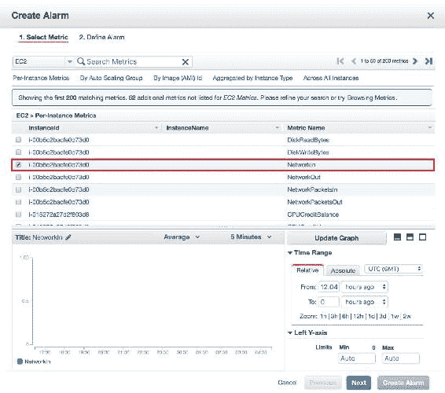
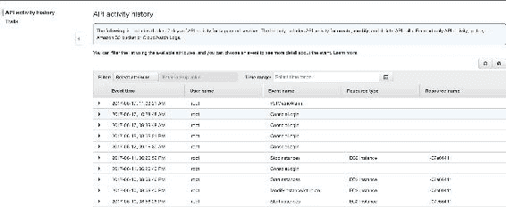
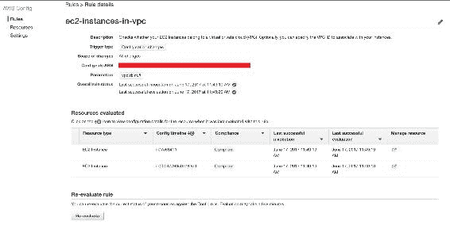
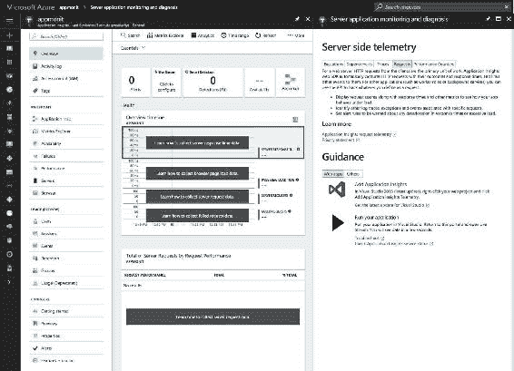
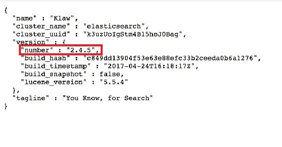
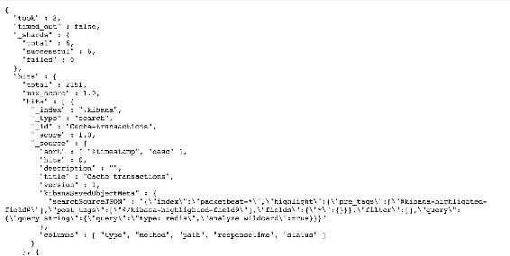

# 监视云应用程序

在前面的章节中，我们讨论了云本机应用程序开发和部署到云平台中，以便客户使用更高的可用性。我们的工作还没有完成。基础架构和应用程序管理是一个单独的字段或流，用于监控基础架构以及应用程序的性能，使用工具实现最小或零停机时间。在本章中，我们将讨论一些可以帮助您实现这一目标的工具。

本章将涵盖以下主题：

*   AWS 服务，如 CloudWatch、Config 等
*   Azure 服务，如应用程序洞察、日志分析等
*   用于日志分析的麋鹿堆栈简介
*   开源监控工具，如 Prometheus 等

# 云平台上的监控

到目前为止，我们已经讨论了如何开发应用程序并跨不同平台进行部署，以便使其对客户业务模型有用。然而，即使在您开发了应用程序之后，您也需要具有专业知识的人员，他们将使用工具在平台上管理您的应用程序，平台可以是公共云或内部部署。

在本节中，我们将主要讨论公共云提供商提供的工具或服务，使用这些工具或服务来管理我们的基础设施，以及关注应用程序洞察，即性能。

在讨论工具之前，下面是在任何应用程序的基础设施分配时要考虑的几个要点：

*   根据一组特定的请求定期执行负载测试是一种很好的做法。这将帮助您判断应用程序的初始资源需求。我们可以提到的几个工具是蝗虫（[http://locust.io/](http://locust.io/) 和 JMeter（[https://jmeter.apache.org/](https://jmeter.apache.org/) ）。
*   建议以最少的配置分配资源，并使用与自动缩放相关的工具，这些工具根据应用程序使用情况管理资源。
*   在资源分配方面，应尽量减少人工干预。

考虑前面所有的要点。因为有必要确保有一个监控机制来跟踪资源分配和应用程序性能。让我们讨论一下云平台提供的服务。

# 基于 AWS 的服务

以下是**AWS**（**亚马逊网络服务**提供的服务及其在应用程序和基础设施监控环境中的使用情况。

# 云表

此 AWS 服务跟踪 AWS 资源的使用情况，并根据定义的报警配置向您发送通知。可以跟踪 AWS 计费、路由 53、ELB 等资源。以下屏幕截图显示了其中一个触发的报警：


最初，我们必须在[设置 CloudWatch 警报 https://console.aws.amazon.com/cloudwatch/home?region=us-east-1#报警：报警过滤器=任何](https://console.aws.amazon.com/cloudwatch/home?region=us-east-1#alarm:alarmFilter=ANY)。

您应该会看到以下屏幕，在该屏幕上，您需要单击“创建报警”按钮，根据某些指标创建自己的报警：


现在，单击创建报警按钮。您将看到一个弹出向导，询问需要监控的指标：


前面的屏幕截图列出了所有可用的指标，这些指标可以被监控，并且可以设置报警。

在下面的屏幕中，我们需要检查 EC2 指标。根据您的要求，您可以选择任何指标，例如，我们将选择 NetworkIn 指标并单击下一步：



在下一个屏幕上，我们需要提供报警名称和描述，以及报警预览。此外，我们需要提供触发警报的条件。

此外，我们需要设置服务通知服务，其中通知需要以电子邮件的形式发送：


添加详细信息后，单击“创建报警”按钮设置报警。

现在，每当 NetworkIn 指标达到其阈值时，它将通过电子邮件发送通知。

同样，我们可以设置不同的指标来监控资源利用率。

创建报警的另一种方法是选择资源监控部分的创建报警按钮，如以下屏幕截图所示：


我们可以查阅 AWS 文件（[https://aws.amazon.com/documentation/cloudwatch/](https://aws.amazon.com/documentation/cloudwatch/) 了解更多信息。

# 云迹

这是最重要的 AWS 云服务之一，默认情况下，它会跟踪 AWS 帐户上的任何活动，无论是通过控制台还是编程。我们不需要在此服务中配置任何内容。如果您的帐户被破坏，或者我们需要检查资源操作，等等，这是必需的。

以下屏幕截图将显示与该帐户相关的两项活动：



有关更多信息，您可以查阅 AWS 文档（[https://aws.amazon.com/documentation/cloudtrail/](https://aws.amazon.com/documentation/cloudtrail/) ）。

# AWS 配置服务

这是另一个 AWS 服务，我们可以在其中根据定义的模板规则检查 AWS 资源的配置。

Note that this service will need a service role created to access the AWS resources.

在这个服务中，我们只需要根据提供的模板设置规则。AWS 或客户模板用于对作为应用程序部署一部分创建的资源进行检查。要向服务配置中添加新规则，请转至[https://console.aws.amazon.com/config/home?region=us-east-1#/规则/视图](https://console.aws.amazon.com/config/home?region=us-east-1#/rules/view)：


在前面的屏幕中，我们需要添加一个新规则，该规则将评估所有资源或您指定的资源。单击添加规则以添加新规则，如下所示：


在前面的屏幕截图中，选择规则以根据需要跟踪的资源打开资源监控配置。


前面的屏幕截图是针对 vpc 模板配置中的 AWS ec2 实例的，它将帮助您验证 ec2 是否位于具有正确配置的 vpc 中。在这里，您可以指定需要评估的 VPC。

单击保存以添加新规则。评估后，我们将看到以下屏幕：


以下资源报告如下所示：



您可以浏览 AWS 文档（[https://aws.amazon.com/documentation/config/](https://aws.amazon.com/documentation/config/) 了解更多信息。

# Microsoft Azure 服务

以下是 Microsoft Azure 提供的服务，可帮助您管理应用程序性能。

# 应用见解

此服务由 Azure 提供，可帮助您管理应用程序性能，这对 web 开发人员非常有用，可帮助他们检测、分类和诊断应用程序问题。

为了设置 Application Insights，您只需要知道基础架构所在的应用程序和组名。现在，如果单击左窗格上的+符号，您将看到类似于以下屏幕截图的屏幕：


在这里，我们可以选择 Application Insights service，在这里我们需要提供 Application Insights 名称、需要监视的组名称以及需要启动它的区域。

一旦启动，您将看到以下屏幕，其中将显示如何使用 Application Insights 配置资源。以下是所描述的一些指标：



浏览[处的完整参考文件 https://docs.microsoft.com/en-us/azure/application-insights/app-insights-profiler](https://docs.microsoft.com/en-us/azure/application-insights/app-insights-profiler) ，其中将包含有关如何使用资源配置应用程序洞察的完整信息。

现在，出现的问题是 Application Insights 监视哪些度量。以下是一些描述的指标：

*   **请求率**、**响应时间**、**和失败率**：这让您了解请求类型及其响应时间，有助于资源管理
*   **Ajax 调用**：这将跟踪网页的速率、响应时间和失败率。
*   ***用户和会话详细信息**：跟踪用户和会话信息，如用户名、登录名、注销详细信息等
*   **性能管理**：跟踪 CPU、网络和 RAM 的详细信息
*   **主机诊断**：计算 Azure 的资源
*   **异常**：这可以让您了解报告的服务器和浏览器异常

您可以为您的系统配置许多指标。欲了解更多信息，请查看[https://docs.microsoft.com/en-us/azure/application-insights/app-insights-metrics-explorer](https://docs.microsoft.com/en-us/azure/application-insights/app-insights-metrics-explorer) 。

您可以浏览 Azure 文档（[https://docs.microsoft.com/en-us/azure/application-insights/](https://docs.microsoft.com/en-us/azure/application-insights/) 了解更多与应用相关的信息。

到目前为止，我们一直在验证和监控云平台上的应用程序及其基础设施。然而，出现的一个非常重要的问题是：如果存在应用程序问题，我们必须对其进行故障排除，该怎么办？下一节是关于 ELK 堆栈的，它将帮助您确定问题，可能是系统级的，也可能是应用程序级的。

# 麋鹿堆简介

麋鹿群由 Elasticsearch、Logstash 和 Kibana 组成。所有这些组件协同工作以收集所有类型的日志，这些日志可以是系统级日志（即 Syslog、RSYSLOG 等）或应用程序级日志（即访问日志、错误日志等）。

对于 ELK 堆栈的设置，您可以遵循本文，其中，Filebeat 配置与 ELK 堆栈一起用于向 Elasticsearch 发送日志：

[https://www.digitalocean.com/community/tutorials/how-to-install-elasticsearch-logstash-and-kibana-elk-stack-on-ubuntu-14-04](https://www.digitalocean.com/community/tutorials/how-to-install-elasticsearch-logstash-and-kibana-elk-stack-on-ubuntu-14-04) 。

# 伐木场

Logstash 需要安装在需要收集日志的服务器上，并发送到 Elasticsearch 以创建索引。

安装 Logstash 后，建议配置您的`logstash.conf`文件，该文件位于`/etc/logstash`，详细信息包括 Logstash 日志的文件旋转（即`/var/log/logstash/*.stdout`、`*.err`或`*.log`）或后缀格式，如数据格式。以下代码块是供您参考的模板：

```py
    # see "man logrotate" for details 

    # number of backlogs to keep 
    rotate 7 

    # create new (empty) log files after rotating old ones 
    create 

    # Define suffix format 
    dateformat -%Y%m%d-%s 

    # use date as a suffix of the rotated file 
    dateext 

   # uncomment this if you want your log files compressed 
   compress 

   # rotate if bigger that size 
   size 100M 

   # rotate logstash logs 
   /var/log/logstash/*.stdout 
   /var/log/logstash/*.err 
   /var/log/logstash/*.log { 
       rotate 7 
       size 100M 
       copytruncate 
       compress 
       delaycompress 
       missingok 
       notifempty 
    } 

```

为了将日志发送到 Elasticsearch，您需要配置中的三个部分，命名为 INPUT、OUTPUT 和 FILTER，这有助于它们创建索引。这些部分可以在单个文件中，也可以在单独的文件中。

Logstash 事件处理管道作为输入-过滤-输出部分工作，每个部分都有自己的优点和用途，其中一些如下：

*   **输入**：从日志文件获取数据需要此事件。一些常见的输入是 file，它使用`tailf`读取 file；Syslog，从侦听端口`514`的 Syslogs 服务读取；beats，它从 Filebeat 收集事件，等等。

*   **过滤器**：Logstash 中的这些中间层设备根据定义的过滤器和满足条件的单独数据对数据执行某些操作。其中一些是 GROK（基于定义的模式构造和解析文本）、clone（通过添加或删除字段复制事件），等等。
*   **输出**：这是我们将过滤后的数据传递到定义输出的最后阶段。我们可以在多个输出位置传递数据以进行进一步索引。一些常用的输出是 Elasticsearch，它非常可靠；一个更简单、方便的平台来保存您的数据，并且更容易在其上查询；还有 graphite，它是一种开源工具，用于以图形的形式存储和显示数据。

以下是 Syslog 的日志配置示例：

*   Syslog 的输入部分编写如下：

```py
   input { 
     file { 
     type => "syslog" 
    path => [ "/var/log/messages" ] 
    } 
   }

```

*   Syslog 的 Filter 部分的编写方式如下：

```py
   filter { 
     grok { 
      match => { "message" => "%{COMBINEDAPACHELOG}" } 
     } 
    date { 
     match => [ "timestamp" , "dd/MMM/yyyy:HH:mm:ss Z" ] 
    } 
  } 

```

*   Syslog 的输出部分编写如下：

```py
   output { 
     elasticsearch { 
       protocol => "http" 
       host => "es.appliedcode.in" 
       port => "443" 
       ssl => "true" 
       ssl_certificate_verification => "false" 
       index => "syslog-%{+YYYY.MM.dd}" 
       flush_size => 100 
      } 
   } 

```

发货日志的配置文件通常存储在`/etc/logstash/confd/`中。

如果要为每个部分制作单独的文件，则需要遵循命名文件的约定；例如，输入文件应命名为`10-syslog-input.conf`，过滤文件应命名为`20-syslog-filter.conf`。同样，对于输出，它将是`30-syslog-output.conf`。

如果要验证配置是否正确，可以执行以下命令：

```py
 $ sudo service logstash configtest

```

有关日志存储配置的更多信息，请参阅[中的文档示例 https://www.elastic.co/guide/en/logstash/current/config-examples.html](https://www.elastic.co/guide/en/logstash/current/config-examples.html) 。

# 弹性搜索

弹性搜索（[https://www.elastic.co/products/elasticsearch](https://www.elastic.co/products/elasticsearch) ）是一个日志分析工具，可根据时间戳配置帮助存储和创建大量数据流的索引，解决开发人员试图识别与其问题相关的日志的问题。Elasticsearch 是一个基于 Lucene 搜索引擎的 NoSQL 数据库。

安装 Elasticsearch 后，您可以通过点击以下 URL 验证版本和集群详细信息： [](http://ip-address) `http://ip-address:9200/`。

输出如下所示：



这证明 Elasticsearch 已启动并正在运行。现在，如果您想查看是否正在创建日志，可以使用以下 URL 查询 Elasticsearch:
`http://ip-address:9200/_search?pretty`。

输出将如以下屏幕截图所示：



要查看已经创建的索引，您可以单击以下 URL:
`http://ip-address:9200/_cat/indices?v`。

输出将类似于以下屏幕截图：


如果您想了解 Elasticsearch 查询、索引操作等更多信息，请阅读本文：
[https://www.elastic.co/guide/en/elasticsearch/reference/current/indices.html](https://www.elastic.co/guide/en/elasticsearch/reference/current/indices.html) 。

# 基巴纳

Kibana 在 Elasticsearch 的顶层工作，它可视化数据，提供对从环境接收到的数据的洞察，并帮助他们做出所需的决策。简而言之，Kibana 是一个 GUI，用于从 Elasticsearch 中搜索日志。

安装 Kibana 后，以下内容应出现在`http://ip-address:5601/`处，要求您创建索引并配置 Kibana 仪表板：


配置后，应出现以下屏幕，以带有时间戳的格式显示日志：


现在，除此之外，我们需要创建仪表盘，让我们可以看到要可视化的日志视图，它将以图形、饼图等形式出现。

有关创建 Kibana 仪表板的更多信息，请查阅 Kibana 文档（[https://www.elastic.co/guide/en/kibana/current/dashboard-getting-started.html](https://www.elastic.co/guide/en/kibana/current/dashboard-getting-started.html) ）。

作为 Kibana 的替代品，你们中的一些人可能对 Grafana 感兴趣（[https://grafana.com/](https://grafana.com/) ），也是一种分析和监控工具。

现在，问题来了：格拉法纳和基巴纳有何不同？以下是答案：

| **格拉法纳** | **基巴纳** |
| Grafana 仪表板关注基于系统指标 CPU 或 RAM 的时间序列图。 | Kibana 专门用于日志分析。 |
| Grafana 内置的 RBA（基于角色的访问）决定了用户对仪表板的访问。 | Kibana 无法控制仪表板的访问。 |
| Grafana 支持 Elasticsearch 以外的不同数据源，如 Graphite、XDB 等。 | Kibana 与 ELK stack 集成在一起，使用起来非常友好。 |

这是关于 ELK 堆栈的，它让我们了解应用程序，并帮助我们解决应用程序和服务器问题。在下一节中，我们将讨论一个名为**Prometheus**的内部开源工具，它用于监视不同服务器的活动。

# 开源监控工具

在本节中，我们将主要讨论由第三方拥有的工具，并收集服务器的指标以解决应用程序问题。

# 普罗米修斯

普罗米修斯（[https://prometheus.io](https://prometheus.io) 是一种开源监控解决方案，它可以跟踪您的系统活动指标，并在您需要采取任何行动时立即向您发出警报。这个工具是用**戈朗**写的。

与 Nagios 等工具类似，该工具也越来越受欢迎。它收集服务器的指标，但它也根据您的需求为您提供模板指标，如`http_request_duration_microseconds`，以便您可以使用 UI 从中生成一个图形，以便更好地理解它并高效地监控它。

Note that, by default, Prometheus runs on the `9090` port.

要安装普罗米修斯，请遵循官方网站（[上提供的说明 https://prometheus.io/docs/introduction/getting_started/](https://prometheus.io/docs/introduction/getting_started/) 。一旦安装完毕，服务启动，试着打开`http://ip-address:9090/status`了解状态。以下屏幕显示普罗米修斯的构建信息，即版本、修订版等：


要知道配置了它的目标，请使用`http://ip-address:9090/targets`。输出如下所示：


要生成图形，请使用`http://ip-address:9090/graph`并选择需要实现图形的度量。输出应类似于以下屏幕截图：


类似地，我们可以请求普罗米修斯确定的几个其他指标，例如主机启动状态。以下屏幕截图显示了特定时间段内的主机状态：


普罗米修斯的一些组件有不同的用途，如下所示：

*   **AlertManager**：此组件将帮助您根据度量设置服务器的警报，并定义其阈值。我们需要在服务器中添加配置以设置警报。检查[上的 AlertManager 文档 https://prometheus.io/docs/alerting/alertmanager/](https://prometheus.io/docs/alerting/alertmanager/) 。
*   **节点导出器**：该导出器对于硬件和操作系统指标非常有用。更多关于不同类型出口商的信息，请访问[https://prometheus.io/docs/instrumenting/exporters/](https://prometheus.io/docs/instrumenting/exporters/) 。
*   **Pushgateway**：该 Pushgateway 允许您运行批处理作业以公开度量。
*   **格拉法纳**：普罗米修斯与格拉法纳集成，帮助仪表盘查询普罗米修斯的指标。

# 总结

这一章在不同方面都很有趣。从 Cloudwatch 和 Application Insights 等工具开始，它们基于云平台，帮助您在云平台上管理应用程序。然后，它转向开源工具，这一直是开发人员的首选，因为他们可以根据自己的需求进行定制。我们研究了麋鹿堆栈，它一直很受欢迎，并且在许多组织中以这样或那样的方式频繁使用。

现在，我们已经结束了本书的这一版本，但希望会有另一个版本，我们将讨论高级应用程序开发，并有更多的测试案例，对 QA 读者也很有用。享受编码！