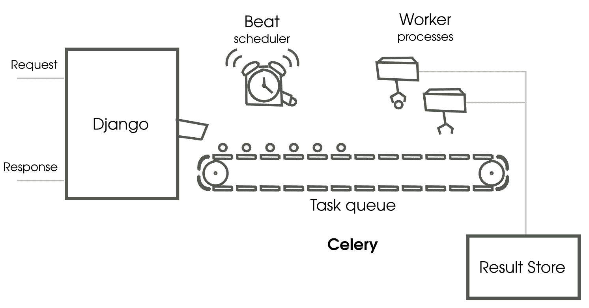
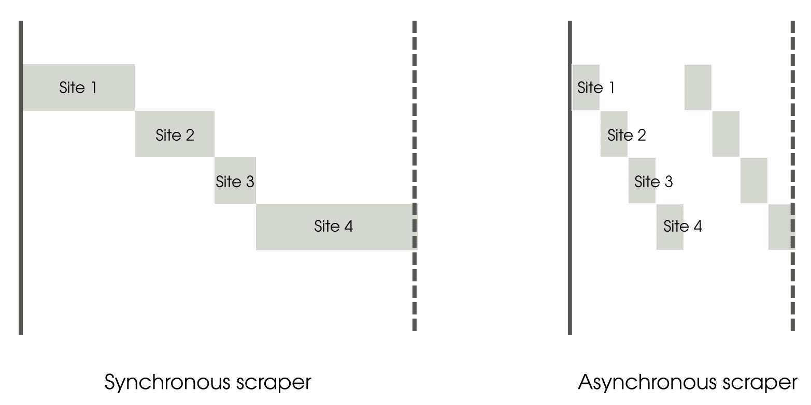

# 异步工作

在本章中，我们将介绍以下主题：

*   需要异步
*   异步模式
*   芹菜
*   理解异步
*   进入通道

在较简单的情况下，web 应用程序过去是一个大型单片 Django 进程，可以处理请求并阻塞，直到生成响应。

在当今的微服务世界中，应用程序由提供专门服务的复杂且通常互锁的流程链组成。Django 可能是应用程序流中的链接之一。正如 Eliyahu Goldratt 所说，“这条链条的强度取决于它最薄弱的一环”。换句话说，Django 的同步特性可能使其成为性能瓶颈。

因此，围绕 Django 构建的各种异步解决方案可以帮助您保持快速响应时间，并满足当今应用程序的异步特性。

# 为什么是异步的？

与大多数基于 WSGI 的 web 框架一样，Django 是同步的。当客户机请求一个 web 页面时，该请求通过一个视图到达 Django，并通过不同的代码行，直到返回呈现的 web 页面。由于该通信等待或阻塞，直到进程执行所有这些代码，因此称为同步通信。

新的 Django 开发人员并不担心创建异步任务，但我注意到，他们的代码最终会积累一些缓慢的阻塞任务，例如图像处理，甚至复杂的数据库查询，这会导致页面加载速度非常慢。理想情况下，它们必须移出请求-响应周期。页面加载时间对用户体验至关重要，必须对其进行优化以避免任何延迟。

这种同步模型的另一个基本问题是处理不是由 web 请求触发的事件。即使一个网站没有任何访问者，它也必须参加各种维护活动。他们可以安排在特定的时间，比如在周五午夜发送时事通讯，或者例行的后台任务，比如扫描上传的文件中的病毒。有些站点可能通过 WebSocket 提供实时更新或推送通知，而 WSGI 模型无法处理这些通知。

一些典型的异步任务类型包括：

*   发送一封或多封电子邮件/短信
*   调用 web 服务
*   慢速 SQL 查询
*   日志记录活动
*   媒体编码或解码
*   解析大量文本
*   刮网
*   发送通讯
*   机器学习任务
*   图像处理

正如您所看到的，每个非常重要的 Django 项目都需要基础设施来管理异步任务。当您切换到异步代码时，您可能会发现您的代码在单个进程中运行的速度要快好几倍（请参阅*了解异步 IO*部分，了解加速的一个显著示例）。这是因为您等待 I/O 任务完成的所有时间现在都可以更好地用于运行其他任务。

# 异步代码的陷阱

异步编程听起来很有吸引力，但很难掌握。

您需要注意以下几个陷阱：

*   **竞态条件**：如果两个或多个代码线程修改相同的数据，它们的执行顺序会影响最终值。这种竞争可能导致数据处于不确定状态。
*   **饥饿**：由于其他线程进入，一个线程无限期等待。
*   **死锁**：如果一个线程正在等待另一个线程已锁定的资源，反之亦然，则两个线程都陷入死锁。
*   **调试挑战**：由于多线程程序的定时不确定，很难在异步代码中重现错误。
*   **顺序保留**：当执行顺序发生变化时，可能无法观察到代码段之间的依赖关系。

在 Python 中，可能不可能完全避免此类陷阱，但我们可以遵循一些最佳实践来消除它们，以达到最实际的目的。它们将在*芹菜最佳实践*一节中介绍。

# 异步模式

让我们看看 web 应用程序中使用的各种通用模式。

# 端点回调模式

在此模式中，当调用方调用服务时，它指定在操作完成时要调用的端点。这类似于在某些编程语言（如 JavaScript）中指定回调。当纯粹用作 HTTP 回调时，它被称为**WebHook**。

过程大致如下：

1.  客户端通过 REST、RPC 或 UDP 等通道调用服务。它还提供自己的端点，以便在结果准备就绪时进行通知。
2.  电话立即返回。
3.  当任务完成时，服务调用定义的端点以通知初始发送者。

请记住，服务提供者或接收者必须能够访问发送者。对于敏感数据，必须有某种形式的身份验证来识别发送者，并进行加密以保护通道免受窃听。

这种模式非常流行，并由各种 web 应用程序实现，如 GitHub、PayPal、Twilio 等。这些提供者通常有一个 API 来管理对这些 Webhook 的订阅，除非您有一个代理来执行这种中介。

# 发布-订阅模式

此模式是端点回调模式的更一般形式。在这里，经纪人充当实际发送者和接收者之间的中介。是的，多个收件人可以订阅一个*主题*，即任何人发布的一个命名的逻辑频道组。

在这种情况下，通信过程如下：

1.  一个或多个侦听器将通知代理进程他们对订阅主题感兴趣
2.  发布者将在相关主题下向代理发布消息
3.  代理将消息发送给所有订阅者

经纪人的优点是在许多意义上完全分离发送者和接收者。此外，代理还可以执行许多其他任务，例如消息充实、转换或过滤。这种模式具有很强的可扩展性，因此在企业中间件中很流行。

芹菜在内部使用发布/订阅机制来进行一些后端传输，例如用于发送消息的 Redis。

# 轮询模式

顾名思义，轮询涉及客户端定期检查服务是否有任何新事件。这通常是异步通信最不理想的方式，因为轮询增加了系统利用率，并且变得难以扩展。然而，这可能是遗留系统中唯一可行的解决方案。

轮询系统的工作原理如下：

1.  客户端调用服务
2.  调用会立即返回新事件或任务状态
3.  客户端定期等待并重复第二步

检索服务状态时可能存在某种程度的同步延迟。在响应到达之前，客户端可能一直处于阻塞状态。因此，它有时被称为**忙等待**。

# Django 的异步解决方案

本章的其余部分将介绍以下与 Django 一起使用的流行异步系统，这些系统的用例略有不同。他们的名单如下：

*   **芹菜**：在 Django 进程之外处理计算的基于工作线程的模型
*   **asyncio**：Python 内置模块，用于在同一线程内并发执行多个任务
*   **Django 通道**：实时消息队列式体系结构，用于管理 WebSocket 等 I/O 事件

让我们首先了解异步运行任务的最流行和最健壮的解决方案：芹菜。

# 芹菜

芹菜是一个功能丰富的异步任务队列管理器。在这里，任务指的是一个可调用的任务，当执行该任务时，它将异步执行该活动。芹菜被包括 Instagram 和 Mozilla 在内的几家知名组织用于生产，用于每天处理数百万项任务。

在安装芹菜时，您需要挑选各种组件，例如代理和结果存储。如果您感到困惑，我建议您先安装 Redis 并跳过结果存储。由于 Redis 在内存中工作，如果您的消息较大且需要持久性，则应改用 RabbitMQ。您可以按照《芹菜用户指南》中的芹菜和[使用芹菜搭配 Django](http://docs.celeryproject.org/en/latest/django/first-steps-with-django.html)主题的[第一步开始。](http://docs.celeryproject.org/en/latest/getting-started/first-steps-with-celery.html)

在 Django 中，芹菜作业通常在相应应用程序目录中名为`tasks.py`的单独文件中提及。

以下是典型的芹菜任务：

```py
# tasks.py 
@shared_task 
def fetch_feed(feed_id): 
    feed_obj = models.Feed.objects.get(id=feed_id) 
    feed_obj.page = retrieve_page(feed_obj.feed_url) 
    feed_obj.retrieved = timezone.now() 
    feed_obj.save() 
```

此任务检索 RSS 提要的内容并将其保存到数据库中。

它看起来像一个普通的 Python 函数（尽管它将由一个类在内部包装），除了`@shared_task`装饰器。这定义了芹菜任务。共享任务可由同一项目中的其他应用程序使用。它通过在每个注册的应用程序中创建任务的独立实例，使任务可重用。

要调用此任务，可以使用`delay()`方法，如下所示：

```py
>>> from tasks import fetch_feed 
>>> fetch_feed.delay(feed_id=some_feed.id)  
```

与普通函数调用不同，在函数返回之前，执行不会跳转到`fetch_feed`或阻塞。相反，它会立即返回一个`AsyncResult`实例。这可用于检查任务的状态和返回值。

为了了解如何以及何时调用它，让我们看看芹菜是如何工作的。

# 芹菜的作用

芹菜由于其分布式体系结构，可能有点难以理解。下面是一个高级图表，显示了典型的 Django 芹菜设置：



典型的 Django 芹菜设置是如何工作的

当请求到达时，您可以在处理它时触发芹菜任务。任务调用会立即返回，而不会阻塞进程。事实上，任务尚未完成执行，但任务消息已进入任务队列（或许多可能的任务队列之一）。

工作进程是独立的进程，用于监视任务队列中的新任务并实际执行它们。它们拾取任务消息并向队列发送确认，以便删除该消息。然后他们执行任务。一旦完成，该过程将重复，并将尝试拾取另一个任务以执行。

工作进程执行缓慢的任务或等待 I/O 时可能会被阻塞，但它不会通过设计影响 Django 进程。任务完成后，可以配置结果存储以持久存储结果。在许多情况下，任务的副作用是必需的，返回的结果被忽略，因此不需要结果存储。

还可以使用芹菜称之为芹菜节拍流程来安排任务周期性运行。您可以将其配置为以特定的时间间隔启动任务，例如每 10 秒或在一周中的某一天开始时启动任务。这对于诸如备份或轮询 web 服务运行状况之类的维护工作非常有用。

芹菜得到了很好的支持，可扩展，并且与 Django 配合使用，但是对于琐碎的异步任务来说，芹菜可能太麻烦了。在这种情况下，我建议使用 Django 通道或 RQ，这是一种更简单的基于 Redis 的任务队列。但是，下一节讨论的最佳实践也可能适用于它们。

# 芹菜最佳实践

您已经了解了芹菜是如何从 Django 承担很多繁重的工作的，但使用芹菜和 Django 有很大的不同，因为它具有丰富的功能集。文档中提到了大量的最佳实践，并在几篇博客文章中分享。

如果您已经熟悉这些概念，并且想要一份快速清单，请查看[上的芹菜任务清单 http://celerytaskschecklist.com/](http://celerytaskschecklist.com/) 。否则，请继续阅读，了解如何充分利用芹菜。

# 处理失败

执行芹菜任务时可能会发生各种异常。在缺乏定义良好的异常处理和重试机制的情况下，它们可能无法被检测到。通常，作业失败是暂时的，例如 API 无响应（这超出了我们的控制范围）或内存不足。在这种情况下，最好等待并重试该任务。

在芹菜中，您可以选择自动重试或手动重试。芹菜可以很容易地微调其自动重试机制。在以下示例中，我们指定了多个重试参数：

```py
@shared_task(autoretry_for=(GatewayError,), 
             retry_backoff=60, 
             retry_kwargs={'max_retries': 5}, 
             retry_jitter=True) 
def fetch_feed(feed_id): 
    ... 
```

`autoretry_for`参数列出芹菜应自动重试的所有异常。在这种情况下，它只是`GatewayError`例外。您也可以在这里提到异常基类来`autoretry_for`所有异常。

`retry_backoff`参数指定第一次重试之前的初始等待时间，即 60 秒。每次重试失败，等待时间都会加倍，因此等待时间会变为 120、240 和 360 秒，直到达到最大重试限制`5`。

这种等待重试时间越来越长的技术称为**指数退避**。这非常适合与外部服务器进行交互，因为在服务器过载的情况下，我们会给它足够的时间进行恢复。

增加了随机抖动，避免了**雷鸣群**的问题。如果大量任务具有相同的重试模式，并且同时请求资源，则可能会导致资源无法使用。

因此，将随机数添加到等待周期中，以便不会发生此类碰撞。

以下是在发生异常时手动重试的示例：

```py
@shared_task(bind=True) 
def fetch_feed(self, feed_id): 
    ... 
    try: 
        ... 
    except (GatewayError) as exc: 
        raise self.retry(exc=exc) 
```

注意任务装饰器的`bind`参数和任务的新`self`参数，这将是任务实例。如果发生异常，您可以调用`self.retry`方法尝试手动重试。`exc`参数用于传递可在日志中使用的异常信息。

最后但并非最不重要的一点是，确保记录所有异常。您可以使用标准 Python 日志模块或`print`函数（将重定向到日志）来完成此操作。使用诸如 Sentry 之类的工具来跟踪和自动化错误处理。

# 幂等任务

正如我们所看到的，芹菜任务可能会重新启动几次，尤其是在启用了延迟确认的情况下。这使得控制任务的副作用变得非常重要。因此，芹菜建议所有任务都应该是*幂等元*。幂等性是函数的一个数学属性，它确保如果使用相同的参数调用它，无论调用多少次，它都将返回相同的结果。

您可能已经在芹菜文档中看到了幂等函数的简单示例，例如：

```py
@app.task 
def add(x, y): 
    return x + y 
```

不管我们调用这个函数多少次，`add(2, 2)`的结果总是`4`。

然而，理解幂等函数和没有副作用的函数（纯函数或*空基函数*函数）之间的区别很重要。幂等元的副作用是相同的，不管它被调用一次还是多次。

例如，调用时总是放置新顺序的任务不是幂等的，但取消现有顺序的任务是幂等的。仅读取世界状态且没有任何副作用的操作是无效的。

由于芹菜架构依赖于任务是幂等的，因此尝试研究非幂等任务的所有副作用并将其转换为幂等任务非常重要。您可以通过检查任务之前是否已执行（如果已执行，则中止）或根据参数将结果存储在唯一位置来完成此操作。*避免写入共享或全局状态*部分给出了后者的示例。

最后，多次调用任务以测试它是否使系统处于相同的状态。

# 避免写入共享或全局状态

在并发系统中，可以有多个读卡器；然而，当您有许多写入程序访问共享状态时，您就很容易受到可怕的竞争条件或死锁的影响。避免这一切需要一些计划和智慧。

首先，让我们试着了解一个比赛条件。考虑一个芹菜的任务，To.T01.一个令人印象深刻的图像处理（比如你的脸和名人相匹配）。在批处理运行中，它会选择十个最早上传的图像，并更新一个全局计数器。

它首先从数据库中读取计数器的值，按成功的图像匹配数递增，然后用新值覆盖旧值。想象一下，我们同时启动另一个相同的任务*B*，以加速转换。

现在，如果*A*和*B*同时读取计数器，它们将在任务结束时覆盖彼此的值，因此最终的值将基于最后写入的人。事实上，全局计数器的值在很大程度上取决于任务的执行顺序。因此，竞争条件会导致数据无效或损坏。

当然，真正的问题是任务彼此不知道，一个简单的锁可以解决这个问题，但是锁或其他同步原语本身也有问题，比如饥饿或死锁。

一个实用的解决方案是将每个图像的状态插入到一个表中，该表使用图像的唯一标识符（如其哈希值或文件路径）进行索引：

| **图像散列** | **在**比赛 | **匹配图像路径** |
| SHA256:b4337bc45a8f。。。 | 2018-02-09T15:15:11+05:30 | `/celeb/7112.jpg` |
| SHA256:550cd6e1e8702。。。 | 2018-02-09T15:17:24+05:30 | `/celeb/3529.jpg` |

通过计算此表中的行数，可以找到成功匹配的总数。此外，这种方法允许您按日期或时间细分成功的匹配。

避免了竞争条件，因为我们不会覆盖全局状态。共享状态被覆盖的唯一可能性是两个或多个任务拾取同一图像进行处理。即使发生这种情况，也不会出现数据损坏，因为结果是相同的，最后一个要完成的任务的结果将占上风。

# 无竞争条件的数据库更新

您可能会遇到更新共享状态不可避免的情况。如果数据库支持行级锁或 Django`F()`对象，则可以使用行级锁。值得注意的是，使用 MyISAM 引擎的 MySQL 不支持行级锁。

行级锁在 Django 中通过在事务中对查询集调用`select_for_update()`来完成。考虑这个例子：

```py
with transaction.atomic(): 
    feed = Feed.objects.select_for_update().get(id=id) 
    feed.html = sanitize(feed.html) 
    feed.save() 
```

通过使用`select_for_update`，我们锁定`Feed`对象的行，直到事务完成。如果另一个线程或进程已锁定同一行，则查询将等待或阻止，直到释放锁为止。使用`select_for_update`关键字参数，可以更改此行为以引发异常或在锁定时跳过异常。

如果可以使用 SQL 在数据库中完成对字段的操作，最好使用`F()`表达式来避免竞争条件。`F()`表达式避免了将值从数据库拉到 Python 内存再拉回来的需要。考虑下面的例子：

```py
from django.db.models import F 

feed = Feed.objects.get(id=id) 
feed.subscribers = F('subscribers') + 1 
feed.save() 
```

只有在执行`save()`操作时，增量操作才会转换为 SQL 表达式并在数据库中执行。从数据库检索到的提要订阅服务器的数量在任何时候都不是。当数据库根据旧值更新新值时，多个线程之间几乎不可能出现争用情况。

# 避免将复杂对象传递给任务

很容易忘记，每次调用芹菜任务时，参数都会在进入队列之前序列化。因此，不建议发送 Django ORM 对象或任何可能阻塞队列的大型对象。

避免发送数据库对象还有另一个很好的理由。由于执行的异步性，当任务开始执行时，数据可能已经过时。记录可能已更改，甚至已删除。

因此，始终传递主键或查找值，并从数据库中检索对象的最新值。芹菜文献将此称为断言世界在于任务的责任。确保你的世界是现在的，而不是过去的。

# 理解异步

`asyncio`是一个协作多任务库，从 3.6 版开始在 Python 中提供。芹菜非常适合在进程外运行并发任务，但有时需要在同一进程内运行多个执行线程。

如果您不熟悉`async`/`await`概念（比如 JavaScript 或 C#），那么这需要一段陡峭的学习曲线。但是，它非常值得您花费时间，因为它可以极大地提高代码的速度（除非它完全受 CPU 限制）。此外，它有助于理解构建在它们之上的其他库，例如 Django 通道。

所有的`asyncio`程序都由`event`循环驱动，这几乎是一个无限循环，以某种顺序调用所有注册的`coroutines`。每个`coroutine`通过在明确的地点将控制权让给同伴`coroutines`进行合作。这叫做等待。

`coroutine`就像一个特殊的函数，可以暂停和恢复执行。它的工作方式与轻量级线程相同。原生`coroutines`使用`async`和`await`关键字，如下所示：

```py
import asyncio 

async def sleeper_coroutine(): 
    await asyncio.sleep(5) 

if __name__ == '__main__': 
    loop = asyncio.get_event_loop() 
    loop.run_until_complete(sleeper_coroutine()) 
```

这是一个运行名为`sleeper_coroutine`的`coroutine`的`event`循环的最小示例。调用时，此`coroutine`将一直运行到`await`语句，并将控制权返回到`event`循环。这通常是发生 I/O 活动的地方。

等待的活动完成后（5 秒后），控件返回到同一行的`coroutine`。然后，`coroutine`返回或被视为已完成。

# 异步 IO 与线程

如果您使用过多线程代码，那么您可能会想，为什么不使用线程呢？线程在 Python 中不受欢迎有几个原因。

首先，在访问共享资源时需要同步线程，否则会出现争用情况。有几种类型的同步原语，如锁，但本质上，它们涉及等待，这会降低性能，并可能导致死锁或饥饿。

`coroutine`有明确的移交执行地点。因此，只要将共享状态保持在已知状态，就可以对其进行更改。例如，您可以从数据库检索一个字段，执行计算，并覆盖该字段，而不用担心另一个`coroutine`可能会在其间打断您。

其次，`coroutines`是轻量级的。每个`coroutine`所需的内存比一个线程少得多。如果您最多可以运行数百个线程，那么在相同内存的情况下，您可能可以运行数万个`coroutines`。线程切换也需要一些时间（几毫秒）。这意味着您可以运行更多任务或为更多并发用户提供服务。

`coroutines`的缺点是不能混合使用阻塞代码和非阻塞代码。因此，一旦进入`event`循环，其余代码必须以异步方式编写，即使是您使用的库。这可能会使使用一些带有同步代码的旧库稍微困难一些。

# 经典的 web 刮板示例

让我们看一个如何将同步代码转换为异步代码的示例。我们将看一个 web 刮板，它从几个 URL 下载页面并测量它们的大小。这是一个流行的示例，因为它非常受 I/O 限制，并且在并发处理时显示出显著的加速。

# 同步刮网

同步刮板只使用 Python 标准库，如`urllib`。它下载了三个热门网站的主页，第四个网站的加载时间可以延迟，以模拟慢速连接。它会打印相应的页面大小和总运行时间。

以下是位于`src/extras/sync.py`的同步刮板的代码：

```py
"""Synchronously download a list of webpages and time it""" 
from urllib.request import Request, urlopen 
from time import time 

sites = [ 
    "http://news.ycombinator.com/", 
    "https://www.yahoo.com/", 
    "http://www.aliexpress.com/", 
    "http://deelay.me/5000/http://deelay.me/", 
] 

def find_size(url): 
    req = Request(url) 
    with urlopen(req) as response: 
        page = response.read() 
        return len(page) 

def main(): 
    for site in sites: 
        size = find_size(site) 
        print("Read {:8d} chars from {}".format(size, site)) 

if __name__ == '__main__': 
    start_time = time() 
    main() 
    print("Ran in {:6.3f} secs".format(time() - start_time)) 
```

在一台测试笔记本电脑上，该代码运行了 17.1 秒。它是每个站点的累积加载时间。让我们看看异步代码是如何运行的。

# 异步 web 抓取

此`asyncio`代码需要安装一些 Python 异步网络库，如`aiohttp`和`aiodns`。文档字符串中提到了它们。

这是异步刮板在`src/extras/async.py`的代码；它的结构尽可能接近同步版本，以便比较：

```py
"""Asynchronously download a list of webpages and time it 

Dependencies: Make sure you install aiohttp 

pip install aiohttp aiodns 

""" 
import asyncio 
import aiohttp 
from time import time 

sites = [ 
    "http://news.ycombinator.com/", 
    "https://www.yahoo.com/", 
    "http://www.aliexpress.com/", 
    "http://deelay.me/5000/http://deelay.me/", 
] 

async def find_size(session, url): 
    async with session.get(url) as response: 
        page = await response.read() 
        return len(page) 

async def show_size(session, url): 
    size = await find_size(session, url) 
    print("Read {:8d} chars from {}".format(size, url)) 

async def main(loop): 
    async with aiohttp.ClientSession() as session: 
        tasks = [] 
        for site in sites: 
            tasks.append(loop.create_task(show_size(session, site))) 
        await asyncio.wait(tasks) 

if __name__ == '__main__': 
    start_time = time() 
    loop = asyncio.get_event_loop() 
    loop.run_until_complete(main(loop)) 
    print("Ran in {:6.3f} secs".format(time() - start_time)) 
```

`main`函数是一个`coroutine`函数，它触发为每个网站创建一个单独的`coroutine`。然后，等待所有这些触发的`coroutines`完成。作为最佳实践，传递 web 会话对象是为了避免为每个页面重新创建新会话。

该程序在同一台测试笔记本电脑上的总运行时间为 7.5 秒。这是单核 2.3 倍的加速比。如果我们能够想象时间是如何花费的，那么这个令人惊讶的结果可以更好地理解，如下图所示：



一种比较同步和异步刮刀中任务的简化表示法

**同步刮板**简单易懂。每个任务都在等待上一个任务完成。每个任务只需要很少的 CPU 时间，大部分时间都花在等待数据从网络到达上。结果，任务像瀑布一样顺序地级联。

另一方面，**异步刮板**启动第一个任务，一旦开始等待 I/O，它就会切换到下一个任务。CPU 几乎不空闲，因为等待一开始，执行就返回到事件循环。最终，I/O 在相同的时间内完成，但由于活动的多路复用，所花费的总时间大大减少。

事实上，异步代码可以进一步加速。标准的`asyncio`事件循环是用纯 Python 编写的，并作为参考实现提供。您可以考虑更快的实现，例如，{ To1-T1·uvLooLoT.T2}，以进一步加快速度。

# 并发不是并行

**并发**是指在等待当前任务时执行其他任务的能力。想象一下，你正在为一些客人做很多菜。在等待烹饪时，你可以自由地做其他事情，比如剥洋葱皮或切蔬菜。在超级英雄的世界里打个比方，一个超级英雄可能会在一个地方与几个坏人作战，因为大多数人要么从打击中恢复过来，要么到达（或者等待轮到他们），这让我们的英雄一次只打一个。

**并行性**是指两个或多个执行引擎执行一项任务。继续我们的类比，这是两个或更多的超级英雄作为一个团队与敌人战斗。这不仅是一个伟大的电影特许经营机会，而且比一个以最高效率工作的英雄更有效率。

并发和并行很容易混淆，因为它们可以同时发生。您可以在没有并行性的情况下同时运行任务，反之亦然，但它们涉及两种不同的内容。并发性是一种结构化程序的方法，而并行性指的是如何执行它。

由于**全局解释器锁**（**GIL**，即使在多核系统中，我们也不能一次运行多个 Python 解释器线程（具体来说，是标准的 CPython 解释器）。这限制了我们可以通过 Python 进程的单个实例实现的并行性。

计算资源的最佳使用需要并发性和并行性。并发性将帮助您避免在等待（比如）I/O 事件时阻塞处理器内核，而并行性将有助于在所有可用内核之间分配工作。

在这两种情况下，您都不是同步执行的，也就是说，在继续执行另一个任务之前等待一个任务完成。异步系统似乎是最理想的；然而，它们更难构建和推理。

# 进入通道

Django 通道最初是为了解决处理异步通信协议（例如 WebSocket）的问题而创建的。越来越多的 web 应用程序提供实时功能，如聊天和推送通知。为了满足 Django 的支持需求，创建了各种黑客，包括运行单独的套接字服务器或代理服务器。

Channel 是 Django 的官方项目，不仅用于处理 WebSocket 和其他形式的双向通信，还用于异步运行后台任务。

在撰写本文时，Django 通道 2 已退出，这是基于 Python 3 基于`async`/`await`的`coroutines`的完全重写。

以下是典型通道设置的简化框图：


典型的 Django 渠道基础设施如何工作

客户端（如 web 浏览器）向**异步服务器网关接口**（**ASGI**）服务器（如 Daphene）发送 HTTP/HTTPS 和 WebSocket 流量。与 WSGI 一样，ASGI 规范也是应用程序服务器和应用程序异步交互的常用方式。

与典型的 Django 应用程序一样，HTTP 通信是同步处理的，也就是说，当浏览器发送请求时，它会等待，直到它被路由到 Django 并发送回响应。然而，当 WebSocket 流量发生时，它变得更加有趣，因为它可以从任意方向触发。

一旦建立 WebSocket 连接，浏览器就可以发送或接收消息。发送的消息到达协议类型路由器，该路由器根据其传输协议确定下一个路由处理程序。因此，您可以为 HTTP 定义一个路由器，为 WebSocket 消息定义另一个路由器。

这些路由器与 Django 的 URL 映射器非常相似，但将传入的消息映射到消费者（而不是视图）。使用者就像对事件作出反应的事件处理程序。它还可以将消息发送回浏览器，从而包含用于完全双向通信的逻辑。

使用者是一个类，您可以选择将其方法编写为普通 Python 函数（同步）或可等待函数（异步）。异步代码不应与同步代码混合使用，因此有转换函数可以从异步转换为同步，然后再返回。请记住，Django 部件是同步的。消费者实际上是一个有效的 ASGI 应用程序。

到目前为止，我们还没有使用通道层。具有讽刺意味的是，您可以在不使用通道的情况下编写通道应用程序！但是，它们不是特别有用，因为除了轮询数据库之外，应用程序实例之间没有简单的通信路径。通道正好提供了这一点，即应用程序实例之间的快速点对点和广播消息传递。

渠道就像管道。发送方从一端向该管道发送消息，然后到达另一端的侦听器。组定义了一组频道，这些频道都在收听某个主题。每个消费者都会监听他们自己的通过`self.channel_name`属性访问的自动生成频道。

除了传输之外，您还可以通过发送消息触发消费者收听频道，从而启动后台任务。这是一个非常快速和简单的后台工作系统。

# 使用 WebSocket 侦听通知

与通常的聊天示例不同，让我们看一个更适合社交网络的示例来说明频道——通知应用程序。该应用程序将在保存某一类型的模型时进行检测，并实时向所有客户端（即所有连接用户的浏览器）推送通知。

假设通道已正确安装和配置，我们需要在`routing.py`文件中定义所有协议类型路由，如下所示：

```py
from channels.routing import ProtocolTypeRouter, URLRouter 
from django.urls import path 
from notifier.consumers import NotificationConsumer 

application = ProtocolTypeRouter({ 
    "websocket": URLRouter([ 
        path("notifications/", NotificationConsumer), 
    ]), 
}) 
```

默认情况下，HTTP 请求被发送到 Django。这将导致我们找到消费者的代码，该代码位于通知应用程序本身中，名为`consumers.py`：

```py
from channels.generic.websocket import AsyncJsonWebsocketConsumer 

class NotificationConsumer(AsyncJsonWebsocketConsumer): 

    async def connect(self): 
        await self.accept() 
        await self.channel_layer.group_add("gossip", self.channel_name) 

    async def disconnect(self, close_code): 
        await self.channel_layer.group_discard("gossip", self.channel_name) 

    async def name_gossip(self, event): 
        await self.send_json(event) 
```

为了方便起见，我们使用了一个名为`AsyncJsonWebsocketConsumer`的通用使用者类，它通过转换 JSON 格式来处理 WebSocket 通信。

`connect`方法只接受一个连接并将其通道添加到`gossip`通道组。现在，发布到此组的任何消息都将调用此使用者的一个适当命名的类方法。

我们只对具有`name.gossip`类型的消息感兴趣；因此，我们创建了一个名为`name_gossip`的方法（点被翻译成下划线）。此方法仅将给定的事件对象发送到 WebSocket，浏览器将接收到 WebSocket。

`disconnect`方法确保当连接关闭时，用户的通道从组中移除。因此，我们组中只有活跃的`channels`。

唯一剩下的谜题是什么触发了这一事件。我们在应用程序的`signals.py`文件中有以下代码：

```py
from .post.models import Post 
from django.db.models.signals import pre_save 
from django.dispatch import receiver 
from asgiref.sync import async_to_sync 
from channels.layers import get_channel_layer 

@receiver(pre_save, sender=Post) 
def notify_post_save(sender, **kwargs): 
    if "instance" in kwargs: 
        instance = kwargs["instance"] 
        # check if it is a new post 
        ... 
        channel_layer = get_channel_layer() 
        async_to_sync(channel_layer.group_send)( 
            "gossip", {"type": "name.gossip", 
                       "event": "New Post", 
                       "sender": instance.posted_by.get_full_name(), 
                       "message": instance.message}) 

```

我们正在添加一个钩子，每当保存一个`Post`对象（可以是任何对象）时调用它。因为我们只对新帖子感兴趣，所以我们会检查并忽略对现有帖子的编辑。

在我们向频道发送任何内容之前，我们需要检索`channel_layer`。然后，我们需要使用`group_send`方法将消息发送给`gossip`组。然而，这是一种异步方法，我们身处 Django 世界，因此它是同步发生的。因此，我们使用`async_to_sync`转换器包装调用，使其基本上阻塞，直到`async`函数返回。

正如您可能已经注意到的，通道使用发布-订阅模式。`channels`的设计故意避免等待事件，从而防止死锁。通过基于`asyncio`，我们可以用 Django 构建真正的异步应用程序。

# 与芹菜的区别

由于能够使用 worker 运行后台任务，如果频道可以取代芹菜，您自然会感到困惑。主要有两个主要区别：消息传递保证和任务状态。

目前使用 Redis 后端实现的频道最多只能提供一次过的保证，而芹菜则至少提供一次过的保证。这本质上意味着芹菜将在传递失败时重试，直到收到成功的确认。在频道的例子中，这几乎是“火与忘”。

第二，通道不提供开箱即用的任务状态信息。我们需要自己构建这样的功能，例如通过更新数据库。芹菜任务状态可以查询和持久化。

总之，对于一些不太重要的用例，您可以使用通道而不是芹菜。然而，对于一个更健壮、更可靠的解决方案，您应该依赖芹菜。

# 总结

在本章中，我们研究了在 Django 中支持异步执行的各种方法。它们在 Django 之上提供了强大的抽象，可以创建支持推送通知、显示缓慢任务的进度、与其他用户通信或运行后台任务的应用程序。

传统上，芹菜一直是异步活动的首选工具。但是，通道提供了一种更轻、更紧密集成的解决方案。两者都有各自的用途，可以在同一项目中使用。使用正确的工具完成工作！

在下一章中，我们将了解 RESTfulAPI 的含义，以及如何使用当前的最佳实践在 Django 中实现它们。