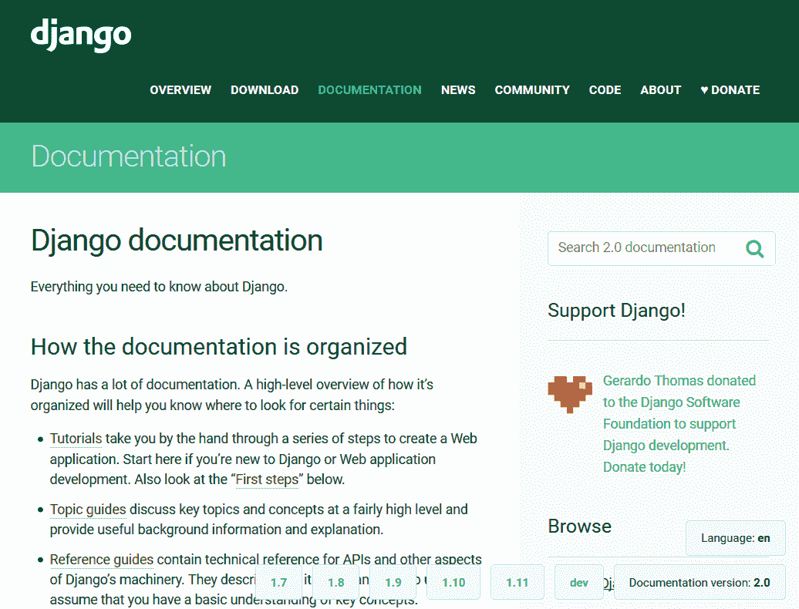
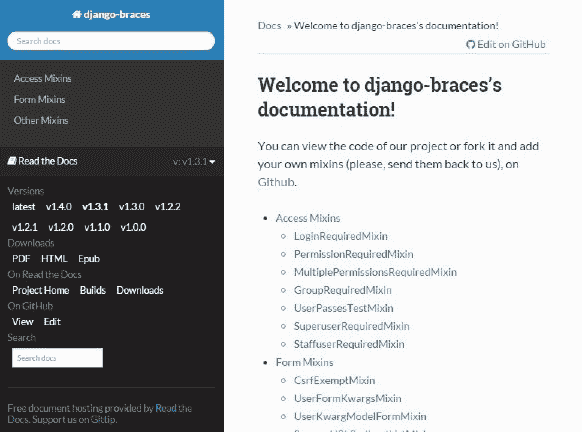
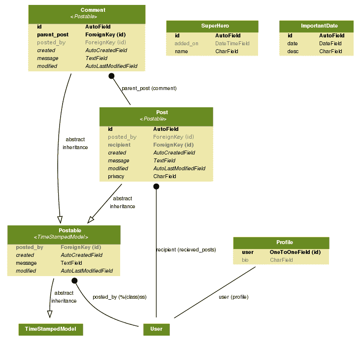

# 处理遗留代码

在本章中，我们将讨论以下主题：

*   读取 Django 代码库
*   发现相关文档
*   增量更改与完全重写
*   在更改代码之前编写测试
*   遗留数据库集成

当你被邀请参加一个项目时，听起来很激动人心。强大的新工具和尖端技术可能会等着你。然而，经常会要求您使用现有的、可能是古老的代码库。

平心而论，Django 已经不存在那么久了。然而，为 Django 的旧版本编写的项目差异很大，引起了关注。有时候，拥有完整的源代码和文档可能还不够。

如果要求您重新创建环境，您可能需要在本地或网络上摸索操作系统配置、数据库设置和运行服务。这个谜题有很多部分，你可能想知道如何开始，从哪里开始。

理解代码中使用的 Django 版本是一个关键信息。随着 Django 的发展，从默认的项目结构到推荐的最佳实践，一切都发生了变化。因此，确定使用了哪个版本的 Django 是理解它的关键。

换岗

超级本团队耐心地坐在训练室里可笑的短豆包上，等待哈特。他召开了一次紧急的现场会议。没有人理解紧急情况，因为至少还有三个月才能上线。

O 女士一只手拿着一个设计师设计的大咖啡杯，另一只手拿着一堆打印出来的项目时间表。没有抬头，她说：“我们迟到了，所以我会直截了当地说。鉴于上周的袭击，董事会决定立即加快 SuperBook 项目的进度，并将截止日期定在下个月底。有什么问题吗？”

“是的，”布拉德说，“哈特在哪里？”O 女士犹豫了一下，回答说，“嗯，他辞职了。作为 IT 安全部门的负责人，他承担了外围破坏的道德责任。“史蒂夫显然感到震惊，他摇了摇头。“对不起，”她继续说，“但我被指派负责 SuperBook，并确保我们在新的截止日期前没有任何障碍。”

有一个集体呻吟。O 女士没有被吓倒，拿了一张纸开始说，“这里说远程存档模块是最优先的项目，处于未完成状态。我相信埃文正在做这件事。”

“没错，”埃文从房间的另一端说。“就在那儿，”当其他人把焦点转向他时，他对他们笑了笑。O 夫人从她的眼镜圈上方凝视，笑得几乎太有礼貌了。

考虑到我们的 Sentinel 代码库中已经有一个经过良好测试且工作正常的 archiver，我建议您利用它，而不是创建另一个冗余系统。”

“但是，”Steve 打断道，“它几乎不是冗余的。我们可以比一个传统的档案员更好，不是吗？“如果它没有坏，那就别修了，”O 女士简洁地回答。他说，“他正在修，”布拉德几乎大声说，“他已经完成的所有工作呢？”

“埃文，到目前为止你完成了多少工作？”O 不耐烦地问。“大约 12%，”他带着防御的神情回答。每个人都怀疑地看着他。“什么？那是最难的 12%，”他补充道。

O 以同样的方式继续会议的其余部分。每个人的工作都被重新安排了优先级，并严格按照新的截止日期进行。当她拿起文件准备离开时，她停了下来，摘下了眼镜。“我知道你们所有人都在想什么……从字面上说，但你们需要知道，我们在截止日期上没有选择。我现在能告诉你们的是，世界正指望你们以某种方式满足那个日期。”她戴上眼镜，离开了房间。

“我一定要带上我的锡箔帽，”埃文大声自言自语。

# 查找 Django 版本

理想情况下，每个项目在根目录下都会有一个`requirements.txt`或`setup.py`文件，并且它会有用于该项目的 Django 的确切版本。让我们寻找一条类似于此的线：

```py
Django==1.5.9 
```

准确地提到了版本号（而不是`Django>=1.5.9`，称为**钉扎**。固定每个包被认为是一个好的实践，因为它可以减少意外，并使构建更具确定性。

作为最佳实践，建议为项目创建一个完全可重复的环境。这包括有一个列出了所有可传递依赖项的需求文件、固定和`--hash`摘要。`--hash`包装的摘要如下：

```py
Django==1.5.9 --hash=sha256:2cf24dba5fb0a30e26e83b2ac5... 
```

散列可以防止远程篡改，并且无需创建包含已批准包的专用包索引服务器。

不幸的是，在现实世界中有一些代码库，`requirements.txt`文件没有更新，甚至完全丢失。在这种情况下，您需要探测各种指示信号，以找出确切的版本。

# 激活虚拟环境

在大多数情况下，Django 项目将部署在虚拟环境中。找到项目的虚拟环境后，可以通过跳转到该目录并运行操作系统的激活脚本来激活它。

对于 Linux，命令如下所示：

```py
    $ source venv_path/bin/activate
```

虚拟环境激活后，启动 Python shell 并查询 Django 版本，如图所示：

```py
    $ python
    >>> import django
    >>> print(django.get_version())
    1.5.9 
```

本例中使用的 Django 版本为版本`1.5.9`。

或者，您可以在项目中运行`manage.py`脚本以获得类似的输出：

```py
    $ python manage.py --version
    1.5.9
```

但是，如果旧项目源快照以未部署的形式发送给您，则此选项将不可用。如果虚拟环境（和包）也包括在内，那么您可以很容易地在 Django 目录的`__init__.py`文件中找到版本号（以元组的形式）。考虑给定的例子：

```py
    $ cd envs/foo_env/lib/python2.7/site-packages/django 
    $ cat __init__.py
    VERSION = (1, 5, 9, 'final', 0)
    ...
```

如果所有这些方法都失败了，您将需要查看过去 Django 版本的发行说明，以确定可识别的更改（例如，自版本 1.5 以来，`AUTH_PROFILE_MODULE`设置已被弃用），并将其与您的旧代码相匹配。一旦确定了正确的 Django 版本，就可以继续分析代码了。

[Pipenv](https://docs.pipenv.org/)是最近推出的一款[官方推荐的](https://packaging.python.org/tutorials/managing-dependencies/#installing-pipenv)Python 打包工具，旨在解决其中许多问题。它结合了`pip`和`virtualenv`的功能，因此当您安装软件包时，它会自动更新其需求文件（称为`pipenv`。最后但并非最不重要的一点是，它使用一个完全固定并包含散列的`Pipenv.lock`文件启用可重复构建。

# 档案在哪里？这不是 PHP

最难适应的想法之一，尤其是如果您来自 PHP 或 ASP.NET 世界，是源文件不位于 web 服务器的文档根目录中，该目录通常命名为`wwwroot`或`public_html`。此外，代码的目录结构和网站的 URL 结构之间没有直接关系。

事实上，您会发现 Django 网站的源代码存储在一个模糊的路径中，例如`/opt/webapps/my-django-app`。为什么会这样？在许多好的理由中，将机密数据移到公共 web 根目录之外通常更安全。这样，网络爬虫就不会意外地进入您的源代码目录。

正如您将在[第 13 章](13.html)、*生产就绪*中所读到的，可以通过检查您的 web 服务器的配置文件找到源代码的位置。在这里，您将发现`DJANGO_SETTINGS_MODULE`环境变量被设置为模块的路径，或者它将请求传递给 WSGI 服务器，该服务器将被配置为指向您的`project.wsgi`文件。

# 从 url.py 开始

即使您可以访问 Django 站点的全部源代码，了解它在各种应用程序中的工作方式也会让人望而生畏。通常，最好从位于`urls.py`文件中的根`URLconf`开始，因为它实际上是一个将每个请求与相应视图联系起来的映射。

对于普通的 Python 程序，我通常从它执行的开始就开始阅读——比如说，从顶级主模块开始，或者从`__main__`检查习惯用法开始的任何地方开始阅读。对于 Django 应用程序，我通常从`urls.py`开始，因为根据站点的各种 URL 模式更容易遵循执行流程。

在 Linux 中，您可以使用以下`find`命令定位`settings.py`文件和指定`urls.py`根目录的对应行：

```py
    $ find . -iname settings.py -exec grep -H 'ROOT_URLCONF' {} \;
    ./projectname/settings.py:ROOT_URLCONF = 'projectname.urls'

    $ ls projectname/urls.py
    projectname/urls.py
```

# 跳过代码

阅读代码有时感觉就像在没有超链接的情况下浏览网页。当遇到在别处定义的函数或变量时，需要跳转到包含该定义的文件。一些 IDE 可以自动为您执行此操作，只要您告诉它作为项目的一部分要跟踪哪些文件。

如果改用 Emacs 或 Vim，则可以创建标记文件，以便在文件之间快速导航。转到项目根目录并运行名为**Exuberant Ctags**的工具，如下所示：

```py
    find . -iname "*.py" -print | etags -
```

这将创建一个名为 TAGS 的文件，其中包含位置信息，其中定义了每个语法单元，例如类和函数。在 Emacs 中，您可以找到标记的定义，您的光标（或在 Emacs 中调用的点）位于使用`M-.`命令的位置。

虽然使用标记文件对于大型代码库来说速度非常快，但它非常基本，并且不知道虚拟环境（大多数定义可能位于其中）。一个很好的替代方法是在 Emacs 中使用`elpy`包。可以将其配置为检测虚拟环境。跳转到语法元素的定义使用相同的`M-.`命令。但是，搜索并不局限于标记文件，因此您甚至可以无缝地跳转到 Django 源代码中的类定义。大多数 IDE 以`Navigate/Go to definition`名称提供此功能。

# 理解代码库

很难找到具有良好文档的遗留代码。即使您这样做了，文档也可能以微妙的方式与代码不同步，从而导致进一步的问题。通常，理解应用程序功能的最佳指南是可执行测试用例和代码本身。

Django 官方文件已按照[的版本组织 https://docs.djangoproject.com](https://docs.djangoproject.com) 。在任何页面上，您都可以通过页面右下角的选择器快速切换到 Django 早期版本中的相应页面：



Django 文档可以切换到不同的 Django 版本

同样，托管在[readthedocs.org](http://readthedocs.org)上的任何 Django 包的文档也可以追溯到其以前的版本。

例如，通过点击页面左下角的选择器，您可以选择`django-braces`的文档，一直返回到 v1.0.0：



阅读文档的软件包在侧边栏中列出了各种版本和格式

# 创造大局

如果您向大多数人展示一个高级图表，他们会发现更容易理解应用程序。虽然这在理想情况下是由了解应用程序工作原理的人创建的，但是有一些工具可以创建非常有用的 Django 应用程序高级描述。

通过`django-command-extensions`软件包提供的`graph_models`管理命令可以生成应用程序中所有模型的图形概览。如下图所示，模型类及其关系一目了然：



SuperBook 项目中使用的模型类由指示其关系的箭头连接

这种可视化实际上是使用 PyGraphviz 创建的。对于中等复杂度的项目，这可能会变得非常大。因此，如果应用程序在逻辑上分组并单独可视化，可能会更容易。

# PyGraphviz 的安装和使用

如果您发现 PyGraphviz 的安装具有挑战性，那么不要担心，您并不孤单。最近，我在 Ubuntu 上安装时遇到了很多问题，从 Python 3 的不兼容性到不完整的文档。为了节省您的时间，我列出了为实现工作设置而采取的步骤：

1.  在 Ubuntu 上，安装 PyGraphviz 需要安装以下软件包：

```py
 $ sudo apt-get install python-dev graphviz libgraphviz-dev pkg-config
```

2.  现在，激活虚拟环境并运行 pip 直接从 GitHub 安装 PyGraphviz 的开发版本，GitHub 支持 Python 3：

```py
$ pip install git+http://github.com/pygraphviz/pygraphviz.git#egg=pygraphviz 
```

3.  接下来，安装`django-extensions`并将其添加到您的`INSTALLED_APPS`中。现在，你们都准备好了。

4.  下面是一个示例，用于为两个应用程序创建 GraphViz 点文件，并将其转换为 PNG 图像以供查看：

```py
$ python manage.py graph_models app1 app2 > models.dot $ dot -Tpng models.dot -o models.png
```

# 增量更改还是完全重写？

通常情况下，应用程序所有者会将遗留代码交给您，并真诚地希望大部分代码可以立即使用或在进行一些小调整后使用。然而，阅读和理解一个庞大且经常过时的代码库并非易事。毫不奇怪，大多数程序员更喜欢从事绿地开发。

在最好的情况下，遗留代码应该易于测试、有良好的文档记录，并且能够灵活地在现代环境中工作，以便您可以立即开始进行增量更改。在最坏的情况下，您可能建议放弃现有代码并进行完全重写。或者，正如在大多数情况下一样，短期方法将是不断进行增量更改，并且可能正在进行一项并行的长期工作，以完成重新实施。

在做出此类决定时，一般的经验法则是，如果重写应用程序和维护应用程序的成本低于长期维护旧应用程序的成本，建议进行重写。必须小心考虑所有因素，例如让新程序员跟上速度所需的时间，以及维护过时硬件的成本。

有时，应用程序域的复杂性会成为重写的巨大障碍，因为在构建旧代码的过程中学习到的许多知识都会丢失。通常，这种对遗留代码本身的依赖是应用程序设计不佳的标志，比如未能从应用程序逻辑外部化业务规则。

最糟糕的重写形式可能是从一种语言到另一种语言的转换或机械翻译，而不利用现有的最佳实践。换言之，您失去了通过删除多年积垢使代码库现代化的机会。

代码应被视为一种负债，而不是一种资产。听起来可能有点违反直觉，但如果您可以用少量代码实现业务目标，那么您的生产力就大大提高了。拥有更少的代码进行测试、调试和维护不仅可以降低持续的成本，还可以使您的组织更灵活地进行更改。

代码是一种负债，而不是资产。更少的代码更易于维护。

无论您是添加功能还是修剪代码，在没有测试的情况下，您都不能接触正在工作的遗留代码。

# 在进行任何更改之前编写测试

在*Michael Feathers*撰写的*一书《有效处理遗留代码*中，遗留代码被简单地定义为没有测试的代码。他详细说明，通过测试，您可以轻松地快速且可验证地修改代码的行为。在没有测试的情况下，不可能判断更改是使代码更好还是更差。

通常，我们对遗留代码了解不够，无法自信地编写测试。Michael 建议编写保存和记录现有行为的测试，称为表征测试。

与通常的编写测试的方法不同，在编写特性化测试时，您将首先编写一个带有虚拟输出的失败测试，比如*X*，因为您不知道会发生什么。当测试线束因错误而失败时，例如预期输出 X 但得到 Y，您将更改测试以预期*Y*。因此，现在测试将通过，它将成为代码现有行为的记录。

我们也可以记录婴儿车的行为。毕竟，这是一个不熟悉的代码。然而，在我们开始更改代码之前，编写这样的测试是必要的。稍后，当我们更好地了解规范和代码时，我们可以修复这些 bug 并更新测试（不一定按那个顺序）。

# 编写测试的逐步过程

在修改代码之前编写测试类似于在修复旧建筑之前搭建脚手架。它提供了一个结构框架，帮助您自信地进行维修。

您可能希望按如下方式逐步处理此过程：

1.  确定您需要更改的区域。您的错误报告可以作为缩小问题区域的良好指南。在您满意地捕捉到该区域的行为之前，针对该区域编写特性测试。
2.  查看您需要进行的更改，并为这些更改编写特定的测试用例。抵制添加新功能的诱惑。与更大、更慢的集成测试相比，更喜欢更小的单元测试。
3.  引入增量更改并在 lockstep 中进行测试。如果测试失败，尝试分析它是否是预期的。如果这种行为是有意改变的，不要害怕打破平衡的特性测试。

请注意，特性测试捕获了代码的所有现有行为，包括 bug。一旦您的代码进入生产环境，并且用户熟悉了它，bug 就会变成预期的行为。因此，这些测试可以作为现有功能的可测试文档。

如果您对代码有一组良好的粒度测试，那么您可以很快找到更改代码的效果。因此，编写更多具有良好覆盖率的单元测试的价值将帮助您快速识别更改的影响。

另一方面，如果您决定通过丢弃代码而不是数据来重写，Django 可以给您很大的帮助。

# 遗留数据库集成

Django 文档中有一整节都是关于遗留数据库的，这是正确的，因为您将多次遇到它们。数据比代码更重要，在大多数企业中，数据库是数据的存储库。

通过将其他语言或框架编写的遗留应用程序的数据库结构导入 Django，可以使其现代化。作为一个直接的优势，您可以使用 Django 管理界面查看和更改遗留数据。

Django 通过`inspectdb`管理命令简化了这一过程，如下所示：

```py
    $ python manage.py inspectdb > models.py
```

如果在将设置配置为使用旧数据库时运行此命令，则可以自动生成将进入模型文件的 Python 代码。默认情况下，这些模型是非托管的，即`managed = False`。在这种状态下，Django 将不会控制模型的创建、修改或删除。

如果要使用此方法集成到遗留数据库中，以下是一些最佳做法：

*   事先了解 Django ORM 的局限性。目前，不支持多列（复合）主键和 NoSQL 数据库。
*   不要忘记手动清理生成的模型；例如，删除多余的`id`字段，因为 Django 会自动创建它们。
*   外键关系可能必须手动定义。在某些数据库中，自动生成的模型将其作为整数字段（后缀为`_id`）。
*   将模型组织到单独的应用程序中。稍后，在适当的文件夹中添加视图、表单和测试会更容易。
*   请记住，运行迁移将在遗留数据库中创建 Django 的管理表（`django_*`和`auth_*`）。

在理想情况下，自动生成的模型将立即开始工作，但在实践中，这需要大量的尝试和错误。有时，Django 推断的数据类型可能与您的期望不符。在其他情况下，您可能希望向模型中添加额外的元信息，例如`unique_together`。

最终，您应该能够在熟悉的 Django 管理界面中看到在老化的 PHP 应用程序中锁定的所有数据。我相信这会给你带来微笑。

# 未来证明

编写良好的代码库是一种愉快的工作方式。组织不良且脆弱的代码库通常会成为遗留代码，阻碍创新。那么，如何降低应用程序被视为遗留的可能性呢？以下是一些建议：

*   **Django 弃用语**：弃用语告诉您将来 Django 是否会停止使用某个功能或惯用语。自 Django 1.11 以来，默认情况下它们是安静的。使用`python -Wd`以显示弃用警告。
*   **代码评审**：确保高代码质量，鼓励评审中的最佳实践。
*   **一致性格式化**：提交代码前使用[黑色](https://github.com/ambv/black)等代码格式化工具，以减少审核时间
*   **增加代码覆盖率**：编写更多的测试，尤其是单元测试。
*   **类型提示**：使用类型提示对 Python 3 代码进行静态分析，减少测试用例数量。
*   **配置管理**：具有强大的版本控制和其他配置管理实践，以确保可复制的环境和无痛回滚。这包括使用从 Git 到 Ansible 的一系列工具，同时拥有敏捷的 DevOps 文化。

# 总结

在本章中，我们介绍了理解遗留代码的各种技术。阅读代码通常是一项被低估的技能。然而，我们需要尽可能明智地重用好的工作代码，而不是重新发明轮子。在本章以及本书的其余部分中，我们强调编写测试用例作为编码不可或缺的一部分的重要性。

在下一章中，我们将讨论编写测试用例以及随之而来的调试任务。