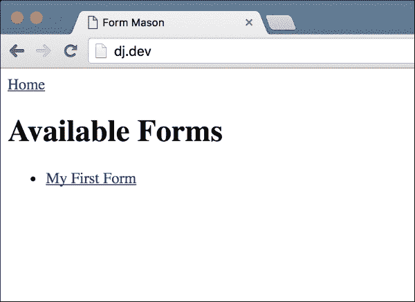
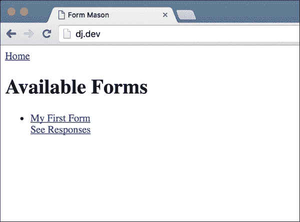
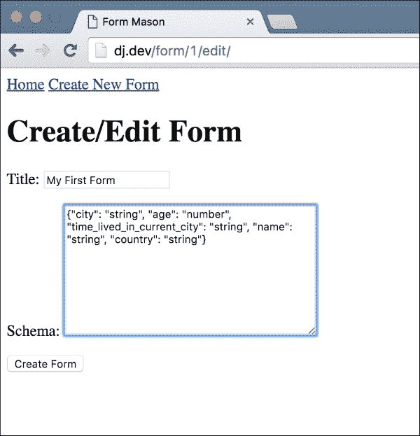

# 第七章。梅森形态——你自己的猴子

在我们学习 Django 的过程中，我们走了很远。我们从小步骤开始，学习设置数据库、基本视图和模板。然后，我们继续学习更难的东西，比如管理命令和 Django shell。这是这段旅程的最后一章，在这里我们使用我们所获得的所有知识，并用它来创建迄今为止最复杂的应用程序之一。以一声巨响结束事情总是很有趣的，这就是我们在这里要做的！

你可能听说过SurveyMonkey（[www.SurveyMonkey.com](http://www.surveymonkey.com)或Wufoo（[www.Wufoo.com](http://www.wufoo.com)）。如果不是，则这些是 web 应用程序，允许您创建自定义表单以从访问者收集数据。您可以使用这些站点上提供的控制面板来设置表单，定义所有字段以及如何验证这些字段，并配置一些基本内容，例如表单的外观、应使用的主题等。配置表单后，您将获得一个指向显示该表单的网页的链接。

然后，您将此链接发送给目标受众，他们填写此链接，并保存他们的回复。作为控制面板的一部分，您还可以在一个网页上查看和筛选这些响应。

像这样的服务使得即使是最不懂计算机的人也可以非常简单地创建在线调查，并从广泛的受众中为任何目的收集数据。这似乎是一个很酷的服务，我们将在本章中复制它。它也是我们将创建的最复杂的应用程序，因为它要求我们深入研究 Django 并了解 Django 表单在幕后的工作方式。从某种意义上说，你会学到让 Django 成功的魔力。令人兴奋，不是吗！

# 代码包

本章没有代码包，因为我们将要做的几乎所有内容都是新的。另外，我们在本章中也会做很多探索。这既有趣又向你展示了处理棘手项目的众多方法之一。

由于没有代码包可供使用，因此您需要自己启动项目。首先，一如既往，为新项目创建一个新的虚拟环境。接下来，在激活环境的情况下，安装 Django 并运行以下操作：

```py
> django-admin.py startproject formmason

```

这将为我们的新 Django 项目创建一个`formmason`文件夹，为我们开始工作做好准备。使用`cd`命令进入此文件夹并创建一个新的应用程序，我们将使用该应用程序保存视图、模型等：

```py
> python manage.py startapp main

```

最后，将`main`应用程序添加到`formmason/settings.py`中的`INSTALLED_APPS`列表中。完成后，我们就可以开始了！

# 看着 Django 表格

由于我们的目标是允许用户根据数据库中存储的参数创建动态表单，一个好的起点是了解 Django 表单如何在引擎盖下工作，以及我们必须定制哪些选项。首先，让我们创建一个基本表单。创建一个新的`main/forms.py` 文件并添加以下代码：

```py
from django import forms

class SampleForm(forms.Form):
    name = forms.CharField()
    age = forms.IntegerField()
    address = forms.CharField(required=False)
    gender = forms.ChoiceField(choices=(('M', 'Male'), ('F', 'Female')))
```

这是一种非常基本的形式。但是，它有各种各样的表单字段，我们可以查看。让我们在 shell 中玩一玩，您可以按如下方式开始：

```py
> python manage.py shell

```

### 提示

我通常喜欢安装另一个名为 ipython 的软件包。当你在安装了 ipython 的情况下启动 Django shell时，你会得到一个增强版的基本 shell，它有很多很酷的特性，比如自动完成和一个外观更好的界面。我总是在任何 Django 项目中安装它，因为我几乎总是在项目开始时使用 shell 来进行操作。我强烈建议您在启动新的 Django 项目时也安装它。

在 shell 中导入我们的表单，如下所示：

```py
> from main.forms import SampleForm
```

在同一 shell 中，键入以下内容：

```py
> form = SampleForm()
> form.fields
OrderedDict([('name', <django.forms.fields.CharField at 0x10fc79510>),
             ('age', <django.forms.fields.IntegerField at 0x10fc79490>),
             ('address', <django.forms.fields.CharField at 0x10fc79090>),
             ('gender', <django.forms.fields.ChoiceField at 0x10fc792d0>)])
```

代码的第一行只是创建了表单类的一个实例。这是第二行的乐趣开始。不过，我会先解释一下`OrderedDict` 数据结构。

顾名思义，`OrderedDict`是一本字典，它维护其元素插入的顺序。Python 中的普通词典没有固定的顺序。如果将三个元素插入到具有键`A`、`B`和`C`的字典中，然后在字典实例上使用`keys()`方法要求返回键，则无法保证返回键的顺序，这就是为什么一般内置字典被称为无序的原因。

相反，来自`collections`库（Python 标准库的一部分）的`OrderedDict`中的键保证与插入它们的顺序相同。因此，如果您使用`keys()`或`items()`方法对键进行迭代，您总是会按照插入键的相同顺序将其返回。

回到输出，您将看到打印的字典与我们创建`SampleForm`类时使用的字段名称具有相同的键。这些键的值是我们在表单中使用的`Field`子类（`CharField`、`IntegerField`等等）。

让我们试试看。在 shell 中，键入以下内容并查看输出：

```py
> form.name
---------------------------------------------------------------------------
AttributeError                            Traceback (most recent call last)
<ipython-input-16-1174e5d9164a> in <module>()
----> 1 form.name

AttributeError: 'SampleForm' object has no attribute 'name'
```

我们在`SampleForm`类上定义的`name`属性似乎已经不存在了。奇怪吧？

到目前为止，您已经了解了关于 Django 表单的两个事实。首先，表单实例上的`fields`属性包含字段名到`Field`类的映射。其次，我们在创建`SampleForm`类时定义的字段属性在实例上不可访问。

把这两个事实放在一起，我们就可以知道 Django 在创建`SampleForm`类的实例时是如何处理它的。它删除字段属性并将其添加到`fields`字典中。创建表单实例后，找到其上定义的字段的唯一方法是使用`fields`字典属性。

因此，如果我们想在定义类之后向表单添加另一个字段，并且我们无法更改类本身的代码，那么我们可以在表单实例的`fields`属性中添加`Field`子类的实例。让我们试试看这是否有效。

### 注

当我说 Django 在创建一个`SampleForm`类的实例时会从该类中删除字段属性时，我撒了一点谎。实际上，`SampleForm`类也删除了它的字段属性。如果您在 shell 中键入`SampleForm.name`，您将得到类似的`AttributeError`。然而，这些信息与我们当前的任务无关，发生这种情况的原因很复杂，所以我在本书中不作详细介绍。如果您想了解所有详细信息，请查看`django.forms.Form`类的源代码。

## 向 SampleForm 实例添加额外字段

我们现在要做一个实验。我们将使用一些有效的测试数据创建我们的`SampleForm`实例，然后我们将在实例的`fields`属性中添加另一个字段。然后，我们将调用`is_valid()`方法，查看表单实例在验证前面提供的数据时是否考虑了动态添加的字段。让我们看看会发生什么。在 Django shell 中，输入以下命令：

```py
> from main.forms import SampleForm
> test_data = {'name': 'Jibran', 'age': 27, 'gender': 'M'}
> form = SampleForm(test_data)
> from django import forms
> form.fields['country'] = forms.CharField()
> form.is_valid()
False
> form.errors
{'country': [u'This field is required.']}
```

美好的看来我们的想法奏效了。即使我们在我们的 Ty1 T1 已被实例化并提供数据之后添加了 AdT0 字段，表单验证确实考虑了我们的新字段。由于`country`字段不是`test_data`字典的一部分，并且字段是必需的，因此表单验证失败，`errors`列表包含相应的错误。

现在我们有了实现目标的技术，让我们创建一些视图和模板来渲染动态表单。

# 生成动态表单

在开始编写代码之前，我们必须确定一种数据格式，以指定动态表单的结构。**JSON**是目前网络上最流行的数据存储和交换格式之一。您可能会知道什么是JSON，它是如何工作的，它看起来是什么样子。然而，如果你不是，这里有一个快速的介绍。

JSON 代表 JavaScript 对象表示法。它使用与 JavaScript 声明对象相同的格式。对我们 Python 的人来说，最大的好处是它几乎与 Python 中的字典声明语法完全相同。假设我们想存储一些关于用户的详细信息。在 JSON 中，这些信息是什么样子的：

```py
{
    "name": "Jibran",
    "age": 27,
    "country": "Pakistan"
}
```

如您所见，我们甚至可以将其复制并粘贴到 Python 代码中，这将是一个有效的字典定义，这使我们可以非常轻松地使用它。

与其他数据存储/交换格式相比，JSON 有许多好处：

*   它只是文本，因此不需要为查看和解析而构建专门的工具。
*   解析 JSON 非常简单，大多数语言都有一个用于此的库。Python 附带了一个标准库来解析 JSON。
*   手写很简单。
*   它可以以多种方式存储，而无需执行任何特殊操作。稍后我们将使用这个事实将 JSON 作为一个简单的文本字段存储在数据库中。

现在您已经了解了一些 JSON，让我们看看如何使用它。我们将在 JSON 中存储有关如何构造动态表单的信息。然后，我们将使用 Python 标准库`json`将 JSON 字符串转换为 Python 字典，然后迭代并创建表单。

### 注

在本节中，我们将硬编码用于生成表单的 JSON。稍后，我们将允许用户从我们为他们制作的控制面板中创建 JSON 并将其存储在数据库中。

我们将了解如何在 JSON中定义表单字段，并从该模式生成动态表单。我们还将创建一个 HTML 表单来呈现我们的表单，这样我们就可以测试一切是否按预期工作。

让我们看看一个简单表单的格式，该表单可用于收集有关人员的基本人口统计信息：

```py
{
    "name": "string",
    "age": "number",
    "city": "string",
    "country": "string",
    "time_lived_in_current_city": "string"
}
```

这是我们将在本节中用于生成和显示动态表单的示例 JSON。此结构是一个简单的字典，其中包含值的字符串。我们必须编写代码来解析这个字典，并根据这些信息创建 Django 表单。

## 从 JSON 生成表单

我们需要做的第一件事情是将我们的视图将获得的 JSON 数据转换为 Python 字典，以便我们可以对其进行迭代。Python 附带了`json`模块作为标准库的一部分，该库将为我们处理解析。您可以在[阅读文档https://docs.python.org/3/library/json.html](https://docs.python.org/3/library/json.html) 。不过，它的使用非常简单，所以让我们深入研究一下。

打开`main/views.py`并添加此代码：

```py
import json

from django import forms
from django.views.generic import FormView

class CustomFormView(FormView):
    template_name = "custom_form.html"

    def get_form(self):
        form_structure_json = """{
"name": "string",
"age": "number",
"city": "string",
"country": "string",
"time_lived_in_current_city": "string"
}"""
        form_structure = json.loads(form_structure_json)

        custom_form = forms.Form(**self.get_form_kwargs())
        for key, value in form_structure.items():
            field_class = self.get_field_class_from_type(value)
            if field_class is not None:
                custom_form.fields[key] = field_class()
            else:
                raise TypeError("Invalid field type {}".format(value))

        return custom_form

    def get_field_class_from_type(self, value_type):
        if value_type == "string":
            return forms.CharField
        elif value_type == "number":
            return forms.IntegerField
        else:
            return None
```

这里有几件事需要解释。但是，让我们先让视图工作，看看它是否符合我们的要求。然后我将解释这段代码的作用。接下来，让我们创建`main/templates/custom_form.html`模板。您需要先在`main/`文件夹下创建`templates`文件夹。将此代码放在那里：

```py
<html>
<head>
    <meta http-equiv="content-type" content="text/html; charset=utf-8" />

    <title>Custom Form Demo</title>
</head>

<body>
    <h1>Custom Form</h1>
    <form action="" method="post">
        {{ form.as_p }}
        <input type="submit" value="Submit" />
    </form>
</body>
</html>
```

最后，在`formmason/urls.py`中添加以下代码以包含我们的新视图：

```py
from django.conf.urls import url

from main.views import CustomFormView

urlpatterns = [
    url(r'^$', CustomFormView.as_view(), name='custom-form'),
]
```

现在就这样了。要进行测试，请使用`runserver`命令运行开发服务器，然后在任何浏览器中打开`http://127.0.0.1:8000`。您应该会看到与此类似的屏幕：


尝试提交不完整的表单，页面应显示正确的错误消息。试着填写表格并提交。现在您应该看到一个错误页面，带有`ImproperlyConfigured: No URL to redirect to. Provide a success_url`错误。这个错误来自于我们对`FormView`通用视图的使用。当表单有效时，它希望定义`success_url`，以便用户可以重定向到该表单。我们没有任何地方可以将用户重定向到，因此我们现在将忽略这一点。让我们看一下代码，看看我们在这里做了什么。

### 提示

这个例子还强调了通用视图的强大功能。只需重新定义一个函数`get_form`，我们就可以使用`FormView`的所有功能，动态生成表单。由于 Django 泛型视图是在考虑模块化的情况下创建的，因此视图的其余部分并不关心表单是如何创建的，只关心`get_form`方法返回一个有效的表单。

大部分动作发生在我们的`CustomFormView`的`get_form`方法中，所以让我们从这里开始。第一行代码定义了用于生成表单的 JSON 数据结构。正如我之前提到的，这些数据最终将来自数据库后端；然而，出于测试目的，我们现在正在对其进行硬编码。接下来，我们使用`json.loads`方法将 JSON 字符串转换为 Python 对象。这个转换过程非常直观。我们拥有的 JSON 字符串是一个字典，其中包含`name`、`age`、`city`、`country`和`time_lived_in_current_city`的键。我们从`json.loads`得到的 Python 对象也是一个字典，具有相同的键/值对。您还可以在 JSON 字符串中包含数组，加载它将得到一个 Python 列表。JSON 支持嵌套对象，因此您可以拥有一个字典数组或一个带有值数组的字典。

接下来，我们创建一个基本`django.forms.Form`类的实例。正如我们在之前的实验中所看到的，我们可以获取 Django 表单的一个实例并向其添加字段。我们没有创建一个空表单类并使用它，而是直接使用 Django 中的基`Form`类。我们将从`self.get_form_kwargs()`接收到的任何内容传递给表单类的构造函数。此方法是 Django`FormView`类的一部分，并根据请求类型创建要传递给`Form`类的正确关键字参数。例如，如果请求是 POST/PUT 请求，`get_form_kwargs()`将返回一个包含`data`关键字参数的字典，以便我们可以使用表单验证数据并对其采取进一步的操作。

接下来，当我们在自定义字段数据的项目列表上循环时，会发生有趣的事情。我们从 JSON 加载的数据上的`items()`方法返回如下列表：

```py
[('name', 'string'), ('age', 'number'), ('city', 'string'), ('country', 'string'), ('time_lived_in_city', 'string')]
```

我们循环这个列表，将这些项目对中的每一个分配给`for`循环中的变量`key`和`value`。然后，我们将这些值传递给`get_field_class_from_type`方法，该方法决定将哪些可用的表单字段类用于传递的数据类型。该方法的代码是一个简单的`if/else`，如果传递的类型无效，则返回一个字段类或`None`。

我们使用这个方法的返回值，它是一个类，并将它的一个实例分配给表单的`fields`属性字典。*注意，我们分配的是 field 类的实例，而不是类本身*。字段的名称是 JSON 字典中的键。我们还做了一些基本的错误处理，如果我们在JSON 数据字典中找不到与我们得到的类型匹配的字段类，则会引发`TypeError`。

最后，我们返回定制的表单类。从那时起，Django`FormView`接管并呈现表单，必要时会出现错误，或者如果用户提交的表单数据有效，则将用户重定向到成功 URL。由于我们没有定义任何成功 URL，因此在提交有效表单时会出现错误。

就这样。这就是创建动态生成表单所需的全部代码。我们可以添加更多功能，如自定义验证或高级功能，如支持选择字段和有限的选择集，但我将把它作为一个有趣的项目留给您自己尝试。

接下来，让我们来看看如何在数据库中存储定义自定义表单的 JSON 数据。我们将为它创建一个模型，并允许用户从管理面板创建具有不同字段的多个表单。

# 我们的 JSON 模型

正如我前面提到的，使用 JSON 作为表单定义格式的最大好处之一是，它只使用简单的文本数据来编码复杂对象的定义。虽然某些数据库（如 PostgreSQL）具有 JSON 的列类型，但其他数据库则没有。但是，因为我们处理的是简单的文本数据，所以不需要！我们可以将 JSON 数据存储在一个简单的`TextField`中，然后在需要时对 Python 字典中的数据进行编码和解码。事实上，Django 社区中有许多人已经解决了这个问题，并公开了他们的解决方案供我们使用。

我过去使用过的一个这样的包是`django-jsonfield`。您可以在[找到 https://github.com/bradjasper/django-jsonfield](https://github.com/bradjasper/django-jsonfield) ，我们将在我们的项目中使用它。首先，通过在命令行中键入以下命令来安装所需的软件包。确保首先激活虚拟环境，以便将其安装在正确的位置。

```py
> pip install jsonfield

```

安装包后，我们可以为表单创建一个模型。打开`main/models.py`并将其更改为具有以下代码：

```py
from __future__ import unicode_literals

from django.db import models

from jsonfield import JSONField

class FormSchema(models.Model):
    title = models.CharField(max_length=100)
    schema = JSONField()
```

保存文件，然后创建并运行迁移，以便 Django 为我们的新模型创建表。在命令行中，运行以下命令：

```py
> python manage.py makemigrations main
Migrations for 'main':
  0001_initial.py:
    - Create model FormSchema
> python manage.py migrate
Operations to perform:
  Apply all migrations: sessions, contenttypes, admin, main, auth
Running migrations:
  Rendering model states... DONE
  Applying contenttypes.0001_initial... OK
  Applying auth.0001_initial... OK
  Applying admin.0001_initial... OK
  Applying admin.0002_logentry_remove_auto_add... OK
  Applying contenttypes.0002_remove_content_type_name... OK
  Applying auth.0002_alter_permission_name_max_length... OK
  Applying auth.0003_alter_user_email_max_length... OK
  Applying auth.0004_alter_user_username_opts... OK
  Applying auth.0005_alter_user_last_login_null... OK
  Applying auth.0006_require_contenttypes_0002... OK
  Applying auth.0007_alter_validators_add_error_messages... OK
  Applying sessions.0001_initial... OK
```

迁移完成后，让我们看看如何使用此模型。我不想为视图编写代码，而是喜欢在 Django shell 中进行一些实验。通过键入以下内容打开它：

```py
> python manage.py shell
```

然后输入以下内容以测试我们的新模型：

```py
> from main.models import FormSchema
> fs = FormSchema()
> fs.title = 'My First Form'
> fs.schema = {'name': 'string', 'age': 'number', 'city': 'string', 'country': 'string', 'time_lived_in_current_city': 'string'}
> fs.save()
> FormSchema.objects.get(pk=1).schema
{u'age': u'number',
 u'city': u'string',
 u'country': u'string',
 u'name': u'string',
 u'time_lived_in_current_city': u'string'}
```

到目前为止，我们在这里所做的应该很简单，您可以理解。这里需要注意的重要一点是我们分配给`schema`字段的值。我们没有使用 JSON 数据的字符串表示，而是简单地为其分配了一个 Python 字典。我们在模型中用作字段类的`JSONField`类在保存到数据库时完成了从 Python 字典到 JSON 字符串的繁重转换。

反之亦然。请注意，在 shell 会话的最后一行中，我们只是直接访问 schema 字段，并取回一个 Python 字典，而不是实际保存在数据库中的字符串 JSON 数据。这使得使用 JSON 对我们来说是透明的。

### 提示

您可能想知道为什么我要求您在本章中进行实验，并在 shell 中进行操作，而在前面的章节中，我只是直接向您展示了相关的视图/模型/模板代码。

正如我在本章开头提到的，本章是向你展示如何自己找到解决方案，而不是我握着你的手，立即向你展示最终结果。

据我所知，所有优秀的 Django 开发人员都有类似的方法为他们所从事的项目开发解决方案。他们做了一点实验，在这样做的过程中找到了他们正在研究的问题的解决方案。每个人都有不同的实验方法。有些人，像我一样，经常使用 Django shell。其他人在视图和模型中编写测试代码。其他人可能会创建简单的 Django 管理命令来执行同样的操作。然而，每个人都经历同样的过程。

我们找到了一个需要解决的问题，我们对它进行了一些研究，然后尝试各种解决方法，最后选择一种我们最喜欢的方法。你最终会开发出一种你熟悉的方法。同时，我将向您介绍我的方法，如果您愿意，您可以使用此方法。

现在我们的数据库中有一个`FormSchema`对象，所以让我们创建一个视图，可以使用这个对象生成表单。在`main/views.py`中，首先在顶部附近导入我们的新车型：

```py
from main.models import FormSchema
```

然后更改我们`CustomFormView`中的`get_form`方法，以匹配以下内容：

```py
def get_form(self):
    form_structure = FormSchema.objects.get(pk=1).schema

    custom_form = forms.Form(**self.get_form_kwargs())
    for key, value in form_structure.items():
        field_class = self.get_field_class_from_type(value)
        if field_class is not None:
            custom_form.fields[key] = field_class()
        else:
            raise TypeError("Invalid field type {}".format(value))

    return custom_form
```

我已经强调了这条新线。我们已经删除了我们使用的硬编码 JSON 字符串，而是将数据库对象中的`schema`字段的值赋给了`form_structure`变量。代码的其余部分保持不变。再次尝试打开应用程序的主页。你会发现前端保持不变。相互作用也将是相同的。您可以尝试提交无效或不完整的数据，它会像以前一样显示错误。尝试提交有效表单仍将导致未定义成功 URL 的错误。

接下来，让我们为用户创建一个更好的前端。我们将创建一个列表视图，用户可以在其中查看站点上所有可用表单的列表，以及一个显示实际表单并处理交互的表单视图。

# 创造更好的用户界面

我们在这里做什么并不复杂。您应该很容易理解，所以我将给您编写代码并留下解释，就像我们在前面的章节中多次做的那样。

首先在项目根目录中创建一个`templates`目录。接下来，将其添加到我们的`formmason/settings.py`文件中`TEMPLATES`配置变量的`DIRS`列表中。`settings.py`文件已经配置了一个`TEMPLATES`变量，因此请继续使用您在此处看到的值替换本词典中的`DIRS`列表：

```py
TEMPLATES = [
    {
        'BACKEND': 'django.template.backends.django.DjangoTemplates',
        'DIRS': [
            os.path.join(BASE_DIR, 'templates'),
        ],
        'APP_DIRS': True,
        'OPTIONS': {
            'context_processors': [
                'django.template.context_processors.debug',
                'django.template.context_processors.request',
                'django.contrib.auth.context_processors.auth',
                'django.contrib.messages.context_processors.messages',
            ],
        },
    },
]
```

接下来，在刚刚创建的新的`templates`目录中创建一个`base.html`模板，并将此代码放入其中：

```py
<html>
<head>
    <meta http-equiv="content-type" content="text/html; charset=utf-8" />

    <title>Form Mason</title>
</head>

<body>
    <a href="">Home</a>
    
    
</body>
</html>
```

修改`main/templates/custom_form.html`以匹配此项：

```py



    <h1>Custom Form</h1>
    <form action="" method="post">
        {{ form.as_p }}
        <input type="submit" value="Submit" />
    </form>

```

将`main/views.py`更改为：

```py
from django import forms
from django.views.generic import FormView
from django.views.generic import ListView

from main.models import FormSchema

class HomePageView(ListView):
    model = FormSchema
    template_name = "home.html"

class CustomFormView(FormView):
    template_name = "custom_form.html"

    def get_form(self):
        form_structure = FormSchema.objects.get(pk=self.kwargs["form_pk"]).schema

        custom_form = forms.Form(**self.get_form_kwargs())
        for key, value in form_structure.items():
            field_class = self.get_field_class_from_type(value)
            if field_class is not None:
                custom_form.fields[key] = field_class()
            else:
                raise TypeError("Invalid field type {}".format(value))

        return custom_form

    def get_field_class_from_type(self, value_type):
        if value_type == "string":
            return forms.CharField
        elif value_type == "number":
            return forms.IntegerField
        else:
            return None
```

在`main/templates/home.html`处创建新主页模板，并给出以下代码：

```py



    <h1>Available Forms</h1>
    
    <ul>
        
        <li><a href="">{{ form.title }}</a></li>
        
    </ul>
    

```

最后，更改`formmason/urls.py`以匹配此项：

```py
from django.conf.urls import url

from main.views import CustomFormView
from main.views import HomePageView

urlpatterns = [
    url(r'^$', HomePageView.as_view(), name='home'),
    url(r'^form/(?P<form_pk>\d+)/$', CustomFormView.as_view(), name='custom-form'),
]
```

完成所有这些操作后，请在`http://127.0.0.1:8000`再次打开应用程序的主页，您将看到类似于此的页面：



点击表单的链接，您将进入我们之前的表单页面；唯一的区别是，现在它在 URL`http://127.0.0.1:8000/form/1/`上提供。

就像我说的，所有这些都是我们在过去几章中反复做过的非常基本的事情。一件可能是新的事情是我们在`CustomFormView.get_form` 方法中使用`self.kwargs['form_pk']`。以下是相关的线路：

```py
form_structure = FormSchema.objects.get(pk=self.kwargs["form_pk"]).schema
```

对于 Django 提供的任何通用视图（基本`View`类除外），`self.kwargs`是匹配 URL 模式的所有命名参数的字典。如果您查看我们的`formmason/urls.py`文件，我们为自定义表单页面定义了如下 URL：

```py
url(r'^form/(?P<form_pk>\d+)/$', CustomFormView.as_view(), name='custom-form')
```

我们认为，在正则表达式模式中为 URL 定义的`form_pk`参数在`self.kwargs`中可用。同样，URL 模式中的任何非关键字参数都可在`self.args`中使用。

现在我们有了一个可用的用户界面，我们将继续在数据库中存储表单响应，并为客户提供一个页面来查看这些响应。

# 保存响应

我们希望保存用户填写我们的一个动态表单的响应。由于来自动态表单的数据也是动态的，我们需要在数据库中存储未知数量的字段及其值。正如我们已经看到的，JSON 是存储此类数据的合理方式。让我们在`main/models.py`中创建一个新模型来存储响应：

```py
class FormResponse(models.Model):
    form = models.ForeignKey(FormSchema)
    response = JSONField()
```

接下来，创建并运行迁移以将此新模型添加到我们的数据库：

```py
> python manage.py makemigrations main
Migrations for 'main':
  0002_formresponse.py:
    - Create model FormResponse
> python manage.py migrate main
Operations to perform:
  Apply all migrations: main
Running migrations:
  Rendering model states... DONE
  Applying main.0002_formresponse... OK
```

现在我们有了模型，我们需要在此模型中保存表单的有效响应。`CustomFormView`的`form_valid`方法是添加此逻辑的正确位置。首先，我们需要从 Django 导入一些东西，并在`main/views.py`文件顶部导入我们的新模型：

```py
from django.core.urlresolvers import reverse
from django.http.response import HttpResponseRedirect

from main.models import FormResponse
```

然后，在`CustomFormView`类中添加一个带有此代码的`form_valid`方法：

```py
def form_valid(self, form):
    custom_form = FormSchema.objects.get(pk=self.kwargs["form_pk"])
    user_response = form.cleaned_data

    form_response = FormResponse(form=custom_form, response=user_response)
    form_response.save()

    return HttpResponseRedirect(reverse('home'))
```

就这样。现在尝试提交我们之前创建的自定义表单，如果数据有效，您的响应保存后应该重定向到主页。现在，我们无法在前端看到这些反应；但是，我们可以使用 Django shell 来确保数据已保存。使用以下命令启动 shell：

```py
> python manage.py shell

```

然后使用以下代码行查看已保存的响应：

```py
> from main.models import FormResponse
> FormResponse.objects.all()[0].response
{u'age': 27,
 u'city': u'Dubai',
 u'country': u'UAE',
 u'name': u'Jibran',
 u'time_lived_in_current_city': u'3 years'}

```

您应该可以看到保存表单时输入的数据。现在，让我们创建一个屏幕，让我们的客户可以看到他们自定义表单的响应。

# 显示响应

本节中的代码非常简单，应该不会让您感到意外。首先，我们在`main/views.py`中创建视图：

```py
class FormResponsesListView(ListView):
    template_name = "form_responses.html"

    def get_context_data(self, **kwargs):
        ctx = super(FormResponsesListView, self).get_context_data(**kwargs)
        ctx["form"] = self.get_form()

        return ctx

    def get_queryset(self):
        form = self.get_form()
        return FormResponse.objects.filter(form=form)

    def get_form(self):
        return FormSchema.objects.get(pk=self.kwargs["form_pk"])
```

接下来，创建`main/templates/form_responses.html`模板：

```py



<h1>Responses for {{ form.title }}</h1>

<ul>
    
    <li>{{ response.response }}</li>
    
</ul>


```

在`formmason/urls.py`中，导入我们的新视图：

```py
from main.views import FormResponsesListView
```

将此URL 模式添加到`urlpatterns`列表中：

```py
url(r'^form/(?P<form_pk>\d+)/responses/$', FormResponsesListView.as_view(), name='form-responses'),
```

最后，编辑`main/templates/home.html`以添加指向此新视图的链接：

```py



    <h1>Available Forms</h1>
    
    <ul>
        
        <li>
            <a href="">{{ form.title }}</a><br />
 <a href="">See Responses</a>
        </li>
        
    </ul>
    

```

新代码行将突出显示。完成所有这些更改后，打开主页，您应该会在每个现有表单链接旁边看到新视图的**see Responses**链接：



点击链接，您将进入如下页面：


虽然它确实完成了任务，但它非常粗糙。我们可以做得更好。让我们改进一下。

## 改进的响应列表

我们希望以表格形式显示响应，字段名作为标题，下面是这些字段的响应值。让我们从修改视图代码开始。在`main/views.py`中，首先导入`TemplateView`，因为我们将不再使用`ListView`作为我们`FormResponsesListView`的基类：

```py
from django.views.generic import TemplateView
```

接下来，修改`FormResponsesListView`以匹配以下代码：

```py
class FormResponsesListView(TemplateView):
    template_name = "form_responses.html"

    def get_context_data(self, **kwargs):
        ctx = super(FormResponsesListView, self).get_context_data(**kwargs)

        form = self.get_form()
        schema = form.schema
        form_fields = schema.keys()
        ctx["headers"] = form_fields
        ctx["form"] = form

        responses = self.get_queryset()
        responses_list = list()
        for response in responses:
            response_values = list()
            response_data = response.response

            for field_name in form_fields:
                if field_name in response_data:
                    response_values.append(response_data[field_name])
                else:
                    response_values.append('')
            responses_list.append(response_values)

        ctx["object_list"] = responses_list

        return ctx

    def get_queryset(self):
        form = self.get_form()
        return FormResponse.objects.filter(form=form)

    def get_form(self):
        return FormSchema.objects.get(pk=self.kwargs["form_pk"])
```

这里主要的变化是`get_context_data`方法。我们还将基类从`ListView`更改为`TemplateView`。让我们看看我们在`get_context_data`方法中做了什么。

首先，我们使用保存在`FormSchema`模型中的 JSON 表单模式上的`keys`方法来创建字段头列表。我们将其传递给`headers`上下文变量中的模板。

接下来是稍微复杂的部分。我们在数据库中的每个`FormResponse`对象上循环。对于每个响应对象，我们然后循环表单字段名称，并从响应数据中获取该属性。我们这样做是因为，在 Django 模板中，无法从具有可变键名的字典中获取值。我们可以创建一个自定义模板标签；然而，这将增加不必要的复杂性。相反，在我们看来，我们做同样的事情更容易。对于每个响应对象，我们创建一个与字段头顺序相同的值列表。然后，我们将此字段值列表添加到响应列表中。当我们查看模板时，我们的数据以这种方式结构化的原因就变得很清楚了。

最后，我们将响应列表分配给`object_list`模板上下文变量并返回上下文。接下来，我们将`main/templates/form_responses.html`模板更改为匹配以下内容：

```py



<h1>Responses for {{ form.title }}</h1>

<table border="1px">
    <tr>
        
        <th>{{ field_name }}</th>
        
    </tr>
    
    <tr>
        
        <td>{{ field_value }}</td>
        
    </tr>
    
</table>


```

如果您了解我们的数据在视图中的结构，那么模板应该足够简单。这些都是我们现在需要做的改变。

如果再次打开“响应”页面，您现在将看到一个整齐排列的表格，如以下屏幕截图所示：


到目前为止，我们已经创建了一个页面来列出可用的表单，一个页面用动态表单提交数据，以及一个页面来显示这些响应。我们的申请差不多完成了。但是，我们仍然缺少一个允许客户创建自定义表单的页面。让我们下一步来解决这个问题。

# 设计表单创建界面

我们想为我们的用户提供一个友好的界面来编辑他们动态表单的结构。理想的界面应该是允许用户在网页上通过简单的单击和键入操作拖放字段并设置这些字段的属性。然而，创建这样的接口本身就是一项重大任务和项目。它需要一个由前端开发人员和设计师组成的团队来创建一些用户友好的东西。

不幸的是，我们不能创建这样的界面，因为这样的界面更像是一个前端项目，而不是与 Django 相关的东西。然而，如果你想提高你的前端技能，这是一个很好的练习。

对于这个项目，我们将创建一个简单的 Django 表单，用户可以在其中手动输入 JSON 来定义表单的结构。我们将提供基本的验证和编辑功能。让我们从创建表单开始。更改`main/forms.py`文件以匹配以下代码：

```py
import json

from django import forms

class NewDynamicFormForm(forms.Form):
    form_pk = forms.CharField(widget=forms.HiddenInput(), required=False)
    title = forms.CharField()
    schema = forms.CharField(widget=forms.Textarea())

    def clean_schema(self):
        schema = self.cleaned_data["schema"]
        try:
            schema = json.loads(schema)
        except:
            raise forms.ValidationError("Invalid JSON. Please submit valid JSON for the schema")

        return schema
```

表单本身非常简单。然而，我们需要仔细研究一下`clean_schema`方法。在 Django 表单上调用`is_valid()`方法时，它需要经过几个步骤。具体细节可在[的文档中找到 https://docs.djangoproject.com/en/stable/ref/forms/validation/](https://docs.djangoproject.com/en/stable/ref/forms/validation/) 。然而，一个很好的近似方法是 Django 在 form 类上调用两种不同类型的 clean 方法。首先，它为表单上定义的每个*字段寻找名为`clean_<fieldname>`的方法。此方法应返回字段的清除值，该值将存储在表单的`cleaned_data`字典中。接下来，Django 调用表单类上的`clean`方法。此方法用于清理相互依赖的字段的数据，因为不应在单独的`clean_<fieldname>`方法中进行依赖清理。`clean`方法应返回一个字典，该字典将完全替换表单的`cleaned_data`字典。*

如果数据不是预期的格式，任何一种类型的清理方法都可能引发`forms.ValidationError`异常。如果在`clean_<fieldname>`方法中引发`ValidationError`，则错误将绑定到该字段，并在呈现表单时显示在该字段旁边。如果在常规`clean`方法中出现错误，则错误将显示在表单的 HTML 中表单字段开始之前显示的表单错误列表中。

由于我们希望确保用户在 schema 字段中输入的数据是有效的 JSON，因此我们对用户输入的数据使用`json.loads`，如果调用失败，则引发异常。需要注意的一点是，如果`clean_schema`调用成功，我们将返回模式的修改版本。这是因为，在我们的模型中，我们需要保存 Python 字典而不是 JSON 字符串。当保存到数据库时，我们的`JSONField`模型字段处理从 Python 对象到 JSON 字符串的必要转换。

另一个注意事项是，`clean_schema`方法没有给出任何参数。它必须从表单的`cleaned_data`字典中获取模式字段的值。创建表单后，让我们向`main/views.py`添加一个视图以显示此表单。首先，导入我们的新表单和顶部的`json`库：

```py
import json
from main.forms import NewDynamicFormForm
```

然后将以下代码添加到视图中：

```py
class CreateEditFormView(FormView):
    form_class = NewDynamicFormForm
    template_name = "create_edit_form.html"

    def get_initial(self):
        if "form_pk" in self.kwargs:
            form = FormSchema.objects.get(pk=self.kwargs["form_pk"])
            initial = {
                "form_pk": form.pk,
                "title": form.title,
                "schema": json.dumps(form.schema)
            }
        else:
            initial = {}

        return initial

    def get_context_data(self, **kwargs):
        ctx = super(CreateEditFormView, self).get_context_data(**kwargs)
        if "form_pk" in self.kwargs:
            ctx["form_pk"] = self.kwargs["form_pk"]

        return ctx

    def form_valid(self, form):
        cleaned_data = form.cleaned_data

        if cleaned_data.get("form_pk"):
            old_form = FormSchema.objects.get(pk=cleaned_data["form_pk"])
            old_form.title = cleaned_data["title"]
            old_form.schema = cleaned_data["schema"]
            old_form.save()
        else:
            new_form = FormSchema(title=cleaned_data["title"], schema=cleaned_data["schema"])
            new_form.save()

        return HttpResponseRedirect(reverse("home"))
```

接下来，创建文件`main/templates/create_edit_form.html`并将此代码放入其中：

```py



<h1>Create/Edit Form</h1>


<form action="" method="post">

<form action="" method="post">


{{ form.as_p }}
<input type="submit" value="Create Form" />
</form>

```

最后，在我们的`formmason/urls.py`中导入这个新视图，并为其在`urlpatterns`文件中添加两个模式。以下是最终的`formmason/urls.py`文件：

```py
from django.conf.urls import url

from main.views import CreateEditFormView
from main.views import CustomFormView
from main.views import FormResponsesListView
from main.views import HomePageView

urlpatterns = [
    url(r'^$', HomePageView.as_view(), name='home'),
    url(r'^form/(?P<form_pk>\d+)/$', CustomFormView.as_view(), name='custom-form'),
    url(r'^form/(?P<form_pk>\d+)/responses/$', FormResponsesListView.as_view(), name='form-responses'),

    url(r'form/new/$', CreateEditFormView.as_view(), name='create-form'),
    url(r'form/(?P<form_pk>\d+)/edit/$', CreateEditFormView.as_view(), name='edit-form'),
]
```

我们使用同一视图两次，一次作为创建视图，一次作为编辑视图。如果您查看视图的代码，我们将为表单提供来自`FormSchema`对象的初始数据，前提是`form_pk`关键字参数与 URL 匹配。如果不是，我们知道我们正在创建一个新表单，并且初始数据字典是空的。需要注意的是，在初始数据中，我们使用`json.dumps(form.schema)`为 schema 字段提供初始值。这与我们在形体的`clean_schema`方法中所做的相反。那是因为`form.schema`是一个 Python 对象；然而，我们的前端需要显示结构的 JSON。因此，我们使用`json.dumps`方法将 Python 对象转换为 JSON 字符串。

我们以我们观点的`form_valid`方法处理新表单创建和表单编辑两种情况。成功保存或创建表单后，我们再次将用户重定向到主页。

我们需要做的最后一件事是将链接添加到基础模板和主页，以创建和编辑表单。首先，在`templates/base.html`中**主页**的链接后添加此链接：

```py
<a href="">Create New Form</a>
```

在`main/templates/home.html`中，在**链接后添加此项，请参见 Respo****nses**：

```py
<br /><a href="">Edit Form</a>
```

就这样。让我们测试一下。首先在`http://127.0.0.1:8000/`打开主页，您会看到类似于以下截图的内容：


点击**编辑表单**按钮上的，您将看到以下页面：



让我们将标题更改为新名称，然后在**模式**字段中键入：

```py
{"years_of_experience": "number", "occupation": "string"}
```

点击**新建表单**链接。这将保存表单并将您带回主页。主页上表单的标题应更改为您编辑表单的目的。单击链接以查看表单，您将看到类似于以下内容的屏幕：


美好的我们的表单已更改，以匹配我们在编辑表单时输入的架构。让我们看看我们的响应页面是什么样子。使用新表单模式提交一些测试数据，并打开响应页面。您应该看到如下内容：


此页面按预期工作，无需更改任何代码。您将看到前面的响应不再可见；然而，在最新的回应上面似乎有一些空白单元格。接下来，我们将研究如何解决此问题和其他小问题。然而，我们的应用程序是完整的，除了一些我们需要做的小修复。

您应该使用页面顶部的**创建新表单**链接来创建新表单并进行测试。它应该像预期的那样工作。

# 小补丁

在处理最后一个部分时，我注意到了三个小错误，我想修复它们。首先，如果您仔细查看表单提交页面（用户可以在其中输入自定义表单中的数据），您会注意到顶部的标题是**自定义表单**。这是从我们的第一次测试开始的，当时表单模式是在硬编码的 JSON 字符串中定义的，没有标题。由于我们的表单模型现在有一个标题字段，编辑`main/templates/custom_form.html`并更改`h1`标记以匹配以下内容：

```py
<h1>{{ form_schema.title }}</h1>
```

接下来，编辑`main/views.py`中的`CustomFormView`并将`this get_context_data`方法添加到类中：

```py
def get_context_data(self, **kwargs):
    ctx = super(CustomFormView, self).get_context_data(**kwargs)

    form_schema = FormSchema.objects.get(pk=self.kwargs["form_pk"])
    ctx["form_schema"] = form_schema

    return ctx
```

再次查看表单详情页面。这一次，标题应反映表单标题，如以下屏幕截图所示：


我注意到的下一个错误是在表单编辑页面上。现在，无论您是创建新表单还是编辑现有表单，**提交**按钮总是显示**创建新表单**。让我们修改`main/templates/create_edit_form.html`模板，明确告诉用户他们正在采取什么行动。以下是模板的最终代码：

```py




    <h1>Edit Form</h1>

    <h1>Create Form</h1>



<form action="" method="post">

<form action="" method="post">

    {{ form.as_p }}
    
        <input type="submit" value="Save Form" />
    
        <input type="submit" value="Create Form" />
    
</form>

```

现在，如果您编辑现有表单或创建新表单，则标题和按钮应与该操作匹配：


我看到的最后一个问题是在回复页面上。如果编辑一个已经有响应的表单，而新表单没有旧表单所具有的字段，则会在开始处看到一些空表行。这是因为即使我们的视图代码不包含这些行的任何数据，它仍然包含一个空行。我们通过修改`main/views.py`中`FormResponsesListView`的`get_context_data`方法来解决这个问题。查找以下代码：

```py
for field_name in form_fields:
    if field_name in response_data:
        response_values.append(response_data[field_name])
    else:
        response_values.append('')
responses_list.append(response_values)
```

将其更改为以下内容：

```py
for field_name in form_fields:
    if field_name in response_data:
        response_values.append(response_data[field_name])
    else:
        response_values.append('')
if any(response_values):
 responses_list.append(response_values)

```

最后两行高亮显示的是更改。`any`函数是一个内置 Python 方法，如果给定列表中的任何值计算为`True`，则返回`True`。如果我们的`responses_list`包含所有空字符串，即如果我们的新表单结构没有与旧表单结构重叠的字段，则`if`条件将失败，并且我们不会在响应列表中包含完全空的行。再次尝试查看“响应列表”页面，您将看到空行现在已消失：


就这样。我们最后一个也是最雄心勃勃的应用程序已经完成。祝贺你已经从我们在本书开头创建的简单博客走了很长一段路。现在，您应该已经准备好处理任何 web 应用程序项目。

# 总结

这一章更多的是关于探索，而不是新概念。您所学到的唯一一个主要的新概念是关于 Django 表单的内部工作原理，本节只占了不到五页的篇幅。本章的其余部分是关于为我们在这一过程中遇到的问题找到解决方案。

正如我在本章开头所说，这是我们在本书中创建的最复杂的应用程序。它也可能是您在职业生涯开始时创建的更复杂的应用程序之一。它绝不是一个抛光产品；这更多是因为我们没有做任何前端工作，而不是 Django 后端缺少一些功能。

虽然我们在本章中获得的关于 Django 表单的知识对您来说是非常宝贵的，但我希望主要的收获是解决问题的方法。我们发现了一个需要解决的问题，在 Django shell 中进行了实验，并找到了解决方案。有时候比这复杂一点。您可能需要在 Internet 上搜索现有的解决方案，或者询问您的同事。然而，在找到了似乎与你的问题相关的答案之后，你将始终必须回到实验中，并确保解决方案确实解决了你的问题。

我向您展示了如何在 Django shell 中玩，这只是您可以选择的多种方法之一，您可以选择使用不同的解决方案进行实验。正如我之前提到的，每个人都有自己的技巧。有些使用管理命令，有些使用简单的 Python 脚本，有些在视图中编写测试代码。最后，你会想出一个你最喜欢的方法。

我希望您从本章中了解到的另一件事是使用外部库来帮助解决我们的问题。当我们需要在数据库中存储 JSON 时，我们使用了开源的`jsonfield`库，而不是使用我们自己的定制解决方案。这有好处也有缺点。好处是，如果您找到一个广泛使用的包，例如`jsonfield`，您将得到一个在您之前已经过很多人测试的解决方案。由于该测试，该库将比您或任何人自己能够得到的稳定得多。使用外部代码的缺点是，您无法控制项目的方向，在某些项目中，您必须仔细检查外部库的代码，以确保它符合项目可能对外部代码使用的任何规定。

然而，就我个人而言，我更喜欢每次都使用经过测试的第三方库，而不是自己创建一些东西。对我来说，利大于弊。

就这样！这是我们从一个简单的博客开始的史诗之旅的最后一章！我们已经从起点走了很长一段路；然而，我相信您作为 Django web 开发人员的旅程才刚刚开始。你还有更多令人兴奋的事情要期待，我祝你在这段旅程中好运。我希望你喜欢读这本书，就像我喜欢写这本书一样。一路顺风！