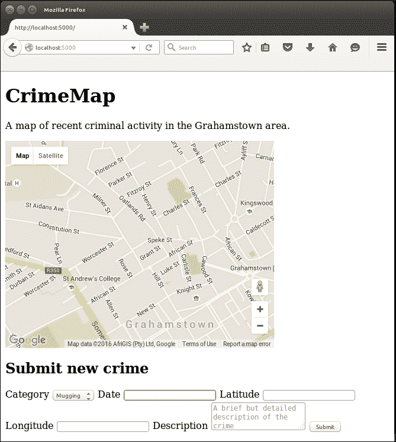
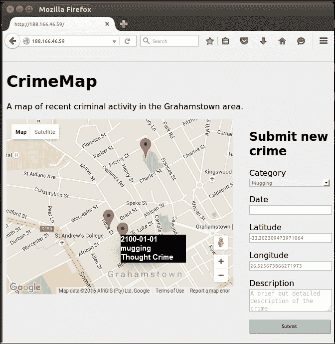

# 七、将谷歌地图添加到我们的犯罪地图项目中

在上一章中，我们建立了一个数据库，并讨论了如何通过 Flask 添加和删除数据。有了一个可以通过长期存储进行输入和输出的 web 应用，我们现在几乎拥有了所有 web 应用所需的构建块，并且只受到我们想象力的限制。

在本章中，我们将添加比上一章中的纯文本界面更多的功能；我们将添加嵌入式谷歌地图，允许用户以直观的方式查看和选择地理坐标。

谷歌地图是用 JavaScript 编写的，我们需要编写一些 JavaScript 代码来适应谷歌地图的需要。和往常一样，我们将为以前从未使用过 JavaScript 的读者提供一个旋风式教程，但如果您对巩固您的全包 web 应用知识感兴趣，现在是快速阅读两个特定于 JavaScript 的教程的好时机。如果您以前从未见过任何 JavaScript 代码，可以在[上找到类似于我们之前提供链接的 HTML 和 CSS 教程的简单介绍 http://www.w3schools.com/js/default.asp](http://www.w3schools.com/js/default.asp) 。

可以说，犯罪地图最重要的部分是地图本身。我们将使用 GoogleMapsAPI，它对开发者来说简单而强大，对用户来说直观。作为第一步，我们将添加一个基本地图，加载到我们选择的区域和缩放级别。一旦我们了解了这一点，我们将添加允许标记的功能。标记将为我们的地图提供两个用途：首先，我们将在地图上显示我们在数据库中保存的每个犯罪的位置上的标记；其次，当用户单击地图时，它将添加一个新标记，并允许用户提交一份新的犯罪报告（最终通过在表单字段中添加描述和日期）。

但是，首先，我们需要能够在本地再次运行应用进行开发和调试。将其链接到数据库后，这有点棘手；那么，我们来看看如何解决这个常见问题。

在本章中，我们将介绍以下主题：

*   在本地运行数据库应用
*   在我们的应用中添加一个嵌入式 GoogleMap 小部件
*   为新犯罪添加输入表单
*   在地图上显示现有犯罪

# 在本地运行数据库应用

为了开发并在本地进行调试，我们需要能够运行应用。然而，目前这是不可能的，因为 MySQL 只安装在我们的 VPS 上。在本地开发数据库应用有三个主要选项：

*   连接到 VPS 上的数据库，即使在本地计算机上运行 Flask
*   在本地计算机上安装 MySQL
*   使用 Python 在内存中创建数据库的“模拟”

虽然任何方法都可行，但我们将采用第三种方法。如果我们在远离 VPS 的位置进行开发，连接到生产数据库会导致我们受到延迟的影响，这也意味着我们会对生产数据库运行测试代码，这绝不是一个好主意。第二个选项将限制开发环境的可移植性，如果我们切换到新的开发环境，将增加安装时间，在最坏的情况下，将消耗大量本地资源。

## 创建我们数据库的模拟

如果您尝试在本地运行`crimemap.py`文件，您将看到的第一个错误是`ImportError`，因为我们没有`dbconfig.py`文件。在上一章中，我们直接在 VPS 上创建了这个文件，但没有将它签入 git，因为它包含敏感的数据库凭据。我们将创建`dbconfig.py`的本地副本，这表明我们的应用应该使用模拟数据库。我们将在我们的 VPS 上更新`dbconfig.py`文件，以表明在从那里运行应用时应该使用真实的数据库。我们将使用一个简单的布尔标志来实现这一点。

### 添加测试标志

在本地`crimemap`目录中，创建一个新的`dbconfig.py`文件并添加一行代码：

```py
test = True
```

现在，将 SSH 添加到您的VPS 中，并将该标志添加到生产配置中；尽管在这里，该值应设置为`False`，如下所示：

```py
ssh user@123.456.789.123
cd /var/www/crimemap
nano dbconfig.py

```

将以下内容添加到文件顶部：

```py
test = False
```

然后，键入*Ctrl*+*X*，然后键入*Y*保存并退出文件

现在，退出 SSH 会话。这将解决`ImportError`（`dbconfig.py`文件现在存在于我们的 VPS 和本地），我们的应用现在知道它是在测试中运行还是在生产中运行。

### 编写模拟代码

我们的标志实际上还没有做任何事情，我们不想在测试我们的应用时触发所有异常。相反，我们将编写一个数据库代码的“mock”（在`dbhelper.py`文件中的代码），它将返回基本的静态数据或`None`。当我们的应用运行时，它将能够正常调用数据库函数，但不会有实际的数据库。相反，我们将使用几行 Python 来模拟一个非常基本的数据库。在您的`crimemap`目录中创建`mockdbhelper.py`文件，并添加以下代码：

```py
class MockDBHelper:

  def connect(self, database="crimemap"):
    pass

  def get_all_inputs(self):
    return []

  def add_input(self, data):
    pass

  def clear_all(self):
    pass
```

正如您所注意到的，我们用于基本数据库应用的方法都存在，但没有做任何事情。`get_all_inputs()`方法返回一个空列表，我们仍然可以将其传递给模板。现在，如果处于测试环境中，我们只需要告诉我们的应用使用这个而不是真正的`DBHelper`类。在`crimemap.py`的导入部分末尾添加以下代码，确保删除`DBHelper`的现有`import`：

```py
import dbconfig
if dbconfig.test:
    from mockdbhelper import MockDBHelper as DBHelper
else:
    from dbhelper import DBHelper
```

我们在`dbconfig`中使用我们的测试标志来指定是导入真实的`DBHelper`（依赖于与 MySQL 的连接）还是导入模拟的`DBHelper`（不需要数据库连接）。如果导入 mock helper，我们可以更改名称，以便代码的其余部分可以继续运行，而无需对测试标志进行条件检查。

### 验证我们的期望

现在，您应该能够在本地运行代码，就像我们添加数据库依赖项之前一样。在终端中，运行：

```py
python crimemap.py

```

然后，在浏览器中访问`localhost:5000`，查看应用加载情况。检查终端的输出，以确保没有触发异常（如果您试图运行真实的`DBHelper`代码而不是我们刚才创建的模拟代码，则会发生这种情况）。虽然我们的应用不再“工作”，但我们至少可以运行它来测试不涉及数据库的代码。然后，当我们部署到生产环境中时，所有工作都应该与测试中的工作完全相同，但需要插入一个真正的数据库。

# 向我们的应用中添加嵌入式谷歌地图小部件

现在，我们想在我们的应用中添加一个地图视图，而不是基本输入框。GoogleMaps 允许您在不注册的情况下创建地图，但只能进行有限数量的 API 调用。如果你创建了这个项目，在网络上发布了一个链接，它就会像病毒一样传播，你有可能达到这个极限（目前每天加载 2500 张地图）。如果你认为这将是一个限制因素，你可以注册地图 API，并可以选择向谷歌支付更多容量。然而，如果你的应用不太受欢迎，免费版本将足以用于开发甚至生产。

## 将地图添加到我们的模板中

我们想在我们的应用主页上显示一张地图，所以这意味着在我们的`templates`目录中编辑`home.html`文件中的代码。删除所有现有代码，并将其替换为以下代码：

```py
<!DOCTYPE html>
<html lang="en">
  <head>
    <script type="text/javascript"
      src="https://maps.googleapis.com/maps/api/js">
    </script>

    <script type="text/javascript">
      function initialize() { 
        var mapOptions = {
          center: new google.maps.LatLng(- 33.30578381949298, 26.523442268371582),
          zoom: 15
        };
        var map = new
        google.maps.Map(document.getElementById("map- canvas"),mapOptions);
      }
     </script>

  </head>
    <body onload="initialize()">
    <div id="map-canvas" style="width:80%; height:500px;"></div>
    </body>
</html>
```

### 引入 JavaScript

让我们来看看这里发生了什么。第一行告诉我们用户的浏览器我们正在使用 HTML5。第 4 行到第 6 行包含了页面中所需的地图资源。注意，这是在`<script>`标记之间，表示它是 JavaScript。在这种情况下，我们实际上并没有编写 JavaScript 代码——我们只是链接到它在谷歌服务器上的托管位置。可以将此视为 Python`import`语句，但我们甚至不必在本地安装包；它只是在运行时由用户的浏览器“导入”的。

下面是显示基本地图的设置脚本。同样，这是在`<script>`标记之间，表示它是 JavaScript 而不是 HTML。这一次，我们实际上自己编写了 JavaScript 代码。该语法在方括号、大括号和`for`循环方面与 Java 相似。除了这个和它的名字之外，它和 Java 之间几乎没有什么关系。

JavaScript 代码的第一行是函数定义；与 Python 的“`def`类似，我们使用`function`关键字定义一个名为`initialise()`的新函数。我们用`var mapOptions =`声明了一个变量，并为这个变量分配了一个新的 JavaScript 对象，它看起来类似于 Python 字典。我们用一个类似经纬度元组的对象定义了一个位置，由于第 4 行到第 6 行的原因，我们可以访问该位置，并且该对象还包含一个“【T4]”级别。这些选项描述了我们的初始地图：应该显示哪个区域以及缩放级别。

最后，我们创建了一个新变量`map`，并初始化了一个 GoogleMap 对象，传入了一个 HTML 元素的 ID（我们将在下一节中详细解释）和刚才定义的映射选项。然后我们到达 JavaScript 代码的末尾，所以我们关闭了`<script>`标记。

### 我们的 HTML 代码的主体

虽然我们的`<body>`部分只有几行，但它有一些微妙之处。第一行打开`<body>`标签，并定义`onload`参数。此参数采用加载页面时将自动调用的 JavaScript 函数的名称。请注意，在我们的例子中，函数名（“`initialize`”，因为这是我们刚刚编写的函数，并且希望自动运行以创建映射），用倒逗号括起来。如果您想到 Python，这可能是违反直觉的，在 Python 中，反逗号主要用于字符串文本。可以将其视为将函数*名称*传递给 body block，但请注意，我们仍然使用开闭括号作为名称的一部分。

下一行创建一个`<div>`元素。通常情况下，`<div>`除了包含更多的 HTML 外，什么都不做，但这并不意味着我们这里看到的空`<div>`块是没有意义的。注意我们给出的`<div>`的 ID，`map-canvas`。这与 JavaScript 代码中的名称相匹配；也就是说，JavaScript 函数将查找名为`map-canvas`（使用`document.getElementById()`）的 HTML 元素，并将其转换为 GoogleMaps 小部件。因此，使用`<div>`元素是有意义的，因为我们希望 JavaScript 代码使用空元素。

最后，我们的`<div>`元素还包括一些内联 CSS。我们可以使用 CSS 的`height`和`width`属性定义地图的宽度和高度（这是谷歌地图 API 的要求）。在本例中，我们将映射定义为页面的恒定`height`值`500`像素和`width`值`80%`。宽度的百分比很有用，因为滚动功能经常因缩放功能而过载。也就是说，如果用户希望使用触摸板或鼠标滚轮在我们的页面上向下滚动，并且他或她的光标位于地图上，则地图将放大而不是向下滚动页面。因此，右侧 20%的“空白”空间为用户提供了在滚动时将鼠标移动到的位置。同样，对于触摸屏，用户在尝试滚动时会在地图周围“*平移*”，但在滚动时可以使用此空间放置手指。

### 测试与调试

我们现在应该能够在本地运行我们的 web 应用，并查看嵌入的谷歌地图。如果您的应用尚未运行，请使用您的终端再次启动并在浏览器中导航到`localhost:5000`。由于我们不在本地存储谷歌地图的代码，这需要从谷歌的服务器获取，因此我们需要本地机器联机才能工作（类似于获取我们的头条新闻应用所需的数据）。

调试 JavaScript 代码有点棘手，因为 Flask 不会注册任何错误，因此不会在应用输出中看到。如果您的网页是空白的或出现任何意外情况，首先要查看浏览器的开发人员控制台。这是一个可以在所有主要浏览器中找到的开发人员工具，通常通过按*Ctrl*+*Shift*+*C*并导航到出现的窗口或侧栏中的“**控制台**”选项卡。在这里，您将注意到代码触发的任何 JavaScript 错误或警告，因此此工具在调试 web 应用时非常有用。

尽管控制台应该报告行号和错误，但有时很难准确地跟踪出了什么问题。JavaScript 是一种动态类型的语言，它以一些非常古怪和违反直觉的行为而臭名昭著。如有必要，您还可以在 HTML 中的`<script>`标记之间添加 JavaScript 行，这些标记除了登录到开发人员工具控制台外，什么都不做。为此，请使用以下命令：

```py
console.log("A message");
```

这类似于 Python`print`语句，您可以传递变量和大多数对象，以查看它们的字符串表示形式记录到输出中。使用`+`符号连接。例如，如果您有一个名为“`a`”的变量，并且希望在代码中的特定点查看其值，则可以添加以下行：

```py
console.log("The value of a is: " + a);
```

要获得更复杂的调试方法，请查看开发人员工具窗口（或浏览器中的等效工具）的**调试器**选项卡，并在 JavaScript 中设置断点。开发人员工具通常是一套功能强大的工具，遗憾的是，它们的全部功能超出了本书的范围。以下屏幕截图显示了 Mozilla Firefox 开发人员控制台，在加载地图之前设置了断点：


一旦所有的 bug都被压扁（或者如果你细心且幸运的话，可以直接看到），你应该会在浏览器中看到一个页面，其中包含一个嵌入的谷歌地图，以南非**格拉姆斯敦**为中心。在 JavaScript 代码中使用`mapOptions`变量设置的缩放级别和坐标，以获得您选择的初始地图。点击并按住地图将允许“平移”或环游世界。缩放是通过鼠标中轮滚动、使用触摸板或触摸屏上的“收缩缩放”来完成的。结果应类似于以下屏幕截图：


现在让我们转到让我们的地图更具互动性和实用性。

## 让我们的地图互动

我们将在应用中添加的第一个功能将允许用户在地图上放置标记。这将最终允许用户通过指示犯罪发生的地点来添加犯罪报告，从而添加到我们的众包犯罪数据库中。我们还将使用“侦听器”在 JavaScript 中实现标记功能。

### 添加标记

JavaScript 是*事件驱动的*。诸如鼠标移动或鼠标单击之类的操作都是事件，我们可以通过设置事件侦听器来响应这些事件。监听器只是在后台运行，等待一个特定的事件，然后在检测到该事件时触发一个指定的操作。我们将为鼠标单击设置一个侦听器，如果检测到，我们将在单击鼠标时在鼠标位置放置一个地图标记。

使用 GoogleMapAPI，只需几行代码就可以实现这一点。首先，我们将`map`变量设为全局变量。然后，我们将创建一个`placeMarker()`函数，该函数将引用我们的`map`变量，并在调用时在其上放置一个标记。在我们现有的`initalise()`函数中，我们将添加一个点击监听器，在触发时调用`placeMarker()`函数。

这里可以看到完整的 JavaScript 代码，其中突出显示了修改后的行：

```py
<script type="text/javascript"
  src="https://maps.googleapis.com/maps/api/js">
</script>

<script type="text/javascript">

 var map;
  function initialize() { 
  var mapOptions = {
    center: new google.maps.LatLng(-33.30578381949298, 26.523442268371582),
    zoom: 15
  };
 map = new google.maps.Map(document.getElementById("map- canvas"), mapOptions);
 google.maps.event.addListener(map, 'click', function(event){ 
 placeMarker(event.latLng);
 });
  }

 function placeMarker(location) {
 var marker = new google.maps.Marker({
 position: location, 
 map: map
 });
  }
</script>
```

特别注意从`var map = new google.maps.Map`到`map = new google.maps.Map`的变化。我们删除了`var`声明，这意味着我们将新映射分配给全局`map`变量，而不是创建新的局部变量。

下一行打电话到`addListener()`，这看起来可能有点奇怪。当侦听器被触发时，`addListener()`函数需要调用`map`、`event`和`function`。与 Python 一样，JavaScript 具有一流的函数，这意味着我们可以将函数作为参数传递给其他函数。与 Python 不同，我们不需要使用`lambda`关键字来创建匿名函数；我们可以简单地声明要传递的函数来代替参数。在本例中，我们创建了一个匿名函数，它接受一个`event`参数，然后依次调用我们的`placeMarker()`函数，并将`event`的`latLng`属性传递给它。在我们的例子中，`event`是侦听器拾取的鼠标单击，`latLng`属性是鼠标单击的位置。

在我们的`placeMarker()`函数中，我们接受了一个位置并创建了一个新的`Marker`对象，将其放置在地图上传入的位置（这就是为什么我们将地图设置为全局；现在我们可以在这个新函数中引用它）。

总之，当页面加载时，我们将添加一个挂在后台等待点击的侦听器。当检测到点击时，监听器调用`placeMarker()`，传递检测到的点击的坐标。然后，`placeMarker()`功能在指定的坐标处添加一个标记，这意味着用户在单击地图时看到一个标记出现在地图上。如果事情没有按预期进行，请尝试使用浏览器中的控制台和调试器，就像我们以前所做的那样。每次单击时，您都会在地图上看到一个新的标记，并能够生成类似于以下屏幕截图的地图：


### 使用单个标记

为每次点击创建一个新的标记并不理想。我们实际上希望用户能够在每次单击时移动标记，而不是创建一个新的标记。一次增加一个以上的犯罪将过于复杂，也没有太大的用处。

为此，在现有全局`map`变量下创建另一个全局`marker`变量。然后，在`placeMarker()`函数中添加一个简单的条件，该条件仅在没有标记的情况下创建一个新标记，否则将移动现有标记的位置。

完整代码和高亮显示的修改行如下所示。再次注意，我们从创建新的`marker`变量的行中删除了`var`，因此使用了全局变量，而不是创建了局部变量。通过这些更改，每次单击地图都应该移动标记，而不是创建新标记。试一试：

```py
<script type="text/javascript"
  src="https://maps.googleapis.com/maps/api/js">
</script>

<script type="text/javascript">

  var map;
 var marker;
  function initialize() { 
    var mapOptions = {
    center: new google.maps.LatLng(-33.30578381949298, 26.523442268371582),
    zoom: 15
    };
    map = new google.maps.Map(document.getElementById("map- canvas"), mapOptions);
    google.maps.event.addListener(map, 'click', function(event){  
      placeMarker(event.latLng);
    });
  }

  function placeMarker(location) {
 if (marker) {
 marker.setPosition(location);
 } else {
 marker = new google.maps.Marker({
       position: location,
       map: map
     });
    }
  }
</script>
```

# 新增罪案录入表

我们希望用户能够指定更多的信息，而不仅仅是一个位置。下一步是创建一个表单，用户可以使用该表单将日期、类别和描述数据添加到犯罪提交中。这些信息的每个都将存储在我们在上一章中创建的数据库列中。创建 web 表单是一项非常常见的任务，有许多框架和插件可以帮助尽可能多地自动化流程，因为大多数表单都需要一个漂亮的前端，如果用户输入意外的输入，其中包括错误消息，以及后端逻辑来处理数据并进行更彻底的验证，以防止格式错误或不正确的数据污染数据库。

然而，本着学习的精神，我们现在将从头开始创建 web 表单的后端和前端。在我们的下一个项目中，我们将研究如何使用各种工具来做类似的事情，以减少流程中的工作量。

我们的目标是在地图右侧有许多输入字段，允许用户指定目击或经历过的犯罪的详细信息，并将其提交到现有数据中。表格应具有以下输入：

*   **类别**：一个下拉菜单，允许用户选择犯罪属于哪个类别
*   **日期**：一个日历，允许用户轻松输入犯罪的日期和时间
*   **说明**：一个较大的文本框，允许用户以自由格式文本描述犯罪
*   **纬度和经度**：根据使用标记选择的位置自动填充的文本框

填写上述字段后，用户应能够点击**提交**按钮，查看他或她刚刚提交的犯罪记录并显示在地图上。

## 表单的 HTML 代码

表单所需的 HTML 代码与我们早期项目中创建的表单非常相似，但它也有一些新元素，即`<textarea>`和`<label>`以及一个带有`type= "date"`的输入。`<textarea>`元素与我们前面提到的标准文本字段非常相似，但显示为一个较大的正方形，以鼓励用户输入更多文本。标签元素可以定义一个`for`属性来指定我们要标记的内容。打开和关闭`label`标记之间的文本随后显示在待标记元素附近。

这对我们的表单很有用，因为我们可以提示用户在每个字段中输入哪些数据。日期字段将提供一个不错的日历下拉菜单来选择日期。不幸的是，它是 HTML 的一个相当新的补充，并不是所有浏览器都支持它。在不受支持的浏览器（包括 Firefox）中，这将与文本输入完全相同，因此我们将在本章末尾了解如何处理用户输入的日期。

另外，请注意，我们将表单放在一个`<div>`元素中，以便更容易在页面上设置样式和位置（我们稍后也会这样做）。HTML 页面的完整`<body>`元素如下所示（请注意，我们在地图上方添加了标题和段落，而表单则在地图下方添加了。请看下面的代码：

```py
<body onload="initialize()">
  <h1>CrimeMap</h1>
  <p>A map of recent criminal activity in the Grahamstown area.</p>
  <div id="map-canvas" style="width:70%; height:500px"></div>

  <div id="newcrimeform">
   <h2>Submit new crime</h2>
   <form action="/submitcrime" method="POST">
    <label for="category">Category</label>
    <select name="category" id="category">
     <option value="mugging">Mugging</option>
     <option value="breakin">Break-in</option>
    </select>
    <label for="date">Date</label>
    <input name="date" id="date" type="date">
    <label for="latitude">Latitude</label>
    <input name="latitude" id="latitude" type="text">
    <label for="longitude">Longitude</label>
    <input name="longitude" id="longitude" type="text">
    <label for="description">Description</label>
    <textarea name="description" id="description" placeholder="A brief but detailed  description of the crime"></textarea>
    <input type="submit" value="Submit">
    </form></div>
</body>
```

刷新页面以查看地图下方的表单。您会注意到，不同大小的字段和水平布局看起来非常糟糕，如以下屏幕截图所示：



让我们添加一些CSS 来解决这个问题。

## 向我们的 web 应用添加外部 CSS

为了使表单显示在地图的右侧，我们将使用 CSS。我们已经为我们的地图添加了一些 CSS，我们可以以类似的方式添加更多 CSS。但是，请参考[第 5 章](05.html "Chapter 5. Improving the User Experience of Our Headlines Project")*中关于内联、内部和外部 CSS 的讨论，在*将 CSS 添加到标题应用*部分中改进头条项目*的用户体验，并记住，将所有 CSS 放在单独的文件中是最佳实践。因此，我们将创建一个 AutoT0x 文件，并考虑如何将它链接到我们的烧瓶应用。

### 在我们的目录结构中创建 CSS 文件

默认情况下，在 Flask 中，静态文件应该保存在名为`static`的目录中。我们最终希望在这里保存各种类型的文件，如图像、JavaScript 和 CSS，因此我们将创建一个名为`CSS`的子目录，并在其中创建`style.css`文件。导航到终端中的项目目录，并运行以下操作将此目录结构和文件添加到我们的项目中：

```py
mkdir –p static/css
touch static/css/style.css

```

### 添加 CSS 代码

将以下 CSS 代码插入此新文件中：

```py
body {
 font-family: sans-serif;
 background: #eee;
}

input, select, textarea {
 display: block;
 color: grey;
 border: 1px solid lightsteelblue;
 line-height: 15px;
 margin: 2px 6px 16px 0px;
 width: 100%;
}

input[type="submit"] {
 padding: 5px 10px 5px 10px;
 color: black;
 background: lightsteelblue;
 border: none;
 box-shadow: 1px 1px 1px #4C6E91;
}

input[type="submit"]:hover {
 background: steelblue;
}

#map-canvas {
 width: 70%;
 height: 500px;
 float: left;
}

#newcrimeform {
 float: right;
 width: 25%;
}
```

您可能会注意到与我们用于头条项目的 CSS 代码的相似之处。但是，仍有一些要点需要注意：

*   我们在这里定义了 ID 为`map-canvas`的任何元素的和`height`（在最后的第二个块中），因此我们可以从`body.html`文件中删除内联样式。
*   我们使用 CSS 的浮动功能将表单显示在地图的右侧而不是下方。地图占据页面`width`的`70%`，表单占据`25%`（最后 5%向左，以便地图和表单之间有一些空间。我们的地图浮动到页面的左侧，而表单浮动到右侧。因为它们占总宽度的不到 100%，所以它们将在浏览器中并排显示。）

### 配置烧瓶使用 CSS

通常在 HTML页面中，我们只需给出样式表的相对路径即可链接到外部 CSS 文件。在使用 Flask 时，我们需要将应用配置为将 CSS 文件作为静态文件返回。默认情况下，Flask 提供项目路径中名为`static`的目录中的文件，这就是为什么如前所述，将 CSS 文件放在这里很重要。Flask 可以为我们需要使用`url_for`函数链接的 CSS 文件生成 URL。在`home.html`模板中，在`<head>`部分的顶部添加以下行：

```py
<link type="text/css" rel="stylesheet" href="{{url_for('static', filename='css/style.css') }}" />
```

这在 HTML 和 CSS 之间创建了一个链接。我们使用属性将链接描述为一个`text/css`文件，它是一个样式表。然后，我们使用`url_for()`函数以`href`给出了它的位置。

我们还需要添加一行 JavaScript 代码，以便在创建或移动地图上的标记时自动填充位置输入。这是通过在`placeMarker()`功能中添加以下突出显示的行来实现的：

```py
function placeMarker(location) {
 if (marker) {
  marker.setPosition(location);
 } else {
  marker = new google.maps.Marker({
   position: location,
   map: map
  });
 }
 document.getElementById('latitude').value = location.lat();
 document.getElementById('longitude').value = location.lng();
}
```

这些行只需找到纬度和经度框（由其`id`属性标识）并插入用于放置标记的位置。当我们`POST`将表单发送到服务器时，我们将能够在后端读取这些值。

最后，删除我们前面添加的内联 CSS，因为这个功能现在由外部样式表负责。请看`home.html`文件中的以下行：

```py
<div id="map-canvas" style="width:70%; height:500px"></div>
```

可以将前一行修改为如下所示：

```py
<div id="map-canvas"></div>
```

### 查看结果

在浏览器中重新加载页面以查看结果。请记住，CSS 和 JavaScript 通常由浏览器缓存，因此，如果您看到意外行为，请点击*Ctrl*+*R*进行硬刷新。如果*Ctrl*+*R*不起作用，尝试点击*Ctrl*+*Shift*+*删除*并在浏览器菜单中选择**缓存**选项，清除浏览数据后再次刷新。

带有表单的样式化地图应类似于以下屏幕截图：


请注意，单击地图上的现在将用标记的坐标填充纬度和经度框。

### 公布结果

我们有表单、地图和一些 CSS，所以现在是将结果推送到 VPS 的好时机，这样我们就可以在不同的设备上看到它的样子，或者要求人们提供反馈。

要推动更改，请启动终端，将目录更改为根文件夹，然后运行以下操作：

```py
git add crimemap.py
git add templates/home.html
git add static
git commit –m "Map with form and CSS"
git push origin master

```

然后，将 SSH 连接到 VPS 中，并通过运行以下命令提取新代码：

```py
cd /var/www/crimemap
git pull origin master
sudo service apache2 reload

```

访问 VPS的 IP，检查页面是否正常工作，外观是否正确。如往常一样，如果发生意外情况，请查看`/var/log/apache2/error.log` 。

## 将表单链接到后端

有一个漂亮的表单来接受用户输入是很好的，但是目前，我们只是扔掉所有提交的数据。我们希望捕获输入并将其存储在数据库中，而不是像在标题应用中那样实时处理输入。让我们来看看如何做到这一点。

### 设置 URL 收集帖子数据

在我们的头条项目中，第一步是在服务器上设置一个 URL，数据可以发布到该 URL。在我们创建的 HTML 表单中，我们将此 URL 设置为`/submitcrime`，因此让我们在 Flask 应用中创建此 URL 作为路由。在`crimemap.py`中增加以下功能：

```py
@app.route("/submitcrime", methods=['POST'])
def submitcrime():
 category = request.form.get("category")
 date = request.form.get("date")
 latitude = float(request.form.get("latitude"))
 longitude = float(request.form.get("longitude"))
 description = request.form.get("description")
 DB.add_crime(category, date, latitude, longitude, description)
 return home()
```

在这里，我们只需抓取用户输入的所有数据并将其传递给我们的数据库助手。我们在前面的代码中使用了`DB.add_crime()`函数，但这还不存在。我们需要它为我们的真实`DBHelper`向我们的数据库添加新数据，我们还需要`MockDBHelper`的这个函数的存根。让我们看看如何添加这些。

### 添加数据库方法

在`MockDBHelper.py`中，功能很简单。它需要接受相同的参数，然后不做任何事情。将以下内容添加到`mockdbhelper.py`：

```py
def add_crime(self, category, date, latitude, longitude, description):
  pass
```

真正的函数需要添加到`dbhelper.py`中，并且需要更多的参与。看起来：

```py
def add_crime(self, category, date, latitude, longitude, description):
  connection = self.connect()
  try:
    query = "INSERT INTO crimes (category, date, latitude, longitude, description) \
      VALUES (%s, %s, %s, %s, %s)"
    with connection.cursor() as cursor:
      cursor.execute(query, (category, date, latitude, longitude, description))
      connection.commit()
  except Exception as e:
    print(e)
  finally:
    connection.close()
```

这里没有我们以前没见过的东西。我们使用占位符值，只在`cursor.execute()`语句中填充它们，以避免 SQL 注入，并在`finally`块中关闭连接，以确保总是发生这种情况。

### 在服务器上测试代码

下面是另一个好的观点，可以将所有更改提交到存储库，并快速检查 bug。一旦新代码在 VPS 上运行，请访问您的 IP 地址并填写我们制作的表单，尝试将犯罪添加到数据库中。在 VPS 上，您可以通过运行以下命令来检查以确保数据已成功添加。请注意，这将启动一个 live SQL shell—一个与数据库的直接连接，应该谨慎使用。输入错误的命令可能导致数据无法挽回地丢失或损坏。运行以下命令：

```py
mysql –p
<your database password>
use database crimemap
select * from crimes;

```

您将看到 MySQL 打印了一个漂亮的 ASCII 表，其中显示了数据库中数据的摘要，如下面的屏幕截图所示（在本例中，显示了`crimemap`数据库的`crimes`表中的所有记录和列）：


# 在地图上显示现有犯罪

现在，用户可以将新的犯罪添加到我们的犯罪数据库中，但我们希望地图也显示已经添加的犯罪。为了实现这一点，无论何时加载页面，我们的应用都需要对数据库进行调用，以获取最新的犯罪数据。然后，我们需要将这些数据传递到模板文件，循环遍历每个犯罪，并在地图上的正确位置放置一个标记。

现在，我们的数据存储在一个 MySQL 数据库中。我们将在服务器端使用 Python 访问它，并希望在客户端使用 JavaScript 显示它；因此，我们需要花费一些时间将数据转换为适当的格式。当我们通过 Python`pymysql`驱动程序访问数据时，我们将以元组的形式接收数据。要使用 JavaScript 显示数据，我们需要 JSON 格式的数据。您可能还记得，在我们的头条项目中，JSON 是 JavaScript 对象表示法，一种 JavaScript 可以轻松读取和操作的结构化数据格式。与前面的项目一样，我们将利用 Python 字典与 JSON 非常相似的事实。我们将从数据库中获取的元组创建一个 Python 字典，将其转换为 JSON 字符串，并将其传递给模板，模板将使用 JavaScript 将数据显示为地图上的标记。

## 从 SQL 获取数据

我们将从我们的`DBHelper`类开始，添加一个方法来返回数据库中每个犯罪所需的字段。将以下方法添加到您的`dbhelper.py`文件中：

```py
def get_all_crimes(self):
 connection = self.connect()
 try:
  query = "SELECT latitude, longitude, date, category, description FROM crimes;"
  with connection.cursor() as cursor:
   cursor.execute(query)
  named_crimes = []
  for crime in cursor:
   named_crime = {
    'latitude': crime[0],
    'longitude': crime[1],
    'date': datetime.datetime.strftime(crime[2], '%Y- %m-%d'),
    'category': crime[3],
    'description': crime[4]
   }
   named_crimes.append(named_crime)
  return named_crimes
 finally:
  connection.close()
```

另外，通过以下方式将`datetime`模块所需的新`import`添加到`dbhelper.py`的顶部：

```py
import datetime
```

我们忽略了`id`和`updated_at`字段，因为用户使用`SELECT`操作符选择所有其他字段时对这些字段不感兴趣。由于我们没有`WHERE`子句，此查询将返回数据库中的所有罪行。一旦我们有了所有的罪状，我们就可以简单地返回它们的默认表示形式的元组。然而，这使得应用的维护变得困难。我们不想记住，`latitude`是元组的第一个元素，`longitude`是第二个元素，依此类推。这将使开发应用的 JavaScript 部分成为一件痛苦的事情，因为我们必须不断引用`DBHelper`，以了解如何准确地获取数据中的`category`元素。如果我们想在将来对应用进行更改，可能需要在此处和 JavaScript 代码中进行相同的更改。

相反，我们将从每个记录创建一个字典并返回字典。这有两个优点：第一，开发起来容易得多，因为我们可以通过名称而不是索引引用数据元素；第二，我们可以轻松地将字典转换为 JSON，以便在 JavaScript 代码中使用。对于字典中的大多数项，我们将只使用数据库列名作为键，数据本身作为值。例外情况是日期；我们的数据库驱动程序将其作为 Python`datetime`对象返回，但我们希望将其作为字符串显示给用户，因此在将其存储到字典中之前，我们将其格式化为“yyy-mm-dd”。

我们可以将这个方法的存根添加到我们的`MockDBHelper`中，这样我们就可以在没有数据库的情况下继续在本地运行代码。在本例中，我们不只是返回一个空白列表，我们还将返回一个模拟犯罪，其格式与我们期望从真实的`DBHelper`中得到的格式相同。让您创建的任何模拟类的行为与其真正的等价类类似是一种很好的做法，因为这有助于在我们仍在本地测试时捕获开发错误。

在`mockdbhelper.py`中增加以下功能：

```py
def get_all_crimes(self):
 return [{ 'latitude': -33.301304,
    'longitude': 26.523355,
    'date': "2000-01-01",
    'category': "mugging",
    'description': "mock description" }]
```

## 将数据传递给我们的模板

现在我们已经能够通过调用单个函数从数据库中检索所需的数据，让我们看看我们将如何在主 Flask 应用中使用它，并将其传递到模板文件。

每次用户访问我们的主页时，我们都希望从数据库中获取犯罪数据，并将其以 JSON 格式传递给模板，以便使用 JavaScript 在用户浏览器中显示。由于大部分的艰苦工作都是在我们的`DBHelper`课上完成的，所以我们可以保持`home()`函数的整洁。整个函数如下所示：

```py
@app.route("/")
def home():
 crimes = DB.get_all_crimes()
 crimes = json.dumps(crimes)
 return render_template("home.html", crimes=crimes)
```

我们将使用`json.dumps()`函数，它与我们在第一个项目中使用的`json.loads()`相反，用于为我们的字典创建一个 JSON 字符串（在`dumps`中字母“`s`”代表“字符串”），然后将 JSON 字符串传递给我们的模板，以便它可以使用它填充地图。

我们还需要为 JSON 库添加一个导入。在`crimemap.py`顶部附近，添加以下行：

```py
import json
```

## 使用我们模板中的数据

我们的模板现在可以访问数据库中所有犯罪的 JSON 格式列表，我们可以使用该列表在地图上显示每个现有犯罪的标记。我们希望使用位置数据来选择放置标记的位置，然后我们希望嵌入`category`、`date`和`description`作为标记的标签。这意味着当用户将鼠标移到其中一个标记上时，将显示该标记所代表的犯罪信息。

我们需要在`home.html`文件中的 JavaScript 代码中添加一个新函数。在`initialize()`功能下，添加以下内容：

```py
function placeCrimes(crimes) {
 for (i=0; i<crimes.length; i++) {
  crime = new google.maps.Marker( {
   position: new google.maps.LatLng(crimes[i].latitude, crimes[i].longitude),
   map: map,
   title: crimes[i].date + "\n" + 
    crimes[i].category + "\n" + crimes[i].description
   }
  );
 }
}
```

这个函数接受一个参数`crimes`，循环遍历它，并为列表中的每个犯罪在地图上创建一个新的标记（我们现在可以引用它，因为我们以前将它作为一个全局变量）。我们使用对`google.maps.Marker()`的调用来创建标记并传入一个参数字典（在本例中，是一个`google.maps.LatLng()` `position`，我们根据`latitude`和`longitude` 参数构造了一个`google.maps.LatLng()` `position`；参考我们的地图，即`map`；以及我们的`date`、`category`和`description`的串联，由新行字符分隔为`title`。

### 提示

**定制谷歌地图标记**

我们放置的标记可以进行大量定制。我们可以传递的选项的完整列表见[https://developers.google.com/maps/documentation/javascript/reference?hl=en#MarkerOptions](https://developers.google.com/maps/documentation/javascript/reference?hl=en#MarkerOptions) 。

剩下的就是在`initialize()`函数中调用新函数，并传入我们在 Python 中构建的 JSON 映射列表。此处显示了整个`initialize()`功能，并突出显示了新的部分：

```py
function initialize() { 
 var mapOptions = {
  center: new google.maps.LatLng(-33.30578381949298, 26.523442268371582),
  zoom: 15
 };
 map = new google.maps.Map(document.getElementById("map- canvas"), mapOptions);
 google.maps.event.addListener(map, 'click', function(event){  
  placeMarker(event.latLng);
 });
 placeCrimes({{crimes | safe}});
}
```

我们只是调用了我们的`placeCrimes()`函数，并传入了罪状。请注意，我们使用了 Jinja 内置的`safe`功能，使用`|`（管道）符号并传递`crimes`数据。这是必要的，因为默认情况下，Jinja 会转义大多数特殊字符，但我们需要将 JSON 字符串原样解释为所有特殊字符的原始字符串。

然而，通过使用`safe`函数，我们告诉 Jinja 我们知道我们的数据是安全的，在这个阶段，情况未必如此。仅仅因为我们没有恶意的意图，并不意味着我们所有的数据本质上都是安全的。请记住，大部分数据都是由我们的用户提交的，因此我们的数据绝对不安全。在确保应用按预期工作（正常、预期使用）后，我们将立即查看我们在应用中打开的安全漏洞。

### 注

如果您熟悉*nix shell，`|`或管道应该是非常简单的语法。如果不是，则将其视为具有输入和输出的常用函数。我们不会将输入作为参数传递到括号中，并使用某种形式的`return`函数来获得输出，而是将输入放在`|`符号的左侧，函数名称放在右侧（在本例中为`safe`。输入通过函数进行管道传输，我们只保留输出。这种语法对于将许多函数链接在一起非常有用，因为每个外部函数都简单地放在另一个`|`符号之后的右侧。

## 查看结果

首先，在本地测试代码。这将确保一切仍在运行，并可能捕获一些更微妙的 bug。由于我们正在为数据库功能使用一个 mock，在我们看到它在 VPS 上运行之前，我们不会对它的工作有太多信心。

在终端中运行`python crimemap.py`并在浏览器中访问`localhost:5000`后，您将看到以下内容：


我们可以注意到一个带有我们在`MockDBHelper`中指定细节的标记。在屏幕截图中，我们将鼠标移到标记上，使`title`显示犯罪的所有细节。

现在到了`commit`到`git`的时候了，我们的副总裁也来了。从您的`crimemap`目录本地运行以下命令：

```py
git add crimemap.py
git add dbhelper.py
git add mockdbhelper.py
git add templates/home.html
git commit –m "add new crimes functionality"
git push origin master

```

然后，通过 SSH 连接到 VPS 以获取新的更改：

```py
ssh username@123.456.789.123
cd /var/www/crimemap
git pull origin master
sudo service apache2 reload

```

如果我们现在访问 VPS 的 IP地址，我们应该在能够显示之前看到我们添加的两个犯罪。当我们使用真实的`DBHelper`和我们的 MySQL 数据库用于生产站点时，我们应该能够使用表单添加犯罪，并将每个犯罪添加为地图上的实时标记。希望您能获得与以下屏幕截图类似的内容：



如果事情没有按预期进行，请始终在 VPS 上运行以下命令，并在访问站点时查看输出：

```py
tail –f /var/log/apache2/error.log

```

此外，使用浏览器的调试器，按*Ctrl*+*Shift*+*C*来捕获可能出现的任何 JavaScript 错误。

我们的犯罪地图现在已经可以使用了，可以用来追踪一个城镇的犯罪情况，并随时通知人们。然而，在进入最终项目之前，我们仍将在下一章中添加一些收尾工作。

# 总结

在本章中，我们介绍了如何使用 Python 创建模拟数据库，以便在不需要访问真实数据库的情况下开发应用。我们还向应用中添加了一个谷歌地图小部件，允许用户通过单击地图轻松提交纬度和经度，同时还可以查看现有犯罪的位置和描述。

在下一章中，我们将研究另一个注入漏洞 XSS，并讨论如何防范它以及一般的输入验证。