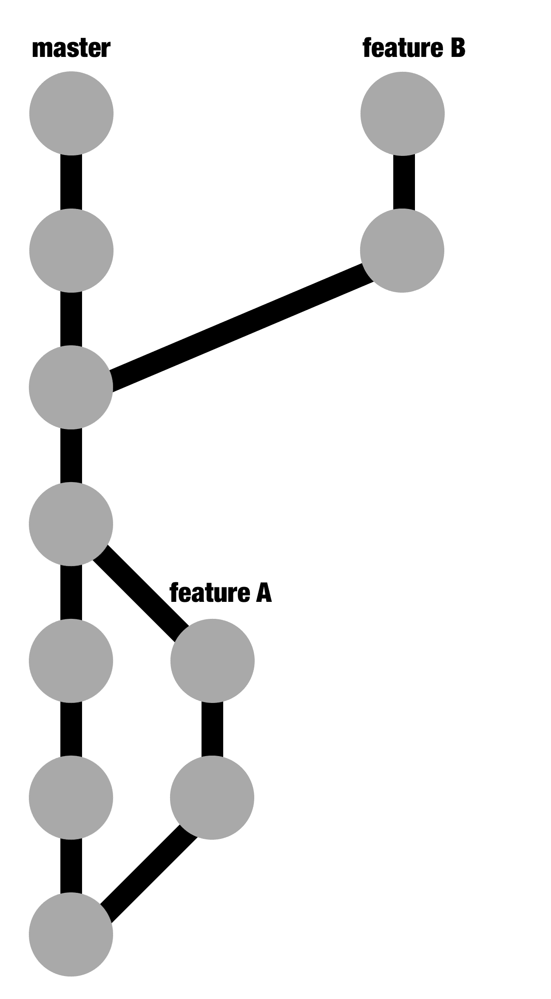
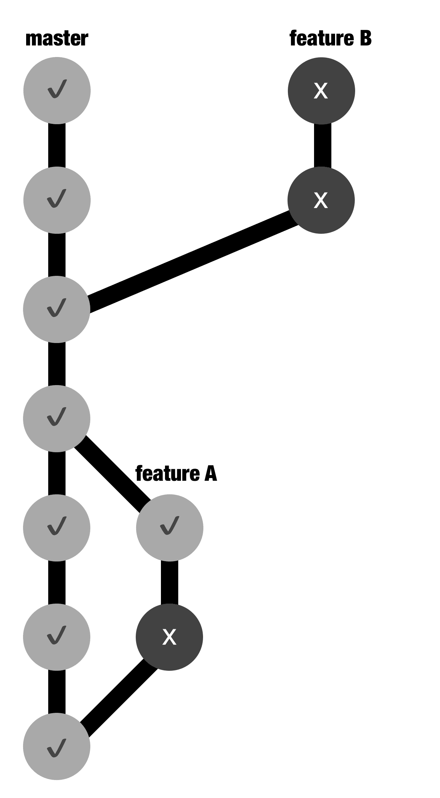
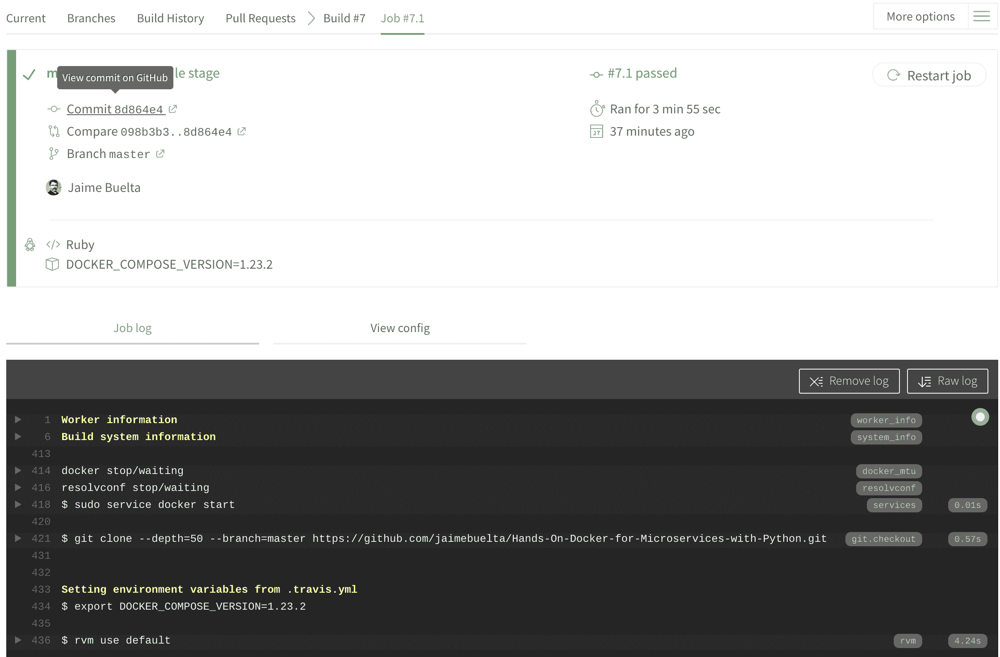
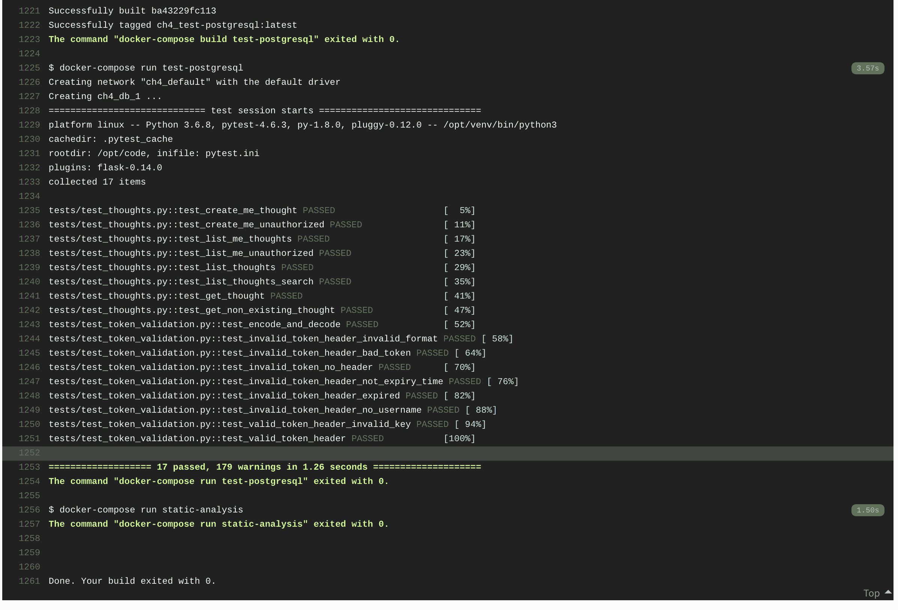
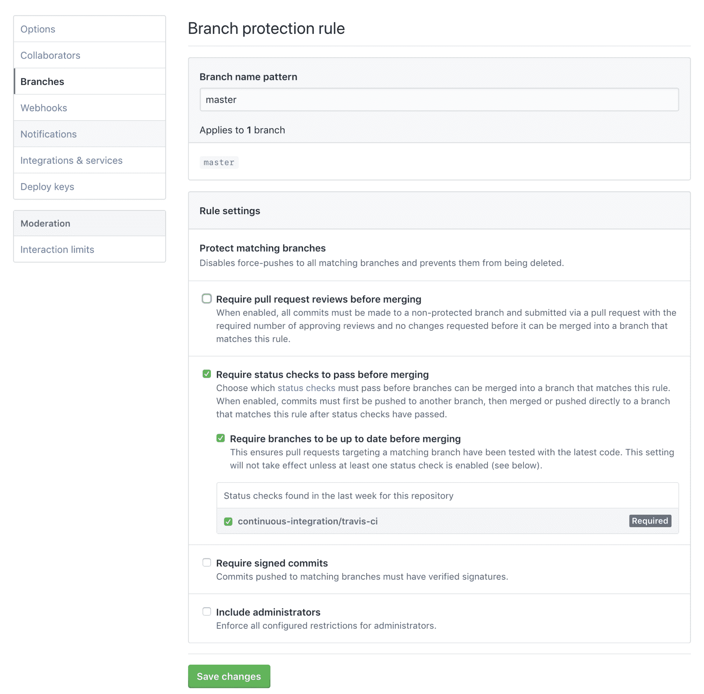
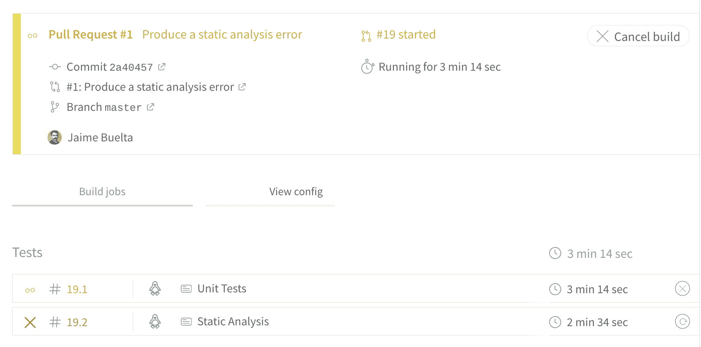
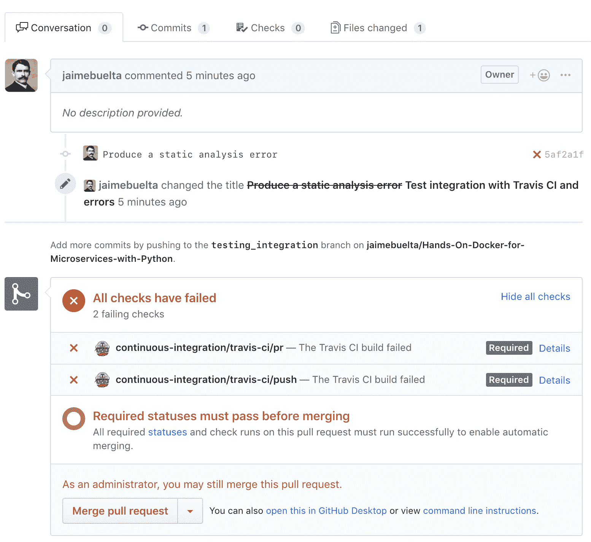
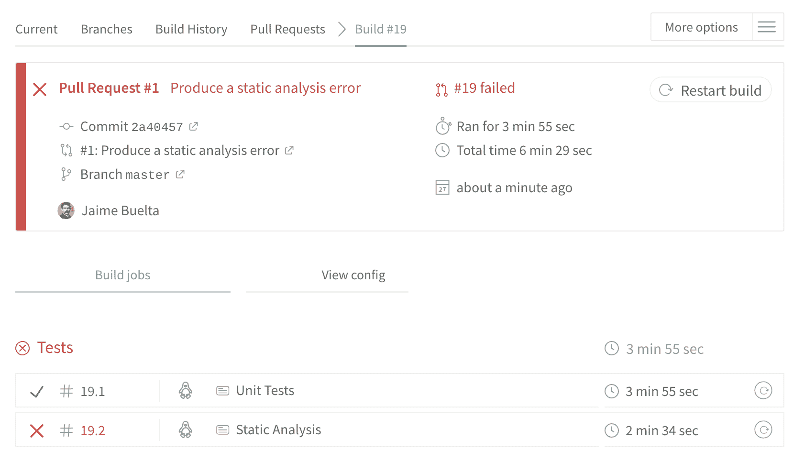

# 四、创建管道和工作流

在工作流中通过不同阶段自动运行的管道将及早发现问题，并帮助您的团队以最有效的方式协作。

在本章中，我们将遵循持续集成实践，在每次更改时自动运行管道，以确保我们的所有代码都遵循高质量标准，并且运行并通过所有测试。我们还将准备一个容器投入生产。

我们将了解如何利用 GitHub 和 Travis CI 等工具以最少的干预创建图像。

在本章中，我们将介绍以下主题：

*   理解持续集成实践
*   配置 Travis CI
*   配置 GitHub
*   从 Travis CI 推送 Docker 图像

在本章结束时，您将了解如何在每次代码更改时自动运行测试，以及如何创建一个安全网，使您能够更快、更高效地开发。

# 技术要求

您需要一个 GitHub 帐户，并且需要是为持续集成而设置的项目的所有者。我们将创建一个 Travis CI 帐户作为本章的一部分。

您可以在 GitHub（[的`Chapter04`子目录中签出本章中提到的完整代码 https://github.com/PacktPublishing/Hands-On-Docker-for-Microservices-with-Python/tree/master/Chapter04](https://github.com/PacktPublishing/Hands-On-Docker-for-Microservices-with-Python/tree/master/Chapter04) ）。以`.travis.yml`结尾的文件位于根目录（[中 https://github.com/PacktPublishing/Hands-On-Docker-for-Microservices-with-Python/blob/master/.travis.yml](https://github.com/PacktPublishing/Hands-On-Docker-for-Microservices-with-Python/blob/master/.travis.yml) ）。

# 理解持续集成实践

**持续集成**（通常缩写为**CI**）是确保代码始终处于工作状态的一系列软件工程实践。

术语持续集成源于历史上必须频繁集成软件，通常是一天多次。这是因为开发人员使用的本地代码不一定自动与其他人的代码连接在一起。现在，使用诸如 Git 之类的源代码管理版本控制软件可以使一些元素自动可用。

持续集成强调始终具有潜在的可发布代码。这使得发布成为可能，只需少量的代码增量。

Making more releases more often actually generates an increase in the quality of each release. More deployments also mean that each deployment is smaller, reducing the possibility of a big problem. Even if it sounds counterintuitive, faster deployment is highly correlated with higher quality in deployments and fewer production problems.

The objective here is to be able to increase the deployment speed. But for that, we need to be sure to build a good safety net that checks (automatically) that what we're doing is safe to release. That's where all the CI practices come into play.

在将所有流程和基础设施设置到位之后，很有可能每天多次实现发布（假设代码生成速度足够快）。可能需要一段时间才能达到目标，但一定要花时间了解过程并制作所有必要的工具，以确保在不牺牲稳定性的情况下获得速度。相信我，这是完全可以实现的！

# 生成自动构建

CI 的核心元素是生成与源代码管理系统集成的自动化构建。软件构建是（从源代码开始）执行一系列操作并生成输出的过程。如果项目是用编译语言编写的，那么输出通常是编译后的程序。

如果我们想要有高质量的软件，那么构建的一部分包括检查生成的代码是否符合代码标准。如果代码不遵循这些标准，那么构建将返回一个错误。

A common way of describing errors on a build is to say that the *build is broken*. A build can break in different ways, and some kinds of error may stop it early (such as a compilation error before running tests) or we can continue to detect further issues (such as running all tests to return all possible errors).

可作为构建一部分的一些步骤示例如下：

*   编译代码。

Python usually doesn't need to be compiled, but it might be required if you use C extensions (modules written in C and imported from Python: [https://docs.python.org/3/extending/](https://docs.python.org/3/extending/)) or tools such as Cython ([https://cython.org/](https://cython.org/)[).](https://cython.org/)

*   运行单元测试
*   运行静态代码分析工具
*   构建一个或多个容器
*   使用安全（[等工具检查已知漏洞的依赖性 https://pyup.io/safety/](https://pyup.io/safety/) ）
*   生成用于分发的二进制或源程序包。例如，RPM（[https://rpm.org/](https://rpm.org/) 、Debian 软件包（[https://www.debian.org/doc/manuals/debian-faq/ch-pkg_basics](https://www.debian.org/doc/manuals/debian-faq/ch-pkg_basics) ），等等
*   运行其他类型的测试
*   从代码生成报告、图表或其他资产

任何可以自动运行的东西都可以成为构建的一部分。本地构建可以随时生成，即使代码仍在进行中。这对于调试和解决问题很重要。但自动构建将针对每个提交运行，而不是在任何中间阶段。这使得检查哪些代码预计将在生产中运行以及哪些代码仍在运行中变得非常明确。

Note that a single commit may still be work in progress, but it will be worth committing anyway. Maybe it's a single step toward a feature, more than one person is working on the same part of the code, or it's work spread over several days and the code gets pushed at the end of the day. No matter, each commit is a reproducible step that can be built and checked whether the build is successful or not.

为每个提交运行构建会非常快地检测到问题。如果提交很小，则很容易确定突破性的更改。它还可以很容易地恢复破坏构建的更改，并返回到已知的工作代码。

# 了解使用 Docker 进行构建的优势

构建的主要传统问题之一是拥有一个适当的构建环境，该环境具有运行完整构建所需的所有依赖项。这可能包括编译器、运行测试的测试框架、任何静态分析工具和包管理器。版本差异也可能产生错误。

正如我们以前所看到的，Docker 是封装我们软件的一种极好的方式。它允许我们创建一个映像，其中包含我们的代码和能够执行所有步骤的所有工具。

在前一章中，我们看到了如何基于构建映像在单个命令中运行单元测试。映像本身可以运行自己的单元测试。这将抽象测试环境并显式定义它。这里唯一需要的依赖是安装 Docker。

请记住，单个构建可以生成多个映像，并使它们协同工作。在上一章中，我们看到了如何通过生成服务映像和数据库映像来运行单元测试，但是还有更多可能的用法。例如，您可以检查在两个不同操作系统上运行的测试，从每个操作系统或不同的 Python 解释器版本创建两个映像，并检查测试是否全部通过。

Docker 映像的使用允许在所有环境中实现标准化。我们可以在开发环境中本地运行映像，使用与自动化环境中相同的命令。这简化了查找 bug 和问题的过程，因为它在运行构建的任何地方都创建了相同的环境，包括封装的操作系统。

Do not underestimate this element. Before that, a developer working on a laptop running Ubuntu and keen to run code to be deployed in CentOS needed to install a **Virtual Machine** (**VM**) and follow steps to have an environment similar to the one in production. But invariably, the local VM would deviate as it was difficult to keep every developer's local VM in sync with the one in production; also, any automated-build tool might also have requirements, such as not supporting an old version of CentOS running in production.

To make things worse, sometimes different projects were installed on the same VM, to avoid having one VM per project, and that may cause compatibility problems.

Docker massively simplifies this problem, in part forcing you to explicitly declare what the dependencies are, and reducing the surface actually required to run our code.

注意，我们不一定需要创建运行整个构建的单个步骤；它可以是多个 Docker 命令，甚至可以使用不同的图像。但要求是它们都包含在 Docker 中，Docker 是运行 Docker 所需的唯一软件。

使用 Docker 构建的主要产品是 Docker 映像。我们需要正确地标记它们，但前提是构建成功。

# 利用管道概念

CI 工具有助于阐明构建应该如何进行，以及如何围绕管道的概念进行工作。管道是阶段的集合。如果其中任何一个失败，管道将停止。

管道中的每个阶段都可以生成元素，这些元素可以在以后的阶段使用，或者作为完整构建的最终产品提供。这些最终元素称为工件。

让我们看一个管道示例：


第一阶段从源代码管理系统提取最新提交。然后，我们构建所有容器并运行测试和静态分析。如果所有操作都成功，我们将标记生成的`server`容器并将其推送到注册表。

The order in which these stages run should be oriented at detecting problems as quickly as possible to give quick feedback. For example, if the `static-analysis` stage is much faster than the `test` stage, putting the analysis stage first will make a failing build finish earlier. Be aware of which parts can be executed earlier to reduce the feedback time.

CI 工具通常允许在管道中进行良好的配置，包括并行运行不同阶段的可能性。为了能够并行运行阶段，它们需要能够并行化，这意味着它们不应该更改相同的元素。

如果所选 CI 工具允许并行运行阶段，则管道可定义如下：


注意，我们并行地构建数据库和测试映像。下一阶段将构建其余的元素，这些元素已经在缓存中可用，因此将非常快。测试和静态分析都可以在两个不同的容器中并行运行。

这可能会加快复杂的构建。

Be sure to validate that the amount of time taken reduces. There are cases where the time taken will be very similar. For example, static analysis could be very fast or the hardware you run it on may be not powerful enough to build things in parallel, making the time taken to build in parallel and sequentially very similar. So, always validate your assumptions.

管道在特定于 Travis CI 工具的脚本中描述。稍后，我们将查看 Travis CI 的一个示例。

# 分支、合并并确保主构建清晰

我们什么时候运行构建？每次推送提交时。但每个结果都不一样。在处理诸如 Git 之类的源代码管理系统时，我们通常有两种分支：

*   一个主要分支
*   特征分支

它们实现了一个特定的功能或错误修复，准备就绪后将合并到主分支中，如下图所示：



在本例中，我们看到主分支（**主分支**如何分支以开发**特性****A**。之后简要介绍了**特性****A**。有一个**功能 B**尚未合并，因为它还没有准备好。有了关于构建成功与否的额外信息，我们可以知道何时将功能分支合并到主分支中是安全的：



尚未合并的功能分支中的中断并不严重，但在工作进行中，预计会发生。同时，主分支中的断裂是一个应尽快修复的事件。如果主分支状态良好，则意味着它具有潜在的可发布性。

GitHub 对此有一个模型：pull 请求。我们将配置 pull 请求，以自动检查构建是否已通过并避免合并。如果我们在合并回主分支之前强制任何功能分支也与主分支保持最新，则主分支将非常稳定。

For dealing with branches in Git to define releases, the most popular model is Git-flow, defined in this influential blog post ([https://nvie.com/posts/a-successful-git-branching-model/](https://nvie.com/posts/a-successful-git-branching-model/)). The following CI practices allow simplify things a bit and don't deal with elements such as release branches. This blog post is a highly recommended read.

在主分支中拥有一条连续不断的成功构建线也非常有助于培养项目的稳定性和质量感。如果主分支中断非常罕见，那么使用最新的主分支创建新版本的信心非常高。

# 配置 Travis CI

特拉维斯 CI（[https://travis-ci.com/](https://travis-ci.com/) 是一种流行的持续集成服务，可免费用于公共 GitHub 项目。与 GitHub 的集成非常简单，它允许您配置运行它的平台，如 macOS、Linux 甚至 iOS。

Travis CI 与 GitHub 紧密集成，因此您只需登录 GitHub 即可访问它。我们将看看如何将我们的项目连接到它。

For clarity, only the code in this chapter will be hooked up to Travis.

Travis 的工作原理与其他 CI 工具稍有不同，它通过启动一个新的 VM 来创建独立的作业。这意味着为前一阶段创建的任何工件都需要复制到其他地方，以便在下一阶段开始时下载。

这使得事情有时有点不切实际，一个简单的解决方案是为每个工作构建多次。

Configuring a remote system such as Travis CI can be a little frustrating sometimes, as it requires you to push a commit to be built to see if the configuration is correct. Also, it gets configured with a YAML file, which can be a bit temperamental in terms of syntax. It will take you a few attempts to get something stable, but don't worry. Once it is set up, you can change it only via a specific pull request as the configuration file is also under source control.

You can also check the requests in the Travis CI configuration to see if a `.yml` file creates a parse error.

You can check full Travis CI documentation here: [https://docs.travis-ci.com/](https://docs.travis-ci.com/).

要配置 Travis CI，我们先从 GitHub 添加一个存储库开始。

# 向 Travis CI 添加回购协议

要向 Travis CI 添加回购，我们需要采取以下步骤：

1.  第一阶段是转到 Travis CI 网页并使用 GitHub 凭据登录。
2.  然后，您需要通过激活 GitHub 来授予 Travis 对 GitHub 的访问权。
3.  然后，选择要构建的回购。

The easiest starting point is to fork the repo with the examples from this book in [https://github.com/PacktPublishing/Hands-On-Docker-for-Microservices-with-Python](https://github.com/PacktPublishing/Hands-On-Docker-for-Microservices-with-Python). Feel free to do so!

But remember to change the usernames, credentials, and registry information to match your own.

您需要拥有 GitHub 回购协议的所有者权限，然后就可以开始了！

# 创建.travis.yml 文件

Travis CI 中的主要元素是创建`.travis.yml`文件。

Be sure to name it exactly like this (including the initial dot and the `.yml` extension) and include it in the root directory of your GitHub repo. If not, Travis CI builds won't start. Please note that, in the example repo, the file is in the **root directory** and **not** under the `Chapter04` subdirectory.

`.travis.yml`描述了构建及其不同步骤。生成在一个或多个 VM 中执行。可以通过指定通用操作系统和特定版本来配置这些 VM。默认情况下，它们运行在 Ubuntu Linux 14.04 Trusty 中。您可以在此处找到有关可用操作系统的更多信息：[https://docs.travis-ci.com/user/reference/overview/](https://docs.travis-ci.com/user/reference/overview/) 。

使用 Docker 可以让我们抽象出大多数操作系统的差异，但我们需要确保我们使用的具体的`docker`和`docker-compose`版本是正确的。

我们将启动`.travis.yml`，使用以下代码确保存在有效的`docker-compose`版本（1.23.2）：

```py
services:
  - docker

env:
  - DOCKER_COMPOSE_VERSION=1.23.2

before_install:
  - sudo rm /usr/local/bin/docker-compose
  - curl -L https://github.com/docker/compose/releases/download/${DOCKER_COMPOSE_VERSION}/docker-compose-`uname -s`-`uname -m` > docker-compose
  - chmod +x docker-compose
  - sudo mv docker-compose /usr/local/bin
  - docker --version
  - docker-compose version
```

`before_install`块将在所有虚拟机中执行。现在，为了运行测试，我们添加了一个`script`块：

```py
script:
- cd ch4
- docker-compose build db
- docker-compose build static-analysis
- docker-compose build test-postgresql
- docker-compose run test-postgresql
- docker-compose run static-analysis
```

我们构建所有要使用的映像，然后运行测试。请注意，使用 PostgreSQL 数据库运行测试需要构建`db`容器。

There's a small detail about the `db` container: the Travis VM doesn't allow us to open port `5432`. We removed `ports` in `docker-compose` for that. Note that this only makes PostgreSQL available externally for debugging purposes; internally, the containers can talk to each other through their internal network.

We created a `db-debug` service that's a copy of `db` but it exposes the port for local development. You can check it in the `docker-compose.yaml` file at [https://github.com/PacktPublishing/Hands-On-Docker-for-Microservices-with-Python/blob/master/Chapter04/docker-compose.yaml](https://github.com/PacktPublishing/Hands-On-Docker-for-Microservices-with-Python/blob/master/Chapter04/docker-compose.yaml).

这将运行所有测试。在推进回购之后，我们可以看到构建在 Travis CI 中开始：


一旦它完成，我们可以通过它被标记为绿色的事实来判断构建是否成功。然后可以检查日志以了解更多信息：



现在您可以在日志末尾看到测试：



这对于检测问题和构建中断非常有用。现在，让我们看看特拉维斯的工作是如何运作的。

# 与特拉维斯·乔布斯合作

Travis 将整个构建划分为一系列阶段，这些阶段将一个接一个地运行。在每个阶段，都可能有几个工作。同一版本中的所有作业将并行运行。

如前所述，我们可以通过将`script`部分替换为`jobs`部分，将测试和静态分析配置为并行运行：

```py
jobs:
  include:
    - stage: tests
      name: "Unit Tests"
      script:
      - cd ch4
      - docker-compose build db
      - docker-compose build test-postgresql
      - docker-compose run test-postgresql
    - stage: tests
      name: "Static Analysis"
      script:
      - cd ch4
      - docker-compose build static-analysis
      - docker-compose run static-analysis
```

这将在一个阶段内隐式创建两个作业。阶段名为`tests`，作业名为`"Unit Tests"`和`"Static Analysis"`。

结果显示在 Travis 页面上：


请注意，在这两种情况下，由于作业是独立的，因此它们需要构建所需的映像。由于单元测试工作需要构建`db`映像，这需要几分钟的时间，因此它比静态分析映像慢。

您可以查看每个作业的详细日志。注意环境设置和`before_install`操作是如何在所有作业中执行的。

这个部门不仅可以大大加快构建速度，还可以澄清问题所在。简单地看一下，您可以看到中断因素是单元测试或静态分析。这样可以消除混乱。

# 发送通知

默认情况下，Travis CI 将发送电子邮件通知生成结果，但仅当生成已损坏或已修复损坏的生成时。这样可以避免不断发送*成功*电子邮件，并且只在需要采取行动时才采取行动。默认情况下，该电子邮件仅发送给提交人（以及提交作者，如果不同）。

Note that there's a difference between *failed* builds and *errored* builds. The latter are failures in the job setup, which means that there's a problem in the `before_install`, `install`, or `before_script` sections, while failed builds arise because the script part returned a non-zero result. *Errored* builds are common while changing Travis configuration.

Travis 允许我们配置通知电子邮件并连接更多的通知系统，包括 Slack、IRC，甚至 OpsGenie，它能够根据通话时间表发送 SMS 消息。有关更多信息，请查看此处的完整文档：[https://docs.travis-ci.com/user/notifications/](https://docs.travis-ci.com/user/notifications/) 。

# 配置 GitHub

为了充分利用配置的 CI 系统，我们需要确保在将构建合并到主分支之前检查构建。为此，我们可以将 GitHub 中的`master`配置为主分支，并在并入之前添加需求：

Be sure that the `.travis.yaml` file contains the proper credentials if you fork the repo. You'll need to update them with your own.

1.  转到 GitHub repo 中的设置和分支，然后单击添加规则。
2.  然后，我们启用“合并前需要状态检查通过”选项和来自`travis-ci`的状态检查：



3.  我们还选择了要求分支在合并前更新选项。这确保了`master`中没有以前没有运行过的合并。

Take a look at the other possibilities that GitHub offers. In particular, enforcing code reviews is advisable to make code to be reviewed before being merged and disseminating knowledge.

4.  在创建一个新分支和一个新的 pull 请求以使静态测试失败之后，我们可以看到测试是如何添加到 GitHub 的：


详细信息链接将带您访问 Travis CI 和特定构建。您还可以查看生成的历史记录：



构建完成后，GitHub 将不允许您合并拉取请求：



详细信息可在 Travis CI 的构建页面上找到：



修复问题并推送代码将触发另一个构建。这一次，它将成功，并且拉请求将成功合并。您可以看到每个提交都有自己的生成信息，无论它是正确的还是不正确的：


我们现在可以放心地合并到主分支中，`master`分支在运行测试时不会中断。

Note that there are two builds in the pull request: one for the branch and another for the pull request. By default, Travis CI has that configuration. If you force it to always create a pull request before merging, the request will be redundant, though it can help in some cases when the branch gets pushed before creating a pull request. You can enable or disable it in the Travis project configuration.

Another interesting feature that can be configured is automatically canceling builds if a newer commit is pushed. This helps to reduce the total number of builds in the system.

还可以在 GitHub 的提交视图中检查生成结果。

# 从 Travis CI 推送 Docker 图像

构建创建 Docker 映像后，我们需要能够与团队其他成员共享或部署它。如前一章所述，我们将使用 Docker Hub 中的 Docker 注册表来推送图像。

让我们从设置秘密变量开始。

# 设置秘密变量

为了能够推送到 Docker repo，我们首先需要配置登录 Docker 注册表的密码。这需要通过 Travis CI 中的机密配置来完成，以避免在 GitHub repo 中提交敏感信息：

It's worth repeating: **do not commit secrets in your GitHub repo**. These techniques can be used for any other required secret.

1.  使用`gem`安装`travis`命令行。这假设您的系统（Ruby 1.93 或更高版本）上安装了`gem`。如果没有，请查看安装说明（[https://github.com/travis-ci/travis.rb#installation](https://github.com/travis-ci/travis.rb#installation) ：

```py
$ gem install travis
```

2.  登录到 Travis：

```py
travis login --pro
```

3.  使用 Docker Hub 用户名创建安全变量：

```py
$ travis encrypt --com DOCKER_USERNAME="<your user name>"
```

4.  您将看到类似于以下内容的输出：

```py
secure: ".... encrypted data ...."
```

5.  然后，需要将加密数据添加到环境变量中，如下所示：

```py
env:
  global:
    - DOCKER_COMPOSE_VERSION=1.23.2
    - secure: ".... encrypted data ...."
```

6.  现在，注意新的`global`部分，并使用 Docker Hub 密码重复步骤 3：

```py
$ travis encrypt --com DOCKER_PASSWORD="<password>"
```

7.  在第一个安全变量之后添加另一个安全变量：

```py
env:
  global:
    - DOCKER_COMPOSE_VERSION=1.23.2
    - secure: ".... encrypted data ...."
    - secure: ".... encrypted data ...."
```

此操作创建两个环境变量，在生成期间可用。不要担心，它们不会显示在日志中：

```py
Setting environment variables from .travis.yml
$ export DOCKER_COMPOSE_VERSION=1.23.2
$ export DOCKER_PASSWORD=[secure]
$ export DOCKER_USERNAME=[secure]
```

我们现在可以在`before_install`部分添加正确的登录命令，以便 Docker 服务可以连接和推送图像：

```py
before_install:
  ...
  - echo "Login into Docker Hub"
  - echo "$DOCKER_PASSWORD" | docker login -u "$DOCKER_USERNAME" --password-stdin
```

下一步是构建并标记生成的图像。

# 标记和推送构建

以下代码将添加一个新阶段，该阶段将构建、标记并最终将结果推送到 Docker 注册表：

```py
jobs:
  include:
    ...
    - stage: push
      script:
      - cd Chapter04
      - docker-compose build server
      - docker tag thoughts_server:latest <registry>/thoughts-backend:$TRAVIS_BRANCH
```

第一部分为服务器构建最终映像，并用分支的名称标记它。为了部署它，我们将添加一个`deploy`部分：

```py
- stage: push
  script:
  ...
  - docker tag thoughts_server:latest <registry>/thoughts-backend:$TRAVIS_BRANCH
  deploy:
  - provider: script
    script: docker push <registry>/thoughts-backend:$TRAVIS_BRANCH
    on:
      branch: master 
```

当分支为`master`时，`deploy`部分将执行`script`命令。现在，我们的构建还将生成最终图像并推送它。这将确保我们的注册表在我们的主要分支中获得最新版本。

我们可以添加更多的`deploy`条件来推送标签；例如，如果我们创建一个新的 Git 标记，我们可以使用适当的标记推送生成的图像。

Remember that tags, as discussed in the previous chapter, are a way to mark an image as significant. Normally, this will mean it's ready for some to be used outside automatic tests, for example, in deployment.

我们可以将标签添加到`deploy`部分：

```py
      deploy:
      - provider: script
        script: docker push <registry>/thoughts-backend:$TRAVIS_BRANCH
        on:
          branch: master 
      - provider: script
        script: docker push <registry>/thoughts-backend:$TRAVIS_TAG
        on:
          tags: True
```

Note that here we push whether the branch is the master or there's a defined tag, as both conditions won't be matched.

您可以在此处查看完整的部署文档：[https://docs.travis-ci.com/user/deployment](https://docs.travis-ci.com/user/deployment) 。我们已经介绍了`script`提供程序，这是一种创建我们自己的命令的方法，但提供了对 Heroku、PyPI（在创建 Python 包的情况下）和 AWS S3 等提供程序的支持。

# 标记和推送每个提交

可以将每个构建的映像推送到注册表，由其 gitsha 标识。当正在进行的工作可以共享用于演示、测试等目的时，这会很有用。

为此，我们需要在`before_install`部分使用 Git SHA 创建一个环境变量：

```py
before_install:
  ...
  - export GIT_SHA=`git rev-parse --short HEAD`
  - echo "Building commit $GIT_SHA"
```

然后，`push`部分添加图像的标记和推送：

```py
- stage: push
  script:
  - cd Chapter04
  - docker-compose build server
  - docker tag thoughts_server:latest <registry>/thoughts-backend:$GIT_SHA
  - docker push <registry>/thoughts-backend:$GIT_SHA
  - docker tag thoughts_server:latest <registry>/thoughts-backend:$TRAVIS_BRANCH
```

由于此操作发生在`deploy`部件之前，因此它将在到达此部分的每个构建上生成。

This method will produce a lot of tags. Depending on how your registry manages them, that may be costly. Be sure that it is a sensible thing to do.

Keep in mind that this same approach can be used for other conditional pushes.

请注意，注册表需要根据您自己的注册表详细信息进行调整。如果克隆示例回购，则需要更改后者。

# 总结

在本章中，我们介绍了持续集成实践，并探讨了 Docker 如何帮助实现这些实践。我们还研究了如何设计一个管道，以确保我们的代码始终遵循高标准，并尽快检测偏差。在 GitHub 中使用 Git 分支和 pull 请求与此配合使用，因为我们可以确定何时可以将代码合并到主分支并进行部署。

然后，我们介绍了 Travis CI 作为与 GitHub 一起使用以实现持续集成的一个伟大工具，并讨论了它的功能。我们学习了如何在 Travis CI 中创建管道，从创建`.travis.yml`文件，如何配置作业，如何使构建将已验证的 Docker 映像推送到 Docker 注册表，以及如何获得通知。

我们描述了如何加速并行运行部分，以及如何将值设置为机密。我们还配置了 GitHub，以确保 Travis CI 管道在将新代码合并到主分支之前已成功运行。

在下一章中，我们将学习基本的 Kubernetes 操作和概念。

# 问题

1.  增加部署数量是否会降低其质量？
2.  描述什么是管道。
3.  我们如何知道是否可以部署我们的主要分支？
4.  Travis CI 的主要配置源是什么？
5.  Travis CI 默认何时发送通知电子邮件？
6.  我们如何避免将一个坏的分支合并到我们的主分支中？
7.  我们为什么要避免在 Git 回购中存储秘密？

# 进一步阅读

要了解更多关于持续集成和其他工具的信息，您可以查阅*关于持续集成和交付的手册*（[https://www.packtpub.com/eu/virtualization-and-cloud/hands-continuous-integration-and-delivery](https://www.packtpub.com/eu/virtualization-and-cloud/hands-continuous-integration-and-delivery) ），不仅包括 Travis CI，还包括其他工具，如 Jenkins 和 CircleCI。如果您想深入了解 GitHub 及其所有可能性，包括如何有效协作以及它支持的不同工作流，请在*GitHub Essentials*（[中找到更多信息 https://www.packtpub.com/eu/web-development/github-essentials-second-edition](https://www.packtpub.com/eu/web-development/github-essentials-second-edition) 。