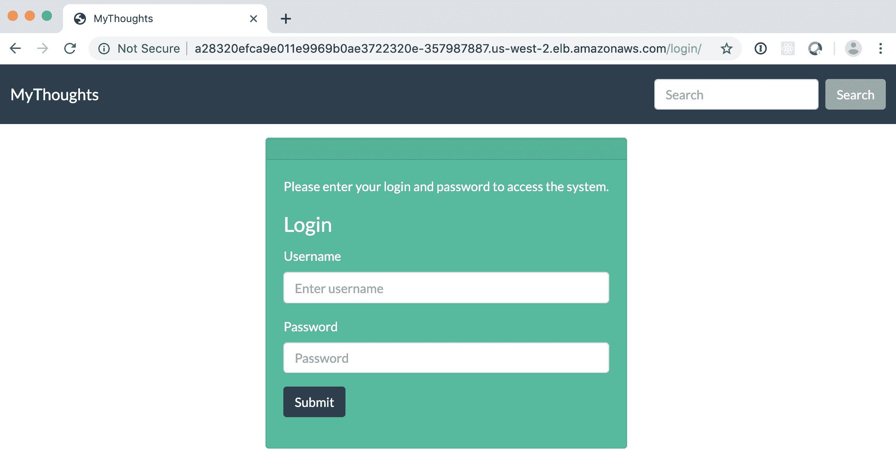
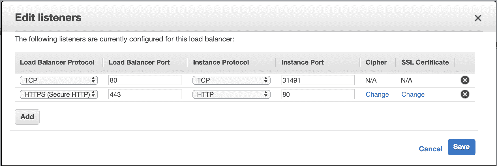
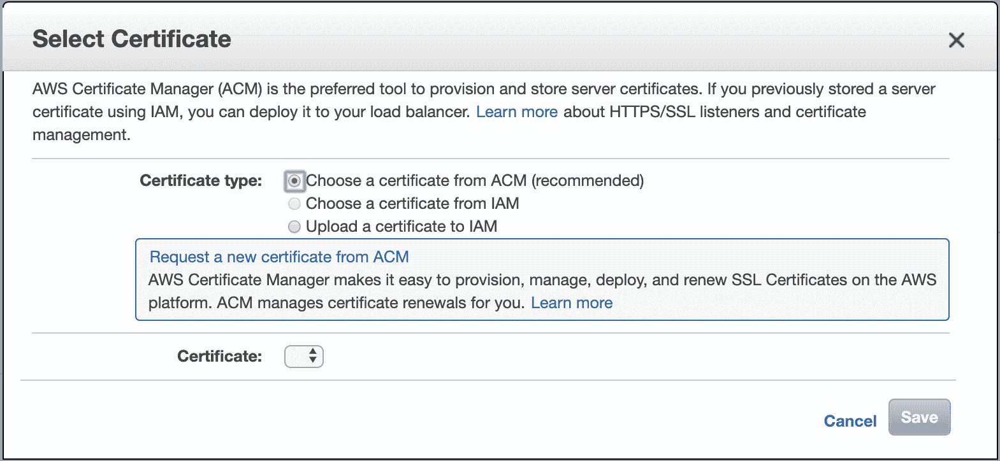
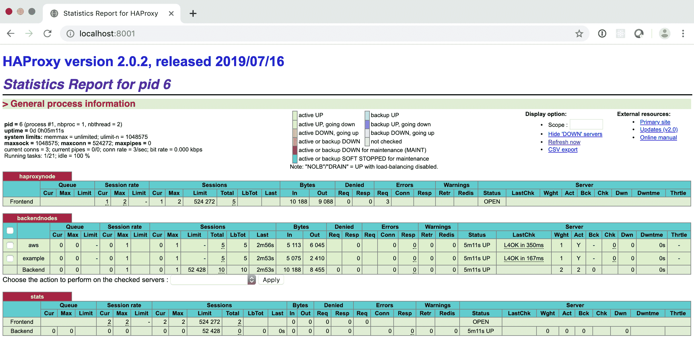
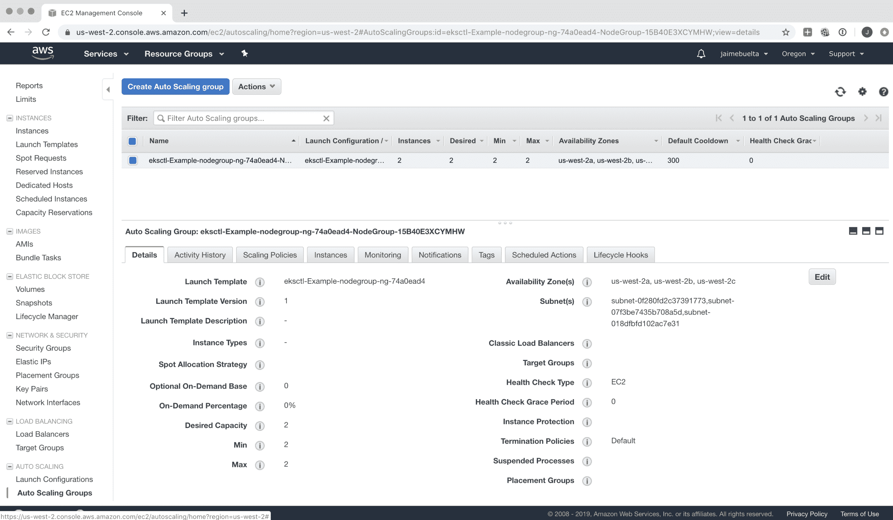

# 配置和保护生产系统

Production（来自 Production environment）是一个通用名称，用于描述为实际客户工作的主系统。这是公司可用的主要环境。也可称为**l****ive**。该系统需要在互联网上公开使用才能发挥作用，这也使得安全性和可靠性成为一个重要的优先事项。在本章中，我们将了解如何为生产部署 Kubernetes 群集。

我们将了解如何使用第三方产品**Amazon Web Services**（**AWS**）设置一个，并将介绍为什么创建自己的服务是个坏主意。我们将在这个新的部署中部署我们的系统，并将检查如何设置负载平衡器，以便以有序的方式将流量从旧的整体移动到新系统。

我们还将看到如何自动扩展 Kubernetes 集群内的吊舱和节点，以使资源适应需要。

本章将介绍以下主题：

*   在野外使用 Kubernetes
*   设置 Docker 注册表
*   创建集群
*   使用 HTTPS 和 TLS 保护外部访问
*   准备好迁移到微服务
*   自动缩放群集
*   顺利部署新的 Docker 映像

我们还将介绍一些良好实践，以确保我们的部署尽可能顺利可靠地部署。在本章结束时，您将在一个公开可用的 Kubernetes 集群中部署该系统。

# 技术要求

我们将使用 AWS 作为示例的云供应商。我们需要安装一些实用程序来从命令行进行交互。检查如何在本文档（[中安装 AWS CLI 实用程序 https://aws.amazon.com/cli/](https://aws.amazon.com/cli/) ）。此实用程序允许从命令行执行 AWS 任务。

要操作 Kubernetes 集群，我们将使用`eksctl`。检查此文档（[https://eksctl.io/introduction/installation/](https://eksctl.io/introduction/installation/) ）以获取安装说明。

您还需要安装`aws-iam-authenticator`。您可以在此处查看安装说明（[https://docs.aws.amazon.com/eks/latest/userguide/install-aws-iam-authenticator.html](https://docs.aws.amazon.com/eks/latest/userguide/install-aws-iam-authenticator.html) 。

本章的代码可以在 GitHub 上的以下链接中找到：[https://github.com/PacktPublishing/Hands-On-Docker-for-Microservices-with-Python/tree/master/Chapter07](https://github.com/PacktPublishing/Hands-On-Docker-for-Microservices-with-Python/tree/master/Chapter07) 。

确保您的计算机上安装了`ab`（Apache Bench）。它与 Apache 捆绑在一起，默认情况下安装在 macOS 和一些 Linux 发行版中。您可以查看这篇文章：[https://www.petefreitag.com/item/689.cfm](https://www.petefreitag.com/item/689.cfm) 。

# 在野外使用 Kubernetes

在部署要用作生产的集群时，最好的建议是使用商业服务。所有主要云提供商（AWS EKS、**谷歌 Kubernetes 引擎**（**GKE**）和**Azure Kubernetes 服务**（**AKS**）都允许您创建托管 Kubernetes 集群，这意味着唯一需要的参数是选择物理节点的数量和类型，然后通过`kubectl`进行访问。

We will use AWS for the examples in this book, but take a look at the documentation of other providers in case they work better for your use case.

Kubernetes 是一个抽象层，因此这种操作方式非常方便。定价类似于支付原始实例作为节点服务器的费用，并且不需要安装和管理 Kubernetes 控制平面，这样实例就可以作为 Kubernetes 节点。

It's worth saying it again: unless you have a very good reason, *do not deploy your own Kubernetes cluster*; instead, use a cloud provider offering. It will be easier and will save you from a lot of maintenance costs. Configuring a Kubernetes node in a way that's performant and implements good practices to avoid security problems is not trivial.

如果您有自己的内部数据中心，创建自己的 Kubernetes 群集可能是不可避免的，但在其他任何情况下，直接使用由已知云提供商管理的群集都更有意义。可能您当前的提供商已经提供了托管 Kubernetes！

# 创建 IAM 用户

AWS 使用不同的用户授予他们几个角色。它们具有不同的权限，允许用户执行操作。该系统在 AWS 术语中称为**身份和访问管理**（**IAM**。

Creating a proper IAM user could be quite complicated, depending on your settings and how AWS is used in your organization. Check the documentation ([https://docs.aws.amazon.com/IAM/latest/UserGuide/id_users_create.html](https://docs.aws.amazon.com/IAM/latest/UserGuide/id_users_create.html)) and find the people responsible for dealing with AWS in your organization and check with them to see what the required steps are.

让我们来看看创建 IAM 用户的步骤：

1.  如果创建 AWS 用户时没有适当的权限，则需要创建该用户。确保它能够通过激活编程访问访问 API，如以下屏幕截图所示：


这将显示其访问密钥、密钥和密码。一定要把它们安全地存放起来。

2.  要通过命令行进行访问，需要使用 AWS CLI。使用 AWS CLI 和访问信息，将命令行配置为使用`aws`：

```py
$ aws configure
AWS Access Key ID [None]: <your Access Key>
AWS Secret Access Key [None]: <your Secret Key>
Default region name [us-west-2]: <EKS region>
Default output format [None]:
```

您应该能够使用以下命令获取标识以检查配置是否成功：

```py
$ aws sts get-caller-identity
{
 "UserId": "<Access Key>",
 "Account": "<account ID>",
 "Arn": "arn:aws:iam::XXXXXXXXXXXX:user/jaime"
}
```

现在可以访问命令行 AWS 操作。

Keep in mind that the IAM user can create more keys if necessary, revoke the existing ones, and so on. This normally is handled by an admin user in charge of AWS security. You can read more in the Amazon documentation ([https://docs.aws.amazon.com/IAM/latest/UserGuide/id_credentials_access-keys.html#Using_CreateAccessKey_API](https://docs.aws.amazon.com/IAM/latest/UserGuide/id_credentials_access-keys.html#Using_CreateAccessKey_API)). Key rotation is a good idea to ensure that old keys are deprecated. You can do it through the `aws` client interface.

我们将使用 web 控制台进行一些操作，但其他操作需要使用`aws`。

# 设置 Docker 注册表

我们需要能够访问存储要部署的图像的 Docker 注册表。确保 Docker 注册表可访问的最简单方法是在同一服务中使用 Docker 注册表。

You can still use the Docker Hub registry, but using a registry in the same cloud provider is typically easier as it's better integrated. It will also help in terms of authentication.

我们需要配置**弹性容器注册表**（**ECR**，步骤如下：

1.  登录 AWS 控制台并搜索 Kubernetes 或 ECR：


2.  创建一个名为`frontend`的新注册表。它将创建一个完整的 URL，您需要复制该 URL：


3.  我们需要在注册表中创建本地`docker`日志。请注意，`aws ecr get-login`将返回一个`docker`命令，该命令将让您登录，因此请复制并粘贴：

```py
$ aws ecr get-login --no-include-email
<command>
$ docker login -u AWS -p <token>
Login Succeeded
```

4.  现在，我们可以使用完整的注册表名标记要推送的图像，并推送它：

```py
$ docker tag thoughts_frontend 033870383707.dkr.ecr.us-west-2.amazonaws.com/frontend
$ docker push 033870383707.dkr.ecr.us-west-2.amazonaws.com/frontend
The push refers to repository [033870383707.dkr.ecr.us-west-2.amazonaws.com/frontend]
...
latest: digest: sha256:21d5f25d59c235fe09633ba764a0a40c87bb2d8d47c7c095d254e20f7b437026 size: 2404
```

5.  图像被推送！您可以通过在浏览器中打开 AWS 控制台进行检查：


6.  我们需要重复这个过程来推动用户后端和思想后端。

We use the setting of two containers for the deployment of the Users Backend and Thoughts Backend, which includes one for the service and another for a volatile database. This is done for demonstration purposes, but won't be the configuration for a production system, as the data will need to be persistent.

At the end of the chapter, there's a question about how to deal with this situation. Be sure to check it!

将添加所有不同的注册表。您可以在浏览器 AWS 控制台中检查它们：


我们的管道将需要调整以推送到这个存储库。

A good practice in deployment is to make a specific step called **promotion**, where the images ready to use in production are copied to an specific registry, lowering the chance that a bad image gets deployed by mistake in production.

This process may be done several times to promote the images in different environments. For example, deploy a version in an staging environment. Run some tests, and if they are correct, promote the version, copying it into the production registry and labelling it as good to deploy on the production environment.

This process can be done with different registries in different providers.

我们需要在部署中使用完整 URL 的名称。

# 创建集群

为了使我们的代码在云中可用并可公开访问，我们需要建立一个工作的生产集群，这需要两个步骤：

1.  在 AWS 云中创建 EKS 集群（这使您能够运行在此云中运行的`kubectl`命令）。
2.  如前几章所述，使用一组`.yaml`文件部署您的服务。这些文件需要最少的更改来适应云。

让我们检查第一步。

# 创建 Kubernetes 集群

创建集群的最佳方法是使用`eksctl`实用程序。这为我们自动化了大部分工作，并允许我们以后在必要时进行扩展。

Be aware that EKS is available only in some regions, not all. Check the AWS regional table ([https://aws.amazon.com/about-aws/global-infrastructure/regional-product-services/](https://aws.amazon.com/about-aws/global-infrastructure/regional-product-services/)) to see the available zones. We will use the Oregon (`us-west-2`) region.

要创建 Kubernetes 群集，让我们执行以下步骤：

1.  首先，检查`eksctl`是否正确安装：

```py
$ eksctl get clusters
No clusters found
```

2.  创建一个新集群。大约需要 10 分钟：

```py
$ eksctl create cluster -n Example
[i] using region us-west-2
[i] setting availability zones to [us-west-2d us-west-2b us-west-2c]
...
[✔]  EKS cluster "Example" in "us-west-2" region is ready

```

3.  这将创建集群。检查 AWS web 界面将显示新配置的元素。

The `--arg-access` option needs to be added for a cluster capable of autoscaling. This will be described in more detail in the *Autoscaling the cluster* section.

4.  `eksctl create`命令还添加了一个新的上下文，其中包含关于远程 Kubernetes 集群的信息，并激活它，因此`kubectl`现在将指向这个新集群。

Note that `kubectl` has the concept of contexts as different clusters it can connect. You can see all the available contexts running `kubectl config get-contexts` and `kubectl config use-context <context-name>` to change them. Check the Kubernetes documentation ([https://kubernetes.io/docs/tasks/access-application-cluster/configure-access-multiple-clusters/](https://kubernetes.io/docs/tasks/access-application-cluster/configure-access-multiple-clusters/)) on how to create new contexts manually.

5.  此命令使用适当的上下文设置`kubectl`以运行命令。默认情况下，它生成一个包含两个节点的集群：

```py
$ kubectl get nodes
NAME                    STATUS ROLES AGE VERSION
ip-X.us-west-2.internal Ready <none> 11m v1.13.7-eks-c57ff8
ip-Y.us-west-2.internal Ready <none> 11m v1.13.7-eks-c57ff8
```

6.  我们可以缩放节点的数量。减少资源的使用，节约资金。我们需要检索控制节点数量的节点组的名称，然后缩小其规模：

```py
$ eksctl get nodegroups --cluster Example
CLUSTER NODEGROUP CREATED MIN SIZE MAX SIZE DESIRED CAPACITY INSTANCE TYPE IMAGE ID
Example ng-fa5e0fc5 2019-07-16T13:39:07Z 2 2 0 m5.large ami-03a55127c613349a7
$ eksctl scale nodegroup --cluster Example --name ng-fa5e0fc5 -N 1
[i] scaling nodegroup stack "eksctl-Example-nodegroup-ng-fa5e0fc5" in cluster eksctl-Example-cluster
[i] scaling nodegroup, desired capacity from to 1, min size from 2 to 1
```

7.  您可以通过`kubectl`联系集群，正常进行操作：

```py
$ kubectl get svc
NAME TYPE CLUSTER-IP EXTERNAL-IP PORT(S) AGE
kubernetes ClusterIP 10.100.0.1 <none> 443/TCP 7m31s
```

集群已经设置好，我们可以从命令行在集群上运行命令。

Creating an EKS cluster can be tweaked in a lot of ways, but AWS can be temperamental in terms of access, users, and permissions. For example, the cluster likes to have a CloudFormation rule to handle the cluster, and all the elements should be created with the same IAM user. Check with anyone that works with the infrastructure definition in your organization to check what's the proper configuration. Don't be afraid of running tests, a cluster can be quickly removed through the `eksctl` configuration or the AWS console.

此外，`eksctl`尽可能使用不同可用性区域（同一地理区域内的 AWS 隔离位置）中的节点创建集群，从而最大限度地降低由于 AWS 数据中心出现问题而导致整个集群停机的风险。

# 配置云 Kubernetes 群集

下一步是在 EKS 集群上运行我们的服务，这样它就可以在云中使用。我们将使用`.yaml`文件作为基础，但我们需要做一些更改。

查看 GitHub`Chapter07`（[中的文件 https://github.com/PacktPublishing/Hands-On-Docker-for-Microservices-with-Python/tree/master/Chapter07](https://github.com/PacktPublishing/Hands-On-Docker-for-Microservices-with-Python/tree/master/Chapter07) 子目录。

我们将看到与前一章中的 Kubernetes 配置文件的区别，然后我们将在*部署系统*部分中部署它们。

# 配置 AWS 映像注册表

第一个区别是我们需要将映像更改为完整注册表，因此集群使用 ECS 注册表中可用的映像。

Remember, you need to specify the registry inside AWS so the AWS cluster can properly access it.

例如，在`frontend/deployment.yaml`文件中，我们需要这样定义它们：

```py
containers:
- name: frontend-service
  image: XXX.dkr.ecr.us-west-2.amazonaws.com/frontend:latest
  imagePullPolicy: Always
```

图像应该从 AWS 注册表中提取。拉动策略应更改为强制从集群中拉动。

创建`example`命名空间后，您可以通过应用该文件在远程服务器中部署：

```py
$ kubectl create namespace example
namespace/example created
$ kubectl apply -f frontend/deployment.yaml
deployment.apps/frontend created
```

一段时间后，部署将创建吊舱：

```py
$ kubectl get pods -n example
NAME                      READY STATUS  RESTARTS AGE
frontend-58898587d9-4hj8q 1/1   Running 0        13s
```

现在我们需要更改其余的元素。所有部署都需要进行调整，以包括适当的注册表。

检查 GitHub 上的代码以检查所有的`deployment.yaml`文件。

# 配置外部可访问负载平衡器的使用

第二个区别是使前端服务在外部可用，以便 internet 流量可以访问群集。

通过将服务从`NodePort`更改为`LoadBalancer`可以很容易地做到这一点。检查`frontend/service.yaml`文件：

```py
apiVersion: v1
kind: Service
metadata:
    namespace: example
    labels:
        app: frontend-service
    name: frontend-service
spec:
    ports:
        - name: frontend
          port: 80
          targetPort: 8000
    selector:
        app: frontend
    type: LoadBalancer
```

这将创建一个新的可从外部访问的**弹性负载平衡器**（**ELB**。现在，让我们开始部署。

# 部署系统

整个系统可以从`Chapter07`子目录部署，代码如下：

```py
$ kubectl apply --recursive -f .
deployment.apps/frontend unchanged
ingress.extensions/frontend created
service/frontend-service created
deployment.apps/thoughts-backend created
ingress.extensions/thoughts-backend-ingress created
service/thoughts-service created
deployment.apps/users-backend created
ingress.extensions/users-backend-ingress created
service/users-service created
```

该命令迭代地遍历子目录并应用任何`.yaml`文件。

几分钟后，您应该看到所有内容都已启动并正在运行：

```py
$ kubectl get pods -n example
NAME                              READY STATUS  RESTARTS AGE
frontend-58898587d9-dqc97         1/1   Running 0        3m
thoughts-backend-79f5594448-6vpf4 2/2   Running 0        3m
users-backend-794ff46b8-s424k     2/2   Running 0        3m
```

要获取公共接入点，您需要检查服务：

```py
$ kubectl get svc -n example
NAME             TYPE         CLUSTER-IP EXTERNAL-IP AGE
frontend-service LoadBalancer 10.100.152.177 a28320efca9e011e9969b0ae3722320e-357987887.us-west-2.elb.amazonaws.com 3m
thoughts-service NodePort 10.100.52.188 <none> 3m
users-service    NodePort 10.100.174.60 <none> 3m
```

请注意，前端服务有一个外部 ELB DNS 可用。

如果将该 DNS 放在浏览器中，则可以按如下方式访问该服务：



恭喜你，你有了自己的云 Kubernetes 服务。服务可访问的 DNS 名称不是很好，因此我们将了解如何添加注册的 DNS 名称并在 HTTPS 端点下公开它。

# 使用 HTTPS 和 TLS 保护外部访问

为了向您的客户提供良好的服务，您的外部端点应该通过 HTTPS 提供服务。这意味着您和客户之间的通信是私有的，不能通过网络路由进行监听。

HTTPS 的工作方式是服务器和客户端对通信进行加密。为了确保服务器就是他们所说的服务器，需要有一个由授权验证 DNS 的机构颁发的 SSL 证书。

Remember, the point of HTTPS is *not* that the server is inherently trustworthy, but that the communication is private between the client and the server. The server can still be malicious. That's why verifying that a particular DNS does not contain misspellings is important.

You can get more information on how HTTPS works in this fantastic comic: [https://howhttps.works/](https://howhttps.works/).

获取外部终结点的证书需要两个阶段：

*   您拥有特定的 DNS 名称，通常是从名称注册商处购买。
*   您通过认可的**证书颁发机构**（**CA**获得 DNS 名称的唯一证书。CA 必须验证您是否控制 DNS 名称。

To help in promoting the usage of HTTPS, the non-profit *Let's Encrypt* ([https://letsencrypt.org](https://letsencrypt.org)) supplies free certificates valid for 60 days. This will be more work than obtaining one through your cloud provider, but could be an option if money is tight.

如今，云提供商很容易做到这一点，因为他们可以同时扮演两者的角色，简化了流程。

The important element that needs to communicate through HTTPS is the edge of our network. The internal network where our own microservices are communicating doesn't require to be HTTPS, and HTTP will suffice. It needs to be a private network out of public interference, though.

按照我们的示例，AWS 允许我们创建一个证书并将其与一个 ELB 相关联，在 HTTP 中提供流量服务。

Having AWS to serve HTTPS traffic ensures that we are using the latest and safest security protocols, such as **Transport Layer Security** (**TLS**) v1.3 (the latest at the time of writing), but also that it keeps backward compatibility with older protocols, such as SSL.

In other words, it is the best option to use the most secure environment by default.

设置 HTTPS 的第一步是直接从 AWS 购买 DNS 域名，或者将控制权转移到 AWS。这可以通过他们的服务路线 53 完成。您可以在[查看文档 https://aws.amazon.com/route53/](https://aws.amazon.com/route53/) 。

It is not strictly required to transfer your DNS to Amazon, as long as you can point it toward the externally facing ELB, but it helps with the integration and obtaining of certificates. You'll need to prove that you own the DNS record when creating a certificate, and using AWS makes it simple as they create a certificate to a DNS record they control. Check the documentation at [https://docs.aws.amazon.com/acm/latest/userguide/gs-acm-validate-dns.html](https://docs.aws.amazon.com/acm/latest/userguide/gs-acm-validate-dns.html).

要在 ELB 上启用 HTTPS 支持，请检查以下步骤：

1.  转到 AWS 控制台中的侦听器：


2.  单击编辑并添加 HTTPS 支持的新规则：



3.  如您所见，它需要 SSL 证书。单击“更改”转到管理：



4.  从这里，您可以添加现有证书或从 Amazon 购买证书。

Be sure to check the documentation about the load balancer in Amazon. There are several kinds of ELBs that can be used, and some have different features than others depending on your use case. For example, some of the new ELBs are able to redirect toward HTTPS even if your customer requests the data in HTTP. See the documentation at [https://aws.amazon.com/elasticloadbalancing/](https://aws.amazon.com/elasticloadbalancing/).

祝贺您，现在您的外部端点支持 HTTPS，确保您与客户的通信是私有的。

# 准备好迁移到微服务

为了在迁移过程中顺利运行，您需要部署一个负载平衡器，它允许您在后端之间快速交换并保持服务正常运行。

正如我们在[第 1 章](01.html)*中所讨论的【移动——设计、计划和执行*，HAProxy 是一个很好的选择，因为它非常通用，并且有一个很好的用户界面，允许您只需点击网页即可快速进行操作。它还有一个优秀的统计页面，允许您监视服务的状态。

AWS has an alternative to HAProxy called **Application Load Balancer** (**ALB**). This works as a feature-rich update on the ELB, which allows you to route different HTTP paths into different backend services.

HAProxy has a richer set of features and a better dashboard to interact with it. It can also be changed through a configuration file, which helps in controlling changes, as we will see in [Chapter 8](08.html), *Using GitOps Principles*.

It is, obviously, only available if all the services are available in AWS, but it can be a good solution in that case, as it will be simpler and more aligned with the rest of the technical stack. Take a look at the documentation at [https://aws.amazon.com/blogs/aws/new-aws-application-load-balancer/](https://aws.amazon.com/blogs/aws/new-aws-application-load-balancer/).

要在服务前面部署负载平衡器，我建议不要在 Kubernetes 上部署它，而是以与传统服务相同的方式运行它。这种负载平衡器将是系统的关键部分，消除不确定性对于成功运行非常重要。这也是一项相对简单的服务。

Keep in mind that a load balancer needs to be properly replicated, or it becomes a single point of failure. Amazon and other cloud providers allow you to set up an ELB or other kinds of load balancer toward your own deployment of load balancers, enabling the traffic to be balanced among them.

例如，我们创建了一个示例配置和`docker-compose`文件来快速运行它，但是可以以您的团队最熟悉的任何方式设置配置。

# 运行示例

该代码可在 GitHub（[上获得 https://github.com/PacktPublishing/Hands-On-Docker-for-Microservices-with-Python/tree/master/Chapter07/haproxy](https://github.com/PacktPublishing/Hands-On-Docker-for-Microservices-with-Python/tree/master/Chapter07/haproxy) ）。我们继承自 Docker Hub（[中的 HAProxy Docker 图像 https://hub.docker.com/_/haproxy/](https://hub.docker.com/_/haproxy/) ，添加我们自己的配置文件。

让我们看一下配置文件中的主要元素，

```py
frontend haproxynode
    bind *:80
    mode http
    default_backend backendnodes

backend backendnodes
    balance roundrobin
    option forwardfor
    server aws a28320efca9e011e9969b0ae3722320e-357987887
               .us-west-2.elb.amazonaws.com:80 check
    server example www.example.com:80 check

listen stats
    bind *:8001
    stats enable
    stats uri /
    stats admin if TRUE
```

我们定义了一个前端，它接受端口`80`中的任何请求，并将请求发送到后端。后端将请求平衡到两台服务器`example`和`aws`。基本上，`example`指向`www.example.com`（旧服务的占位符）和`aws`指向先前创建的负载平衡器。

我们在端口`8001`中启用 stats 服务器并允许管理员访问。

`docker-compose`配置启动服务器并将本地主机端口转发到容器端口`8000`（负载平衡器）和`8001`（stats）。使用以下命令启动它：

```py
$ docker-compose up --build proxy
...
```

现在我们可以访问`localhost:8000`，它将在`thoughts`服务和 404 错误之间切换。

When calling `example.com` this way, we are forwarding the host request. This means we send a request requesting `Host:localhost` to `example.com`, which returns a 404 error. Be sure to check on your service that the same host information is accepted by all the backends.

打开“统计”页面以检查设置：



检查后端节点中的`aws`和`example`条目。还有很多有趣的信息，比如请求的数量、最后的连接、数据等等。

您可以在检查`example`后端时执行操作，然后在下拉菜单中将状态设置为 MAINT。一旦应用，`example`后端处于维护模式，并从负载平衡器中移除。统计信息页面如下所示：


现在访问`localhost:8000`中的负载均衡器只会返回**思想**前端。您可以重新启用后端，将其设置为就绪状态。

There's a state called DRAIN that will stop new sessions going to the selected server, but existing sessions will keep going. This may be interesting in some configurations, but if the backend is truly stateless, moving directly to the MAINT state should be enough.

HAProxy 还可以配置为使用检查来确保后端可用。我们在示例中添加了一个注释的，它发送一个 HTTP 命令来检查返回：

```py
option httpchk HEAD / HTTP/1.1\r\nHost:\ example.com
```

检查对两个后端都是相同的，因此需要成功返回。默认情况下，它将每隔几秒钟运行一次。

您可以在[查看完整的 HAProxy 文档 http://www.haproxy.org/](http://www.haproxy.org/) 。有很多细节可以配置。跟进您的团队，确保超时、转发头等区域的配置正确。

Kubernetes 中也使用了健康检查的概念，以确保吊舱和容器准备好接受请求并且稳定。在下一节中，我们将看到如何确保正确部署新映像。

# 顺利部署新的 Docker 映像

在生产环境中部署服务时，确保其顺利工作以避免中断服务至关重要。

Kubernetes 和 HAProxy 能够检测服务何时正确运行，并在服务未正确运行时采取行动，但我们需要提供一个端点作为健康检查，并将其配置为定期 ping，以便及早检测问题。

For simplicity, we will use the root URL as a health check, but we can design specific endpoints to be tested. A good health checkup checks that the service is working as expected, but is light and quick. Avoid the temptation of over testing or performing an external verification that could make the endpoint take a long time.

An API endpoint that returns an empty response is a great example, as it checks that the whole piping system works, but it's very fast to answer.

在 Kubernetes 中，有两个测试可以确保 pod 正常工作，即就绪探测和活跃度探测。

# 活性探针

活动性探测器检查容器是否正常工作。它是在容器中启动并正确返回的进程。如果它返回错误（或更多，取决于配置），Kubernetes 将杀死容器并重新启动它。

活动性探测将在容器内执行，因此它需要有效。对于 web 服务，添加`curl`命令是一个好主意：

```py
spec:
  containers:
  - name: frontend-service
    livenessProbe:
      exec:
        command:
        - curl
        - http://localhost:8000/
        initialDelaySeconds: 5
        periodSeconds: 30
```

虽然有检查 TCP 端口是否打开或发送 HTTP 请求等选项，但运行命令是最通用的选项。也可以出于调试目的对其进行检查。有关更多选项，请参阅文档。

Be careful of being very aggressive on liveness probes. Each check puts some load on the container, so depending on load multiple probes can end up killing more containers than they should.

If your services are restarted often by the liveness probe, either the probe is too aggressive or the load is high for the number of containers, or a combination of both.

探头配置为等待 5 秒，然后每 30 秒运行一次。默认情况下，在三次失败的检查之后，它将重新启动容器。

# 准备就绪探测器

就绪探测检查容器是否准备好接受更多请求。这是一个不那么激进的版本。如果测试返回错误或超时，容器将不会重新启动，但它将被标记为不可用。

就绪探测通常用于避免过早接受请求，但它将在启动后运行。智能就绪探测可以在容器满负荷且不能接受更多请求时进行标记，但通常以与活动性证明类似的方式配置探测就足够了。

准备就绪探测在部署配置中定义，方式与活动探测相同。让我们来看一看：

```py
spec:
  containers:
  - name: frontend-service
    readinessProbe:
      exec:
        command:
        - curl
        - http://localhost:8000/
        initialDelaySeconds: 5
        periodSeconds: 10
```

准备就绪探针应该比活动性探针更具攻击性，因为结果更安全。这就是为什么`periodSeconds`更短的原因。根据您的特定用例，您可能需要两者，也可能不需要两者，但需要准备就绪探测来启用滚动更新，我们将在下面看到。

示例代码中的`frontend/deployment.yaml`部署包括两个探测。检查 Kubernetes 文件（[https://kubernetes.io/docs/tasks/configure-pod-container/configure-liveness-readiness-startup-probes/](https://kubernetes.io/docs/tasks/configure-pod-container/configure-liveness-readiness-startup-probes/) 了解更多详细信息和选项。

Be aware that the two probes are used for different objectives. The readiness probe delays the input of requests until the pod is ready, while the liveness probe helps with stuck containers.

A delay in the liveness probe getting back will restart the pod, so an increase in load could produce a cascade effect of restarting pods. Adjust accordingly, and remember that both probes don't need to repeat the same command.

readiness 和 liveness 探测器都有助于 Kubernetes 控制 POD 的创建方式，从而影响部署的更新。

# 滚动更新

默认情况下，每次更新要部署的映像时，Kubernetes 部署都将重新创建容器。

Notifying Kubernetes that a new version is available is not enough to push a new image to the registry, even if the tag is the same. You'll need to change the tag described in the `image` field in the deployment `.yaml` file.

我们需要控制图像的变化方式。为了不中断服务，我们需要执行滚动更新。这种更新会添加新容器，等待它们准备就绪，将它们添加到池中，并删除旧容器。此部署比删除所有容器并重新启动它们稍微慢一点，但它允许服务不间断。

可以通过调整部署中的`strategy`部分来配置此过程的执行方式：

```py
spec:
    replicas: 4
    strategy:
      type: RollingUpdate
      rollingUpdate:
        maxUnavailable: 25%
        maxSurge: 1
```

让我们了解以下代码：

*   `strategy`和`type`可以是`RollingUpdate`（默认值）或`Recreate`，用于停止现有 POD 并创建新 POD。
*   `maxUnavailable`定义变更期间不可用吊舱的最大数量。这定义了添加新容器和删除旧容器的速度。它可以被描述为一个百分比，就像我们的例子一样，或者是一个固定的数字。
*   `maxSurge`定义可以创建的额外吊舱的数量超过所需吊舱的限制。这可以是一个特定的数字，也可以是总数的百分比。
*   当我们将`replicas`设置为`4`时，两种情况下的结果都是一个 pod。这意味着在变更期间，最多有一个 pod 不可用，我们将逐个创建新的 pod。

数字越大，更新速度越快，但会消耗更多资源（`maxSurge`）或在更新过程中更积极地减少可用资源（`maxUnavailable`。

For a small number of replicas, be conservative and grow the numbers when you are more comfortable with the process and have more resources.

最初，手动缩放吊舱将是最简单和最好的选择。如果流量变化很大，具有高峰和低谷，则可能值得对集群进行自动缩放。

# 自动缩放群集

我们以前见过如何更改服务的 pod 数量，以及如何添加和删除节点。这可以自动描述一些规则，允许集群弹性地更改其资源。

Keep in mind that autoscaling requires tweaking to adjust to your specific use case. This is a technique to use if the resource utilization changes greatly over time; for example, if there's a daily pattern where some hours present way more activity than others, or if there's a viral element that means the service multiplies the requests by 10 unexpectedly.

If your usage of servers is small and the utilization stays relatively constant, there's probably no need to add autoscaling.

群集可以在两个不同的前端自动放大或缩小：

*   在 Kubernetes 配置中，吊舱的数量可以设置为自动增加或减少。
*   可以在 AWS 中将节点数设置为自动增加或减少。

豆荚的数量和节点的数量都需要彼此一致，以允许自然生长。

如果 POD 的数量增加而不增加更多硬件（节点），Kubernetes 集群将不会有更多的容量，只有在不同的分布中分配相同的资源。

如果节点数量增加而没有创建更多的 pod，那么在某个时候额外的节点将没有 pod 可分配，从而导致资源利用率不足。另一方面，添加的任何新节点都会有相关的成本，因此我们希望正确地使用它。

To be able to automatically scale a pod, be sure that it is scalable. To ensure the pod is scalable check that it is an stateless web service and obtain all the information from an external source.

Note that, in our code example, the frontend pod is scalable, while the Thoughts and Users Backend is not, as they include their own database container the application connects to.

Creating a new pod creates a new empty database, which is not the expected behavior. This has been done on purpose to simplify the example code. The intended production deployment is, as described before, to connect to an external database instead.

Kubernetes 配置和 EKS 都具有允许根据规则更改吊舱和节点数量的功能。

# 创建 Kubernetes 水平吊舱自动缩放器

在 Kubernetes 术语中，上下缩放吊舱的服务称为**水平吊舱自动缩放器**（**H****PA**。

这是因为它需要一种按比例检查测量的方法。为了启用这些度量，我们需要部署 Kubernetes 度量服务器。

# 部署 Kubernetes metrics 服务器

Kubernetes metrics 服务器捕获内部低级指标，如 CPU 使用率、内存等。HPA 将捕获这些指标并使用它们来扩展资源。

The Kubernetes metrics server is not the only available server for feeding metrics to the HPA, and other metrics systems can be defined. The list of the currently available adaptors is available in the Kubernetes metrics project ([https://github.com/kubernetes/metrics/blob/master/IMPLEMENTATIONS.md#custom-metrics-api](https://github.com/kubernetes/metrics/blob/master/IMPLEMENTATIONS.md#custom-metrics-api)).

This allows for custom metrics to be defined as a target. Start first with default ones, though, and only move to custom ones if there are real limitations for your specific deployment.

要部署 Kubernetes metrics 服务器，请从官方项目页面下载最新版本（[https://github.com/kubernetes-incubator/metrics-server/releases](https://github.com/kubernetes-incubator/metrics-server/releases) 。在撰写本文时，它是`0.3.3`。

下载`tar.gz`文件，在撰写本文时为`metrics-server-0.3.3.tar.gz`。解压缩并将版本应用于群集：

```py
$ tar -xzf metrics-server-0.3.3.tar.gz
$ cd metrics-server-0.3.3/deploy/1.8+/
$ kubectl apply -f .
clusterrole.rbac.authorization.k8s.io/system:aggregated-metrics-reader created
clusterrolebinding.rbac.authorization.k8s.io/metrics-server:system:auth-delegator created
rolebinding.rbac.authorization.k8s.io/metrics-server-auth-reader created
apiservice.apiregistration.k8s.io/v1beta1.metrics.k8s.io created
serviceaccount/metrics-server created
deployment.extensions/metrics-server created
service/metrics-server created
clusterrole.rbac.authorization.k8s.io/system:metrics-server created
clusterrolebinding.rbac.authorization.k8s.io/system:metrics-server created
```

您将在`kube-system`名称空间中看到新的 pod：

```py
$ kubectl get pods -n kube-system
NAME                            READY STATUS  RESTARTS AGE
...
metrics-server-56ff868bbf-cchzp 1/1   Running 0        42s
```

您可以使用`kubectl top`命令获取节点和吊舱的基本信息：

```py
$ kubectl top node
NAME                    CPU(cores) CPU% MEM(bytes) MEMORY%
ip-X.us-west-2.internal 57m        2%   547Mi      7%
ip-Y.us-west-2.internal 44m        2%   534Mi      7%
$ kubectl top pods -n example
$ kubectl top pods -n example
NAME                              CPU(cores) MEMORY(bytes)
frontend-5474c7c4ff-d4v77         2m         51Mi
frontend-5474c7c4ff-dlq6t         1m         50Mi
frontend-5474c7c4ff-km2sj         1m         51Mi
frontend-5474c7c4ff-rlvcc         2m         51Mi
thoughts-backend-79f5594448-cvdvm 1m         54Mi
users-backend-794ff46b8-m2c6w     1m         54Mi
```

为了正确控制使用限制，我们需要在部署中配置分配的内容并限制其资源。

# 在部署中配置资源

在容器的配置中，我们可以指定请求的资源以及它们的最大资源。

它们都会通知 Kubernetes 容器的预期内存和 CPU 使用情况。创建新容器时，Kubernetes 会自动将其部署到具有足够资源的节点上。

在`frontend/deployment.yaml`文件中，我们包括以下`resources`实例：

```py
spec:
    containers:
    - name: frontend-service
      image: 033870383707.dkr.ecr.us-west-2
                 .amazonaws.com/frontend:latest
      imagePullPolicy: Always
      ...
      resources:
          requests:
              memory: "64M"
              cpu: "60m"
          limits:
              memory: "128M"
              cpu: "70m"
```

最初请求的内存为 64 MB，CPU 核心为 0.06。

The resources for memory can also use Mi to the power of 2, which is equivalent to a megabyte (*1000<sup>2</sup>* bytes), which is called a mebibyte (*2<sup>20</sup>* bytes). The difference is small in any case. You can use also G or T for bigger amounts.

The CPU resources are measured fractionally where 1 being a core in whatever system the node is running (for example, AWS vCPU). Note that 1000m, meaning 1000 milli CPUs is equivalent to a whole core.

限制为 128 MB 和 0.07 CPU 核心。容器将无法使用超过限制的内存或 CPU。

Aim at round simple numbers to understand the limits and requested resources. Don't expect to have them perfect the first time; the applications will change their consumption.

Measuring the metrics in an aggregated way, as we will talk about in [Chapter 11](11.html), *Handling Change, Dependencies, and Secrets in the System*, will help you to see the evolution of the system and tweak it accordingly.

该限制将为 autoscaler 创建基准，因为它将以资源的百分比进行度量。

# 创建 HPA

要创建新的 HPA，我们可以使用`kubectl autoscale`命令：

```py
$ kubectl autoscale deployment frontend --cpu-percent=10 --min=2 --max=8 -n example
horizontalpodautoscaler.autoscaling/frontend autoscaled
```

这将创建一个新的 HPA，该 HPA 以`example`命名空间中的`frontend`部署为目标，并将 POD 的数量设置为介于`2`和`8`之间。要缩放的参数是 CPU，我们将其设置为可用 CPU 的 10%，所有 POD 的平均值。如果它更高，它会产生新的豆荚，如果它更低，它会减少它们。

The 10% limit is used to be able to trigger the autoscaler and to demonstrate it.

autoscaler 是一种特殊的 Kubernetes 对象，可以按如下方式进行查询：

```py
$ kubectl get hpa -n example
NAME     REFERENCE           TARGETS  MIN MAX REPLICAS AGE
frontend Deployment/frontend 2%/10%   2   8   4        80s
```

请注意，目标公司如何表示，它目前在 2%左右，接近极限。这是设计的小可用 CPU，将有一个相对较高的基线。

几分钟后，副本数量将下降，直到达到最小值`2`。

The downscaling may take a few minutes. This generally is the expected behavior, upscaling being more aggressive than downscaling.

为了创建一些负载，让我们将应用程序 Apache Bench（`ab`与前端中专门创建的端点结合使用，该端点使用大量 CPU：

```py
$ ab -n 100 http://<LOADBALANCER>.elb.amazonaws.com/load
Benchmarking <LOADBALANCER>.elb.amazonaws.com (be patient)....
```

请注意，`ab`是一个方便的测试应用程序，可以同时生成 HTTP 请求。如果愿意，可以从浏览器中快速连续多次点击 URL。

Remember to add the load balancer DNS, as retrieved in the *Creating the cluster* section.

这将在群集中产生额外的 CPU 负载，并使部署规模增大：

```py
NAME     REFERENCE           TARGETS MIN MAX REPLICAS AGE
frontend Deployment/frontend 47%/10% 2   8   8        15m
```

请求完成后，几分钟后，吊舱的数量将逐渐减少，直到再次命中两个吊舱。

但是我们也需要一种扩展节点的方法，否则我们将无法增加系统中的资源总数。

# 缩放群集中的节点数

在 EKS 集群中作为节点工作的 AWS 实例的数量也可以增加。这为集群添加了额外的资源，并使启动更多的 pod 成为可能。

允许自动缩放的基础 AWS 服务是一个自动缩放组。这是一组 EC2 实例，它们共享相同的映像，并且具有定义的大小，包括最小和最大实例。

在任何 EKS 集群的核心，都有一个控制集群节点的自动缩放组。注意，`eksctl`将自动缩放组创建并公开为节点组：

```py
$ eksctl get nodegroup --cluster Example
CLUSTER NODEGROUP   MIN  MAX  DESIRED INSTANCE IMAGE ID
Example ng-74a0ead4 2    2    2       m5.large ami-X
```

使用`eksctl`，我们可以按照创建集群时所述手动放大或缩小集群：

```py
$ eksctl scale nodegroup --cluster Example --name ng-74a0ead4 --nodes 4
[i] scaling nodegroup stack "eksctl-Example-nodegroup-ng-74a0ead4" in cluster eksctl-Example-cluster
[i] scaling nodegroup, desired capacity from to 4, max size from 2 to 4
```

该节点组也可在 AWS 控制台中的 EC2 |自动缩放组下看到：



在 web 界面中，我们可以使用一些有趣的信息来收集有关自动缩放组的信息。“活动历史记录”选项卡允许您查看任何放大或缩小事件，而“监视”选项卡允许您检查指标。

大多数处理都是通过`eksctl`自动创建的，例如实例类型和 AMI-ID（实例上的初始软件，包含操作系统）。主要由`eksctl`控制。

If you need to change the Instance Type, `eksctl` requires you to create a new nodegroup, move all the pods, and then delete the old. You can learn more about the process in the `eksctl` documentation ([https://eksctl.io/usage/managing-nodegroups/](https://eksctl.io/usage/managing-nodegroups/)).

但是，通过 web 界面，编辑缩放参数和添加自动缩放策略很容易。

Changing the parameters through the web interface may confuse the data retrieved in `eksctl`, as it's independently set up.

It is possible to install a Kubernetes autoscaler for AWS, but it requires a `secrets` configuration file to include a proper AMI in the autoscaler pod, with AWS permissions to add instances.

Describing the autoscale policy in AWS terms in code can also be quite confusing. The web interface makes it a bit easier. The pro is that you can describe everything in config files that can be under source control.

We will go with the web interface configuration, here, but you can follow the instructions at [https://eksctl.io/usage/autoscaling/](https://eksctl.io/usage/autoscaling/).

对于缩放策略，可以创建两个主要组件：

*   **计划动作**：它们是在规定时间发生的放大和缩小事件。该操作可以通过组合所需数量以及最小和最大数量来更改节点数量，例如，在周末增加集群。这些操作可以定期重复，例如每天或每小时。该操作还可以有一个结束时间，该时间将把值还原为先前定义的值。如果我们期望系统中有额外的负载，这可以用来提高几个小时的性能，或者在夜间降低成本。
*   **扩展策略**：这些策略在特定时间寻找需求，并在描述的数字之间放大或缩小实例。有三种类型的策略：目标跟踪、步骤缩放和简单缩放。目标跟踪是最简单的，因为它监视目标（通常是 CPU 使用情况），并上下缩放以保持接近数字。另外两个策略要求您使用 AWS CloudWatch metrics 系统生成警报，该系统功能更强大，但也需要使用 CloudWatch 和更复杂的配置。

节点的数量不仅可以增加，还可以减少，这意味着删除节点。

# 删除节点

删除一个节点时，运行的 pod 需要移动到另一个节点。这由 Kubernetes 自动处理，EKS 将以安全的方式进行操作。

This can also happen if a node is down for any reason, such as an unexpected hardware problem. As we've seen before, the cluster is created in multiple availability zones to minimize risks, but some nodes may have problems if there's a problem in an Amazon availability zone.

Kubernetes was designed for this kind of problem, so it's good at moving pods from one node to another in unforeseen circumstances.

将 pod 从一个节点移动到另一个节点是通过销毁 pod 并在新节点中重新启动它来完成的。由于 POD 由部署控制，因此它们将保持适当数量的 POD，如复制副本或自动缩放值所述。

Remember that pods are inherently volatile and should be designed so they can be destroyed and recreated.

升级还可能导致现有 POD 移动到其他节点以更好地利用资源，尽管这种情况不太常见。节点数量的增加通常与 POD 数量的增加同时进行。

控制节点数量需要根据需求考虑要遵循的策略以实现最佳结果。

# 设计成功的自动缩放策略

正如我们所看到的，两种自动缩放（POD 和节点）都需要相互关联。降低节点数量会降低成本，但会限制可用于增加 POD 数量的可用资源。

始终记住，自动缩放是一个大数字游戏。除非您有足够的负载变化来证明它的合理性，否则调整它将产生与开发和维护流程的成本不可比的成本节约。对预期收益和维护成本进行成本分析。

在处理更改集群大小时，优先考虑简单性。在夜间和周末缩小规模可以节省大量资金，而且比生成复杂的 CPU 算法来检测高低要容易得多。

Keep in mind that autoscaling is not the only way of reducing costs with cloud providers, and can be used combined with other strategies.

For example, in AWS, reserving EC2 instances for a year or more allows you to greatly reduce the bill. They can be used for the cluster baseline and combined with more expensive on-demand instances for autoscaling, which yields an extra reduction in costs: [https://aws.amazon.com/ec2/pricing/reserved-instances/](https://aws.amazon.com/ec2/pricing/reserved-instances/).

作为一般规则，您应该有一个额外的硬件位，以允许扩展吊舱，因为这是更快的。这在不同吊舱以不同速率缩放的情况下是允许的。根据应用程序的不同，当一项服务的使用率上升时，另一项服务的使用率下降，这将使利用率保持在相似的数字。

This is not the use case that comes to mind, but for example, scheduled tasks during the night may make use of available resources that at daytime are being used by external requests.

They can work in different services, balancing automatically as the load changes from one service to the other.

净空减小后，开始缩放节点。始终留有安全余量，以避免陷入节点扩展速度不够快，并且由于缺乏资源而无法启动更多 POD 的情况。

The pod autoscaler can try to create new pods, and if there are no resources available, they won't be started. In the same fashion, if a node is removed, any Pod that is not deleted may not start because of a lack of resources.

Remember that we describe to Kubernetes the requirements for a new pod in the `resources` section of the deployment. Be sure that the numbers there are indicative of the required ones for the pod.

为了确保 POD 在不同的节点之间充分分布，可以使用 Kubernetes 亲和性和反亲和性规则。这些规则允许定义某种类型的吊舱是否应在同一节点中运行。

例如，这非常有用，可以确保所有类型的 POD 均匀分布在各个区域中，或者确保两个服务始终部署在同一个节点中以减少延迟。

您可以在这篇博文[中了解更多关于亲和性以及如何配置的信息 https://supergiant.io/blog/learn-how-to-assign-pods-to-nodes-in-kubernetes-using-nodeselector-and-affinity-features/](https://supergiant.io/blog/learn-how-to-assign-pods-to-nodes-in-kubernetes-using-nodeselector-and-affinity-features/) 和 Kubernetes 官方配置中的[https://kubernetes.io/docs/concepts/configuration/assign-pod-node/](https://kubernetes.io/docs/concepts/configuration/assign-pod-node/) ）。

一般来说，Kubernetes 和`eksctl`默认值在大多数应用程序中都可以正常工作。此建议仅用于高级配置。

# 总结

在本章中，我们了解了如何将 Kubernetes 集群应用到生产环境中，并在云提供商（本例中为 AWS）中创建 Kubernetes 集群。我们已经了解了如何设置 Docker 注册表，如何使用 EKS 创建集群，如何调整现有的 YAML 文件，以便它们为环境做好准备。

请记住，尽管我们以 AWS 为例，但我们讨论的所有元素都可以在其他云提供商中使用。检查他们的文档，看看他们是否更适合你。

我们还了解了如何部署 ELB 以使集群可用于公共接口，以及如何在其上启用 HTTPS 支持。

我们讨论了部署的不同元素，以使集群更具弹性，并顺利部署新版本，同时通过使用 HAProxy 快速启用或禁用服务以及确保有序地更改容器映像，不中断服务。

我们还介绍了 autoscaling 如何帮助合理使用资源，并允许您覆盖系统中的负载高峰，包括创建更多的 POD 和添加更多 AWS 实例，以便在需要时向集群添加资源，并删除它们以避免不必要的成本。

在下一章中，我们将看到如何使用 GitOps 原则控制 Kubernetes 集群的状态，以确保对其进行适当的检查和捕获。

# 问题

1.  管理自己的 Kubernetes 群集的主要缺点是什么？
2.  你能说出一些拥有托管 Kubernetes 解决方案的商业云提供商吗？
3.  您是否需要执行任何操作才能推送到 AWS Docker 注册表？
4.  我们使用什么工具来设置 EKS 群集？
5.  我们在本章中做了哪些主要更改以适应前几章中的 YAML 文件？
6.  本章集群中是否有不需要的 Kubernetes 元素？
7.  为什么我们需要控制与 SSL 证书关联的 DNS？
8.  活跃度和准备度探针之间的区别是什么？
9.  为什么滚动更新在生产环境中很重要？
10.  自动缩放吊舱和节点之间的区别是什么？
11.  在本章中，我们部署了自己的数据库容器。在生产中，这将发生变化，因为需要连接到已经存在的外部数据库。您将如何更改配置以执行此操作？

# 进一步阅读

要了解有关如何使用 AWS 的更多信息，网络功能非常强大，您可以查阅本书*AWS 网络烹饪书*（[https://www.packtpub.com/eu/virtualization-and-cloud/aws-networking-cookbook](https://www.packtpub.com/eu/virtualization-and-cloud/aws-networking-cookbook) ）。要了解如何确保在 AWS 中设置安全系统，请阅读*AWS:AWS 上的安全最佳实践*（[https://www.packtpub.com/eu/virtualization-and-cloud/aws-security-best-practices-aws](https://www.packtpub.com/eu/virtualization-and-cloud/aws-security-best-practices-aws) 。