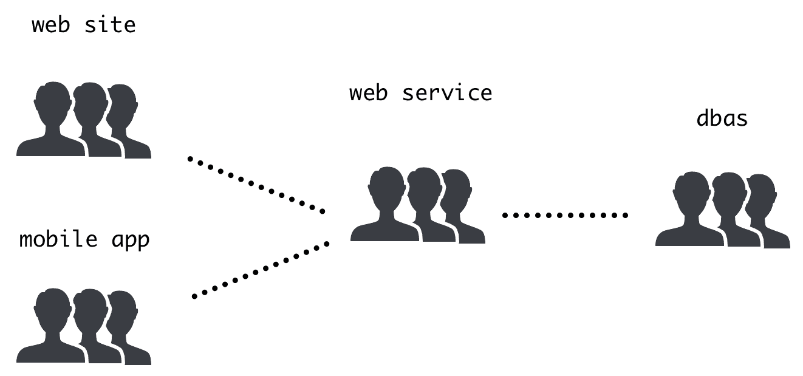
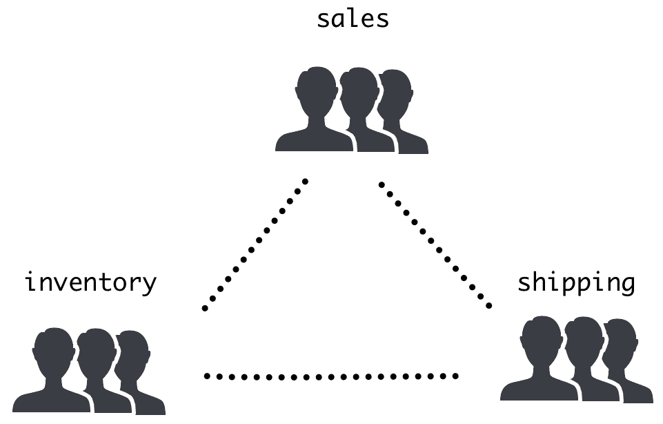

# 跨团队协作和沟通

如前所述，微服务的主要特点是能够并行开发它们。为了确保最大效率，我们需要成功地协调我们的团队，以避免冲突。在本章中，我们将讨论确保不同团队成功协作所需了解的不同要素。

首先，我们将介绍如何在不同的微服务之间获得一致的愿景，不同的通信结构如何在软件元素中形成通信，以及如何确保我们不会在软件中积累积垢。然后，我们将讨论如何确保团队在发布上进行协调，并改进其流程和工具，使其越来越可靠。

本章将介绍以下主题：

*   保持一致的架构愿景
*   工作量划分与康韦定律
*   平衡新功能和维护
*   设计更广泛的发布流程

到本章结束时，我们将知道如何组织和协调独立工作的不同团队，以便我们能够从中获得最大的收益。

# 保持一致的架构愿景

在基于微服务的系统中，每个团队都能够独立于其他团队，独立地执行大部分任务。设计服务，使其尽可能独立，并且具有最小的依赖性，这是实现良好开发速度的关键。

因此，微服务分离允许团队独立和并行地工作，而使用独石，大多数从事 it 工作的人都会跟踪所发生的事情，甚至会因为某个特定开发人员关注领域之外的工作而分心。他们将知道新版本何时发布，并看到新代码被添加到他们正在处理的相同代码库中。然而，在微服务体系结构中并非如此。在这里，团队专注于他们的服务，不会被其他功能分散注意力。这带来了清晰性和生产力。

然而，仍然需要对该系统有一个全球视野。需要对系统的体系结构如何随着时间的推移而变化进行长期观察，以便对其进行调整。这种愿景（在单片系统中）是隐含的。微服务需要更好地理解这些变化，以便它们能够有效地工作，因此能够统一这一全球愿景的领先架构师非常重要。

The architect's role is a position in the software industry that isn't defined consistently.

In this book, we will define it as a role that deals with the structure of APIs and services as a whole. Their main objective is to coordinate teams when it comes to technical issues, rather than dealing with code directly.

明确指定负责系统全局架构的人员有助于我们对系统应该如何发展保持长期的愿景。

In small companies, Chief Technical Officers may fulfill the architect's role, though they will also be busy handling elements that are related to managerial processes and costs.

领先架构师的主要职责是确保微服务部门在其发展过程中保持意义，并确保服务之间通信的 API 保持一致。他们还应该努力促进跨团队的标准生成，并在整个组织内共享知识。

当涉及到与微服务相关的功能以及可能涉及多个团队的任何其他冲突时，架构师也应该是最终决策者。在从整体到微服务架构的过渡过程中，这一角色非常有帮助，但在这一过程完成后，他们还可以确保组织能够适应新的挑战，并控制技术债务。在微服务体系结构中工作的系统旨在创建独立的团队，但他们都真正受益于由外部人员创建的共享全球愿景。

为了更好地协调，团队的划分非常重要。让我们了解一下当我们将系统的开发划分为不同的团队时会出现的一些挑战。

# 工作量划分与康韦定律

微服务体系结构系统对于大型软件系统来说是足够的，尽管公司倾向于从单片应用程序开始。这对于任何有小型团队的系统都是有意义的。随着系统的探索和旋转，它会随着时间的推移而增长。

但当整体系统发展到一定规模时，它们就变得难以处理和开发。由于历史原因，内部结构相互交织，随着复杂性的增加，系统的可靠性可能会受到影响。在灵活性和冗余性之间找到平衡可能很困难。

Remember that microservices are useful when the development team is big. For small teams, a monolith is easier to develop and maintain. It's only when many developers work on the same system that dividing the work and accepting the overheads of a microservice architecture makes sense.

扩展开发团队可能会变得很困难，因为那里会有太多的旧代码，学习如何在其中导航是很困难的，而且需要很多时间。开发人员（已经存在很长时间的开发人员）知道什么警告可以帮助他们，但它们会成为瓶颈。增加团队规模没有帮助，因为进行任何更改都可能变得复杂。因此，每一个新开发人员都需要大量的培训才能跟上进度，并成功地修复 bug 和开发新功能。

团队也有一个自然的规模限制。超过这一限制的增长可能意味着必须将它们分成更小的部分。

The size of a team is highly variable, but normally, the 7±2 components are considered as a rule of thumb for the ideal number of people who should be in a team.

Bigger groups tend to generate smaller groups on their own, but this means there will be too many to manage and some may not have a clear focus. It's difficult to know what the rest of the team is doing.

Smaller teams tend to create overhead in terms of management and inter-team communication. They'll develop faster with more members.

在一个庞大的整体系统中，多个独立的团队往往会在没有明确的长期观点的情况下胡闹。这可以通过设计一个强大的内部结构来缓解，但这需要大量的前期规划和强有力的监管来确保它得到遵守。

微服务架构是一种解决这些问题的设计，因为它在系统的各个部分之间建立了非常严格的边界。然而，这样做需要开发团队具有一定的规模，这样他们就可以像几个小团队一样独立工作。这是微服务体系结构系统的主要特征。构成它的每个微服务都是独立的服务，可以独立开发和发布。

这种工作方式允许团队并行工作，没有任何干扰。他们的行动领域是明确的，任何依赖关系都是显式设置的。因此，微服务之间的边界非常紧密。

仅仅因为一个微服务是独立发布的，并不意味着一个版本就足以发布一个完整的功能。正如我们已经看到的，有时候，一个微服务中的一个特性需要在部署它之前处理另一个微服务。在这种情况下，需要处理几个微服务。

在规划如何划分团队时，要记住的最重要的想法是团队的结构如何反映在软件中。这是康威定律所描述的。

# 描述康威定律

康威定律是一句软件格言（[https://www.nagarro.com/en/blog/post/76/microservices-revisiting-conway-s-law](https://www.nagarro.com/en/blog/post/76/microservices-revisiting-conway-s-law) ）。换句话说，在任何生产软件的组织中，软件将复制组织的通信结构。例如，以一种非常简单的方式，一个组织被划分为两个部门：采购和销售。这将生成两个软件块：一个专注于购买，另一个专注于销售。他们将在需要时进行沟通。

In this section, we will talk about *software units*. This is a generic term that describes any software that's treated as a single cohesive element. It can be a module, a package, or a microservice.

In the microservice architecture, these software units are mainly microservices, but in some cases, there can be other types. We will see examples of this in the *Dividing the software into different kinds of software units* section.

这可能并不奇怪。团队之间以及同一团队内部的沟通水平不同是很自然的。然而，团队合作的影响是巨大的，其中一些影响如下：

*   团队间 API 比团队内 API 更昂贵，无论是在操作还是开发方面，因为它们的通信更复杂。让它们通用和灵活，以便可以重用，这是有意义的。
*   如果沟通结构复制了人类的组织，那么明确表达是有意义的。团队间 API 应该比团队内 API 更可见、更公开、更文档化。
*   在设计系统时，在分层团队结构中划分系统是阻力最小的路径。以任何其他方式设计它们都需要进行组织变革。
*   另一方面，改变组织结构是一个困难而痛苦的过程。任何经历过 reorg 的人都知道这一点。更改将反映在软件中，因此应进行相应的计划。

*   让两个团队在同一个软件单元上工作会产生问题，因为每个团队都会试图将其拉向各自的目标。

The owner of a software unit should be a single team. This shows everyone who's responsible for who has the final say on any change and helps us focus on our vision and reduce technical debt.

*   不同的物理位置会施加通信限制，例如时间差，这将在我们跨这些位置开发软件时产生障碍。按位置划分团队是很常见的，这就需要构建这些团队之间的通信（以及 API）。

注意，德沃斯运动与康韦定律有关。划分工作的传统方法是将正在开发的软件与其运行方式分开。正如康威定律所描述的那样，这在两个团队之间造成了差距，从而产生了与两个团队之间缺乏理解相关的问题。

对此问题的反应是创建能够开发和操作自己的软件以及部署它的团队。这就是 DevOps。它将操作问题转移给开发团队，目的是创建一个反馈回路来激励、理解和修复它们。

康威定律不是一件需要克服的坏事。这反映了任何组织结构都会对软件结构产生影响。

Remembering this may help us design the system so that the communication flow makes sense for the organization and existing software.

DevOps 运动的一个关键组成部分是推进构建系统的技术，以简化生产环境的运行方式，从而简化部署过程。这允许我们以新的方式组织团队，从而导致多个团队能够控制发布。

现在，让我们谈谈如何将软件组织成不同的部门。

# 将软件划分为不同类型的软件单元

虽然本书的主要目的是讨论微服务中软件的划分，但这并不是唯一可能的划分。其他部门可以包括 microservice 或共享包中的模块。

The main characteristic of a microservice is that it is independent in terms of development and deployment, so full parallelization can be achieved. Other divisions may reduce this and introduce dependencies.

Ensure that you justify these changes.

在本书中介绍的示例系统中，我们介绍了一个模块，用于验证请求是否由用户签名。用户后端生成签名头，后台和前端通过`token_validation.py`模块独立验证。

这个模块应该属于拥有用户后端的同一个团队，因为它是它的自然扩展。我们需要验证它生成的令牌是否与用户后端生成的令牌相同。

避免重复和保持同步的最佳方法是生成一个可以安装在相关微服务上的 Python 包。然后，可以像对待`requirements.txt`文件中的任何其他外部依赖一样对待包。

要用 Python 打包库，我们可以使用多种工具，包括官方的*Python 打包用户指南*（[中的工具 https://packaging.python.org/](https://packaging.python.org/) ）到更新的工具，如诗歌（[https://poetry.eustace.io](https://poetry.eustace.io) ），更易于用于新项目。

如果我们希望该软件包公开，可以将其上载到 PyPI。或者，我们可以使用 Gemfury 等工具将其上载到私有存储库，或者在需要时托管我们自己的存储库。这在包和它的维护者之间以及作为依赖项使用它的团队之间进行了明确的划分。

划分软件单元对团队划分有影响。现在，让我们来看看如何组建团队。

# 设计工作结构

考虑到康威定律，软件的划分应该反映组织的结构。当我们从一个整体迁移到一个微服务架构时，这是非常相关的。

记住，从一个整体到一个微服务是我们运作方式的一个巨大变化。这既是一种组织变革，也是一种技术变革。主要的风险在于人的因素，包括培训人员使用新技术和让开发人员对他们将要工作的新领域感到满意等挑战。

对组织结构进行彻底的改变可能非常困难，但需要进行一些小的调整。当从一块巨石迁移到一个微服务时，需要对团队进行重组。

请记住，一个大的重组有可能引起人们的愤怒和政治问题。人类不喜欢改变，任何决定都需要有意义。预计必须解释和澄清这一举措。对于新结构要实现什么目标有明确的目标将有助于实现目标。

让我们来看看一些团队划分的例子，以及它们的利弊。

# 围绕技术构建团队

在某些情况下，与技术相关的不同技能可能是相关的。系统的某些部分可能处理与其他任何部分完全不同的技术。

移动应用程序就是一个很好的例子，因为它们在使用语言方面受到限制（Java 用于 Android，Objective-C 或 Swift 用于 iOS）。带有网站和移动应用程序的应用程序可能需要特定团队处理移动应用程序的代码。

一个更传统的例子是数据库团队，它是围绕**数据库管理员**（**DBA**而建立的。他们将控制对数据库的访问，并对其进行操作以保持其良好状态。不过，这种结构正在消失，因为数据库操作现在更容易，而且通常由大多数开发人员处理，而且数据库的基础结构管理近年来已大大简化。

这可能使我们有理由围绕某些领域创建特定的团队。该技术的障碍确保系统之间的通信是结构化的。

下图是我们将遇到的各种团队的示例。他们根据技术和沟通方式进行分组。数据库团队将与创建 web 服务后端的团队进行通信，他们将与 web 和移动团队进行通信：

该模型的主要缺点是新特性可能需要多个团队来处理。为了在数据库中存储新的值，对面向客户的代码所做的任何更改都需要每个团队的工作输入。这些特性需要额外的协调，这会限制开发速度。

# 围绕领域构建团队

另一种结构是围绕不同知识领域的结构，通常与公司的业务领域相关。每个知识领域都有自己的自包含系统，但它们相互通信。某些部件可能有外部可访问的接口，而其他部件可能没有。

这种结构通常存在于已建立的组织中，这些组织在不同的领域已经成功地开展了多年的工作。

例如，在线零售商可分为三个方面：

*   **销售**：处理外部网站和营销。
*   **存货**：购买商品以便出售，同时处理库存。
*   **发货**：将产品交付给客户。跟踪信息显示在网站上。

在这种情况下，每个区域都有自己的数据库，以便存储相关数据及其服务。它们通过定义的 API 相互通信，最频繁的更改发生在域中。这允许在域内快速发布和开发。

跨域拥有新功能也是可能的。例如，装运跟踪信息的更改可能要求我们匹配销售人员产生的更改。然而，这些变化应该少发生。

在本例中，每个团队将相互通信，如下图所示：

这种结构的主要不便之处在于可能会产生孤立的团队和孤岛心态。每个系统都有自己的处理方式，因此它们可能会出现分歧，以至于无法共享相同的基本语言。当需要跨域功能时，可能会导致讨论和摩擦。

# 围绕客户构建团队

在一些组织中，主要目标是为客户创建定制工作。也许客户需要以定制 B2B 方式与产品集成。在这种情况下，能够开发和运行自定义代码是至关重要的。

该结构以客户为中心。三个团队（称为红色、金色和蓝色）分配给客户，并为每个客户维护一项特殊服务，包括他们的自定义代码。每个客户团队处理两个客户。另一个团队负责处理产品的后端，该后端包含系统的通用代码和基础结构。该团队与客户分开工作，但在共享客户团队的功能时添加这些功能，以便将其包含在产品中。还分享了总体改进。

这在组织中创造了两种速度。客户团队关注客户的短期需求，而产品团队关注客户的长期需求。

在这里，产品团队将与客户团队交谈，但客户团队之间不会进行太多交谈。如下图所示：

这种结构适用于高度定制的服务，因此它们可以包含为单个客户生成的代码，这可能会使它们失去对一般产品的关注。这里的主要问题是客户团队在面对苛刻的客户时可能面临的高压力，这对开发人员来说可能是一种负担。产品团队需要确保他们对产品进行了有益的补充，并尽可能减少长期问题。

# 围绕组合构建团队

前三个例子是合成用例。现实生活更加复杂，可能需要所有这些因素的混合，或者需要一个全新的结构。

如果组织足够大，可能会有几十个不同的团队和软件单元。请记住，如果一个团队足够大，它可以处理多个软件单元。然而，两个团队不应该拥有相同的软件单元，以避免所有权和缺乏重点。

分析组织中的沟通流程，以了解在转向微服务时需要解决的难点，并确保人员结构考虑到了微服务和软件单元的设计。

团队的另一个重要元素是在添加新特性和维护现有代码的时间之间找到适当的平衡。

# 平衡新功能和维护

每个软件服务都需要维护，以便保持良好状态，但不会增加明显的外部价值。然而，维护任务对于良好的运行至关重要，可以分为两类：定期维护和管理技术债务。

技术债务是一个将使用大部分时间，并需要进一步讨论，但在此之前，让我们看看定期维护。

# 定期维护

这种维护以软件服务固有的任务的形式出现。通过运行依赖于其他组件（如底层操作系统或 Python 解释器）的服务，我们需要使它们保持最新并升级到新版本。

In the context of using containers and Kubernetes, there are two systems that act as operating systems that we need to take into account. One is the OS from the containers; here, we used Alpine. The other is the OS that handles the Kubernetes nodes, in which AWS EKS is handled automatically, but needs to be upgraded to the Kubernetes version.

使依赖项保持最新的主要原因如下，按其重要性顺序排列：

*   新版本修复了安全问题。
*   一般性能改进。
*   可以添加启用新功能的新功能。

如果我们有计划的话，这些任务可以减轻。例如，使用标有**长期支持**（**LTS**的操作系统版本可以减少更新系统时出现的问题。

An LTS version of an OS is a version that receives support and critical updates during a long cycle. For example, a regular Ubuntu version is released every 6 months and receives updates (including critical security updates) for 9 months. LTS versions are released every 2 years and receive support for 5 years.

When running services, it is recommended to use LTS versions in order to minimize required maintenance work.

所有这些包和依赖项都需要更新，以确保操作系统正常工作。另一种选择是打开安全漏洞或留下过时的系统。

更新依赖项可能需要我们调整代码，这取决于代码的某些部分是否已被弃用或删除。在某些情况下，这可能代价高昂。在撰写本文时，最著名的迁移是 Python 社区将 Python2 升级到 Python3，这项任务耗时多年。

不过，大多数升级通常都是非常常规的，只需要很少的工作。尝试制定一个升级计划，以合理的方式跟上进度，并制定可靠的指导方针；例如，新的操作系统 LTS 版本发布时的规则*和*应在接下来的 3 个月*内迁移所有系统。这产生了可预测性，并为每个人提供了一个可以跟进和执行的明确目标。*

*Continuous integration tools can help in this process. For example, GitHub automatically detects dependencies in files such as `requirements.txt` and notifies us when a vulnerability is detected. It's even possible to automatically generate pull requests when updating modules. Check out the documentation for more information: [https://help.github.com/en/github/managing-security-vulnerabilities/configuring-automated-security-fixes](https://help.github.com/en/github/managing-security-vulnerabilities/configuring-automated-security-fixes).

升级依赖项可能是最常见的定期维护任务，但也有其他可能性：

*   清理或归档旧数据。这些操作通常可以自动化，节省大量时间并减少问题。
*   修复依赖于业务流程的操作，例如生成月度报告等。如果可能的话，这些应该是自动化的，或者应该设计工具，以便用户能够自动生成这些工具，而不是依赖技术人员进行定制操作。
*   修复由错误或其他错误产生的永久性问题。bug 有时会使系统处于不良状态；例如，数据库中可能有损坏的条目。当 bug 被修复时，我们可能需要通过取消阻止进程或用户来解决这种情况。

这些过程可能很烦人，特别是如果它们是重复的，但通常都很容易理解。

另一种形式的维护涉及技术债务，更为复杂，因为它的引入更为缓慢，更难以清楚地发现。正确解决技术债务是最具挑战性的维护任务，但在我们做任何事情之前，我们需要了解它。

# 理解技术债务

技术债务是一个在软件开发中使用的概念，用于描述在将来实现非最优解决方案时将增加的额外成本。换句话说，选择快速或简单的选项意味着以后的功能需要更长的时间，并且更难开发。

As a metaphor, technical debt has been around since the early 90s, but the concept has been described before then.

Like any metaphor, it is useful, but it has limits. In particular, non-technical people tend to associate it with financial debt, even though they have different implications. For example, most technical debt is created without us even noticing it. Make sure that you don't take the metaphor too far.

技术债务在一定程度上是不可避免的。在实现一个特性之前，没有无限的时间去研究所有的可能性，在做出任何决定的时候，也没有完美的信息。这也是任何复杂系统中熵增长的结果。

除了不可避免之外，这也可能是一个深思熟虑的选择。发展受到时间的限制，所以一个不完善的市场快速解决方案可能比错过最后期限更好。

技术债务的另一个迹象是专注于某些知识。在任何情况下，技术债务都会随着时间的推移不断累积，这会给新功能带来摩擦。复杂性的增加也会造成可靠性问题，因为 bug 将越来越难以理解和修复。

Simplicity is the best friend of reliable systems. Simple code is easy to understand and correct and makes bugs either obvious or quick to detect. The microservice architecture aims to reduce the inherent complexity of a monolith by creating independent services that are smaller and have clear responsibilities assigned to them and that create explicit interfaces across them.

技术债务可能会增长到需要大型体系结构的程度。我们已经看到，从一块巨石到一个微服务架构的转变可能就是这样一个时刻。

An architectural migration such as this is a big effort and will require time to deliver. New microservices that are reproducing the features that already exist in the monolith may conflict with new features being introduced.

This creates a moving target effect that can be very disruptive. Ensure that you identify these conflicting points and try to minimize them in your migration plan. Some new features may be able to be delayed until the new microservice is ready, for example.

然而，我们需要能够更早地解决技术债务问题，而不是等到技术债务如此之大，以至于只有彻底的变革才能解决它。

# 不断解决技术债务问题

减少技术债务需要一个持续的过程，并引入到日常运作中。专注于持续改进的敏捷技术试图引入这种思维。

检测技术债务通常来自开发团队内部，因为他们更接近代码。团队应该考虑在哪些地方可以更顺利地进行操作，并留出时间进行这些改进。

A great source of information that allows us to detect technical debt is metrics, such as the ones we set up in [Chapter 10](10.html), *Monitoring Logs and Metrics*.

忽视修复这些问题的风险在于，当已有的功能慢慢变得更慢、更不可靠时，软件就会陷入崩溃。随着时间的推移，它们对客户和外部合作伙伴的影响将越来越明显。在这之前，在这种环境中工作会使开发人员的生活变得困难，并且有精力枯竭的风险。新开发的延迟也很常见，因为代码本身就很难使用。

为了避免陷入这种情况，需要分配时间以持续的方式减少技术债务，并加入新功能和其他工作。应在维护和技术债务减少以及新功能之间找到平衡。

A lot of the techniques we've talked about in this book help us improve the system in a continuous fashion, from the continuous integration techniques we described in [Chapter 4](04.html), *Creating a Pipeline and Workflow*, to the code reviews and approvals that we described in [Chapter 8](08.html), *Using GitOps Principles*.

分布可能高度依赖于系统的当前形状，但它确实有助于明确和强制执行。诸如用于减少技术债务的特定时间百分比之类的东西可能会有所帮助。

减少技术债务既昂贵又困难，因此尽可能少地引入技术债务是有意义的。

# 避免技术债务

处理技术债务的最佳方法是一开始就不要引入它。然而，这说起来容易做起来难。有多种因素会影响决策的质量，从而导致技术债务。

最常见的原因如下：

*   **缺乏一个战略性的、高层次的计划来给出方向**：这会产生不一致的结果，因为每次发现相同的问题，都会以不同的方式解决。我们讨论了团队之间的协调如何解决整个组织的标准问题，并确保遵守这些标准。如果有人担任软件架构师，寻求创建全面一致的指导方针，应该会大大改进这种情况。
*   **没有正确的知识选择正确的选项**：这很常见。有时，需要做出决策的人由于沟通失误或缺乏经验而无法获得所有相关信息。该问题是缺乏处理当前问题经验的结构的典型问题。确保您拥有一支训练有素的团队，并创造一种文化，让更有经验的成员帮助和指导初级成员，从而减少此类情况。记录以前的决策并简化如何使用其他微服务的文档将帮助我们协调团队，使他们掌握谜题的所有相关部分。这有助于他们避免由于错误的假设而犯错误。另一个重要因素是确保团队对他们使用的工具进行适当的培训，以便他们充分了解自己的能力。对于外部工具，如精通 Python 或 SQL，以及任何需要培训材料、文档和指定联系人的内部工具，都应该如此。

*   **没有花足够的时间研究不同的选择或规划**：这个问题是由压力和快速进步的需要造成的。这可能在组织文化中根深蒂固，当组织成长时，放慢决策速度可能是一项具有挑战性的任务，因为较小的组织往往需要更快的流程。记录决策过程并要求其经过同行审查或批准有助于减缓这一过程，并确保工作的彻底性。重要的是要在哪些决策需要更多审查，哪些决策不需要审查之间找到平衡。例如，可以在团队内部审查适合微服务的所有内容，但需要多个微服务和团队的功能应该在外部审查和批准。在这种情况下，在收集信息和做出决策之间找到适当的平衡非常重要。记录决策和输入，以便您了解导致决策和输入的流程，并优化流程。

避免这些问题的最好方法是反思以前的错误并从错误中吸取教训。

# 设计更广泛的发布流程

虽然独立部署每个微服务的能力实际上是系统的一个关键要素，但这并不意味着不需要协调。

首先，仍有一些功能需要在多个微服务中部署。我们已经研究了如何处理开发过程，包括明确地处理版本控制和检查依赖关系等细节。那现在呢？

在这些情况下，需要团队之间进行协调，以确保实现依赖关系，并以适当的顺序执行不同的部署。

虽然领先的架构师可以帮助进行一些协调，但架构角色应该专注于长期目标，而不是短期发布。允许团队进行自我协调的一个好工具是在会议上通知其他团队发布信息。

# 每周发布会议中的计划

当发布过程是新的，并且从巨石的迁移仍在进行中时，最好能够深入了解每个团队正在做的事情。由每个团队的代表参加的每周发布会议是传播关于其他团队正在发生的事情的知识的极好方式。

发布会议的目标应如下所示：

*   计划在未来 7 天发布，以及何时发布的大致时间；例如，*我们计划在周三发布新版本的用户后端。*
**   您应该为任何重要的新特性提供提示，特别是如果其他团队可以使用它的话。例如，如果新版本改进了身份验证，请确保将团队重定向到新 API，以便他们也可以获得这些改进。*   说明任何拦截器。例如，在 Thinks 后端发布其具有功能 A 的版本之前，我们无法发布此版本。*   如果有关键维护或任何可能影响发布的更改，请升起任何标志。例如，在周四上午，我们需要进行数据库维护，所以请在 12 点之前不要发布任何内容。工作完成后，我们将发送电子邮件。*   查看前一周发生的发布问题。稍后我们将更详细地讨论这个问题。*

 *这类似于许多敏捷实践（如 SCRUM）中常见的站立会议，但重点是发布。为了能够做到这一点，我们需要提前指定发布的时间。

考虑到微服务发布的异步性质，随着持续集成实践的实施和这一过程的加快，将有许多常规发布不会提前那么长时间进行规划。这很好，意味着发布过程正在改进。

当涉及到更高风险的发布时，尽量提前一点计划，并利用发布会议与其他团队进行有效沟通。会议是保持对话开放的工具。

随着时间的推移，随着持续集成实践越来越成熟，发布速度越来越快，每周发布会议将慢慢变得越来越不重要，以至于可能不再需要再做了——至少不再那么定期了。这是反思持续改进实践的一部分，这也是通过识别发布问题来实现的。

# 关于释放问题的思考

并不是每一次发布都会进展顺利。有些会因为工具或基础设施中的问题而失败，或者可能是因为过程中容易出错。事实上，有些版本会有问题。不幸的是，无法避免这些情况。

为了减少和最小化发布问题，每次发现问题时，都需要记录并在每周发布会议或同等论坛上提出。

有些问题很小，只需要一点额外的工作就可以成功发布；例如，一个错误的配置，避免新版本在修复之前启动，或者一个协调问题，其中一个服务在其依赖项之前部署。

其他问题将更严重，甚至可能由于问题导致停机。在这里，回滚非常有用，这样我们就可以快速返回到已知状态并重新规划。

在任何情况下，它们都应该被适当地记录下来，即使只是简单地记录下来，然后被共享，这样流程就可以被细化。分析出了什么问题是不断改进您的发布的关键，以便它们更快、更简单。

对这些问题要开诚布公。如果您希望发现每一个问题并快速评估解决方案，那么创建一种公开辩论和承认问题的文化非常重要。

Capturing problems is not, and should never be, about assigning blame. It's the organization's responsibility to detect and correct problems.

If this happens, not only will the environment become less attractive to work in, but problems will be hidden by teams so that they don't get blamed.

Unaddressed problems tend to be multiplicative, so reliability will suffer greatly.

能够顺利发布对于快速部署和提高速度至关重要。当我们处理这些类型的问题时，只需要简单的文档，因为它们通常是轻微的，在最坏的情况下，延迟发布一两天。

对于更大的问题，当外部服务中断时，最好有一个更正式的流程来确保问题得到正确解决。

我们可以改进流程的另一种方法是正确理解实时系统中中断服务的问题的原因。最有效的工具是死后会议。

# 举行验尸会议

不限于发行版，有时会有大事件中断服务，需要做大量工作才能修复。在这些紧急情况下，第一个目标是尽快恢复服务。

在服务恢复稳定后，为了从这次经历中吸取教训并避免再次发生，参与事件的每个人都应该参加一次验尸会议。验尸会议的目的是根据在紧急情况中吸取的经验教训制定一系列后续任务。

要记录这一点，您需要创建一个模板。这将在验尸会议上填写。模板应捕获以下信息：

*   **检测到什么问题？**如果不明显，包括如何检测到；例如，网站关闭，返回 500 个错误。这表明错误有所增加。
*   **什么时候开始和结束的？**事件的时间表；例如，周四下午 3 点到 5 点。
*   **谁参与了事件的补救？**检测问题或解决问题。这有助于我们收集所发生事情的信息。
*   **为什么失败了？**找出根本原因和导致该问题的一系列事件；例如，网站关闭是因为应用程序无法连接到数据库。数据库没有响应，因为硬盘已满。硬盘驱动器已满，因为本地日志已填满磁盘。
*   **怎么修的？**已采取措施解决事件；例如，删除了超过一周的日志。
*   **此次事件应采取哪些后续行动？**应纠正或解决不同问题的措施。理想情况下，他们应该包括谁将执行行动；例如，不应存储本地日志，而应将其发送到集中式日志。应监控硬盘空间量，如果可用空间不足 80%，应发出警报。

这些要素中的一些可以在紧急情况发生后立即填写，例如谁参与了调查。然而，最好在事情发生后一到三天安排验尸会议，让每个人都消化和处理这些数据。根本原因可能与我们最初的想法不同，花一些时间思考发生了什么有助于我们找到更好的解决方案。

As we discussed in the *Reflecting on release problems* section, be sure to encourage open and candid discussion when you're dealing with service interruption incidents.

Post-mortem meetings are not there to blame anyone, but to improve the service and reduce risks when you're working as a team.

后续行动应在会议上决定，并相应地确定优先顺序。

Although detecting the root cause is very important, note that actions should be taken against other causes. Even if the root cause is one, there are also other preventive actions that can minimize the effect it has if it happens again.

尸检会议产生的行动通常是高度优先的，应该尽快完成。

# 总结

在本章中，我们研究了跨团队协调的不同方面，以便我们能够成功地管理运行微服务体系结构的组织。

我们开始讨论如何保持全球视野和各部分之间的协调是好的。我们谈到了有一个明确命名的主要架构师来监督系统，并有一个高级视图，使他们能够确保团队之间没有冲突。

我们描述了康威定律以及通信结构如何最终形成软件结构，因此对软件所做的任何更改都应该以某种方式反映在组织中，反之亦然。然后，我们学习了如何划分职责范围，并根据不同的组织提供了一些可能的划分示例。

接下来，我们介绍了技术债务是如何减缓正在进行的开发过程的，以及引入持续解决技术债务的心态是如何重要，以避免降低内部团队和使用技术债务的客户的体验。

最后，我们解决了发布可能导致的一些问题，包括团队之间的充分协调，特别是在使用 GitOps 的早期阶段，以及在发布失败或服务停止时进行回顾性分析。

# 问题

1.  为什么领先的架构师可以方便地使用微服务体系结构系统？
2.  康威定律是什么？
3.  为什么会引入技术债务？
4.  为什么创造一种我们可以持续工作以减少技术债务的文化很重要？
5.  为什么在发布中记录问题并与每个团队共享这些问题很重要？
6.  验尸会议的主要目的是什么？

# 进一步阅读

要了解更多关于架构师角色的信息，请阅读*软件架构师手册*（[https://www.packtpub.com/application-development/software-architects-handbook](https://www.packtpub.com/application-development/software-architects-handbook) ），其中包括专门讨论软技能和架构演进的章节。您可以在*新工程游戏*（[中阅读更多有关康威法律和构建数字业务的信息 https://www.packtpub.com/data/the-new-engineering-game](https://www.packtpub.com/data/the-new-engineering-game) 。**