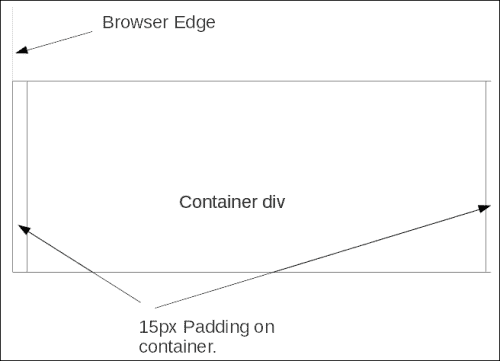
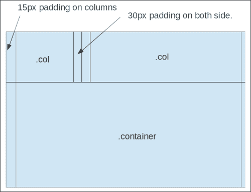
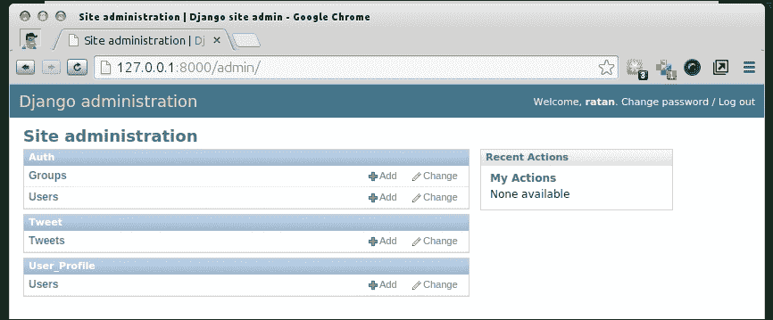
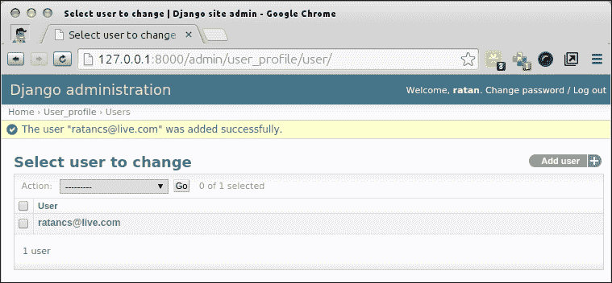
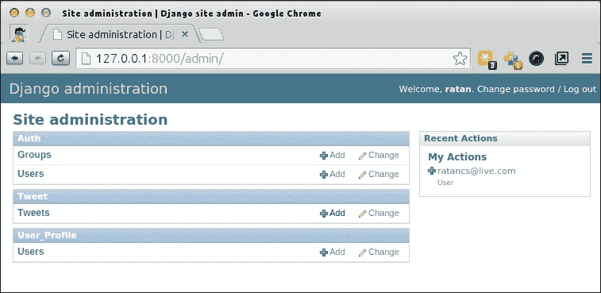
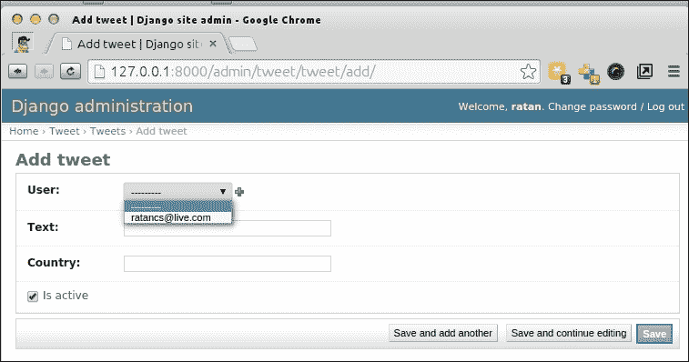

# 第四章，构建类似 Twitter 的应用程序

在前几章中，我们学习了编写代码的更好方法。记住这些要点，现在是我们开始真正的 Django 项目开发并学习视图、模型和模板的时候了。

本章每一节的第一部分都将介绍基础知识，以及它所涉及的特定主题的工作原理。这将包括适当的实践、标准方法和重要的术语。

每个部分的第二部分将是这个概念在 mytweets Django 应用程序开发中的应用。第一部分可以看作是主题的章节描述，第二部分是 Django 项目形式的练习，这将是一次独特的学习体验。

本章涵盖以下主题：

*   关于 Django 术语的一句话
*   设置基本模板应用程序
*   创建 Django 的项目模板结构
*   为应用程序设置基本引导
*   创建主页面
*   基于类的视图简介
*   mytweets 项目的 Django 设置
*   生成用户页面
*   设计初始数据库模式
*   用户注册和帐户管理
*   为主页创建模板

# 关于 Django 术语的一个词

Django 是一个 MVC 框架。但是，在整个代码中，控制器被称为**视图**，视图被称为**模板**。Django 中的视图是检索和操作数据的组件，而模板是向用户呈现数据的组件。因此，Django 有时被称为**模型模板视图**（**MTV**框架。这种不同的术语既不会改变 Django 是 MVC 框架的事实，也不会影响应用程序的开发方式，但请记住这些术语，以避免在过去使用过其他 MVC 框架时可能出现的混淆。

您可以将本章视为对 Django 主要组件的深入介绍。您将学习如何使用视图创建动态页面，如何使用模型在数据库中存储和管理数据，以及如何使用模板简化页面生成。

在学习这些特性的同时，您将对 Django 组件如何工作以及如何相互交互形成一个坚实的概念。随着我们开发更多功能并将其添加到应用程序中，后面的章节将更深入地探讨这些组件。

# 建立基础模板应用

我们的项目将是一个微博网站，每个用户都会有一个公共页面，上面会有他们发布的推文的时间线。

看到开发服务器的欢迎页面后，首先想到的是询问如何更改它。为了创建自己的欢迎页面，我们需要以 URL 的形式定义应用程序的入口点，并告诉 Django 在访问者访问此 URL 时调用特定的 Python 函数。我们将自己编写这个 Python 函数，并让它显示我们自己的欢迎消息。

本节基本上是我们在前一章中所做配置的重做，但目的是将所有说明放在一起，以便项目引导需要更少的页面查找。

## 创建虚拟环境

我们将使用以下命令为 Django 设置虚拟环境以使其正常工作：

```py
$ virtualenv django_env

```

输出结果如下：

```py
New python executable in django_env/bin/python
Installing setuptools, pip...done.

```

我们需要立即激活虚拟环境并设置所有环境变量，以便所有 Python 安装都将路由到此环境目录，而不会影响其他设置：

```py
$ source django_env/bin/activate

```

输出结果如下：

```py
(django_env)ratan@lenovo:~/code$

```

# 安装 Django

虽然您已经安装了 Django，但我们将再次安装，因为 Django 将由`virtualenv`管理，其他项目或用户（或您自己）在其他地方工作时不会弄糟。

```py
$pip install django

```

您可能会得到如下错误：

```py
bad interpreter: No such file or directory

```

如果是这样，请在没有空格的路径中创建 VirtualEnvironment。在创建虚拟环境的位置的路径中，很可能存在一个名称包含空格的目录，例如，`/home/ratan/folder name with space$virtualenv django_env`。

如果是这样，请将目录名更改为以下内容：

`/home/ratan/folder_name_with_no_space$virtualenv django_env`

我们可以使用命令`pip install django`继续安装 Django。

输出结果如下：

```py
Downloading/unpacking django
Downloading Django-1.6.5-py2.py3-none-any.whl (6.7MB): 6.7MB downloaded
Installing collected packages: django
Successfully installed django
Cleaning up...

```

现在，在我们创建 Django 应用程序之前，我们将确保 Git 已安装。使用以下命令查找我们安装的 Git 版本：

```py
$git --version

```

输出结果如下：

```py
git version 1.9.1

```

此确认我们已安装 Git。当然您一定想知道我们是否会在这个项目中使用版本控制。答案是肯定的：随着我们的进行，我们将对大多数项目文件进行版本控制。

## 创建项目 Django 的模板结构

在部分，我们将为项目创建结构，例如，为我们的项目创建一个名为`mytweets`的文件夹，为我们的项目安装所需的包，等等。运行以下命令：

```py
$django-admin.py startproject mytweets

```

这将创建名为`mytweets`的文件夹，我们将使用该文件夹作为项目目录。在当前文件夹中，我们看到两个子文件夹：`environment`和`mytweets`。现在的问题是我们是否要对环境文件夹进行版本控制。我们不是，因为这些文件非常特定于您当前的系统。他们不会帮助任何人建立与我们相同的环境。但是，在 Python 中还有另一种方法可以做到这一点：使用`pip freeze`命令。这实际上会获取 Django 应用程序中安装的所有当前库的快照，然后您可以将该列表保存在文本文件中并对其进行版本控制。因此，您的开发伙伴可以下载相同版本的库。这真是一种蟒蛇式的方法，不是吗？

安装新软件包最常用的方法是使用`pip`命令。`pip install`命令有以下三种版本：

```py
$ pip install PackageName

```

这是默认设置，安装程序包的最新版本：

```py
$ pip install PackageName==1.0.4

```

使用`==`参数，您可以安装特定版本的软件包。在本例中，这是 1.0.4。使用以下命令安装具有版本号的软件包：

```py
$ pip install 'PackageName>=1.0.4' # minimum version

```

当您不确定要安装的软件包版本，但认为需要库的最低版本时，请使用上述命令。

使用`pip`命令安装库非常容易。只需在命令行中键入以下命令即可完成此操作：

```py
$pip install -r requirements.txt

```

现在我们需要冻结当前项目中的库：

```py
$pip freeze > requirements.txt

```

此命令冻结项目中安装的当前库以及版本号（如果指定），并将其存储在名为`requirements.txt`的文件中。

在我们项目的这个阶段，`pip freeze`命令将类似这样。

```py
Django==1.6.5
argparse==1.2.1
wsgiref==0.1.2
```

要将这些库与项目一起安装回新环境，我们可以运行以下命令：

```py
$pip install -r requirements.txt

```

因此，我们可以继续将代码目录初始化为 Git 存储库，并将当前路径更改为`$cd mytweets`。执行以下命令以在项目文件夹中构建 Git 存储库：

```py
$git init

```

输出结果如下：

```py
Initialized empty Git repository in /home/ratan/code/mytweets/.git/

```

如果我们在基于 Linux 的系统上运行所有命令以获得详细的目录列表，我们可以看到以下输出：

```py
...
drwxrwxr-x 7 ratan ratan 4096 Aug 2 16:07 .git/
...
```

这就是`.git`文件夹，根据其命名约定（以点开头），它在目录的正常列表中是隐藏的，即存储所有 Git 相关文件（如分支、提交、日志等）的目录。删除该特定目录将使您的目录 Git 免费（无版本控制），并且与当前系统中的任何其他目录一样正常。

我们可以使用以下命令将目录中所有当前文件添加到暂存区：

```py
$git add .

```

对项目的第一次提交使用以下命令：

```py
$git commit -m "initial commit of the project."

```

输出结果如下：

```py
[master (root-commit) 597b6ec] initial commit of the project.
5 files changed, 118 insertions(+)
create mode 100755 manage.py
create mode 100644 mytweets/__init__.py
create mode 100644 mytweets/settings.py
create mode 100644 mytweets/urls.py
create mode 100644 mytweets/wsgi.py
```

第一行（这里是它的 master）表示我们在 master 的分支中，后面的其他行是正在提交的文件。

到目前为止，我们已经建立了基本的 Django 模板，并将其添加到我们的版本控制中。可以使用以下命令验证相同的内容：

```py
$git log

```

输出结果如下：

```py
commit 597b6ec86c54584a758f482aa5a0f5781ff4b682
Author: ratan <mail@ratankumar.org>
Date: Sat Aug 2 16:50:37 2014 +0530
initial commit of the project.

```

有关为远程存储库推送设置作者和生成`SSH`键的说明，请参见以下链接：

[https://help.github.com/articles/set-up-git](https://help.github.com/articles/set-up-git)

[https://help.github.com/articles/generating-ssh-keys](https://help.github.com/articles/generating-ssh-keys)

# 设置应用程序的基本 Twitter 引导

如前一章所述，bootstrap 是用户界面设计的基本框架。我们将继续使用上面提到的第二种方法，即手动下载引导文件并将它们链接到静态文件夹中。

我们跳过的方法意味着我们将不执行以下命令：

```py
$pip install django-bootstrap3

```

有关此实施的详细文档，请参见[http://django-bootstrap3.readthedocs.org/](http://django-bootstrap3.readthedocs.org/) 。

我们将遵循的方法是下载引导文件并将它们放在项目的静态文件夹中。

要使用引导开始，我们必须首先从以下官方引导网址下载静态文件：

[http://getbootstrap.com/](http://getbootstrap.com/)

当你访问这个链接时，你会发现一个下载按钮。点击**下载**后，点击**下载引导**。这将为您提供压缩格式的引导资源文件。此下载文件的名称类似于`bootstrap-3.2.0-dist.zip`。提取此 zip 文件的内容。提取后，文件夹`bootstrap-3.2.0-dist`的结构如下：

```py
|-- css
| |-- bootstrap.css
| |-- bootstrap.css.map
| |-- bootstrap.min.css
| |-- bootstrap-theme.css
| |-- bootstrap-theme.css.map
| |-- bootstrap-theme.min.css
|-- fonts
| |-- glyphicons-halflings-regular.eot
| |-- glyphicons-halflings-regular.svg
| |-- glyphicons-halflings-regular.ttf
| |-- glyphicons-halflings-regular.woff
|-- js
|-- bootstrap.js
|-- bootstrap.min.js
```

特定于应用程序的静态文件存储在应用程序的`static`子目录中。

Django 还将查看`STATICFILES_DIRS`设置中列出的任何目录。让我们更新项目设置，在`settings.py`文件中指定一个静态文件目录。

我们可以按如下方式更新项目的`setting.py`文件，以使用 Twitter 引导：

```py
STATICFILES_DIRS = (
os.path.join(
os.path.dirname(__file__),
'static',
),
)
```

在这里，`static`变量将是我们保存引导文件的文件夹。我们将在当前项目目录中创建`static`文件夹，并将所有引导解压缩文件复制到该文件夹。

出于开发目的，我们将保留大多数设置，例如，默认数据库 SQLite；稍后，我们可以在将测试应用程序部署到 MySQL 或我们选择的任何其他数据库时移动它。

现在，在我们在项目中实际使用 bootstrap 之前，我们必须了解一些基本概念，才能将 bootstrap 理解为前端框架。

Bootstrap 基于网格系统设计网页，该网格有三个主要组件，如下所示：

*   **Container**: A container is used for giving a base to the whole web page, that is, generally, all the components of the bootstrap will be direct or nested child objects of the container. In other words, containers provide the width constraints on responsive widths. When the screen resolution changes, it's the container which is changing its width across the device screen. The rows and columns are percentage based so they get automatically modified.

    该容器还为来自浏览器边缘的内容提供填充，以便它们不会接触视图区域的侧面。默认的填充是 15px。容器中永远不需要另一个容器。下图显示了容器的结构：

    

*   **Row**: A row is placed inside the container and contains the column. The hierarchy is `container` | `row` | `column` for bootstrap's basic design. The row also acts like a wrapper for the columns, so in situations where columns are getting weird due to their default float left property, keep them separately grouped so that this problem is not reflected outside the row.

    行的每侧都有 15 像素的负边距，这将它们推到容器的 15 像素填充顶部上方。结果，它们被取反，行接触容器的边缘，负边距被填充重叠。因此，该行不会被容器的填充所推动。切勿在容器外使用行。

    

*   **Column**: Columns have a 15 px padding. This means that the columns actually touch the edge of the row, which is already touching the edge of the container because of the negation property with the container discussed in the previous paragraph.

    列同样具有 15px 的填充，因此列的内容放置在距离容器的视图边缘 15px 的位置。

    因此，我们不需要在左侧和右侧填充特殊的第一列和最后一列。现在所有列之间都有一致的 15 px 间隙。

    列中的内容被推送到列位置，并且在它们之间用 30 px 的边距分隔。我们可以使用列中的行进行嵌套布局。

    

    切勿使用行外的列。

考虑到这些点，我们可以继续设计我们的第一个布局。

# URL 和视图–创建主页

Django 术语中的视图是一个常规的Python 函数，它通过生成相应的页面来响应页面请求。要为主页编写第一个 Django 视图，我们首先需要在项目中创建一个 Django 应用程序。您可以将应用程序视为视图和数据模型的容器。要创建它，请在我们的`django_mytweets`文件夹中发出以下命令：

```py
$ python manage.py startapp tweets

```

应用程序创建的语法与项目创建的语法非常相似。我们使用`startapp`命令作为`python manage.py`命令的第一个参数，并提供`tweets`作为我们应用程序的名称。

运行此命令后，Django 将在项目文件夹中创建一个名为`tweets`的文件夹，其中包含以下三个文件：

*   `__init__.py`：这个文件告诉 Python，`tweets`是一个 Python 包
*   `views.py`：此文件将包含我们的观点
*   `models.py`：此文件将包含我们的数据模型

现在，让我们创建主页视图。我们将首先在项目中创建一个`template`文件夹来保存所有 HTML 文件：

```py
$mkdir templates

```

现在在其中创建一个名为`base.html`的基本 HTML 文件，其内容如下：

```py

<html>
<head>
<link href=""
rel="stylesheet" media="screen" />">
</head>

<body>

<h1 class="text-info">">HELLO DJANGO!</h1>


<script src=""></script>
</body>
</html>
```

我们的目录结构现在看起来像这样（如果您在 Linux 操作系统上，请使用`tree`命令）：

```py
mytweets/
|-- manage.py
|-- mytweets
| |-- __init__.py
| |-- __init__.pyc
| |-- settings.py
| |-- settings.pyc
| |-- urls.py
| |-- urls.pyc
| |-- wsgi.py
| `-- wsgi.pyc
|-- static
| |-- css
| | |-- bootstrap.css
| | |-- bootstrap.css.map
| | |-- bootstrap.min.css
| | |-- bootstrap-theme.css
| | |-- bootstrap-theme.css.map
| | `-- bootstrap-theme.min.css
| |-- fonts
| | |-- glyphicons-halflings-regular.eot
| | |-- glyphicons-halflings-regular.svg
| | |-- glyphicons-halflings-regular.ttf
| | `-- glyphicons-halflings-regular.woff
| `-- js
| |-- bootstrap.js
| `-- bootstrap.min.js
|-- templates
| `-- base.html
`-- tweets
|-- admin.py
|-- __init__.py
|-- models.py
|-- tests.py
`-- views.py
```

# 基于类的视图介绍

基于类的视图是 Django 中定义视图的新方法。它们不会取代基于函数的视图。它们只是将视图实现为 Python 对象而不是函数的另一种方式。与基于函数的视图相比，它们有两个优点。使用基于类的视图，不同的 HTTP 请求可以映射到不同的函数，而不是基于函数的视图，在基于函数的视图中，根据`request.method`参数进行分支。面向对象技术可用于重用代码组件，如**mixins**（多重继承）。

虽然我们将在项目中使用基于类的视图，但为了理解两者之间的确切区别，这里我们将介绍这两种视图的代码。

我们必须更新我们项目的`url.py`文件，以便在用户请求网站时提供`base.html`文件。

**基于功能的视图**：

更新`view.py`文件如下：

```py
from django.http import HttpResponse

def index(request):
if request.method == 'GET': 
return HttpResponse('I am called from a get Request')
elif request.method == 'POST':
return HttpResponse('I am called from a post Request')
```

更新`urls.py`文件如下：

```py
from django.conf.urls import patterns, include, url
from django.contrib import admin
from tweets import views
admin.autodiscover()

urlpatterns = patterns('',
url(r'^$', views.index, name='index'),
url(r'^admin/', include(admin.site.urls)),
)
```

使用以下命令运行开发服务器：

```py
$python manage.py runserver

```

我们将看到一个回复，上面写着**我是从一个 get 请求**中被调用的。

**基于类的视图**：

更新的`views.py`文件如下：

```py
from django.http import HttpResponse
from django.views.generic import View

class Index(ViewV iew):
def get(self, request): 
return HttpResponse('I am called from a get Request')
def post(self, request): 
return HttpResponse('I am called from a post Request')

urls.py
from django.conf.urls import patterns, include, url
from django.contrib import admin
from tweets.views import Index
admin.autodiscover()

urlpatterns = patterns('',
url(r'^$', Index.as_view()),
url(r'^admin/', include(admin.site.urls)),
)
```

这也将在点击开发服务器后在浏览器上生成相同的结果。我们将在整个项目中使用基于类的视图。

我们渲染的只是一个字符串，有点简单。我们已经在模板文件夹中创建了一个`base.html`文件，现在将继续使用基于类的视图并呈现`base.html`文件。

在 Django 中，呈现页面的方法不止一种。我们可以使用以下三个函数中的任意一个来呈现页面：`render()`、`render_to_response()`或`direct_to_template()`。然而，让我们先看看它们之间的区别是什么，以及我们应该使用哪一个：

*   `render_to_response(template[, dictionary][, context_instance][, mimetype])`：`render_to_response`命令是标准的渲染功能，要使用`RequestContext`，我们必须指定`context_instance=RequestContext(request)`。
*   `render(request, template[, dictionary][, context_instance][, content_type][, status][, current_app])`。这是`render_to_response`命令的新快捷方式，可从 Django 的 1.3 版获得。这将自动使用`RequestContext`。
*   `direct_to_template()`：这是一个通用视图。自动使用`RequestContext`及其所有`context_processor`参数。

但是，应避免使用`direct_to_template`命令，因为不推荐使用基于函数的泛型视图。

我们将选择第二个函数，`render()`函数来呈现我们的`base.html`模板。

下一步是在 Django 应用程序中包含模板文件夹（我们使用名为`base.html`的基本文件创建的模板文件夹）。为了包含模板，我们将按照以下方式更新`settings.py`文件：

```py
TEMPLATE_DIRS = (
BASE_DIR + '/templates/'
)
TEMPLATE_LOADERS = (
'django.template.loaders.filesystem.Loader',
'django.template.loaders.app_directories.Loader', 
)
```

这将定义模板目录并初始化基本的`TEMPLATE_LOADER`参数。

# mytweets 项目的 Django 设置

让我们用`mytweets`项目所需的最低设置更新`settings.py`文件。在启动 mytweets 应用程序之前，我们将添加许多设置，我们将通过以下更改看到这些设置。有关此文件的更多信息，请访问[https://docs.djangoproject.com/en/1.6/topics/settings/](https://docs.djangoproject.com/en/1.6/topics/settings/) 。

有关设置及其值的完整列表，请访问[https://docs.djangoproject.com/en/1.6/ref/settings/](https://docs.djangoproject.com/en/1.6/ref/settings/) 。

更新我方项目的文件，内容如下：

```py
# Build paths inside the project like this: os.path.join(BASE_DIR, ...)
import os
BASE_DIR = os.path.dirname(os.path.dirname(__file__))

# Quick-start development settings - unsuitable for production
# See https://docs.djangoproject.com/en/1.6/howto/deployment/checklist/

# SECURITY WARNING: keep the secret key used in production secret!
SECRET_KEY = 'XXXXXXXXXXXXXXXXXXXXXXXXXX'

# SECURITY WARNING: don't run with debug turned on in production!
DEBUG = True
TEMPLATE_DEBUG = True
ALLOWED_HOSTS = []

# Application definition
INSTALLED_APPS = (
'django.contrib.admin',
'django.contrib.auth',
'django.contrib.contenttypes',
'django.contrib.sessions',
'django.contrib.messages',
'django.contrib.staticfiles',
)

MIDDLEWARE_CLASSES = (
'django.contrib.sessions.middleware.SessionMiddleware',
'django.middleware.common.CommonMiddleware',
'django.middleware.csrf.CsrfViewMiddleware',
'django.contrib.auth.middleware.AuthenticationMiddleware',
'django.contrib.messages.middleware.MessageMiddleware',
'django.middleware.clickjacking.XFrameOptionsMiddleware',
)

ROOT_URLCONF = 'mytweets.urls'
WSGI_APPLICATION = 'mytweets.wsgi.application'

# Database
# https://docs.djangoproject.com/en/1.6/ref/settings/#databases

DATABASES = {
'default': {
'ENGINE': 'django.db.backends.sqlite3',
'NAME': os.path.join(BASE_DIR, 'db.sqlite3'),
}
}

#static file directory inclusion
STATICFILES_DIRS = ( 
os.path.join(
os.path.dirname(__file__),
'static',
),
)

TEMPLATE_DIRS = (
BASE_DIR + '/templates/'
)

# List of callables that know how to import templates from various sources.
TEMPLATE_LOADERS = (
'django.template.loaders.filesystem.Loader',
'django.template.loaders.app_directories.Loader',
# 'django.template.loaders.eggs.Loader',
)

# Internationalization
# https://docs.djangoproject.com/en/1.6/topics/i18n/

LANGUAGE_CODE = 'en-us'
TIME_ZONE = 'UTC'
USE_I18N = True
USE_L10N = True
USE_TZ = True

# Static files (CSS, JavaScript, Images)
# https://docs.djangoproject.com/en/1.6/howto/static-files/

STATIC_URL = '/static/'
```

现在如果启动我们的开发服务器，我们的屏幕将如下图所示：


### 注

在我们的`base.html`文件中，我们编写了`class="h1"`而不是 `<h1></h1>`。这样做是为了在运行时检查引导文件是否正在加载，也就是说，是否具有`Header 1`属性。

您可能已经注意到，我们没有向模板传递任何变量，这是静态页面和动态页面的大致区别。让我们继续前进，也这样做吧。我们只需要对`views.py`和`base.html`文件进行一些更改，如下所示：

*   `views.py`文件中的更改：

    ```py
    from django.views.generic import View
    from django.shortcuts import render 
    class Index(View):
    def get(self, request): 
    params = {}
    params["name"] = "Django"
    return render(request, 'base.html', params)
    ```

*   `base.html`文件

    ```py
    
    <html>
    <head>
    <link href=""
    rel="stylesheet" media="screen">
    </head>

    <body>
    
    <h1>Hello {{name}}!</h1>
    

    <script src=""></script>
    </body>
    </html>
    ```

    的变更

我们可以看到这是多么简单。我们所做的只是创建一个映射（Python 中称为**字典**，并将`name`属性指定为 Django，并将其作为新参数添加到`render()`函数中。它被呈现到 HTML 的底部，很容易被称为`{{name}}`。渲染时，它将用 Django 替换自身。

我们将提交到目前为止所做的所有更改。在此之前，我们先创建一个`.gitignore`文件。这样做的目的是，无论此文件中有什么内容（或我们在`.gitignore`文件中写入的文件的通配符），它都将阻止所有文件提交，并将它们发送到存储库服务器。

这有什么帮助？它在许多重要的用例中都有帮助。假设我们不想将任何本地配置文件放到生产服务器上。`.gitignore`文件在这种情况下可以是救世主，同样在`.py`文件生成其`.pyc`文件的情况下也是如此，这些文件在运行时编译。服务器上不需要这些二进制文件，因为每次代码更改时都会单独生成它们。

在 Linux 命令行中，只需在项目目录的根文件夹中键入`$vim .gitignore`命令并写入`*.pyc`。然后，以通常的方式保存并退出。

现在，如果我们执行`$git status`命令，我们将不会看到任何扩展名为`.pyc`的文件，这意味着 Git 忽略了以`.pyc`扩展名结尾的跟踪文件。

`$git status`命令的结果如下：

```py
Changes not staged for commit:
(use "git add <file>..." to update what will be committed)
(use "git checkout -- <file>..." to discard changes in working directory)

modified: mytweets/settings.py
modified: mytweets/urls.py

Untracked files:
(use "git add <file>..." to include in what will be committed)

.gitignore
static/
templates/
tweets/
```

这是非常清楚的，应该是这样的。我们之前提交了`settings.py`和`urls.py`文件，现在我们对它们做了一些更改，提到的未跟踪文件甚至没有添加到 Git 中进行跟踪。

我们可以使用`git add .`命令将所有更改添加到目录中。但是，为了避免将任何不需要的文件推送到 Git 跟踪，建议在开发的高级阶段逐个添加文件。对于当前情况，一次性添加所有文件是可以的。要将所需文件添加到项目中，请使用以下命令：

```py
$git add .

```

输出结果如下：

```py
On branch master
Changes to be committed:
(use "git reset HEAD <file>..." to unstage)

new file: .gitignore
modified: mytweets/settings.py
modified: mytweets/urls.py
new file: static/css/bootstrap-theme.css
new file: static/css/bootstrap-theme.css.map
new file: static/css/bootstrap-theme.min.css
new file: static/css/bootstrap.css
new file: static/css/bootstrap.css.map
new file: static/css/bootstrap.min.css
new file: static/fonts/glyphicons-halflings-regular.eot
new file: static/fonts/glyphicons-halflings-regular.svg
new file: static/fonts/glyphicons-halflings-regular.ttf
new file: static/fonts/glyphicons-halflings-regular.woff
new file: static/js/bootstrap.js
new file: static/js/bootstrap.min.js
new file: templates/base.html
new file: tweets/__init__.py
new file: tweets/admin.py
new file: tweets/models.py
new file: tweets/tests.py
new file: tweets/views.py

```

使用适当的消息提交更改，如“*添加了*基本引导模板”：

```py
$git commit -m "basic bootstap template added"

```

输出结果如下：

```py
[master 195230b] basic bootstap template added
21 files changed, 9062 insertions(+), 1 deletion(-)
create mode 100644 .gitignore
create mode 100644 static/css/bootstrap-theme.css
create mode 100644 static/css/bootstrap-theme.css.map
create mode 100644 static/css/bootstrap-theme.min.css
create mode 100644 static/css/bootstrap.css
create mode 100644 static/css/bootstrap.css.map
create mode 100644 static/css/bootstrap.min.css
create mode 100644 static/fonts/glyphicons-halflings-regular.eot
create mode 100644 static/fonts/glyphicons-halflings-regular.svg
create mode 100644 static/fonts/glyphicons-halflings-regular.ttf
create mode 100644 static/fonts/glyphicons-halflings-regular.woff
create mode 100644 static/js/bootstrap.js
create mode 100644 static/js/bootstrap.min.js
create mode 100644 templates/base.html
create mode 100644 tweets/__init__.py
create mode 100644 tweets/admin.py
create mode 100644 tweets/models.py
create mode 100644 tweets/tests.py
create mode 100644 tweets/views.py

```

# 将所有内容放在一起–生成用户页面

到目前为止，我们已经介绍了很多内容，比如视图和模板的概念介绍。在最后一节中，我们将编写另一个视图，并利用到目前为止所学的所有信息。此视图将显示属于某个用户的所有 tweet 的列表。

## 熟悉 Django 模型

模型是标准 Python 类，添加了一些特性。它们是`django.db.models.Model`的子类。在后台，**对象关系映射器**（**ORM**与这些类及其对象绑定。这使它们与底层数据库通信。ORM 是 Django 的重要特性之一，如果没有它，我们将编写自己的查询（SQL，如果是 MySQL 的话）来访问数据库内容。模型的每个属性都由一个数据库字段表示。没有字段，模型就像一个空容器，没有任何意义。

以下是 Django 的模型属性及其预期用途。完整的字段列表可在[的滞留文档中找到 https://docs.djangoproject.com/en/dev/ref/models/fields/](https://docs.djangoproject.com/en/dev/ref/models/fields/) 。

以下是这些类型的部分表格：

<colgroup><col> <col></colgroup> 
| 

字段类型

 | 

描述

 |
| --- | --- |
| `IntegerField` | 一个整数 |
| `TextField` | 大文本字段 |
| `DateTimeField` | 日期和时间字段 |
| `EmailField` | 最多 75 个字符的电子邮件字段 |
| `URLField` | 一个最多 200 个字符的URL 字段 |
| `FileField` | 文件上传字段 |

每个模型字段接受一组特定于字段的参数。例如，如果我们想要一个字段成为`CharField`字段，我们必须将其`max_length`参数作为参数传递给数据库，该参数映射到`varchar`中的字段大小。

以下是可应用于所有字段类型的参数（可选）：

*   `null`：默认设置为`false`。当设置为`true`时，允许关联字段在数据库中存储`null`值。
*   `blank`: By default, it is set to `false`. When set to `true`, the associated field is allowed to have a value of `blank` stored in the database.

    ### 注

    `null`和`blank`参数的区别在于`null`参数主要与数据库相关，而`blank`参数用于验证字段。换言之，如果该属性设置为`false`，则该属性的空值（`blank`将不会被保存。

*   `choices`: This can be a list or a tuple and must be iterable. If this is in the form of a tuple, the first element is the value that will get stored to the database and the second value is used for display in widget-like forms or `ModelChoiceField`.

    例如：

    ```py
    USER_ROLE = ( 
    ('U', 'USER'), 
    ('S', 'STAFF'), 
    ('A', 'ADMIN')
    )
    user_role = models.CharField(max_length=1, choices=USER_ROLE)
    ```

*   `default`：每次实例化类的对象时分配给属性的值。
*   `help_text`：帮助文本以小部件的形式显示。
*   `primary_key`：如果设置为`True`，则此字段为模型的主键。如果模型中没有主键，Django 将创建一个整数字段，并将其标记为主键。

## 模型中的关系

有三种主要的关系类型：多对一、多对多和一对一。

### 多对一关系

在 Django 中，`django.db.models.ForeignKey`参数用于将一个模型定义为另一个模型属性的外部键，从而产生多对多关系。

它被用作模型类的任何其他属性，包括它所在的类之后。例如，如果学生在一所特定的学校学习，这种关系就是学校有很多学生，但一个学生只上一所学校，这就形成了一种多对一的关系。让我们看看下面的代码片段：

```py
from django.db import models
class School(models.Model):
# ...
ass
class Student(models.Model):
school = models.ForeignKey(School)
# …
```

### 一对一关系

一对一关系与多对一关系非常相似。唯一的区别是，反向映射会在一对一关系中生成单个对象，而不是多对一关系。

例如：

```py
class EntryDetail(models.Model):
entry = models.OneToOneField(Entry)
details = models.TextField()
```

在前面的示例中，`EntryDetail()`类有一个名为`entry`的属性，该属性与`Entry`模型一一对应。这意味着每个`Entry`对象都已映射到`EntryDetail`模型。

### 多对多关系

正如名称本身所暗示的，具有多对多关系的模型属性提供了对它所指向的两个模型的访问（如向后的一对多关系）。属性命名是这两种关系之间唯一显著的区别。

通过以下示例，这一点会更清楚：

```py
class Product(models.Model):
name = models.CharField(_(u"Name"), max_length=50)
class Category(models.Model):
name = models.CharField(_(u"Name"), max_length=50)
products = models.ManyToManyField("Product", blank=True, null=True)
```

有了属性和主要关系的概念，我们现在可以直接创建我们的项目模型，这将在接下来的部分中进行。

如果我们要为一个应用程序设计模型，那么如果它有太多的模型，我们应该将其分解。如果我们的应用程序中有大约 15 个以上的模型，我们应该考虑如何将我们的应用程序分解为更小的应用程序。这是因为，使用现有的 15 模型应用程序，我们可能做了太多的事情。这不符合 Django 的理念，即*应用程序应该做一件事，并且正确地做*。

# 模型–设计初始数据库模式

回到我们的项目，我们在初始阶段需要两个模型：`user`模型和`tweet`模型。`user`模型将用于存储在我们项目中拥有帐户的用户的基本用户详细信息。

然后是`tweet`模型，它将存储与 tweet 相关的数据，如 tweet 文本、创建该 tweet 的用户以及其他重要细节，如发布的 tweet 的时间戳等。

为了列出一个用户的 tweet，最好创建一个单独的用户应用程序，专门针对我们项目的所有用户。我们的用户模型将通过扩展 Django 的`AbstractBaseUser`用户模型类来创建。

### 注

不建议更改 Django 源代码树中的实际`user`类和/或复制并更改`auth`模块。

这将是第一个使用 web 开发框架的应用程序，而不是我们自己编写整个身份验证，这在所有 web 开发场景中都很常见。Django 附带了预定义的库，因此我们不必重新发明轮子。它同时具有身份验证和授权，称为身份验证系统。

## Django 的用户对象

Django 1.5 附带了一个附加的可配置用户模型，这是在应用程序中存储用户特定数据的更简单方法。

我们将创建一个用户应用程序，然后将 Django 的默认用户模型导入其中：

```py
$python manage.py startapp user_profile

```

在当前项目中，我们将根据需要通过创建一个从`AbstractBaseUser`类继承的自定义`User()`类来扩展 Django 用户模型。因此，我们的`models.py`文件将如下所示：

```py
from django.db import models
from django.contrib.auth.models import AbstractBaseUser

class User(AbstractBaseUser):

Custom user class.
```

现在，我们已经为项目创建了自定义的`user`类，我们可以将所有基本属性添加到这个`user`类中，我们希望这些属性位于用户模型中。

现在`models.py`看起来像这样：

```py
from django.db import models
from django.contrib.auth.models import AbstractBaseUser

class User(AbstractBaseUser):

Custom user class.

username = models.CharField('username', max_length=10, unique=True, db_index=True)
email = models.EmailField('email address', unique=True)
joined = models.DateTimeField(auto_now_add=True)
is_active = models.BooleanField(default=True)
is_admin = models.BooleanField(default=False)
```

在前面的代码片段中，自定义用户模型`email`字段的属性`unique`设置为`True`。这意味着用户只能使用给定的电子邮件地址注册一次，验证可以在注册页面上完成。您将在`username`属性中看到一个值为`True`的`db_index`选项，该选项将在`username`属性上索引用户表。

`joined`是创建新用户配置文件时自动填充的`dateTimeField`参数；新建用户账号时，`is_active`字段默认设置为`True`，同时，`is_admin`字段初始化为`False`。

还需要一个字段，使其与默认的 Django 用户模型（即`username`字段）几乎相同。

在`models.py`文件中添加`USERNAME_FIELD`字段，如下所示：

```py
USERNAME_FIELD = 'username' 
def __unicode__(self):
return self.username
```

`USERNAME_FIELD`还可作为 Django 中用户模型的唯一标识符。我们已经将我们的`username`参数映射到 Django 的`username`字段。该字段的定义必须是唯一的（`unique=True`，我们的`username`字段已经是唯一的。

`__unicode__()`方法也被添加为显示用户模型对象的可读表示的定义。

因此，最终的`models.py`文件将如下所示：

```py
from django.db import models
from django.contrib.auth.models import AbstractBaseUser

class User(AbstractBaseUser):
"""
Custom user class.
"""
username = models.CharField( 'username', max_length=10, unique=True, db_index=True)
email = models.EmailField('email address', unique=True)
joined = models.DateTimeField(auto_now_add=True)
is_active = models.BooleanField(default=True)
is_admin = models.BooleanField(default=False)

USERNAME_FIELD = 'username'
def __unicode__(self):
return self.username
```

现在，在定义了我们的用户模型之后，我们可以继续设计 tweet 模型。这与我们创建用于签出基于基本类的视图的应用程序相同。我们将在其`models.py`文件中添加以下内容：

```py
from django.db import models
from user_profile import User
class Tweet(models.Model):
"""
Tweet model
"""
user = models.ForeignKey(User)
text = models.CharField(max_length=160)
created_date = models.DateTimeField(auto_now_add=True)
country = models.CharField(max_length=30)
is_active = models.BooleanField(default=True)
```

tweet 模型被设计为尽可能简化用户。`attribute`参数是我们已经创建的`User`对象的外键。`text`属性是 tweet 内容，主要由纯文本组成。当`tweet`对象未初始化时，`created_Date`属性会自动添加到数据库中，用于存储发布推文的国家的名称。在大多数情况下，它将与用户所在的国家/地区相同。`is_active`标志用于表示 tweet 的当前状态，无论它是活动的、可以显示的还是已经被用户删除。

我们需要在数据库中为刚刚创建的模型`user_profile`和`tweet`创建表。我们必须更新项目的`settings.py`文件中的`INSTALLED_APPS`变量，以告知 Django 在 Django 项目中包含这两个应用程序。

我们更新的`INSTALLED_APPS`变量如下：

```py
INSTALLED_APPS = (
'django.contrib.admin',
'django.contrib.auth',
'django.contrib.contenttypes',
'django.contrib.sessions',
'django.contrib.messages',
'django.contrib.staticfiles',
'user_profile',
'tweet'
)
```

您可以看到我们添加模型的最后两个条目。

现在要为我们的项目创建数据库表，我们将从终端中的根项目文件夹运行命令：

```py
$python manage.py syncdb

```

输出结果如下：

```py
Creating tables ...
Creating table django_admin_log
Creating table auth_permission
Creating table auth_group_permissions
Creating table auth_group
Creating table auth_user_groups
Creating table auth_user_user_permissions
Creating table auth_user
Creating table django_content_type
Creating table django_session
Creating table user_profile_user
Creating table tweet_tweet
```

您刚刚安装了 Django 的 auth 系统，这意味着您没有定义任何超级用户。您可以在终端上看到以下内容：

```py
Would you like to create one now? (yes/no): yes
Username (leave blank to use 'ratan'):
Email address: mail@ratankumar.org
Password: XXXX
Password (again): XXXX
Superuser created successfully.
Installing custom SQL ...
Installing indexes ...
Installed 0 object(s) from 0 fixture(s)
```

因此，我们的数据库中填充了一个表。我们的项目将出现一个名为`db.sqlite3`的数据库文件。

与 Django 1.6 一样，默认情况下会出现管理员面板。要使我们的模型在 Django 的管理面板中可用，我们只需添加带有模型名称的`admin.site.register`参数作为两个应用程序的参数。

因此，在`admin.py`中添加`admin.site.register(parameter)`之后，即在`mytweets`和`user_profile`文件下，如下所示：

*   `tweet`申请的`admin.py`文件如下：

    ```py
    from django.contrib import admin
    from models import Tweet

    admin.site.register(Tweet)
    ```

*   `user_profile`应用程序的`admin.py`文件如下所示：

    ```py
    from django.contrib import admin
    from models import User
    admin.site.register(User)
    ```

使用以下命令启动服务器：

```py
$python manage.py runserver

```

然后访问 URL`http://127.0.0.1:8000/admin`；它将询问登录信息。您可能还记得，我们在运行`$python manage.py syncdb`命令时创建了默认用户；使用相同的用户名和密码。

登录成功后，管理员仪表板如下图所示：



让我们使用管理仪表板，创建一个`user`和`tweet`对象，我们接下来将使用它来查看主页。要向项目添加新用户，只需单击用户模型框前面的**添加**按钮，如下图所示：


然后填写详细信息并保存。您将看到一条**的“用户成功创建”**消息，如下图所示：



我们将遵循类似的流程创建推文。首先回到`http://127.0.0.1:8000/admin/`。然后，点击推文框前面的**添加**按钮。



通过填写框并从下拉列表中选择用户来撰写新推文。此用户列表已填充，因为我们已将用户映射到用户对象。随着我们不断添加用户，下拉列表将填充所有用户对象。



最后，在撰写推文后，点击按钮**保存**按钮。您将在以下屏幕截图中看到相同的屏幕：


如果你仔细看，管理员列表页面上说每条 tweet 都是一个`tweet`对象，这不是很人性化。它可以很容易地为这种情况定制。事实上，相同的规则适用于 Django admin 视图中的所有模型基础表示，或显示它们的任何地方。

在我们项目的`admin.py`文件中添加以下代码段：

```py
def __unicode__(self): 
return self.text
```

我们的管理视图现在将显示确切的文本，而不是写入 tweet 对象。


## 创建 URL

我们项目中的每个用户都将拥有一个具有唯一 URL 的配置文件，格式如下：`http://127.0.0.1:8000/user/<username>`。这里，`username`变量是我们想要看到的 tweet 的所有者。这个 URL 与我们前面添加的第一个 URL 不同，因为它包含一个动态部分，所以我们必须使用正则表达式的功能来表达这个 URL。打开`urls.py`文件并对其进行编辑，使 URL 表如下所示：

```py
url(r'^user/(\w+)/$', Profile.as_view()), urls.py
from django.conf.urls import patterns, include, url
from django.contrib import admin
from tweet.views import Index,Profile
admin.autodiscover()

urlpatterns = patterns('',
url(r'^$', Index.as_view()),
url(r'^user/(\w+)/$', Profile.as_view()),
url(r'^admin/', include(admin.site.urls)),
)
```

这里的模式看起来比第一个更复杂。注释`\w`表示字母数字字符或下划线。后面的`+`符号使正则表达式匹配符号前面的一个或多个重复。因此，实际上，`\w+`是指任何由字母数字字符和下划线组成的字符串。我们已经用括号包围了正则表达式的这一部分。这将导致 Django 捕获与此部分匹配的字符串并将其传递给视图。

最后一件事需要解释，然后我们才能看到实际的观点。如果您以前没有使用过正则表达式，那么我们使用的正则表达式看起来会有点奇怪。它是一个原始字符串，包含两个字符，`^`和`$`。注释`r''`是定义原始字符串的 Python 语法。如果 Python 遇到这样的原始字符串，反斜杠和其他转义序列将保留在字符串中，而不是以任何方式进行解释。在这种语法中，反斜杠保留在字符串中，不做任何更改，转义序列也不会被解释。这在处理正则表达式时非常有用，因为它们通常包含反斜杠。

在正则表达式中，`^`表示字符串的开头，`$`表示字符串的结尾。所以`^$`基本上是指一个不包含任何内容的字符串，也就是一个空字符串。考虑到我们正在编写主页的视图，页面的 URL 是根 URL，它实际上应该是空的。

`re`模块的 Python 文档详细介绍了正则表达式。如果您想彻底地处理正则表达式，我建议您阅读它。您可以在网上[找到文档 http://docs.python.org/lib/module-re.html](http://docs.python.org/lib/module-re.html) 。下面是一个表格，总结了那些需要快速复习的人的常规表达式语法：

<colgroup><col> <col></colgroup> 
| 

符号/表达

 | 

匹配字符串

 |
| --- | --- |
| `. (Dot)` | 任何字符 |
| `^ (Caret)` | 字符串的起始 |
| `$` | 字符串的结束 |
| `*` | 0或更多重复 |
| `+` | 1次或多次重复 |
| `?` | 0 或1 次重复 |
| `&#124;` | A &#124; B 表示 A 或 B |
| `[a-z]` | 任何小写字符 |
| `\w` | 任何字母数字字符或 _ |
| `\d` | 任何数字 |

我们将在 tweet 应用程序的`view.py`文件中创建一个`Profile()`类，其中包含`GET`函数。这里要学习的重要内容是`get()`函数如何处理通过 URL 传递的动态参数，即`username`变量。

我们推特应用程序的`view.py`如下所示：

```py
class Profile(View):
"""User Profile page reachable from /user/<username> URL"""
def get(self, request, username):
params = dict()()()
user = User.objects.get(username=username)
tweets = Tweet.objects.filter(user=user)
params["tweets"] = tweets
params["user"] = user
return render(request, 'profile.html', params)
```

## 模板–为主页创建模板

我们几乎完成了项目的模型创建。现在，我们将继续创建视图页面。

我们要创建的第一个页面是基本页面，它将列出用户发布的所有 tweet。这可以是所谓的公共配置文件页面，无需任何身份验证即可访问。

正如您可能已经注意到的，我们在`views.py`文件的`Profile`类中使用了一个`profile.html`文件，它属于我们的推特应用程序。

我们项目的`views.py`文件如下：

```py
class Profile(View):
"""User Profile page reachable from /user/<username> URL"""
def get(self, request, username):
params = dict()
user = User.objects.get(username=username)
tweets = Tweet.objects.filter(user=user)
params["tweets"] = tweets
params["user"] = user
return render(request, 'profile.html', params)
```

我们将使用 Bootstrap 框架来设计`Profile.html`文件，我们已经在`base.html`文件中导入了该框架。

我们将首先重新构造我们为应用程序创建的`base.html`文件。现在这个`base.html`文件将用作我们项目的模板或主题。我们将在整个项目中导入此文件，从而在整个项目中提供稳定的用户界面。

我们将从`base.html`文件中删除我们在块内容中放置的`div`标记。

我们还需要 jQuery，它是一个 JavaScript 库，用于引导程序的完整功能。可从[下载http://jquery.com/download/](http://jquery.com/download/) 。对于我们当前的项目，我们将在生产准备阶段下载 jQuery 的最新版本。我们将在引导的 JavaScript 导入之前添加它。

`base.html`文件现在应该是这样的：

```py

<html>
<head>
<link href=""
rel="stylesheet" media="screen">
</head>

<body>



<script src=""></script>
<script src=""></script>
</body>
</html>
```

在这种情况下，块如下所示：

```py


```

这意味着，无论我们要扩展`base.html`文件的哪个模板，当前在`profile.html`文件中，`profile.html`文件的内容将在这些块引号之间呈现。为了更好地理解这一点，请考虑一下：在每个页面上都有一个页眉（在某些情况下是导航栏）和页脚，页面内容根据视图而改变。对于前面的模板，我们通常需要将页眉代码放在块内容之前，页脚内容放在块内容之下。

使用头现在容易多了，因为我们有前端框架的优势。我们将首先选择我们项目的布局。为了简单起见，我们将整个页面分为三个部分。第一个是标题，在整个项目中导航时，标题将保持不变。这同样适用于页面底部，也就是我们的页脚。


为了实现前面的布局，我们的引导代码将以这种方式构建：我们将引导的`navbar`用于页眉部分和页脚部分。然后我们将放置容器`div`标签。`base.html`文件的更新代码将更改为：

```py

<html>
<head>
<link href=""
rel="stylesheet" media="screen">
</head>
<body>
<nav class="navbar navbar-default navbar-fixed-top" role="navigation">
<a class="navbar-brand" href="#">MyTweets</a>
<p class="navbar-text navbar-right">User Profile Page</p>
</nav>
<div class="container">



</div>
<nav class="navbar navbar-default navbar-fixed-bottom" role="navigation">
<p class="navbar-text navbar-right">Footer </p>

</nav>
<script src=""></script>
</body>
</html>
```

`navbar`参数将在主体中启动，但在容器之前，以便它可以包装整个容器。我们使用Django 块内容来呈现我们将在扩展模板中定义的行，在本例中是`profile.html`文件。页脚部分排在最后，在`endblock`语句之后。

这将呈现以下页面：


### 提示

请注意，如果没有包含静态文件，请在您的`settings.p``y`文件中将`STATICFILES_DIRS`变量替换为以下内容：

```py
STATICFILES_DIRS = (
BASE_DIR + '/static/',
)
```

配置文件页面的设计如下所示：


借助一个名为`well`的引导组件，这个可以很容易地重新设计。`well`或`wellbox`组件与元素一起使用，使其具有插入效果。`profile.html`文件将只扩展`base.html`文件，并且只包含行和其他元素。

我们项目的`profile.html`文件如下：

```py


<div class="row clearfix">
<div class="col-md-12 column">

<div class="well">
<span>{{ tweet.text }}</span>
</div>

</div>
</div>

```

这将显示我们通过 URL 中的参数传递的用户的推文。我们举的例子是我们在初始设置期间创建的用户`ratancs`。您可以在下面的屏幕截图中看到他们的推文：


# 总结

我们学习了与 Django 项目相关的基本术语、设置项目基本模板结构所需的内容，以及如何为类似 tweet 的应用程序设置引导。我们还看到了 MVC 是如何工作的，以及在创建主页时 URL 和视图的作用。

然后，我们引入了基于类的视图来生成用户页面。我们了解了模型如何在 Django 中工作，以及如何为项目设计数据库模式。我们还学习了为主页构建用户注册页面、帐户管理页面和模板。

在接下来的章节中，我们将学习设计构建 hashtag 模型的算法以及在文章中使用 hashtag 的机制。