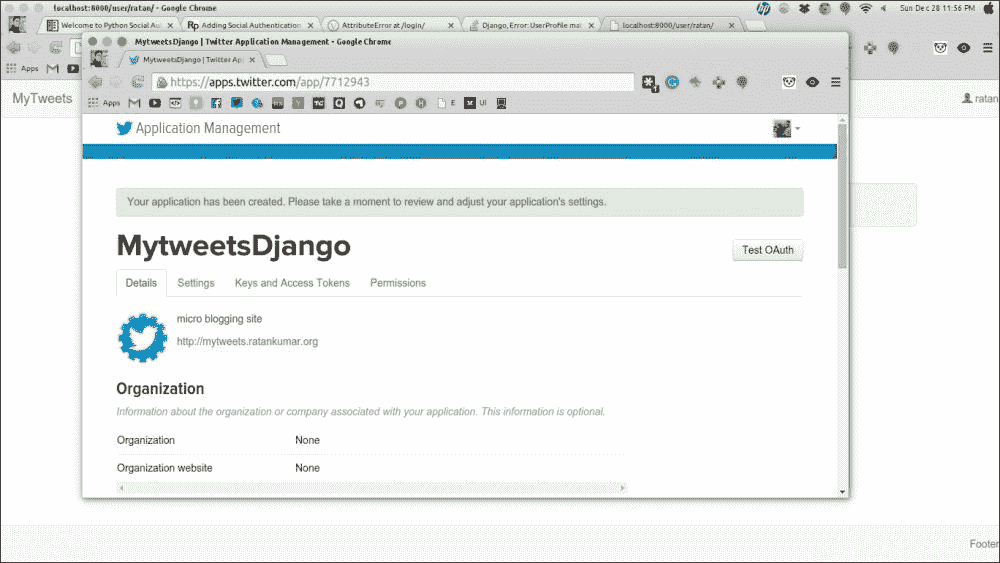
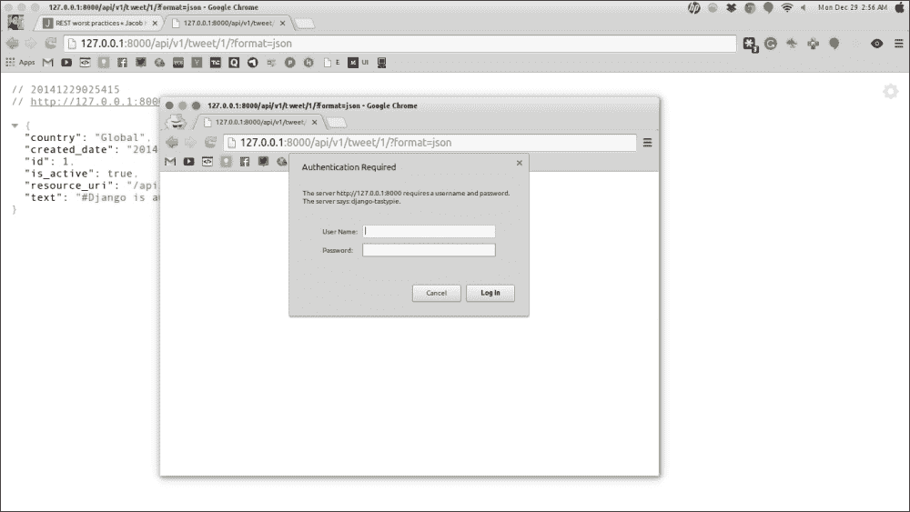

# 第 12 章使用第三方软件包

现在是时候将我们迄今为止所学的所有理论和原则结合起来，并尝试了解如何利用第三方软件包来实现许多可能的项目，例如 Twitter API、使用 Social Auth 等等。

在本章中，您将学习以下主题：

*   跳入开源世界
*   在 Django 项目中使用 Social Auth
*   在 Django 中构建 RESTAPI

除了使用 Django 和 Python 构建网站所需的核心模块外，我们还需要一些第三方软件包。有许多第三方软件包可以在互联网上免费获得；您可以在[找到许多有用的软件包 https://www.djangopackages.com/](https://www.djangopackages.com/) 。我们将尝试为我们的项目使用开源第三方软件包。

# 潜入开源世界

当我们看到开源这个词时，首先想到的问题是开源到底意味着什么？

开放源代码是一个术语，它指的是其设计可以公开访问，任何人都可以根据自己的需要进行修改，而无需事先获得任何许可。

好的，那么，让我们继续，深入研究开源世界的各个方面。

## 什么是开源软件？

开源软件意味着该软件的源代码可以公开访问，因此可以以任何可能的方式进行修改。此外，任何人都可以贡献源代码，这通常会导致软件的增强。

现在，大多数软件用户看不到源代码，程序员可以根据需要修改源代码以获得结果；这基本上意味着，在程序员手中拥有源代码可以让他们完全控制软件。

然后，程序员可以通过修复任何 bug 或向软件添加任何新功能来改进软件。

## 开源软件和其他软件有什么区别？

如果源代码未发布供公众访问，或者代码仅可供创建它的特定人群访问，则此类软件称为**专有软件**或**封闭源代码软件**。封闭源代码软件的示例是 Microsoft 产品，如 Microsoft Windows、Word、Excel、PowerPoint、Adobe Photoshop 等。

要使用专有软件，用户必须同意（通常通过签署第一次运行此软件时显示的许可证）他们不会对软件作者未明确允许的软件进行任何操作。

而开源软件则不同。开源软件的作者将其代码提供给希望查看、复制、学习、修改或共享该代码的其他人。Python 和 Django 程序是开源软件的例子。

正如专有软件有许可证一样，开放源码软件也有许可证，但许可证却大不相同。这些许可证促进了开源开发；它们允许对自己的源代码进行修改和 bug 修复。

开源不就是意味着一些东西是免费的吗？

*“开源不仅仅意味着获取源代码。”*正如**开源倡议**所解释的，它意味着任何人都应该能够修改源代码以满足程序员的需要。

对于开源生态系统可以被认为是什么，可能存在误解。程序员可以对他们创建的开源软件收费，但这没有任何意义，因为购买它的人完全有权免费修改和分发它。程序员不是为开源软件收费，而是为他们围绕开源软件构建的服务收费，比如支持，或者为原始软件增加很多价值的其他辅助组件。**红帽**等公司通过支持其开源红帽操作系统来收费。**Elasticsearch**为监测 Elasticsearch 的 marvel 组件收费，该组件在 Elasticsearch 投入生产时非常有用。

很多人认为只有互联网著名的摇滚明星程序员才能为开源项目做出贡献，但事实上，开源社区的繁荣依赖于从初学者到专家甚至非程序员的贡献。

# 在 Django 项目中使用 SocialAuth

每个网站都需要存储用户数据，以提供更好的独家体验，但要做到这一点，网站需要您通过填写用户详细信息表进行注册，他们要求您输入基本信息。填充这些可能会很枯燥乏味。解决这一问题的一个切实可行的方法是**社交认证**，您只需单击一下，即可从已注册的社交网站中自动填写您的基本信息。

例如，您可能在浏览网页时看到过许多网站，这些网站为您提供了几个社交按钮的选项，例如，谷歌、Facebook、Twitter 等，以登录或注册他们的网站。如果您使用这些社交按钮中的任何一个进行登录或注册，它们将从已更新信息的社交网站中调出您的基本详细信息，如电子邮件、性别等，这样您就不需要手动填写表单。

单独构建完整的端到端实现可能是 Django 的一个项目，如果您希望您的站点具有相同的功能，您不需要重新设计轮子。我们只需导入一个第三方库，只需在`settings.py`文件中进行最小的配置更改，就可以让用户使用其现有的社交帐户登录或注册。

## OAuth 是如何工作的

为了理解 AUTHOTHORT T1 的工作原理，我们来考虑下面的例子。

OAuth 就像 Web 的代客钥匙。大多数豪华车都配有代客钥匙，车主将钥匙交给停车场服务员。有了这把钥匙，汽车就不允许行驶更长的距离，其他功能，如后备箱车载豪华功能，也被禁用。

同样，你在网站上看到的登录按钮并不能让网站完全访问你的社交账户；它只会传递您授予的详细信息或默认信息，如电子邮件、性别等。

为了访问这些信息，网站通常会询问用户的用户名和密码，这增加了暴露您的个人信息或帐户被黑客攻击的风险。人们的银行账户可能有相同的用户名和密码，这就更加危险了。

因此，OAuth 的目的是为用户提供一种方法，允许第三方访问其信息，而无需共享密码。通过使用此方法，还可以授予有限的访问权限（例如，电子邮件、创建帖子的权限等）。

例如，对于一个登录注册站点，如果他们要求访问您的个人照片，这将是非常奇怪的。因此，在使用 OAuth 对应用程序进行许可时，实际上可以对许可进行审查。

下图概述了 OAuth 机制：


在前面的图中，您可以看到需要您的凭证的客户端应用程序，要求您使用任何社交帐户登录或注册。图的第一部分显示了这一点，其中客户端向用户请求社会帐户授权。

一旦您决定通过社交帐户登录并授予客户端应用程序访问您的社交帐户的权限，已使用自己的 API 密钥在同一社交网站上注册的客户端应用程序将通过其 API 请求向社交网站询问您的用户详细信息。在此阶段，您可能已经看到了客户端应用程序将访问的记录列表。某些网站还允许您编辑这些访问权限。在服务器向客户机应用程序授予授权后，客户机将获得一个用于您的社交帐户访问的访问令牌。

客户端应用程序可以存储该访问令牌以备将来使用，或者，如人们所称的**离线访问**。

使用此社交 OAuth 方法注册和登录的区别在于，当您已经注册时，客户端应用程序可能会存储您的访问令牌，这样下次尝试登录时，您就不必通过相同的社交网站授权页面，因为你已经给了他们你的授权凭证。

## 实施社会统一

在本节中，我们将学习在现有项目中实现 social OAuth。为了对我们的应用程序实施社会认证，我们将使用名为`python-social-auth`的第三方库。我们将使用 Twitter 社交身份验证来验证我们的用户。让我们来看看下面的步骤：

1.  首先，我们将安装名为**Python Social Auth**的第三方应用程序。只需使用以下命令即可完成`python-social-auth`的安装：

    ```py
    $pip install python-social-auth

    ```

2.  Once we have completed the installation of this third-party library, we will move to our mytweet application and make the configuration changes in the `settings.py` file.

    我们将此第三方库作为应用程序包含在应用程序中，因此我们必须在`INSTALLED_APPS`变量中创建此应用程序的条目。

    因此，将`'social.apps.django_app.default`参数添加到`INSTALLED_APPS`变量中，如下所示：

    ```py
    INSTALLED_APPS = (
    'django.contrib.admin',
    'django.contrib.auth',
    'django.contrib.contenttypes',
    'django.contrib.sessions',
    'django.contrib.messages',
    'django.contrib.staticfiles',
    'user_profile',
    'tweet',
    'social.apps.django_app.default',
    )
    ```

3.  接下来，我们需要在`settings.py`文件中添加`AUTHENTICATION_BACKEND`变量，它将登记我们想要支持的所有社交登录站点。对于本演示，我们将只添加 Twitter 社交身份验证，但根据用例，您可以添加任意数量的 Twitter 社交身份验证。`AUTHENTICATION_BACKENDS`参数是 Python 类路径的列表，它知道如何对用户进行身份验证。默认值指向“`django.contrib.auth.backends.ModelBackend`”参数。我们将在`AUTHENTICATION_BACKENDS`变量

    ```py
    AUTHENTICATION_BACKENDS = (
      'social.backends.twitter.TwitterOAuth',
      'django.contrib.auth.backends.ModelBackend',
    )
    ```

    中添加“【T4]”参数
4.  我们需要添加`TEMPLATE_CONTEXT_PROCESSORS`参数，它将在模板的上下文中添加后端和相关数据，这将依次加载后端键和三个条目，如下所示：
    *   **关联**：如果用户登录，则为 UserSocialAuth 实例列表；否则，它将是空的。
    *   **非关联**：如果用户登录，则为非关联后端列表；否则，它将包含所有可用后端的列表。
    *   **后端**：这是所有可用后端名称的列表。让我们看看下面的代码片段：
5.  我们的 mytweet 应用程序已经有了一个用户模型，用户可以通过该模型登录并发布推文。我们将使用相同的模型类从 social Auth 创建用户。为此，我们需要添加一行，告知`python-social-auth`使用现有的`user_profile`参数：

    ```py
    SOCIAL_AUTH_USER_MODEL = 'user_profile.User'
    ```

6.  Now, we will add custom URLs that will be used for social Auth:

    ```py
    SOCIAL_AUTH_LOGIN_REDIRECT_URL = '/profile/'
    SOCIAL_AUTH_LOGIN_ERROR_URL = '/login-error/'
    SOCIAL_AUTH_LOGIN_URL = '/login/'
    SOCIAL_AUTH_DISCONNECT_REDIRECT_URL = '/logout/'
    ```

    将这些添加到`settings.py`文件会告诉 social Auth 在以下情况下使用相应的 URL：

    *   `SOCIAL_AUTH_LOGIN_REDIRECT_URL`：社交认证成功后会触发此 URL。我们将使用此 URL 向登录用户发送其个人资料页面。
    *   `SOCIAL_AUTH_LOGIN_ERROR_URL`：社交身份验证出错时会触发此 URL。
    *   `SOCIAL_AUTH_LOGIN_URL`：这是进行社交身份验证的 URL。
    *   `SOCIAL_AUTH_DISCONNECT_REDIRECT_URL`：用户注销后会被重定向到此 URL。
7.  As we have added a new application to our existing project, we need to create the corresponding tables in our database, which we have already learned in the previous chapters.

    现在，我们需要迁移数据库：

    ```py
    $ python manage.py makemigrations
    Migrations for 'default':
    0002_auto_XXXX_XXXX.py:
    - Alter field user on user_profile
    $ python manage.py migrate
    Operations to perform:
    Apply all migrations: admin, default, contenttypes, auth, sessions
    Running migrations:
    Applying default.0001_initial... OK
    Applying default.0002_auto_XXXX_XXXX... OK

    ```

8.  For the last configuration change, we need to add an entry to the social Auth URLs:

    ```py
    url('', include('social.apps.django_app.urls', namespace='social'))
    ```

    更新后的 URL 模式如下所示：

    ```py
    urlpatterns = patterns('',
    ....
    url('', include('social.apps.django_app.urls', namespace='social'))
    )
    ```

## 创建 Twitter 应用程序

现在，我们将继续前进，并创建一个 Twitter 应用程序，该应用程序将为我们提供 API 密钥，以使此社交身份验证生效：

1.  Log into your Twitter account and open [https://apps.twitter.com/app/new](https://apps.twitter.com/app/new).

    该页面看起来有点像这样：

    

2.  Fill up the details and create your Twitter application.

    由于我们正在本地测试我们的应用程序，请将`http://127.0.0.1:8000/complete/twitter`作为回调 URL，并选中**允许此应用程序使用 Twitter**登录复选框。

    成功创建后，您的应用程序将如下所示：

    

3.  Move ahead with the **Keys and Access Tokens** tab and copy the **Consumer Key** (API key) and **Consumer Secret** (API secret) keys, as shown in the following screenshot:

    

4.  在`settings.py`文件中添加以下行：

    ```py
    SOCIAL_AUTH_TWITTER_KEY = 'your_key'
    SOCIAL_AUTH_TWITTER_SECRET = 'your_secret'
    ```

5.  更新我们的用户类以正确使用 Auth:

    ```py
    class User(AbstractBaseUser, PermissionsMixin):
    """
    Custom user class.
    """
      username = models.CharField('username', max_length=10, unique=True, db_index=True)
      email = models.EmailField('email address', unique=True)
      date_joined = models.DateTimeField(auto_now_add=True)
      is_active = models.BooleanField(default=True)
      is_admin = models.BooleanField(default=False)
      is_staff = models.BooleanField(default=False)

      USERNAME_FIELD = 'username'
      objects = UserManager()
      REQUIRED_FIELDS = ['email']
      class Meta:
        db_table = u'user'
        def __unicode__(self):
      return self.username 

    importing the PermissionsMixin as from |django.contrib.auth.models import AbstractBaseUser, PermissionsMixin
    ```

6.  Now, start the server or open `http://127.0.0.1:8000/login/twitter/`.

    此将带您进入以下授权页面：

    

7.  Click on the **Sign In** button as we will use this Twitter application to sign into our app.

    在此之后，它将使用您的基本信息将请求重定向回 mytweet 应用程序，如以下屏幕截图中的所示：

    

    如果我们的数据库中不存在用户名，它将使用 Twitter 用户名创建用户配置文件。

8.  Let's create two tweets and save them.

    

现在，为了检查 social Auth 是否有效，我们将注销并再次尝试打开 URL。重定向后，您将被重定向到前面相同的配置文件页面。

因此，我们学习了如何通过向 Twitter 注册应用程序来逐步创建 Twitter API，从而在程序中设置密钥。然后，我们看到了我们的应用程序如何将您发送到 Twitter 站点进行身份验证，以及在从 Twitter 站点进行身份验证后，它如何将您重定向到我们的站点。

# 在 Django 构建 REST API

**具象状态转移**（**REST**）是 Web 的基本架构原则。任何遵循 REST 原则的 API都是设计的，因此作为此处浏览器的客户端不需要了解任何有关 API 结构的信息。API 服务器只需要响应客户端发出的请求。

HTTP 处理应用于资源的谓词。一些非常流行的动词是 GET 和 POST，但也有其他重要的动词，如 PUT、DELETE 等。

例如，我们将使用由 web 服务管理的 Twitter 数据库作为 RESTAPI。对于所有 REST 通信，媒体类型是 API 服务器必须关心的主要问题，以及它必须响应客户机请求的格式。我们的 API 服务使用基于 JSON 的自定义超媒体，我们将为其分配/`json+tweetdb`MIME 类型的应用程序。

对基本资源的请求将返回以下内容：

```py
Request
GET /
Accept: application/json+tweetdb
Response
200 OK
Content-Type: application/json+tweetdb
{
  "version": "1.0",
  "links": [
    {
      "href": "/tweets",
      "rel": "list",
      "method": "GET" 
    },
    {
      "href": "/tweet",
      "rel": "create",
      "method": "POST"
    }
  ]
}
```

我们可以通过参考`href`链接来观察输出，我们正试图通过这些链接发送或检索信息，这些链接只不过是超媒体控件。我们可以通过`/user`命令与`GET`请求一起发送另一个请求来获取用户列表：

```py
Request
GET /user
Accept: application/json+tweetdb
  Response
  200 OK
  Content-Type: application/json+tweetdb

    {
      "users": [
      {
        "id": 1,
        "name": "Ratan",
        "country: "India",
        "links": [
          {
            "href": "/user/1",
            "rel": "self",
            "method": "GET"
          },
          {
            "href": "/user/1",
            "rel": "edit",
            "method": "PUT"
          },
          {
            "href": "/user/1",
            "rel": "delete",
            "method": "DELETE"
          }
        ]
      },
      {
        "id": 2,
        "name": "Sanjeev",
        "country: "India",
        "links": [
        {
          "href": "/user/2",
          "rel": "self",
          "method": "GET"
        },
        {
          "href": "/user/2",
          "rel": "edit",
          "method": "PUT"
        },
        {
          "href": "/user/2",
          "rel": "delete",
          "method": "DELETE"
        }
      ]
    }
  ],
  "links": [
    {
      "href": "/user",
      "rel": "create",
      "method": "POST"
    }
  ]
}
```

看到前面生成的输出，我们可以猜测所有用户是谁，我们可以发送哪些请求，比如`DELETE`或`PUT`请求。同样，我们甚至可以通过向`/user`发送`POST`请求来创建一个新用户，如下代码片段所示：

```py
Request
POST /user
Accept: application/json+tweetdb
  Content-Type: application/json+tweetdb
  {
    "name": "Zuke",
    "country": "United States"
  }
  Response
  201 Created
  Content-Type: application/json+tweetdb
  {
    "user": {
      "id": 3,
      "name": "Zuke",
      "country": "United States",
      "links": [
        {
          "href": "/user/3",
          "rel": "self",
          "method": "GET"
        },
        {
          "href": "/user/3",
          "rel": "edit",
          "method": "PUT"
        },
        {
          "href": "/user/3",
          "rel": "delete",
          "method": "DELETE"
        }
      ]
    },
    "links": {
      "href": "/user",
      "rel": "list",
      "method": "GET"
    }
  }
```

我们还可以更新现有数据：

```py
Request
PUT /user/1
Accept: application/json+tweetdb
  Content-Type: application/json+tweetdb
  {
    "name": "Ratan Kumar",
    "country": "United States"
  }
  Response
  200 OK
  Content-Type: application/json+tweetdb
  {
    "user": {
      "id": 1,
      "name": "Ratan Kumar",
      "country": "United States",
      "links": [
        {
          "href": "/user/1",
          "rel": "self",
          "method": "GET"
        },
        {
          "href": "/user/1",
          "rel": "edit",
          "method": "PUT"
        },
        {
          "href": "/user/1",
          "rel": "delete",
          "method": "DELETE"
        }
      ]
    },
    "links": {
      "href": "/user",
      "rel": "list",
      "method": "GET"
    }
  }
```

正如您很容易注意到的，我们正在使用不同的`HTTP`动词（`GET`、`PUT`、`POST`、`DELETE`等等）来操纵这些资源。

现在，您已经了解了 REST 的基本工作原理，因此我们将继续使用名为**Tastypie**的第三方库来使用 mytweets 应用程序。

## 使用 Django Tastypie

Django Tastypie使得为web 应用程序开发 RESTful API 变得更加容易。

要安装 Tastypie，请运行以下命令：

```py
$pip install django-tastypie

```

将`tastypie`参数添加到`settings.py`文件中的`INSTALLED_APPS`变量中。

API 还需要许多其他可配置的设置，例如 API 调用的限制等，但默认情况下，它们最初设置为默认值。你可以改变这一点，也可以保持原样。

您应该了解的一些API 设置可以根据您的需要进行修改，如下所示：

*   `API_LIMIT_PER_PAGE` (optional): This option controls the default number of records that Tastypie will return in the `view.applies` list when a user does not specify a limit to the GET parameter. The number of results to be returned are not overridden by the `resource` subclass.

    例如：

    ```py
    API_LIMIT_PER_PAGE = 15
    ```

    不过这里的默认限制是 20。

*   `TASTYPIE_FULL_DEBUG` (optional): When an exception occurs, this controls the behavior of whether to show the REST response or the 500 error page.

    如果设置为`True`和`settings.DEBUG = True`，则显示**500 错误**页面。

    如果未设置或未设置为`False`，则 Tastypie 返回序列化响应。

    如果`settings.DEBUG`是`True`，您将得到实际的异常消息和一个回溯。

    如果`settings`。`DEBUG`为`False`，Tastypie 将调用`mail_admins()`函数，并在响应中提供一条屏蔽错误消息（您可以使用`TASTYPIE_CANNED_ERROR`覆盖）。

    例如：

    ```py
    TASTYPIE_FULL_DEBUG = True
    ```

    不过默认值是`False`。

*   `TASTYPIE_CANNED_ERROR` (optional): You can write your customized error messages when an unhandled exception is raised and `settings.DEBUG` is `False`.

    例如：

    ```py
    TASTYPIE_CANNED_ERROR = "it's not your fault, it's our we will fix it soon."
    ```

    此处默认为*“对不起，此请求无法处理，请稍后再试。”*

*   `TASTYPIE_ALLOW_MISSING_SLASH` (optional): You can call the REST API without giving the final slashes, which are mainly used to iterate the API with other systems.

    您还必须具有`settings.APPEND_SLASH = False`，以便 Django 不会发出 HTTP 302 重定向。

    例如：

    ```py
    TASTYPIE_ALLOW_MISSING_SLASH = True
    ```

    此处默认为`False`。

*   `TASTYPIE_DATETIME_FORMATTING` (optional): This setting configures the global datetime/date/time data for the API.

    这方面的有效选项包括：

    *   iso-8601
    *   日期时间：：ISO8601
    *   ISO-8601（示例：2015-02-15T18:37:01+0000）
    *   iso-8601-strict，与 iso-8601 相同，但会使微秒跳闸
    *   rfc-2822
    *   日期时间：：RFC2822
    *   RFC 2822（例如，Sun，2015 年 2 月 15 日 18:37:01+0000）

        ```py
        TASTYPIE_DATETIME_FORMATTING = 'rfc-2822'
        ```

    以以下代码为例：

    这里的默认值是 iso-8601。

*   `TASTYPIE_DEFAULT_FORMATS` (optional): This globally configures the list of serialization formats for your entire site.

    例如：

    ```py
    TASTYPIE_DEFAULT_FORMATS = [json, xml]
    ```

    默认为[`json, xml, yaml,html, plist`。

### 实现一个简单的 JSON API

为了创建REST 风格的架构，我们需要为我们的推文定义资源类，所以让我们在`tweets`文件夹中创建一个`api.py`文件，包含以下内容：

```py
from tastypie.resources import ModelResource
from tweet.models import Tweet

class TweetResource(ModelResource):
class Meta:
queryset = Tweet.objects.all()
resource_name = 'tweet'
```

我们还需要一个 URL，其中所有 API 请求都将针对该推特资源发出，因此让我们在`urls.py`文件中为此添加一个条目：

```py
from tastypie.api import Api
from tweet.api import TweetResource

v1_api = Api(api_name='v1')
v1_api.register(TweetResource())

urlpatterns = patterns('',
...
url(r'^api/', include(v1_api.urls)),
)
```

这就是为 tweet 创建基本 restapi 所需的全部内容。

现在，我们将看到基于 RESTURL 变化的各种输出。在浏览器中，打开 URL，如下所示，并以`.json`格式观察输出。

第一个 URL 将以`.json`格式显示推特 API 详细信息：

`http://127.0.0.1:8000/api/v1/?format=json`

```py
{
  "tweet": {
    "list_endpoint": "/api/v1/tweet/",
    "schema": "/api/v1/tweet/schema/"
  }
}
```

基于的第一次输出，我们将调用我们的推文 API，将为我们提供推文信息的详细信息和其他详细信息，如下所示：

`http://127.0.0.1:8000/api/v1/tweet/?format=json`

```py
{
  "meta": {
    "limit": 20,
    "next": null,
    "offset": 0,
    "previous": null,
    "total_count": 1
  },
  "objects": [
    {
      "country": "Global",
      "created_date": "2014-12-28T20:54:27",
      "id": 1,
      "is_active": true,
      "resource_uri": "/api/v1/tweet/1/",
      "text": "#Django is awesome"
    }
  ]
}
```

我们的基本 RESTAPI 已经准备就绪，它列出了所有 tweet。如果您查看模式，它会向我们提供有关 API 的许多详细信息，例如允许使用哪些 HTTP 方法、输出将采用何种格式以及其他不同字段。这实际上有助于我们了解使用 API 可以做什么：

`http://127.0.0.1:8000/api/v1/tweet/schema/?format=json`

```py
{
  "allowed_detail_http_methods": [
    "get",
    "post",
    "put",
    "delete",
    "patch"
  ],
  "allowed_list_http_methods": [
    "get",
    "post",
    "put",
    "delete",
    "patch"
  ],
  "default_format": "application/json",
  "default_limit": 20,
  "fields": {
    "country": {
      "blank": false,
      "default": "Global",
      "help_text": "Unicode string data. Ex: \"Hello World\"",
      "nullable": false,
      "readonly": false,
      "type": "string",
      "unique": false
    },
    "created_date": {
      "blank": true,
      "default": true,
      "help_text": "A date & time as a string. Ex: \"2010-11- 10T03:07:43\"",
      "nullable": false,
      "readonly": false,
      "type": "datetime",
      "unique": false
    },
    "id": {
      "blank": true,
      "default": "",
      "help_text": "Integer data. Ex: 2673",
      "nullable": false,
      "readonly": false,
      "type": "integer",
      "unique": true
    },
    "is_active": {
      "blank": true,
      "default": true,
      "help_text": "Boolean data. Ex: True",
      "nullable": false,
      "readonly": false,
      "type": "boolean",
      "unique": false
    },
    "resource_uri": {
      "blank": false,
      "default": "No default provided.",
      "help_text": "Unicode string data. Ex: \"Hello World\"",
      "nullable": false,
      "readonly": true,
      "type": "string",
      "unique": false
    },
    "text": {
      "blank": false,
      "default": "No default provided.",
      "help_text": "Unicode string data. Ex: \"Hello World\"",
      "nullable": false,
      "readonly": false,
      "type": "string",
      "unique": false
    }
  }
}
```

一些API 可能需要授权访问，例如用户配置文件、帐户详细信息等。只需添加基本授权行，即可将基本 HTTP 授权添加到 Tastypie API 中：

```py
authentication = BasicAuthentication()
```

可以使用头文件添加基本 HTTP 授权，如下所示：

```py
from tastypie.authentication import BasicAuthentication
```

这将通过一个基本的 HTTP 请求请求进行身份验证，如下面的屏幕截图所示。一旦成功，当前会话中的所有请求都将通过身份验证。



这之后是一个演示，展示了如何使用 MongoDB 扩展 Django 系统的真实应用程序。

# 总结

在本章中，您了解了开源以及如何在我们的项目中使用和实现开源第三方软件包。现在，您可以轻松地从 Twitter 实现社交身份验证了。你也可以自己在 Facebook 和 Google+上进行同样的尝试。

在下一章中，您将了解更多有关调试技术的信息，当我们在代码中遇到任何错误或警告或一些配置问题时，我们需要使用这些技术。您还将学习产品开发工具，如 Git、Sublime 文本编辑器等。