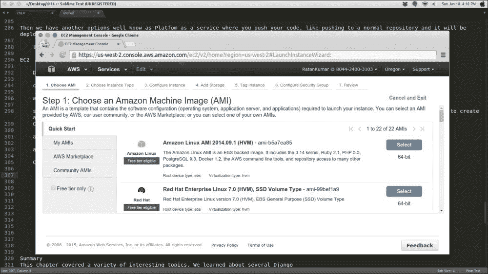
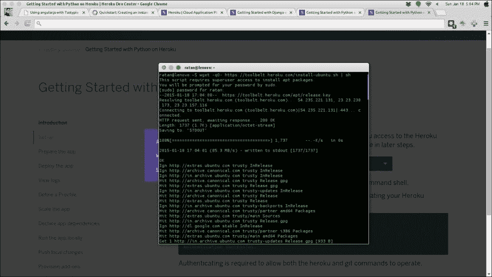
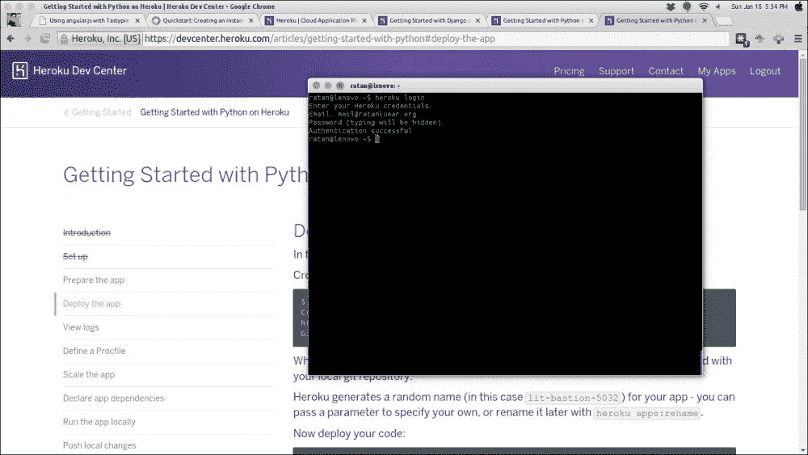

# 第 14 章部署 Django 项目

因此，您已经在 web 应用程序上做了很多工作，现在是时候让它成为现实了。为了确保从开发到生产的过渡顺利进行，在应用程序投入使用之前，必须对其进行一些更改。本章介绍对以下主题所做的更改，以帮助成功启动 web 应用程序：

*   生产 web 服务器
*   生产数据库
*   关闭调试模式
*   更改配置变量
*   设置错误页面
*   云上的 Django

# 生产 web 服务器

在本书中，我们一直在使用 Django 附带的开发 web 服务器。虽然此服务器非常适合于开发过程，但它绝对不打算成为生产 web 服务器，因为它在开发时没有考虑到安全性或性能。因此，它肯定不适合生产。

对于 web 服务器，有几种选择，但到目前为止，**Apache**是最流行的选择，Django 开发团队实际上推荐了它。如何使用 Apache 设置 Django 的详细信息取决于您的托管解决方案。一些托管计划提供预配置的 Django 托管解决方案，您只需将项目文件复制到服务器，而其他托管计划则允许您自行配置所有内容。

关于如何设置 Apache 的细节取决于许多超出本书范围的因素。如果您想自己配置 Apache，请在[上查阅Django 在线文档 https://docs.djangoproject.com/en/1.8/howto/deployment/wsgi/apache-auth/](https://docs.djangoproject.com/en/1.8/howto/deployment/wsgi/apache-auth/) 了解详细说明。

在本节中，我们将在 Apache 和`mod_wsgi`模块上部署 Django 应用程序。那么，让我们先安装这两个。

运行以下命令以安装 Apache：

```py
$sudo apt-get install apache2

```

`mod_wsgi`参数是一个 Apache HTTP 服务器模块，它提供了一个**Web 服务器网关接口**（**WSGI**）兼容接口，用于承载 Apache 下基于 Python 2.3+的 Web 应用程序。

运行以下命令安装`mod_wsgi`模块：

```py
$sudo aptitude install libapache2-mod-wsgi

```

Django 与 Apache 和`mod_wsgi`模块是在生产中部署 Django 的最流行的方式。

在大多数情况下，开发机器和部署机器是不同的。因此，建议您将项目文件夹复制到`/var/www/html/`文件夹，以便您的部署文件具有有限的权限和访问权限。

安装 Apache 服务器后，请尝试在浏览器中访问`localhost`，即`127.0.0.1`。通过这样做，您将看到默认的 Apache 页面，如以下屏幕截图所示：


我们必须让 Apache 服务器成为我们的 Django 项目。为此，我们需要为 Apache 创建`configuration`文件。

为此，请在`sites-available`文件夹中创建一个`mytweets.conf`文件，导航到`/etc/apache2/sites-available`即可找到该文件，内容如下：

```py
<VirtualHost *:80>
  ServerAdmin mail@ratankumar.org
  ServerName mytweets.com
  ServerAlias www.mytweets.com
  WSGIScriptAlias / /var/www/html/mytweets/mytweets/wsgi.py
  Alias /static/ /var/www/html/mytweets/static/
  <Location "/static/">
    Options -Indexes
  </Location>
</VirtualHost>
```

让我们看看下面的术语列表，它描述了前面代码片段中使用的各种参数：

*   `ServerAdmin`：如果您尚未配置自定义错误页面，则会显示此电子邮件地址，这将告诉用户联系此电子邮件地址。
*   `ServerName`：这是您希望在其上运行项目的服务器的名称。
*   `ServerAlias`：这是您希望在其上运行项目的站点的名称。
*   `WSGIScriptAlias`：这是项目的`wsgi.py`文件的位置，当我们运行创建 Django 项目的第一个命令时，它已经在那里了。
*   `Alias`：此为路径别名，文件夹在磁盘上的实际位置映射为项目目录。

现在，我们需要使用`a2ensite`命令启用此站点配置，并且要禁用现有站点配置，您可以使用`a2dissite`命令。

让我们使用以下命令为 Apache 启用`mytweets.conf`文件：

```py
$a2ensite mytweets.conf

```

这将启用我们的`mytweets.conf`文件。您还可以使用以下命令禁用`default 000-default.conf`配置：

```py
$a2dissite 000-default.conf

```

### 注

验证项目静态文件的文件权限。不要忘记在`settings.py`文件中的允许主机中写入一个条目。

现在，重新启动服务器：

```py
$sudo service apache2 restart

```

仅此而已，Django 现在在部署模式下运行，也就是说，它现在已准备好生产。

# 生产数据库

到目前为止，我们一直在使用 SQLite 作为我们的数据库引擎。它很简单，不需要内存中的常驻服务器。SQLite 将在小型网站的生产模式中表现良好。但是，强烈建议您切换到在生产中使用客户机-服务器模型的数据库引擎。正如我们在前一章中看到的，Django 支持多种数据库引擎，包括所有流行的数据库引擎。Django 团队建议您使用 PostgreSQL，但 MySQL 也可以。无论您如何选择，您只需更改`settings.py`文件中的数据库选项即可切换到其他数据库引擎。

如果您想使用 MySQL，请为 Django 创建一个数据库、用户名和密码。然后，相应地更改`DATABASE_*`变量。其他一切都应该保持不变。这就是 Django 数据库层的全部要点。

# 关闭调试模式

无论何时在开发过程中发生错误，Django 都会提供一个详细的错误页面，其中包含大量有用的信息。但是，当应用程序投入生产时，您不希望用户看到此类信息。除了让你的用户感到困惑之外，如果你让陌生人看到这些信息，你的网站就有可能面临安全问题。

一开始我们使用`django-admin.py mytweets`命令时，该命令创建了项目的所有基本配置，在该模式为`True`时，我们在`settings.py`文件中使用了`debug=True`参数。Django 完成了以下额外工作，以帮助您更快地调试问题。Django 的内存使用率更高，因为所有查询都以`django.db.connection.queries`的形式存储在数据库中。

对于每个错误消息，都会显示消息的正确堆栈跟踪，在生产模式下运行时不建议这样做，因为这可能包含敏感信息，并可能会削弱整个 web 应用程序的安全性。

关闭调试模式非常简单。打开`settings.py`文件，将`DEBUG`变量更改为`False`：

`DEBUG = False`

禁用调试信息还有另外一个好处；您可以提高网站的性能，因为 Django 不必为了显示调试数据而跟踪调试数据。

# 更改配置变量

有许多配置变量需要为生产创建或更新。生产环境非常恶劣。以下是部署时应检查的清单。正确检查`setting.py`文件，因为必须以正确的方式定义每个设置，以确保项目安全。

设置可以是特定于环境的，例如在本地运行设置时。数据库凭据可能会更改，甚至数据库也会根据环境而更改。在执行部署过程时，启用可选的安全功能。

启用性能优化。执行此操作的第一步是禁用调试，这将提高网站的性能。如果你有一个正确的错误报告机制，一旦`DEBUG`是`False`，就很难知道出了什么问题，所以你最好在禁用调试模式后准备好日志。

以下是在部署 Django 时必须注意的关键设置：

*   `SECRET_KEY`: This key must be chosen large and randomly and should be kept as a secret. In fact, it is recommended that you should never keep this information in the `settings.py` file or in the version control repository. Instead, keep this information somewhere safe in a nonversion controlled file or in the environment path:

    ```py
    import os
    SECRET_KEY = os.environ['SECRET_KEY']
    ```

    这将从当前操作系统的环境中导入密钥。建议的另一种方法是从文件导入，可以使用以下方法完成：

    ```py
    with open('/etc/secret_key.txt') as f:
        SECRET_KEY = f.read().strip()
    ```

*   `ALLOWED_HOSTS`：此必须具有有效的主机配置。当调试模式关闭时，用于保护 CSRF 攻击：

    ```py
    ALLOWED_HOSTS = [
        '.example.com',  # Allow domain and subdomains
        '.example.com.',  # Also allow FQDN and subdomains
    ]
    ```

*   `ADMIN`: The `ADMIN` key holds the names and e-mail addresses of the site administrators. You will find it in the `settings.py` file, commented out as follows:

    ```py
    ADMINS = (
    # ('Your Name', 'your_email@domain.com'),
    )
    ```

    在此处插入您的姓名和电子邮件地址，并删除`#`符号以取消注释，以便在代码错误发生时接收电子邮件通知。

    当`DEBUG=False`和视图引发异常时，Django 将通过电子邮件向这些人发送完整的异常信息。

*   `EMAIL`：由于生产服务器的电子邮件服务器很可能与开发机器不同，因此您可能需要更新电子邮件配置变量。在`settings.py`文件中查找并更新以下变量：
    *   `EMAIL_HOST`
    *   `EMAIL_PORT`
    *   `EMAIL_HOST_USER`
    *   `EMAIL_HOST_PASSWORD`

此外，您的web 应用程序现在有自己的域名，因此您需要更新以下设置以反映这一点：`SITE_HOST`和`DEFAULT_FROM_EMAIL`。

最后，如果使用缓存，请确保在`CACHE_BACKEND`参数中有正确的设置（理想情况下是`memcached`参数）；在生产过程中，您不希望开发后端出现在这里。

# 设置错误页面

禁用调试模式后，应为错误页面创建模板，尤其是以下两个文件：

*   `404.html`: This template will be displayed when the requested URL does not exist; in other words, when a page is not found, such as an uncaught exception.

    用你喜欢的任何内容创建这两个文件。例如，您可以在`404.html`模板或搜索表单中放置一条“【T0]”消息。

*   `500.html`：发生内部服务器错误时会显示此模板。

建议您通过从站点的基础模板派生这些模板，使其具有一致的外观。将模板放在`templates`文件夹的顶部，Django 将自动使用它们。

这应该包括对生产至关重要的配置更改。当然，本节不是结论性的，您可能对其他设置感兴趣。例如，您可以将 Django 配置为在找不到请求的页面时通过电子邮件通知您，或者提供可以查看调试信息的 IP 地址列表。有关这些和更多信息，请参阅`settings.py`文件中的 Django 文档。

希望本节能帮助您更顺利地从开发过渡到生产。

# 云上的 Django

随着时间的推移，web 开发中的部署发生了变化。由于可靠性、性能和易扩展性，大多数初创企业正在转向云设置，而不是传统的 VPS 托管方法。

提供**IAS**（**基础设施即服务**的最流行的云平台是亚马逊 EC2 和谷歌计算引擎。

然后，我们还有其他众所周知的选项，例如**平台即服务**（**PaaS**），您可以将代码推送到一个普通的存储库中，以便自动部署。其中包括谷歌应用程序引擎、Heroku 等等。

让我们一个接一个地介绍给他们。

## EC2

**EC2**上的部署简单。按照给定的步骤在 EC2 上部署所需的设置：

1.  Create an account for AWS. Follow [http://aws.amazon.com](http://aws.amazon.com) and click on **Create a Free Account**, as shown in the following screenshot:

    

2.  注册并将您的信用卡添加到账单详细信息中。完成后，登录，您将看到一个仪表板。对于部署，我们需要在 AWS 上创建一个名为 EC2 实例的服务器（可以将其视为服务器）。
3.  Click on EC2 (in the top-left corner), as shown in the following screenshot:

    

    正如在前面的屏幕截图中所看到的，我已经有一个实例正在运行（**1 个正在运行的实例**。点击**启动实例**创建新实例。这将显示实例的可用 AWS 映像（类似于 VMware 中的屏幕截图或可用的最后一个备份磁盘）：

    

4.  Scroll down to choose the Ubuntu 64-bit instance (the Ubuntu server).

    接下来，选择一个实例类型；首先，选择免费层，它将提供给 AWS 称为**t2.micro**实例类型的每个新帐户。检查其他设置，因为大多数设置保持默认状态。移动到**标记**实例并为您的实例命名：

    

5.  接下来要做的重要事情是选择一个安全组。AWS 具有此功能以保护您的服务器免受攻击。在这里，您可以配置哪些特定端口可以公开访问。基本上，您需要打开两个端口以使 tweet 可以公开访问。
6.  您应该使用 SSH（端口 22）从本地计算机连接系统以部署代码。
7.  HTTP（端口 80）用于运行 Django 服务器。

### 注

由于我们将使用的数据库运行在同一个实例上，因此我们不打算将 MySQL 端口添加到安全组中。

请确保您已经配置了如下内容：


接下来，回顾并启动实例。此外，您必须创建一个密钥对，以便通过 SSH 访问 AWS 机器。密钥是一个`.pem`文件，您将使用 SSH 远程登录到您的机器。创建密钥对并下载`.pem`文件。

### 注

确保`PEM`文件的特定权限为 400。如果希望 SSH 工作，则密钥文件不能公开查看。如果需要，使用此命令：`chmod 400 mykey.pem`。

这将需要一段时间，并将作为一个正在运行的实例显示在您的仪表板上。

单击屏幕左侧的实例。然后，您可以看到正在运行的实例。单击 instance 行以在屏幕底部获取更多详细信息，如下图所示：


在细节的右侧可以看到公共 DNS:`<public DNS>`和公共 IP:`<public IP>`。这就是您所需要的（当然还有登录实例所需的`.pem`文件）。

在您的机器上，从您下载`PEM`文件的终端转到文件夹，并在终端上键入`$ssh -i <pemfilename>.pem ubuntu@<pubic IP>`。

否则，请键入以下内容：

`$ssh -i <pemfilename>.pem ubuntu@<public Dns>`。

这样，您将登录到远程服务器。

这是您从头开始的在线系统。如果您想从本地计算机上自行部署网站，则可以转到前面的章节，安装虚拟环境所需的所有内容。Django 和 Apache 在此服务器上执行部署。

部署之后，使用我们用于 SSH 的公共 IP，您应该可以看到部署的服务器。

## 谷歌计算引擎

**谷歌计算引擎**采用与 AWS EC2 相同的概念。谷歌计算引擎，目前，并没有提供一个免费的层。

谷歌服务器以其可靠性和性能而闻名。所以，如果你正在考虑一个有这样需求的项目，就去做吧。

GoogleCloud 为您提供了一个云 SDK 来使用其实例，它的大部分初始配置都可以从终端完成。

要在 Google Compute Engine 上创建实例，请转到：

[https://cloud.google.com/compute/docs/quickstart](https://cloud.google.com/compute/docs/quickstart) 。

此链接将帮助您设置在 Apache 服务器上运行的实例。

## 红帽开放式混合云应用平台

**红帽**为提供了另一种云部署解决方案，在一定的使用限制下是免费的，服务名为**OpenShift**。

您可以创建一个 OpenShift帐户，并从[获得免费的基于 dynamo 的基本 3 云服务器 https://www.openshift.com/app/account/new](https://www.openshift.com/app/account/new) 。

您创建账户后，可以进入[https://openshift.redhat.com/app/console/applications](https://openshift.redhat.com/app/console/applications) 并添加您的帐户。

OpenShift 提供了一个 Django 存储库，所有这些都是通过预先配置的版本控制为您设置的。

您所需要的只是进行更改并推送代码。它将自动部署代码。

OpenShift 还为您提供了登录云服务器的 SSH 功能以及一些基本的故障排除。

## 赫罗库

这个也是一个很好的平台，可以顺利地将 Django 代码部署到云中。与 Google Compute Engine 一样，Heroku 也为您提供了一个 SDK 工具，用于从本地终端安装和执行配置更改。你需要一个工具带（Heroku 的 SDK）。

在 Heroku 的[上创建一个账户 https://signup.heroku.com](https://signup.heroku.com) 。

以下为[的步骤 https://devcenter.heroku.com/articles/getting-started-with-python](https://devcenter.heroku.com/articles/getting-started-with-python) 。查看最新更新。以下步骤说明如何创建和使用 Heroku：

1.  First, we need to install **Heroku Toolbelt**. This provides you access to the Heroku command-line utility:

    ```py
    $wget -qO- https://toolbelt.heroku.com/install-ubuntu.sh | sh

    ```

    将出现以下屏幕：

    

2.  它将在本地机器上安装 Heroku Toolbelt。从命令行

    ```py
    $heroku login

    ```

    登录到 Heroku
3.  Use the same username and password as you did for the Web login. Let's take a look at the following screenshot:

    

4.  现在，转到[https://devcenter.heroku.com/articles/getting-started-with-django](https://devcenter.heroku.com/articles/getting-started-with-django) 在 Heroku 部署 Django。

## 谷歌应用引擎

**谷歌应用引擎**工作方式不同，它不在传统数据库上工作，而是有自己的数据库。因此，为了在 Google 应用程序引擎上部署 Django，我们将使用一个名为**Django Nonl**的单独项目。

Django Nonl是一个允许开发人员在非关系数据库上运行本机 Django 项目（包括 Django 的 ORM）的项目，其中一个是 Google Application Engine 的数据存储。这是对 Django 始终支持的标准传统 SQL 数据库的补充。Google 应用程序引擎确实提供了一些 Django 支持，但主要是关于模板和视图的支持。对于其他允许快速开发的工具，如表单，内置的管理界面或 Django 身份验证不会立即运行。Django Nonl 为 Django 开发人员更改了这一点。

# 总结

本章涵盖了各种有趣的话题。您了解了一些在部署 Django 时非常有用的基于 Django 的部署选项。您还学习了如何将 Django 项目从开发环境移动到生产环境。值得注意的是，您所了解的框架都非常易于使用，因此您将能够在未来的项目中有效地利用它们。