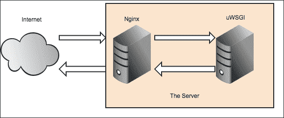
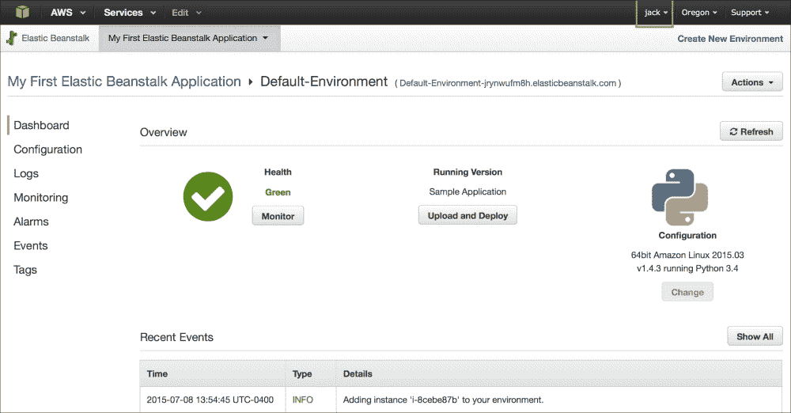
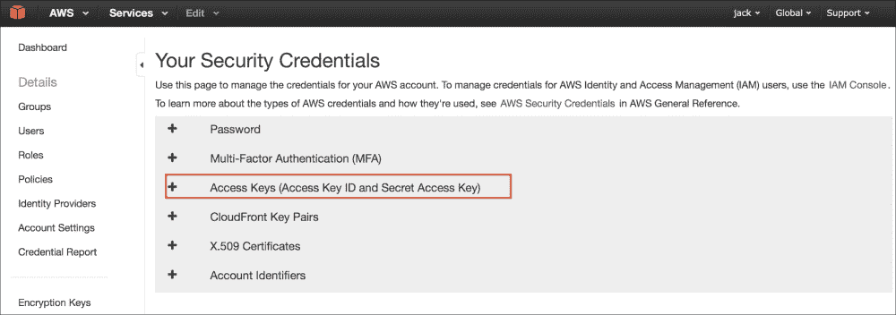

# 第 13 章部署应用程序

现在，我们已经完成了本书的最后一章，并在 Flask 中制作了一个功能齐全的 web 应用程序，我们开发的最后一步是让这个应用程序面向全世界。有许多不同的方法来托管你的 Flask 应用程序，每种方法都有各自的优缺点。本章将介绍最佳解决方案，并指导您在何种情况下应选择其中一种。

请注意，在本章中，术语服务器用于指运行操作系统的物理机器。但是，当使用术语 web 服务器时，它指的是服务器上接收 HTTP 请求并发送响应的程序。

# 在您自己的服务器上部署

部署任何 web 应用程序最常见的方法是在您可以控制的服务器上运行它。在这种情况下，控制意味着使用管理员帐户访问服务器上的终端。这种类型的部署为您提供了其他选择中最大的自由度，因为它允许您安装任何您想要的程序或工具。这与为您选择 web 服务器和数据库的其他托管解决方案不同。这种类型的部署也恰好是最便宜的选择。

这种自由的缺点是，您需要负责保持服务器运行、备份用户数据、保持服务器上的软件处于最新状态以避免安全问题，等等。所有的书都是关于良好的服务器管理的。因此，如果您认为这不是您或您的公司能够处理的责任，那么最好选择其他部署选项之一。

本节将以基于 Debian Linux 的服务器为基础，因为 Linux 是运行 web 服务器的最流行的操作系统，Debian 是最流行的 Linux 发行版（软件和 Linux 内核作为软件包发布的特定组合）。任何带有 bash 和名为 SSH 的程序（将在下一节中介绍）的操作系统都适用于本章。唯一的区别是在服务器上安装软件的命令行程序。

每个 web 服务器都将使用名为**web 服务器网关接口**（**WSGI**）的协议，该协议是一个标准，旨在允许 Python web 应用程序轻松与 web 服务器通信。我们将永远不会直接使用 WSGI，但我们将使用的大多数 web服务器接口都会在其名称中使用 WSGI，如果您不知道它是什么，可能会让人感到困惑。

## 使用 fabric 将代码推送到服务器

为了自动设置应用程序代码并将其推送到服务器，我们将使用名为 fabric 的 Python 工具。Fabric 是一个命令行程序，它使用名为 SSH 的工具在远程服务器上读取和执行 Python 脚本。SSH 是一种协议，允许一台计算机的用户远程登录到另一台计算机，并在命令行上执行命令，前提是该用户在远程计算机上拥有帐户。

要安装`fabric`，我们将使用`pip`如下：

```py
$ pip install fabric

```

`fabric`命令是要在远程机器外壳上运行的命令行程序的集合，在本例中为 bash。我们将执行三个不同的命令：一个用于运行单元测试，一个用于按照我们的规范设置一个全新的服务器，另一个用于让服务器使用`git`更新其应用程序代码副本。我们将把这些命令存储在名为`fabfile.py`的项目目录根目录下的新文件中。

因为这是最容易创建的，所以让我们首先执行 test 命令：

```py
from fabric.api import local

def test():
    local('python -m unittest discover')
```

要从命令行运行此功能，我们可以通过传递要运行的命令的名称来使用`fabric`命令行界面：

```py
$ fab test
[localhost] local: python -m unittest discover
.....
---------------------------------------------------------------------
Ran 5 tests in 6.028s
OK

```

Fabric 有三个主要命令：`local`、`run`和`sudo`。如前一功能所示，`local`功能在本地计算机上发出`run`命令。`run`和`sudo`功能在远程机器上运行命令，但`sudo`作为管理员运行命令。所有这些函数都会通知 fabric 命令是否成功运行。如果命令没有成功运行，这意味着，在本例中，我们的测试失败，那么函数中的任何其他命令都不会运行。这对我们的命令很有用，因为它允许我们强制自己不要将任何未通过测试的代码推送到服务器。

现在我们需要创建命令从头开始设置新服务器。此命令将安装生产环境所需的软件，并从我们的集中`git`存储库下载代码。它还将创建一个新用户，作为 web 服务器的运行者和代码存储库的所有者。

### 注

不要运行 web 服务器，也不要让根用户部署代码。这会使您的应用程序面临大量安全漏洞。

此命令因您的操作系统而异，我们将根据您选择的服务器在本章的其余部分添加此命令：

```py
from fabric.api import env, local, run, sudo, cd

env.hosts = ['deploy@[your IP]']

def upgrade_libs():
    sudo("apt-get update")
    sudo("apt-get upgrade")

def setup():
    test()
    upgrade_libs()

    # necessary to install many Python libraries 
    sudo("apt-get install -y build-essential")
    sudo("apt-get install -y git")
    sudo("apt-get install -y python")
    sudo("apt-get install -y python-pip")
    # necessary to install many Python libraries
    sudo("apt-get install -y python-all-dev")

    run("useradd -d /home/deploy/ deploy")
    run("gpasswd -a deploy sudo")

    # allows Python packages to be installed by the deploy user
    sudo("chown -R deploy /usr/local/")
    sudo("chown -R deploy /usr/lib/python2.7/")

    run("git config --global credential.helper store")

    with cd("/home/deploy/"):
        run("git clone [your repo URL]")

    with cd('/home/deploy/webapp'):
        run("pip install -r requirements.txt")
        run("python manage.py createdb")
```

在这个脚本中有两个新的结构特性。第一个是`env.hosts`分配，它告诉 fabric 应该登录的机器的用户和 IP 地址。其次，还有与 with 关键字结合使用的`cd`函数，它在该目录的上下文中执行任何函数，而不是在部署用户的主目录中。修改`git`配置的行是为了告诉`git`记住存储库的用户名和密码，这样您就不必在每次希望将代码推送到服务器时都输入它。另外，在设置服务器之前，我们要确保更新服务器的软件，使服务器保持最新。

最后，我们有了将新代码推送到服务器的功能。最后，这个命令还将重新启动 web 服务器并重新加载来自代码的任何配置文件。但这取决于您选择的服务器，因此这将在后面的部分中填写。

```py
def deploy():
    test()
    upgrade_libs()
    with cd('/home/deploy/webapp'):
        run("git pull")
        run("pip install -r requirements.txt")
```

因此，如果我们要开始在新服务器上工作，我们只需运行以下命令即可进行设置：

```py
$ fabric setup
$ fabric deploy
```

## 与主管一起运行您的 web 服务器

既然我们已经自动化了更新过程，我们需要在服务器上安装一些程序来确保我们的 web 服务器和数据库（如果您不使用 SQLite）正在运行。为此，我们将使用一个名为 supervisor 的简单程序。supervisor 所做的只是在后台进程中自动运行命令行程序，并允许您查看正在运行的程序的状态。Supervisor 还监视它正在运行的所有进程，如果进程死亡，它将尝试重新启动它。

要安装`supervisor`，我们需要将其添加到`fabfile.py`中的 setup 命令中：

```py
def setup():
    …
    sudo("apt-get install -y supervisor")
```

为了告诉`supervisor`该做什么，我们需要创建一个配置文件，然后在 deploy`fabric`命令期间将其复制到服务器的`/etc/supervisor/conf.d/`目录。`Supervisor`将在启动并尝试运行时加载此目录中的所有文件。

在名为`supervisor.conf`的项目目录根目录中的新文件中，添加以下内容：

```py
[program:webapp]
command=
directory=/home/deploy/webapp
user=deploy

[program:rabbitmq]
command=rabbitmq-server
user=deploy

[program:celery]
command=celery worker -A celery_runner 
directory=/home/deploy/webapp
user=deploy
```

### 注

这是启动并运行 web 服务器所需的最低配置。但是，supervisor 有更多的配置选项。要查看所有定制，请转到[上的主管文档http://supervisord.org/](http://supervisord.org/) 。

此配置告知`supervisor`在`deploy`用户下的`/home/deploy/webapp`上下文中运行命令。命令值的右边是空的，因为它取决于您正在运行的服务器，并且将为每个部分填充。

现在我们需要在 deploy 命令中添加一个`sudo`调用，将此配置文件复制到`/etc/supervisor/conf.d/`目录，如下所示。

```py
def deploy():
    …
    with cd('/home/deploy/webapp'):
        …
        sudo("cp supervisord.conf /etc/supervisor/conf.d/webapp.conf")

    sudo('service supervisor restart')
```

很多项目只是在服务器上创建文件，而忽略了它们，但是将配置文件存储在我们的`git`存储库中，并在每次部署时复制，这有几个好处。首先，这意味着如果使用`git`出现问题，很容易恢复更改。其次，这意味着我们不必登录到服务器来更改文件。

### 注

不要在生产中使用 Flask 开发服务器。它不仅无法处理并发连接，而且还允许在服务器上运行任意 Python 代码。

## Gevent

要启动并运行 web 服务器，最简单的选项是使用名为 gevent 的 Python 库来托管应用程序。Gevent 是一个 Python 库，它在 Python 线程库之外添加了一种并行编程的替代方法，称为**co-routines**。Gevent 有一个运行 WSGI 应用程序的接口，它既简单又有良好的性能。一个简单的 gevent 服务器可以轻松处理数百个并发用户，这比互联网上网站的用户数量高出 99%。此选项的缺点是其简单性意味着缺少配置选项。例如，无法向服务器添加速率限制或添加 HTTPS 流量。此部署选项仅适用于您不希望收到大量流量的站点。记住雅格尼；仅在确实需要时升级到其他 web 服务器。

### 注

Co 例程有点超出了本书的范围，因此可以在[找到一个很好的解释 https://en.wikipedia.org/wiki/Coroutine](https://en.wikipedia.org/wiki/Coroutine) 。

要安装`gevent`，我们将使用`pip`：

```py
$ pip install gevent

```

在名为`gserver.py`的项目目录根目录中的新文件中，添加以下内容：

```py
from gevent.wsgi import WSGIServer
from webapp import create_app

app = create_app('webapp.config.ProdConfig')

server = WSGIServer(('', 80), app)
server.serve_forever()
```

要使用 supervisor 运行服务器，只需将命令值更改为以下值：

```py
[program:webapp]
command=python gserver.py 
directory=/home/deploy/webapp
user=deploy

```

现在，当您部署时，`gevent`将通过在每次部署上运行您的`requirements.txt`自动为您安装，也就是说，如果您在添加每个新依赖项后正确地进行了 pip 冻结。

## 龙卷风

Tornado 是纯粹使用 Python 部署 WSGI 应用程序的另一种非常简单的方法。Tornado 是一个 web 服务器，设计用于处理数千个同时连接。如果您的应用程序需要实时数据，Tornado 还支持 WebSocket 以实现与服务器的连续、长期连接。

### 注

不要在 Windows 服务器上的生产环境中使用 Tornado。Windows 版本的 Tornado 不仅速度慢得多，而且被认为是测试版质量的软件。

为了在应用程序中使用 Tornado，我们将使用 Tornado 的`WSGIContainer`来包装应用程序对象，使其与 Tornado 兼容。然后，Tornado 将开始在端口*80*上侦听请求，直到进程终止。在名为`tserver.py`的新文件中，添加以下内容：

```py
from tornado.wsgi import WSGIContainer
from tornado.httpserver import HTTPServer
from tornado.ioloop import IOLoop
from webapp import create_app
app = WSGIContainer(create_app("webapp.config.ProdConfig"))
http_server = HTTPServer(app)
http_server.listen(80)
IOLoop.instance().start()
```

要与 supervisor 一起运行 Tornado，只需将命令值更改为以下值：

```py
[program:webapp]
command=python tserver.py 
directory=/home/deploy/webapp
user=deploy
```

## Nginx 和 uWSGI

如果您需要更多的性能或定制，部署 Python web 应用程序最常用的方法是使用 web 服务器 Nginx 作为 WSGI 服务器 uWSGI 的前端，使用反向代理。反向代理是网络中的一个程序，它从服务器检索客户端的内容，就像它们从代理本身返回一样：



Nginx和 uWSGI 就是这样使用的，因为我们在定制 uWSGI 的同时获得了 Nginx前端的强大功能。

Nginx 是一款功能强大的 web 服务器，它通过提供速度和定制的最佳组合而广受欢迎。Nginx 始终比其他 web 服务器（如 apachehttpd）更快，并且对 WSGI 应用程序具有本机支持。它实现这一速度的方式是几个好的架构决策，以及早期的决策，即他们不会像 Apache 那样尝试覆盖大量的用例。拥有一个较小的特性集可以更容易地维护和优化代码。从程序员的角度来看，配置 Nginx 也容易得多，因为在每个项目目录中都没有需要用`.htaccess`文件覆盖的大型默认配置文件（`httpd.conf`。

一个缺点是 Nginx 的社区比 Apache 小得多，所以如果您有一个模糊的问题，您就不太可能在网上找到答案。此外，Nginx 可能不支持大多数程序员在 Apache 中使用的特性。

uWSGI 是一种 web 服务器，支持多种不同类型的服务器接口，包括 WSGI。uWSGI 处理断开应用程序内容以及诸如跨多个不同进程和线程的负载平衡通信之类的事情。

要安装 uWSGI，我们将使用`pip`：

```py
$ pip install uwsgi

```

为了运行我们的应用程序，uWSGI 需要一个带有可访问 WSGI 应用程序的文件。在项目目录顶层名为`wsgi.py`的新文件中，添加以下内容：

```py
from webapp import create_app

app = create_app("webapp.config.ProdConfig")
```

要测试 uWSGI，我们可以通过以下命令行运行它：

```py
$ uwsgi --socket 127.0.0.1:8080 \
--wsgi-file wsgi.py \
--callable app \
--processes 4 \
--threads 2

```

如果您正在服务器上运行此应用程序，您应该能够访问端口*8080*并查看您的应用程序（如果您没有防火墙）。

此命令的作用是从`wsgi.py`文件加载 app 对象，并使其可从*8080*端口的`localhost`访问。它还产生四个不同的进程，每个进程有两个线程，由主进程自动进行负载平衡。对于绝大多数的网站来说，这么多的进程是多余的。首先，使用带有两个线程的单个进程，然后从那里开始扩展。

我们可以创建一个文本文件来保存我们的配置，而不是在命令行上添加所有配置选项，这为配置带来了与 supervisor 一节中列出的相同的好处。

在名为`uwsgi.ini`的项目目录根目录中的新文件中，添加以下代码：

```py
[uwsgi]
socket = 127.0.0.1:8080
wsgi-file = wsgi.py
callable = app
processes = 4
threads = 2
```

### 注

uWSGI 支持数百个配置选项以及几个官方和非官方插件。要充分利用 uWSGI 的强大功能，您可以在[浏览文档 http://uwsgi-docs.readthedocs.org/](http://uwsgi-docs.readthedocs.org/) 。

现在让我们从 supervisor 运行服务器：

```py
[program:webapp]
command=uwsgi uwsgi.ini
directory=/home/deploy/webapp
user=deploy
```

我们还需要在设置功能中安装 Nginx：

```py
def setup():
    …
    sudo("apt-get install -y nginx")
```

因为我们正在从操作系统的包管理器安装 Nginx，所以操作系统将为我们处理 Nginx 的运行。

### 注

在撰写本文时，官方 Debian 软件包管理器中的 Nginx 版本已经有好几年的历史了。要安装最新版本，请按照此处的说明进行操作：[http://wiki.nginx.org/Install](http://wiki.nginx.org/Install) 。

接下来，我们需要创建一个 Nginx 配置文件，然后在推送代码时将其复制到`/etc/nginx/sites-available/ directory`。在名为`nginx.conf`的项目目录根目录中的新文件中，添加以下内容：

```py
server {
    listen 80;
    server_name your_domain_name;

    location / {
        include uwsgi_params;
        uwsgi_pass 127.0.0.1:8080;
    }

    location /static {
        alias /home/deploy/webapp/webapp/static;
    }
}
```

此配置文件的作用是告诉 Nginx 侦听端口*80*上的传入请求，并将所有请求转发到正在侦听端口*8080*的 WSGI 应用程序。此外，它对静态文件的任何请求都做了一个例外，而是直接将这些请求发送到文件系统。在静态文件中绕过 uWSGI 可以极大地提高性能，因为 Nginx 非常擅长快速提供静态文件。

最后，在`fabfile.py`文件中：

```py
def deploy():
    …
    with cd('/home/deploy/webapp'):
        …
        sudo("cp nginx.conf "
             "/etc/nginx/sites-available/[your_domain]")
        sudo("ln -sf /etc/nginx/sites-available/your_domain "
             "/etc/nginx/sites-enabled/[your_domain]") 

    sudo("service nginx restart")
```

## Apache 和 uWSGI

将Apache httpd 与 uWSGI 一起使用时，设置基本相同。首先，我们需要一个 apache 配置文件，该文件位于项目目录`apache.conf`根目录中的一个新文件中：

```py
<VirtualHost *:80>
    <Location />
        ProxyPass / uwsgi://127.0.0.1:8080/
    </Location>
</VirtualHost>
```

该文件只是告诉 Apache 将端口*80*上的所有请求传递给监听端口*8080*的 uWSGI web 服务器。但是，此功能需要 uWSGI 提供一个名为`mod-proxy-uwsgi`的额外 Apache 插件。我们可以在 set 命令中安装此软件和 Apache：

```py
def setup():

    sudo("apt-get install -y apache2")
    sudo("apt-get install -y libapache2-mod-proxy-uwsgi")
```

最后，在`deploy`命令中，我们需要将 Apache 配置文件复制到 Apache 的配置目录中：

```py
def deploy():
    …
    with cd('/home/deploy/webapp'):
        …
        sudo("cp apache.conf "
             "/etc/apache2/sites-available/[your_domain]")
        sudo("ln -sf /etc/apache2/sites-available/[your_domain] "
             "/etc/apache2/sites-enabled/[your_domain]") 

    sudo("service apache2 restart")
```

# 部署在 Heroku 上

Heroku是本章将介绍的第一家**平台即服务**（**PaaS**提供商。PaaS 是一种提供给 web 开发人员的服务，允许他们在由其他人控制和维护的平台上托管自己的网站。以自由为代价，您可以获得保证，您的网站将自动根据您网站的用户数量进行缩放，而无需您额外的工作。使用 PaaS 往往比运行自己的服务器更昂贵。

Heroku 是一款 PaaS，它的目标是通过连接现有的工具而不需要对应用程序进行任何大的更改，从而使 web 开发人员能够轻松使用。Heroku 的工作原理是读取名为`Procfile`的文件，该文件包含 Heroku dyno（基本上是服务器上的虚拟机）将运行的命令。在我们开始之前，您需要一个 Heroku 帐户。如果你只想尝试，有一个免费的帐户可用。

在目录根目录中名为`Procfile`的新文件中，添加以下内容：

```py
web: uwsgi uwsgi.ini 
```

这告诉 Heroku 我们有一个名为 web 的进程，它将运行 uWSGI 命令并传递`uwsgi.ini`文件。Heroku 还需要一个名为`runtime.txt`的文件，该文件将告诉它您希望使用的 Python 运行时（在撰写本文时，最新的 Python 版本是 2.7.10）：

```py
python-2.7.10
```

最后，我们需要对前面的`uwsgi.ini`文件进行一些修改：

```py
[uwsgi]
http-socket = :$(PORT)
die-on-term = true
wsgi-file = wsgi.py
callable = app
processes = 4
threads = 2
```

我们将端口设置为 uWSGI 侦听环境变量 port，因为 Heroku 不会直接将 dyno 公开给 Internet。相反，它有一个非常复杂的负载平衡器和反向代理系统，所以我们需要让 uWSGI 监听 Heroku 需要我们监听的端口。此外，我们将术语上的**die 设置为 true，以便 uWSGI 正确侦听来自操作系统的信号终止事件。**

要使用 Heroku 的命令行工具，我们首先需要安装它们，可以从[开始安装 https://toolbelt.heroku.com](https://toolbelt.heroku.com) 。

接下来，您需要登录到您的帐户：

```py
$ heroku login

```

我们可以使用 foreman 命令测试我们的设置，以确保它在部署 Heroku 之前能够工作：

```py
$ foreman start web

```

Foreman 命令模拟 Heroku 使用的生产环境运行我们的应用程序。为了创建将在 Heroku 的服务器上运行应用程序的 dyno，我们将使用`create`命令。然后，我们可以推送到`git`存储库上的远程分支 Heroku，让 Heroku 服务器自动删除我们的更改。

```py
$ heroku create
$ git push heroku master

```

如果一切顺利，你的新 Heroku dyno 上应该有一个工作应用程序。您可以使用以下命令打开新 web 应用程序的新选项卡：

```py
$ heroku open

```

要查看Heroku 部署中的应用程序，请访问[https://mastering-flask.herokuapp.com/](https://mastering-flask.herokuapp.com/) 。

## 使用 Heroku Postgres

正确维护数据库是一项全职工作。谢天谢地，我们可以使用 Heroku 的一个内置功能来为我们自动化这个过程。Heroku Postgres 是一个完全由 Heroku 维护和托管的 Postgres 数据库。因为我们使用的是 SQLAlchemy，所以使用 Heroku Postgres 是微不足道的。在你的 dyno 仪表板中，有一个链接指向你的**Heroku Postgres**信息。单击它，您将进入如下页面：


通过点击**URL**字段上的，您将拥有一个 SQLAlchemy URL，您可以直接将其复制到生产配置对象。

## 在 Heroku 上使用芹菜

我们有我们的生产网络服务器和数据库设置，但我们仍然需要设置芹菜。使用 Heroku 的众多插件中的一个，我们可以在 dyno 上运行芹菜工人的同时在云中托管 RabbitMQ 实例。

第一步是告诉 Heroku 在`Procfile`中运行芹菜工人：

```py
web: uwsgi uwsgi.ini
celery: celery worker -A celery_runner
```

接下来，要使用免费计划（名为`lemur`计划）安装 Heroku RabbitMQ 插件，请使用以下命令：

```py
$  heroku addons:create cloudamqp:lemur

```

### 注

要获取 Heroku 插件的完整列表，请访问[https://elements.heroku.com/addons](https://elements.heroku.com/addons) 。

在 Heroku Postgres 所在的仪表板上，您现在可以找到**CloudAMQP**：


点击也会给你一个带有可复制 URL 的屏幕，你可以粘贴到你的生产配置中：


# 在 Amazon web 服务上部署

**亚马逊网络服务**（**AWS**是亚马逊维护的应用平台集合，建立在运行[亚马逊网站](http://amazon.com)的相同基础设施之上。为了部署我们的 Flask 代码，我们将使用Amazon Elastic Beanstalk，而数据库将托管在 Amazon 关系数据库服务上，芹菜消息队列将托管在 Amazon 简单队列服务上。

## 在亚马逊弹性豆茎上使用烧瓶

ElasticBeanstalk 是一个 web 应用程序平台，为开发人员提供了许多强大的功能，因此 web 开发人员不必担心服务器的维护。

例如，随着同时使用您的应用程序的人数增加，您的 Elastic Beanstalk 应用程序将通过使用越来越多的服务器自动扩展。对于 Python 应用程序，Elastic Beanstalk 使用 Apache 和`mod_wsgi`连接到 WSGI 应用程序，因此不需要额外配置。

在我们开始之前，您需要一个[Amazon.com](http://Amazon.com)帐户并登录[http://aws.amazon.com/elasticbeanstalk](http://aws.amazon.com/elasticbeanstalk) 。当您登录时，您将看到一个屏幕，如下图所示：


单击下拉菜单上的选择 Python，如果您的应用程序需要特定的 Python 版本，请务必单击**更改平台版本**并选择您需要的 Python 版本。您将经历一个设置过程，最后您的应用程序将在 Amazon 服务器上经历一个初始化过程。在这工作时，我们可以安装 Elastic Beanstalk 命令行工具。这些工具将允许我们自动部署应用程序的新版本。要安装它们，请使用`pip`：

```py
$ pip install awsebcli

```

在部署应用程序之前，您需要 AWS Id 和访问密钥。要执行此操作，请单击页面顶部显示您的用户名的下拉列表，然后单击**安全凭据**。



然后点击灰色框**门禁钥匙**上的按钮，获取您的身份证和钥匙对：



一旦您拥有密钥对，不要与任何人共享，因为这将使任何人都可以访问 AWS 上的所有平台实例，从而完全控制您的平台实例。现在我们可以设置命令行工具了。在项目目录中，运行以下命令：

```py
$ eb init

```

选择您先前创建的应用程序将此目录绑定到该应用程序。通过运行以下命令，我们可以查看应用程序实例上正在运行的内容：

```py
$ eb open

```

现在，您应该只看到一个占位符应用程序。让我们通过部署我们的应用程序来改变这一点。Elastic Beanstalk 在您的项目目录中查找一个名为`application.py`的文件，它希望该文件中有一个名为 application 的 WSGI 应用程序，所以现在让我们创建该文件：

```py
from webapp import create_app
application = create_app("webapp.config.ProdConfig")
```

创建该文件后，我们最终可以部署应用程序：

```py
$ eb deploy

```

在 AWS 上运行烧瓶需要此。要查看在 Elastic Beanstalk 上运行的书籍应用程序，请转至[http://masteringflask.elasticbeanstalk.com](http://masteringflask.elasticbeanstalk.com) 。

## 使用亚马逊关系数据库服务

Amazon关系数据库服务是云中的一个数据库托管平台，它可以自动管理一些事情，例如节点故障时的恢复和保持不同位置的多个节点同步。

要使用 RDS，请转到服务选项卡并单击关系数据库服务。要创建数据库，请单击**开始**，这将带您完成一个简单的设置过程。

配置和创建数据库后，您可以使用 RDS 仪表板上列出的**端点**变量以及数据库名称和密码在生产配置对象中创建 SQLAlchemy URL：


这就是用 Flask 在云上创建一个非常有弹性的数据库所需要的全部！

## 使用芹菜与亚马逊简单排队服务

为了在 AWS 上使用芹菜，我们需要让我们的 Elastic Beanstalk 实例在后台运行芹菜工人，并设置**一个简单的队列服务**（**SQS**消息队列。芹菜要支持 SQS，需要从`pip`安装助手库：

```py
$ pip install boto

```

在 SQS 上设置新的消息传递队列非常简单。转到“服务”选项卡，单击“应用程序”选项卡中的**简单队列服务**e，然后单击**创建新队列。**在一个很短的配置屏幕之后，您应该会看到一个非常类似以下的屏幕：


现在我们必须将`CELERY_BROKER_URL`和`CELERY_BACKEND_URL`更改为新的 URL，其格式如下：

```py
sqs://aws_access_key_id:aws_secret_access_key@
```

此使用您在弹性豆茎部分创建的密钥对。

最后，我们需要告诉 Elastic Beanstalk 在后台运行芹菜工人。我们可以在名为`.ebextensions`的项目根目录下的一个新目录中使用`.conf`文件（注意文件夹名称开头的句点）。在此新目录中的文件中，可以随意调用它，添加以下命令：

```py
  celery_start: 
    command: celery multi start worker1 -A celery_runner
```

现在，只要实例重新启动，就会在服务器运行之前运行此命令。

# 总结

正如本章所解释的，托管应用程序有许多不同的选项，每个选项都有各自的优缺点。选择一个取决于你愿意花费的时间和金钱以及你期望的用户总数。

现在我们已经得出了这本书的结论。我希望这本书有助于建立您对 Flask 的理解，以及如何使用它轻松地创建任何复杂的应用程序，并且具有简单的可维护性。